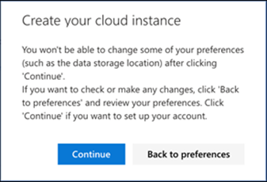

# Konfigurieren von Microsoft Threat Protection-Säulen für Ihre Testlaborumgebung

**Gilt für:**
- Microsoft Threat Protection

Das Erstellen einer Microsoft Threat Protection-Test Umgebungsumgebung und deren Bereitstellung ist ein dreistufiger Prozess:

 
<table border="0" width="100%" align="center">
  <tr style="text-align:center;">
    <td align="center" style="width:25%; border:0;" >
      <a href= "https://docs.microsoft.com/microsoft-365/security/mtp/prepare-mtpeval?view=o365-worldwide"> 
        
       Phase 1: Vorbereiten</a> 
    </td>
     <td align="center">
      <a href="https://docs.microsoft.com/microsoft-365/security/mtp/setup-mtpeval?view=o365-worldwide">
        
       Phase 2: Setup</a> 
    </td>
    <td align="center" bgcolor="#d5f5e3">
      <a href="https://docs.microsoft.com/microsoft-365/security/mtp/config-mtpeval?view=o365-worldwide">
        
       Phase 3: Konfigurieren von & Onboard</a> 
</td>

  </tr>
</table>

Sie befinden sich derzeit in der Konfigurationsphase.

Die Vorbereitung ist für eine erfolgreiche Bereitstellung entscheidend. In diesem Artikel werden Sie auf die Punkte hingewiesen, die Sie bei der Vorbereitung der Bereitstellung von Microsoft Defender ATP berücksichtigen müssen.

## Microsoft Threat Protection-Säulen
Microsoft Threat Protection besteht aus vier Pfeilern. Auch wenn ein Pfeiler bereits einen Mehrwert für die Sicherheit ihrer Netzwerkorganisation bieten kann, bietet die Aktivierung der vier Microsoft-Bedrohungsschutz-Pfeiler Ihrer Organisation den größten Nutzen.

  

In diesem Abschnitt erhalten Sie Informationen zu configure:
-   Office 365 Advanced Threat Protection
-   Azure Advanced Threat Protection 
-   Microsoft Cloud App Security
-   Microsoft Defender Advanced Threat Protection

## Konfigurieren Office 365 Advanced Threat Protection
>[!NOTE]
>Überspringen Sie diesen Schritt, wenn Sie bereits Office 365 Advanced Threat Protection aktiviert haben. 

Es gibt ein PowerShell-Modul namens *Office 365 Advanced Threat Protection Recommended Configuration Analyzer (Orca)* , mit dem einige dieser Einstellungen ermittelt werden können. Wenn Sie als Administrator in Ihrem Mandanten ausgeführt wird, hilft Get-ORCAReport bei der Erstellung einer Bewertung der Anti-Spam-, Anti-Phishing-und anderer Nachrichten Hygiene Einstellungen. Sie können dieses Modul aus https://www.powershellgallery.com/packages/ORCA/herunterladen. 

1. Navigieren Sie zu [Office 365 Security & Compliance Center](https://protection.office.com/homepage) > **Threat Management** > **Policy**.
  
 
2. Klicken Sie auf **ATP-Anti-Phishing**, wählen Sie **Create** aus, und geben Sie den Richtliniennamen und die Beschreibung ein. Klicken Sie auf **Weiter**.
  

>[!NOTE]
>Bearbeiten Sie Ihre erweiterte ATP-Richtlinie zum Schutz vor Phishing. Ändern Sie den **Advanced Phishing Threshold** in **2-aggressive**.
 

3. Klicken Sie auf das Dropdownmenü **Bedingung hinzufügen** , und wählen Sie Ihre Domäne (n) als Empfängerdomäne aus. Klicken Sie auf **Weiter**.
  
 
4. Überprüfen Sie Ihre Einstellungen. Klicken Sie zum bestätigen auf **Diese Richtlinie erstellen** . 
  
 
5. Wählen Sie **ATP-sichere Anlagen** aus, und aktivieren Sie die Option **ATP für SharePoint, OneDrive und Microsoft Teams aktivieren** .  
  

6. Klicken Sie auf das Symbol +, um eine neue Richtlinie für sichere Anlagen zu erstellen und diese als Empfängerdomäne auf Ihre Domänen anzuwenden. Klicken Sie auf **Speichern**.
  
 
7. Wählen Sie als nächstes die Richtlinie **ATP-sichere Links** aus, und klicken Sie dann auf das Bleistiftsymbol, um die Standardrichtlinie zu bearbeiten.

8. Stellen Sie sicher, dass die Option nicht **nachverfolgen, wenn Benutzer auf sichere Links klicken** ausgewählt ist, während die restlichen Optionen ausgewählt sind. Details finden Sie unter [Einstellungen für sichere Links](https://docs.microsoft.com/microsoft-365/security/office-365-security/recommended-settings-for-eop-and-office365-atp?view=o365-worldwide) . Klicken Sie auf **Speichern**. 
  

9. Wählen Sie als nächstes die **Antischadsoftware-** Richtlinie aus, wählen Sie die Standardeinstellung aus, und wählen Sie das Bleistiftsymbol aus.

10. Klicken Sie auf **Einstellungen** und dann auf **Ja, und verwenden Sie den standardmäßigen Benachrichtigungstext** , um die **Malware Erkennungs Antwort**zu aktivieren. Aktivieren Sie den **Filter allgemeine Anlagentypen** . Klicken Sie auf **Speichern**.
   
  
11. Navigieren Sie zu [Office 365 Security & Compliance Center](https://protection.office.com/homepage) > -**Such** > **Überwachungsprotokoll-Suche** , und aktivieren Sie die Überwachung.  
  

12. Integrieren Sie Office 365 ATP mit Microsoft Defender ATP. Navigieren Sie zu [Office 365 Security & Compliance Center](https://protection.office.com/homepage) > **Threat Management** > **Explorer** , und wählen Sie **WDATP-Einstellungen** in der oberen rechten Ecke des Bildschirms aus. Aktivieren Sie im Dialogfeld Microsoft Defender ATP Connection die Option **Connect to Windows ATP**.
  

## Konfigurieren von Azure Advanced Threat Protection
>[!NOTE]
>Überspringen Sie diesen Schritt, wenn Sie Azure Advanced Threat Protection bereits aktiviert haben.

1. Navigieren Sie zum [Microsoft 365 Security Center](https://security.microsoft.com/info) > wählen Sie **Weitere Ressourcen** > **Azure Advanced Threat Protection**aus.
  

2. Klicken Sie auf **Erstellen** , um den Azure Advanced Threat Protection-Assistenten zu starten. 
   

3. Wählen Sie **Geben Sie einen Benutzernamen und ein Kennwort ein, um eine Verbindung mit Ihrer Active Directory Gesamtstruktur herzustellen**.  
  

4. Geben Sie Ihre Active Directory lokalen Anmeldeinformationen ein. Hierbei kann es sich um ein beliebiges Benutzerkonto handeln, das über Lesezugriff auf Active Directory verfügt.
  

5. Wählen Sie als nächstes **Download Sensor Setup** aus, und übertragen Sie die Datei auf Ihren Domänencontroller. 
  

6. Führen Sie das Azure ATP-Sensor Setup aus, und folgen Sie dem Assistenten.
   
 
7. Klicken Sie im Sensor Bereitstellungs auf **weiter** .
   
 
8. Kopieren Sie die Zugriffstaste so, wie Sie Sie als nächstes im Assistenten eingeben müssen.
  
 
9. Kopieren Sie den Zugriffsschlüssel in den Assistenten, und klicken Sie auf **Installieren**. 
   

10. Herzlichen Glückwunsch, Sie haben Azure Advanced Threat Protection auf Ihrem Domänencontroller erfolgreich konfiguriert.
  
 
11. Wählen Sie im Abschnitt [Azure Azure ATP](https://go.microsoft.com/fwlink/?linkid=2040449) -Einstellungen die Option **Windows Defender ATP**aus, und aktivieren Sie dann die Umschaltfläche. Klicken Sie auf **Speichern**. 
  

>[!NOTE]
>Windows Defender ATP wurde als Microsoft Defender ATP umbenannt. Das neubranding von Änderungen in allen Portalen wird für die Konsistenz eingeführt.

## Konfigurieren der Microsoft Cloud-App-Sicherheit
>[!NOTE]
>Überspringen Sie diesen Schritt, wenn Sie Microsoft Cloud App Security bereits aktiviert haben. 

1. Navigieren Sie zu [Microsoft 365 Security Center](https://security.microsoft.com/info) > **Weitere Ressourcen** > **Microsoft Cloud-App-Sicherheit**.
  

2. Wählen Sie an der Informations Aufforderung zur Integration von Azure ATP die Option **Azure ATP-Datenintegration aktivieren**aus. 
   

>[!NOTE]
>Wenn diese Eingabeaufforderung nicht angezeigt wird, kann dies bedeuten, dass Ihre Azure ATP-Datenintegration bereits aktiviert wurde. Wenn Sie sich jedoch nicht sicher sind, wenden Sie sich an Ihren IT-Administrator, um dies zu bestätigen. 

3. Wechseln Sie zu **Einstellungen**, aktivieren Sie die **Azure ATP-Integration** , und klicken Sie dann auf **Speichern**. 
  
>[!NOTE]
>Für neue Azure ATP-Instanzen wird diese Integrations Toggle automatisch aktiviert. Vergewissern Sie sich, dass Ihre Azure ATP-Integration aktiviert wurde, bevor Sie mit dem nächsten Schritt fortfahren.
 
4. Wählen Sie unter den Einstellungen für die Cloud-Ermittlung die Option **Microsoft Defender ATP-Integration**aus, und aktivieren Sie dann die Integration. Klicken Sie auf **Speichern**.
  

5. Wählen Sie unter Einstellungen für die Cloud-Ermittlung die Option **Benutzer Bereicherung**aus, und aktivieren Sie dann die Integration in Azure Active Directory.
  

## Konfigurieren von Microsoft Defender Advanced Threat Protection
>[!NOTE]
>Überspringen Sie diesen Schritt, wenn Sie Microsoft Defender Advanced Threat Protection bereits aktiviert haben.

1. Navigieren Sie zu [Microsoft 365 Security Center](https://security.microsoft.com/info) > **Weitere Ressourcen** > **Microsoft Defender Security Center**. Klicken Sie auf **Öffnen**.
   
 
2. Führen Sie den Microsoft Defender Advanced Threat Protection-Assistenten aus. Klicken Sie auf **Weiter**. 
   

3. Wählen Sie basierend auf dem bevorzugten Datenspeicherort, der Datenaufbewahrungsrichtlinie, der Organisationsgröße und dem Opt-in für Vorschau Features aus. 
   
>[!NOTE]
>Einige Einstellungen wie der Datenspeicherort können anschließend nicht mehr geändert werden. 
 

Klicken Sie auf **Weiter**. 

4. Klicken Sie auf **weiter** , und Sie wird Ihren Microsoft Defender ATP-Mandanten anbieten.
   

5. An Bord ihrer Endpunkte durch Gruppenrichtlinien, Microsoft Endpoint Manager oder durch Ausführen eines lokalen Skripts für Microsoft Defender ATP. Zur Vereinfachung verwendet dieses Handbuch das lokale Skript.

6. Klicken Sie auf **Paket herunterladen** , und kopieren Sie das Onboarding-Skript an Ihre (n) Endpunkte.  
   

7. Führen Sie auf ihrem Endpunkt das Onboarding-Skript als Administrator aus, und wählen Sie Y aus.
   

8. Herzlichen Glückwunsch, Sie haben ihren ersten Endpunkt an Bord.  
   

9. Copy-fügen Sie den Erkennungstest aus dem Microsoft Defender ATP-Assistenten ein.
   

10. Kopieren Sie das PowerShell-Skript an eine Eingabeaufforderung mit erhöhten Rechten, und führen Sie es aus. 
   

11. Wählen Sie im Assistenten die Option **mit Microsoft Defender ATP starten** aus.
   
 
12. Besuchen Sie das [Microsoft Defender Security Center](https://securitycenter.windows.com/). Wechseln Sie zu **Einstellungen** , und wählen Sie dann **Erweiterte Funktionen**aus. 
   

13. Aktivieren Sie die Integration in **Azure Advanced Threat Protection**.  
   

14. Aktivieren Sie die Integration mit **Office 365 Threat Intelligence**.
   

15. Aktivieren Sie die Integration in **Microsoft Cloud App Security**.
   

16. Scrollen Sie nach unten, und klicken Sie auf **Einstellungen speichern** , um die neuen Integrationen zu bestätigen.
   

## Nächste Schritte
[Aktivieren Sie Microsoft Threat Protection](https://docs.microsoft.com/microsoft-365/security/mtp/mtp-enable?view=o365-worldwide#start-using-the-service) , und [generieren Sie dann eine Testwarnung](generate-test-alert.md).
