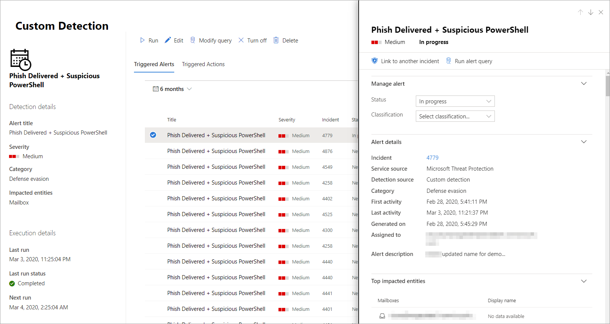

# <a name="create-and-manage-custom-detections-rules"></a>Erstellen und Verwalten von benutzerdefinierten Erkennungsregeln

**Gilt für:**
- Microsoft Threat Protection

[!INCLUDE [Prerelease information](../includes/prerelease.md)]

Mithilfe von benutzerdefinierten Erkennungsregeln, die aus [erweiterten Jagd](advanced-hunting-overview.md) Abfragen erstellt wurden, können Sie verschiedene Ereignisse und Systemzustände proaktiv überwachen, einschließlich mutmaßlicher Sicherheitsverletzungen und falsch konfigurierter Endpunkte. Sie können festlegen, dass Sie in regelmäßigen Intervallen ausgeführt werden, indem Sie Warnungen generieren und Reaktions Aktionen ausführen, wenn Übereinstimmungen vorliegen.

## <a name="required-permissions-for-managing-custom-detections"></a>Erforderliche Berechtigungen zum Verwalten benutzerdefinierter Erkennungen

Um benutzerdefinierte Erkennungen zu verwalten, müssen Sie eine der folgenden Rollen zugewiesen werden:

- **Sicherheitsadministrator** – die Rolle "Sicherheitsadministrator" oder "Sicherheitsadministrator" ist eine [Azure Active Directory Rolle](https://docs.microsoft.com/azure/active-directory/users-groups-roles/directory-assign-admin-roles#security-administrator) für die Verwaltung verschiedener Sicherheitseinstellungen im Microsoft 365 Security Center und verschiedener Portale und Dienste.

- **Sicherheits Operator** – die Sicherheits Operatorrolle ist eine [Azure Active Directory Rolle](https://docs.microsoft.com/azure/active-directory/users-groups-roles/directory-assign-admin-roles#security-administrator) zum Verwalten von Warnungen und verfügt über einen globalen schreibgeschützten Zugriff auf sicherheitsbezogene Features, einschließlich aller Informationen im Microsoft 365 Security Center. Diese Rolle reicht aus, um benutzerdefinierte Erkennungen nur dann zu verwalten, wenn die rollenbasierte Zugriffssteuerung (Role-Based Access Control, RBAC) in Microsoft Defender ATP deaktiviert ist. Wenn Sie RBAC konfiguriert haben, benötigen Sie auch die Berechtigung **Sicherheitseinstellungen verwalten** für Microsoft Defender ATP.

Um die erforderlichen Berechtigungen zu verwalten, kann ein **globaler Administrator** folgende Aufgaben ausführen:

- Weisen Sie die Rolle " **Sicherheitsadministrator** " oder " **Sicherheits Operator** " im [Microsoft 365 Admin Center](https://admin.microsoft.com/) unter **roles** > **Security Admin**zu.
- Überprüfen Sie die RBAC-Einstellungen für Microsoft Defender ATP im [Microsoft Defender Security Center](https://securitycenter.windows.com/) unter **Einstellungen** > **Berechtigungs** > **Rollen**. Wählen Sie die entsprechende Rolle aus, um die Berechtigung **Sicherheitseinstellungen verwalten** zuzuweisen.

> [!NOTE]
> Zum Verwalten von benutzerdefinierten Erkennungen benötigen **Sicherheits Operatoren** die Berechtigung **Sicherheitseinstellungen verwalten** in Microsoft Defender ATP, wenn RBAC aktiviert ist.

## <a name="create-a-custom-detection-rule"></a>Erstellen einer benutzerdefinierten Erkennungsregel
### <a name="1-prepare-the-query"></a>1. bereiten Sie die Abfrage vor.

Wechseln Sie im Microsoft 365 Security Center zu **Advanced Hunting** , und wählen Sie eine vorhandene Abfrage aus, oder erstellen Sie eine neue Abfrage. Wenn Sie eine neue Abfrage verwenden, führen Sie die Abfrage aus, um Fehler zu identifizieren und mögliche Ergebnisse zu verstehen.

#### <a name="required-columns-in-the-query-results"></a>Erforderliche Spalten in den Abfrageergebnissen
Um eine benutzerdefinierte Erkennungsregel zu erstellen, muss die Abfrage die folgenden Spalten zurückgeben:

- `Timestamp`
- Eine der folgenden Spalten für Geräte, Benutzer oder Postfächer:
    - `DeviceId`
    - `DeviceName`
    - `RemoteDeviceName`
    - `RecipientEmailAddress`
    - `SenderFromAddress`(Absender der Umschlags-oder Rückgabepfad Adresse)
    - `SenderMailFromAddress`(Absenderadresse wird vom e-Mail-Client angezeigt)
    - `RecipientObjectId`
    - `AccountSid`
    - `InitiatingProcessAccountSid`
    - `InitiatingProcessAccountUpn`
    - `InitiatingProcessAccountObjectId`
>[!NOTE]
>Die Unterstützung zusätzlicher Entitäten wird hinzugefügt, wenn dem [erweiterten Jagd Schema](advanced-hunting-schema-tables.md)neue Tabellen hinzugefügt werden.

Einfache Abfragen, beispielsweise solche, die den `project` or `summarize` -Operator nicht zum Anpassen oder Aggregieren von Ergebnissen verwenden, geben normalerweise diese allgemeinen Spalten zurück.

Es gibt verschiedene Möglichkeiten, um sicherzustellen, dass komplexere Abfragen diese Spalten zurückgeben. Wenn Sie beispielsweise die Aggregate und die Anzahl nach Entitäten in einer Spalte wie verwenden `DeviceId`möchten, können Sie dennoch `Timestamp` zurückkehren, indem Sie Sie aus dem letzten Ereignis `DeviceId`abrufen, das die einzelnen Eindeutigkeiten umfasst.

Die folgende Beispielabfrage zählt die Anzahl der eindeutigen Computer (`DeviceId`) mit Antivirus-Erkennungen und verwendet diese Anzahl, um nur die Computer mit mehr als fünf Erkennungen zu finden. Um die neueste Version `Timestamp`zurückzugeben, wird `summarize` der Operator mit `arg_max` der-Funktion verwendet.

```kusto
DeviceEvents
| where Timestamp > ago(7d)
| where ActionType == "AntivirusDetection"
| summarize Timestamp = max(Timestamp), count() by DeviceId
| where count_ > 5
```
### <a name="2-create-new-rule-and-provide-alert-details"></a>2. Erstellen Sie eine neue Regel, und geben Sie Warnungsdetails an.

Wählen Sie mit der Abfrage im Abfrage-Editor **Erkennungsregel erstellen** aus, und geben Sie die folgenden Warnungsdetails an:

- **Erkennungsname** – Name der Erkennungsregel
- **Häufigkeit** – Intervall zum Ausführen der Abfrage und ergreifen von Aktionen. [Weitere Anleitungen finden Sie weiter unten.](#rule-frequency)
- **Warnungs Titel** – Titel mit Warnungen, die von der Regel ausgelöst werden
- **Schweregrad** – potenzielles Risiko der von der Regel identifizierten Komponente oder Aktivität
- **Category** – Bedrohungs Komponente oder Aktivität, die von der Regel identifiziert wird
- **Mitra ATT&ck Techniques** – eine oder mehrere von der Regel identifizierte Angriffstechniken, wie im [Mitra ATT&ck-Framework](https://attack.mitre.org/) dokumentiert
- **Description** – Weitere Informationen zur von der Regel identifizierten Komponente oder Aktivität 
- **Empfohlene Aktionen** – zusätzliche Aktionen, die Responder als Reaktion auf eine Warnung ausführen können

#### <a name="rule-frequency"></a>Regel Häufigkeit
Beim Speichern wird eine neue oder bearbeitete benutzerdefinierte Erkennungsregel sofort ausgeführt, und die Daten werden auf Übereinstimmungen der letzten 30 Tage überprüft. Die Regel wird dann in festen Intervallen und Lookback dauern basierend auf der von Ihnen gewählten Häufigkeit erneut ausgeführt:

- **Alle 24 Stunden** : wird alle 24 Stunden ausgeführt, und die Daten der letzten 30 Tage werden überprüft.
- **Alle 12 Stunden** -wird alle 12 Stunden ausgeführt, und die Daten der letzten 24 Stunden werden überprüft.
- **Alle 3 Stunden** : wird alle 3 Stunden ausgeführt, und die Daten aus den letzten 6 Stunden werden überprüft.
- **Stündlich – stündlich** ausgeführt, Daten aus den letzten 2 Stunden werden überprüft

Wählen Sie die Häufigkeit aus, die der Art und Weise entspricht, in der die Erkennungen überwacht werden sollen, und prüfen Sie die Kapazität Ihrer Organisation, auf die Warnungen zu reagieren.

### <a name="3-choose-the-impacted-entities"></a>3. Wählen Sie die betroffenen Entitäten aus.
Identifizieren Sie die Spalten in den Abfrageergebnissen, bei denen Sie davon ausgehen, dass Sie die Hauptbetroffene oder betroffene Entität finden. Beispielsweise kann eine Abfrage Absender (`SenderFromAddress` oder `SenderMailFromAddress`)-und Empfängeradressen (`RecipientEmailAddress`) zurückgeben. Das Identifizieren der Spalten, die die Hauptbetroffene Entität darstellen, hilft dem Dienst, relevante Warnungen zu aggregieren, Vorfälle und Ziel Antwort Aktionen zu korrelieren.

Sie können für jeden Entitätstyp (Postfach, Benutzer oder Gerät) nur eine Spalte auswählen. Spalten, die nicht von der Abfrage zurückgegeben werden, können nicht ausgewählt werden.

### <a name="4-specify-actions-on-files-or-machines"></a>4. Geben Sie Aktionen für Dateien oder Computer an.
Ihre benutzerdefinierte Erkennungsregel kann automatisch Aktionen für Dateien oder Computer durchführen, die von der Abfrage zurückgegeben werden.

#### <a name="actions-on-machines"></a>Aktionen auf Computern
Diese Aktionen werden auf Computer in der `DeviceId` Spalte der Abfrageergebnisse angewendet:
- **Isolate Machine** – mit Microsoft Defender ATP wird die vollständige Netzwerkisolation angewendet, wodurch verhindert wird, dass der Computer eine Verbindung mit einer Anwendung oder einem Dienst herstellt. [Weitere Informationen zur Isolierung von Microsoft Defender ATP-Computern](https://docs.microsoft.com/windows/security/threat-protection/microsoft-defender-atp/respond-machine-alerts#isolate-machines-from-the-network)
- **Ermittlungs Paket sammeln** – sammelt Computer Informationen in einer ZIP-Datei. [Weitere Informationen zum Microsoft Defender ATP-Ermittlungs Paket](https://docs.microsoft.com/windows/security/threat-protection/microsoft-defender-atp/respond-machine-alerts#collect-investigation-package-from-machines)
- **Ausführen eines Antivirus-Scans** – führt eine vollständige Windows Defender-Antivirus-Überprüfung auf dem Computer aus.
- **Einleitung einer Untersuchung** – initiiert eine [automatisierte Untersuchung](mtp-autoir.md) auf dem Computer

#### <a name="actions-on-files"></a>Aktionen für Dateien
Wenn diese Option ausgewählt ist, wird die **Quarantänedatei** -Aktion für Dateien `SHA1`in `InitiatingProcessSHA1`der `SHA256`,, `InitiatingProcessSHA256` oder Spalte der Abfrageergebnisse ausgeführt. Mit dieser Aktion wird die Datei von Ihrem aktuellen Speicherort gelöscht und eine Kopie in Quarantäne platziert.

> [!NOTE]
> Die Aktion zulassen oder blockieren für benutzerdefinierte Erkennungsregeln wird derzeit von Microsoft Threat Protection nicht unterstützt.

### <a name="5-set-the-rule-scope"></a>5. Legen Sie den Regelbereich fest.
Legen Sie den Bereich fest, um anzugeben, welche Geräte von der Regel abgedeckt werden. Der Bereich beeinflusst Regeln, die Geräte überprüfen, und wirkt sich nicht auf Regeln aus, die nur Postfächer und Benutzerkonten oder Identitäten überprüfen.

Beim Festlegen des Bereichs können Sie Folgendes auswählen:

- Alle Geräte
- Bestimmte Gerätegruppen

Es werden nur Daten von Geräten im Bereich abgefragt. Außerdem werden Aktionen nur auf diesen Geräten ausgeführt.

### <a name="6-review-and-turn-on-the-rule"></a>6. überprüfen und aktivieren Sie die Regel.
Nachdem Sie die Regel überprüft haben, klicken Sie auf **Erstellen** , um Sie zu speichern. Die benutzerdefinierte Erkennungsregel wird sofort ausgeführt. Er wird basierend auf der konfigurierten Häufigkeit erneut ausgeführt, um nach Übereinstimmungen zu suchen, Warnungen zu generieren und Reaktions Aktionen durchführen zu können.

## <a name="manage-existing-custom-detection-rules"></a>Verwalten vorhandener benutzerdefinierter Erkennungsregeln
Sie können die Liste der vorhandenen benutzerdefinierten Erkennungsregeln anzeigen, Ihre vorherigen Ausführungen überprüfen und die von Ihnen ausgelösten Warnungen überprüfen. Sie können auch eine Regel bei Bedarf ausführen und diese ändern.

### <a name="view-existing-rules"></a>Anzeigen vorhandener Regeln

Um alle vorhandenen benutzerdefinierten Erkennungsregeln anzuzeigen, navigieren Sie zu**benutzerdefinierten**Erkennungen für die **Suche** > . Auf der Seite werden alle Regeln mit den folgenden Ausführungsinformationen aufgelistet:

- **Letzte Ausführung** : beim letzten Ausführen einer Regel, um nach Abfrage Übereinstimmungen zu suchen und Warnungen zu generieren
- **Status der letzten Ausführung** – gibt an, ob eine Regel erfolgreich ausgeführt wurde
- **Nächster Durchlauf** – die nächste geplante Ausführung
- **Status** – gibt an, ob eine Regel aktiviert oder deaktiviert wurde

### <a name="view-rule-details-modify-rule-and-run-rule"></a>Anzeigen von Regeldetails, Regel ändern und Ausführen einer Regel

Wenn Sie umfassende Informationen zu einer **benutzerdefinierten Erkennungs** > Regel anzeigen möchten, wählen Sie in der Liste der Regeln unter**benutzerdefinierte**Erkennungen den Namen der Regel aus. Dadurch wird eine Seite zur benutzerdefinierten Erkennungsregel mit allgemeinen Informationen zur Regel geöffnet, einschließlich der Details der Warnung, des Ausführungsstatus und des Bereichs. Außerdem wird die Liste der ausgelösten Warnungen und ausgelösten Aktionen bereitgestellt.

<br>
*Details der benutzerdefinierten Erkennungsregel*

Auf dieser Seite können Sie auch die folgenden Aktionen für die Regel ausführen:

- **Ausführen** – die Regel wird sofort ausgeführt. Dadurch wird auch das Intervall für die nächste Ausführung zurückgesetzt.
- **Bearbeiten** – Ändern der Regel, ohne die Abfrage zu ändern
- **Abfrage ändern** – Bearbeiten der Abfrage in erweiterter Suche
- **Aktivieren Deaktivieren –** Aktivieren der Regel oder Beenden der Ausführung**Turn off**  / 
- **Delete** – deaktivieren Sie die Regel, und entfernen Sie Sie.

### <a name="view-and-manage-triggered-alerts"></a>Anzeigen und Verwalten von ausgelösten Warnungen

Wechseln Sie im Bildschirm Regel**Details (** > **benutzerdefinierte Erkennungs Erkennungen** > **[Regelname]**) zu **ausgelöste Warnungen** , um die Liste der Warnungen anzuzeigen, die von Übereinstimmungen mit der Regel generiert wurden. Wählen Sie eine Warnung aus, um detaillierte Informationen zu dieser Warnung anzuzeigen, und führen Sie die folgenden Aktionen für diese Warnung aus:

- Verwalten der Warnung durch Festlegen des Status und der Klassifizierung (true oder false Alert)
- Verknüpfen der Warnung mit einem Vorfall
- Ausführen der Abfrage, die die Warnung bei Advanced Hunting ausgelöst hat

### <a name="review-actions"></a>Überprüfen von Aktionen
Wechseln Sie im Bildschirm Regel**Details (** > **benutzerdefinierte Erkennungs Erkennungen** > **[Regelname]**) zu **ausgelöste Aktionen** , um die Liste der ausgeführten Aktionen anzuzeigen, die auf Übereinstimmungen mit der Regel basieren.

>[!TIP]
>Um Informationen schnell anzuzeigen und Aktionen für ein Element in einer Tabelle durchführen zu können, verwenden Sie die Auswahlspalte [&#10003;] Links in der Tabelle.

## <a name="related-topic"></a>Verwandtes Thema
- [Benutzerdefinierte Erkennungen – Übersicht](custom-detections-overview.md)
- [Übersicht über die erweiterte Suche](advanced-hunting-overview.md)
- [Erlernen der Abfragesprache für die erweiterte Suche](advanced-hunting-query-language.md)
