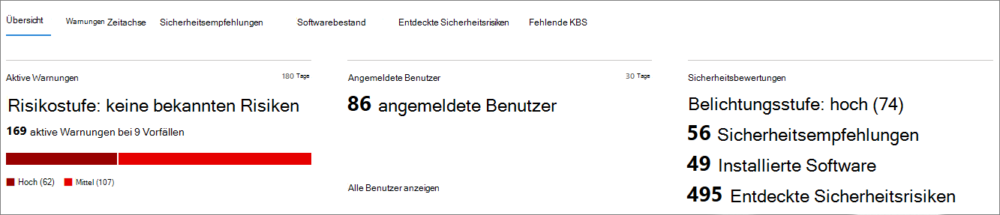
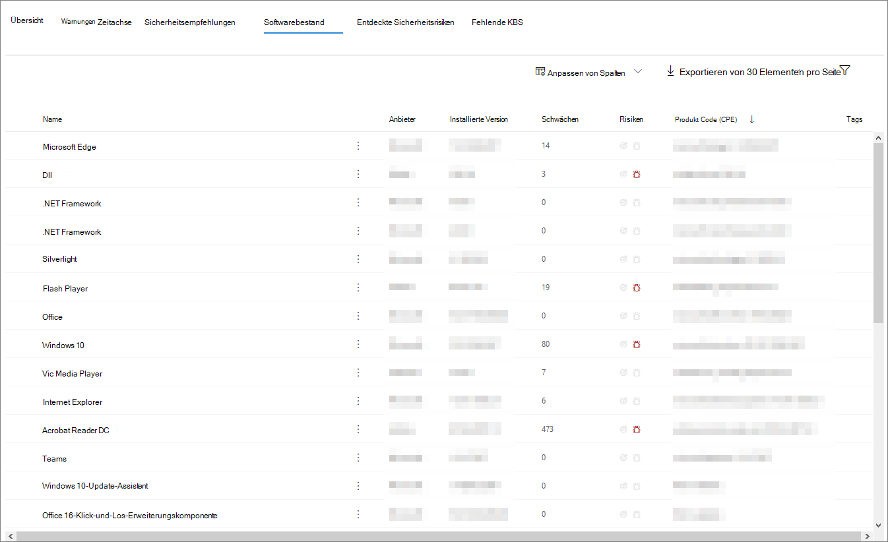
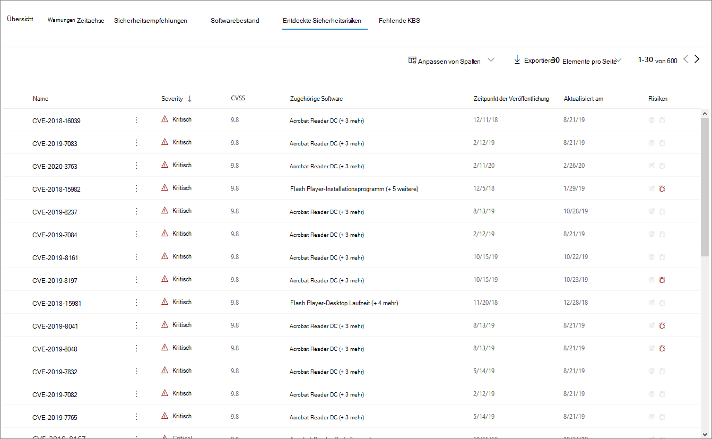

# Geräteprofil SeiteDevice profile page

Das Microsoft 365-Sicherheitsportal bietet Ihnen Geräteprofil Seiten, sodass Sie die Integrität und den Status von Geräten in Ihrem Netzwerk schnell bewerten können.The Microsoft 365 security portal provides you with device profile pages, so you can quickly assess the health and status of devices on your network.

> [!IMPORTANT]
> Die Geräteprofil Seite erscheint möglicherweise geringfügig anders, je nachdem, ob das Gerät in Microsoft Defender ATP, Azure ATP oder in beiden registriert ist.The device profile page may appear slightly different, depending on whether the device is enrolled in Microsoft Defender ATP, Azure ATP, or both.

Wenn das Gerät in Microsoft Defender ATP registriert ist, können Sie auch die Geräteprofil Seite verwenden, um einige allgemeine Sicherheitsaufgaben auszuführen.If the device is enrolled in Microsoft Defender ATP, you can also use the device profile page to perform some common security tasks.

## Navigieren auf der Geräteprofil SeiteNavigating the device profile page

Die Profilseite ist in mehrere allgemeine Abschnitte unterteilt.The profile page is broken up into several broad sections.

In der Sidebar (1) werden grundlegende Details zum Gerät aufgelistet.The sidebar (1) lists basic details about the device.

Der Hauptinhaltsbereich (2) enthält Registerkarten, die Sie umschalten können, um verschiedene Arten von Informationen zum Gerät anzuzeigen.The main content area (2) contains tabs that you can toggle through to view different kinds of information about the device.

Wenn das Gerät in Microsoft Defender ATP registriert ist, wird auch eine Liste der Antwort Aktionen angezeigt (3).If the device is enrolled in Microsoft Defender ATP, you will also see a list of response actions (3). Mit Antwort Aktionen können Sie häufige sicherheitsbezogene Aufgaben ausführen.Response actions allow you to perform common security-related tasks.

## RandleisteSidebar

Neben dem Hauptinhaltsbereich der Geräteprofil Seite befindet sich die Sidebar.Beside the main content area of the device profile page is the sidebar.

In der Sidebar werden der vollständige Name und die Expositions Ebene des Geräts aufgeführt.The sidebar lists the device's full name and exposure level. Sie enthält auch einige wichtige grundlegende Informationen in kleinen Unterabschnitten, die geöffnet oder geschlossen umgeschaltet werden können, beispielsweise:It also provides some important basic information in small subsections which can be toggled open or closed, such as:

* **Tags** – alle Microsoft Defender ATP-, Azure ATP-oder Custom-Tags, die dem Gerät zugeordnet sind.**Tags** - Any Microsoft Defender ATP, Azure ATP, or custom tags associated with the device. Tags aus Azure ATP können nicht bearbeitet werden.Tags from Azure ATP are not editable.
* **Sicherheitsinformationen** – offene Vorfälle und aktive Warnungen.**Security info** - Open incidents and active alerts. Geräte, die in Microsoft Defender ATP registriert sind, zeigen außerdem die Expositions Ebene und das Risikoniveau an.Devices enrolled in Microsoft Defender ATP will also display exposure level and risk level.

> [!TIP]
> Die Expositions Ebene bezieht sich darauf, wie viel das Gerät Sicherheitsempfehlungen einhält, während das Risikoniveau basierend auf einer Reihe von Faktoren berechnet wird, einschließlich der Typen und des Schweregrads aktiver Warnungen.Exposure level relates to how much the device is complying with security recommendations, while risk level is calculated based on a number of factors, including the types and severity of active alerts.

* **Gerätedetails** – Domäne, Betriebssystem, Zeitstempel für das erste erkennen des Geräts, IP-Adressen, Ressourcen.**Device details** - Domain, OS, timestamp for when the device was first seen, IP addresses, resources. Für Geräte, die in Microsoft Defender ATP registriert sind, wird auch der Integritätsstatus angezeigt.Devices enrolled in Microsoft Defender ATP also display health state. In Azure ATP eingeschriebene Geräte zeigen Sam-Namen und einen Zeitstempel für den Zeitpunkt an, zu dem das Gerät erstmalig erstellt wurde.Devices enrolled in Azure ATP will display SAM name and a timestamp for when the device was first created.
* **Netzwerkaktivität** – Zeitstempel zum ersten Mal und zum letzten Mal, als das Gerät im Netzwerk angezeigt wurde.**Network activity** - Timestamps for the first time and last time the device was seen on the network.
* **Verzeichnisdaten** (*nur für Geräte, die in Azure ATP registriert*sind) – [UAC](https://docs.microsoft.com/windows/security/identity-protection/user-account-control/user-account-control-overview) -Flags, [SPNs](https://docs.microsoft.com/windows/win32/ad/service-principal-names)und Gruppenmitgliedschaften.**Directory data** (*only for devices enrolled in Azure ATP*) - [UAC](https://docs.microsoft.com/windows/security/identity-protection/user-account-control/user-account-control-overview) flags, [SPNs](https://docs.microsoft.com/windows/win32/ad/service-principal-names), and group memberships.

## Antwort AktionenResponse actions

Reaktions Aktionen bieten eine schnelle Möglichkeit, Bedrohungen zu schützen und zu analysieren.Response actions offer a quick way to defend against and analyze threats.

> [!IMPORTANT]
> * [Antwort Aktionen](https://docs.microsoft.com/windows/security/threat-protection/microsoft-defender-atp/respond-machine-alerts) sind nur verfügbar, wenn das Gerät in Microsoft Defender ATP registriert ist.[Response actions](https://docs.microsoft.com/windows/security/threat-protection/microsoft-defender-atp/respond-machine-alerts) are only available if the device is enrolled in Microsoft Defender ATP.
> * Geräte, die in Microsoft Defender ATP registriert sind, können basierend auf dem Betriebssystem und der Versionsnummer des Geräts unterschiedliche Nummern von Antwort Aktionen anzeigen.Devices that are enrolled in Microsoft Defender ATP may display different numbers of response actions, based on the device's OS and version number.

Die auf der Geräteprofil Seite verfügbaren Aktionen umfassen Folgendes:Actions available on the device profile page include:

* **Tags verwalten** – aktualisiert benutzerdefinierte Tags, die Sie auf dieses Gerät angewendet haben.**Manage tags** - Updates custom tags you have applied to this device.
* **Gerät isolieren** – isoliert das Gerät aus dem Netzwerk Ihrer Organisation, während es mit dem Advanced Threat Protection von Microsoft Defender verbunden bleibt.**Isolate device** - Isolates the device from your organization's network while keeping it connected to Microsoft Defender Advanced Threat Protection. Sie können festlegen, dass Outlook, Teams und Skype for Business während der Isolierung des Geräts zu Kommunikationszwecken ausgeführt werden.You can choose to allow Outlook, Teams, and Skype for Business to run while the device is isolated, for communication purposes.
* **Action Center** – zeigt den Status der übermittelten Aktionen an.**Action center** - View the status of submitted actions. Nur verfügbar, wenn bereits eine andere Aktion ausgewählt wurde.Only available if another action has already been selected.
* **Einschränken der APP-Ausführung** – verhindert, dass von Microsoft nicht signierte Anwendungen ausgeführt werden.**Restrict app execution** - Prevents applications that are not signed by Microsoft from running.
* **Antivirus-Scan ausführen** – aktualisiert die Antivirus-Definitionen von Windows Defender und führt sofort eine Antivirus-Überprüfung aus.**Run antivirus scan** - Updates Windows Defender Antivirus definitions and immediately runs an antivirus scan. Wählen Sie zwischen Schnellscan oder vollständiger Scan aus.Choose between Quick scan or Full scan.
* **Ermittlungs Paket sammeln** – sammelt Informationen zum Gerät.**Collect investigation package** - Gathers information about the device. Wenn die Untersuchung abgeschlossen ist, können Sie Sie herunterladen.When the investigation is completed, you can download it.
* **Live-Antwort-Sitzung initiieren** – lädt eine Remote-Shell auf dem Gerät für [eingehende Sicherheitsuntersuchungen](https://docs.microsoft.com/windows/security/threat-protection/microsoft-defender-atp/live-response).**Initiate Live Response Session** - Loads a remote shell on the device for [in-depth security investigations](https://docs.microsoft.com/windows/security/threat-protection/microsoft-defender-atp/live-response).
* **Initiieren der automatischen Untersuchung** – Automatisches [untersuchen und Beheben von Bedrohungen](https://docs.microsoft.com/microsoft-365/security/office-365-security/office-365-air).**Initiate automated investigation** - Automatically [investigates and remediates threats](https://docs.microsoft.com/microsoft-365/security/office-365-security/office-365-air). Sie können zwar manuell automatisierte Untersuchungen auslösen, die von dieser Seite ausgeführt werden, aber [bestimmte Warnungsrichtlinien](https://docs.microsoft.com/microsoft-365/compliance/alert-policies?view=o365-worldwide#default-alert-policies) lösen selbst automatische Untersuchungen aus.Although you can manually trigger automated investigations to run from this page, [certain alert policies](https://docs.microsoft.com/microsoft-365/compliance/alert-policies?view=o365-worldwide#default-alert-policies) trigger automatic investigations on their own.
* **Action Center** – zeigt Informationen zu allen derzeit ausgeführten Reaktions Aktionen an.**Action center** - Displays information about any response actions that are currently running.

## Tabs sectionTabs section

Auf den Registerkarten für Geräteprofile können Sie eine Übersicht über Sicherheitsdetails zu dem Gerät und Tabellen mit einer Liste von Warnungen wechseln.The device profile tabs allow you to toggle through an overview of security details about the device, and tables containing a list of alerts.

Für Geräte, die in Microsoft Defender ATP registriert sind, werden auch Registerkarten mit einer Zeitachse, eine Liste mit Sicherheitsempfehlungen, eine Softwareinventur, eine Liste der ermittelten Sicherheitsanfälligkeiten und fehlende KBS (Sicherheitsupdates) angezeigt.Devices enrolled in Microsoft Defender ATP will also display tabs that feature a timeline, a list of security recommendations, a software inventory, a list of discovered vulnerabilities, and missing KBs (security updates).

### Registerkarte "Übersicht"Overview tab

Die Standardregisterkarte ist **Overview**.The default tab is **Overview**. Es bietet einen schnellen Überblick über die wichtigsten Sicherheitsfakten zum Gerät.It provides a quick look at the most important security fact about the device.

Hier erhalten Sie einen kurzen Überblick über die aktiven Warnungen des Geräts sowie alle derzeit angemeldeten Benutzer.Here, you can get a quick look at the device's active alerts, and any currently logged on users.

Wenn das Gerät in Microsoft Defender ATP registriert ist, sehen Sie auch die Risikostufe des Geräts sowie alle verfügbaren Daten zu Sicherheitsbewertungen.If the device is enrolled in Microsoft Defender ATP, you will also see the device's risk level and any available data on security assessments. In den Sicherheitsbewertungen wird die Expositions Stufe des Geräts beschrieben, Sicherheitsempfehlungen bereitgestellt und die betroffene Software sowie entdeckte Sicherheitsrisiken aufgelistet.The security assessments describe the device's exposure level, provide security recommendations, and list affected software and discovered vulnerabilities.

### Registerkarte "Warnungen"Alerts tab

Die Registerkarte **Benachrichtigungen** enthält eine Liste der Warnungen, die auf dem Gerät ausgelöst wurden, sowohl von Azure ATP als auch von Microsoft Defender ATP.The **Alerts** tab contains a list of alerts that have been raised on the device, from both Azure ATP and Microsoft Defender ATP.

Sie können die Anzahl der angezeigten Elemente sowie die für jedes Element angezeigten Spalten anpassen.You can customize the number of items displayed, as well as which columns are displayed for each item. Das Standardverhalten besteht darin, 30 Elemente pro Seite aufzulisten.The default behavior is to list thirty items per page.

Die Spalten auf dieser Registerkarte enthalten Informationen über den Schweregrad der Bedrohung, die die Warnung ausgelöst hat, sowie den Status, den Untersuchungs Zustand und die Person, der die Warnung zugewiesen wurde.The columns in this tab include information on the severity of the threat that triggered the alert, as well as status, investigation state, and who the alert has been assigned to.

Die Spalte betroffene *Entitäten* bezieht sich auf das Gerät (Entität), dessen Profil Sie derzeit anzeigen, sowie alle anderen Geräte in Ihrem Netzwerk, die betroffen sind.The *impacted entities* column refers to the device (entity) whose profile you are currently viewing, plus any other devices in your network that are affected.

Wenn Sie ein Element aus dieser Liste auswählen, wird ein Flyout geöffnet, in dem noch weitere Informationen zur ausgewählten Warnung angezeigt werden.Selecting an item from this list will open a flyout containing even more information about the selected alert.

Diese Liste kann nach Schweregrad, Status oder der Person, der die Benachrichtigung zugewiesen wurde, gefiltert werden.This list can be filtered by severity, status, or who the alert has been assigned to.

### Registerkarte "Timeline"Timeline tab

Die Registerkarte **Zeitachse** enthält ein interaktives, Chronologisches Diagramm aller Ereignisse, die auf dem Gerät ausgelöst wurden.The **Timeline** tab includes an interactive, chronological chart of all events raised on the device. Wenn Sie den markierten Bereich des Diagramms nach links oder rechts verschieben, können Sie Ereignisse über verschiedene Zeiträume hinweg anzeigen.By moving the highlighted area of the chart left or right, you can view events over different periods of time. Sie können auch einen benutzerdefinierten Datumsbereich aus dem Dropdownmenü zwischen dem interaktiven Diagramm und der Liste der Ereignisse auswählen.You can also choose a custom range of dates from the dropdown menu in between the interactive chart and the list of events.

Unter dem Diagramm finden Sie eine Liste der Ereignisse für den ausgewählten Datumsbereich.Below the chart is a list of events for the selected range of dates.

Die Anzahl der angezeigten Elemente und die Spalten in der Liste können angepasst werden.The number of items displayed and the columns on the list can both be customized. In den Standardspalten werden die Ereigniszeit, der aktive Benutzer, der Aktionstyp, Entitäten (Prozesse) und zusätzliche Informationen zum Ereignis aufgelistet.The default columns list the event time, active user, action type, entities (processes), and additional information about the event.

Wenn Sie ein Element aus dieser Liste auswählen, wird ein Flyout geöffnet, in dem ein Ereignis Entitäten Diagramm mit den übergeordneten und untergeordneten Prozessen angezeigt wird, die an dem Ereignis beteiligt sind.Selecting an item from this list will open a flyout displaying an Event entities graph, showing the parent and child processes involved in the event.

Die Liste kann nach der spezifischen Art des Ereignisses gefiltert werden; beispielsweise Registrierungs Ereignisse oder Smart Screen-Ereignisse.The list can be filtered by the specific kind of event; for example, Registry events or Smart Screen Events.

Die Liste kann auch als Download in eine CSV-Datei exportiert werden.The list can also be exported to a CSV file, for download. Obwohl die Datei nicht durch die Anzahl der Ereignisse limitiert ist, beträgt der maximale Zeitbereich, den Sie exportieren können, sieben Tage.Although the file is not limited by number of events, the maximum time range you can choose to export is seven days.

### Registerkarte "Sicherheitsempfehlungen"Security recommendations tab

Auf der Registerkarte **Sicherheitsempfehlungen** werden Aktionen aufgeführt, die Sie zum Schutz des Geräts ausführen können.The **Security recommendations** tab lists actions you can take to protect the device. Wenn Sie ein Element in dieser Liste auswählen, wird ein Flyout geöffnet, in dem Sie Anweisungen dazu erhalten, wie Sie die Empfehlung anwenden können.Selecting an item on this list will open a flyout where you can get instructions on how to apply the recommendation.

Wie bei den vorherigen Registerkarten kann auch die Anzahl der Elemente, die pro Seite angezeigt werden, sowie die sichtbaren Spalten angepasst werden.As with the previous tabs, the number of items displayed per page, as well as which columns are visible, can be customized.

Die Standardansicht enthält Spalten, in denen die Sicherheitsschwächen, die zugehörige Bedrohung, die zugehörige Komponente oder Software, die von der Bedrohung betroffen ist, detailliert beschrieben werden und vieles mehr.The default view includes columns that detail the security weaknesses addressed, the associated threat, the related component or software affected by the threat, and more. Elemente können nach dem Status der Empfehlung gefiltert werden.Items can be filtered by the recommendation's status.

### SoftwarebestandSoftware inventory

Auf der Registerkarte **Softwareinventur** sind auf dem Gerät installierte Software aufgeführt.The **Software inventory** tab lists software installed on the device.

In der Standardansicht werden der Softwarehersteller, die installierte Versionsnummer, die Anzahl bekannter Software Schwächen, Einblicke in Bedrohungen, Produktcode und Tags angezeigt.The default view displays the software vendor, installed version number, number of known software weaknesses, threat insights, product code, and tags. Die Anzahl der angezeigten Elemente und die angezeigten Spalten können angepasst werden.The number of items displayed and which columns are displayed can both be customized.

Wenn Sie ein Element aus dieser Liste auswählen, wird ein Flyout mit weiteren Details zur ausgewählten Software sowie der Pfad und der Zeitstempel zum letzten Mal geöffnet, an dem die Software gefunden wurde.Selecting an item from this list opens a flyout containing more details about the selected software, as well as the path and timestamp for the last time the software was found.

Diese Liste kann nach Produktcode gefiltert werden.This list can be filtered by product code.

### Registerkarte "erkannte Sicherheitsanfälligkeiten"Discovered vulnerabilities tab

Auf der Registerkarte **erkannte Sicherheitsanfälligkeiten** werden alle gängigen Sicherheitsanfälligkeiten und Exploits (CVEs) aufgelistet, die sich auf das Gerät auswirken können.The **Discovered vulnerabilities** tab lists any Common Vulnerabilities and Exploits (CVEs) that may affect the device.

In der Standardansicht werden der Schweregrad von CVE, das Common Vulnerability Score (CVS), die Software im Zusammenhang mit CVE, der Veröffentlichung von CVE, der Zeitpunkt der letzten Aktualisierung von CVE und mit dem CVE verbundene Bedrohungen aufgelistet.The default view lists the severity of the CVE, the Common Vulnerability Score (CVS), the software related to the CVE, when the CVE was published, when the CVE was last updated, and threats associated with the CVE.

Wie bei den vorherigen Registerkarten kann auch die Anzahl der angezeigten Elemente und der sichtbaren Spalten angepasst werden.As with the previous tabs, the number of items displayed and which columns are visible can be customized.

Wenn Sie ein Element aus dieser Liste auswählen, wird ein Flyout geöffnet, in dem das CVE beschrieben wird.Selecting an item from this list will open a flyout that describes the CVE.

### Fehlende KBSMissing KBs

Auf der Registerkarte " **fehlende KBS** " werden alle Microsoft-Updates aufgelistet, die noch nicht auf das Gerät angewendet wurden.The **Missing KBs** tab lists any Microsoft Updates that have yet to be applied to the device. Bei der fraglichen "KBS" handelt es sich um [Knowledge Base-Artikel](https://support.microsoft.com/help/242450/how-to-query-the-microsoft-knowledge-base-by-using-keywords-and-query) , in denen diese Updates beschrieben werden. Beispiel: [KB4551762](https://support.microsoft.com/help/4551762/windows-10-update-kb4551762).The "KBs" in question are [Knowledge Base articles](https://support.microsoft.com/help/242450/how-to-query-the-microsoft-knowledge-base-by-using-keywords-and-query) which describe these updates; for example, [KB4551762](https://support.microsoft.com/help/4551762/windows-10-update-kb4551762).

In der Standardansicht wird das Bulletin mit den Updates, der Betriebssystemversion, betroffenen Produkten, CVEs, der KB-Nummer und Tags aufgelistet.The default view lists the bulletin containing the updates, OS version, products affected, CVEs addressed, the KB number, and tags.

Die Anzahl der Elemente, die pro Seite angezeigt werden, und die angezeigten Spalten können angepasst werden.The number of items displayed per page and which columns are displayed can be customized.

Durch die Auswahl eines Elements wird ein Flyout geöffnet, das auf das Update verweist.Selecting an item will open a flyout that links to the update.

## Verwandte ThemenRelated topics

* [Übersicht über Microsoft Threat ProtectionMicrosoft Threat Protection overview](microsoft-threat-protection.md)
* [Aktivieren von Microsoft Threat ProtectionTurn on Microsoft Threat Protection](mtp-enable.md)
* [Untersuchen von Entitäten auf Geräten mithilfe von Live-AntwortInvestigate entities on devices, using live response](https://docs.microsoft.com/windows/security/threat-protection/microsoft-defender-atp/live-response)
* [Automatische Untersuchung und Reaktion (Air) in Office 365Automated investigation and response (AIR) in Office 365](https://docs.microsoft.com/microsoft-365/security/office-365-security/office-365-air)
