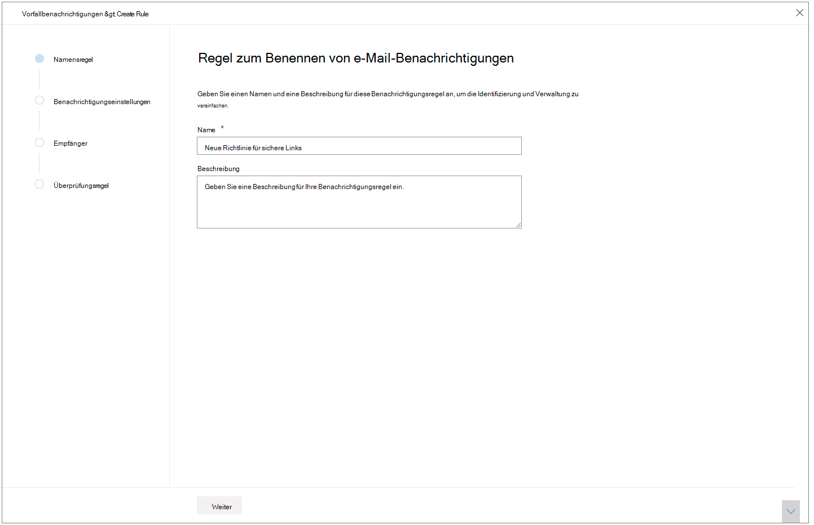
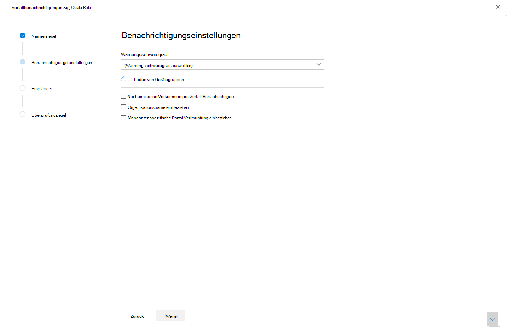
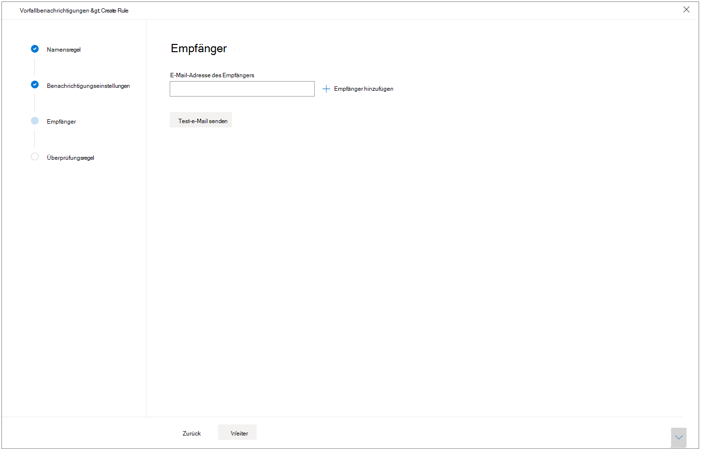

# Vorfallbenachrichtigungen per E-Mail erhalten

[!INCLUDE [Microsoft 365 Defender rebranding](../includes/microsoft-defender.md)]

**Gilt für:**
- Microsoft 365 Defender

Sie können Microsoft 365 Defender so einrichten, dass Sie per E-Mail benachrichtigt werden, wenn es neue Vorfälle oder neue Updates zu vorhandenen Vorfällen gibt. 

Sie können Benachrichtigungen basierend auf dem Schweregrad des Vorfalls oder nach Gerätegruppe erhalten. Sie können auch festlegen, dass eine Benachrichtigung nur für das erste Update pro Vorfall angezeigt wird.

Sie können Empfänger in den E-Mail-Benachrichtigungen hinzufügen oder entfernen. Neu hinzugefügte Empfänger werden über Vorfälle benachrichtigt, nachdem sie hinzugefügt wurden. 

Die E-Mail-Benachrichtigung enthält wichtige Details zu dem Vorfall, z. B. den Vorfallnamen, schweregrad und Kategorien. Sie können auch direkt zu Vorfällen wechseln, damit Sie ihre Untersuchung sofort starten können. Weitere Informationen zur Untersuchung von Vorfällen finden Sie unter [Investigate incidents in Microsoft 365 Defender](./investigate-incidents.md).

>[!NOTE]
>Sie benötigen Berechtigungen zum Verwalten von Sicherheitseinstellungen, um E-Mail-Benachrichtigungseinstellungen zu konfigurieren. Wenn Sie sich für die Verwendung der grundlegenden Berechtigungsverwaltung entschieden haben, können Benutzer mit Sicherheitsadministrator- oder globalen Administratorrollen E-Mail-Benachrichtigungen für Sie konfigurieren.    
Wenn Ihre Organisation rollenbasierte Zugriffssteuerung (Role-Based Access Control, RBAC) verwendet, können Sie nur Benachrichtigungen basierend auf Gerätegruppen erstellen, bearbeiten, löschen und empfangen, die Sie verwalten dürfen.

## Erstellen von Regeln für Vorfallbenachrichtigungen

Erstellen Sie zum Einrichten der ersten E-Mail-Benachrichtigung für Vorfälle eine neue Regel, und passen Sie die Einstellungen für E-Mail-Benachrichtigungen an.

1. Wählen Sie im Navigationsbereich Einstellungen  >  **Vorfall-E-Mail-Benachrichtigungen aus.**
2. Wählen **Sie Element hinzufügen aus.**
3. Geben Sie der Regel einen Namen in **Name und** geben Sie eine **Beschreibung an.**

     
4. Wählen **Sie Weiter** aus, um zu **Benachrichtigungseinstellungen zu wechseln.** Hier können Sie angeben:
    - **Warnungsschweregrad:** Wählen Sie den Warnungsschweregrad aus, der eine Vorfallbenachrichtigung auslöst. Wenn Sie beispielsweise nur über Vorfälle mit hohem Schweregrad informiert werden möchten, wählen Sie Hoch aus.
    - **Gerätegruppenbereich** – In diesem Dropdown werden alle Gerätegruppen angezeigt, auf die der Benutzer zugreifen kann. Wählen Sie aus, für welche Gerätegruppen Sie die Vorfallbenachrichtigungsregeln erstellen.
    - **Nur beim ersten Auftreten pro** Vorfall benachrichtigen – Wenn Sie diese Option auswählen, wird nur bei der ersten Warnung eine E-Mail-Benachrichtigung gesendet, die Mit Ihrer anderen Auswahl entspricht. Spätere Updates oder Warnungen im Zusammenhang mit dem Vorfall lösen keine Benachrichtigung aus.
    - **Name der Organisation angeben** – Gibt an, ob der Name des Kunden in der E-Mail-Benachrichtigung angezeigt wird oder nicht.
    - **Mandantenspezifischer Portallink hinzufügen** – Fügt einen Link mit der Mandanten-ID hinzu, um zugriff auf einen bestimmten Mandanten zu ermöglichen.
    
    
5. Wählen **Sie Weiter** aus, um den Abschnitt **Empfänger** zu wechseln. Hier können Sie E-Mail-Adressen angeben, die die Vorfall-E-Mail-Benachrichtigungen erhalten. Wählen **Sie Nach eingabe jeder** E-Mail-Adresse einen Empfänger hinzufügen aus.

     

6. Wählen Sie schließlich **Weiter** aus, um zu **Überprüfungsregel zu wechseln,** damit Sie alle Einstellungen sehen können, die ihrer neuen Regel zugeordnet sind. Empfänger erhalten Benachrichtigungen über Vorfälle über E-Mail basierend auf den Einstellungen.

## Siehe auch
- [Übersicht über Vorfälle in Microsoft 365 Defender](./incidents-overview.md)
- [Priorisieren von Vorfällen in Microsoft 365 Defender](./incident-queue.md)
- [Untersuchen von Vorfällen in Microsoft 365 Defender](./investigate-incidents.md)