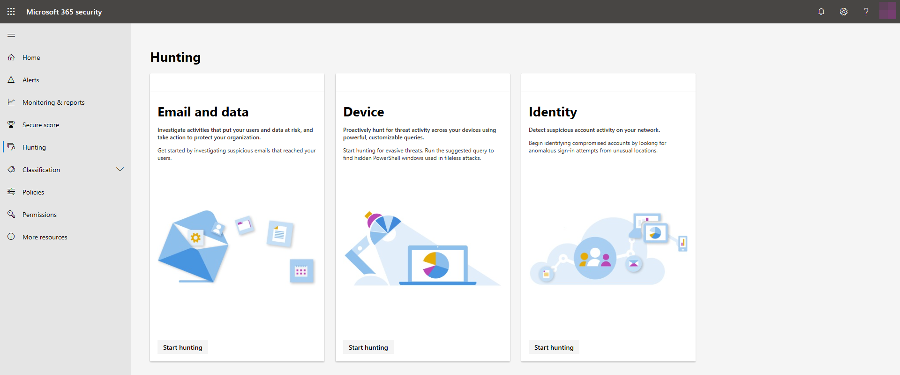

# Hunt for Threats in Microsoft 365Hunt for threats in Microsoft 365

Mit Threat Hunting-Funktionen im Microsoft 365 Security Center können Sie proaktiv Bedrohungen in Ihrer Organisation finden, die sich auf e-Mails und Daten, Geräte und Identitäten auswirken.With threat hunting capabilities in the Microsoft 365 security center, you can proactively find threats in your organization affecting email and data, devices, and identities. Auf dem Bildschirm " **Jagd** " können Sie auf von verschiedenen Lösungen zur Verfügung gestellten Bedrohungen-Jagd Tools zugreifen:From the **Hunting** screen, you can access threat hunting tools made available by various solutions:
- Office 365 ATP – [Hunt for Threats to e-Mail and Data](../office-365-security/office-365-atp.md)Office 365 ATP — [hunt for threats to email and data](../office-365-security/office-365-atp.md)
- Microsoft Defender ATP – [Jagd auf Bedrohungen für Geräte](https://docs.microsoft.com/windows/security/threat-protection/microsoft-defender-atp/advanced-hunting)Microsoft Defender ATP — [hunt for threats to devices](https://docs.microsoft.com/windows/security/threat-protection/microsoft-defender-atp/advanced-hunting)
- Azure ATP – [jagen nach Bedrohungen für Identitäten](https://docs.microsoft.com/azure-advanced-threat-protection/investigate-a-user)Azure ATP — [hunt for threats to identities](https://docs.microsoft.com/azure-advanced-threat-protection/investigate-a-user)

## Hunt mit Microsoft Threat ProtectionHunt with Microsoft Threat Protection

[Aktivieren Sie Microsoft Threat Protection](mtp-enable.md) , um die erweiterte Hunting-Abfrageschnittstelle direkt im Microsoft 365 Security Center zu erhalten.[Turn on Microsoft Threat Protection](mtp-enable.md) to get the advanced hunting query interface directly in the Microsoft 365 security center. Mit [Advanced Hunting](advanced-hunting-overview.md)können Sie einzelne Abfragen erstellen, die Daten von Microsoft Defender ATP untersuchen, Daten von Onboarding-Geräten abdecken und Office 365 ATP Bereitstellen von Daten aus e-Mails.With [advanced hunting](advanced-hunting-overview.md), you can create single queries that look into data from both Microsoft Defender ATP, covering data from onboarded devices, and Office 365 ATP, providing data from emails.

## Verwandte ThemenRelated topics
- [Übersicht über die erweiterte SucheAdvanced hunting overview](advanced-hunting-overview.md)
- [Übersicht über Microsoft Threat ProtectionMicrosoft Threat Protection overview](microsoft-threat-protection.md)
- [Aktivieren von Microsoft Threat ProtectionTurn on Microsoft Threat Protection](mtp-enable.md)
