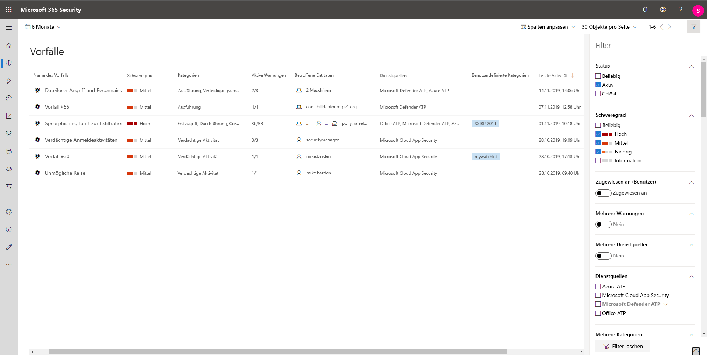

# Priorisieren von Vorfällen in Microsoft Threat ProtectionPrioritize incidents in Microsoft Threat Protection

**Gilt für:****Applies to:**
- Microsoft Threat ProtectionMicrosoft Threat Protection

[!INCLUDE [Prerelease information](../includes/prerelease.md)]

Microsoft Threat Protection wendet Korrelationsanalysen an und fasst alle zugehörigen Warnungen und Untersuchungen aus verschiedenen Produkten in einem einzigen Vorfall zusammen.Microsoft Threat Protection applies correlation analytics and aggregates all related alerts and investigations from different products into one incident. Microsoft Threat Protection löst auch eindeutige Warnungen zu Aktivitäten aus, die nur aufgrund der umfassenden Transparenz von Microsoft Threat Protection über das gesamte System und die gesamte Suite von Produkten als bösartig erkannt werden können.Microsoft Threat Protection also triggers unique alerts on activities that can only be identified as malicious given the end-to-end visibility that Microsoft Threat Protection has across the entire estate and suite of products. Auf diese Weise kommentiert Microsoft Threat Protection die umfassendere Angriffsgeschichte, sodass ein Analyst für Sicherheitsoperationen komplexe Bedrohungen in der gesamten Organisation erkennen und bewältigen kann.By doing so, Microsoft Threat Protection narrates the broader attack story, allowing a security operations analyst to understand and deal with complex threats across the organization.

In der **Vorfallswarteschlange** wird eine Auflistung von Vorfällen angezeigt, die auf allen Geräten, für alle Benutzer und in allen Postfächern gekennzeichnet wurden.The **Incidents queue** shows a collection of incidents that were flagged from across devices, users, and mailboxes. Sie können damit Vorfälle sortieren, um eine fundierte Entscheidung im Hinblick auf eine geeignete Reaktion auf einen Cyberangriff zu treffen.It helps you sort through incidents to prioritize and create an informed cybersecurity response decision.

 

Standardmäßig werden in der Warteschlange im Microsoft 365 Security Center Vorfälle angezeigt, die in den letzten 30 Tagen aufgetreten sind, wobei der letzte Vorfall am Anfang der Liste angezeigt wird, sodass Sie die neuesten Vorfälle zuerst sehen können.By default, the queue in the Microsoft 365 security center displays incidents seen in the last 30 days, with the most recent incident showing at the top of the list, helping you see the most recent incidents first.

Die Vorfallswarteschlange bietet anpassbare Spalten, die Ihnen einen Einblick in die unterschiedlichen Merkmale des Vorfalls oder in die enthaltenen Entitäten verschaffen, und Ihnen helfen, eine fundierte Entscheidung hinsichtlich der Priorisierung von Vorfällen zu treffen.The incident queue exposes customizable columns that give you visibility into different characteristics of the incident or the contained entities, helping you make an informed decision regarding prioritization of incidents to handle. 

Die Vorfallswarteschlange stellt außerdem mehrere Filteroptionen zur Verfügung. Wenn diese angewendet werden, können Sie auswählen, ob Sie alle vorhandenen Vorfälle in Ihrer Umgebung umfassend aufräumen oder sich auf ein bestimmtes Szenario oder eine Bedrohung konzentrieren möchten.The incident queue also exposes multiple filtering options, that when applied, enable you to choose to perform a broad sweep of all existing incidents in your environment, or decide to focus on a specific scenario or threat. Durch Anwenden von Filtern in der Vorfallswarteschlange können Sie ermitteln, welcher Vorfall sofort beachtet werden muss.Applying filters on the incident queue can help determine which incident requires immediate attention. 

## Verfügbare FilterAvailable filters

### StatusStatus
Sie können die Liste der Vorfälle basierend auf deren Status einschränken, um zu sehen, welche Vorgänge aktiv oder aufgelöst sind.You can choose to limit the list of incidents shown based on their status to see which ones are active or resolved.

### SchweregradSeverity
Der Schweregrad eines Vorfalls ist ein Indikator für die Auswirkungen, die dieser bei Ihnen haben kann.The severity of an incident is indicative of the impact it can have in your assets. Je höher der Schweregrad, desto größer die Auswirkungen. In der Regel ist bei einem höheren Schweregrad auch die größte sofortige Aufmerksamkeit erforderlich.The higher the severity the bigger the impact and typically requires the most immediate attention. 

### Zugewiesen zu (Benutzer)Assigned to (owner)
Sie können die Liste filtern, indem Sie Vorfälle auswählen, die einer Person oder Ihnen zugewiesen sind.You can choose to filter the list by selecting assigned to anyone or ones that are assigned to you.

### Mehrere WarnungenMultiple alerts 
Filtern Sie, um nur Vorfälle mit mehr als einer Warnung anzuzeigen.Filter to see only incidents containing more than one alert. Dies kann ein Anzeichen für einen Angriff sein, der komplexer oder in der Kill Chain weiter fortgeschritten ist.This could be an indication for an attack that is more complex or progressed in the kill chain. 

### Mehrere DienstquellenMultiple service sources 
Filtern Sie, um nur Vorfälle anzuzeigen, die Warnungen aus unterschiedlichen Quellen enthalten (Microsoft Defender ATP, Microsoft Cloud App Security, Azure ATP, Office 365 ATP)Filter to only see incidents that contain alerts from different sources (Microsoft Defender ATP, Microsoft Cloud App Security, Azure ATP, Office 365 ATP)
### DienstquellenService sources
Wenn Sie eine bestimmte Quelle auswählen, können Sie sich auf Vorfälle konzentrieren, die mindestens eine Warnung aus der ausgewählten Quelle enthalten.By choosing a specific source, you can focus on incidents that contain at least one alert from that chosen source. 

### Mehrere KategorienMultiple categories 
Sie können auswählen, dass nur Vorfälle angezeigt werden sollen, die mehreren Kategorien der Kill Chain zugeordnet sind und möglicherweise zu weiteren Beschädigungen führen können.You can choose to see only incidents that have mapped to multiple categories of the kill chain and can potentially cause more damage. 

### KategorienCategories
Wählen Sie bestimmte Kategorien aus, um sich auf einen bestimmten Schritt in der Kill Chain zu konzentrieren.Choose specific categories to focus on a specific step in the kill chain

### Vertraulichkeit der DatenData sensitivity
Bei einigen Angriffen liegt der Schwerpunkt auf dem Exfiltrieren von vertraulichen oder wertvollen Daten.Some attacks focus on targeting to exfiltrate sensitive or valuable data. Indem Sie einen Filter anwenden, um festzustellen, ob vertrauliche Daten an dem Vorfall beteiligt sind, können Sie schnell ermitteln, ob vertrauliche Informationen potenziell gefährdet sind, und die Behebung dieser Vorfälle priorisieren.By applying a filter to see if sensitive data is involved in the incident, you can quickly determine if sensitive information has potentially been compromised and prioritize addressing those incidents.

>[!NOTE]
>Gilt nur, wenn Microsoft Information Protection aktiviert ist.Only applicable if Microsoft Information Protection is turned on.

## Nächste SchritteNext steps
Nachdem Sie festgestellt haben, für welchen Vorfall die höchste Priorität erforderlich ist, können Sie fortfahren und einen Vorfall näher untersuchen.After you've determined which incident requires the highest priority, you can proceed to do further investigative work on an incident.
- [Untersuchen von VorfällenInvestigate incidents](investigate-incidents.md)

## Verwandte ThemenRelated topics
- [Übersicht über VorfälleIncidents overview](incidents-overview.md)
- [Untersuchen von VorfällenInvestigate incidents](investigate-incidents.md)
- [Verwalten von VorfällenManage incidents](manage-incidents.md)