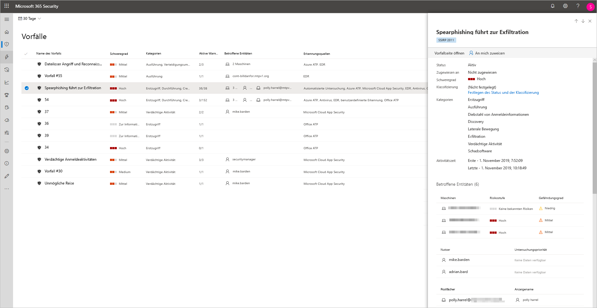
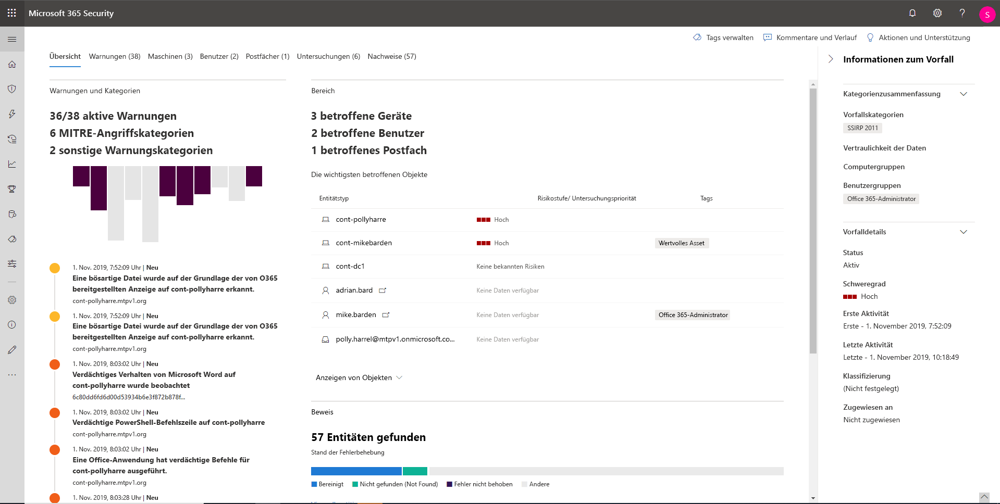
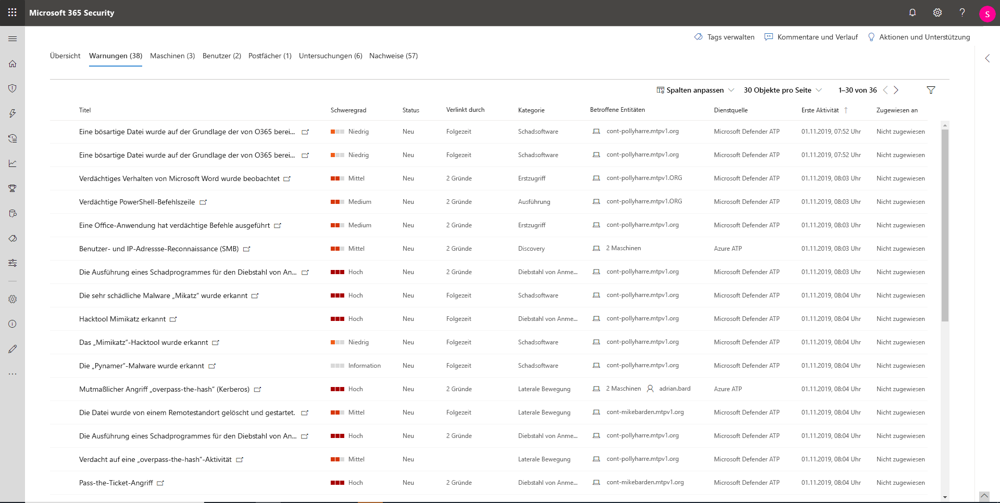
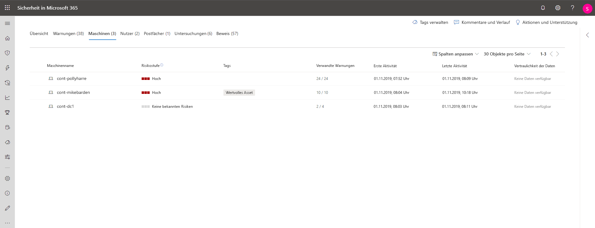
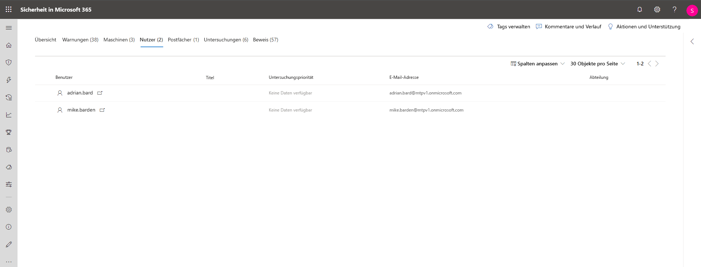
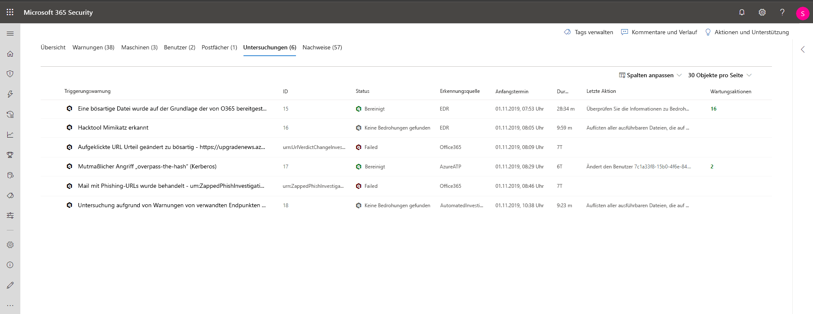
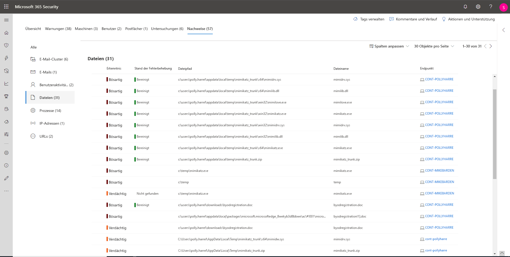

# Untersuchen Sie Vorfälle in Microsoft Threat Protection

**Gilt für:**
- Microsoft Threat Protection

[!include[Prerelease information](prerelease.md)]

Microsoft Threat Protection fasst alle zugehörigen Warnungen, Assets, Untersuchungen und Beweise auf Ihren Geräten, Nutzern und Postfächern zusammen, um Ihnen einen umfassenden Überblick über die gesamte Bandbreite eines Angriffs zu geben. 

Untersuchen Sie die Warnmeldungen, die Ihr Netzwerk betreffen, verstehen Sie, was sie bedeuten, und stellen Sie die mit den Vorfällen verbundenen Beweise zusammen, damit Sie einen wirksamen Plan zur Behebung erstellen können. 

## Untersuchung eines Vorfalls

1. Wählen Sie einen Vorfall aus der Vorfallwarteschlange aus.   Dadurch wird ein Seitenbereich geöffnet und eine Vorschau wichtiger Informationen wie Status, Schweregrad, Kategorien und betroffener Entitäten angezeigt.

    

2. Wählen Sie **Vorfallseite öffnen**.   Daraufhin wird die Vorfallseite geöffnet, auf der Sie weitere Informationen zu Vorfällen, Kommentaren und Aktionen sowie Registerkarten (Übersicht, Warnungen, Geräte, Nutzer, Untersuchungen, Beweise) finden.

3. Überprüfen Sie die Warnungen, Geräte, Nutzer und anderen Entitäten, die an dem Vorfall beteiligt sind.

## Vorfall Übersicht 
Auf der Übersichtsseite erhalten Sie einen Überblick über die wichtigsten Informationen zu dem Vorfall.

Die Angriffskategorien geben Ihnen eine visuelle und numerische Darstellung des Fortschritts des Angriffs gegen die Kill Chain. Wie bei anderen Microsoft-Sicherheitsprodukten ist auch Microsoft Threat Protection auf das Framework [MITRE ATT&CK&trade;](https://attack.mitre.org/) ausgerichtet. 

Der Bereich enthält eine Liste der am häufigsten betroffenen Assets, die Teil dieses Vorfalls sind. Wenn es spezifische Informationen zu diesem Asset gibt, wie z. B. Risikograd, Untersuchungspriorität sowie eine Kennzeichnung des Assets, wird dies ebenfalls in diesem Abschnitt angezeigt.

Die Zeitleiste für Warnungen bietet einen kurzen Einblick in die chronologische Reihenfolge, in der die Warnungen aufgetreten sind, sowie in die Gründe, aus denen diese Warnungen mit diesem Vorfall verknüpft sind.

Und schließlich finden Sie im Abschnitt "Nachweise" eine Zusammenfassung der Anzahl der in den Vorfall einbezogenen Artefakte und ihres Behebungsstatus, sodass Sie sofort erkennen können, ob eine Maßnahme erforderlich ist. 

Diese Übersicht kann bei der ersten Analyse des Vorfalls hilfreich sein, indem sie einen Einblick in die wichtigsten Merkmale des Vorfalls bietet, die Sie kennen sollten. 

## Warnungen 
Sie können alle Warnungen im Zusammenhang mit dem Vorfall und andere Informationen dazu anzeigen, z. B. den Schweregrad, die an der Warnung beteiligten Entitäten, die Quelle der Warnungen (Azure ATP, Microsoft Defender ATP, Office 365 ATP) und den Grund warum sie miteinander verknüpft wurden. 

Standardmäßig sind die Warnungen chronologisch geordnet, damit Sie zunächst sehen können, wie sich der Angriff im Laufe der Zeit abgespielt hat. Wenn Sie auf jede Warnung klicken, gelangen Sie zu der entsprechenden Warnungsseite, auf der Sie eine eingehende Untersuchung dieser Warnung durchführen können. 

## Geräte 
Auf der Registerkarte „Geräte“ werden alle Geräte aufgelistet, zu denen Warnungen bezüglich des Vorfalls angezeigt werden. 

Wenn Sie auf den Namen des Rechners klicken, auf dem der Angriff ausgeführt wurde, gelangen Sie zur Seite "Rechner", auf der Sie Warnungen und verwandte Ereignisse zur Vereinfachung der Untersuchung anzeigen können. 

Durch Auswahl der Registerkarte Zeitachse können Sie durch die Zeitachse der Rechner scrollen und alle Ereignisse und Verhaltensweisen, die auf dem Rechner beobachtet wurden, in chronologischer Reihenfolge anzeigen, durchsetzt mit den ausgegebenen Warnungen. 

## Nutzer 
Anzeigen von Nutzern, die als Bestandteil von oder mit einem bestimmten Vorfall verbunden sind. 

Durch Klicken auf den Nutzernamen gelangen Sie zur Cloud App Security-Seite des Nutzers, auf der weitere Untersuchungen durchgeführt werden können.

## Postfächer
Untersuchen Sie Postfächer, bei denen festgestellt wurde, dass sie Teil eines Vorfalls sind oder sich auf einen Vorfall beziehen. Wenn Sie die E-Mail-bezogene Warnung auswählen, um weitere Nachforschungen anzustellen, wird Office 365 Advanced Threat Protection geöffnet, in dem Sie Behebungsmaßnahmen ergreifen können.

## Untersuchungen
Wählen Sie **Untersuchungen** aus, um alle automatisierten Untersuchungen anzuzeigen, die durch Warnungen in diesem Vorfall ausgelöst wurden. Je nachdem, wie Sie Ihre automatisierten Untersuchungen für die Ausführung in Microsoft Defender ATP und Office 365 Advanced Threat Protection konfiguriert haben, führen die Untersuchungen Behebungsmaßnahmen durch oder warten auf die Genehmigung von Maßnahmen durch den Analysten.

Wählen Sie eine Untersuchung aus, um zur Seite mit den Untersuchungsdetails zu navigieren und vollständige Informationen zum Untersuchungs- und Behebungsstatus zu erhalten. Wenn im Rahmen der Untersuchung Aktionen zur Genehmigung ausstehen, werden diese auf der Registerkarte „Ausstehende Aktionen“ angezeigt. Ergreifen Sie Maßnahmen zur Behebung von Vorfällen.

## Beweis
Microsoft Threat Protection untersucht automatisch alle von Vorfällen unterstützten Ereignisse und verdächtigen Entitäten in den Warnungen und bietet Ihnen eine automatische Antwort sowie Informationen zu wichtigen Dateien, Prozessen, Diensten, E-Mails und vielem mehr. Dies hilft, potenzielle Bedrohungen im Vorfall schnell zu erkennen und zu blockieren. 

Jede der analysierten Entitäten wird mit einem Urteil (Bösartig, Verdächtig, Sauber) sowie einem Behebungsstatus gekennzeichnet. Dies hilft Ihnen dabei, den Behebungsstatus des gesamten Vorfalls zu verstehen und zu ermitteln, welche weiteren Schritte zur Behebung des Vorfalls unternommen werden können.

## Verwandte Themen
- [Übersicht über Vorfälle](incidents-overview.md)
- [Priorisieren von Vorfällen](incident-queue.md)
- [Verwalten von Vorfällen](manage-incidents.md)