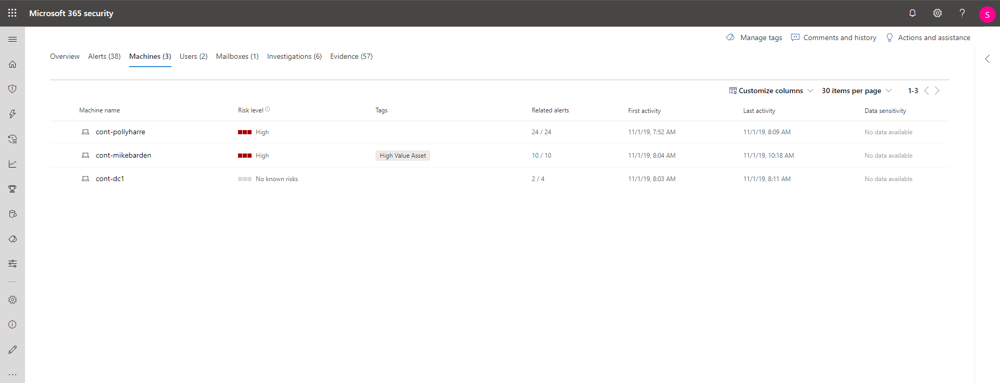
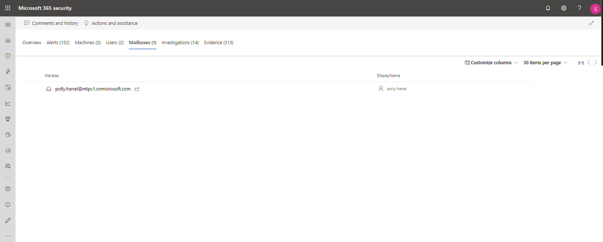

# Untersuchen von Vorfällen in Microsoft 365 DefenderInvestigate incidents in Microsoft 365 Defender

[!INCLUDE [Microsoft 365 Defender rebranding](../includes/microsoft-defender.md)]

**Gilt für:****Applies to:**

- Microsoft 365 DefenderMicrosoft 365 Defender

Microsoft 365 Defender aggregiert alle zugehörigen Warnungen, Ressourcen, Untersuchungen und Beweise aus ihren Geräten, Benutzern und Postfächern, damit Sie einen umfassenden Einblick in die gesamte Bandbreite eines Angriffs erhalten.Microsoft 365 Defender aggregates all related alerts, assets, investigations and evidence from across your devices, users, and mailboxes to give you a comprehensive look into the entire breadth of an attack.

Untersuchen Sie die Warnmeldungen, die Ihr Netzwerk betreffen, verstehen Sie, was sie bedeuten, und stellen Sie die mit den Vorfällen verbundenen Beweise zusammen, damit Sie einen wirksamen Plan zur Behebung erstellen können.Investigate the alerts that affect your network, understand what they mean, and collate evidence associated with the incidents so that you can devise an effective remediation plan.

## Untersuchung eines VorfallsInvestigate an incident

1. Wählen Sie einen Vorfall aus der Vorfallwarteschlange aus.Select an incident from the incident queue.   Ein Seitenbereich wird geöffnet und zeigt eine Vorschau wichtiger Informationen wie Status, Schweregrad, Kategorien und betroffene Entitäten an.A side panel opens and gives a preview of important information such as status, severity, categories, and the impacted entities.

    

2. Wählen Sie **Vorfallseite öffnen**.Select **Open incident page**.   Dadurch wird die Vorfall Seite geöffnet, auf der Sie weitere Informationen zu Vorfalldetails, Kommentaren und Aktionen, Registerkarten (Übersicht, Warnungen, Geräte, Benutzer, Untersuchungen, Beweise) finden.This opens the incident page where you'll find more information incident details, comments, and actions, tabs (overview, alerts, devices, users, investigations, evidence).

3. Überprüfen Sie die Warnungen, Geräte, Nutzer und anderen Entitäten, die an dem Vorfall beteiligt sind.Review the alerts, devices, users, other entities involved in the incident.

## Vorfall ÜbersichtIncident overview

Auf der Übersichtsseite erhalten Sie einen Überblick über die wichtigsten Informationen zu dem Vorfall.The overview page gives you a snapshot glance into the top things to notice about the incident.

Die Angriffskategorien bieten eine visuelle und numerische Ansicht, wie fortgeschritten der Angriff für die killkette ist.The attack categories give you a visual and numeric view of how advanced the attack has progressed against the kill chain. Wie bei anderen Microsoft-Sicherheitsprodukten wird Microsoft 365 Defender an das [Mitra ATT&CK &trade; ](https://attack.mitre.org/) -Framework angepasst.As with other Microsoft security products, Microsoft 365 Defender is aligned to the [MITRE ATT&CK&trade;](https://attack.mitre.org/) framework.

Der Bereich enthält eine Liste der am häufigsten betroffenen Assets, die Teil dieses Vorfalls sind.The scope section gives you a list of top impacted assets that are part of this incident. Wenn es spezifische Informationen zu diesem Asset gibt, wie z. B. Risikograd, Untersuchungspriorität sowie eine Kennzeichnung des Assets, wird dies ebenfalls in diesem Abschnitt angezeigt.If there is specific information regarding this asset, such as risk level, investigation priority as well as any tagging on the assets this will also surface in this section.

Die Zeitleiste für Warnungen bietet einen kurzen Einblick in die chronologische Reihenfolge, in der die Warnungen aufgetreten sind, sowie in die Gründe, aus denen diese Warnungen mit diesem Vorfall verknüpft sind.The alerts timeline provides a sneak peek into the chronological order in which the alerts occurred, as well as the reasons that these alerts linked to this incident.

Und schließlich finden Sie im Abschnitt "Nachweise" eine Zusammenfassung der Anzahl der in den Vorfall einbezogenen Artefakte und ihres Behebungsstatus, sodass Sie sofort erkennen können, ob eine Maßnahme erforderlich ist.And last - the evidence section provides a summary of how many different artifacts were included in the incident and their remediation status, so you can immediately identify if any action is needed on your end.

Diese Übersicht kann bei der ersten Analyse des Vorfalls hilfreich sein, indem sie einen Einblick in die wichtigsten Merkmale des Vorfalls bietet, die Sie kennen sollten.This overview can assist in the initial triage of the incident by providing insight to the top characteristics of the incident that you should be aware of.

## WarnungenAlerts

Sie können alle Warnungen im Zusammenhang mit dem Vorfall und andere Informationen zu diesen anzeigen, beispielsweise den Schweregrad, Entitäten, die an der Warnung beteiligt waren, die Quelle der Warnungen (Microsoft Defender for Identity, Microsoft Defender for Endpoint, Microsoft Defender für Office 365) und den Grund, warum Sie miteinander verknüpft wurden.You can view all the alerts related to the incident and other information about them such as severity, entities that were involved in the alert, the source of the alerts (Microsoft Defender for Identity, Microsoft Defender for Endpoint, Microsoft Defender for Office 365) and the reason they were linked together.

Standardmäßig sind die Warnungen chronologisch geordnet, damit Sie zunächst sehen können, wie sich der Angriff im Laufe der Zeit abgespielt hat.By default, the alerts are ordered chronologically, to allow you to first view how the attack played out over time. Durch Klicken auf jede Warnung gelangen Sie zur entsprechenden Benachrichtigungsseite, auf der Sie eine eingehende Untersuchung dieser Warnung durchführen können.Clicking on each alert will lead you to the relevant alert page where you can conduct an in-depth investigation of that alert.

## GeräteDevices

Auf der Registerkarte „Geräte“ werden alle Geräte aufgelistet, zu denen Warnungen bezüglich des Vorfalls angezeigt werden.The devices tab lists all the devices where alerts related to the incident are seen.

Wenn Sie auf den Namen des Rechners klicken, auf dem der Angriff ausgeführt wurde, gelangen Sie zur Seite "Rechner", auf der Sie Warnungen und verwandte Ereignisse zur Vereinfachung der Untersuchung anzeigen können.Clicking the name of the machine where the attack was conducted navigates you to its Machine page where you can see alerts that were triggered on it and related events provided to ease investigation.

Durch Auswahl der Registerkarte Zeitachse können Sie durch die Zeitachse der Rechner scrollen und alle Ereignisse und Verhaltensweisen, die auf dem Rechner beobachtet wurden, in chronologischer Reihenfolge anzeigen, durchsetzt mit den ausgegebenen Warnungen.Selecting the Timeline tab enables you to scroll through the machine timeline and view all events and behaviors observed on the machine in chronological order, interspersed with the alerts raised.

## NutzerUsers

Anzeigen von Nutzern, die als Bestandteil von oder mit einem bestimmten Vorfall verbunden sind.See users that have been identified to be part of, or related to a given incident.

Durch Klicken auf den Nutzernamen gelangen Sie zur Cloud App Security-Seite des Nutzers, auf der weitere Untersuchungen durchgeführt werden können.Clicking the username navigates you to the user's Cloud App Security page where further investigation can be conducted.

## PostfächerMailboxes

Untersuchen Sie Postfächer, bei denen festgestellt wurde, dass sie Teil eines Vorfalls sind oder sich auf einen Vorfall beziehen.Investigate mailboxes that's been identified to be part of, or related to an incident. Für weitere Ermittlungsaufgaben wird durch Auswahl der e-Mail-bezogenen Warnung Microsoft Defender für Office 365 geöffnet, in dem Sie Korrekturaktionen ausführen können.To do further investigative work, selecting the mail-related alert will open Microsoft Defender for Office 365 where you can take remediation actions.

## UntersuchungenInvestigations

Wählen Sie unter **suchungen** aus, um alle automatisierten Untersuchungen anzuzeigen, die von Warnungen in diesem Vorfall ausgelöst wurden.Select **Investigations** to see all the automated investigations triggered by alerts in this incident. In den Untersuchungen werden Korrekturaktionen durchgeführt oder auf die Analysten Genehmigung für Aktionen gewartet, je nachdem, wie Sie Ihre automatisierten Untersuchungen so konfiguriert haben, dass Sie in Microsoft Defender für Endpoint und Defender für Office 365 ausgeführt werden.The investigations will perform remediation actions or wait for analyst approval of actions, depending on how you configured your automated investigations to run in Microsoft Defender for Endpoint and Defender for Office 365.

Wählen Sie eine Untersuchung aus, um zur Seite mit den Untersuchungsdetails zu navigieren und vollständige Informationen zum Untersuchungs- und Behebungsstatus zu erhalten.Select an investigation to navigate to the Investigation details page to get full information on the investigation and remediation status. Wenn im Rahmen der Untersuchung noch Aktionen zur Genehmigung ausstehen, werden diese auf der Registerkarte Ausstehende Aktionen angezeigt. Maßnahmen im Rahmen der Vorgehensweise bei der Problembehebung.If there are any actions pending for approval as part of the investigation, they will appear in the Pending actions tab. Take action as part of incident remediation.

## BeweisEvidence

Microsoft 365 Defender untersucht automatisch alle unterstützten Ereignisse der Vorfälle und verdächtigen Entitäten in den Warnungen und bietet Ihnen autoresponse und Informationen über wichtige Dateien, Prozesse, Dienste, e-Mails und vieles mehr.Microsoft 365 Defender automatically investigates all the incidents' supported events and suspicious entities in the alerts, providing you with autoresponse and information about the important files, processes, services, emails, and more. Dies hilft, potenzielle Bedrohungen im Vorfall schnell zu erkennen und zu blockieren.This helps quickly detect and block potential threats in the incident.

Jede der analysierten Entitäten wird mit einem Urteil (Bösartig, Verdächtig, Sauber) sowie einem Behebungsstatus gekennzeichnet.Each of the analyzed entities will be marked with a verdict (Malicious, Suspicious, Clean) as well as a remediation status. Dies hilft Ihnen dabei, den Behebungsstatus des gesamten Vorfalls zu verstehen und zu ermitteln, welche weiteren Schritte zur Behebung des Vorfalls unternommen werden können.This assists you in understanding the remediation status of the entire incident and what are the next steps that can be taken to further remediate.

## Verwandte ThemenRelated topics

- [Übersicht über VorfälleIncidents overview](incidents-overview.md)
- [Priorisieren von VorfällenPrioritize incidents](incident-queue.md)
- [Verwalten von VorfällenManage incidents](manage-incidents.md)

