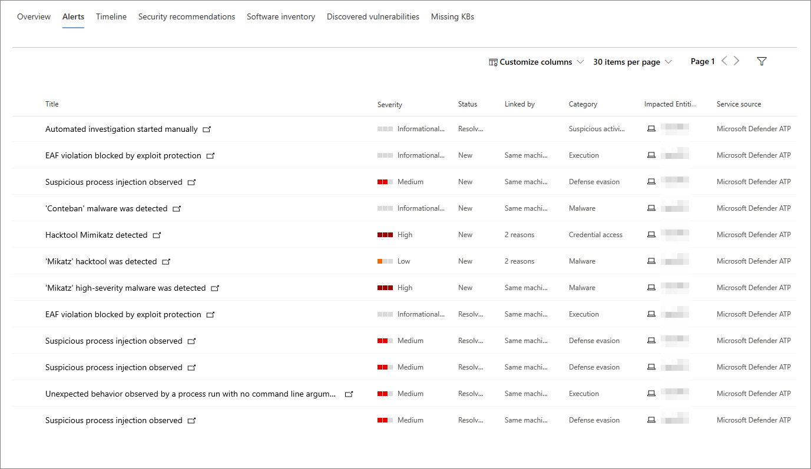
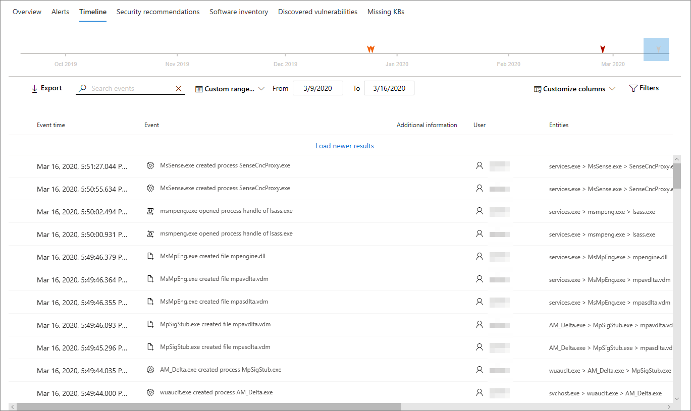

# Computer ProfilseiteMachine profile page

Das Microsoft 365-Sicherheitsportal stellt Ihnen Computer Profilseiten zur Verfügung, damit Sie die Integrität und den Status von Geräten in Ihrem Netzwerk bewerten können.The Microsoft 365 security portal provides you with Machine profile pages, so you can assess the health and status of devices on your network. Jede Computer Profilseite enthält eine Vielzahl von Informationen über das Gerät.Each Machine profile page contains a wealth of information about the device.

Sie können ausführliche Informationen über die ausgeführten Software, alle vergangenen und aktuellen Sicherheitsereignisse oder Warnungen sowie Links zu relevanten Software-Patches lesen.You can review in-depth information about what software it is running, any past and present security events or alerts, and find links to relevant software patches.

Sie können auch das Computer Profil verwenden, um allgemeine sicherheitsbezogene Aufgaben auszuführen und schnell grundlegende Details zum Gerät zu überprüfen.You can also use the Machine profile to perform common security-related tasks, and quickly review basic details about the device.

## Navigieren auf der Seite "Computer Profil"Navigating the Machine profile page

Auf die Computer Profilseite kann zugegriffen werden, indem Sie einen Gerätenamen direkt in der Liste Computer auswählen oder auf der Seite "Computer **Öffnen"** im Flyout "Computerliste" auswählen.The Machine profile page can be accessed by directly selecting a device name on the Machines list or by choosing **Open Machine page** on the Machines list flyout.

Nachdem Sie die Seite geöffnet haben, werden Sie feststellen, dass Sie in drei Abschnitte aufgeteilt wird.Once you have the page open, you'll find that it is broken up into three sections.

Der Hauptinhaltsbereich (1) enthält sieben Registerkarten, die Sie umschalten können, um verschiedene Arten von Informationen zum Computer anzuzeigen.The main content area (1) contains seven tabs that you can toggle through to view different kinds of information about the machine.

In der Sidebar (2) sind grundlegende Details zum Computer aufgeführt.The sidebar (2) lists basic details about the machine.

Es gibt auch Antwort Aktionen, die in einer Kopfzeile (3) vor der Sidebar und den Hauptinhalts Abschnitten verfügbar sind.There are also response actions available in a header (3) before the sidebar and main content sections. Sie können die Aktionen in dieser Kopfzeile verwenden, um allgemeine sicherheitsbezogene Aufgaben auszuführen.You can use the actions in this header to perform common security-related tasks.

## Tabs sectionTabs section

Auf den Registerkarten des Computer Profils können Sie eine Übersicht über die Sicherheitsdetails des Computers und Tabellen mit einer Liste von Warnungen, eine Zeitachse, eine Liste mit Sicherheitsempfehlungen, eine Softwareinventur, eine Liste der entdeckten Sicherheitsanfälligkeiten und fehlende KBS (Sicherheitsupdates).The Machine profile tabs allow you to toggle through an overview of security details about the machine, and tables containing a list of alerts, a timeline, a list of security recommendations, a software inventory, a list of discovered vulnerabilities, and missing KBs (security updates).

### Registerkarte "Übersicht"Overview tab

Die Standardregisterkarte ist **Overview**.The default tab is **Overview**. Es bietet einen schnellen Überblick über die wichtigsten Sicherheitsfakten zum Gerät.It provides a quick look at the most important security fact about the device.

Hier finden Sie ein Diagramm der Risikostufe des Geräts und der aktiven Warnungen, der aktuell angemeldeten Benutzer, einer kurzen Liste mit den meisten und seltensten Benutzern sowie Sicherheitsbewertungen, in denen die Expositions Stufe des Geräts, Sicherheitsempfehlungen, betroffene Software und entdeckte Sicherheitsrisiken.Here, you can find a chart of the device's risk level and active alerts, any currently logged on users, a brief list of most and least frequent users, and security assessments that detail the device's exposure level, security recommendations, affected software, and discovered vulnerabilities.

### Registerkarte "Warnungen"Alerts tab

Die Registerkarte **Benachrichtigungen** enthält eine Liste der Warnungen, die auf dem Gerät gemeldet wurden.The **Alerts** tab contains a list of alerts that have been reported on the device.

Sie können die Anzahl der angezeigten Elemente sowie die für jedes Element angezeigten Spalten anpassen.You can customize the number of items displayed, as well as which columns are displayed for each item. Das Standardverhalten besteht darin, 30 Elemente pro Seite aufzulisten und 11 Spalten zur Anzeige umzuschalten.The default behavior is to list 30 items per page, and have 11 columns toggled on to display.

Die Spalten auf dieser Registerkarte enthalten Informationen über den Schweregrad der Bedrohung, die die Warnung ausgelöst hat, sowie den Status, den Untersuchungs Zustand und wer, wenn jemand der Warnung zugewiesen wurde.The columns in this tab include information on the severity of the threat that triggered the alert, as well as status, investigation state, and who if anyone the alert has been assigned to.

Die Spalte betroffene *Entitäten* bezieht sich auf den Computer (Entität), dessen Profil Sie derzeit anzeigen, sowie auf alle anderen Computer in Ihrem Netzwerk, die betroffen sind.The *impacted entities* column refers to the machine (entity) whose profile you are currently viewing, plus any other machines in your network that are affected.

Wenn Sie ein Element aus dieser Liste auswählen, wird ein Link zur ausgewählten Warnung geöffnet.Selecting an item from this list will open a link to the selected alert.

Diese Liste kann nach Schweregrad, Status oder Empfänger gefiltert werden.This list can be filtered by severity, status, or assignee.

### Registerkarte "Timeline"Timeline tab

Die Registerkarte **Zeitachse** enthält ein interaktives, Chronologisches Diagramm der Ereignisse, die auf dem Gerät ausgelöst wurden.The **Timeline** tab includes a interactive, chronological chart of events raised on the device. Wenn Sie den markierten Bereich des Diagramms verschieben, können Sie Ereignisse in verschiedenen Zeitbereichen anzeigen.By moving the highlighted area of the chart, you can view events over different ranges of time. Sie können auch einen benutzerdefinierten Datumsbereich eingeben.You can also type in a custom range of dates.

Unter dem Diagramm finden Sie eine Liste der Ereignisse für den ausgewählten Datumsbereich.Below the chart is a list of events for the selected range of dates.

Die Anzahl der angezeigten Elemente und die Spalten in der Liste können angepasst werden.The number of items displayed and the columns on the list can both be customized. In den Standardspalten werden die Ereigniszeit, der aktive Benutzer, der Aktionstyp, Entitäten (Prozesse) und zusätzliche Informationen zum Ereignis aufgelistet.The default columns list the event time, active user, action type, entities (processes), and additional information about the event.

Wenn Sie ein Element aus der Liste auswählen, wird ein Flyout geöffnet, in dem ein Ereignis Entitäten Diagramm mit den übergeordneten und untergeordneten Prozessen angezeigt wird, die das Ereignis ausgelöst haben.Selecting an item from the list will open a flyout displaying an Event entities graph, showing the parent and child processes that triggered the event.

Diese Liste kann nach der spezifischen Art von Ereignis gefiltert werden; beispielsweise Registrierungs Ereignisse oder Smart Screen-Ereignisse.This list can be filtered by the specific kind of event; for example, Registry events or Smart Screen Events.

### Registerkarte "Sicherheitsempfehlungen"Security recommendations tab

Auf der Registerkarte **Sicherheitsempfehlungen** werden Aktionen aufgeführt, die Sie zum Schutz des Geräts ausführen können.The **Security recommendations** tab lists actions you can take to protect the device. Wenn Sie ein Element in dieser Liste auswählen, wird ein Flyout geöffnet, in dem Sie Anweisungen dazu erhalten, wie Sie die Empfehlung anwenden können.Selecting an item on this list will open a flyout where you can get instructions on how to apply the recommendation.

Wie bei den vorherigen Registerkarten kann auch die Anzahl der pro Seite angezeigten Elemente und der sichtbaren Spalten angepasst werden.As with the previous tabs, the number of items displayed per page and which columns are visible can be customized.

Die Standardansicht enthält Spalten, in denen die Sicherheitsschwächen, die zugehörige Bedrohung, die zugehörige Komponente oder Software, die von der Bedrohung betroffen ist, detailliert beschrieben werden und vieles mehr.The default view includes columns that detail the security weaknesses addressed, the associated threat, the related component or software affected by the threat, and more. Elemente können nach dem Status der Empfehlung gefiltert werden.Items can be filtered by the recommendation's status.

### SoftwarebestandSoftware inventory

Auf der Registerkarte **Softwareinventur** sind auf dem Gerät installierte Software aufgeführt.The **Software inventory** tab lists software installed on the device.

In der Standardansicht werden der Softwarehersteller, die installierte Versionsnummer, die Anzahl bekannter Software Schwächen, Einblicke in Bedrohungen, Produktcode und Tags angezeigt.The default view displays the software vendor, installed version number, number of known software weaknesses, threat insights, product code, and tags. Die Anzahl der angezeigten Elemente und die angezeigten Spalten können angepasst werden.The number of items displayed and which columns are displayed can both be customized.

Wenn Sie ein Element aus dieser Liste auswählen, wird ein Flyout mit weiteren Details zur ausgewählten Software sowie der Pfad und der Zeitstempel zum letzten Mal geöffnet, an dem die Software gefunden wurde.Selecting an item from this list opens a flyout containing more details about the selected software, as well as the path and timestamp for the last time the software was found.

Diese Liste kann nach Produktcode gefiltert werden.This list can be filtered by product code.

### Registerkarte "erkannte Sicherheitsanfälligkeiten"Discovered vulnerabilities tab

Auf der Registerkarte **erkannte Sicherheitsanfälligkeiten** werden alle gängigen Sicherheitsanfälligkeiten und Exploits (CVEs) aufgelistet, die sich auf das Gerät auswirken können.The **Discovered vulnerabilities** tab lists any Common Vulnerabilities and Exploits (CVEs) that may affect the device.

In der Standardansicht werden der Schweregrad von CVE, das Common Vulnerability Score (CVS), die Software im Zusammenhang mit CVE, der Veröffentlichung von CVE, der Zeitpunkt der letzten Aktualisierung von CVE und mit dem CVE verbundene Bedrohungen aufgelistet.The default view lists the severity of the CVE, the Common Vulnerability Score (CVS), the software related to the CVE, when the CVE was published, when the CVE was last updated, and threats associated with the CVE.

Wie bei den vorherigen Registerkarten kann auch die Anzahl der angezeigten Elemente und der sichtbaren Spalten angepasst werden.As with the previous tabs, the number of items displayed and which columns are visible can be customized.

Wenn Sie ein Element aus dieser Liste auswählen, wird ein Flyout geöffnet, in dem das CVE beschrieben wird.Selecting an item from this list will open a flyout that describes the CVE.

### Fehlende KBSMissing KBs

Auf der Registerkarte " **fehlende KBS** " werden alle Microsoft-Updates aufgelistet, die noch nicht auf den Computer angewendet wurden.The **Missing KBs** tab lists any Microsoft Updates that have yet to be applied to the machine. Bei der fraglichen "KBS" handelt es sich um [Knowledge Base-Artikel](https://support.microsoft.com/help/242450/how-to-query-the-microsoft-knowledge-base-by-using-keywords-and-query) , in denen diese Updates beschrieben werden. Beispiel: [KB4551762](https://support.microsoft.com/help/4551762/windows-10-update-kb4551762).The "KBs" in question are [Knowledge Base articles](https://support.microsoft.com/help/242450/how-to-query-the-microsoft-knowledge-base-by-using-keywords-and-query) which describe these updates; for example, [KB4551762](https://support.microsoft.com/help/4551762/windows-10-update-kb4551762).

In der Standardansicht wird das Bulletin mit den Updates, der Betriebssystemversion, betroffenen Produkten, CVEs, der KB-Nummer und Tags aufgelistet.The default view lists the bulletin containing the updates, OS version, products affected, CVEs addressed, the KB number, and tags.

Die Anzahl der Elemente, die pro Seite angezeigt werden, und die angezeigten Spalten können angepasst werden.The number of items displayed per page and which columns are displayed can be customized.

Durch die Auswahl eines Elements wird ein Flyout geöffnet, das auf das Update verweist.Selecting an item will open a flyout that links to the update.

## RandleisteSidebar

Neben dem Hauptinhaltsbereich der Computer Profilseite befindet sich die Sidebar.Beside the main content area of the Machine profile page is the sidebar.

Die Sidebar enthält einige wichtige grundlegende Informationen in kleinen Unterabschnitten, die geöffnet oder geschlossen umgeschaltet werden können:The sidebar provides some important basic information in small subsections which can be toggled open or closed:

* **Tags** – alle dem Gerät zugeordneten Tags**Tags** - Any tags associated with the device
* **Sicherheitsinformationen** – offene Vorfälle, aktive Warnungen, Expositions Ebene und Risikostufe**Security info** - Open incidents, active alerts, exposure level and risk level
* **Gerätedetails** – Domäne, Betriebssystem, Objektgruppe, Integritätsstatus, Daten Empfindlichkeit und IP-Adressen**Device details** - Domain, OS, Asset group, health state, data sensitivity, and IP addresses
* **Netzwerkaktivität** -Zeitstempel zum ersten Mal und zum letzten Mal, als das Gerät im Netzwerk angezeigt wurde**Network activity** - Timestamps for the first time and last time the device was seen on the network

Dieser Abschnitt enthält auch den Namen und die Expositions Ebene des Geräts sowie ein Symbol, um anzugeben, ob es derzeit im Netzwerk aktiv ist.This section also includes the name and exposure level of the device, and an icon to indicate if it is currently active on the network.

## Antwort AktionenResponse actions

Reaktions Aktionen bieten eine schnelle Möglichkeit, Bedrohungen zu schützen und zu analysieren.Response actions offer a quick way to defend against and analyze threats.

Folgende Reaktions Aktionen stehen Ihnen zur Verfügung:The response actions available to you here include:

* **Tags verwalten** – aktualisiert benutzerdefinierte Tags, die Sie auf dieses Gerät angewendet haben.**Manage tags** - Updates custom tags you have applied to this device.
* **Isolieren** Sie den Computer – isolieren Sie den Computer aus dem Netzwerk Ihrer Organisation, während er mit dem Advanced Threat Protection von Microsoft Defender verbunden bleibt.**Isolate machine** - Isolates the machine from your organization's network while keeping it connected to Microsoft Defender Advanced Threat Protection. Sie können festlegen, dass Outlook, Teams und Skype for Business während der Isolierung des Computers zu Kommunikationszwecken ausgeführt werden.You can choose to allow Outlook, Teams, and Skype for Business to run while the machine is isolated, for communication purposes.
* **Einschränken der APP-Ausführung** – verhindert, dass von Microsoft nicht signierte Anwendungen ausgeführt werden**Restrict app execution** - Prevents applications that are not signed by Microsoft from running
* **Antivirus-Scan ausführen** – aktualisiert die Antivirus-Definitionen von Windows Defender und führt sofort eine Antivirus-Überprüfung aus.**Run antivirus scan** - Updates Windows Defender Antivirus definitions and immediately runs an antivirus scan. Wählen Sie zwischen Schnellscan oder vollständiger Scan aus.Choose between Quick scan or Full scan.
* **Ermittlungs Paket sammeln** – sammelt Informationen zum Computer.**Collect investigation package** - Gathers information about the machine. Wenn die Untersuchung abgeschlossen ist, können Sie Sie herunterladen.When the investigation is completed, you can download it.
* **Live-Antwort-Sitzung initiieren** – lädt eine Remote-Shell auf dem Computer für ausführliche [Sicherheitsuntersuchungen](https://docs.microsoft.com/windows/security/threat-protection/microsoft-defender-atp/live-response).**Initiate Live Response session** - Loads a remote shell on the machine for [in-depth security investigations](https://docs.microsoft.com/windows/security/threat-protection/microsoft-defender-atp/live-response).
* **Initiieren der automatischen Untersuchung** – Automatisches [untersuchen und Beheben von Bedrohungen](https://docs.microsoft.com/microsoft-365/security/office-365-security/office-365-air).**Initiate automated investigation** - Automatically [investigates and remediates threats](https://docs.microsoft.com/microsoft-365/security/office-365-security/office-365-air). Sie können zwar manuell automatisierte Untersuchungen auslösen, die von dieser Seite ausgeführt werden, aber [bestimmte Warnungsrichtlinien](https://docs.microsoft.com/microsoft-365/compliance/alert-policies?view=o365-worldwide#default-alert-policies) lösen selbst automatische Untersuchungen aus.Although you can manually trigger automated investigations to run from this page, [certain alert policies](https://docs.microsoft.com/microsoft-365/compliance/alert-policies?view=o365-worldwide#default-alert-policies) trigger automatic investigations on their own.
* **Action Center** – zeigt den Status der übermittelten Aktionen an.**Action center** - View the status of submitted actions. Nur verfügbar, wenn bereits eine andere Aktion ausgewählt wurde.Only available if another action has already been selected.

## Verwandte ThemenRelated topics

* [Übersicht über Microsoft Threat ProtectionMicrosoft Threat Protection overview](microsoft-threat-protection.md)
* [Aktivieren von Microsoft Threat ProtectionTurn on Microsoft Threat Protection](mtp-enable.md)
* [Untersuchen von Entitäten auf Computern mit Live-AntwortInvestigate entities on machines using live response](https://docs.microsoft.com/windows/security/threat-protection/microsoft-defender-atp/live-response)
* [Automatische Untersuchung und Reaktion (Air) in Office 365Automated investigation and response (AIR) in Office 365](https://docs.microsoft.com/microsoft-365/security/office-365-security/office-365-air)
