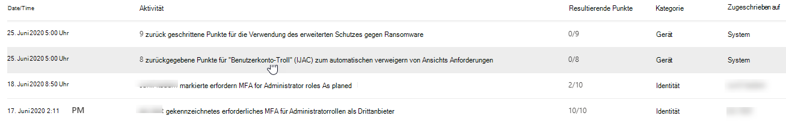
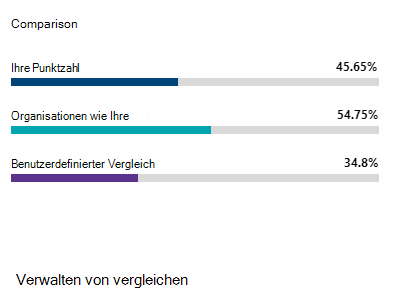
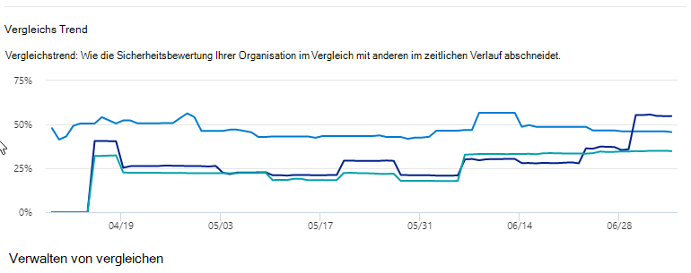

# Verfolgen Des Verlaufs der Microsoft Secure Score und Erreichen der Ziele

[!INCLUDE [Microsoft 365 Defender rebranding](../includes/microsoft-defender.md)]

[Die Microsoft Secure Score](microsoft-secure-score.md) ist eine Messung des Sicherheitsstands einer Organisation, mit einer höheren Zahl, die mehr Verbesserungsmaßnahmen anzeigt. Sie finden sie unter https://security.microsoft.com/securescore im [Microsoft 365 Security Center ](overview-security-center.md).

## Erhalten Von Einblicken in Aktivitäten, die Sich auf Ihre Bewertung ausdingen

Zeigen Sie auf der Registerkarte "Verlauf" ein Diagramm der Bewertung Ihrer Organisation im **Laufe der Zeit** an.

Unterhalb des Diagramms finden Sie eine Liste aller Aktionen im ausgewählten Zeitraum und deren Attribute, z. B. resultierende Punkte und Kategorie. Sie können einen Datumsbereich anpassen und nach Kategorie filtern.

Wenn Sie die Verbesserungsaktion im Zusammenhang mit einer Aktivität auswählen, wird das Flyout für die vollständige Verbesserungsaktion angezeigt.

Wenn Sie den Verlauf für diese spezifische Verbesserungsaktion anzeigen möchten, wählen Sie im Flyout den Verlaufslink aus.

## Trends erkennen und Ziele festlegen

Auf der Registerkarte **Metriken und Trends** finden Sie mehrere Graphen und Diagramme, die Ihnen einen besseren Einblick in Trends und festgelegte Ziele ermöglichen. Sie können den Datumsbereich für die gesamte Seite der Visualisierungen festlegen. Die Visualisierungen umfassen:

* **Ihre Secure Score Zone** – angepasst basierend auf den Zielen und Definitionen der Bereiche "Gut", "Ok" und "Schlecht".
* **Regressionstrend** : Eine Zeitachse mit Punkten, die aufgrund von Konfigurations-, Benutzer- oder Geräteänderungen zurückgewechselt wurden.  
* **Vergleichstrend** : Wie die Sicherheitsergebniszahl Ihrer Organisation im Laufe der Zeit mit anderen verglichen wird. Diese Ansicht kann Linien enthalten, die den Bewertungsdurchschnitt von Organisationen mit ähnlicher Anzahl von Plätzen darstellt, sowie eine benutzerdefinierte Vergleichsansicht, die Sie festlegen können.
* **Risikoakzeptanztrend** – Zeitachse der Verbesserungsmaßnahmen, die als "Risiko akzeptiert" gekennzeichnet sind.
* **Score changes** – The number of points achieved, points regressed, and changes to your score in the specified date range.

### Vergleichen Ihrer Bewertung mit Organisationen wie Ihrer

Es gibt zwei Orte, an denen Sie sehen können, wie Sich Ihre Bewertung mit Organisationen vergleicht, die Ihnen ähnlich sind. In beiden Diagrammen können Sie **Vergleiche** verwalten auswählen, um die Informationen Ihrer Organisation anzuzeigen und zu bearbeiten. Sie können auch einen benutzerdefinierten Vergleich basierend auf Branche, Organisationsgröße, Lizenzen und Regionen erstellen.

#### Vergleichsbalkendiagramm

Das Diagramm der Vergleichsleiste ist die Registerkarte **"Übersicht".** Zeigen Sie auf das Diagramm, um die Bewertungs- und Bewertungschancen zu sehen. Die Vergleichsdaten sind anonymisiert, sodass wir nicht genau wissen, welche anderen Mandanten sich in der Kombination befinden.

- **Organisationen wie Ihre:** eine durchschnittliche Bewertung anderer Mandanten (sofern mindestens fünf Mandanten verglichen werden müssen), die mit den folgenden Kriterien in Frage kommen:
    1. Gleiche Branche
    2. Gleiche Organisationsgröße
    3. Alle Regionen
    4. Verwendete Microsoft-Produkte sind zu 80 % ähnlich
    5. Opportunity (max score that can be achieved by current license) within a 20 % range from your tenant

- **Benutzerdefinierter Vergleich:** Muss eingerichtet werden, indem **Sie** auf der Grundlage der folgenden Kriterien die Option Vergleich verwalten auswählen:
    1. Ausgewählte Branchen
    2. Ausgewählte Organisationsgröße(en)
    3. Ausgewählte Regionen
    4. Ausgewählte Lizenzen
    5. Verwendete Microsoft-Produkte sind zu 80 % ähnlich
    6. Opportunity (max score that can be achieved by current license) within a 20 % range from your tenant

Wenn Sie eine benutzerdefinierte Auswahl getroffen haben, die Ergebnisse jedoch weniger als fünf andere Mandanten haben, mit der wir vergleichen können, wird "Aufgrund eingeschränkter Daten nicht verfügbar" angezeigt.

#### Vergleichstrend

In the **Metrics & trends** tab, view how your organization's Secure Score compares to others' over time.

## Wir freuen uns über Ihr Feedback

Wenn Sie Probleme haben, teilen Sie uns dies mit, indem Sie sie in der [Community "Sicherheit& Datenschutzrichtlinien"](https://techcommunity.microsoft.com/t5/Security-Privacy-Compliance/bd-p/security_privacy) veröffentlichen. Die Communitybeiträge werden überwacht und wir sind ständig bemüht, Ihnen zu helfen.

## Verwandte Ressourcen

- [Übersicht über die Microsoft Secure Score](microsoft-secure-score.md)
- [Zugreifen auf Ihren Sicherheitsstatus](microsoft-secure-score-improvement-actions.md)
- [Was in Kürze verfügbar ist](microsoft-secure-score-whats-coming.md)
- [Neuerungen](microsoft-secure-score-whats-new.md)
