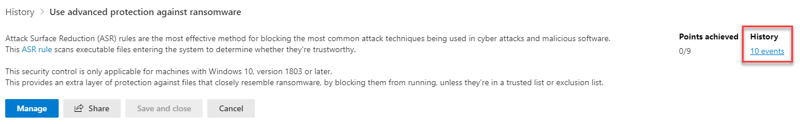

# Verfolgen des Microsoft Secure Score-Verlaufs und erreichen der ZieleTrack your Microsoft Secure Score history and meet goals

[Microsoft Secure Score](microsoft-secure-score.md) ist ein Maß für die Sicherheitslage einer Organisation mit einer höheren Zahl, die mehr Verbesserungs Aktionen anzeigt.[Microsoft Secure Score](microsoft-secure-score.md) is a measurement of an organization's security posture, with a higher number indicating more improvement actions taken. Sie finden sie unter https://security.microsoft.com/securescore im [Microsoft 365 Security Center ](overview-security-center.md).It can be found at https://security.microsoft.com/securescore in the [Microsoft 365 security center](overview-security-center.md).

## Erhalten Sie Einblicke in Aktivitäten, die Ihre Punktzahl beeinflusst haben.Gain insights into activity that has affected your score

Zeigen Sie auf der Registerkarte **Verlauf** ein Diagramm der Bewertung Ihrer Organisation über einen Zeitraum an.View a graph of your organization's score over time in the **History** tab.

Unter dem Diagramm finden Sie eine Liste aller Aktionen, die im ausgewählten Zeitbereich ausgeführt wurden, sowie deren Attribute, wie beispielsweise Ergebnis Punkte und Kategorie.Below the graph is a list of all the actions taken in the selected time range and their attributes, such as resulting points and category. Sie können einen Datumsbereich anpassen und nach Kategorie filtern.You can customize a date range and filter by category.

Wenn Sie die einer Aktivität zugeordnete Verbesserungs Aktion auswählen, wird das Flyout vollständige Verbesserungs Aktion angezeigt.If you select the improvement action associated with an activity, the full improvement action flyout will appear.

Um den gesamten Verlauf für diese bestimmte Verbesserungs Aktion anzuzeigen, wählen Sie den Link Verlauf im Flyout aus.To view all history for that specific improvement action, select the history link in the flyout.

## Trends entdecken und Ziele festlegenDiscover trends and set goals

Auf der Registerkarte **Metriken und Trends** finden Sie mehrere Graphen und Diagramme, die Ihnen einen besseren Einblick in Trends und festgelegte Ziele ermöglichen.In the **Metrics & trends** tab, there are several graphs and charts to give you more visibility into trends and set goals. Sie können den Datumsbereich für die gesamte Seite der Visualisierungen festlegen.You can set the date range for the whole page of visualizations. Die Visualisierungen umfassen:The visualizations include:

* **Ihre Sicherheitsbewertungszone**: Angepasst, basierend auf den Zielen und Definitionen Ihrer Organisation für die Bewertungsbereiche „Gut“, „OK“ und „Schlecht“.**Your Secure Score zone** — Customized based on your organization's goals and definitions of good, okay, and bad score ranges.
* **Verschlechterungstrend**: Eine Zeitachse mit Punkten, die sich aufgrund von Änderungen an der Konfiguration, am Benutzer oder am Gerät verschlechtert haben.**Regression trend** — A timeline of points that have regressed due to configuration, user, or device changes.  
* **Vergleichstrend**: Wie die Sicherheitsbewertung Ihrer Organisation im Vergleich mit anderen im zeitlichen Verlauf abschneidet.**Comparison trend** — How your organization's Secure Score compares to others' over time. Diese Ansicht kann Linien enthalten, die den Bewertungsdurchschnitt von Organisationen mit ähnlicher Anzahl von Plätzen darstellt, sowie eine benutzerdefinierte Vergleichsansicht, die Sie festlegen können.This view can include lines representing the score average of organizations with similar seat count and a custom comparison view that you can set.
* **Risikoakzeptanztrend**: Zeitachse mit Verbesserungsmaßnahmen, die mit „Risiko akzeptiert“ gekennzeichnet sind.**Risk acceptance trend** — Timeline of improvement actions marked as "risk accepted."
* **Änderungen an der Bewertung**: Die Anzahl der erzielten Punkte, verschlechterter Punkte sowie der sich anschließenden Bewertungsänderung im angegebenen Datumsbereich.**Score changes** — The number of points achieved, points regressed, along with the subsequent score change, in the specified date range.

### Vergleichen Sie Ihre Punktzahl mit Organisationen wie IhremCompare your score to organizations like yours

Es gibt zwei Orte, um zu sehen, wie Ihre Gäste mit Organisationen verglichen werden, die Ihnen ähnlich sind.There are two place to see how your score compares to organizations that are similar to you.

Die erste Stelle befindet sich auf der Registerkarte " **Übersicht** ", auf der Sie ein Vergleichs Balkendiagramm sehen können.The first place is in the **Overview** tab, where you will be able to see a comparison bar graph. Zeigen Sie mit dem Mauszeiger auf das Diagramm, um die Möglichkeit zur Bewertung und Bewertung anzuzeigen.Hover over the chart to view the score and score opportunity.

Der zweite Platz befindet sich auf der Registerkarte **Metriken & Trends** , auf der Sie sehen können, wie sich die sichere Punktzahl Ihrer Organisation im Laufe der Zeit mit anderen vergleichen lässt.The second place is in the **Metrics & trends** tab, where you can view how your organization's Secure Score compares to others' over time.

In beiden Diagrammen können Sie **Vergleiche verwalten** auswählen, um die Informationen Ihrer Organisation anzuzeigen und zu bearbeiten.In both charts, you can select **Manage comparisons** to view and edit your organization's information. Sie können auch einen benutzerdefinierten Vergleich basierend auf Industrie, Organisationsgröße, Lizenzen und Regionen erstellen.You can also create a custom comparison based on industry, organization size, licenses, and regions. 

## Wir freuen uns über Ihr FeedbackWe want to hear from you

Wenn Sie Probleme haben, informieren Sie uns mit einem Beitrag in der Community für [Sicherheit, Datenschutz und Compliance](https://techcommunity.microsoft.com/t5/Security-Privacy-Compliance/bd-p/security_privacy).If you have any issues, please let us know by posting in the [Security, Privacy & Compliance](https://techcommunity.microsoft.com/t5/Security-Privacy-Compliance/bd-p/security_privacy) community. Die Communitybeiträge werden überwacht und wir sind ständig bemüht, Ihnen zu helfen.We're monitoring the community and will provide help.

## Verwandte RessourcenRelated resources

- [Microsoft Secure Score (Übersicht)Microsoft Secure Score overview](microsoft-secure-score.md)
- [Erhalten Sie Einblicke in Ihren SicherheitsstatusGain visibility into your security posture](microsoft-secure-score-improvement-actions.md)
- [Was in Kürze verfügbar istWhat's coming](microsoft-secure-score-whats-coming.md)