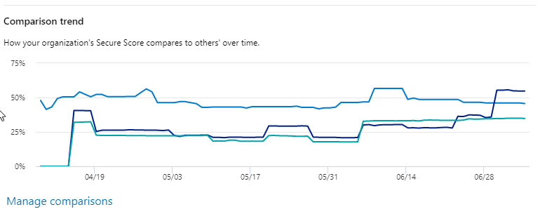

# Verfolgen des Microsoft Secure Score-Verlaufs und erreichen der ZieleTrack your Microsoft Secure Score history and meet goals

[!INCLUDE [Microsoft 365 Defender rebranding](../includes/microsoft-defender.md)]

[Microsoft Secure Score](microsoft-secure-score.md) ist ein Maß für die Sicherheitslage einer Organisation mit einer höheren Zahl, die mehr Verbesserungs Aktionen anzeigt.[Microsoft Secure Score](microsoft-secure-score.md) is a measurement of an organization's security posture, with a higher number indicating more improvement actions taken. Sie finden sie unter https://security.microsoft.com/securescore im [Microsoft 365 Security Center ](overview-security-center.md).It can be found at https://security.microsoft.com/securescore in the [Microsoft 365 security center](overview-security-center.md).

## Erhalten Sie Einblicke in Aktivitäten, die Ihre Punktzahl beeinflusst haben.Gain insights into activity that has affected your score

Zeigen Sie auf der Registerkarte **Verlauf** ein Diagramm der Bewertung Ihrer Organisation über einen Zeitraum an.View a graph of your organization's score over time in the **History** tab.

Unter dem Diagramm finden Sie eine Liste aller Aktionen, die im ausgewählten Zeitbereich ausgeführt wurden, sowie deren Attribute, wie beispielsweise Ergebnis Punkte und Kategorie.Below the graph is a list of all the actions taken in the selected time range and their attributes, such as resulting points and category. Sie können einen Datumsbereich anpassen und nach Kategorie filtern.You can customize a date range and filter by category.

Wenn Sie die einer Aktivität zugeordnete Verbesserungs Aktion auswählen, wird das Flyout vollständige Verbesserungs Aktion angezeigt.If you select the improvement action associated with an activity, the full improvement action flyout will appear.

Um den gesamten Verlauf für diese bestimmte Verbesserungs Aktion anzuzeigen, wählen Sie den Link Verlauf im Flyout aus.To view all history for that specific improvement action, select the history link in the flyout.

## Trends entdecken und Ziele festlegenDiscover trends and set goals

Auf der Registerkarte **Metriken und Trends** finden Sie mehrere Graphen und Diagramme, die Ihnen einen besseren Einblick in Trends und festgelegte Ziele ermöglichen.In the **Metrics & trends** tab, there are several graphs and charts to give you more visibility into trends and set goals. Sie können den Datumsbereich für die gesamte Seite der Visualisierungen festlegen.You can set the date range for the whole page of visualizations. Die Visualisierungen umfassen:The visualizations include:

* **Ihre sichere Ergebnis Zone** – angepasst basierend auf den Zielen und Definitionen Ihrer Organisation für gute, ordnungsgemäße und ungültige Bewertungsbereiche.**Your Secure Score zone** - Customized based on your organization's goals and definitions of good, okay, and bad score ranges.
* **Regressions Trend** – eine Zeitskala mit Punkten, die aufgrund von Konfigurations-, Benutzer-oder Geräteänderungen zurückgegangen sind.**Regression trend** - A timeline of points that have regressed because of configuration, user, or device changes.  
* **Vergleichs Trend** – wie die sichere Punktzahl Ihres Unternehmens mit anderen im Laufe der Zeit vergleicht.**Comparison trend** - How your organization's Secure Score compares to others' over time. Diese Ansicht kann Linien enthalten, die den Bewertungsdurchschnitt von Organisationen mit ähnlicher Anzahl von Plätzen darstellt, sowie eine benutzerdefinierte Vergleichsansicht, die Sie festlegen können.This view can include lines representing the score average of organizations with similar seat count and a custom comparison view that you can set.
* **Trend zur Risikoakzeptanz** – Zeitskala der Verbesserungs Aktionen, die als "Risiko akzeptiert" gekennzeichnet sind.**Risk acceptance trend** - Timeline of improvement actions marked as "risk accepted."
* **Ergebnisänderungen** : Anzahl der erreichten Punkte, rückläufige Punkte und Änderungen an der Punktzahl im angegebenen Datumsbereich.**Score changes** - The number of points achieved, points regressed, and changes to your score in the specified date range.

### Vergleichen Sie Ihre Punktzahl mit Organisationen wie IhremCompare your score to organizations like yours

Es gibt zwei Möglichkeiten, um zu sehen, wie sich Ihre Partitur mit Organisationen vergleicht, die Ihnen ähnlich sind.There are two places to see how your score compares to organizations that are similar to you. In beiden Diagrammen können Sie **Vergleiche verwalten** auswählen, um die Informationen Ihrer Organisation anzuzeigen und zu bearbeiten.In both charts, you can select **Manage comparisons** to view and edit your organization's information. Sie können auch einen benutzerdefinierten Vergleich basierend auf Industrie, Organisationsgröße, Lizenzen und Regionen erstellen.You can also create a custom comparison based on industry, organization size, licenses, and regions.

#### Vergleichs BalkendiagrammComparison bar chart

Das Vergleichs Balkendiagramm ist die Registerkarte **Übersicht** . Zeigen Sie mit dem Mauszeiger auf das Diagramm, um die Möglichkeit zur Bewertung und Bewertung anzuzeigen.The comparison bar chart is the **Overview** tab. Hover over the chart to view the score and score opportunity. Die Vergleichsdaten werden anonymisiert, sodass wir nicht genau wissen, welche anderen Mandanten sich in der Mischung befinden.The comparison data is anonymized so we don’t know exactly which others tenants are in the mix.

- **Organisationen wie Ihre**: eine durchschnittliche Punktzahl anderer Mandanten (vorausgesetzt, es müssen mindestens fünf Mandanten miteinander verglichen werden), die mit den folgenden Kriterien qualifiziert sind:**Organizations like yours**: an average score of other tenants (provided we have at least five or more tenants to compare) that qualify with the following criteria:
    1. Gleiche BrancheSame industry
    2. Gleiche OrganisationsgrößeSame organization size
    3. Alle RegionenAll regions
    4. Verwendete Microsoft-Produkte sind 80% ähnlichMicrosoft products used are 80% similar
    5. Verkaufschance (maximale Punktzahl, die mit der aktuellen Lizenz erzielt werden kann) innerhalb eines Bereichs von 20% von Ihrem MandantenOpportunity (max score that can be achieved by current license) within a 20% range from your tenant

- **Benutzerdefinierter Vergleich**: muss durch Auswählen von **Vergleichs Vergleich** basierend auf den folgenden Kriterien eingerichtet werden:**Custom Comparison**: needs to be set up by selecting **Manage Comparison** based on the following criteria:
    1. Ausgewählte Branche (n)Selected industry(s)
    2. Ausgewählte Organisationsgröße (n)Selected organization size(s)
    3. Ausgewählte Region (en)Selected region(s)
    4. Ausgewählte Lizenz (en)Selected license(s)
    5. Verwendete Microsoft-Produkte sind 80% ähnlichMicrosoft products used are 80% similar
    6. Verkaufschance (maximale Punktzahl, die mit der aktuellen Lizenz erzielt werden kann) innerhalb eines Bereichs von 20% von Ihrem MandantenOpportunity (max score that can be achieved by current license) within a 20% range from your tenant

Wenn Sie eine benutzerdefinierte Auswahl getroffen haben, aber die Ergebnisse weniger als fünf andere Mandanten haben, mit denen wir vergleichen können, sehen Sie "aufgrund von begrenzten Daten nicht verfügbar".If you've made a custom selection but the results have less than five other tenants that we can compare against, you'll see “Not available due to limited data”.

#### Vergleichs TrendComparison trend

Zeigen Sie auf der Registerkarte **Metriken & Trends** , wie sich die sichere Punktzahl Ihrer Organisation im Laufe der Zeit mit anderen vergleicht.In the **Metrics & trends** tab, view how your organization's Secure Score compares to others' over time.

## Wir freuen uns über Ihr FeedbackWe want to hear from you

Wenn Sie Probleme haben, lassen Sie es uns wissen, indem Sie in der [Sicherheits-, Datenschutz-& Compliance](https://techcommunity.microsoft.com/t5/Security-Privacy-Compliance/bd-p/security_privacy) -Community veröffentlichen.If you have any issues, let us know by posting in the [Security, Privacy & Compliance](https://techcommunity.microsoft.com/t5/Security-Privacy-Compliance/bd-p/security_privacy) community. Die Communitybeiträge werden überwacht und wir sind ständig bemüht, Ihnen zu helfen.We're monitoring the community and will provide help.

## Verwandte RessourcenRelated resources

- [Microsoft Secure Score (Übersicht)Microsoft Secure Score overview](microsoft-secure-score.md)
- [Zugreifen auf Ihren SicherheitsstatusAssess your security posture](microsoft-secure-score-improvement-actions.md)
- [Was in Kürze verfügbar istWhat's coming](microsoft-secure-score-whats-coming.md)
- [NeuerungenWhat's new](microsoft-secure-score-whats-new.md)
