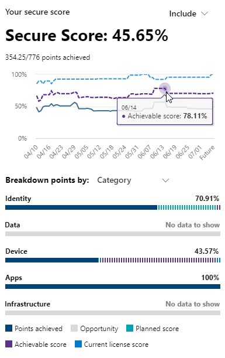

# Bewerten Ihrer Sicherheitsposition mit Microsoft Secure Score

[!INCLUDE [Microsoft 365 Defender rebranding](../includes/microsoft-defender.md)]

Die Microsoft-Sicherheitsbewertung ist ein Maßstab für den Sicherheitsstatus eines Unternehmens. Eine höhere Zahl bedeutet, dass mehr Verbesserungsmaßnahmen vorgenommen wurden. Sie finden sie unter https://security.microsoft.com/securescore im [Microsoft 365 Security Center ](overview-security-center.md).

Damit Sie die benötigten Informationen schneller finden können, sind die Microsoft Verbesserungsmaßnahmen in Gruppen aufgeteilt:

* Identity (Azure Active Directory Accounts & Roles)
* Gerät (Microsoft Defender für Endpoint, bekannt als [Microsoft Secure Score für Geräte](https://docs.microsoft.com/windows/security/threat-protection/microsoft-defender-atp/tvm-microsoft-secure-score-devices))
* App (E-Mail-und Cloud-Apps, einschließlich Office 365 und Microsoft Cloud App Security)

>[!NOTE]
>In der letzten Version von Microsoft-Sicherheitsbewertung wurde ein verbessertes Bewertungsmodell veröffentlicht, das zu einer vorübergehenden Inkompatibilität der Microsoft-Sicherheitsbewertung mit der Identitätssicherheitsbewertung und der Graph-API geführt hatte. [Details anzeigen](microsoft-secure-score-whats-new.md)

Lesen Sie auf der Seite Microsoft Secure Score Overview, wie Punkte zwischen diesen Gruppen aufgeteilt werden und welche Punkte verfügbar sind. Sie können auch eine Übersicht über die Gesamtpunktzahl, den Verlauf ihrer sicheren Bewertung mit Benchmark-Vergleichen sowie Prioritäten für Verbesserungs Aktionen erhalten, die zur Verbesserung ihrer Punktzahl ergriffen werden können.

## Überprüfen der aktuellen Bewertung

Um Ihre aktuelle Bewertung zu überprüfen, wechseln Sie zur Microsoft Secure Score-Übersichtsseite, und suchen Sie nach der Kachel, die **Ihre sichere Punktzahl** angibt. Ihre Punktzahl wird als Prozentsatz angezeigt, zusammen mit der Anzahl der Punkte, die Sie aus insgesamt möglichen Punkten erzielt haben.

Wenn Sie darüber hinaus die Schaltfläche **einschließen** neben dem Ergebnis auswählen, können Sie unterschiedliche Ansichten der Partitur auswählen. Diese unterschiedlichen Bewertungs Ansichten werden im Diagramm auf der Ergebnis Kachel und im Punkt Aufgliederungs Diagramm angezeigt.

Im folgenden werden Partituren angezeigt, die Sie Ihrer Gesamtpunktzahl hinzufügen können, um ein vollständigeres Bild Ihres Gesamtergebnisses zu erhalten:

- **Geplante Punktzahl**: projiziertes Ergebnis anzeigen, wenn geplante Aktionen abgeschlossen sind
- **Aktuelle Lizenz Bewertung**: Ergebnis anzeigen, das mit Ihrer aktuellen Microsoft-Lizenz erreicht werden kann
- **Erzielbare Punktzahl**: Ergebnis anzeigen, das mit Ihren Microsoft-Lizenzen und der aktuellen Risikoakzeptanz erreicht werden kann

Diese Ansicht wird wie folgt aussehen, wenn Sie alle möglichen Bewertungs Ansichten berücksichtigt haben:

## Ergreifen Sie Maßnahmen, um Ihre Punktzahl zu verbessern

Auf der Registerkarte **Verbesserungs Aktionen** werden die Sicherheitsempfehlungen aufgelistet, die mögliche Angriffs Oberflächen behandeln. Sie enthält auch ihren Status (zum adressieren, planen, Risiko akzeptiert, durch Drittanbieter aufgelöst, durch alternative Schadensbegrenzende Maßnahmen gelöst und abgeschlossen). Sie können alle Verbesserungsmaßnahmen durchsuchen, filtern und gruppieren.  

### Rangfolge

Die Rangfolge basiert auf der Anzahl der zu erzielenden Punkte, der Implementierungs Schwierigkeit, der Benutzer Auswirkungen und der Komplexität. Die am höchsten bewerteten Verbesserungen bieten viele Punkte mit geringem Schwierigkeitsgrad, Auswirkungen auf Benutzer, sowie Komplexität.

### Anzeigen von Details zu Verbesserungsmaßnahmen

Wenn Sie eine bestimmte Verbesserungsmaßnahme auswählen, wird ein vollständiges Seiten-Flyout angezeigt.  

*Abbildung 2: Beispiel für Verbesserungsmaßnahmen-Flyout*

Zum Ausführen der Maßnahme stehen Ihnen verschiedene Optionen zur Verfügung:

* Wählen Sie **Verwalten** aus, um in den Konfigurationsbildschirm zu wechseln und die Änderung vorzunehmen. Sie erhalten dann die Punkte, die die Aktion Wert ist, sichtbar in der ausfliegen. Die Aktualisierung der Punkte dauert im Allgemeinen ungefähr 24 Stunden.

* Wählen Sie **Freigeben** aus, um den direkten Link zur Verbesserungs Aktion zu kopieren. Sie können auch die Plattform für die Freigabe der Verknüpfung auswählen, beispielsweise e-Mail, Microsoft Teams, Microsoft Planner oder ServiceNow. Wenn Sie ServiceNow auswählen, können Sie ein Änderungs Ticket erstellen, das in ServiceNow und im Microsoft 365 Security Center Home angezeigt wird. Weitere Informationen finden Sie unter [Microsoft 365 Security Center und ServiceNow-Integration](tickets-security-center.md).

### Auswählen eines Verbesserungsmaßnahmenstatus

Wählen Sie beliebige Status aus, und zeichnen Sie Notizen auf, die für die Verbesserungsmaßnahme spezifisch sind.

- **Zur Adresse** -Sie erkennen an, dass die Verbesserungs Aktion erforderlich ist, und planen, diese zu einem bestimmten Zeitpunkt in der Zukunft zu beheben. Dieser Status gilt auch für Aktionen, die als partiell, jedoch nicht vollständig abgeschlossen erkannt werden.
- **Geplant** – es sind konkrete Pläne vorhanden, um die Verbesserungs Aktion abzuschließen.
- **Risikoakzeptanz** – die Sicherheit sollte immer mit der Benutzerfreundlichkeit ausgeglichen werden, und nicht jede Empfehlung funktioniert für Ihre Umgebung. Wenn dies der Fall ist, können Sie sich entschließen, das Risiko bzw. das Restrisiko zu übernehmen und die Verbesserungsmaßnahme nicht zu ergreifen. Ihnen werden keine Punkte gegeben, aber die Aktion wird in der Liste der Verbesserungs Aktionen nicht mehr angezeigt. Sie können diese Aktion jederzeit im Verlauf anzeigen oder rückgängig machen.
- **Durch Drittanbieter aufgelöst** und **durch alternative Schadensbegrenzende Maßnahmen aufgelöst** – die Verbesserungs Aktion wurde bereits von einer Drittanbieteranwendung oder-Software oder einem internen Tool behandelt. Sie erhalten die Punkte, die die Aktion Wert ist, sodass Ihre Punktzahl besser Ihre gesamte Sicherheitsposition widerspiegelt. Wenn ein Drittanbieter- oder internes Toll diese Maßnahme nicht mehr abdeckt, können Sie einen anderen Status auswählen. Beachten Sie, dass Microsoft keine Sichtbarkeit in die Vollständigkeit der Implementierung hat, wenn die Verbesserungs Aktion als einer dieser Status markiert ist.

#### Verbesserungsmaßnahmen für Bedrohungs- und Sicherheitsrisikoverwaltung

Für Verbesserungs Aktionen in der Kategorie "Gerät" können Sie Status nicht auswählen. Stattdessen werden Sie zur entsprechenden [Threat & Vulnerability Management (TVM)-Sicherheitsempfehlung](https://docs.microsoft.com/windows/security/threat-protection/microsoft-defender-atp/tvm-security-recommendation) im [Microsoft Defender Security Center](https://docs.microsoft.com/windows/security/threat-protection/microsoft-defender-atp/use) geleitet, um Maßnahmen zu ergreifen. Die von Ihnen ausgewählte Ausnahme und die Begründung, die Sie schreiben, sind für dieses Portal spezifisch. Sie wird im Microsoft Secure Score-Portal nicht vorhanden sein.

#### Erledigte Verbesserungsmaßnahmen

Verbesserungsmaßnahmen haben den Status „Erledigt“, sobald alle möglichen Punkte der Verbesserungsmaßnahme erzielt wurden. Abgeschlossene Verbesserungs Aktionen werden zwar von Microsoft-Daten bestätigt, und Sie können den Status nicht ändern.

### Bewerten von Informationen und Überprüfen der Auswirkungen auf Benutzer

In dem Abschnitt, der **auf einen Blick** aufgerufen wird, erfahren Sie mehr über die Kategorie, über Angriffe, die Sie schützen kann, und über das Produkt.

Die **Benutzerauswirkungen** zeigen, was bei den Benutzern geschieht, wenn die Verbesserungsmaßnahme vorgenommen wird, und unter **Betroffene Benutzer** wird angezeigt, wer diese Erfahrungen machen wird.

### Implementieren der Verbesserungsmaßnahmen

Im Abschnitt **Implementierung** werden alle Voraussetzungen, schrittweisen nächsten Schritte zum Abschließen der Verbesserungs Aktion, der aktuelle Implementierungsstatus der Verbesserungs Aktion sowie alle weiteren Links zu weiteren Informationen aufgeführt.

Voraussetzungen umfassen alle Lizenzen, die abgerufen werden müssen, oder Aktionen, die ausgeführt werden müssen, bevor die Verbesserungs Aktion behandelt wird. Vergewissern Sie sich, dass Ihre Lizenz genügend Plätze abdeckt, um die Verbesserungsmaßnahme vornehmen zu können, und dass diese Lizenzen auf die erforderlichen Benutzer angewendet werden.  

## Wir freuen uns über Ihr Feedback

Wenn Sie Probleme haben, lassen Sie es uns wissen, indem Sie in der [Sicherheits-, Datenschutz-& Compliance](https://techcommunity.microsoft.com/t5/Security-Privacy-Compliance/bd-p/security_privacy) -Community veröffentlichen. Die Communitybeiträge werden überwacht und wir sind ständig bemüht, Ihnen zu helfen.

## Verwandte Ressourcen

- [Microsoft Secure Score (Übersicht)](microsoft-secure-score.md)
- [Verfolgen des Microsoft Secure Score-Verlaufs und erreichen der Ziele](microsoft-secure-score-history-metrics-trends.md)
- [Was in Kürze verfügbar ist](microsoft-secure-score-whats-coming.md)
- [Neuerungen](microsoft-secure-score-whats-new.md)
