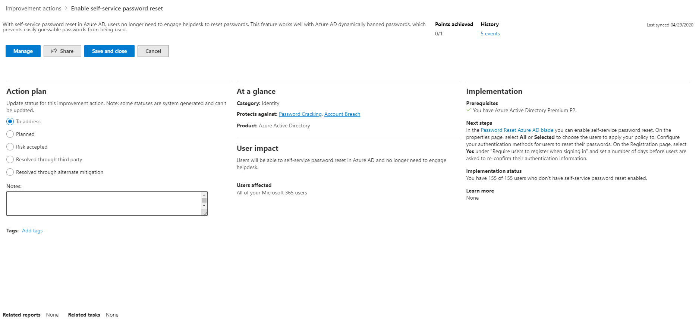

# Erhalten der Sichtbarkeit in ihrer Sicherheitsposition durch Microsoft Secure ScoreGain visibility into your security posture through Microsoft Secure Score

Die Microsoft-Sicherheitsbewertung ist ein Maßstab für den Sicherheitsstatus eines Unternehmens. Eine höhere Zahl bedeutet, dass mehr Verbesserungsmaßnahmen vorgenommen wurden.Microsoft Secure Score is a measurement of an organization's security posture, with a higher number indicating more improvement actions taken. Sie finden sie unter https://security.microsoft.com/securescore im [Microsoft 365 Security Center ](overview-security-center.md).It can be found at https://security.microsoft.com/securescore in the [Microsoft 365 security center](overview-security-center.md).

Damit Sie die benötigten Informationen schneller finden können, sind die Microsoft Verbesserungsmaßnahmen in Gruppen aufgeteilt:To help you the information you need more quickly, Microsoft improvement actions are organized into groups:

* Identität (Azure AD-Konten & -Rollen)Identity (Azure AD accounts & roles)
* Daten (Microsoft Information Protection)Data  (Microsoft Information Protection)
* Gerät (Microsoft Defender ATP, bekannt als [Konfigurationsergebnis](https://docs.microsoft.com/windows/security/threat-protection/microsoft-defender-atp/configuration-score))Device (Microsoft Defender ATP, known as [Configuration score](https://docs.microsoft.com/windows/security/threat-protection/microsoft-defender-atp/configuration-score))
* App (E-Mail-und Cloud-Apps, einschließlich Office 365 und Microsoft Cloud App Security)App (email and cloud apps, including Office 365 and Microsoft Cloud App Security)
* Infrastruktur (bisher keine Verbesserungsmaßnahmen)Infrastructure (no improvement actions for now)

>[!NOTE]
>In der letzten Version von Microsoft-Sicherheitsbewertung wurde ein verbessertes Bewertungsmodell veröffentlicht, das zu einer vorübergehenden Inkompatibilität der Microsoft-Sicherheitsbewertung mit der Identitätssicherheitsbewertung und der Graph-API geführt hatte.In the recent release of Microsoft Secure Score, an improved scoring model has been released which made Microsoft Secure Score temporarily incompatible with Identity Secure Score and the Graph API. [Details anzeigenView details](microsoft-secure-score.md#incompatibility-with-identity-secure-score-and-graph-api)

Auf der Übersicht der Microsoft-Sicherheitsbewertung können Sie sehen, wie die Punkte zwischen diesen Gruppen aufgeteilt werden und welche Punkte verfügbar sind.In the Microsoft Secure Score overview page, you can see how points are split between these groups and what points are available. Auf der Übersichtsseite können Sie auch einen Überblick über die Gesamtpunktzahl, den historischen Trend Ihres Sicherheitsbewertung mit Benchmark-Vergleichen sowie priorisierte Verbesserungsmaßnahmen zur Verbesserung ihrer Punktzahl erhalten.The overview page is also the place to get an all-up view of the total score, historical trend of your secure score with benchmark comparisons, and prioritized improvement actions that can be taken to improve your score.

## Überprüfen der aktuellen BewertungCheck your current score

Um Ihre aktuelle Bewertung zu überprüfen, wechseln Sie zur Microsoft Secure Score-Übersichtsseite, und suchen Sie nach der Kachel, die **Ihre sichere Punktzahl**angibt.To check on your current score, go to the Microsoft Secure Score overview page and look for the tile that says **Your secure score**. Ihre Punktzahl wird als Prozentsatz angezeigt, zusammen mit der Anzahl der Punkte, die Sie aus insgesamt möglichen Punkten erzielt haben.Your score will be shown as a percentage, along with the number of points you have achieved out of a total possible points.

Wenn Sie darüber hinaus die Schaltfläche **einschließen** neben dem Ergebnis auswählen, können Sie unterschiedliche Ansichten der Partitur auswählen.Additionally, if you select the **Include** button next to your score, you can choose different views of your score. Diese unterschiedlichen Bewertungs Ansichten werden im Diagramm auf der Ergebnis Kachel und im Punkt Aufgliederungs Diagramm angezeigt.These different score views will display in the graph on the score tile and the point breakdown chart.

Im folgenden werden Partituren angezeigt, die Sie Ihrer Gesamtpunktzahl hinzufügen können, um ein vollständigeres Bild Ihres Gesamtergebnisses zu erhalten:The following are scores you can add to your view of your overall score to give you a fuller picture of your overall score:

- **Geplante Punktzahl**: projiziertes Ergebnis anzeigen, wenn geplante Aktionen abgeschlossen sind**Planned score**: Show projected score when planned actions are completed
- **Aktuelle Lizenz Bewertung**: Ergebnis anzeigen, das mit Ihrer aktuellen Microsoft-Lizenz erreicht werden kann**Current license score**: Show score that can be achieved with your current Microsoft license
- **Erzielbare Punktzahl**: Ergebnis anzeigen, das mit Ihren Microsoft-Lizenzen und der aktuellen Risikoakzeptanz erreicht werden kann**Achievable score**: Show score that can be achieved with your Microsoft licenses and current risk acceptance

So sieht es aus, wenn Sie alle möglichen Bewertungs Ansichten berücksichtigt haben:This is what it will look like if you have included all possible score views:

## Ergreifen Sie Maßnahmen, um Ihre Punktzahl zu verbessernTake action to improve your score

Auf der Registerkarte **Verbesserungsmaßnahmen** werden die Sicherheitsempfehlungen, die mögliche Angriffsflächen behandeln, zusammen mit deren Status („Zu behandeln“, „Geplant“, „Risiko akzeptiert“, „Von Drittanbieter behoben“, „Durch alternative Korrektur behoben“ und „Erledigt“) aufgelistet.The **Improvement actions** tab lists the security recommendations that address possible attack surfaces, along with their status (to address, planned, risk accepted, resolved through third party, resolved through alternate mitigation, and completed). Sie können alle Verbesserungsmaßnahmen durchsuchen, filtern und gruppieren.You can search, filter, and group all the improvement actions.  

### RangfolgeRanking

Die Bewertung basiert auf der Anzahl der noch zu erreichenden Punkte, der Implementierungsschwierigkeit, der Auswirkungen auf die Benutzer und der Komplexität.Ranking is based on the number of remaining points left to achieve, implementation difficulty, user impact, and complexity. Die am höchsten bewerteten Verbesserungen bieten viele Punkte mit geringem Schwierigkeitsgrad, Auswirkungen auf Benutzer, sowie Komplexität.The highest ranked improvement actions have a large number of points remaining with low difficulty, user impact, and complexity.

### Anzeigen von Details zu VerbesserungsmaßnahmenView improvement action details

Wenn Sie eine bestimmte Verbesserungsmaßnahme auswählen, wird ein vollständiges Seiten-Flyout angezeigt.When you select a specific improvement action, a full page flyout appears.  

*Abbildung 2: Beispiel für Verbesserungsmaßnahmen-Flyout*
*Figure 2: Improvement action flyout example*

Zum Ausführen der Maßnahme stehen Ihnen verschiedene Optionen zur Verfügung:To complete the action, you have a few options:

* Wählen Sie **Verwalten** aus, um in den Konfigurationsbildschirm zu wechseln und die Änderung vorzunehmen.Select **Manage** to go the configuration screen and make the change. Dann erhalten Sie die Punkte, die die Maßnahme wert ist und wie sie im Flyout angezeigt werden. Es dauert in der Regel bis zu 24 Stunden, bis Punkte aktualisiert werden.You will then gain the points that the action is worth, visible in the fly out. Points generally take about 24 hours to update.

* Wählen Sie **Teilen** aus, um den direkten Link zu der Verbesserungsmaßnahme zu kopieren, oder wählen Sie die Plattform für das Teilen des Links aus, z. B. E-Mail, Microsoft Teams, Microsoft Planner oder ServiceNow.Select **Share** to copy the direct link to the improvement action, or choose the platform to share the link such as email, Microsoft Teams, Microsoft Planner, or ServiceNow. Wenn Sie ServiceNow auswählen, können Sie ein Änderungsticket erstellen, das in ServiceNow und auf der Startseite des Microsoft 365 Security Center angezeigt wird.Selecting ServiceNow will let you create a change ticket which will be visible in ServiceNow and the Microsoft 365 security center home. Weitere Informationen finden Sie unter [Microsoft 365 Security Center und ServiceNow-Integration](tickets-security-center.md).To learn more, see [Microsoft 365 security center and ServiceNow integration](tickets-security-center.md).

### Auswählen eines VerbesserungsmaßnahmenstatusChoose an improvement action status

Wählen Sie beliebige Status aus, und zeichnen Sie Notizen auf, die für die Verbesserungsmaßnahme spezifisch sind.Choose any statuses and record notes specific to the improvement action. Sie können die folgenden Status auswählen:The statues you can select are the following:

* **Zu behandeln**: Sie erkennen an, dass die Verbesserungsmaßnahme notwendig ist, und planen deren Durchführung zu einem späteren Zeitpunkt.**To address** — You recognize that the improvement action is necessary and plan to address it at some point in the future. Dieser Zustand gilt auch für Maßnahmen, die als teilweise, aber noch nicht vollständig erledigt erkannt wurden.This state also applies to actions which are detected as partially, but not fully completed.
* **Geplant**: Es gibt konkrete Pläne, die Verbesserungsmaßnahme auszuführen.**Planned** — There are concrete plans in place to complete the improvement action.
* **Risiko akzeptiert**: Sicherheit sollte immer mit Benutzerfreundlichkeit in Einklang stehen, und nicht jede Empfehlung wird für Ihre Umgebung funktionieren.**Risk accepted** — Security should always be balanced with usability, and not every recommendation will work for your environment. Wenn dies der Fall ist, können Sie sich entschließen, das Risiko bzw. das Restrisiko zu übernehmen und die Verbesserungsmaßnahme nicht zu ergreifen.When that is the case, you can choose to accept the risk, or the remaining risk, and not enact the improvement action. Sie erhalten keine Punkte, aber die Maßnahme wird in der Liste der Verbesserungsmaßnahmen nicht mehr angezeigt.You will not be given any points, but the action will no longer be visible in the list of improvement actions. Sie können diese Aktion jederzeit im Verlauf anzeigen oder rückgängig machen.You can view this action in history or undo it at any time.
* **Von Drittanbieter behoben** und **Durch alternative Korrektur behoben**:Die Verbesserungsmaßnahme wurde bereits von einer Drittanbieteranwendung oder -software oder einem internen Tool vorgenommen.**Resolved through third party** and **Resolved through alternate mitigation** — The improvement action has already been addressed by a third-party application or software, or an internal tool. Sie erhalten die Punkte, die die Maßnahme wert ist, damit Ihre Bewertung Ihren Sicherheitsstatus im Ganzen besser widerspiegelt.You will gain the points that the action is worth, so your score better reflects your overall security posture. Wenn ein Drittanbieter- oder internes Toll diese Maßnahme nicht mehr abdeckt, können Sie einen anderen Status auswählen.If a third party or internal tool no longer covers the control, you can choose another status. Bitte beachten Sie, dass Microsoft keinen Einblick in die Vollständigkeit der Implementierung besitzt, wenn die Verbesserungsmaßnahme mit einem dieser Status gekennzeichnet ist.Please keep in mind, Microsoft will have no visibility into the completeness of implementation if the improvement action is marked as either of these statuses.

#### Verbesserungsmaßnahmen für Bedrohungs- und SicherheitsrisikoverwaltungThreat & Vulnerability Management improvement actions

Für Verbesserungsmaßnahmen in der Kategorie „Gerät“ können Sie keinen Status auswählen.For improvement actions in the "Device" category, you will not be able to choose statuses. Stattdessen werden Sie zu der zugeordneten [Sicherheitsempfehlung des Bedrohungs- und Sicherheitsrisikomanagements (TVM)](https://docs.microsoft.com/windows/security/threat-protection/microsoft-defender-atp/tvm-security-recommendation) im [Microsoft Defender Security Center](https://docs.microsoft.com/windows/security/threat-protection/microsoft-defender-atp/use) geleitet, um Maßnahmen zu ergreifen.Instead, you will be directed to the associated [Threat & Vulnerability Management (TVM) security recommendation](https://docs.microsoft.com/windows/security/threat-protection/microsoft-defender-atp/tvm-security-recommendation) in the [Microsoft Defender Security Center](https://docs.microsoft.com/windows/security/threat-protection/microsoft-defender-atp/use) to take action. Die Ausnahme, die Sie auswählen, und die Begründung, die Sie schreiben, sind spezifisch für dieses Portal und finden sich nicht im Microsoft-Sicherheitsbewertungsportal.The exception you choose and justification you write will specific to that portal, and will not be present in the Microsoft Secure Score portal.

#### Erledigte VerbesserungsmaßnahmenCompleted improvement actions

Verbesserungsmaßnahmen haben den Status „Erledigt“, sobald alle möglichen Punkte der Verbesserungsmaßnahme erzielt wurden.Improvement actions have a "completed" status once all possible points for the improvement action have been achieved. Erledigte Verbesserungsmaßnahmen werden durch Microsoft-Daten bestätigt, und Sie können den Status nicht ändern.Completed improvement actions are confirmed though Microsoft data, and you will not be able to change the status.

### Bewerten von Informationen und Überprüfen der Auswirkungen auf BenutzerAssess information and review user impact

Im Abschnitt **Auf einen Blick** erfahren Sie die Kategorie, Angriffe, vor denen Sie geschützt werden können, sowie das Produkt.The **At a glance** section will tell you the category, attacks it can protect against, and the product.

Die **Benutzerauswirkungen** zeigen, was bei den Benutzern geschieht, wenn die Verbesserungsmaßnahme vorgenommen wird, und unter **Betroffene Benutzer** wird angezeigt, wer diese Erfahrungen machen wird.The **User impact** shows what the users will experience if the improvement action is enacted, and **Users affected** shows who will experience it.

### Implementieren der VerbesserungsmaßnahmenImplement the improvement action

Im Abschnitt **Implementierung** werden alle Voraussetzungen, schrittweise die nächsten Schritte zum Durchführen der Verbesserungsmaßnahme, der aktuelle Implementierungsstatus der Verbesserungsmaßnahme sowie alle „Weitere Informationen“-Links angezeigt.The **Implementation** section shows any prerequisites, step by step next steps to complete the improvement action, the current implementation status of the improvement action, and any learn more links.

Voraussetzungen sind alle Lizenzen, die Sie besitzen müssen, oder Aktionen, die ausgeführt werden müssen, bevor die Verbesserungsmaßnahme vorgenommen wird.Prerequisites will be any licenses that need to be obtained or actions that need to be completed before the improvement action is addressed. Vergewissern Sie sich, dass Ihre Lizenz genügend Plätze abdeckt, um die Verbesserungsmaßnahme vornehmen zu können, und dass diese Lizenzen auf die erforderlichen Benutzer angewendet werden.Make sure you have enough seats in your license to complete the improvement action and that those licenses are applied to the necessary users.  

## Wir freuen uns über Ihr FeedbackWe want to hear from you

Wenn Sie Probleme haben, informieren Sie uns mit einem Beitrag in der Community für [Sicherheit, Datenschutz und Compliance](https://techcommunity.microsoft.com/t5/Security-Privacy-Compliance/bd-p/security_privacy).If you have any issues, please let us know by posting in the [Security, Privacy & Compliance](https://techcommunity.microsoft.com/t5/Security-Privacy-Compliance/bd-p/security_privacy) community. Die Communitybeiträge werden überwacht und wir sind ständig bemüht, Ihnen zu helfen.We're monitoring the community and will provide help.

## Verwandte RessourcenRelated resources

- [Microsoft Secure Score (Übersicht)Microsoft Secure Score overview](microsoft-secure-score.md)
- [Verfolgen des Microsoft Secure Score-Verlaufs und erreichen der ZieleTrack your Microsoft Secure Score history and meet goals](microsoft-secure-score-history-metrics-trends.md)
- [Was in Kürze verfügbar istWhat's coming](microsoft-secure-score-whats-coming.md)