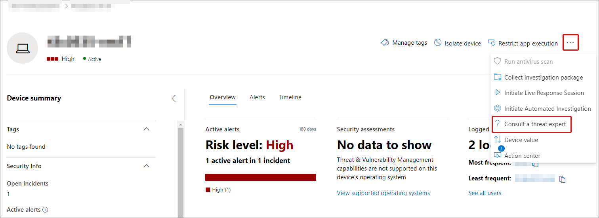
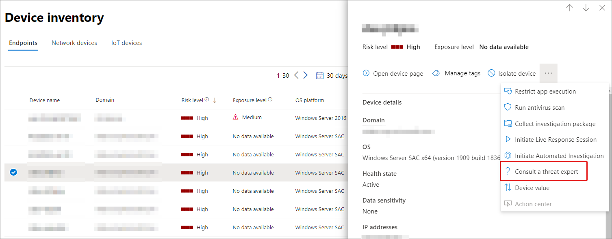

# Übersicht über Microsoft Threat Experts in Microsoft 365

[!INCLUDE [Microsoft 365 Defender rebranding](../includes/microsoft-defender.md)]

**Gilt für:**

- [Microsoft 365 Defender](https://go.microsoft.com/fwlink/?linkid=2118804)
- [Microsoft Defender für Endpunkt](https://go.microsoft.com/fwlink/p/?linkid=2154037)

[!INCLUDE [Prerelease](../includes/prerelease.md)]

Microsoft Threat Experts – Targeted Attack Notifications ist ein verwalteter Bedrohungssuchedienst. Sobald Sie sich bewerben und akzeptiert werden, erhalten Sie gezielte Angriffsbenachrichtigungen von Microsoft-Bedrohungsexperten, damit Sie kritische Bedrohungen für Ihre Umgebung nicht verpassen. Diese Benachrichtigungen helfen Ihnen, die Endpunkte, E-Mails und Identitäten Ihrer Organisation zu schützen.
Microsoft Threat Experts – Experts on Demand bietet Ihnen Expertentipps zu Bedrohungen, denen Ihre Organisation ausgesetzt ist. Sie können Hilfe zu Bedrohungen in Ihrer Organisation erhalten. Es ist als Abonnementdienst verfügbar.

## Bewerben für Microsoft Threat Experts – Benachrichtigungen über gezielte Angriffe

> [!IMPORTANT]
> Bevor Sie sich bewerben, sollten Sie die Berechtigungsanforderungen für Microsoft Threat Experts – Targeted Attack Notifications mit Ihrem Microsoft Technical Service-Anbieter und -Kontoteam besprechen.

Wenn Sie bereits über Microsoft Defender for Endpoint und Microsoft 365 Defender verfügen, können Sie sich über ihr Microsoft 365 Defender-Portal für Microsoft Threat Experts – Targeted Attack Notifications bewerben. Wechseln Sie **zu Einstellungen > Endpunkte > Allgemein > Erweiterte Features > Microsoft Threat Experts – Targeted Attack Notifications**, und wählen Sie Anwenden **aus.** Eine vollständige Beschreibung finden Sie unter [Configure Microsoft Threat Experts capabilities.](./configure-microsoft-threat-experts.md)

Sobald Ihre Anwendung genehmigt wurde, erhalten Sie gezielte Angriffsbenachrichtigungen, wenn Bedrohungsexperten eine Bedrohung für Ihre Umgebung erkennen.

## Abonnieren von Microsoft Threat Experts – Experten bei Bedarf

Wenden Sie sich an Ihren Microsoft-Vertreter, um Experten bei Bedarf zu abonnieren.  Ausführliche Informationen finden Sie unter [Configure Microsoft Threat Experts capabilities.](./configure-microsoft-threat-experts.md)

## Empfangen einer gezielten Angriffsbenachrichtigung

Die Microsoft Threat Experts – Targeted Attack Notification-Funktion bietet proaktive Suche nach den wichtigsten Bedrohungen für Ihr Netzwerk. Unsere Bedrohungsexperten sind auf der Suche nach menschlichen Angriffen, Hand-auf-Tastatur-Angriffen und erweiterten Angriffen, z. B. Cyberespionage. Diese Benachrichtigungen werden als neue Warnung angezeigt. Der verwaltete Suchesdienst umfasst:

- Bedrohungsüberwachung und -analyse, Reduzierung der Verweilzeit und des Risikos für Ihr Unternehmen
- Von Jägern geschulte künstliche Intelligenz, um sowohl bekannte Angriffe als auch neue Bedrohungen zu erkennen und auf diese zu zielen.
- Identifizierung der relevantesten Risiken, die so beitragen, dass SOCs ihre Effektivität maximieren
- Helfen Sie dabei, Kompromisse zu schließen und so viel Kontext wie möglich zu bieten, um eine schnelle Reaktion der SOC zu ermöglichen.

## Zusammenarbeit mit Experten bei Bedarf

Sie können sich auch direkt im Microsoft 365-Sicherheitsportal an Microsoft Threat Experts wenden, um eine schnelle und genaue Bedrohungsantwort zu erhalten.  Experten können Einblicke geben, um die komplexen Bedrohungen zu verstehen, denen Ihre Organisation möglicherweise ausgesetzt ist.  Wenden Sie sich an einen Experten, um:

- Sammeln zusätzlicher Informationen zu Warnungen und Vorfällen, einschließlich der Hauptursachen und des Umfangs
- Verschaffen Sie sich Klarheit über verdächtige Geräte, Warnungen oder Vorfälle und erhalten Sie die nächsten Schritte, wenn sie mit einem erweiterten Angreifer konfrontiert werden
- Bestimmen von Risiken und verfügbaren Schutzmaßnahmen im Zusammenhang mit Bedrohungsakteuren, Kampagnen oder neuen Angreifertechniken

Die Option, **einen Bedrohungsexperten zu konsultieren,** ist im gesamten Portal an mehreren Stellen verfügbar:

- <i>**Menü "Geräteseitenaktionen"**</i> 

- <i>**Flyoutmenü der Geräteinventarseite**</i> 

- <i>**Flyoutmenü der Warnungsseite**</i> 

- <i>**Menü "Seitenaktionen für Vorfälle"**</i> 

- <i>**Seite "Inventar für Vorfälle"**</i> 

> [!NOTE]
> Wenn Ihr Premier Support-Abonnement Ihrer Microsoft Defender for Office 365-Lizenz zugeordnet ist, können Sie den Status Ihrer Experten bei Bedarf über microsoft Services Hub nachverfolgen.

Sehen Sie sich dieses Video an, um einen schnellen Überblick über den Microsoft Services Hub zu erhalten.

> [!VIDEO https://www.microsoft.com/videoplayer/embed/RE4pk9f]

## Siehe auch

- [Konfigurieren von Microsoft Threat Experts-Funktionen](./configure-microsoft-threat-experts.md)
