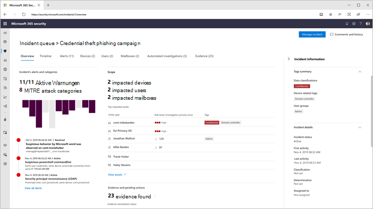

# Microsoft BedrohungsschutzMicrosoft Threat Protection

[!INCLUDE [Microsoft 365 Defender rebranding](../includes/microsoft-defender.md)]

**Gilt für:****Applies to:**
- Microsoft Threat ProtectionMicrosoft Threat Protection

Microsoft Threat Protection ist eine einheitliche, vor-und nach Verletzung der Enterprise Defense-Suite, die die Erkennung, Verhinderung, Untersuchung und Antwort über alle Endpunkte, Identitäten, e-Mails und Anwendungen hinweg einheitlich koordiniert und einen integrierten Schutz vor anspruchsvollen Angriffen bietet.Microsoft Threat Protection is a unified pre- and post-breach enterprise defense suite that natively coordinates detection, prevention, investigation, and response across endpoints, identities, email, and applications to provide integrated protection against sophisticated attacks.

Mit der integrierten Microsoft Threat Protection-Lösung können Sicherheitsexperten die Bedrohungs Signale, die jedes dieser Produkte empfängt, zusammenfügen und den vollständigen Umfang und die Auswirkungen der Bedrohung bestimmen. wie Sie in die Umgebung eingingen, welche Auswirkungen Sie hat und wie Sie sich derzeit auf die Organisation auswirkt.With the integrated Microsoft Threat Protection solution, security professionals can stitch together the threat signals that each of these products receive and determine the full scope and impact of the threat; how it entered the environment, what it's affected, and how it's currently impacting the organization. Microsoft Threat Protection führt automatische Aktionen aus, um den Angriff zu verhindern oder zu beenden und die betroffenen Postfächer, Endpunkte und Benutzeridentitäten selbst zu heilen.Microsoft Threat Protection takes automatic action to prevent or stop the attack and self-heal affected mailboxes, endpoints, and user identities.  

<h2>Microsoft Threat Protection-Dienste
Microsoft Threat Protection services
</h2>
<table><tr><td>
<b><a href="https://docs.microsoft.com/windows/security/threat-protection/microsoft-defender-atp/microsoft-defender-advanced-threat-protection"><b>Erweiterter Bedrohungsschutz von Microsoft Defender</b>

<b><a href="https://docs.microsoft.com/windows/security/threat-protection/microsoft-defender-atp/microsoft-defender-advanced-threat-protection"><b>Microsoft Defender Advanced Threat Protection</b>
</a></td>
<td>
<b><a href="https://docs.microsoft.com/office365/securitycompliance/office-365-atp"><b>Office 365 Advanced Threat Protection</b>

<b><a href="https://docs.microsoft.com/office365/securitycompliance/office-365-atp"><b>Office 365 Advanced Threat Protection</b>
</a></td>
<td>
<b><a href="https://docs.microsoft.com/azure-advanced-threat-protection/"><b>Erweiterter Azure-Bedrohungsschutz</b></a>

<b><a href="https://docs.microsoft.com/azure-advanced-threat-protection/"><b>Azure Advanced Threat Protection</b></a>
</td>
<td>
<b><a href="https://docs.microsoft.com/cloud-app-security/"><b>Microsoft Cloud-App-Sicherheit</b></a>

<b><a href="https://docs.microsoft.com/cloud-app-security/"><b>Microsoft Cloud App Security</b></a>
</td>
</tr>
</table>
 

>[!TIP]
>Lesen Sie diesen [interaktiven Leitfaden für Microsoft Threat Protection](https://aka.ms/MTP-Interactive-Guide).Check out this [Microsoft Threat Protection interactive guide](https://aka.ms/MTP-Interactive-Guide).

Microsoft Threat Protection-Suite schützt Folgendes:Microsoft Threat Protection suite protects: 
- **Endpunkte mit Microsoft Defender ATP** – Microsoft Defender ATP ist eine einheitliche Endpunkt Plattform für vorbeugenden Schutz, Erkennung nach einem Verstoß, automatische Untersuchung und Antwort.**Endpoints with Microsoft Defender ATP** - Microsoft Defender ATP is a unified endpoint platform for preventative protection, post-breach detection, automated investigation, and response. 
- **E-Mail und Zusammenarbeit mit Office 365 ATP** -Office 365 ATP schützt Ihre Organisation vor böswilligen Bedrohungen durch e-Mail-Nachrichten, Links (URLs) und Tools für die Zusammenarbeit.**Email and collaboration with Office 365 ATP** - Office 365 ATP safeguards your organization against malicious threats posed by email messages, links (URLs) and collaboration tools. 
- **Identitäten mit Azure ATP und Azure AD Identity Protection** – Azure ATP verwendet Active Directory Signale, um erweiterte Bedrohungen, kompromittierte Identitäten und böswillige Insider Aktionen, die an Ihre Organisation gerichtet sind, zu identifizieren, zu erkennen und zu untersuchen.**Identities with Azure ATP and Azure AD Identity Protection** - Azure ATP uses Active Directory signals to identify, detect, and investigate advanced threats, compromised identities, and malicious insider actions directed at your organization. 
- **Anwendungen mit Microsoft Cloud App Security** -Microsoft Cloud App Security ist eine umfassende Cross-SaaS-Lösung, die eine Tiefe Sichtbarkeit, starke Datensteuerelemente und einen verbesserten Bedrohungsschutz für Ihre Cloud-apps bringt.**Applications with Microsoft Cloud App security** - Microsoft Cloud App security is a comprehensive cross-SaaS solution bringing deep visibility, strong data controls, and enhanced threat protection to your cloud apps. 

>[!VIDEO https://www.microsoft.com/en-us/videoplayer/embed/RE4Bzww] 

Die einzigartige produktübergreifende Schicht von Microsoft Threat Protection erweitert die einzelnen Suite-Komponenten um:Microsoft Threat Protection's unique cross-product layer augments the individual suite components to:
- Schützen von Angriffen und koordinieren von Abwehrreaktionen in der gesamten Suite durch Signal Freigabe und automatisierte AktionenHelp protect against attacks and coordinate defensive responses across the suite through signal sharing and automated actions
- Erzählen Sie die ganze Geschichte des Angriffs auf Produktwarnungen, Verhaltensweisen und Kontexte für Sicherheitsteams, indem Sie Daten zu Warnungen, verdächtigen Ereignissen und betroffenen Objekten auf "Incidents" miteinander verknüpfen.Narrate the full story of the attack across product alerts, behaviors, and context for security teams by joining data on alerts, suspicious events and impacted assets to 'incidents'
- Automatisieren der Antwort auf Kompromisse durch Auslösen der Selbstheilung für Betroffene Objekte durch automatische BehebungAutomate response to compromise by triggering self-healing for impacted assets through automated remediation
- Aktivieren von Sicherheitsteams für die Durchführung detaillierter und effektiver Bedrohungen bei der Suche über Endpunkt-und Office-DatenEnable security teams to perform detailed and effective threat hunting across endpoint and Office data

  
Produktübergreifender Vorfall (Übersicht)Cross-product incident (Overview)

 
Alle zusammengehörigen Warnungen in allen Suite-Produkten korrelieren in einem einzelnen Vorfall (Warnungsansicht)All related alerts across the suite products correlated together into a single incident (alerts view)

 
Abfragebasierte Suche über die Rohdaten von e-Mail-und Endpunkt DatenQuery-based hunting on top of email and endpoint raw data

Zu den produktübergreifenden Microsoft Threat Protection-Features gehören:Microsoft Threat Protection cross-product features include: 
- **Produktübergreifender Einzelbereich von Glass** -Central alle Informationen für Erkennungen, Betroffene Objekte, automatisierte Aktionen und zugehörige Beweise in einer einzelnen Warteschlange und in einem einzelnen Bereich in [Security.Microsoft.com](https://security.microsoft.com).**Cross-product single pane of glass** - Central view all information for detections, impacted assets, automated actions taken, and related evidence in a single queue and a single pane in [security.microsoft.com](https://security.microsoft.com). 
- **Kombinierte Vorfälle-Warteschlange** – um Sicherheitsexperten zu helfen, sich auf das zu konzentrieren, was entscheidend ist, indem Sie sicherstellen, dass der vollständige Angriffsbereich, die betroffenen Ressourcen und die automatisierten Korrekturaktionen zusammengefasst und rechtzeitig aufgetaucht werden.**Combined incidents queue** - To help security professionals focus on what is critical by ensuring the full attack scope, impacted assets and automated remediation actions are grouped together and surfaced in a timely manner. 
- **Automatische Antwort auf Bedrohungen** – wichtige Informationen zur Bedrohung werden in Echtzeit zwischen den Microsoft Threat Protection-Produkten freigegeben, um das Fortschreiten eines Angriffs zu stoppen.**Automatic response to threats** - Critical threat information is shared in real time between the Microsoft Threat Protection products to help stop the progression of an attack. Wenn beispielsweise eine Schadsoftware auf einem von Microsoft Defender ATP geschützten Endpunkt erkannt wird, wird Office 365 ATP angewiesen, die Datei von allen e-Mail-Nachrichten zu überprüfen und zu entfernen.For example, if a malicious file is detected on an endpoint protected by Microsoft Defender ATP, it will instruct Office 365 ATP to scan and remove the file from all e-mail messages. Die Datei wird von der gesamten Microsoft 365 Security Suite aus Sicht blockiert.The file will be blocked on sight by the entire Microsoft 365 security suite.
- **Selbstheilung für kompromittierte Geräte, Benutzeridentitäten und Postfächer** – Microsoft Threat Protection verwendet automatische Aktionen und Textbuch mit AI-Leistung, um betroffene Objekte wieder in einen sicheren Zustand zu verlagern.**Self-healing for compromised devices, user identities, and mailboxes** - Microsoft Threat Protection uses AI-powered automatic actions and playbooks to remediate impacted assets back to a secure state. Microsoft Threat Protection nutzt die automatischen Korrekturfunktionen der Suite-Produkte, um sicherzustellen, dass alle betroffenen Objekte, die sich auf einen Vorfall beziehen, nach Möglichkeit automatisch behoben werden.Microsoft Threat Protection leverages automatic remediation capabilities of the suite products to ensure all impacted assets related to an incident are automatically remediated where possible.
- **Produktübergreifende Bedrohungs Jagd** – Sicherheitsteams können Ihr einzigartiges organisatorisches Wissen nutzen, um nach Zeichen von Kompromissen zu suchen, indem Sie Ihre eigenen benutzerdefinierten Abfragen über die Rohdaten erstellen, die von den verschiedenen Schutzprodukten erfasst werden.**Cross-product threat hunting** - Security teams can leverage their unique organizational knowledge to hunt for signs of compromise by creating their own custom queries over the raw data collected by the various protection products. Microsoft Threat Protection bietet abfragebasierten Zugriff auf 30 Tage historischer Rohdaten und Warnungsdaten über alle Endpunkt-und Office 365 ATP-Daten hinweg.Microsoft Threat Protection provides query-based access to 30 days of historic raw signals and alert data across endpoint and Office 365 ATP data. 

## Erste SchritteGet started
Die Microsoft Threat Protection-Lizenzierungsanforderungen müssen erfüllt sein, bevor Sie den Dienst im Microsoft 365 Security Center unter [Security.Microsoft.com](https://security.microsoft.com)aktivieren können.Microsoft Threat Protection licensing requirements must be met before you can enable the service in the Microsoft 365 security center at [security.microsoft.com](https://security.microsoft.com). Weitere Informationen finden Sie unter:For more information, read:
- [LizenzanforderungenLicensing requirements](prerequisites.md#licensing-requirements)
- [Aktivieren von Microsoft Threat ProtectionTurn on Microsoft Threat Protection](mtp-enable.md)
