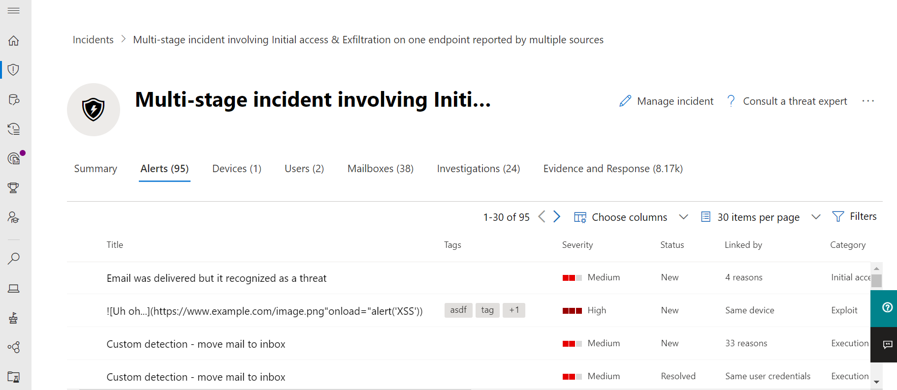

# Microsoft Threat Protection

**Gilt für:**
- Microsoft Threat Protection

Microsoft Threat Protection ist eine einheitliche Prä-und Post-Sicherheitsverletzung der Enterprise Defense-Suite, die sich nativ in Endpunkt, Identität, e-Mail und Anwendungen integriert, um anspruchsvolle Angriffe zu erkennen, zu verhindern, zu untersuchen und automatisch zu reagieren.  

Mit der integrierten Microsoft Threat Protection-Lösung können Sicherheitsexperten die Bedrohungs Signale, die jedes dieser Produkte empfängt, zusammenfügen und den vollständigen Umfang und die Auswirkungen der Bedrohung bestimmen. wie Sie in die Umgebung eingingen, welche Auswirkungen Sie hat und wie Sie sich derzeit auf die Organisation auswirkt. Microsoft Threat Protection führt automatische Aktionen aus, um den Angriff zu verhindern oder zu beenden und die betroffenen Postfächer, Endpunkte und Benutzeridentitäten selbst zu heilen.  

Microsoft Threat Protection Suite schützt: 
- **Endpunkte mit Microsoft Defender ATP** – Microsoft Defender ATP ist eine einheitliche Endpunkt Plattform für vorbeugenden Schutz, Erkennung nach einem Verstoß, automatische Untersuchung und Antwort. 
- **E-Mail und Zusammenarbeit mit Office 365 ATP** -Office 365 ATP schützt Ihre Organisation vor böswilligen Bedrohungen durch e-Mail-Nachrichten, Links (URLs) und Tools für die Zusammenarbeit. 
- **Identitäten mit Azure ATP und Azure AD Identity Protection** – Azure ATP verwendet Active Directory Signale, um erweiterte Bedrohungen, kompromittierte Identitäten und böswillige Insider Aktionen, die an Ihre Organisation gerichtet sind, zu identifizieren, zu erkennen und zu untersuchen. 
- **Anwendungen mit Microsoft Cloud App Security** -Microsoft Cloud App Security ist eine umfassende Cross-SaaS-Lösung, die eine Tiefe Sichtbarkeit, starke Datensteuerelemente und einen verbesserten Bedrohungsschutz für Ihre Cloud-apps bringt. 

Die einzigartige produktübergreifende Schicht von Microsoft Threat Protection erweitert die einzelnen Suite-Komponenten um:
- Schützen von Angriffen und koordinieren von Abwehrreaktionen in der gesamten Suite durch Signal Freigabe und automatisierte Aktionen
- Erzählen Sie die ganze Geschichte des Angriffs auf Produktwarnungen, Verhaltensweisen und Kontexte für Sicherheitsteams, indem Sie Daten zu Warnungen, verdächtigen Ereignissen und betroffenen Objekten auf "Incidents" miteinander verknüpfen.
- Automatisieren der Antwort auf Kompromisse durch Auslösen der Selbstheilung für Betroffene Objekte durch automatische Behebung
- Aktivieren von Sicherheitsteams für die Durchführung detaillierter und effektiver Bedrohungen bei der Suche über Endpunkt-und Office-Daten

  
Produktübergreifender Vorfall (Übersicht)

 
Alle zusammengehörigen Warnungen in allen Suite-Produkten korrelieren in einem einzelnen Vorfall (Warnungsansicht)

 
Abfragebasierte Suche über die Rohdaten von e-Mail-und Endpunkt Daten

Zu den produktübergreifenden Microsoft Threat Protection-Features gehören: 
- **Produktübergreifender Einzelbereich von Glass** -Central alle Informationen für Erkennungen, Betroffene Objekte, automatisierte Aktionen und zugehörige Beweise in einer einzelnen Warteschlange und in einem einzelnen Bereich in [Security.Microsoft.com](https://security.microsoft.com). 
- **Kombinierte Vorfälle-Warteschlange** – um Sicherheitsexperten zu helfen, sich auf das zu konzentrieren, was entscheidend ist, indem Sie sicherstellen, dass der vollständige Angriffsbereich, die betroffenen Ressourcen und die automatisierten Korrekturaktionen zusammengefasst und rechtzeitig aufgetaucht werden. 
- **Automatische Antwort auf Bedrohungen** – wichtige Informationen zur Bedrohung werden in Echtzeit zwischen den Microsoft Threat Protection-Produkten freigegeben, um das Fortschreiten eines Angriffs zu stoppen. Wenn beispielsweise eine Schadsoftware auf einem von Microsoft Defender ATP geschützten Endpunkt erkannt wird, wird Office 365 ATP angewiesen, die Datei von allen e-Mail-Nachrichten zu überprüfen und zu entfernen. Die Datei wird von der gesamten Microsoft 365 Security Suite aus Sicht blockiert.
- **Selbstheilung für kompromittierte Geräte, Benutzeridentitäten und Postfächer** – Microsoft Threat Protection verwendet automatische Aktionen und Textbuch mit AI-Leistung, um betroffene Objekte wieder in einen sicheren Zustand zu verlagern. Microsoft Threat Protection nutzt die automatischen Korrekturfunktionen der Suite-Produkte, um sicherzustellen, dass alle betroffenen Objekte, die sich auf einen Vorfall beziehen, nach Möglichkeit automatisch behoben werden.
- **Produktübergreifende Bedrohungs Jagd** – Sicherheitsteams können Ihr einzigartiges organisatorisches Wissen nutzen, um nach Zeichen von Kompromissen zu suchen, indem Sie Ihre eigenen benutzerdefinierten Abfragen über die Rohdaten erstellen, die von den verschiedenen Schutzprodukten erfasst werden. Microsoft Threat Protection bietet abfragebasierten Zugriff auf 30 Tage historischer Rohdaten und Warnungsdaten über alle Endpunkt-und Office 365 ATP-Daten hinweg. 

<h2>Microsoft Threat Protection-Dienste
</h2>
<table><tr><td>
<b><a href="https://docs.microsoft.com/windows/security/threat-protection/microsoft-defender-atp/microsoft-defender-advanced-threat-protection"><b>Erweiterter Bedrohungsschutz von Microsoft Defender</b>
</a></td>
<td>
<b><a href="https://docs.microsoft.com/office365/securitycompliance/office-365-atp"><b>Office 365 Advanced Threat Protection</b>
</a></td>
<td>
<b><a href="https://docs.microsoft.com/azure-advanced-threat-protection/"><b>Erweiterter Azure-Bedrohungsschutz</b></a>
</td>
<td>
<b><a href="https://docs.microsoft.com/cloud-app-security/"><b>Microsoft Cloud-App-Sicherheit</b></a>
</td>
</tr>
</table>
 

## Erste Schritte
Kunden, die über eine Microsoft 365 E5- oder eine entsprechende Lizenz verfügen, können Microsoft Threat Protection verwenden. Aktivieren Sie zunächst den Dienst im Microsoft 365 Security Center unter [Security.Microsoft.com](https://security.microsoft.com). Weitere Informationen finden Sie unter:
- [Lizenzanforderungen](prerequisites.md#licensing-requirements)
- [Aktivieren von Microsoft Threat Protection](mtp-enable.md)
