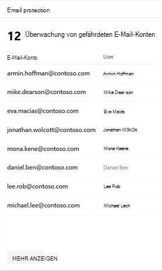
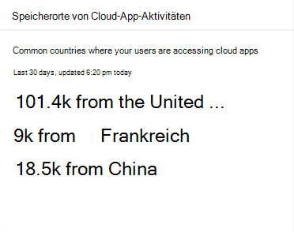

# App-Überwachung und Berichterstellung im Microsoft 365 Security CenterApp monitoring and reporting in the Microsoft 365 security center

Diese Berichte bieten einen besseren Einblick in die Verwendung von Cloud-apps in Ihrer Organisation, einschließlich der Arten von apps, des Risikos und der Warnungen.These reports provide more insight into how cloud apps are being used in your organization, including what kinds of apps, their level of risk, and alerts.

## Überwachung von gefährdeten E-Mail-KontenMonitor email accounts at risk

**E-Mail-Schutz** zeigt e-Mail-Konten gefährdet an.**Email protection** shows email accounts at risk. Sie können auf ein Konto klicken, um es im Sicherheits Center von Microsoft Defender weiter zu untersuchen.You can click an account to investigate further in Microsoft Defender Security Center.

## Überwachen der von Benutzern erteilten App-BerechtigungenMonitor app permissions granted by users

**Cloud-App-Sicherheit – OAuth-apps** listet apps auf, die von der Cloud-App-Sicherheit erkannt wurden, denen Benutzerberechtigungen erteilt wurden.**Cloud App Security - OAuth apps** lists apps discovered by Cloud App Security that have been granted permissions by users. Der Risikokatalog von Cloud App Security umfasst über 16.000 apps, die mit über 70 Risikofaktoren bewertet werden.Cloud App Security's risk catalog includes over 16,000 apps that are assessed using over 70 risk factors.

Die Risikofaktoren beginnen mit allgemeinen Informationen wie dem App-Herausgeber für Sicherheitsmaßnahmen und-Steuerelemente, beispielsweise, ob die APP die Verschlüsselung in Ruhe unterstützt oder ein Überwachungsprotokoll der Benutzeraktivität bereitstellt.The risk factors start from general information, such as the app publisher, to security measures and controls, such as whether the app supports for encryption at rest or provides an audit log of user activity.

## Überwachen von Cloud-App-BenutzerkontenMonitor cloud app user accounts

**Cloud-App-Konten für die Überprüfung** listet Konten auf, die möglicherweise Aufmerksamkeit erfordern.**Cloud app accounts for review** lists accounts that may require attention.

## Grundlegendes zu den verwendeten Cloud-appsUnderstand which cloud apps are used

**Erkannte Cloud-Apps (Kategorien)** zeigen, welche Arten von apps in Ihrer Organisation verwendet werden, und Links zum Cloud Discovery-Dashboard in der Cloud-App-Sicherheit.**Discovered cloud apps (categories)** show what kinds of apps are being used in your organization and links to the Cloud Discovery dashboard in Cloud App Security. Weitere Informationen finden Sie unter [Quick Start: Arbeiten mit entdeckten apps](https://docs.microsoft.com/cloud-app-security/discovered-apps).For more information, see [Quickstart: Work with discovered apps](https://docs.microsoft.com/cloud-app-security/discovered-apps).  

## Überwachen der Benutzer auf Cloud-appsMonitor where users access cloud apps

**Cloud-App-Aktivitäts Speicherorte** zeigen an, wo Benutzer auf Cloud-apps zugreifen.**Cloud app activity locations** show where users are accessing cloud apps.

## Überwachen der Integrität von Infrastruktur AuslastungenMonitor health for infrastructure workloads

**Infrastruktur Integrität** zeigt Integritätsstatus Warnungen für Infrastruktur Arbeitslasten im Azure Security Center an.**Infrastructure health** shows health status alerts for infrastructure workloads in Azure Security Center.

Azure Security Center bietet einheitliches Sicherheitsmanagement und fortschrittlichen Schutz vor Bedrohungen in lokalen und Cloud-Arbeitsauslastungen.Azure Security Center provides unified security management and advanced threat protection across on-premises and cloud workloads. Sie können Sicherheitsdaten aus einer Vielzahl von Quellen erfassen, suchen und analysieren, darunter Firewalls und andere Partnerlösungen.You can collect, search, and analyze security data from a variety of sources, including firewalls and other partner solutions.

Weitere Informationen finden Sie unter [Azure Security Center-Dokumentation](https://docs.microsoft.com/azure/security-center/).For more information, see [Azure Security Center Documentation](https://docs.microsoft.com/azure/security-center/).

