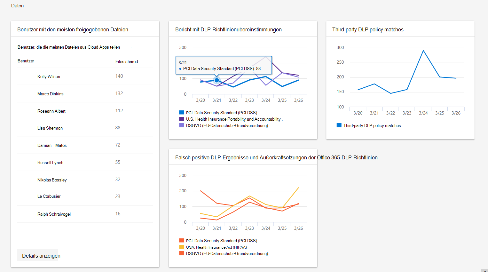

# Datenüberwachung und-Berichterstellung im Microsoft 365 Security CenterData monitoring and reporting in the Microsoft 365 security center

[!INCLUDE [Microsoft 365 Defender rebranding](../includes/microsoft-defender.md)]

Die Kategorie **Daten** hilft beim Nachverfolgen von Benutzeraktivitäten, die zu einer nicht autorisierten Datenweitergabe führen könnten.The **Data** category helps track user activity that could lead to unauthorized data disclosure. Dabei handelt es sich um die überarbeiten vorhandener DLP-Richtlinien Berichte sowie einen DLP-Richtlinien Übereinstimmungs Bericht eines Drittanbieters.They are the rework of existing DLP policy reports plus a third-party DLP policy match report.

Sie sehen Folgendes:You can see:

- Benutzer, die die meisten Dateien aus Cloud-Apps teilenUsers who share the most files from cloud apps
- Wie viele DLP-Richtlinien Übereinstimmungen aufgetreten sindHow many DLP policy matches occurred
- Anzahl der gemeldeten DLP-Richtlinien-Außerkraftsetzungen oder falsch positiven MeldungenHow many DLP policies overrides or false positives are reported
- Wie viele DLP-Richtlinien Übereinstimmungen in Cloud-Diensten von Drittanbietern über die Microsoft Cloud-App-Sicherheit aufgetreten sindHow many DLP policy matches happened in third-party cloud services via Microsoft Cloud App Security

