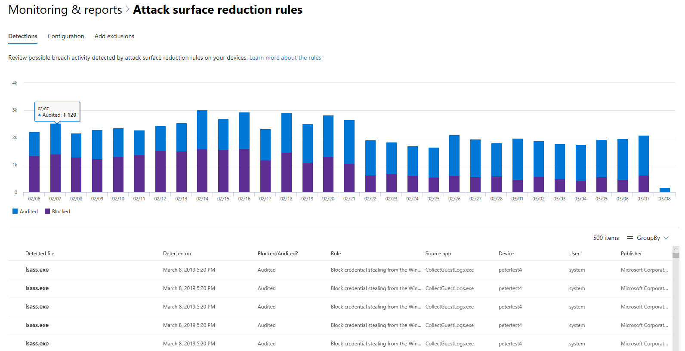

# <a name="device-monitoring-and-reporting-in-the-microsoft-365-security-center"></a><span data-ttu-id="fa310-104">Geräteüberwachung und-Berichterstellung im Microsoft 365 Security Center</span><span class="sxs-lookup"><span data-stu-id="fa310-104">Device monitoring and reporting in the Microsoft 365 security center</span></span>

[!INCLUDE [Microsoft 365 Defender rebranding](../includes/microsoft-defender.md)]


<span data-ttu-id="fa310-105">Halten Sie Ihre Geräte im Microsoft 365 Security Center sicher, auf dem neuesten Stand und stellen Sie potenzielle Bedrohungen vor Ort dar.</span><span class="sxs-lookup"><span data-stu-id="fa310-105">Keep your devices secure, up-to-date, and spot potential threats in the Microsoft 365 security center.</span></span>

## <a name="view-device-alerts"></a><span data-ttu-id="fa310-106">Anzeigen von Geräte Warnungen</span><span class="sxs-lookup"><span data-stu-id="fa310-106">View device alerts</span></span>

<span data-ttu-id="fa310-107">Erhalten Sie aktuelle Benachrichtigungen zu Sicherheitsverletzungen und anderen Bedrohungen auf Ihren Geräten von Microsoft Defender ATP (verfügbar mit einer E5-Lizenz).</span><span class="sxs-lookup"><span data-stu-id="fa310-107">Get up-to-date alerts about breach activity and other threats on your devices from Microsoft Defender ATP (available with an E5 license).</span></span> <span data-ttu-id="fa310-108">Das Microsoft 365 Security Center überwacht diese Warnungen effektiv mithilfe Ihres bevorzugten Workflows auf einer hohen Ebene.</span><span class="sxs-lookup"><span data-stu-id="fa310-108">Microsoft 365 security center effectively monitors these alerts at a high level using your preferred workflow.</span></span>

### <a name="monitor-high-impact-alerts"></a><span data-ttu-id="fa310-109">Überwachen von Warnungen mit hoher Wirkung</span><span class="sxs-lookup"><span data-stu-id="fa310-109">Monitor high-impact alerts</span></span>

<span data-ttu-id="fa310-110">Jede Microsoft Defender-ATP-Warnung weist einen entsprechenden Schweregrad auf (hoch, Mittel, niedrig oder Information).</span><span class="sxs-lookup"><span data-stu-id="fa310-110">Each Microsoft Defender ATP alert has a corresponding severity (high, medium, low, or informational).</span></span> <span data-ttu-id="fa310-111">Sie weist auf mögliche Auswirkungen auf Ihr Netzwerk hin, wenn Sie unbeaufsichtigt bleiben.</span><span class="sxs-lookup"><span data-stu-id="fa310-111">It indicates potential impact to your network if left unattended.</span></span>  

<span data-ttu-id="fa310-112">Verwenden Sie die **Geräte Warnungs schwere** Karte, um sich speziell auf Warnungen zu konzentrieren, die gravierender sind und möglicherweise sofort reagieren müssen.</span><span class="sxs-lookup"><span data-stu-id="fa310-112">Use the **Device alert severity** card to focus specifically on alerts that are more severe and might require immediate response.</span></span> <span data-ttu-id="fa310-113">Auf dieser Karte können Sie weitere Informationen im Microsoft Defender-Sicherheits Center-Portal anzeigen.</span><span class="sxs-lookup"><span data-stu-id="fa310-113">From this card, you can view more information on the Microsoft Defender Security Center portal.</span></span>


### <a name="understand-sources-of-alerts"></a><span data-ttu-id="fa310-115">Grundlegendes zu Warnungs Quellen</span><span class="sxs-lookup"><span data-stu-id="fa310-115">Understand sources of alerts</span></span>

<span data-ttu-id="fa310-116">Microsoft Defender ATP nutzt Daten aus einer breiten Palette von Sicherheitssensoren und Nachrichtenquellen, um Warnungen zu generieren.</span><span class="sxs-lookup"><span data-stu-id="fa310-116">Microsoft Defender ATP leverages data from a broad range of security sensors and intelligence sources to generate alerts.</span></span> <span data-ttu-id="fa310-117">Beispielsweise kann es Erkennungsinformationen von Microsoft Defender Antivirus und Antischadsoftware von Drittanbietern verwenden.</span><span class="sxs-lookup"><span data-stu-id="fa310-117">For example, it can use detection information from Microsoft Defender Antivirus and third-party antimalware.</span></span> <span data-ttu-id="fa310-118">Es kann auch Ihre eigene benutzerdefinierte Bedrohungs Intelligenz verwenden, die über die Webdienst-API bereitgestellt wird.</span><span class="sxs-lookup"><span data-stu-id="fa310-118">It can also use your own custom threat intelligence provided through the web service API.</span></span>

<span data-ttu-id="fa310-119">Die Karte für die **Erkennung von Geräte Warnungen** zeigt die Verteilung von Benachrichtigungen nach Quelle an.</span><span class="sxs-lookup"><span data-stu-id="fa310-119">The **Device alert detection** sources card shows the distribution of alerts by source.</span></span> <span data-ttu-id="fa310-120">Verfolgen Sie Aktivitäten im Zusammenhang mit bestimmten Quellen, insbesondere ihren benutzerdefinierten Quellen.</span><span class="sxs-lookup"><span data-stu-id="fa310-120">Track activity related to certain sources, particularly your custom sources.</span></span> <span data-ttu-id="fa310-121">Sie können die Karte auch verwenden, um sich auf Warnungen zu konzentrieren, die von Sensoren stammen, die nicht so konfiguriert sind, dass böswillige Aktivitäten oder Komponenten automatisch blockiert werden.</span><span class="sxs-lookup"><span data-stu-id="fa310-121">You can also use the card to focus on alerts coming from sensors that aren't configured to automatically block malicious activity or components.</span></span>


<span data-ttu-id="fa310-123">Auf dieser Karte können Sie weitere Informationen im Microsoft Defender-Sicherheits Center-Portal anzeigen.</span><span class="sxs-lookup"><span data-stu-id="fa310-123">From this card, you can view more information on the Microsoft Defender Security Center portal.</span></span>

### <a name="understand-the-types-of-threats-that-trigger-alerts"></a><span data-ttu-id="fa310-124">Grundlegendes zu den Typen von Bedrohungen, die Warnungen auslösen</span><span class="sxs-lookup"><span data-stu-id="fa310-124">Understand the types of threats that trigger alerts</span></span>

<span data-ttu-id="fa310-125">Microsoft Defender ATP sortiert jede Warnung in eine Kategorie, die eine bestimmte Stufe in der Angriffs Kette oder dem Typ der Bedrohungs Komponente darstellt.</span><span class="sxs-lookup"><span data-stu-id="fa310-125">Microsoft Defender ATP sorts each alert into a category representing a certain stage in the attack chain or type of threat component.</span></span> <span data-ttu-id="fa310-126">Beispielsweise kann eine erkannte Bedrohungsaktivität als "laterale Bewegung" kategorisiert werden, um anzugeben, dass versucht wurde, andere Geräte im Netzwerk zu erreichen.</span><span class="sxs-lookup"><span data-stu-id="fa310-126">For example, a detected threat activity might be categorized as "lateral movement" to indicate there was an attempt to reach other devices on the network.</span></span> <span data-ttu-id="fa310-127">Die Aktivität ist wahrscheinlich aufgetreten, nachdem Angreifer einen ersten Standbein erreicht haben.</span><span class="sxs-lookup"><span data-stu-id="fa310-127">The activity has likely occurred after attackers gained an initial foothold.</span></span> <span data-ttu-id="fa310-128">Wenn eine Bedrohungs Komponente erkannt wird, kann Sie weitgehend als Schadsoftware oder speziell als bestimmter Bedrohungs klassifiziert werden.</span><span class="sxs-lookup"><span data-stu-id="fa310-128">When detected, a threat component might be classified broadly as malware or specifically as a specific threat type.</span></span> <span data-ttu-id="fa310-129">Zu den Besonderheiten gehören Ransomware, das stehlen von Anmeldeinformationen oder andere Arten von bösartiger oder unerwünschter Software.</span><span class="sxs-lookup"><span data-stu-id="fa310-129">Specifics include ransomware, credential stealing, or other types of malicious or unwanted software.</span></span>

<span data-ttu-id="fa310-130">Die Karte **Bedrohungskategorien für Geräte** zeigt die Verteilung von Warnungen in diesen Kategorien an.</span><span class="sxs-lookup"><span data-stu-id="fa310-130">The **Device threat categories** card shows the distribution of alerts into these categories.</span></span> <span data-ttu-id="fa310-131">Verwenden Sie diese Informationen, um die Bedrohungsaktivität zu identifizieren, wie beispielsweise Diebstahlversuche von Anmeldeinformationen, die in der Regel höhere Auswirkungen haben als Social Engineering-Versuche.</span><span class="sxs-lookup"><span data-stu-id="fa310-131">Use this information to identify threat activity, such as credential theft attempts, that usually have higher impact than social engineering attempts.</span></span> <span data-ttu-id="fa310-132">Sie können auch auf potenziell destruktive Bedrohungen wie Ransomware überwachen.</span><span class="sxs-lookup"><span data-stu-id="fa310-132">You can also to monitor for potentially destructive threats like ransomware.</span></span>


### <a name="monitor-active-alerts"></a><span data-ttu-id="fa310-134">Überwachen aktiver Warnungen</span><span class="sxs-lookup"><span data-stu-id="fa310-134">Monitor active alerts</span></span>

<span data-ttu-id="fa310-135">Die **Geräte Warnungs-Status** Karte gibt die Anzahl der Warnungen an, die nicht aufgelöst wurden, und erfordert möglicherweise Aufmerksamkeit.</span><span class="sxs-lookup"><span data-stu-id="fa310-135">The **Device alert status** card indicates the number of alerts that haven't been resolved and may require attention.</span></span> <span data-ttu-id="fa310-136">Auf dieser Karte können Sie weitere Informationen im Microsoft Defender-Sicherheits Center-Portal anzeigen.</span><span class="sxs-lookup"><span data-stu-id="fa310-136">From this card, you can view more information on the Microsoft Defender Security Center portal.</span></span>


### <a name="monitor-classification-of-resolved-alerts"></a><span data-ttu-id="fa310-138">Überwachen der Klassifizierung der aufgelösten Warnungen</span><span class="sxs-lookup"><span data-stu-id="fa310-138">Monitor classification of resolved alerts</span></span>

<span data-ttu-id="fa310-139">Beim Auflösen einer ATP-Warnung von Microsoft Defender können Ihre Sicherheitsmitarbeiter angeben, ob eine Warnung wie folgt überprüft wurde:</span><span class="sxs-lookup"><span data-stu-id="fa310-139">When resolving a Microsoft Defender ATP alert, your security staff can specify whether an alert has been verified as:</span></span>

* <span data-ttu-id="fa310-140">Eine echte Warnung, die tatsächliche Verletzungs Aktivität oder Bedrohungs Komponenten identifiziert</span><span class="sxs-lookup"><span data-stu-id="fa310-140">A true alert that identifies actual breach activity or threat components</span></span>
* <span data-ttu-id="fa310-141">Eine falsche Warnung, bei der die normale Aktivität falsch erkannt wurde</span><span class="sxs-lookup"><span data-stu-id="fa310-141">A false alert that has incorrectly detected normal activity</span></span>

<span data-ttu-id="fa310-142">Die **Geräte Warnungs Klassifizierungs** Karte zeigt an, ob Ihre aufgelösten Warnungen als true oder false Alerts klassifiziert wurden.</span><span class="sxs-lookup"><span data-stu-id="fa310-142">The **Device alert classification** card shows whether your resolved alerts have been classified as true or false alerts.</span></span> <span data-ttu-id="fa310-143">Auf dieser Karte können Sie weitere Informationen im Microsoft Defender-Sicherheits Center-Portal anzeigen.</span><span class="sxs-lookup"><span data-stu-id="fa310-143">From this card, you can view more information on the Microsoft Defender Security Center portal.</span></span>

<span data-ttu-id="fa310-144">Hinweis: in einigen Fällen stehen Klassifizierungsinformationen für bestimmte Warnungen nicht zur Verfügung.</span><span class="sxs-lookup"><span data-stu-id="fa310-144">Note: In some cases, classification information is unavailable for certain alerts.</span></span>


### <a name="monitor-determination-of-resolved-alerts"></a><span data-ttu-id="fa310-146">Überwachen der Ermittlung von aufgelösten Warnungen</span><span class="sxs-lookup"><span data-stu-id="fa310-146">Monitor determination of resolved alerts</span></span>

<span data-ttu-id="fa310-147">Zusammen mit der Klassifizierung, ob eine Warnung bei der Lösung true oder false ist, kann Ihr Sicherheitspersonal eine Ermittlung bereitstellen.</span><span class="sxs-lookup"><span data-stu-id="fa310-147">Along with classifying whether an alert is true or false during resolution, your security staff can provide a determination.</span></span> <span data-ttu-id="fa310-148">Eine Ermittlung gibt den Typ der normalen oder böswilligen Aktivität an, die bei der Überprüfung der Warnung gefunden wurde.</span><span class="sxs-lookup"><span data-stu-id="fa310-148">A determination indicates the type of normal or malicious activity that was found while validating the alert.</span></span>

<span data-ttu-id="fa310-149">Die Karte für die **Geräte Warnungs Ermittlung** zeigt die für jede Warnung vorgesehene Ermittlung an.</span><span class="sxs-lookup"><span data-stu-id="fa310-149">The **Device alert determination** card shows the determination provided for each alert.</span></span>

* <span data-ttu-id="fa310-150">**Apt**: Fortgeschrittene beständige Bedrohung, die darauf hinweist, dass die erkannte Aktivität oder Bedrohungs Komponente Teil einer anspruchsvollen Sicherheitslücke ist, die im betroffenen Netzwerk Fuß fassen soll</span><span class="sxs-lookup"><span data-stu-id="fa310-150">**APT**: advanced persistent threat, indicating that the detected activity or threat component is part of a sophisticated breach designed to gain a foothold in the affected network</span></span>  
* <span data-ttu-id="fa310-151">**Schadsoftware**: bösartige Datei oder Code</span><span class="sxs-lookup"><span data-stu-id="fa310-151">**Malware**: malicious file or code</span></span>
* <span data-ttu-id="fa310-152">**Sicherheitspersonal**: normale Aktivitäten, die von Sicherheitsmitarbeitern ausgeführt werden</span><span class="sxs-lookup"><span data-stu-id="fa310-152">**Security personnel**: normal activity performed by security staff</span></span>
* <span data-ttu-id="fa310-153">**Sicherheitstests**: Aktivitäten oder Komponenten, die zum Simulieren von tatsächlichen Bedrohungen entwickelt wurden und erwartet wurden, um Sicherheitssensoren auszulösen und Warnungen zu generieren</span><span class="sxs-lookup"><span data-stu-id="fa310-153">**Security testing**: activity or components designed to simulate actual threats and expected to trigger security sensors and generate alerts</span></span>
* <span data-ttu-id="fa310-154">**Unerwünschte Software**: apps und andere Software, die nicht als bösartig eingestuft werden, andernfalls jedoch Richtlinien oder akzeptable Nutzungsstandards verletzen</span><span class="sxs-lookup"><span data-stu-id="fa310-154">**Unwanted software**: apps and other software that are not considered malicious, but otherwise violate policy or acceptable use standards</span></span>
* <span data-ttu-id="fa310-155">**Sonstiges**: jede andere Bestimmung, die nicht unter die angegebenen Typen fällt</span><span class="sxs-lookup"><span data-stu-id="fa310-155">**Others**: any other determination that doesn't fall under the provided types</span></span>

<span data-ttu-id="fa310-156">Auf dieser Karte können Sie weitere Informationen im Microsoft Defender Security Center anzeigen.</span><span class="sxs-lookup"><span data-stu-id="fa310-156">From this card, you can view more information in Microsoft Defender Security Center.</span></span>


### <a name="understand-which-devices-are-at-risk"></a><span data-ttu-id="fa310-158">Grundlegendes zu den gefährdeten Geräten</span><span class="sxs-lookup"><span data-stu-id="fa310-158">Understand which devices are at risk</span></span>

<span data-ttu-id="fa310-159">Der **Geräteschutz** zeigt die Risikostufe für Geräte an.</span><span class="sxs-lookup"><span data-stu-id="fa310-159">**Device protection** shows the risk level for devices.</span></span> <span data-ttu-id="fa310-160">Die Risikostufe basiert auf Faktoren wie dem Typ und dem Schweregrad von Warnungen auf dem Gerät.</span><span class="sxs-lookup"><span data-stu-id="fa310-160">The risk level is based on factors such as the type and severity of alerts on the device.</span></span>


## <a name="monitor-and-report-status-of-intune-managed-devices"></a><span data-ttu-id="fa310-162">Überwachen und melden des Status von InTune-verwalteten Geräten</span><span class="sxs-lookup"><span data-stu-id="fa310-162">Monitor and report status of Intune-managed devices</span></span>

<span data-ttu-id="fa310-163">Die folgenden Berichte enthalten Daten von Geräten, die in InTune registriert sind.</span><span class="sxs-lookup"><span data-stu-id="fa310-163">The following reports contain data from devices enrolled in Intune.</span></span> <span data-ttu-id="fa310-164">Daten von nicht registrierten Geräten sind nicht enthalten.</span><span class="sxs-lookup"><span data-stu-id="fa310-164">Data from unenrolled devices isn't included.</span></span> <span data-ttu-id="fa310-165">Nur globale Administratoren können diese Karten anzeigen.</span><span class="sxs-lookup"><span data-stu-id="fa310-165">Only Global Administrators can view these cards.</span></span>

<span data-ttu-id="fa310-166">Daten zu InTune-registrierten Geräten umfassen Folgendes:</span><span class="sxs-lookup"><span data-stu-id="fa310-166">Intune enrolled device data includes:</span></span>

* <span data-ttu-id="fa310-167">Gerätekompatibilität</span><span class="sxs-lookup"><span data-stu-id="fa310-167">Device compliance</span></span>
* <span data-ttu-id="fa310-168">Geräte mit aktiver Schadsoftware</span><span class="sxs-lookup"><span data-stu-id="fa310-168">Devices with active malware</span></span>
* <span data-ttu-id="fa310-169">Arten von Schadsoftware auf Geräten</span><span class="sxs-lookup"><span data-stu-id="fa310-169">Types of malware on devices</span></span>
* <span data-ttu-id="fa310-170">Schadsoftware auf Geräten</span><span class="sxs-lookup"><span data-stu-id="fa310-170">Malware on devices</span></span>
* <span data-ttu-id="fa310-171">Geräte mit Malware Erkennung</span><span class="sxs-lookup"><span data-stu-id="fa310-171">Devices with malware detections</span></span>
* <span data-ttu-id="fa310-172">Benutzer mit Malware Erkennung</span><span class="sxs-lookup"><span data-stu-id="fa310-172">Users with malware detections</span></span>

### <a name="monitor-device-compliance"></a><span data-ttu-id="fa310-173">Überwachen der Gerätekompatibilität</span><span class="sxs-lookup"><span data-stu-id="fa310-173">Monitor device compliance</span></span>

<span data-ttu-id="fa310-174">Die **Gerätekompatibilität** zeigt, wie viele Geräte, die in InTune registriert sind, den Konfigurationsrichtlinien entsprechen.</span><span class="sxs-lookup"><span data-stu-id="fa310-174">**Device compliance** shows how many devices that are enrolled in Intune comply with configuration policies.</span></span>


### <a name="discover-devices-with-malware-detections"></a><span data-ttu-id="fa310-176">Erkennen von Geräten mit Malwareerkennungen</span><span class="sxs-lookup"><span data-stu-id="fa310-176">Discover devices with malware detections</span></span>

<span data-ttu-id="fa310-177">**Erkennungen von Geräte-Schadsoftware** liefern die Anzahl von InTune-registrierten Geräten mit Schadsoftware, die noch nicht vollständig aufgelöst wurde.</span><span class="sxs-lookup"><span data-stu-id="fa310-177">**Device malware detections** provide the number of Intune enrolled devices with malware that hasn't been fully resolved.</span></span> <span data-ttu-id="fa310-178">Ein Mangel an Auflösung kann aufgrund ausstehender Aktionen, eines Neustarts, einer vollständigen Überprüfung, manueller Benutzeraktionen oder wenn die Korrekturaktion nicht erfolgreich abgeschlossen wurde.</span><span class="sxs-lookup"><span data-stu-id="fa310-178">A lack of resolution can be because of pending actions, a restart, a full scan, manual user actions, or if the remediation action was not successfully completed.</span></span>


### <a name="understand-the-types-of-malware-detected"></a><span data-ttu-id="fa310-180">Grundlegendes zu den erkannten Malwaretypen</span><span class="sxs-lookup"><span data-stu-id="fa310-180">Understand the types of malware detected</span></span>

<span data-ttu-id="fa310-181">**Typen von Schadsoftware auf Geräten** zeigen verschiedene Arten von Schadsoftware auf, die auf Geräten erkannt wurden, die in InTune registriert sind.</span><span class="sxs-lookup"><span data-stu-id="fa310-181">**Types of malware on devices** show different kinds of malware that have been detected on devices enrolled in Intune.</span></span> <span data-ttu-id="fa310-182">Sie können jeden Typ im Microsoft 365 Security Center untersuchen.</span><span class="sxs-lookup"><span data-stu-id="fa310-182">You can investigate each type in the Microsoft 365 security center.</span></span>


### <a name="understand-the-specific-malware-detected-on-your-devices"></a><span data-ttu-id="fa310-184">Grundlegendes zur spezifischen auf Ihren Geräten erkannten Malware</span><span class="sxs-lookup"><span data-stu-id="fa310-184">Understand the specific malware detected on your devices</span></span>

<span data-ttu-id="fa310-185">**Malware auf Geräten** enthält eine Liste der spezifischen Schadsoftware, die auf Ihren Geräten erkannt wurde.</span><span class="sxs-lookup"><span data-stu-id="fa310-185">**Malware on devices** provides a list of the specific malware detected on your devices.</span></span>


### <a name="understand-which-devices-have-the-most-malware"></a><span data-ttu-id="fa310-187">Verstehen, welche Geräte die meisten Schadsoftware aufweisen</span><span class="sxs-lookup"><span data-stu-id="fa310-187">Understand which devices have the most malware</span></span>

<span data-ttu-id="fa310-188">**Geräte mit Malwareerkennungen** zeigen, welche Geräte die meisten Malwareerkennungen aufweisen.</span><span class="sxs-lookup"><span data-stu-id="fa310-188">**Devices with malware detections** show which devices have the most malware detections.</span></span> <span data-ttu-id="fa310-189">im Microsoft 365 Security Center können Sie untersuchen, ob Schadsoftware aktiv ist, wer das Gerät verwendet und wie der Verwaltungsstatus in InTune.</span><span class="sxs-lookup"><span data-stu-id="fa310-189">in the Microsoft 365 security center, you can investigate whether malware is active, who uses the device, and its management status in Intune.</span></span>


### <a name="understand-which-users-have-devices-with-the-most-malware"></a><span data-ttu-id="fa310-191">Verstehen, welche Benutzer Geräte mit den meisten Schadsoftware besitzen</span><span class="sxs-lookup"><span data-stu-id="fa310-191">Understand which users have devices with the most malware</span></span>

<span data-ttu-id="fa310-192">**Benutzer mit Malwareerkennungen** zeigen Benutzern Geräte mit den meisten Malwareerkennungen.</span><span class="sxs-lookup"><span data-stu-id="fa310-192">**Users with malware detections** show users with devices that had the most malware detections.</span></span> <span data-ttu-id="fa310-193">Im Microsoft 365 Security Center können Sie sehen, wie viele Geräte jedem Benutzer zugewiesen sind, und weitere Informationen zu jedem Gerät und dem Typ der Schadsoftware.</span><span class="sxs-lookup"><span data-stu-id="fa310-193">In the Microsoft 365 security center, you can see how many devices are assigned to each user and more information about each device and the type of malware.</span></span>


## <a name="monitor-and-manage-attack-surface-reduction-rule-deployment-and-detections"></a><span data-ttu-id="fa310-195">Überwachen und Verwalten der Bereitstellung und Erkennung von Angriffs Oberflächen Reduzierungs Regeln</span><span class="sxs-lookup"><span data-stu-id="fa310-195">Monitor and manage attack surface reduction rule deployment and detections</span></span>

<span data-ttu-id="fa310-196">[Regeln für die Angriffsflächen Reduzierung (ASR)](https://docs.microsoft.com/windows/security/threat-protection/microsoft-defender-atp/attack-surface-reduction) verhindern, dass Aktionen und apps, die in der Regel von Exploit sucht-Schadsoftware verwendet werden, Geräte infizieren.</span><span class="sxs-lookup"><span data-stu-id="fa310-196">[Attack Surface Reduction (ASR) rules](https://docs.microsoft.com/windows/security/threat-protection/microsoft-defender-atp/attack-surface-reduction) help prevent actions and apps that are typically used by exploit-seeking malware to infect devices.</span></span> <span data-ttu-id="fa310-197">Mit diesen Regeln wird gesteuert, wann und wie ausführbare Dateien ausgeführt werden.</span><span class="sxs-lookup"><span data-stu-id="fa310-197">These rules control when and how executables can run.</span></span> <span data-ttu-id="fa310-198">So können Sie beispielsweise verhindern, dass JavaScript oder VBScript eine heruntergeladene ausführbare Datei startet, Win32-API-Aufrufe aus Office-Makros blockiert oder Prozesse blockiert, die von USB-Laufwerken ausgeführt werden.</span><span class="sxs-lookup"><span data-stu-id="fa310-198">For example, you can prevent JavaScript or VBScript from launching a downloaded executable, block Win32 API calls from Office macros, or block processes that run from USB drives.</span></span>


<span data-ttu-id="fa310-200">Die Karte **Regeln zur Verringerung der Angriffsfläche** bietet einen Überblick über die Bereitstellung von Regeln auf Ihren Geräten.</span><span class="sxs-lookup"><span data-stu-id="fa310-200">The **Attack surface reduction rules** card provides an overview of the deployment of rules across your devices.</span></span>

<span data-ttu-id="fa310-201">Die obere Leiste auf der Karte zeigt die Gesamtzahl der Geräte an, die sich in den folgenden Bereitstellungsmodi befinden:</span><span class="sxs-lookup"><span data-stu-id="fa310-201">The top bar on the card shows the total number of devices that are in the following deployment modes:</span></span>

* <span data-ttu-id="fa310-202">**Blockmodus**: Geräte mit mindestens einer Regel, die zum Blockieren der erkannten Aktivität konfiguriert ist</span><span class="sxs-lookup"><span data-stu-id="fa310-202">**Block mode**: devices with at least one rule configured to block detected activity</span></span>
* <span data-ttu-id="fa310-203">**Überwachungsmodus**: Geräte, für die keine Regeln zum Blockieren der erkannten Aktivität festgelegt sind, aber mindestens eine Regel zum Überwachen der erkannten Aktivität festgelegt ist</span><span class="sxs-lookup"><span data-stu-id="fa310-203">**Audit mode**: devices with no rules set to block detected activity, but has at least one rule set to audit detected activity</span></span>  
* <span data-ttu-id="fa310-204">**Off**: Geräte mit ausgeschalteten ASR-Regeln</span><span class="sxs-lookup"><span data-stu-id="fa310-204">**Off**: devices with all ASR rules turned off</span></span>

<span data-ttu-id="fa310-205">Der untere Teil dieser Karte zeigt die Einstellungen nach Regeln auf Ihren Geräten an.</span><span class="sxs-lookup"><span data-stu-id="fa310-205">The lower part of this card shows settings by rule across your devices.</span></span> <span data-ttu-id="fa310-206">Jeder Balken gibt die Anzahl der zu blockierenden Geräte an, die Überwachungs Erkennung, oder die Regel ist vollständig deaktiviert.</span><span class="sxs-lookup"><span data-stu-id="fa310-206">Each bar indicates the number of devices that are set to block, audit detection, or have the rule completely turned off.</span></span>

### <a name="view-asr-detections"></a><span data-ttu-id="fa310-207">Anzeigen von ASR-Erkennungen</span><span class="sxs-lookup"><span data-stu-id="fa310-207">View ASR detections</span></span>

<span data-ttu-id="fa310-208">Wenn Sie detaillierte Informationen zu ASR-Regel Erkennungen in Ihrem Netzwerk anzeigen möchten, wählen Sie die Option **Erkennungen** auf der **Angriffsflächen Reduzierungs** Regelkarte anzeigen aus.</span><span class="sxs-lookup"><span data-stu-id="fa310-208">To view detailed information about ASR rule detections in your network, select **View detections** on the **Attack surface reduction rules** card.</span></span> <span data-ttu-id="fa310-209">Die Registerkarte **Erkennungen** auf der Seite detaillierter Bericht wird geöffnet.</span><span class="sxs-lookup"><span data-stu-id="fa310-209">The **Detections** tab in the detailed report page will open.</span></span>



<span data-ttu-id="fa310-211">Im Diagramm oben auf der Seite werden Erkennungen im Laufe der Zeit angezeigt, die entweder blockiert oder überwacht wurden.</span><span class="sxs-lookup"><span data-stu-id="fa310-211">The chart at the top of the page shows detections over time stacking detections that were either blocked or audited.</span></span> <span data-ttu-id="fa310-212">Die Tabelle am unteren Rand listet die aktuellsten Erkennungen auf.</span><span class="sxs-lookup"><span data-stu-id="fa310-212">The table at the bottom lists the most recent detections.</span></span> <span data-ttu-id="fa310-213">Verwenden Sie die folgenden Informationen in der Tabelle, um die Art der Erkennungen zu verstehen:</span><span class="sxs-lookup"><span data-stu-id="fa310-213">Use the following information on the table to understand the nature of the detections:</span></span>

* <span data-ttu-id="fa310-214">**Erkannte Datei**: die Datei, in der Regel ein Skript oder ein Dokument, dessen Inhalt die mutmaßliche Angriffs Aktivität ausgelöst hat</span><span class="sxs-lookup"><span data-stu-id="fa310-214">**Detected file**: the file, typically a script or document, whose contents triggered the suspected attack activity</span></span>
* <span data-ttu-id="fa310-215">**Regel**: Name, der die Angriffsaktivitäten beschreibt, die von der Regel erfasst werden sollen.</span><span class="sxs-lookup"><span data-stu-id="fa310-215">**Rule**: name describing the attack activities the rule is designed to catch.</span></span> <span data-ttu-id="fa310-216">Lesen Sie mehr über vorhandene ASR-Regeln</span><span class="sxs-lookup"><span data-stu-id="fa310-216">Read about existing ASR rules</span></span>
* <span data-ttu-id="fa310-217">**Quell-App**: die Anwendung, die Inhalte geladen oder ausgeführt hat, die die mutmaßliche Angriffs Aktivität ausgelöst haben.</span><span class="sxs-lookup"><span data-stu-id="fa310-217">**Source app**: the application that loaded or executed content triggering the suspected attack activity.</span></span> <span data-ttu-id="fa310-218">Es kann sich um eine legitime Anwendung wie Webbrowser, eine Office-Anwendung oder ein System Tool wie PowerShell handeln.</span><span class="sxs-lookup"><span data-stu-id="fa310-218">It could be a legitimate application, such as web browser, an Office application, or a system tool like PowerShell</span></span>
* <span data-ttu-id="fa310-219">**Herausgeber**: der Anbieter, der die Quell-APP freigegeben hat</span><span class="sxs-lookup"><span data-stu-id="fa310-219">**Publisher**: the vendor that released the source app</span></span>

### <a name="review-device-asr-rule-settings"></a><span data-ttu-id="fa310-220">Überprüfen der Einstellungen für die Geräte ASR-Regel</span><span class="sxs-lookup"><span data-stu-id="fa310-220">Review device ASR rule settings</span></span>

<span data-ttu-id="fa310-221">Navigieren Sie auf der Seite " **Regeln für Angriffsfläche verringern** " zur Registerkarte " **Konfiguration** ", um die Regeleinstellungen für einzelne Geräte zu überprüfen.</span><span class="sxs-lookup"><span data-stu-id="fa310-221">In the **Attack surface reduction rules** report page, go to the **Configuration** tab to review rule settings for individual devices.</span></span> <span data-ttu-id="fa310-222">Wählen Sie ein Gerät aus, um detaillierte Informationen dazu zu erhalten, ob sich jede Regel im Blockmodus, im Überwachungsmodus oder ganz deaktiviert befindet.</span><span class="sxs-lookup"><span data-stu-id="fa310-222">Select a device to get detailed information about whether each rule is in block mode, audit mode, or turned off entirely.</span></span>


<span data-ttu-id="fa310-224">Microsoft InTune bietet Verwaltungsfunktionen für Ihre ASR-Regeln.</span><span class="sxs-lookup"><span data-stu-id="fa310-224">Microsoft Intune provides management functionality for your ASR rules.</span></span> <span data-ttu-id="fa310-225">Wenn Sie Ihre Einstellungen aktualisieren möchten, wählen Sie unter **configure Devices** in the Tab **Erste Schritte** aus, um die Geräteverwaltung in InTune zu öffnen.</span><span class="sxs-lookup"><span data-stu-id="fa310-225">If you want to update your settings, select **Get started** under **Configure devices** in the tab to open device management on Intune.</span></span>

### <a name="exclude-files-from-asr-rules"></a><span data-ttu-id="fa310-226">Ausschließen von Dateien aus ASR-Regeln</span><span class="sxs-lookup"><span data-stu-id="fa310-226">Exclude files from ASR rules</span></span>

<span data-ttu-id="fa310-227">Microsoft 365 Security Center sammelt die Namen der [Dateien, die Sie möglicherweise](https://docs.microsoft.com/windows/security/threat-protection/microsoft-defender-atp/enable-attack-surface-reduction#exclude-files-and-folders-from-asr-rules) von Erkennungen nach Angriffs Oberflächen Reduzierungs Regeln ausschließen möchten.</span><span class="sxs-lookup"><span data-stu-id="fa310-227">Microsoft 365 security center collects the names of the [files you might want to exclude](https://docs.microsoft.com/windows/security/threat-protection/microsoft-defender-atp/enable-attack-surface-reduction#exclude-files-and-folders-from-asr-rules) from detections by attack surface reduction rules.</span></span> <span data-ttu-id="fa310-228">Durch das Ausschließen von Dateien können Sie falsch positive Erkennungen reduzieren und die Regeln für die Angriffs Oberflächenreduzierung im Blockmodus sicherer bereitstellen.</span><span class="sxs-lookup"><span data-stu-id="fa310-228">By excluding files, you can reduce false positive detections and more confidently deploy attack surface reduction rules in block mode.</span></span>

<span data-ttu-id="fa310-229">Die Ausschlüsse werden in Microsoft InTune verwaltet, das Microsoft 365 Security Center bietet jedoch ein Analyse Tool, mit dem Sie die Dateien besser verstehen.</span><span class="sxs-lookup"><span data-stu-id="fa310-229">The exclusions are managed on Microsoft Intune, but Microsoft 365 security center provides an analysis tool to help you understand the files.</span></span> <span data-ttu-id="fa310-230">Um mit dem Sammeln von Dateien für den Ausschluss zu beginnen, navigieren Sie auf der Registerkarte **Ausnahmen hinzufügen** auf der Seite **Angriffs Regel Bericht für Angriffsfläche** .</span><span class="sxs-lookup"><span data-stu-id="fa310-230">To start collecting files for exclusion, go to the **Add exclusions** tab in the **Attack surface reduction rules** report page.</span></span>

>[!NOTE]  
><span data-ttu-id="fa310-231">Das Tool analysiert Erkennungen nach allen Regeln für die Angriffs Oberflächenreduzierung, aber [nur einige Regeln unterstützen Ausschlüsse](https://docs.microsoft.com/windows/security/threat-protection/microsoft-defender-atp/troubleshoot-asr).</span><span class="sxs-lookup"><span data-stu-id="fa310-231">The tool analyzes detections by all attack surface reduction rules, but [only some rules support exclusions](https://docs.microsoft.com/windows/security/threat-protection/microsoft-defender-atp/troubleshoot-asr).</span></span>


<span data-ttu-id="fa310-233">In der Tabelle sind alle Dateinamen aufgeführt, die von den Regeln für Angriffs Oberflächenreduzierung erkannt wurden.</span><span class="sxs-lookup"><span data-stu-id="fa310-233">The table lists all the file names detected by your attack surface reduction rules.</span></span> <span data-ttu-id="fa310-234">Sie können Dateien auswählen, um die Auswirkungen zu überprüfen, die Sie ausschließen:</span><span class="sxs-lookup"><span data-stu-id="fa310-234">You can select files to review the impact of excluding them:</span></span>

* <span data-ttu-id="fa310-235">Anzahl weniger Erkennungen</span><span class="sxs-lookup"><span data-stu-id="fa310-235">How many fewer detections</span></span>
* <span data-ttu-id="fa310-236">Anzahl weniger Geräte melden die Erkennungen</span><span class="sxs-lookup"><span data-stu-id="fa310-236">How many fewer devices report the detections</span></span>

<span data-ttu-id="fa310-237">Wenn Sie eine Liste der ausgewählten Dateien mit vollständigen Pfaden für den Ausschluss erhalten möchten, wählen Sie **Ausschluss Pfade abrufen**aus.</span><span class="sxs-lookup"><span data-stu-id="fa310-237">To get a list of the selected files with their full paths for exclusion, select **Get exclusion paths**.</span></span>

<span data-ttu-id="fa310-238">Protokolle für den ASR **-Regel Block Anmeldeinformationen, die vom Windows Local Security Authority Subsystem (lsass.exe) gestohlen** werden, erfassen die Quell-APP **lsass.exe**.</span><span class="sxs-lookup"><span data-stu-id="fa310-238">Logs for the ASR rule **Block credential stealing from the Windows local security authority subsystem (lsass.exe)** capture the source app **lsass.exe**.</span></span> <span data-ttu-id="fa310-239">Es handelt sich um eine normale System Datei, die jedoch als erkannte Datei erfasst wird.</span><span class="sxs-lookup"><span data-stu-id="fa310-239">It is a normal system file, but captured as the detected file.</span></span> <span data-ttu-id="fa310-240">Daher enthält die generierte Liste der Ausschluss Pfade diese Datei.</span><span class="sxs-lookup"><span data-stu-id="fa310-240">As a result, the generated list of exclusion paths will include this file.</span></span> <span data-ttu-id="fa310-241">Verwenden Sie den Pfad zur Quell-APP anstelle der erkannten Datei, um die Datei auszuschließen, die diese Regel anstelle von **lsass.exe**ausgelöst hat.</span><span class="sxs-lookup"><span data-stu-id="fa310-241">To exclude the file that triggered this rule instead of **lsass.exe**, use the path to the source app instead of the detected file.</span></span>

<span data-ttu-id="fa310-242">Um die Quell-APP zu finden, führen Sie die folgende [erweiterte Suchabfrage](https://docs.microsoft.com/windows/security/threat-protection/microsoft-defender-atp/advanced-hunting) für diese spezielle Regel aus (identifiziert durch die Regel-ID 9e6c4e1f-7d60-472f-ba1a-a39ef669e4b2):</span><span class="sxs-lookup"><span data-stu-id="fa310-242">To locate the source app, run the following [advanced hunting query](https://docs.microsoft.com/windows/security/threat-protection/microsoft-defender-atp/advanced-hunting) for this specific rule (identified by rule ID 9e6c4e1f-7d60-472f-ba1a-a39ef669e4b2):</span></span>

```kusto
DeviceEvents
| where Timestamp > ago(7d)
| where ActionType startswith "Asr"
| where AdditionalFields contains "9e6c4e1f-7d60-472f-ba1a-a39ef669e4b2"
| project InitiatingProcessFolderPath, InitiatingProcessFileName
```

#### <a name="check-files-for-exclusion"></a><span data-ttu-id="fa310-243">Dateien auf Ausschluss überprüfen</span><span class="sxs-lookup"><span data-stu-id="fa310-243">Check files for exclusion</span></span>

<span data-ttu-id="fa310-244">Bevor Sie eine Datei von ASR ausschließen, sollten Sie die Datei überprüfen, um zu ermitteln, ob es sich tatsächlich nicht um bösartige Dateien handelt.</span><span class="sxs-lookup"><span data-stu-id="fa310-244">Before excluding a file from ASR, we recommend that you inspect the file to determine if it's indeed not malicious.</span></span>

<span data-ttu-id="fa310-245">Verwenden Sie zum Überprüfen einer Datei die [Seite Dateiinformationen](https://docs.microsoft.com/windows/security/threat-protection/microsoft-defender-atp/investigate-files) im Microsoft Defender Security Center.</span><span class="sxs-lookup"><span data-stu-id="fa310-245">To review a file, use the [file information page](https://docs.microsoft.com/windows/security/threat-protection/microsoft-defender-atp/investigate-files) on Microsoft Defender Security Center.</span></span> <span data-ttu-id="fa310-246">Die Seite enthält Informationen über die Prävalenz und das Antivirus-Erkennungs Verhältnis von virustotal.</span><span class="sxs-lookup"><span data-stu-id="fa310-246">The page provides prevalence information and the VirusTotal antivirus detection ratio.</span></span> <span data-ttu-id="fa310-247">Sie können auch die Seite verwenden, um die Datei zur tiefen Analyse zu übermitteln.</span><span class="sxs-lookup"><span data-stu-id="fa310-247">You can also use the page to submit the file for deep analysis.</span></span>

<span data-ttu-id="fa310-248">Um eine erkannte Datei im Sicherheits Center von Microsoft Defender zu finden, suchen Sie mithilfe der folgenden erweiterten Suchabfrage nach allen ASR-Erkennungen:</span><span class="sxs-lookup"><span data-stu-id="fa310-248">To locate a detected file in Microsoft Defender Security Center, search for all ASR detections using the following advanced hunting query:</span></span>

```kusto
MiscEvents
| where EventTime > ago(7d)
| where ActionType startswith "Asr"
| project FolderPath, FileName, SHA1, InitiatingProcessFolderPath, InitiatingProcessFileName, InitiatingProcessSHA1
```

<span data-ttu-id="fa310-249">Verwenden Sie die **SHA1** oder **InitiatingProcessSHA1** in den Ergebnissen, um die Datei mithilfe der universellen Suchleiste im Microsoft Defender Security Center zu suchen.</span><span class="sxs-lookup"><span data-stu-id="fa310-249">Use the **SHA1** or the **InitiatingProcessSHA1** in the results to search for the file using the universal search bar in Microsoft Defender Security Center.</span></span>
