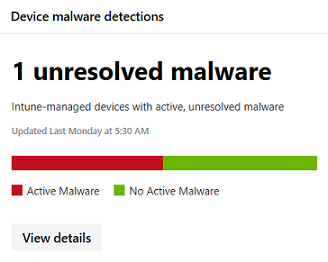

# <a name="device-monitoring-and-reporting-in-the-microsoft-365-security-center"></a><span data-ttu-id="3dae3-104">Geräteüberwachung und Berichterstellung im Microsoft 365 Security Center</span><span class="sxs-lookup"><span data-stu-id="3dae3-104">Device monitoring and reporting in the Microsoft 365 security center</span></span>

[!INCLUDE [Microsoft 365 Defender rebranding](../includes/microsoft-defender.md)]


<span data-ttu-id="3dae3-105">Schützen Sie Ihre Geräte, halten Sie sie auf dem neuesten Stand und erkennen Sie potenzielle Bedrohungen im Microsoft 365 Security Center.</span><span class="sxs-lookup"><span data-stu-id="3dae3-105">Keep your devices secure, up-to-date, and spot potential threats in the Microsoft 365 security center.</span></span>

## <a name="view-device-alerts"></a><span data-ttu-id="3dae3-106">Anzeigen von Gerätewarnungen</span><span class="sxs-lookup"><span data-stu-id="3dae3-106">View device alerts</span></span>

<span data-ttu-id="3dae3-107">Erhalten Sie aktuelle Warnungen zu Sicherheitsverletzungen und anderen Bedrohungen auf Ihren Geräten von Microsoft Defender for Endpoint (verfügbar mit einer E5-Lizenz).</span><span class="sxs-lookup"><span data-stu-id="3dae3-107">Get up-to-date alerts about breach activity and other threats on your devices from Microsoft Defender for Endpoint (available with an E5 license).</span></span> <span data-ttu-id="3dae3-108">Microsoft 365 Security Center überwacht diese Warnungen mithilfe Ihres bevorzugten Workflows effektiv auf hoher Ebene.</span><span class="sxs-lookup"><span data-stu-id="3dae3-108">Microsoft 365 security center effectively monitors these alerts at a high level using your preferred workflow.</span></span>

### <a name="monitor-high-impact-alerts"></a><span data-ttu-id="3dae3-109">Überwachen von Warnungen mit hoher Auswirkung</span><span class="sxs-lookup"><span data-stu-id="3dae3-109">Monitor high-impact alerts</span></span>

<span data-ttu-id="3dae3-110">Jede Microsoft Defender for Endpoint-Warnung hat einen entsprechenden Schweregrad (hoch, mittel, niedrig oder informationell).</span><span class="sxs-lookup"><span data-stu-id="3dae3-110">Each Microsoft Defender for Endpoint alert has a corresponding severity (high, medium, low, or informational).</span></span> <span data-ttu-id="3dae3-111">Dies weist auf potenzielle Auswirkungen auf Ihr Netzwerk hin, wenn sie unbeaufsichtigt bleiben.</span><span class="sxs-lookup"><span data-stu-id="3dae3-111">It indicates potential impact to your network if left unattended.</span></span>  

<span data-ttu-id="3dae3-112">Verwenden Sie **die Karte mit dem Schweregrad der** Gerätewarnung, um sich speziell auf Warnungen zu konzentrieren, die schwerwiegender sind und eine sofortige Reaktion erfordern.</span><span class="sxs-lookup"><span data-stu-id="3dae3-112">Use the **Device alert severity** card to focus specifically on alerts that are more severe and might require immediate response.</span></span> <span data-ttu-id="3dae3-113">Auf dieser Karte können Sie weitere Informationen im Microsoft Defender Security Center-Portal anzeigen.</span><span class="sxs-lookup"><span data-stu-id="3dae3-113">From this card, you can view more information on the Microsoft Defender Security Center portal.</span></span>


### <a name="understand-sources-of-alerts"></a><span data-ttu-id="3dae3-115">Verstehen der Quellen von Warnungen</span><span class="sxs-lookup"><span data-stu-id="3dae3-115">Understand sources of alerts</span></span>

<span data-ttu-id="3dae3-116">Microsoft Defender for Endpoint nutzt Daten aus einer Vielzahl von Sicherheitssensoren und Intelligencequellen, um Warnungen zu generieren.</span><span class="sxs-lookup"><span data-stu-id="3dae3-116">Microsoft Defender for Endpoint leverages data from a broad range of security sensors and intelligence sources to generate alerts.</span></span> <span data-ttu-id="3dae3-117">Beispielsweise können Erkennungsinformationen von Microsoft Defender Antivirus und Antischsoftware von Drittanbietern verwendet werden.</span><span class="sxs-lookup"><span data-stu-id="3dae3-117">For example, it can use detection information from Microsoft Defender Antivirus and third-party antimalware.</span></span> <span data-ttu-id="3dae3-118">Sie kann auch Ihre eigene benutzerdefinierte Bedrohungsintelligenz verwenden, die über die Webdienst-API bereitgestellt wird.</span><span class="sxs-lookup"><span data-stu-id="3dae3-118">It can also use your own custom threat intelligence provided through the web service API.</span></span>

<span data-ttu-id="3dae3-119">Die **Karte "Gerätewarnungserkennungsquellen"** zeigt die Verteilung von Warnungen nach Quelle an.</span><span class="sxs-lookup"><span data-stu-id="3dae3-119">The **Device alert detection** sources card shows the distribution of alerts by source.</span></span> <span data-ttu-id="3dae3-120">Verfolgen Sie Aktivitäten im Zusammenhang mit bestimmten Quellen, insbesondere Ihren benutzerdefinierten Quellen.</span><span class="sxs-lookup"><span data-stu-id="3dae3-120">Track activity related to certain sources, particularly your custom sources.</span></span> <span data-ttu-id="3dae3-121">Sie können die Karte auch verwenden, um sich auf Warnungen von Sensoren zu konzentrieren, die nicht so konfiguriert sind, dass schädliche Aktivitäten oder Komponenten automatisch blockiert werden.</span><span class="sxs-lookup"><span data-stu-id="3dae3-121">You can also use the card to focus on alerts coming from sensors that aren't configured to automatically block malicious activity or components.</span></span>


<span data-ttu-id="3dae3-123">Auf dieser Karte können Sie weitere Informationen im Microsoft Defender Security Center-Portal anzeigen.</span><span class="sxs-lookup"><span data-stu-id="3dae3-123">From this card, you can view more information on the Microsoft Defender Security Center portal.</span></span>

### <a name="understand-the-types-of-threats-that-trigger-alerts"></a><span data-ttu-id="3dae3-124">Verstehen der Arten von Bedrohungen, die Warnungen auslösen</span><span class="sxs-lookup"><span data-stu-id="3dae3-124">Understand the types of threats that trigger alerts</span></span>

<span data-ttu-id="3dae3-125">Microsoft Defender for Endpoint sortiert jede Warnung in eine Kategorie, die eine bestimmte Phase in der Angriffskette oder den Typ der Bedrohungskomponente darstellt.</span><span class="sxs-lookup"><span data-stu-id="3dae3-125">Microsoft Defender for Endpoint sorts each alert into a category representing a certain stage in the attack chain or type of threat component.</span></span> <span data-ttu-id="3dae3-126">Beispielsweise kann eine erkannte Bedrohungsaktivität als "laterale Bewegung" kategorisiert werden, um anzuzeigen, dass versucht wurde, andere Geräte im Netzwerk zu erreichen.</span><span class="sxs-lookup"><span data-stu-id="3dae3-126">For example, a detected threat activity might be categorized as "lateral movement" to indicate there was an attempt to reach other devices on the network.</span></span> <span data-ttu-id="3dae3-127">Die Aktivität ist wahrscheinlich aufgetreten, nachdem Angreifer einen anfänglichen Fußweg gewonnen haben.</span><span class="sxs-lookup"><span data-stu-id="3dae3-127">The activity has likely occurred after attackers gained an initial foothold.</span></span> <span data-ttu-id="3dae3-128">Wenn eine Bedrohungskomponente erkannt wird, kann sie allgemein als Schadsoftware oder speziell als bestimmter Bedrohungstyp klassifiziert werden.</span><span class="sxs-lookup"><span data-stu-id="3dae3-128">When detected, a threat component might be classified broadly as malware or specifically as a specific threat type.</span></span> <span data-ttu-id="3dae3-129">Zu den Besonderheiten gehören Ransomware, Diebstahl von Anmeldeinformationen oder andere Arten von schadhafter oder unerwünschter Software.</span><span class="sxs-lookup"><span data-stu-id="3dae3-129">Specifics include ransomware, credential stealing, or other types of malicious or unwanted software.</span></span>

<span data-ttu-id="3dae3-130">Die **Karte "Gerätebedrohungskategorien"** zeigt die Verteilung von Warnungen in diese Kategorien an.</span><span class="sxs-lookup"><span data-stu-id="3dae3-130">The **Device threat categories** card shows the distribution of alerts into these categories.</span></span> <span data-ttu-id="3dae3-131">Verwenden Sie diese Informationen, um Bedrohungsaktivitäten zu identifizieren, z. B. Versuche des Diebstahls von Anmeldeinformationen, die in der Regel größere Auswirkungen haben als Social Engineering-Versuche.</span><span class="sxs-lookup"><span data-stu-id="3dae3-131">Use this information to identify threat activity, such as credential theft attempts, that usually have higher impact than social engineering attempts.</span></span> <span data-ttu-id="3dae3-132">Sie können auch auf potenziell schädliche Bedrohungen wie Ransomware überwachen.</span><span class="sxs-lookup"><span data-stu-id="3dae3-132">You can also to monitor for potentially destructive threats like ransomware.</span></span>


### <a name="monitor-active-alerts"></a><span data-ttu-id="3dae3-134">Überwachen aktiver Warnungen</span><span class="sxs-lookup"><span data-stu-id="3dae3-134">Monitor active alerts</span></span>

<span data-ttu-id="3dae3-135">Die **Statuskarte für Gerätewarnungen** gibt die Anzahl der Warnungen an, die nicht aufgelöst wurden und möglicherweise Aufmerksamkeit erfordern.</span><span class="sxs-lookup"><span data-stu-id="3dae3-135">The **Device alert status** card indicates the number of alerts that haven't been resolved and may require attention.</span></span> <span data-ttu-id="3dae3-136">Auf dieser Karte können Sie weitere Informationen im Microsoft Defender Security Center-Portal anzeigen.</span><span class="sxs-lookup"><span data-stu-id="3dae3-136">From this card, you can view more information on the Microsoft Defender Security Center portal.</span></span>


### <a name="monitor-classification-of-resolved-alerts"></a><span data-ttu-id="3dae3-138">Überwachen der Klassifizierung aufgelöster Warnungen</span><span class="sxs-lookup"><span data-stu-id="3dae3-138">Monitor classification of resolved alerts</span></span>

<span data-ttu-id="3dae3-139">Beim Auflösen einer Microsoft Defender for Endpoint-Warnung können Ihre Sicherheitsmitarbeiter angeben, ob eine Warnung wie folgt überprüft wurde:</span><span class="sxs-lookup"><span data-stu-id="3dae3-139">When resolving a Microsoft Defender for Endpoint alert, your security staff can specify whether an alert has been verified as:</span></span>

* <span data-ttu-id="3dae3-140">Eine echte Warnung, die tatsächliche Sicherheitsverletzungen oder Bedrohungskomponenten identifiziert</span><span class="sxs-lookup"><span data-stu-id="3dae3-140">A true alert that identifies actual breach activity or threat components</span></span>
* <span data-ttu-id="3dae3-141">Eine falsche Warnung, die normale Aktivität fälschlicherweise erkannt hat</span><span class="sxs-lookup"><span data-stu-id="3dae3-141">A false alert that has incorrectly detected normal activity</span></span>

<span data-ttu-id="3dae3-142">Die **Klassifizierungskarte für Gerätewarnungen** zeigt an, ob ihre aufgelösten Warnungen als "wahr" oder "Falsch" klassifiziert wurden.</span><span class="sxs-lookup"><span data-stu-id="3dae3-142">The **Device alert classification** card shows whether your resolved alerts have been classified as true or false alerts.</span></span> <span data-ttu-id="3dae3-143">Auf dieser Karte können Sie weitere Informationen im Microsoft Defender Security Center-Portal anzeigen.</span><span class="sxs-lookup"><span data-stu-id="3dae3-143">From this card, you can view more information on the Microsoft Defender Security Center portal.</span></span>

<span data-ttu-id="3dae3-144">Hinweis: In einigen Fällen sind Klassifizierungsinformationen für bestimmte Warnungen nicht verfügbar.</span><span class="sxs-lookup"><span data-stu-id="3dae3-144">Note: In some cases, classification information is unavailable for certain alerts.</span></span>


### <a name="monitor-determination-of-resolved-alerts"></a><span data-ttu-id="3dae3-146">Überwachen der Ermittlung aufgelöster Warnungen</span><span class="sxs-lookup"><span data-stu-id="3dae3-146">Monitor determination of resolved alerts</span></span>

<span data-ttu-id="3dae3-147">Neben der Klassifizierung, ob eine Warnung während der Auflösung wahr oder falsch ist, können Ihre Sicherheitsmitarbeiter eine Bestimmung bereitstellen.</span><span class="sxs-lookup"><span data-stu-id="3dae3-147">Along with classifying whether an alert is true or false during resolution, your security staff can provide a determination.</span></span> <span data-ttu-id="3dae3-148">Eine Bestimmung gibt den Typ normaler oder böswilliger Aktivitäten an, die bei der Validierung der Warnung gefunden wurden.</span><span class="sxs-lookup"><span data-stu-id="3dae3-148">A determination indicates the type of normal or malicious activity that was found while validating the alert.</span></span>

<span data-ttu-id="3dae3-149">Die **Karte zur Ermittlung von Gerätewarnungen** zeigt die Für jede Warnung bereitgestellte Bestimmung an.</span><span class="sxs-lookup"><span data-stu-id="3dae3-149">The **Device alert determination** card shows the determination provided for each alert.</span></span>

* <span data-ttu-id="3dae3-150">**APT:** erweiterte dauerhafte Bedrohung, die angibt, dass die erkannte Aktivität oder Bedrohungskomponente Teil einer ausgeklügelten Verletzung ist, die dazu dient, im betroffenen Netzwerk Fuß zu fassen.</span><span class="sxs-lookup"><span data-stu-id="3dae3-150">**APT**: advanced persistent threat, indicating that the detected activity or threat component is part of a sophisticated breach designed to gain a foothold in the affected network</span></span>  
* <span data-ttu-id="3dae3-151">**Schadsoftware:** schädliche Datei oder Code</span><span class="sxs-lookup"><span data-stu-id="3dae3-151">**Malware**: malicious file or code</span></span>
* <span data-ttu-id="3dae3-152">**Sicherheitspersonal:** normale Aktivitäten, die von Sicherheitsmitarbeitern ausgeführt werden</span><span class="sxs-lookup"><span data-stu-id="3dae3-152">**Security personnel**: normal activity performed by security staff</span></span>
* <span data-ttu-id="3dae3-153">**Sicherheitstests:** Aktivitäten oder Komponenten, die zur Simulation tatsächlicher Bedrohungen entwickelt wurden und voraussichtlich Sicherheitssensoren auslösen und Warnungen generieren</span><span class="sxs-lookup"><span data-stu-id="3dae3-153">**Security testing**: activity or components designed to simulate actual threats and expected to trigger security sensors and generate alerts</span></span>
* <span data-ttu-id="3dae3-154">**Unerwünschte Software:** Apps und andere Software, die nicht als bösartig betrachtet werden, aber andernfalls gegen Richtlinien oder akzeptable Nutzungsstandards verstoßen</span><span class="sxs-lookup"><span data-stu-id="3dae3-154">**Unwanted software**: apps and other software that are not considered malicious, but otherwise violate policy or acceptable use standards</span></span>
* <span data-ttu-id="3dae3-155">**Sonstiges:** jede andere Bestimmung, die nicht unter die bereitgestellten Typen fällt</span><span class="sxs-lookup"><span data-stu-id="3dae3-155">**Others**: any other determination that doesn't fall under the provided types</span></span>

<span data-ttu-id="3dae3-156">Auf dieser Karte können Sie weitere Informationen im Microsoft Defender Security Center anzeigen.</span><span class="sxs-lookup"><span data-stu-id="3dae3-156">From this card, you can view more information in Microsoft Defender Security Center.</span></span>


### <a name="understand-which-devices-are-at-risk"></a><span data-ttu-id="3dae3-158">Verstehen, welche Geräte gefährdet sind</span><span class="sxs-lookup"><span data-stu-id="3dae3-158">Understand which devices are at risk</span></span>

<span data-ttu-id="3dae3-159">**Der Geräteschutz** zeigt die Risikostufe für Geräte an.</span><span class="sxs-lookup"><span data-stu-id="3dae3-159">**Device protection** shows the risk level for devices.</span></span> <span data-ttu-id="3dae3-160">Die Risikostufe basiert auf Faktoren wie Art und Schweregrad von Warnungen auf dem Gerät.</span><span class="sxs-lookup"><span data-stu-id="3dae3-160">The risk level is based on factors such as the type and severity of alerts on the device.</span></span>


## <a name="monitor-and-report-status-of-intune-managed-devices"></a><span data-ttu-id="3dae3-162">Überwachen und Melden des Status von von Intune verwalteten Geräten</span><span class="sxs-lookup"><span data-stu-id="3dae3-162">Monitor and report status of Intune-managed devices</span></span>

<span data-ttu-id="3dae3-163">Die folgenden Berichte enthalten Daten von Geräten, die in Intune registriert sind.</span><span class="sxs-lookup"><span data-stu-id="3dae3-163">The following reports contain data from devices enrolled in Intune.</span></span> <span data-ttu-id="3dae3-164">Daten von nicht registrierungsierten Geräten sind nicht enthalten.</span><span class="sxs-lookup"><span data-stu-id="3dae3-164">Data from unenrolled devices isn't included.</span></span> <span data-ttu-id="3dae3-165">Nur globale Administratoren können diese Karten anzeigen.</span><span class="sxs-lookup"><span data-stu-id="3dae3-165">Only Global Administrators can view these cards.</span></span>

<span data-ttu-id="3dae3-166">Zu den in Intune registrierten Gerätedaten gehören:</span><span class="sxs-lookup"><span data-stu-id="3dae3-166">Intune enrolled device data includes:</span></span>

* <span data-ttu-id="3dae3-167">Gerätekompatibilität</span><span class="sxs-lookup"><span data-stu-id="3dae3-167">Device compliance</span></span>
* <span data-ttu-id="3dae3-168">Geräte mit aktiver Schadsoftware</span><span class="sxs-lookup"><span data-stu-id="3dae3-168">Devices with active malware</span></span>
* <span data-ttu-id="3dae3-169">Arten von Schadsoftware auf Geräten</span><span class="sxs-lookup"><span data-stu-id="3dae3-169">Types of malware on devices</span></span>
* <span data-ttu-id="3dae3-170">Schadsoftware auf Geräten</span><span class="sxs-lookup"><span data-stu-id="3dae3-170">Malware on devices</span></span>
* <span data-ttu-id="3dae3-171">Geräte mit Schadsoftwareerkennungen</span><span class="sxs-lookup"><span data-stu-id="3dae3-171">Devices with malware detections</span></span>
* <span data-ttu-id="3dae3-172">Benutzer mit Schadsoftwareerkennungen</span><span class="sxs-lookup"><span data-stu-id="3dae3-172">Users with malware detections</span></span>

### <a name="monitor-device-compliance"></a><span data-ttu-id="3dae3-173">Überwachen der Gerätekonformität</span><span class="sxs-lookup"><span data-stu-id="3dae3-173">Monitor device compliance</span></span>

<span data-ttu-id="3dae3-174">**Die Gerätekonformität** zeigt, wie viele Geräte, die in Intune registriert sind, Konfigurationsrichtlinien einhalten.</span><span class="sxs-lookup"><span data-stu-id="3dae3-174">**Device compliance** shows how many devices that are enrolled in Intune comply with configuration policies.</span></span>


### <a name="discover-devices-with-malware-detections"></a><span data-ttu-id="3dae3-176">Ermitteln von Geräten mit Schadsoftwareerkennungen</span><span class="sxs-lookup"><span data-stu-id="3dae3-176">Discover devices with malware detections</span></span>

<span data-ttu-id="3dae3-177">**Schadsoftwareerkennungen** für Geräte stellen die Anzahl der in Intune registrierten Geräte mit Schadsoftware zur Verfügung, die noch nicht vollständig aufgelöst wurde.</span><span class="sxs-lookup"><span data-stu-id="3dae3-177">**Device malware detections** provide the number of Intune enrolled devices with malware that hasn't been fully resolved.</span></span> <span data-ttu-id="3dae3-178">Eine fehlende Lösung kann auf ausstehende Aktionen, einen Neustart, einen vollständigen Scan, manuelle Benutzeraktionen oder darauf, dass die Korrekturaktion nicht erfolgreich abgeschlossen wurde, sein.</span><span class="sxs-lookup"><span data-stu-id="3dae3-178">A lack of resolution can be because of pending actions, a restart, a full scan, manual user actions, or if the remediation action was not successfully completed.</span></span>



### <a name="understand-the-types-of-malware-detected"></a><span data-ttu-id="3dae3-180">Verstehen der erkannten Schadsoftwaretypen</span><span class="sxs-lookup"><span data-stu-id="3dae3-180">Understand the types of malware detected</span></span>

<span data-ttu-id="3dae3-181">**Arten von Schadsoftware auf** Geräten zeigen verschiedene Arten von Schadsoftware, die auf Geräten erkannt wurden, die in Intune registriert sind.</span><span class="sxs-lookup"><span data-stu-id="3dae3-181">**Types of malware on devices** show different kinds of malware that have been detected on devices enrolled in Intune.</span></span> <span data-ttu-id="3dae3-182">Sie können jeden Typ im Microsoft 365 Security Center untersuchen.</span><span class="sxs-lookup"><span data-stu-id="3dae3-182">You can investigate each type in the Microsoft 365 security center.</span></span>


### <a name="understand-the-specific-malware-detected-on-your-devices"></a><span data-ttu-id="3dae3-184">Verstehen der spezifischen Schadsoftware, die auf Ihren Geräten erkannt wird</span><span class="sxs-lookup"><span data-stu-id="3dae3-184">Understand the specific malware detected on your devices</span></span>

<span data-ttu-id="3dae3-185">**Schadsoftware auf** Geräten bietet eine Liste der spezifischen Schadsoftware, die auf Ihren Geräten erkannt wird.</span><span class="sxs-lookup"><span data-stu-id="3dae3-185">**Malware on devices** provides a list of the specific malware detected on your devices.</span></span>


### <a name="understand-which-devices-have-the-most-malware"></a><span data-ttu-id="3dae3-187">Verstehen, welche Geräte am häufigsten Schadsoftware enthalten</span><span class="sxs-lookup"><span data-stu-id="3dae3-187">Understand which devices have the most malware</span></span>

<span data-ttu-id="3dae3-188">**Geräte mit Schadsoftwareerkennungen** zeigen, welche Geräte die meisten Schadsoftwareerkennungen haben.</span><span class="sxs-lookup"><span data-stu-id="3dae3-188">**Devices with malware detections** show which devices have the most malware detections.</span></span> <span data-ttu-id="3dae3-189">im Microsoft 365 Security Center können Sie untersuchen, ob Schadsoftware aktiv ist, wer das Gerät verwendet, und dessen Verwaltungsstatus in Intune.</span><span class="sxs-lookup"><span data-stu-id="3dae3-189">in the Microsoft 365 security center, you can investigate whether malware is active, who uses the device, and its management status in Intune.</span></span>


### <a name="understand-which-users-have-devices-with-the-most-malware"></a><span data-ttu-id="3dae3-191">Verstehen, welche Benutzer Geräte mit der meisten Schadsoftware haben</span><span class="sxs-lookup"><span data-stu-id="3dae3-191">Understand which users have devices with the most malware</span></span>

<span data-ttu-id="3dae3-192">**Benutzer mit Schadsoftwareerkennungen** zeigen Benutzern mit Geräten mit den meisten Schadsoftwareerkennungen an.</span><span class="sxs-lookup"><span data-stu-id="3dae3-192">**Users with malware detections** show users with devices that had the most malware detections.</span></span> <span data-ttu-id="3dae3-193">Im Microsoft 365 Security Center können Sie sehen, wie viele Geräte jedem Benutzer zugewiesen sind, sowie weitere Informationen zu jedem Gerät und der Art von Schadsoftware.</span><span class="sxs-lookup"><span data-stu-id="3dae3-193">In the Microsoft 365 security center, you can see how many devices are assigned to each user and more information about each device and the type of malware.</span></span>


## <a name="monitor-and-manage-attack-surface-reduction-rule-deployment-and-detections"></a><span data-ttu-id="3dae3-195">Überwachen und Verwalten der Bereitstellung und Erkennung von Regeln zur Reduzierung der Angriffsfläche</span><span class="sxs-lookup"><span data-stu-id="3dae3-195">Monitor and manage attack surface reduction rule deployment and detections</span></span>

<span data-ttu-id="3dae3-196">[Attack Surface Reduction (ASR)-Regeln](https://docs.microsoft.com/windows/security/threat-protection/microsoft-defender-atp/attack-surface-reduction) verhindern Aktionen und Apps, die in der Regel von Schadsoftware verwendet werden, um Geräte zu infizieren.</span><span class="sxs-lookup"><span data-stu-id="3dae3-196">[Attack Surface Reduction (ASR) rules](https://docs.microsoft.com/windows/security/threat-protection/microsoft-defender-atp/attack-surface-reduction) help prevent actions and apps that are typically used by exploit-seeking malware to infect devices.</span></span> <span data-ttu-id="3dae3-197">Mit diesen Regeln wird gesteuert, wann und wie ausführbare Dateien ausgeführt werden.</span><span class="sxs-lookup"><span data-stu-id="3dae3-197">These rules control when and how executables can run.</span></span> <span data-ttu-id="3dae3-198">So können Sie beispielsweise verhindern, dass JavaScript oder VBScript eine heruntergeladene ausführbare Datei startet, Win32-API-Aufrufe aus Office-Makros blockiert oder Prozesse blockiert, die von USB-Laufwerken ausgeführt werden.</span><span class="sxs-lookup"><span data-stu-id="3dae3-198">For example, you can prevent JavaScript or VBScript from launching a downloaded executable, block Win32 API calls from Office macros, or block processes that run from USB drives.</span></span>


<span data-ttu-id="3dae3-200">Die Karte **Regeln zur Verringerung der Angriffsfläche** bietet einen Überblick über die Bereitstellung von Regeln auf Ihren Geräten.</span><span class="sxs-lookup"><span data-stu-id="3dae3-200">The **Attack surface reduction rules** card provides an overview of the deployment of rules across your devices.</span></span>

<span data-ttu-id="3dae3-201">Die obere Leiste auf der Karte zeigt die Gesamtzahl der Geräte an, die sich in den folgenden Bereitstellungsmodi befinden:</span><span class="sxs-lookup"><span data-stu-id="3dae3-201">The top bar on the card shows the total number of devices that are in the following deployment modes:</span></span>

* <span data-ttu-id="3dae3-202">**Blockmodus:** Geräte mit mindestens einer Regel, die so konfiguriert sind, dass erkannte Aktivitäten blockiert werden</span><span class="sxs-lookup"><span data-stu-id="3dae3-202">**Block mode**: devices with at least one rule configured to block detected activity</span></span>
* <span data-ttu-id="3dae3-203">**Überwachungsmodus:** Geräte ohne Regeln, die zum Blockieren erkannter Aktivitäten festgelegt sind, aber mindestens einen Regelsatz zum Überwachen der erkannten Aktivität haben</span><span class="sxs-lookup"><span data-stu-id="3dae3-203">**Audit mode**: devices with no rules set to block detected activity, but has at least one rule set to audit detected activity</span></span>  
* <span data-ttu-id="3dae3-204">**Aus:** Geräte mit deaktivierten AsR-Regeln</span><span class="sxs-lookup"><span data-stu-id="3dae3-204">**Off**: devices with all ASR rules turned off</span></span>

<span data-ttu-id="3dae3-205">Der untere Teil dieser Karte zeigt die Einstellungen nach Regeln auf Ihren Geräten an.</span><span class="sxs-lookup"><span data-stu-id="3dae3-205">The lower part of this card shows settings by rule across your devices.</span></span> <span data-ttu-id="3dae3-206">Jede Leiste gibt die Anzahl der Geräte an, die zum Blockieren, Überwachen der Erkennung oder zum vollständigen Deaktivieren der Regel festgelegt sind.</span><span class="sxs-lookup"><span data-stu-id="3dae3-206">Each bar indicates the number of devices that are set to block, audit detection, or have the rule completely turned off.</span></span>

### <a name="view-asr-detections"></a><span data-ttu-id="3dae3-207">Anzeigen von ASR-Erkennungen</span><span class="sxs-lookup"><span data-stu-id="3dae3-207">View ASR detections</span></span>

<span data-ttu-id="3dae3-208">Wählen Sie zum Anzeigen detaillierter Informationen zu Erkennungen von ASR-Regeln in Ihrem Netzwerk die Option "Erkennungen anzeigen" auf der **Regelkarte** zur Reduzierung der **Angriffsfläche** aus.</span><span class="sxs-lookup"><span data-stu-id="3dae3-208">To view detailed information about ASR rule detections in your network, select **View detections** on the **Attack surface reduction rules** card.</span></span> <span data-ttu-id="3dae3-209">Die **Registerkarte "Erkennungen"** auf der detaillierten Berichtsseite wird geöffnet.</span><span class="sxs-lookup"><span data-stu-id="3dae3-209">The **Detections** tab in the detailed report page will open.</span></span>


<span data-ttu-id="3dae3-211">Das Diagramm oben auf der Seite zeigt Erkennungen im Laufe der Zeit beim Stapeln von Erkennungen, die entweder blockiert oder überwacht wurden.</span><span class="sxs-lookup"><span data-stu-id="3dae3-211">The chart at the top of the page shows detections over time stacking detections that were either blocked or audited.</span></span> <span data-ttu-id="3dae3-212">Die Tabelle am unteren Rand listet die aktuellsten Erkennungen auf.</span><span class="sxs-lookup"><span data-stu-id="3dae3-212">The table at the bottom lists the most recent detections.</span></span> <span data-ttu-id="3dae3-213">Verwenden Sie die folgenden Informationen in der Tabelle, um die Art der Erkennungen zu verstehen:</span><span class="sxs-lookup"><span data-stu-id="3dae3-213">Use the following information on the table to understand the nature of the detections:</span></span>

* <span data-ttu-id="3dae3-214">**Erkannte Datei:** die Datei, in der Regel ein Skript oder Dokument, deren Inhalt die mutmaßliche Angriffsaktivität ausgelöst hat</span><span class="sxs-lookup"><span data-stu-id="3dae3-214">**Detected file**: the file, typically a script or document, whose contents triggered the suspected attack activity</span></span>
* <span data-ttu-id="3dae3-215">**Regel:** Name, der die Angriffsaktivitäten beschreibt, auf die die Regel ausgelegt ist.</span><span class="sxs-lookup"><span data-stu-id="3dae3-215">**Rule**: name describing the attack activities the rule is designed to catch.</span></span> <span data-ttu-id="3dae3-216">Informationen zu vorhandenen AsR-Regeln</span><span class="sxs-lookup"><span data-stu-id="3dae3-216">Read about existing ASR rules</span></span>
* <span data-ttu-id="3dae3-217">**Quell-App:** die Anwendung, die Inhalte geladen oder ausgeführt hat, die die mutmaßliche Angriffsaktivität auslösen.</span><span class="sxs-lookup"><span data-stu-id="3dae3-217">**Source app**: the application that loaded or executed content triggering the suspected attack activity.</span></span> <span data-ttu-id="3dae3-218">Dies kann eine legitime Anwendung sein, z. B. ein Webbrowser, eine Office-Anwendung oder ein Systemtool wie PowerShell.</span><span class="sxs-lookup"><span data-stu-id="3dae3-218">It could be a legitimate application, such as web browser, an Office application, or a system tool like PowerShell</span></span>
* <span data-ttu-id="3dae3-219">**Herausgeber:** der Anbieter, der die Quell-App veröffentlicht hat</span><span class="sxs-lookup"><span data-stu-id="3dae3-219">**Publisher**: the vendor that released the source app</span></span>

### <a name="review-device-asr-rule-settings"></a><span data-ttu-id="3dae3-220">Überprüfen der Geräte-ASR-Regeleinstellungen</span><span class="sxs-lookup"><span data-stu-id="3dae3-220">Review device ASR rule settings</span></span>

<span data-ttu-id="3dae3-221">Wechseln Sie **auf der Seite "Attack Surface Reduction Rules"** zur Registerkarte **"Konfiguration",** um die Regeleinstellungen für einzelne Geräte zu überprüfen.</span><span class="sxs-lookup"><span data-stu-id="3dae3-221">In the **Attack surface reduction rules** report page, go to the **Configuration** tab to review rule settings for individual devices.</span></span> <span data-ttu-id="3dae3-222">Wählen Sie ein Gerät aus, um detaillierte Informationen darüber zu erhalten, ob sich jede Regel im Sperrmodus, Überwachungsmodus oder vollständig deaktiviert befindet.</span><span class="sxs-lookup"><span data-stu-id="3dae3-222">Select a device to get detailed information about whether each rule is in block mode, audit mode, or turned off entirely.</span></span>


<span data-ttu-id="3dae3-224">Microsoft Intune bietet Verwaltungsfunktionen für Ihre ASR-Regeln.</span><span class="sxs-lookup"><span data-stu-id="3dae3-224">Microsoft Intune provides management functionality for your ASR rules.</span></span> <span data-ttu-id="3dae3-225">Wenn Sie Ihre Einstellungen aktualisieren möchten, wählen Sie unter **"Geräte** **konfigurieren"** auf der Registerkarte "Erste Schritte" aus, um die Geräteverwaltung in Intune zu öffnen.</span><span class="sxs-lookup"><span data-stu-id="3dae3-225">If you want to update your settings, select **Get started** under **Configure devices** in the tab to open device management on Intune.</span></span>

### <a name="exclude-files-from-asr-rules"></a><span data-ttu-id="3dae3-226">Ausschließen von Dateien von ASR-Regeln</span><span class="sxs-lookup"><span data-stu-id="3dae3-226">Exclude files from ASR rules</span></span>

<span data-ttu-id="3dae3-227">Das Microsoft 365 Security Center [](https://docs.microsoft.com/windows/security/threat-protection/microsoft-defender-atp/enable-attack-surface-reduction#exclude-files-and-folders-from-asr-rules) sammelt die Namen der Dateien, die Sie möglicherweise von Erkennungen durch Regeln zur Reduzierung der Angriffsfläche ausschließen möchten.</span><span class="sxs-lookup"><span data-stu-id="3dae3-227">Microsoft 365 security center collects the names of the [files you might want to exclude](https://docs.microsoft.com/windows/security/threat-protection/microsoft-defender-atp/enable-attack-surface-reduction#exclude-files-and-folders-from-asr-rules) from detections by attack surface reduction rules.</span></span> <span data-ttu-id="3dae3-228">Wenn Sie Dateien ausschließen, können Sie falsch positive Erkennungen reduzieren und Angriffsflächenreduzierungsregeln im Blockmodus sicherer bereitstellen.</span><span class="sxs-lookup"><span data-stu-id="3dae3-228">By excluding files, you can reduce false positive detections and more confidently deploy attack surface reduction rules in block mode.</span></span>

<span data-ttu-id="3dae3-229">Die Ausschlüsse werden in Microsoft Intune verwaltet, aber Microsoft 365 Security Center bietet ein Analysetool, mit dem Sie die Dateien besser verstehen können.</span><span class="sxs-lookup"><span data-stu-id="3dae3-229">The exclusions are managed on Microsoft Intune, but Microsoft 365 security center provides an analysis tool to help you understand the files.</span></span> <span data-ttu-id="3dae3-230">To start collecting files for exclusion, go to the **Add exclusions** tab in the **Attack surface reduction rules** report page.</span><span class="sxs-lookup"><span data-stu-id="3dae3-230">To start collecting files for exclusion, go to the **Add exclusions** tab in the **Attack surface reduction rules** report page.</span></span>

>[!NOTE]  
><span data-ttu-id="3dae3-231">Das Tool analysiert Erkennungen durch alle Regeln zur Reduzierung der Angriffsfläche, aber [nur einige Regeln unterstützen Ausschlüsse.](https://docs.microsoft.com/windows/security/threat-protection/microsoft-defender-atp/troubleshoot-asr)</span><span class="sxs-lookup"><span data-stu-id="3dae3-231">The tool analyzes detections by all attack surface reduction rules, but [only some rules support exclusions](https://docs.microsoft.com/windows/security/threat-protection/microsoft-defender-atp/troubleshoot-asr).</span></span>


<span data-ttu-id="3dae3-233">In der Tabelle sind alle Dateinamen aufgeführt, die von den Regeln zur Reduzierung der Angriffsfläche erkannt werden.</span><span class="sxs-lookup"><span data-stu-id="3dae3-233">The table lists all the file names detected by your attack surface reduction rules.</span></span> <span data-ttu-id="3dae3-234">Sie können Dateien auswählen, um die Auswirkungen des Ausschließens zu überprüfen:</span><span class="sxs-lookup"><span data-stu-id="3dae3-234">You can select files to review the impact of excluding them:</span></span>

* <span data-ttu-id="3dae3-235">Wie viele Erkennungen weniger</span><span class="sxs-lookup"><span data-stu-id="3dae3-235">How many fewer detections</span></span>
* <span data-ttu-id="3dae3-236">Wie viele geräte melden die Erkennungen</span><span class="sxs-lookup"><span data-stu-id="3dae3-236">How many fewer devices report the detections</span></span>

<span data-ttu-id="3dae3-237">Um eine Liste der ausgewählten Dateien mit ihren vollständigen Pfaden für den Ausschluss zu erhalten, wählen **Sie Ausschlusspfade erhalten aus.**</span><span class="sxs-lookup"><span data-stu-id="3dae3-237">To get a list of the selected files with their full paths for exclusion, select **Get exclusion paths**.</span></span>

<span data-ttu-id="3dae3-238">Protokolle für die ASR-Regel Zum Blockieren von Anmeldeinformationen, die aus dem Subsystem der lokalen Sicherheitsbehörde **(lsass.exe)** von Windows gestohlen werden, erfassen die **Quell-App-lsass.exe.**</span><span class="sxs-lookup"><span data-stu-id="3dae3-238">Logs for the ASR rule **Block credential stealing from the Windows local security authority subsystem (lsass.exe)** capture the source app **lsass.exe**.</span></span> <span data-ttu-id="3dae3-239">Es handelt sich um eine normale Systemdatei, die jedoch als erkannte Datei erfasst wird.</span><span class="sxs-lookup"><span data-stu-id="3dae3-239">It is a normal system file, but captured as the detected file.</span></span> <span data-ttu-id="3dae3-240">Daher enthält die generierte Liste der Ausschlusspfade diese Datei.</span><span class="sxs-lookup"><span data-stu-id="3dae3-240">As a result, the generated list of exclusion paths will include this file.</span></span> <span data-ttu-id="3dae3-241">Wenn Sie die Datei, die diese Regel ausgelöst hat, anstellelsass.exe **ausschließen** möchten, verwenden Sie den Pfad zur Quell-App anstelle der erkannten Datei.</span><span class="sxs-lookup"><span data-stu-id="3dae3-241">To exclude the file that triggered this rule instead of **lsass.exe**, use the path to the source app instead of the detected file.</span></span>

<span data-ttu-id="3dae3-242">Führen Sie zum Suchen der [](https://docs.microsoft.com/windows/security/threat-protection/microsoft-defender-atp/advanced-hunting) Quell-App die folgende Erweiterte Suchabfrage für diese bestimmte Regel aus (identifiziert durch regel-ID 9e6c4e1f-7d60-472f-ba1a-a39ef669e4b2):</span><span class="sxs-lookup"><span data-stu-id="3dae3-242">To locate the source app, run the following [advanced hunting query](https://docs.microsoft.com/windows/security/threat-protection/microsoft-defender-atp/advanced-hunting) for this specific rule (identified by rule ID 9e6c4e1f-7d60-472f-ba1a-a39ef669e4b2):</span></span>

```kusto
DeviceEvents
| where Timestamp > ago(7d)
| where ActionType startswith "Asr"
| where AdditionalFields contains "9e6c4e1f-7d60-472f-ba1a-a39ef669e4b2"
| project InitiatingProcessFolderPath, InitiatingProcessFileName
```

#### <a name="check-files-for-exclusion"></a><span data-ttu-id="3dae3-243">Überprüfen von Dateien auf Ausschluss</span><span class="sxs-lookup"><span data-stu-id="3dae3-243">Check files for exclusion</span></span>

<span data-ttu-id="3dae3-244">Bevor Sie eine Datei von ASR ausschließen, sollten Sie die Datei überprüfen, um festzustellen, ob sie wirklich nicht schädlich ist.</span><span class="sxs-lookup"><span data-stu-id="3dae3-244">Before excluding a file from ASR, we recommend that you inspect the file to determine if it's indeed not malicious.</span></span>

<span data-ttu-id="3dae3-245">Um eine Datei zu überprüfen, verwenden Sie die [Dateiinformationsseite im](https://docs.microsoft.com/windows/security/threat-protection/microsoft-defender-atp/investigate-files) Microsoft Defender Security Center.</span><span class="sxs-lookup"><span data-stu-id="3dae3-245">To review a file, use the [file information page](https://docs.microsoft.com/windows/security/threat-protection/microsoft-defender-atp/investigate-files) on Microsoft Defender Security Center.</span></span> <span data-ttu-id="3dae3-246">Die Seite enthält Verbreitungsinformationen und das Virentotal-Antiviruserkennungsverhältnis.</span><span class="sxs-lookup"><span data-stu-id="3dae3-246">The page provides prevalence information and the VirusTotal antivirus detection ratio.</span></span> <span data-ttu-id="3dae3-247">Sie können auch die Seite verwenden, um die Datei für eine tiefgehende Analyse zu übermitteln.</span><span class="sxs-lookup"><span data-stu-id="3dae3-247">You can also use the page to submit the file for deep analysis.</span></span>

<span data-ttu-id="3dae3-248">Um eine erkannte Datei im Microsoft Defender Security Center zu finden, suchen Sie mithilfe der folgenden erweiterten Suchabfrage nach allen ASR-Erkennungen:</span><span class="sxs-lookup"><span data-stu-id="3dae3-248">To locate a detected file in Microsoft Defender Security Center, search for all ASR detections using the following advanced hunting query:</span></span>

```kusto
MiscEvents
| where EventTime > ago(7d)
| where ActionType startswith "Asr"
| project FolderPath, FileName, SHA1, InitiatingProcessFolderPath, InitiatingProcessFileName, InitiatingProcessSHA1
```

<span data-ttu-id="3dae3-249">Verwenden Sie **SHA1** oder **InitiierenProcessSHA1** in den Ergebnissen, um mithilfe der universellen Suchleiste im Microsoft Defender Security Center nach der Datei zu suchen.</span><span class="sxs-lookup"><span data-stu-id="3dae3-249">Use the **SHA1** or the **InitiatingProcessSHA1** in the results to search for the file using the universal search bar in Microsoft Defender Security Center.</span></span>
