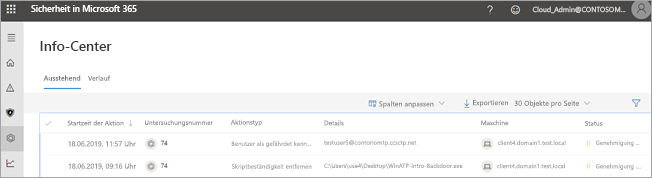
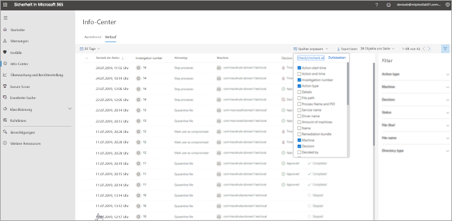

# Aufrufen des Info-Centers zum Anzeigen von Wartungsaktionen

**Gilt für:**
- Microsoft Threat Protection

[!INCLUDE [Prerelease information](../includes/prerelease.md)]

## Eine einzige Oberfläche

Verwenden Sie das Info-Center, um die Ergebnisse aktueller und früherer Untersuchungen auf den Geräten und in den Postfächern Ihrer Organisation anzuzeigen. Je nach Art der Bedrohung und des [resultierenden Urteils](mtp-autoir-results.md#remediation-actions-following-automated-investigation) erfolgen Wartungsaktionen automatisch oder nach Genehmigung durch das Sicherheitsteam Ihrer Organisation. Alle Wartungsaktionen – unabhängig davon, ob eine Genehmigung aussteht oder diese bereits genehmigt wurden – werden im Info-Center zusammengefasst. 

Das Info-Center bietet eine einzige Oberfläche für folgende Aufgaben:
- Genehmigen ausstehender Wartungsaktionen
- Anzeigen eines Überwachungsprotokolls von bereits genehmigten Wartungsaktionen und
- Überprüfen abgeschlossener Wartungsaktionen

Ihr Sicherheitsteam kann effektiver und effizienter arbeiten, da das Info-Center eine umfassende Übersicht über Microsoft Threat Protection bei der Arbeit bietet.

## Wartungsaktionen

Die folgende Tabelle enthält eine Liste der Wartungsaktionen, die aktuell im Info-Center unterstützt werden: 

|Wartungsaktionen für Endpunkte  |Wartungsaktionen für E-Mails  |
|---------|---------|
|Quarantänedatei Registrierungsschlüssel entfernen Prozess abbrechen  Dienst beenden  Registrierungsschlüssel entfernen  Treiber deaktivieren  Geplante Aufgabe entfernen      |E-Mail-Nachrichten oder Cluster vorläufig löschen URL blockieren (Zeitpunkt des Klickens) Externe E-Mail-Weiterleitung deaktivieren          |

## Aufrufen des Info-Centers

1. Gehen Sie zu [https://security.microsoft.com](https://security.microsoft.com), und melden Sie sich an. 

2. Wählen Sie im Navigationsbereich **Info-Center** aus. 

3. Im Info-Center werden zwei Registerkarten angezeigt: **Ausstehend** und **Verlauf**.

    - Auf der Registerkarte **Ausstehend** werden Untersuchungen aufgeführt, die von einer Person in Ihrem Sicherheitsteam überprüft und genehmigt werden müssen. Überprüfen Sie alle ausstehenden Elemente, die hier angezeigt werden, und ergreifen Sie entsprechende Maßnahmen.

    - Auf der Registerkarte **Verlauf** werden frühere Untersuchungen und Wartungsaktionen aufgeführt, die automatisch ausgeführt wurden. Sie können Daten für den vergangenen Tag, die letzte Woche, den letzten Monat oder die letzten sechs Monate anzeigen.

4. Wenn nur bestimmte Spalten angezeigt werden sollen, wählen Sie **Spalten anpassen** aus. 

5. Wählen Sie ein Element in der Liste aus, um weitere Details zu einer Untersuchung anzuzeigen. Die Untersuchungsdetailansicht wird geöffnet. 

    - Wenn es sich bei der Untersuchung um E-Mail-Inhalte (z. B. die Entität ist ein Postfach) handelt, werden die Untersuchungsdetails im Office 365 Security & Compliance Center ([https://protection.office.com/threatinvestigation](https://protection.office.com/threatinvestigation)) geöffnet. 

    - Wenn es bei der Untersuchung um ein Gerät geht, werden die Untersuchungsdetails im Security Center ([https://security.microsoft.com](https://security.microsoft.com)) geöffnet. 

> [!TIP]
> Wenn Sie glauben, dass durch automatisierte Ermittlungs-und Antwortfunktionen in Microsoft Threat Protection etwas übersehen oder fälschlicherweise erkannt wurde, lassen Sie es uns wissen! Weitere Informationen finden Sie unter [How to Report false positives/negatives in Automated Investigation and Response (Air) Funktionen in Microsoft Threat Protection](mtp-autoir-report-false-positives-negatives.md).

## Erforderliche Berechtigungen für Info-Center-Aufgaben

Um ausstehende Aktionen im Info-Center zu genehmigen oder abzulehnen, müssen Sie über die Berechtigungen verfügen, die in der folgenden Tabelle aufgeführt sind:

|Wartungsaktion |Erforderliche Rollen und Berechtigungen |
|--|----|
|Microsoft Defender ATP-Wartung (Geräte) |**Sicherheitsadministratorrolle** in Azure Active Directory ([https://portal.azure.com](https://portal.azure.com)) oder im Microsoft 365 Admin Center ([https://admin.microsoft.com](https://admin.microsoft.com)) --- oder --- Rolle **Aktive Wartungsaktionen** in Microsoft Defender ATP     Weitere Informationen hierzu finden Sie in den folgenden Ressourcen:  - [Administratorrollenberechtigungen in Azure Active Directory](https://docs.microsoft.com/azure/active-directory/users-groups-roles/directory-assign-admin-roles) - [Erstellen und Verwalten von Rollen für die rollenbasierte Zugriffssteuerung (Microsoft Defender ATP)](https://docs.microsoft.com/windows/security/threat-protection/microsoft-defender-atp/user-roles)  |
|Office 365 ATP-Wartung (Office-Inhalte und E-Mail)  |**Sicherheitsadministratorrolle** in Azure Active Directory ([https://portal.azure.com](https://portal.azure.com)) oder im Microsoft 365 Admin Center ([https://admin.microsoft.com](https://admin.microsoft.com)) --- und ---  Rolle **Suchen und Löschen** im Office 365 Security & Compliance Center ([https://protection.office.com](https://protection.office.com))   **WICHTIG**: Wenn Ihnen die Rolle „Sicherheitsadministrator“ nur im Office 365 Security & Compliance Center zugewiesen ist, können Sie nicht auf die Funktionen des Info-Centers oder von Microsoft Threat Protection zugreifen. Ihnen muss die Sicherheitsadministratorrolle in Azure Active Directory oder im Microsoft 365 Admin Center zugewiesen sein.   Weitere Informationen hierzu finden Sie in den folgenden Ressourcen:  - [Administratorrollenberechtigungen in Azure Active Directory](https://docs.microsoft.com/azure/active-directory/users-groups-roles/directory-assign-admin-roles) - [Berechtigungen im Office 365 Security & Compliance Center](https://docs.microsoft.com/microsoft-365/security/office-365-security/permissions-in-the-security-and-compliance-center) |

> [!NOTE]
> Benutzer, denen in Azure Active Directory die Rolle **Globaler Administrator** zugewiesen ist, können alle ausstehenden Aktionen im Info-Center genehmigen oder ablehnen. Als bewährte Methode sollte Ihre Organisation jedoch die Anzahl der Personen einschränken, denen die Rolle des globalen Administrators zugewiesen ist. Es wird empfohlen, die oben aufgeführten Rollen **Sicherheitsadministrator**, **Aktive Wartungsaktionen** und **Suchen und Löschen** für Info-Center-Berechtigungen zu verwenden.

## Nächste Schritte 

- [Weitere Informationen zu Vorfällen in Microsoft Threat Protection](incidents-overview.md)
- [Anzeigen der Ergebnisse einer automatischen Untersuchung](mtp-autoir-results.md)
- [Weitere Informationen zur Suche in Microsoft Threat Protection](advanced-hunting-overview.md)

