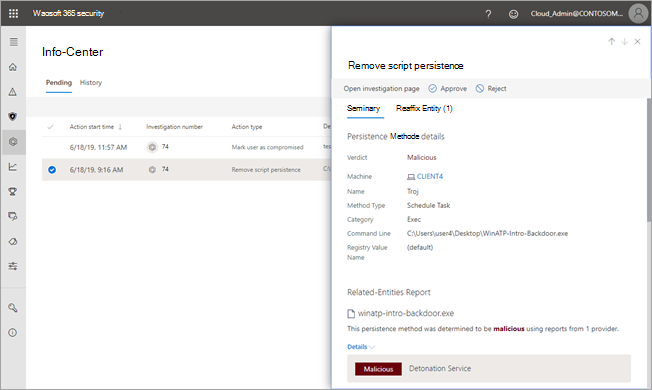
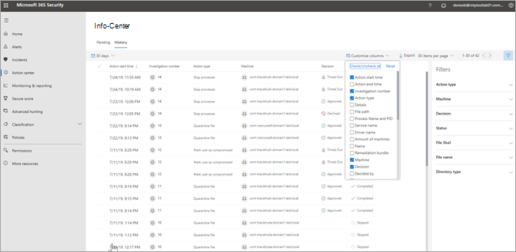

# Das Info-CenterThe Action center

**Gilt für:****Applies to:**
- Microsoft Threat ProtectionMicrosoft Threat Protection

Verwenden Sie das Info-Center, um die Ergebnisse aktueller und früherer Untersuchungen auf den Geräten und in den Postfächern Ihrer Organisation anzuzeigen.Use the Action center to see the results of current and past investigations across your organization's devices and mailboxes. Je nach Art der Bedrohung und dem daraus resultierenden Urteil werden [Korrekturaktionen](https://docs.microsoft.com/microsoft-365/security/mtp/mtp-remediation-actions) automatisch oder nach Genehmigung durch das Sicherheits Betriebsteam Ihrer Organisation durchgeführt.Depending on the type of threat and resulting verdict, [remediation actions](https://docs.microsoft.com/microsoft-365/security/mtp/mtp-remediation-actions) occur automatically or upon approval by your organization's security operations team. Alle Wartungsaktionen – unabhängig davon, ob eine Genehmigung aussteht oder diese bereits genehmigt wurden – werden im Info-Center zusammengefasst.All remediation actions, whether they are pending approval or were already approved, are consolidated in the Action center. 

## Eine einzige OberflächeA "single pane of glass" experience

Das Info-Center bietet eine einzige Oberfläche für folgende Aufgaben:The Action center provides a "single pane of glass" experience for tasks, such as:
- Genehmigen ausstehender WartungsaktionenApproving pending remediation actions;
- Anzeigen eines Überwachungsprotokolls von bereits genehmigten Wartungsaktionen undViewing an audit log of already approved remediation actions; and
- Überprüfen abgeschlossener WartungsaktionenReviewing completed remediation actions.

Ihr Sicherheitsteam kann effektiver und effizienter arbeiten, da das Info-Center eine umfassende Übersicht über Microsoft Threat Protection bei der Arbeit bietet.Your security operations team can operate more effectively and efficiently, because the Action center provides a comprehensive view of Microsoft Threat Protection at work.

## Aufrufen des Info-CentersGo to the Action center

1. Gehen Sie zu [https://security.microsoft.com](https://security.microsoft.com), und melden Sie sich an.Go to [https://security.microsoft.com](https://security.microsoft.com) and sign in. 

2. Wählen Sie im Navigationsbereich **Info-Center** aus.In the navigation pane, choose **Action center**. 

3. Im Wartungscenter werden zwei Registerkarten angezeigt: **Ausstehend** und **Verlauf**.In the Action center, you'll see two tabs: **Pending** and **History**.

    - Auf der Registerkarte **Ausstehend** werden Untersuchungen aufgeführt, die von einer Person in Ihrem Sicherheitsteam überprüft und genehmigt werden müssen.The **Pending** tab lists investigations that require review and approval by someone in your security operations team to continue. Überprüfen Sie alle ausstehenden Elemente, die hier angezeigt werden, und ergreifen Sie entsprechende Maßnahmen.Make sure to review and take action on pending items you see here.

    - Auf der Registerkarte **Verlauf** werden frühere Untersuchungen und Wartungsaktionen aufgeführt, die automatisch ausgeführt wurden.The **History** tab lists past investigations and remediation actions that were taken automatically. Sie können Daten für den vergangenen Tag, die letzte Woche, den letzten Monat oder die letzten sechs Monate anzeigen.You can view data for the past day, week, month, or six months.

4. Wenn nur bestimmte Spalten angezeigt werden sollen, wählen Sie **Spalten anpassen** aus.To show only the columns you want to see, select **Customize columns**. 

5. Wählen Sie ein Element in der Liste aus, um weitere Details zu einer Untersuchung anzuzeigen.Select an item in the list to view more details about an investigation. Die Untersuchungsdetailansicht wird geöffnet.The investigation details view opens. 

    - Wenn sich die Untersuchung auf e-Mail-Inhalte bezieht (beispielsweise die Entität ist ein Postfach), werden Ermittlungs Details im Security & Compliance Center ( [https://protection.office.com/threatinvestigation](https://protection.office.com/threatinvestigation) ) geöffnet.If the investigation pertains to email content (such as, the entity is a mailbox), investigation details open in the Security & Compliance Center ([https://protection.office.com/threatinvestigation](https://protection.office.com/threatinvestigation)). 

    - Wenn es bei der Untersuchung um ein Gerät geht, werden die Untersuchungsdetails im Security Center ([https://security.microsoft.com](https://security.microsoft.com)) geöffnet.If the investigation involves a device, investigation details open in the security center ([https://security.microsoft.com](https://security.microsoft.com)). 

> [!TIP]
> Wenn Sie glauben, dass durch automatisierte Ermittlungs-und Antwortfunktionen in Microsoft Threat Protection etwas übersehen oder fälschlicherweise erkannt wurde, lassen Sie es uns wissen!If you think something was missed or wrongly detected by automated investigation and response features in Microsoft Threat Protection, let us know! Weitere Informationen finden Sie unter [How to Report false positives/negatives in Automated Investigation and Response (Air) Funktionen in Microsoft Threat Protection](mtp-autoir-report-false-positives-negatives.md).See [How to report false positives/negatives in automated investigation and response (AIR) capabilities in Microsoft Threat Protection](mtp-autoir-report-false-positives-negatives.md).

## Verfügbare AktionenAvailable actions

Wenn Korrekturaktionen ausgeführt werden, werden Sie auf der Registerkarte Verlauf im Wartungscenter aufgeführt.As remediation actions are taken, they're listed on the History tab in the Action center. Solche Aktionen umfassen Folgendes:Such actions include the following:

- Ermittlungs Paket sammelnCollect investigation package 
- Gerät isolieren (diese Aktion kann rückgängig gemacht werden)Isolate device (this action can be undone) 
- Extern-ComputerOffboard machine 
- Freigabecode AusführungRelease code execution 
- Freigabe aus QuarantäneRelease from quarantine 
- Anforderungs BeispielRequest sample 
- Einschränken der Codeausführung (diese Aktion kann rückgängig gemacht werden)Restrict code execution (this action can be undone) 
- Ausführen des Antivirus-ScansRun antivirus scan 
- Beenden und isolierenStop and quarantine 

## Erforderliche Berechtigungen für Info-Center-AufgabenRequired permissions for Action center tasks

Um ausstehende Aktionen im Info-Center zu genehmigen oder abzulehnen, müssen Sie über die Berechtigungen verfügen, die in der folgenden Tabelle aufgeführt sind:To approve or reject pending actions in the Action center, you must have permissions assigned as listed in the following table:

|WartungsaktionRemediation action |Erforderliche Rollen und BerechtigungenRequired roles and permissions |
|--|----|
|Microsoft Defender ATP-Wartung (Geräte)Microsoft Defender ATP remediation (devices) |Sicherheitsadministratorrolle in Azure Active Directory ([https://portal.azure.com](https://portal.azure.com)) oder im Microsoft 365 Admin Center ([https://admin.microsoft.com](https://admin.microsoft.com))Security Administrator role assigned in either Azure Active Directory ([https://portal.azure.com](https://portal.azure.com)) or the Microsoft 365 admin center ([https://admin.microsoft.com](https://admin.microsoft.com)) --- oder ------ or --- Rolle Aktive Wartungsaktionen in Microsoft Defender ATPActive remediation actions role assigned in Microsoft Defender ATP     Weitere Informationen hierzu finden Sie in den folgenden Ressourcen:To learn more, see the following resources:  - [Administratorrollenberechtigungen in Azure Active Directory](https://docs.microsoft.com/azure/active-directory/users-groups-roles/directory-assign-admin-roles)- [Administrator role permissions in Azure Active Directory](https://docs.microsoft.com/azure/active-directory/users-groups-roles/directory-assign-admin-roles) - [Erstellen und Verwalten von Rollen für die rollenbasierte Zugriffssteuerung (Microsoft Defender ATP)](https://docs.microsoft.com/windows/security/threat-protection/microsoft-defender-atp/user-roles)- [Create and manage roles for role-based access control (Microsoft Defender ATP)](https://docs.microsoft.com/windows/security/threat-protection/microsoft-defender-atp/user-roles)  |
|Office 365 ATP-Wartung (Office-Inhalte und E-Mail)Office 365 ATP remediation (Office content and email)  |Sicherheitsadministratorrolle in Azure Active Directory ([https://portal.azure.com](https://portal.azure.com)) oder im Microsoft 365 Admin Center ([https://admin.microsoft.com](https://admin.microsoft.com))Security Administrator role assigned in either Azure Active Directory ([https://portal.azure.com](https://portal.azure.com)) or the Microsoft 365 admin center ([https://admin.microsoft.com](https://admin.microsoft.com)) --- und ------ and ---  Dem Security & Compliance Center zugewiesene Rolle "Search and Purge" ( [https://protection.office.com](https://protection.office.com) )Search and Purge role assigned the Security & Compliance Center ([https://protection.office.com](https://protection.office.com))   **Wichtig**: Wenn Sie die Sicherheits Administrator Rolle nur im Sicherheits & Compliance Center zugewiesen haben, können Sie nicht auf das Action Center oder die Microsoft Threat Protection-Funktionen zugreifen.**IMPORTANT**: If you have the Security Administrator role assigned only in the Security & Compliance Center, you will not be able to access the Action center or Microsoft Threat Protection capabilities. Ihnen muss die Sicherheitsadministratorrolle in Azure Active Directory oder im Microsoft 365 Admin Center zugewiesen sein.You must have the Security Administrator role assigned in Azure Active Directory or the Microsoft 365 admin center.   Weitere Informationen hierzu finden Sie in den folgenden Ressourcen:To learn more, see the following resources:  - [Administratorrollenberechtigungen in Azure Active Directory](https://docs.microsoft.com/azure/active-directory/users-groups-roles/directory-assign-admin-roles)- [Administrator role permissions in Azure Active Directory](https://docs.microsoft.com/azure/active-directory/users-groups-roles/directory-assign-admin-roles) - [Berechtigungen im Security & Compliance Center](https://docs.microsoft.com/microsoft-365/security/office-365-security/permissions-in-the-security-and-compliance-center)- [Permissions in the Security & Compliance Center](https://docs.microsoft.com/microsoft-365/security/office-365-security/permissions-in-the-security-and-compliance-center) |

> [!NOTE]
> Benutzer, denen in Azure Active Directory die Rolle Globaler Administrator zugewiesen ist, können alle ausstehenden Aktionen im Info-Center genehmigen oder ablehnen.Users who have the Global Administrator role assigned in Azure Active Directory can approve or reject any pending action in the Action center. Als bewährte Methode sollte Ihre Organisation jedoch die Anzahl der Personen einschränken, denen die Rolle des globalen Administrators zugewiesen ist.However, as a best practice, your organization should limit the number of people who have the Global Administrator role assigned. Es wird empfohlen, die oben aufgeführten Rollen Sicherheitsadministrator, Aktive Wartungsaktionen und Suchen und Löschen für Info-Center-Berechtigungen zu verwenden.We recommend using the Security Administrator, Active remediation actions, and Search and Purge roles listed above for Action center permissions.

## Nächste SchritteNext steps 

- [Weitere Informationen zu Vorfällen in Microsoft Threat ProtectionLearn more about incidents in Microsoft Threat Protection](incidents-overview.md)

- [Anzeigen der Ergebnisse einer automatischen UntersuchungView the results of an automated investigation](mtp-autoir-results.md)

- [Weitere Informationen zur Suche in Microsoft Threat ProtectionLearn about hunting in Microsoft Threat Protection](advanced-hunting-overview.md)

