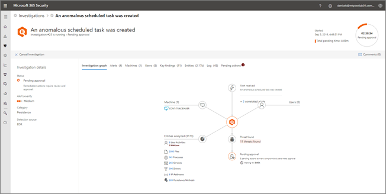

# Genehmigen oder Ablehnen ausstehender Aktionen nach automatisierten UntersuchungenApprove or reject pending actions from automated investigations

**Gilt für:****Applies to:**
- Microsoft Threat ProtectionMicrosoft Threat Protection

[!INCLUDE [Prerelease information](../includes/prerelease.md)]

Wenn eine automatisierte Untersuchung ausgeführt wird, kann dies zu einer oder mehreren empfohlenen [Abhilfemaßnahmen](mtp-action-center.md#remediation-actions) führen, für die eine Genehmigung erforderlich ist.When an automated investigation runs, it can result in one or more [remediation actions](mtp-action-center.md#remediation-actions) that require approval to proceed. So kann beispielsweise ein Cluster von E-Mail-Nachrichten gelöscht oder eine in Quarantäne befindliche Datei entfernt werden müssen.For example, a cluster of email messages might need to be deleted, or a quarantined file might need to be removed. Es ist wichtig, ausstehende Aktionen so bald wie möglich zu genehmigen (oder abzulehnen), damit Ihre automatisierten Untersuchungen zeitnah fortgesetzt und abgeschlossen werden können.It's important to approve (or reject) pending actions as soon as possible so that your automated investigations can proceed and complete in a timely manner. 

> [!TIP]
> Wenn Sie glauben, dass durch automatisierte Ermittlungs-und Antwortfunktionen in Microsoft Threat Protection etwas übersehen oder fälschlicherweise erkannt wurde, lassen Sie es uns wissen!If you think something was missed or wrongly detected by automated investigation and response features in Microsoft Threat Protection, let us know! Weitere Informationen finden Sie unter [How to Report false positives/negatives in Automated Investigation and Response (Air) Funktionen in Microsoft Threat Protection](mtp-autoir-report-false-positives-negatives.md).See [How to report false positives/negatives in automated investigation and response (AIR) capabilities in Microsoft Threat Protection](mtp-autoir-report-false-positives-negatives.md).

Zur Überprüfung und Genehmigung ausstehender Aktionen können Sie eine der folgenden Methoden anwenden:Pending actions can be reviewed and approved by using one of several methods:
- [Verwenden des Info-CentersUse the Action center](#review-a-pending-action-in-the-action-center)
- [Verwenden der UntersuchungsdetailansichtUse the investigation details view](#review-a-pending-action-in-the-investigation-details-view)

> [!NOTE]
> Sie müssen über [geeignete Berechtigungen verfügen](mtp-action-center.md#required-permissions-for-action-center-tasks), um Abhilfemaßnahmen genehmigen oder ablehnen zu können.You must have [appropriate permissions](mtp-action-center.md#required-permissions-for-action-center-tasks) to approve or reject remediation actions.

## Überprüfen einer ausstehenden Aktion im Info-CenterReview a pending action in the Action center

1. Gehen Sie zu [https://security.microsoft.com](https://security.microsoft.com), und melden Sie sich an.Go to [https://security.microsoft.com](https://security.microsoft.com) and sign in. 

2. Wählen Sie im Navigationsbereich **Info-Center** aus.In the navigation pane, choose **Action center**. 

3. Wählen Sie im Info-Center auf der Registerkarte **Ausstehend** ein Element in der Liste aus.In the Action Center, on the **Pending** tab, select an item in the list. 

    - Wenn Sie ein Element in der Spalte **Nummer der Untersuchung** auswählen, wird die Seite mit den Untersuchungsdetails geöffnet.If you select an item in the **Investigation number** column, the investigation details page opens. Dort können Sie die Ergebnisse der Untersuchung anzeigen und dann die empfohlenen Aktionen genehmigen oder ablehnen.There, you can view the results of the investigation, and then either approve or reject the recommended action.
 
    - Wenn Sie eine Zeile in der Liste auswählen, wird ein Flyout geöffnet, in dem Informationen zu dem betreffenden Element angezeigt werden.If you select a row in the list, a flyout opens, where you can view information about that item.   Verwenden Sie die Links, um eine zugeordnete Warnung oder eine Untersuchung anzuzeigen, und genehmigen Sie die jeweilige Aktion oder lehnen Sie diese ab.Use the links to view an associated alert or an investigation, and approve or reject the action.

## Überprüfen einer ausstehenden Aktion in der UntersuchungsdetailansichtReview a pending action in the investigation details view

1. Wählen Sie auf der Seite [Untersuchungsdetails](mtp-autoir-results.md) die Option **Ausstehende Aktionen** (oder **Aktionen**) aus. Hier sind die Elemente aufgelistet, für die eine Genehmigung aussteht.On an [investigation details](mtp-autoir-results.md) page, select the **Pending actions** (or **Actions**) tab. Items that are pending approval are listed here.

2. Wählen Sie ein Element in der Liste aus, und wählen Sie dann **Genehmigen** oder **Ablehnen**aus.Select an item in the list, and then choose **Approve** or **Reject**.

## Nächste SchritteNext steps

- Erfahren Sie mehr über das [Info-Center](mtp-action-center.md).[Learn more about the Action center](mtp-action-center.md)
- Erfahren Sie mehr über [Vorfälle](incidents-overview.md)[Learn more about incidents](incidents-overview.md)
- Erfahren Sie mehr zum Thema [Suche](advanced-hunting-overview.md)[Learn about hunting](advanced-hunting-overview.md)
