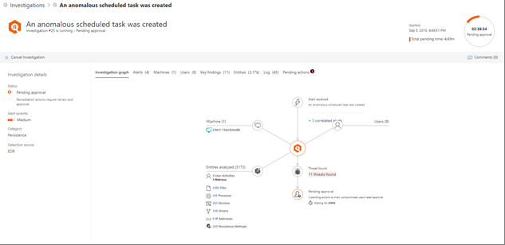

# Genehmigen oder Ablehnen ausstehender Aktionen nach einer automatischen UntersuchungApprove or reject pending actions following an automated investigation

[!INCLUDE [Microsoft 365 Defender rebranding](../includes/microsoft-defender.md)]

**Gilt für:****Applies to:**
- Microsoft 365 DefenderMicrosoft 365 Defender

Wenn eine automatisierte Untersuchung ausgeführt wird, kann dies zu einer oder mehreren empfohlenen [Abhilfemaßnahmen](https://docs.microsoft.com/microsoft-365/security/mtp/mtp-remediation-actions) führen, für die eine Genehmigung erforderlich ist.When an automated investigation runs, it can result in one or more [remediation actions](https://docs.microsoft.com/microsoft-365/security/mtp/mtp-remediation-actions) that require approval to proceed. So kann beispielsweise ein Cluster von E-Mail-Nachrichten gelöscht oder eine in Quarantäne befindliche Datei entfernt werden müssen.For example, a cluster of email messages might need to be deleted, or a quarantined file might need to be removed. Es ist wichtig, ausstehende Aktionen so bald wie möglich zu genehmigen (oder abzulehnen), damit Ihre automatisierten Untersuchungen zeitnah fortgesetzt und abgeschlossen werden können.It's important to approve (or reject) pending actions as soon as possible so that your automated investigations can proceed and complete in a timely manner. 

> [!TIP]
> Wenn Sie denken, dass etwas von automatisierten Untersuchungs- und Antwortfeatures in Microsoft 365 Defender übersehen oder falsch erkannt wurde, lassen Sie es uns wissen!If you think something was missed or wrongly detected by automated investigation and response features in Microsoft 365 Defender, let us know! Erfahren [Sie, wie Sie falsch positive/negative Ergebnisse in automatisierten Untersuchungs- und Reaktionsfunktionen (AIR) in Microsoft 365 Defender melden.](mtp-autoir-report-false-positives-negatives.md)See [How to report false positives/negatives in automated investigation and response (AIR) capabilities in Microsoft 365 Defender](mtp-autoir-report-false-positives-negatives.md).

Ausstehende Aktionen können mithilfe des  Aktionscenters oder der Ansicht "Untersuchungsdetails" überprüft [und genehmigt werden.](#review-a-pending-action-in-the-investigation-details-view)Pending actions can be reviewed and approved by using the [Action center](#review-a-pending-action-in-the-action-center) or the [investigation details view](#review-a-pending-action-in-the-investigation-details-view).

> [!NOTE]
> Sie müssen über [geeignete Berechtigungen verfügen](mtp-action-center.md#required-permissions-for-action-center-tasks), um Abhilfemaßnahmen genehmigen oder ablehnen zu können.You must have [appropriate permissions](mtp-action-center.md#required-permissions-for-action-center-tasks) to approve or reject remediation actions. Weitere Informationen finden Sie unter [Voraussetzungen für die automatisierte Untersuchung und Reaktion in Microsoft 365 Defender](mtp-configure-auto-investigation-response.md#prerequisites-for-automated-investigation-and-response-in-microsoft-365-defender).For more information, see [Prerequisites for automated investigation and response in Microsoft 365 Defender](mtp-configure-auto-investigation-response.md#prerequisites-for-automated-investigation-and-response-in-microsoft-365-defender).

## Überprüfen einer ausstehenden Aktion im Info-CenterReview a pending action in the Action center

1. Gehen Sie zu [https://security.microsoft.com](https://security.microsoft.com), und melden Sie sich an.Go to [https://security.microsoft.com](https://security.microsoft.com) and sign in. 

2. Wählen Sie im Navigationsbereich **Info-Center** aus.In the navigation pane, choose **Action center**. 

3. Wählen Sie im Info-Center auf der Registerkarte **Ausstehend** ein Element in der Liste aus.In the Action Center, on the **Pending** tab, select an item in the list. 

    - Wenn Sie ein Element in der Spalte **Nummer der Untersuchung** auswählen, wird die Seite mit den Untersuchungsdetails geöffnet.If you select an item in the **Investigation number** column, the investigation details page opens. Dort können Sie die Ergebnisse der Untersuchung anzeigen und dann die empfohlenen Aktionen genehmigen oder ablehnen.There, you can view the results of the investigation, and then either approve or reject the recommended action.
 
    - Wenn Sie eine Zeile in der Liste auswählen, wird ein Flyout geöffnet, in dem Informationen zu dem betreffenden Element angezeigt werden.If you select a row in the list, a flyout opens, where you can view information about that item.   Verwenden Sie die Links, um eine zugeordnete Warnung oder eine Untersuchung anzuzeigen, und genehmigen Sie die jeweilige Aktion oder lehnen Sie diese ab.Use the links to view an associated alert or an investigation, and approve or reject the action.

## Überprüfen einer ausstehenden Aktion in der UntersuchungsdetailansichtReview a pending action in the investigation details view

1. Wählen Sie auf der Seite [Untersuchungsdetails](mtp-autoir-results.md) die Option **Ausstehende Aktionen** (oder **Aktionen**) aus. Hier sind die Elemente aufgelistet, für die eine Genehmigung aussteht.On an [investigation details](mtp-autoir-results.md) page, select the **Pending actions** (or **Actions**) tab. Items that are pending approval are listed here.

2. Wählen Sie ein Element in der Liste aus, und wählen Sie dann **Genehmigen** oder **Ablehnen** aus.Select an item in the list, and then choose **Approve** or **Reject**.

## Abgeschlossene Aktionen rückgängig machenUndo completed actions

Wenn Sie festgestellt haben, dass ein Gerät oder eine Datei keine Bedrohung darstellt, können Sie die ergriffenen Abhilfemaßnahmen rückgängig machen, unabhängig davon, ob diese Aktionen automatisch oder manuell ausgeführt wurden.If you’ve determined that a device or a file is not a threat, you can undo remediation actions that were taken, whether those actions were taken automatically or manually. Im Aktionscenter können Sie auf **der** Registerkarte "Verlauf" eine der folgenden Aktionen rückgängig machen:In the Action center, on the **History** tab, you can undo any of the following actions:  

| AktionsquelleAction source | Unterstützte AktionenSupported Actions |
|:---|:---|
| – Automatisierte Untersuchung- Automated investigation  – Microsoft Defender Antivirus- Microsoft Defender Antivirus  – Manuelle Reaktionsaktionen- Manual response actions | - Gerät isolieren- Isolate device  – Einschränken der Codeausführung- Restrict code execution  – Isolieren einer Datei- Quarantine a file  – Entfernen eines Registrierungsschlüssels- Remove a registry key  – Beenden eines Diensts- Stop a service  – Deaktivieren eines Treibers- Disable a driver  – Entfernen eines geplanten Vorgangs- Remove a scheduled task |

### So machen Sie eine Wartungsaktion rückgängigTo undo a remediation action

1. Wechseln Sie zum Aktionscenter ( [https://security.microsoft.com/action-center](https://security.microsoft.com/action-center) ), und melden Sie sich an.Go to the Action center ([https://security.microsoft.com/action-center](https://security.microsoft.com/action-center)) and sign in.

2. Wählen Sie **auf der** Registerkarte "Verlauf" eine Aktion aus, die Rückgängig gemacht werden soll.On the **History** tab, select an action that you want to undo.

3. Wählen Sie im Bereich auf der rechten Seite des Bildschirms **"Rückgängig" aus.**In the pane on the right side of the screen, select **Undo**.

### So entfernen Sie eine Datei auf mehreren Geräten aus der QuarantäneTo remove a file from quarantine across multiple devices 

1. Wechseln Sie zum Aktionscenter ( [https://security.microsoft.com/action-center](https://security.microsoft.com/action-center) ), und melden Sie sich an.Go to the Action center ([https://security.microsoft.com/action-center](https://security.microsoft.com/action-center)) and sign in.

2. Wählen Sie **auf der Registerkarte** "Verlauf" eine Datei mit dem Aktionstyp **"Quarantäne" aus.**On the **History** tab, select a file that has the Action type **Quarantine file**.

3. Wählen Sie im Bereich auf der rechten Seite des Bildschirms **"Auf X** weitere Instanzen dieser Datei anwenden" und dann **"Rückgängig" aus.**In the pane on the right side of the screen, select **Apply to X more instances of this file**, and then select **Undo**.

## Nächste SchritteNext steps

- [Anzeigen der Details und Ergebnisse einer automatischen UntersuchungView the details and results of an automated investigation](mtp-autoir-results.md)
- [Behandeln falsch positiver/negativer Ergebnisse in automatisierten Untersuchungs- und ReaktionsfunktionenHandle false positives/negatives in automated investigation and response capabilities](mtp-autoir-report-false-positives-negatives.md)
