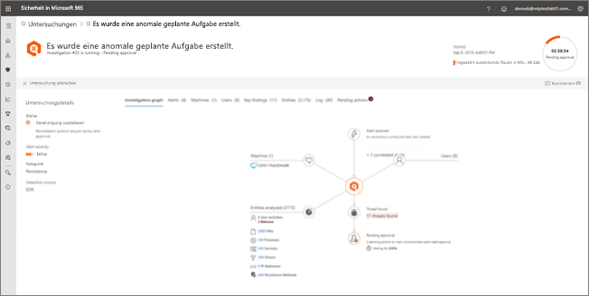
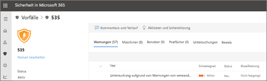

# Anzeigen der Details und Ergebnisse einer automatischen Untersuchung

**Gilt für:**
- Microsoft Threat Protection

[!INCLUDE [Prerelease information](../includes/prerelease.md)]

Wenn eine automatische Untersuchung in Microsoft Threat Protection stattfindet, stehen während und nach der automatischen Ermittlung Details zu dieser Untersuchung zur Verfügung. Wenn Sie über die [erforderlichen Berechtigungen](mtp-action-center.md#required-permissions-for-action-center-tasks) verfügen, können Sie diese Details in einer unter Anzeige mit Untersuchungsdetails anzeigen. Die Anzeige mit Untersuchungsdetails bieten Ihnen den aktuellen Status sowie die Möglichkeit, ausstehende Aktionen zu genehmigen. 

## Öffnen der Anzeige mit Untersuchungsdetails

Mit einer der folgenden Methoden können Sie die Anzeige mit Untersuchungsdetails öffnen:
- [Auswählen eines Elements im Info-Center](#select-an-item-in-the-action-center)
- [Auswählen einer Untersuchung von einer Vorfalldetailsseite](#open-an-investigation-from-an-incident-details-page)

### Auswählen eines Elements im Info-Center

Verwenden Sie das Info-Center, um Aktionen anzuzeigen, deren Genehmigung aussteht (auf der Registerkarte **Ausstehend**) oder die bereits genehmigt wurden (auf der Registerkarte **Verlauf**). 

1. Gehen Sie zu [https://security.microsoft.com](https://security.microsoft.com), und melden Sie sich an. 

2. Wählen Sie im Navigationsbereich **Info-Center** aus. 

3. Wählen Sie auf der Registerkarte **Ausstehend** oder **Verlauf** ein Element aus. Wenn Sie über die [erforderlichen Berechtigungen](mtp-action-center.md#required-permissions-for-action-center-tasks) verfügen, können Sie ausstehende Aktionen genehmigen (oder ablehnen).

### Öffnen einer Untersuchung von einer Vorfalldetailsseite

Verwenden Sie die Seite „Vorfalldetails“, um detaillierte Informationen zu einem Vorfall anzuzeigen, einschließlich ausgelöster Warnungen und Informationen zu betroffenen Geräten, Benutzerkonten oder Postfächern.

1. Gehen Sie zu [https://security.microsoft.com](https://security.microsoft.com), und melden Sie sich an. 

2. Wählen Sie im Navigationsbereich **Vorfälle** aus. 

3. Wählen Sie ein Element in der Liste aus, um die Vorfalldetailsseite zu öffnen. 

4. Wählen Sie auf der Registerkarte **Untersuchung** eine Untersuchung in der Liste aus.

## Untersuchungsdetails

Verwenden Sie die Anzeige mit Untersuchungsdetails, um vergangene, aktuelle und ausstehende Aktivitäten im Zusammenhang mit einer Untersuchung anzuzeigen. Die Anzeige mit Untersuchungsdetails sieht wie in der folgenden Abbildung aus:

In der Anzeige mit Untersuchungsdetails können Sie Informationen im **Untersuchungsdiagramm** sowie auf den Registerkarten **Benachrichtigungen**, **Geräte**, **Identitäten**, **Wichtige Erkenntnisse**, **Entitäten**, **Protokoll** und **Ausstehende Aktionen** anzeigen, die in der folgenden Tabelle beschrieben sind.

|Registerkarte    |Beschreibung |
|--------|--------|
|Untersuchungsdiagramm    |Bietet eine visuelle Darstellung der Untersuchung. Stellt Entitäten dar und listet gefundene Bedrohungen zusammen mit Warnungen und Informationen dazu auf, ob Aktionen genehmigt werden müssen. Sie können auf ein Element im Diagramm klicken, um weitere Details anzuzeigen. Wenn Sie beispielsweise auf das Symbol **Bedrohungen gefunden** klicken, gelangen Sie zur Registerkarte **Wichtige Erkenntnisse**. |
|Warnungen |Listet die mit der Untersuchung verbundenen Warnungen auf. Warnungen können aus den Features zum Schutz vor Bedrohungen auf dem Computer eines Benutzers, aus Office-Apps, aus Cloud App Security und aus anderen Features von Microsoft 365 Threat Protection stammen.|
|Geräte|Listet die in die Untersuchung einbezogenen Computer zusammen mit der Korrekturstufe auf.|
|Wichtige Erkenntnisse   |Listet die Ergebnisse der Untersuchung sowie den Status und die ausgeführten oder ausstehenden Aktionen auf. Sie können ausstehende Aktionen für Geräte und Identitäten auf dieser Registerkarte genehmigen.|
|Entitäten   |Listet Benutzeraktivitäten, Dateien, Prozesse, Dienste, Treiber, IP-Adressen und Persistenzverfahren im Zusammenhang mit der Untersuchung zusammen mit dem Status und ausgeführten Aktionen auf.|
|Protokoll    |Bietet eine detaillierte Darstellung aller während der Untersuchung ausgeführten Schritte zusammen mit dem Status.|
|Ausstehende Aktionen    |Listet Elemente auf, für die eine Genehmigung erforderlich, um fortzufahren.|

## Korrekturaktionen nach einer automatischen Untersuchung

Wenn eine automatische Untersuchung abgeschlossen ist, wird für alle beteiligten Beweise eine Erkenntnis ermittelt, und es werden Korrekturaktionen identifiziert. In einigen Fällen werden Korrekturaktionen automatisch ausgeführt. In anderen Fällen müssen Korrekturaktionen genehmigt werden. In der folgenden Tabelle sind mögliche Urteile und Ergebnisse aufgelistet:

|Erkenntnis    |Bereich   |Ergebnisse|
|------|------|------|
|Bösartig  |Geräte (Endpunkte)    |Korrekturaktionen werden automatisch ausgeführt.|
|Bösartig  |E-Mail-Inhalt (URLs oder Anlagen) | Empfohlene Korrekturaktionen müssen genehmigt werden.|
|Verdächtig |Geräte oder E-Mail-Inhalte |Empfohlene Korrekturaktionen müssen genehmigt werden.|
|Bereinigen  |Geräte oder E-Mail-Inhalte   |Es sind keine Korrekturaktionen erforderlich.|

[Überprüfen einer ausstehenden Aktion im Info-Center](mtp-autoir-actions.md#review-a-pending-action-in-the-action-center)

> [!TIP]
> Wenn Sie glauben, dass durch automatisierte Ermittlungs-und Antwortfunktionen in Microsoft Threat Protection etwas übersehen oder fälschlicherweise erkannt wurde, lassen Sie es uns wissen! Weitere Informationen finden Sie unter [How to Report false positives/negatives in Automated Investigation and Response (Air) Funktionen in Microsoft Threat Protection](mtp-autoir-report-false-positives-negatives.md).

## Nächste Schritte

- [Abrufen einer Übersicht über die Berechtigungen im Info-Center](mtp-action-center.md#required-permissions-for-action-center-tasks)
- [Genehmigen oder Ablehnen von Aktionen im Zusammenhang mit der automatischen Untersuchung und Reaktion](mtp-autoir-actions.md)

