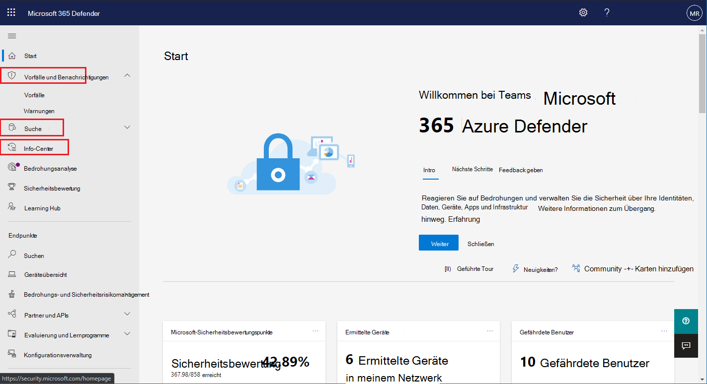

# Aktivieren von Microsoft 365 Defender

[!INCLUDE [Microsoft 365 Defender rebranding](../includes/microsoft-defender.md)]

**Gilt für:**
- Microsoft 365 Defender

[Microsoft 365 Defender](microsoft-threat-protection.md) vereinigt ihren Vorfall Antwortprozess durch die Integration wichtiger Funktionen in Microsoft Defender für Endpoint, Microsoft Defender für Office 365, Microsoft Cloud App Security und Microsoft Defender for Identity. Diese vereinheitlichte Lösung bietet zusätzliche leistungsfähige Funktionen, auf die Sie im Microsoft 365 Security Center zugreifen können.

Microsoft 365 Defender aktiviert automatisch, wenn berechtigte Kunden mit den erforderlichen Berechtigungen Microsoft 365 Security Center besuchen. Lesen Sie diesen Artikel, um die verschiedenen Voraussetzungen und die Vorgehensweise von Microsoft 365 Defender zu verstehen.

## Überprüfen der Lizenz Berechtigung und der erforderlichen Berechtigungen
Eine Lizenz für ein Microsoft 365-Sicherheitsprodukt berechtigt Sie im Allgemeinen zur Verwendung von Microsoft 365 Defender im Microsoft 365 Security Center ohne zusätzliche Lizenzierungskosten. Es wird empfohlen, eine Sicherheitslizenz für Microsoft 365 E5, E5, A5 oder A5 oder eine gültige Kombination von Lizenzen zu erhalten, die Zugriff auf alle unterstützten Dienste bereitstellt.

Ausführliche Lizenzierungsinformationen finden [Sie in den Lizenzierungsanforderungen](prerequisites.md#licensing-requirements).

### Überprüfen der Rolle
Sie müssen ein **globaler Administrator** oder ein **Sicherheitsadministrator** in Azure Active Directory sein, um Microsoft 365 Defender zu aktivieren. [Anzeigen ihrer Rollen in Azure AD](https://docs.microsoft.com//azure/active-directory/users-groups-roles/directory-manage-roles-portal)

## Unterstützte Dienste
Microsoft 365 Defender aggregiert Daten aus den verschiedenen unterstützten Diensten, die Sie bereits bereitgestellt haben. Die Daten werden zentral verarbeitet und gespeichert, um neue Erkenntnisse zu identifizieren und um zentralisierte Antwort Workflows zu ermöglichen. Dies geschieht ohne Beeinträchtigung vorhandener Bereitstellungen, Einstellungen oder Daten, die den integrierten Diensten zugeordnet sind.

Um den besten Schutz zu erhalten und Microsoft 365 Defender zu optimieren, wird empfohlen, alle anwendbaren unterstützten Dienste in Ihrem Netzwerk bereitzustellen. Weitere Informationen finden [Sie unter Deploying supported Services](deploy-supported-services.md).

## Vor dem Starten des Diensts
Bevor Sie den Dienst aktivieren, zeigt das Microsoft 365 Security Center ( [Security.Microsoft.com](https://security.microsoft.com)) die Seite Microsoft 365 Defender-Einstellungen an, wenn Sie im Navigationsbereich **Vorfälle** , das **Aktionscenter** oder die **Suche** auswählen. Diese Navigationselemente werden nicht angezeigt, wenn Sie nicht berechtigt sind, Microsoft 365 Defender zu verwenden.

 *Microsoft 365 Defender-Einstellungen im Microsoft 365 Security Center* aktiviert wurde

## Starten des Diensts
Wählen Sie zum Aktivieren von Microsoft 365 Defender einfach **Microsoft 365 Defender aktivieren** aus, und wenden Sie die Änderung an. Sie können auf diese Option auch zugreifen, indem Sie im Navigationsbereich **Einstellungen** ( [Security.Microsoft.com/Settings](https://security.microsoft.com/settings)) auswählen und dann **Microsoft 365 Defender** auswählen.

>[!NOTE]
>Wenn im Navigationsbereich keine **Einstellungen** angezeigt werden oder Sie nicht auf die Seite zugreifen können, überprüfen Sie Ihre Berechtigungen und Lizenzen.

### Rechenzentrumsstandort
Microsoft 365 Defender speichert und verarbeitet Daten am [gleichen Speicherort, der von Microsoft Defender für Endpoint verwendet](https://docs.microsoft.com/windows/security/threat-protection/microsoft-defender-atp/data-storage-privacy)wird. Wenn Sie nicht über Microsoft Defender für Endpoint verfügen, wird automatisch ein neuer datencenterstandort basierend auf dem Speicherort der aktiven Microsoft 365-Sicherheitsdienste ausgewählt. Der ausgewählte Speicherort des Rechenzentrums wird auf dem Bildschirm angezeigt. 

Wählen Sie **need help aus?** im Microsoft 365 Security Center können Sie sich an den Microsoft-Support wenden, um Microsoft 365 Defender in einem anderen rechenzentrumsstandort zu kontaktieren. 

>[!NOTE]
>Microsoft Defender für Endpoint stellt automatisch Vorkehrungen in den Rechenzentren in der Europäischen Union (EU) bereit, wenn es über Azure Defender * aktiviert wird. Microsoft 365 Defender wird automatisch im gleichen EU-Rechenzentrum für Kunden bereitgestellt, die auf diese Weise einen Defender für Endpoint bereitgestellt haben. 

### Vergewissern Sie sich, dass der Dienst aktiviert ist
Sobald der Dienst bereitgestellt ist, wird Folgendes hinzugefügt:

- [Verwalten von Vorfällen](incidents-overview.md)
- Ein Info-Center für die Verwaltung [automatisierter Untersuchungen und Reaktionen](mtp-autoir.md)
- [Erweiterte Jagd](advanced-hunting-overview.md) Funktionen

 *Microsoft 365 Security Center mit Incidents Management und anderen Microsoft 365 Defender-Funktionen*

### Aufrufen von Microsoft Defender für Identitätsdaten
Um Microsoft Defender für Identitätsdaten mit Microsoft 365 Defender freizugeben, stellen Sie sicher, dass Microsoft Cloud App Security und Microsoft Defender for Identity Integration aktiviert ist. Erfahren Sie mehr über [diese Integration](https://docs.microsoft.com/cloud-app-security/aatp-integration)

## Microsoft 365 Defender deaktivieren
Um die Verwendung von Microsoft 365 Defender zu beenden, wechseln Sie zu **Einstellungen**  >  **Microsoft 365 Defender**  >  **Opt-in/Opt-out** im Microsoft 365 Security Center. Deaktivieren Sie **Microsoft 365 Defender aktivieren** , und wenden Sie die Änderungen an.

Die entsprechenden Features werden aus dem Microsoft 365 Security Center entfernt.

## Unterstützung erhalten

Wenn Sie Antworten auf die am häufigsten gestellten Fragen zum Aktivieren von Microsoft 365 Defender erhalten möchten, [Lesen Sie die FAQ](mtp-enable-faq.md).

Microsoft-Supportmitarbeiter können Ihnen helfen, den Dienst und die zugehörigen Ressourcen auf Ihrem Mandanten bereitzustellen oder zu entbinden. Um Unterstützung zu erhalten, wählen Sie **need help?** im Microsoft 365 Security Center aus. Wenn Sie sich an den Support wenden, erwähnen Sie Microsoft 365 Defender.

## Verwandte Themen

- [Häufig gestellte Fragen](mtp-enable-faq.md)
- [Lizenzierungsanforderungen und andere Voraussetzungen](prerequisites.md)
- [Bereitstellen unterstützter Dienste](deploy-supported-services.md)
- [Microsoft 365 Defender (Übersicht)](microsoft-threat-protection.md)
- [Microsoft Defender für Endpoint (Übersicht)](https://docs.microsoft.com/windows/security/threat-protection/microsoft-defender-atp/microsoft-defender-advanced-threat-protection)
- [Verteidiger für Office 365 Übersicht](../office-365-security/office-365-atp.md)
- [Übersicht über Microsoft Cloud App Security](https://docs.microsoft.com/cloud-app-security/what-is-cloud-app-security)
- [Übersicht über Microsoft Defender for Identity](https://docs.microsoft.com/azure-advanced-threat-protection/what-is-atp)
- [Microsoft Defender für die Endpunkt Datenspeicherung](https://docs.microsoft.com/windows/security/threat-protection/microsoft-defender-atp/data-storage-privacy)
