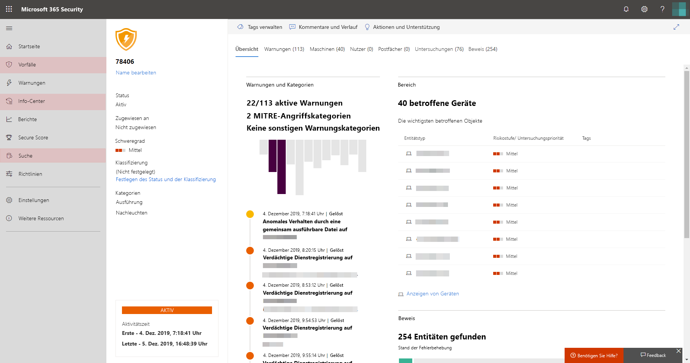

# Aktivieren von Microsoft Threat Protection

**Gilt für:**
- Microsoft Threat Protection

Microsoft Threat Protection vereinheitlicht Ihren Reaktionsprozess auf Sicherheitsvorfälle durch die Integration der wichtigsten Funktionen von Microsoft Defender Advanced Threat Protection (ATP), Office 365 ATP, Microsoft Cloud App Security und Azure ATP. Diese vereinheitlichte Lösung bietet zusätzliche leistungsfähige Funktionen, auf die Sie im Microsoft 365 Security Center zugreifen können.

Um den optimalen Schutz zu erzielen und Microsoft Threat Protection zu optimieren, wird empfohlen, alle anwendbaren unterstützten Dienste in Ihrem Netzwerk bereitzustellen. Weitere Informationen finden [Sie unter Deploying supported Services](deploy-supported-services.md).

## Überprüfen der Lizenz Berechtigung und der erforderlichen Berechtigungen
Eine Microsoft 365 E5, E5 Security, A5 oder A5-Sicherheitslizenz oder eine gültige Kombination von Lizenzen bietet Zugriff auf unterstützte Dienste und berechtigt Sie zur Verwendung von Microsoft Threat Protection im Microsoft 365 Security Center ohne zusätzliche Lizenzierungskosten.

Ausführliche Lizenzierungsinformationen finden [Sie in den Lizenzierungsanforderungen](prerequisites.md#licensing-requirements).

### Überprüfen der Rolle
Sie müssen ein **globaler Administrator** oder ein **Sicherheitsadministrator** in Azure Active Directory sein, um Microsoft Threat Protection zu aktivieren. [Anzeigen ihrer Rollen in Azure AD](https://docs.microsoft.com//azure/active-directory/users-groups-roles/directory-manage-roles-portal)

## Verwenden des Diensts – erste Schritte

Microsoft Threat Protection aggregiert Daten aus den verschiedenen integrierten Diensten. Die Daten werden zentral verarbeitet und gespeichert, um neue Erkenntnisse zu identifizieren und um zentralisierte Antwort Workflows zu ermöglichen. Dies geschieht ohne Beeinträchtigung vorhandener Bereitstellungen, Einstellungen oder Daten, die den integrierten Diensten zugeordnet sind.

Bevor Sie den Dienst aktivieren, zeigt das Microsoft 365 Security Center ([Security.Microsoft.com](https://security.microsoft.com)) die Microsoft Threat Protection-Willkommensseite an, wenn Sie **Vorfälle**, das **Aktionscenter**oder die **Suche** im Navigationsbereich auswählen. Diese Navigationsoptionen werden nicht angezeigt, wenn Sie nicht berechtigt sind, Microsoft Threat Protection zu verwenden.

auf der*Willkommensseite von Microsoft Threat Protection im Microsoft 365 Security Center* aktiviert wurde

Um Microsoft Threat Protection zu aktivieren, führen Sie den Vorgang einfach auf der Willkommensseite aus. Sie können auch Microsoft Threat Protection aktivieren, indem Sie im Navigationsbereich auf **Einstellungen** ([Security.Microsoft.com/Settings](https://security.microsoft.com/settings)) zugreifen und **Microsoft Threat Protection**auswählen.

>[!NOTE]
>Wenn im Navigationsbereich keine **Einstellungen** angezeigt werden oder Sie nicht auf die Seite zugreifen können, überprüfen Sie Ihre Berechtigungen und Lizenzen.       

### Auswählen des Datencenter Standorts
Wenn Microsoft Defender ATP für Ihre Organisation bereitgestellt wurde, werden die Daten im selben Rechenzentrumsspeicherort gespeichert und verarbeitet, den Sie für [Ihre Microsoft Defender ATP-Daten](https://docs.microsoft.com/windows/security/threat-protection/microsoft-defender-atp/data-storage-privacy) ausgewählt haben. Wenn Sie nicht über Microsoft Defender ATP verfügen, werden Sie aufgefordert, einen neuen Rechenzentrumsspeicherort speziell für Microsoft Threat Protection zu wählen. 
 
Sie müssen die Zustimmung erteilen, bevor Daten zwischen Diensten freigegeben und aggregiert werden.

### Vergewissern Sie sich, dass der Dienst aktiviert ist
Sobald der Dienst bereitgestellt ist, wird Folgendes hinzugefügt:

- [Verwalten von Vorfällen](incidents-overview.md)
- Ein Info-Center für die Verwaltung [automatisierter Untersuchungen und Reaktionen](mtp-autoir.md)
- [Erweiterte Jagd](advanced-hunting-overview.md) Funktionen

 *-Features Microsoft 365 Security Center mit Incidents Management und anderen Microsoft Threat Protection-* Funktionen

### Abrufen von Azure ATP-Daten
Stellen Sie sicher, dass Microsoft Cloud App Security und die Azure ATP-Integration aktiviert sind, um Azure ATP-Daten für Microsoft Threat Protection freizugeben. Erfahren Sie mehr über [diese Integration](https://docs.microsoft.com/cloud-app-security/aatp-integration)

## Deaktivieren von Microsoft Threat Protection
Wenn Sie Microsoft Threat Protection nicht länger verwenden möchten, wechseln Sie zu **Einstellungen** > **Microsoft Threat Protection** > **Aktivieren/Deaktivieren** im Microsoft 365 Security Center. Heben Sie die Auswahl **Microsoft Threat Protection aktivieren** auf, und speichern Sie die Änderung.

Die entsprechenden Features werden aus dem Microsoft 365 Security Center entfernt.

## Unterstützung erhalten

Microsoft-Supportmitarbeiter können Ihnen helfen, den Dienst und die zugehörigen Ressourcen auf Ihrem Mandanten bereitzustellen oder zu entbinden. Um Unterstützung zu erhalten, wählen Sie **need help?** im Microsoft 365 Security Center aus. Wenn Sie sich an den Support wenden, erwähnen Sie Microsoft Threat Protection.

## Verwandte Themen

- [Übersicht über Microsoft Threat Protection](microsoft-threat-protection.md)
- [Lizenzierungsanforderungen und andere Voraussetzungen](prerequisites.md)
- [Bereitstellen unterstützter Dienste](deploy-supported-services.md)
- [Übersicht über Microsoft Defender ATP](https://docs.microsoft.com/windows/security/threat-protection/microsoft-defender-atp/microsoft-defender-advanced-threat-protection)
- [Übersicht über Office 365 ATP](../office-365-security/office-365-atp.md)
- [Übersicht über Microsoft Cloud App Security](https://docs.microsoft.com/cloud-app-security/what-is-cloud-app-security)
- [Übersicht über Azure ATP](https://docs.microsoft.com/azure-advanced-threat-protection/what-is-atp)
- [Übersicht über Microsoft Defender ATP und Datenspeicherung](https://docs.microsoft.com/windows/security/threat-protection/microsoft-defender-atp/data-storage-privacy)
