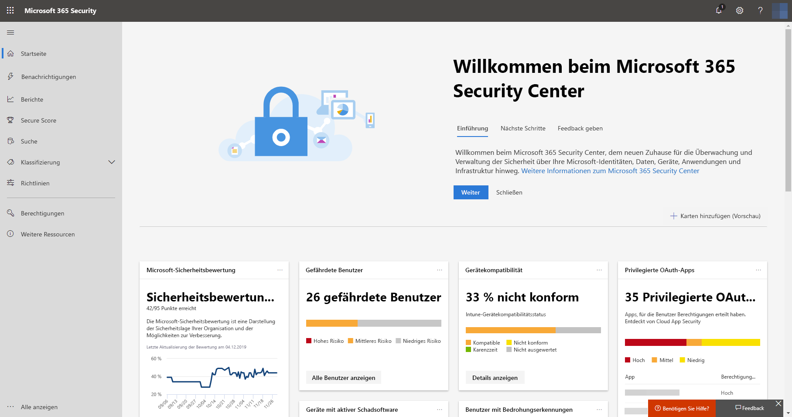
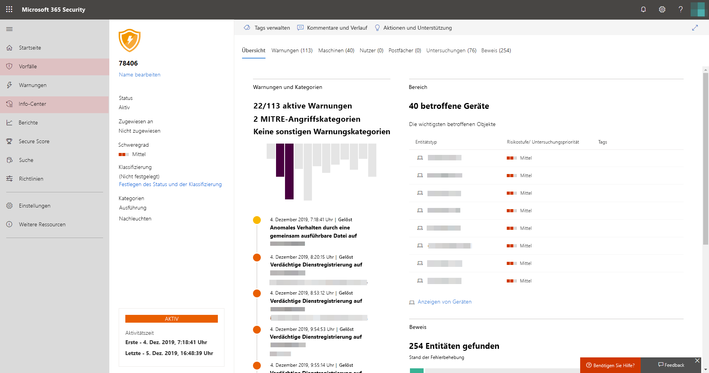

# Aktivieren von Microsoft Threat Protection

**Gilt für:**
- Microsoft Threat Protection

[!INCLUDE [Prerelease information](../includes/prerelease.md)]

Microsoft Threat Protection vereinheitlicht Ihren Reaktionsprozess auf Sicherheitsvorfälle durch die Integration der wichtigsten Funktionen von Microsoft Defender Advanced Threat Protection (ATP), Office 365 ATP, Microsoft Cloud App Security und Azure ATP. Diese vereinheitlichte Lösung bietet zusätzliche leistungsfähige Funktionen, auf die Sie im Microsoft 365 Security Center zugreifen können.

## Überprüfen der Lizenz Berechtigung und der erforderlichen Berechtigungen
Kunden, die über eine Microsoft 365 E5- oder eine entsprechende Lizenz verfügen, können Microsoft Threat Protection verwenden. Weitere Informationen finden Sie unter [Lizenzierungsanforderungen](prerequisites.md#licensing-requirements).

 Um Microsoft Threat Protection aktivieren zu können, müssen Sie ein **globaler Administrator** oder **Sicherheitsadministrator** in [Azure Active Directory](https://docs.microsoft.com/azure/active-directory/users-groups-roles/directory-assign-admin-roles#available-roles)sein.

## Verwenden des Diensts – erste Schritte
Durch die Aktivierung des Microsoft Threat Protection-Diensts werden Daten aus den verschiedenen integrierten Diensten zusammengeführt. Diese Daten werden zentral verarbeitet und gespeichert, um neue Erkenntnisse zu gewinnen und um zentralisierte Reaktionsabläufe zu ermöglichen.

Vor der Aktivierung des Dienstes werden im Microsoft 365 Security Center ([Security.Microsoft.com](https://security.microsoft.com)) die Optionen **Vorfälle** und **Info-Center** nicht im Menü angezeigt.

*Microsoft 365 Security Center mit deaktiviertem Microsoft Threat Protection*

Wenn Sie den Microsoft Threat Protection-Dienst aktivieren möchten, wechseln Sie zu **Einstellungen** > **Microsoft Threat Protection** > **Aktivieren/Deaktivieren** im Microsoft 365 Security Center.

Wenn Microsoft Defender ATP für Ihre Organisation bereitgestellt wurde, werden die Daten im selben Rechenzentrumsspeicherort gespeichert und verarbeitet, den Sie für [Ihre Microsoft Defender ATP-Daten](https://docs.microsoft.com/windows/security/threat-protection/microsoft-defender-atp/data-storage-privacy) ausgewählt haben. Wenn Sie nicht über Microsoft Defender ATP verfügen, werden Sie aufgefordert, einen neuen Rechenzentrumsspeicherort speziell für Microsoft Threat Protection zu wählen. Sie müssen die entsprechende Zustimmung geben, bevor Daten zwischen den Diensten geteilt und zusammengeführt werden.

### Vergewissern Sie sich, dass der Dienst aktiviert ist
Sobald der Dienst bereitgestellt ist, wird Folgendes hinzugefügt:

- [Verwalten von Vorfällen](incidents-overview.md)
- Ein Info-Center für die Verwaltung [automatisierter Untersuchungen und Reaktionen](mtp-autoir.md)
- [Erweiterte Suchfunktionen](advanced-hunting-overview.md) für die bestehende **Such**-Seite

*Microsoft 365 Security Center mit Funktionen für die Verwaltung von Vorfällen und anderen Microsoft Threat Protection-Funktionen*

### Abrufen von Azure ATP-Daten
Stellen Sie sicher, dass Microsoft Cloud App Security und die Azure ATP-Integration aktiviert sind, um Azure ATP-Daten für Microsoft Threat Protection freizugeben. Erfahren Sie mehr über [diese Integration](https://docs.microsoft.com/cloud-app-security/aatp-integration)

## Deaktivieren von Microsoft Threat Protection
Wenn Sie Microsoft Threat Protection nicht länger verwenden möchten, wechseln Sie zu **Einstellungen** > **Microsoft Threat Protection** > **Aktivieren/Deaktivieren** im Microsoft 365 Security Center. Heben Sie die Auswahl **Microsoft Threat Protection aktivieren** auf, und speichern Sie die Änderung.

Daten werden endgültig gelöscht, und die entsprechenden Features werden aus dem Microsoft 365 Security Center entfernt.

## Unterstützung erhalten

Microsoft-Mitarbeiter können Sie dabei unterstützen, den Dienst und die zugehörigen Ressourcen in Ihrem Mandanten bereitzustellen oder die Bereitstellung aufzuheben. Wenn Sie Hilfe benötigen, wenden Sie sich an den [Premier Support](https://go.microsoft.com/fwlink/?LinkID=733758).

## Verwandte Themen

- [Übersicht über Microsoft Threat Protection](microsoft-threat-protection.md)
- [Lizenzierungsanforderungen und andere Voraussetzungen](prerequisites.md)
- [Übersicht über Microsoft Defender ATP](https://docs.microsoft.com/windows/security/threat-protection/microsoft-defender-atp/microsoft-defender-advanced-threat-protection)
- [Übersicht über Office 365 ATP](../office-365-security/office-365-atp.md)
- [Übersicht über Microsoft Cloud App Security](https://docs.microsoft.com/cloud-app-security/what-is-cloud-app-security)
- [Übersicht über Azure ATP](https://docs.microsoft.com/azure-advanced-threat-protection/what-is-atp)
- [Übersicht über Microsoft Defender ATP und Datenspeicherung](https://docs.microsoft.com/windows/security/threat-protection/microsoft-defender-atp/data-storage-privacy)
