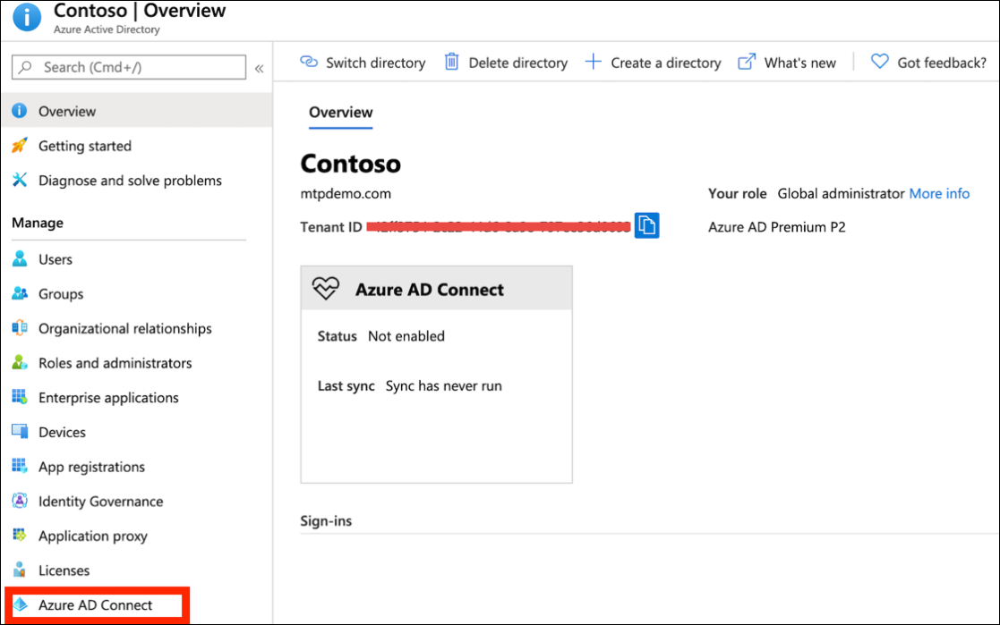

# Vorbereiten Ihrer Testlabor-oder Pilotumgebung für den Microsoft Threat Protection-TestPrepare your Microsoft Threat Protection trial lab or pilot environment

[!INCLUDE [Microsoft 365 Defender rebranding](../includes/microsoft-defender.md)]

**Gilt für:****Applies to:**
- Microsoft Threat ProtectionMicrosoft Threat Protection

Das Erstellen eines Microsoft Threat Protection-Testlabors oder einer Pilotumgebung und deren Bereitstellung ist ein dreistufiger Prozess:Creating a Microsoft Threat Protection trial lab or pilot environment and deploying it is a three-phase process:

 
<table border="0" width="100%" align="center">
  <tr style="text-align:center;">
    <td align="center" style="width:25%; border:0;" bgcolor="#d5f5e3">
      <a href= "https://docs.microsoft.com/microsoft-365/security/mtp/prepare-mtpeval"> 
        
       Phase 1: Vorbereiten </a>Phase 1: Prepare </a> 
    </td>
     <td align="center"  >
      <a href="https://docs.microsoft.com/microsoft-365/security/mtp/setup-mtpeval">
        
       Phase 2: Setup </a>Phase 2: Setup </a> 
        </td>
    <td align="center">
      <a href="https://docs.microsoft.com/microsoft-365/security/mtp/config-mtpeval">
        
       Phase 3: Konfigurieren von & Onboard</a>Phase 3: Configure & Onboard</a> 
</td>
  </tr>
  <tr>
    <td style="width:25%; border:0;">
   
    </td>
    <td valign="top" style="width:25%; border:0;">
    
</td>
    <td valign="top" style="width:25%; border:0;">

</td>    
  </tr>
</table>

Sie befinden sich derzeit in der Vorbereitungsphase.You're currently in the preparation phase.

Die Vorbereitung ist für eine erfolgreiche Bereitstellung entscheidend.Preparation is key to any successful deployment. Dieser Abschnitt führt Sie durch die Schritte, die Sie bei der Vorbereitung der Erstellung einer Test Labor-oder Pilotumgebung für Ihre Microsoft Threat Protection-Bereitstellung überprüfen müssen.This section will guide you through what you need to consider as you prepare to create a trial lab or pilot environment for your Microsoft Threat Protection deployment.

## VoraussetzungenPrerequisites
Erfahren Sie mehr über die Lizenzierungs-, Hardware-und Softwareanforderungen und andere Konfigurationseinstellungen für die Einrichtung und Verwendung von Microsoft Threat Protection.Learn about the licensing, hardware and software requirements, and other configuration settings to provision and use Microsoft Threat Protection. Lesen Sie die Mindestanforderungen für [Microsoft Threat Protection](https://docs.microsoft.com/microsoft-365/security/mtp/prerequisites), [Microsoft Defender ATP](https://docs.microsoft.com/windows/security/threat-protection/microsoft-defender-atp/minimum-requirements), [Office 365 ATP](https://docs.microsoft.com/office365/servicedescriptions/office-365-advanced-threat-protection-service-description), [Azure ATP](https://docs.microsoft.com/azure-advanced-threat-protection/atp-prerequisites), [Microsoft Cloud App Security](https://docs.microsoft.com/azure-advanced-threat-protection/atp-prerequisites).See the minimum requirements for [Microsoft Threat Protection](https://docs.microsoft.com/microsoft-365/security/mtp/prerequisites), [Microsoft Defender ATP](https://docs.microsoft.com/windows/security/threat-protection/microsoft-defender-atp/minimum-requirements), [Office 365 ATP](https://docs.microsoft.com/office365/servicedescriptions/office-365-advanced-threat-protection-service-description), [Azure ATP](https://docs.microsoft.com/azure-advanced-threat-protection/atp-prerequisites), [Microsoft Cloud App Security](https://docs.microsoft.com/azure-advanced-threat-protection/atp-prerequisites).

## Interessengruppen und AbmeldenStakeholders and sign-off
Im folgenden Abschnitt werden alle Beteiligten identifiziert, die an dem Projekt beteiligt sind und die sich möglicherweise für die Evaluierung oder das Ausführen eines Pilotprojekts anmelden, überprüfen oder auf dem laufenden halten müssen.The following section serves to identify all the stakeholders that are involved in the project and who may need to sign-off, review, or stay informed, whether for evaluation or running a pilot.

>[!NOTE]
>Nicht alle Organisationen haben möglicherweise die Fälligkeit der Sicherheitsorganisation für solche Rollen.Not all organizations might have the security organization maturity to have such roles. Wenden Sie sich in diesem Fall an Ihr Führungsteam unter Review and Approval Verantwortlichkeiten.In such case, consult with your leadership team on review and approval accountabilities.

Hinzufügen von Beteiligten zur folgenden Tabelle entsprechend Ihrer OrganisationAdd stakeholders to the table below as appropriate for your organization.

-   Also = Sign-off für dieses ProjektSO = Sign-off on this project

-   R = dieses Projekt überprüfen und eingabebereit stellenR = Review this project and provide input

-   I = über dieses Projekt informiertI = Informed of this project

| NameName                 | RolleRole                                                                                                                                                                                                          | AktionAction |
|----------------------|---------------------------------------------------------------------------------------------------------------------------------------------------------------------------------------------------------------|--------|
| Namen und e-Mail eingebenEnter name and email | **Chief Information Security Officer (CISO)** *ein Executive Representative, der innerhalb der Organisation als Sponsor für die neue Technologiebereitstellung fungiert.***Chief Information Security Officer (CISO)** *An executive representative who serves as sponsor inside the organization for the new technology deployment.*                                                  | AlsoSO     |
| Namen und e-Mail eingebenEnter name and email | **Leiter des Cyber Defense Operations Center (Cdoc)** *ein Vertreter des Cdoc-Teams, das dafür verantwortlich ist, zu definieren, wie diese Änderung mit den Prozessen im Kunden-Sicherheits Betriebsteam abgeglichen wird.***Head of Cyber Defense Operations Center (CDOC)** *A representative from the CDOC team in charge of defining how this change is aligned with the processes in the customers security operations team.*       | AlsoSO     |
| Namen und e-Mail eingebenEnter name and email | **Security Architect** *ein Vertreter des Sicherheitsteams, das für die Definition dieser Änderung an der Kern Sicherheitsarchitektur in der Organisation verantwortlich ist.***Security Architect** *A representative from the Security team in charge of defining how this change is aligned with the core Security architecture in the organization.*                         | RR      |
| Namen und e-Mail eingebenEnter name and email | **Arbeitsplatz Architekt** *ein Vertreter des IT-Teams, der dafür verantwortlich ist, zu definieren, wie diese Änderung an der zentralen Arbeitsplatz Architektur in der Organisation ausgerichtet ist.***Workplace Architect** *A representative from the IT team in charge of defining how this change is aligned with the core workplace architecture in the organization.*                             | RR      |
| Namen und e-Mail eingebenEnter name and email | **Security Analyst** *ein Vertreter des Cdoc-Teams, der eine Eingabe in Bezug auf die Erkennungsfunktionen, die Benutzeroberfläche und die allgemeine Nützlichkeit dieser Änderung aus Sicht der Sicherheitsvorgänge bereitstellen kann.***Security Analyst** *A representative from the CDOC team who can provide input on the detection capabilities, user experience, and overall usefulness of this change from a security operations perspective.* | II      |

## Vorbereiten des Azure-Active DirectoryPrepare your Azure Active Directory
Überspringen Sie diesen Schritt, wenn Sie die Synchronisierung zwischen Active Directory und Azure Active Directory lokal aktiviert haben.Skip this step if you have already enabled synchronization between Active Directory and Azure Active Directory on premises. Lesen Sie die Dokumentation zu bewährten Methoden aus Azure Active Directory.Review existing best practices documentation from Azure Active Directory. Die folgenden Schritte sind für die Evaluierung oder Ausführung eines Pilotprojekts für Microsoft Threat Protection optimiert.The following steps are optimized to evaluate or run a pilot Microsoft Threat Protection project.

1. Wechseln Sie zum [Azure Active Directory](https://portal.azure.com/#blade/Microsoft_AAD_IAM/ActiveDirectoryMenuBlade) -Portal > **Azure AD Connect**.Go to the [Azure Active Directory](https://portal.azure.com/#blade/Microsoft_AAD_IAM/ActiveDirectoryMenuBlade) portal > **Azure AD Connect**. 
   

2. Klicken Sie auf **herunterladen** aus **Microsoft Azure Active Directory Connect** , und übertragen Sie Sie auf Ihren Domänen Controller.Click **Download** from **Microsoft Azure Active Directory Connect** and transfer it to your Domain Controller.
  

3. Führen Sie auf dem Domänencontroller den Azure Active Directory Connect-Assistenten aus.On the domain controller, follow the Azure Active Directory Connect wizard. Lesen Sie die Lizenzbedingungen und die Datenschutzerklärung, und aktivieren Sie das Kontrollkästchen, wenn Sie zustimmen.Read the license terms and privacy notice and select the checkbox if you agree. Klicken Sie auf **Weiter**.Click **Continue**.
  

4. Navigieren Sie zu **Express Einstellungen**.Navigate to **Express Settings**.
  

5. Geben Sie Ihre globalen Administratoranmeldeinformationen ein.Enter your global administrator credentials. Klicken Sie auf **Weiter**.Click **Next**.
  

6. Geben Sie Ihre Active Directory-Domänendienste Anmeldeinformationen für den Unternehmensadministrator ein.Enter your Active Directory Domain Services enterprise administrator credentials. Klicken Sie auf **Weiter**.Click **Next**.
  

7. Klicken Sie auf **Installieren** , um die Konfiguration zu bestätigen.Click **Install** to confirm the configuration.
  

8. Herzlichen Glückwunsch, Sie haben Azure Active Directory Connect erfolgreich konfiguriert.Congratulations, you have successfully configured Azure Active Directory Connect.
  

Sie können nun [Benutzer und Gruppen zu Active Directory hinzufügen](https://docs.microsoft.com/azure-advanced-threat-protection/atp-playbook-setup-lab#bkmk_hydrate) und [eine Sam-R-Richtlinie konfigurieren](https://docs.microsoft.com/azure-advanced-threat-protection/atp-playbook-setup-lab#configure-sam-r-capabilities-from-contosodc).You can now [add users and groups to Active Directory](https://docs.microsoft.com/azure-advanced-threat-protection/atp-playbook-setup-lab#bkmk_hydrate) and [configure a SAM-R policy](https://docs.microsoft.com/azure-advanced-threat-protection/atp-playbook-setup-lab#configure-sam-r-capabilities-from-contosodc).  

## Konfigurations ReihenfolgeConfiguration order
Die folgende Tabelle gibt die Reihenfolge an, die Microsoft für die Konfiguration der Microsoft Threat Protection-Komponenten für Ihre Test Labor-oder Pilot Umgebungs Bereitstellung empfiehlt.The table below indicates the order Microsoft recommends for configuring the Microsoft Threat Protection components for your trial lab or pilot environment deployment.

| KomponenteComponent                               | BeschreibungDescription                                                                                                                                                                                                                                                                                                                                                                                                                                                                                                                                                                                                                                                                                              | Rangfolge der Konfigurations ReihenfolgeConfiguration order rank |
|-----------------------------------------|----------------------------------------------------------------------------------------------------------------------------------------------------------------------------------------------------------------------------------------------------------------------------------------------------------------------------------------------------------------------------------------------------------------------------------------------------------------------------------------------------------------------------------------------------------------------------------------------------------------------------------------------------------------------------------------------------------|---------------------|
| Office 365 Advanced Threat ProtectionOffice 365 Advanced Threat Protection| Office 365 ATP schützt Ihre Organisation vor böswilligen Bedrohungen durch e-Mail-Nachrichten, Links (URLs) und Tools für die Zusammenarbeit.Office 365 ATP safeguards your organization against malicious threats posed by email messages, links (URLs), and collaboration tools.   [Weitere Informationen.Learn more.](https://docs.microsoft.com/microsoft-365/security/office-365-security/office-365-atp)                                                                                                                                                                                                                                             | 1 1                   |
|Azure Advanced Threat ProtectionAzure Advanced Threat Protection|Azure ATP verwendet Active Directory Signale, um erweiterte Bedrohungen, kompromittierte Identitäten und böswillige Insider Aktionen, die an Ihre Organisation gerichtet sind, zu identifizieren, zu erkennen und zu untersuchen.Azure ATP uses Active Directory signals to identify, detect, and investigate advanced threats, compromised identities, and malicious insider actions directed at your organization.   [Weitere Informationen](https://docs.microsoft.com/azure-advanced-threat-protection/).[Learn more](https://docs.microsoft.com/azure-advanced-threat-protection/).| 2 2 |
|Microsoft Cloud App-SicherheitMicrosoft Cloud App Security| Microsoft Cloud App Security ist ein Cloud Access Security Broker (CASB), der in mehreren Clouds arbeitet.Microsoft Cloud App Security is a Cloud Access Security Broker (CASB) that operates on multiple clouds. Es bietet umfangreiche Sichtbarkeit, Kontrolle über Daten Reisen und ausgefeilte Analysen, um Bedrohungen für alle Cloud-Dienste zu identifizieren und zu bekämpfen.It provides rich visibility, control over data travel, and sophisticated analytics to identify and combat cyberthreats across all your cloud services.   [Weitere Informationen](https://docs.microsoft.com/cloud-app-security/).[Learn more](https://docs.microsoft.com/cloud-app-security/).                                                                                                                                                                                                                                                                                                                                                                       |3 3                   |
|Microsoft Defender Advanced Threat ProtectionMicrosoft Defender Advanced Threat Protection | Die Microsoft Defender ATP-Funktionen für die Endpunkterkennung und Beantwortung bieten erweiterte Angriffserkennungen, die nahezu in Echtzeit umgesetzt werden können.Microsoft Defender ATP endpoint detection and response capabilities provide advanced attack detections that are near real-time and actionable. Sicherheitsanalysten können Benachrichtigungen effektiv priorisieren, Einblick in den gesamten Umfang einer Verletzung erhalten und Aktionen ergreifen, um Bedrohungen zu beheben.Security analysts can prioritize alerts effectively, gain visibility into the full scope of a breach, and take response actions to remediate threats.   [Weitere Informationen.Learn more.](https://docs.microsoft.com/windows/security/threat-protection/microsoft-defender-atp/microsoft-defender-advanced-threat-protection)                                     |4 4                   |                                                                                                                                                                                                                                    

## Nächster SchrittNext step
|  [Phase 2: SetupPhase 2: Setup](setup-mtpeval.md) | Einrichten Ihres Microsoft Threat Protection-Testlabors oder einer PilotumgebungSet up your Microsoft Threat Protection trial lab or pilot environment
|:-------|:-----|

