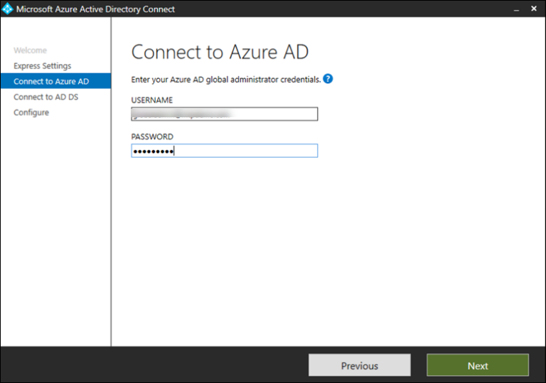

# Vorbereiten ihrer Microsoft 365 Defender-Testumgebung oder -PilotumgebungPrepare your Microsoft 365 Defender trial lab or pilot environment

[!INCLUDE [Microsoft 365 Defender rebranding](../includes/microsoft-defender.md)]

**Gilt für:****Applies to:**
- Microsoft 365 DefenderMicrosoft 365 Defender

Das Erstellen einer Microsoft 365 Defender-Testumgebung oder -Pilotumgebung und deren Bereitstellung besteht aus drei Phasen:Creating a Microsoft 365 Defender trial lab or pilot environment and deploying it is a three-phase process:

| Phase 1: VorbereitenPhase 1: Prepare | [Phase 2: EinrichtenPhase 2: Set up](setup-mtpeval.md) | [Phase 3: OnboardingPhase 3: Onboard](config-mtpeval.md) |  [Zurück zum Pilot-PlaybookBack to pilot playbook](mtp-pilot.md) |
|--|--|--|--|
|*Sie sind hier!**You are here!* | || |

Sie sind derzeit in der Vorbereitungsphase.You're currently in the preparation phase.

Die Vorbereitung ist für eine erfolgreiche Bereitstellung entscheidend.Preparation is key to any successful deployment. Dieser Abschnitt führt Sie durch die Informationen, die Sie bei der Vorbereitung der Erstellung einer Testumgebung oder Pilotumgebung für Ihre Microsoft 365 Defender-Bereitstellung berücksichtigen müssen.This section will guide you through what you need to consider as you prepare to create a trial lab or pilot environment for your Microsoft 365 Defender deployment.

## VoraussetzungenPrerequisites
Erfahren Sie mehr über die Lizenzierungs-, Hardware- und Softwareanforderungen sowie andere Konfigurationseinstellungen zum Bereitstellen und Verwenden von Microsoft 365 Defender.Learn about the licensing, hardware and software requirements, and other configuration settings to provision and use Microsoft 365 Defender. Siehe die Mindestanforderungen für [Microsoft 365 Defender](https://docs.microsoft.com/microsoft-365/security/mtp/prerequisites), [Microsoft Defender for Endpoint](https://docs.microsoft.com/windows/security/threat-protection/microsoft-defender-atp/minimum-requirements), Microsoft Defender für Office [365](https://docs.microsoft.com/office365/servicedescriptions/office-365-advanced-threat-protection-service-description), [Microsoft Defender for Identity](https://docs.microsoft.com/azure-advanced-threat-protection/atp-prerequisites), Microsoft Cloud App [Security](https://docs.microsoft.com/azure-advanced-threat-protection/atp-prerequisites).See the minimum requirements for [Microsoft 365 Defender](https://docs.microsoft.com/microsoft-365/security/mtp/prerequisites), [Microsoft Defender for Endpoint](https://docs.microsoft.com/windows/security/threat-protection/microsoft-defender-atp/minimum-requirements), [Microsoft Defender for Office 365](https://docs.microsoft.com/office365/servicedescriptions/office-365-advanced-threat-protection-service-description), [Microsoft Defender for Identity](https://docs.microsoft.com/azure-advanced-threat-protection/atp-prerequisites), [Microsoft Cloud App Security](https://docs.microsoft.com/azure-advanced-threat-protection/atp-prerequisites).

## Projektbeteiligten und AbmeldenStakeholders and sign-off
Identifizieren Sie alle Projektbeteiligten, die am Projekt beteiligt sind, und wer sich abmelden, überprüfen oder auf dem Laufenden bleiben muss, sei es zur Evaluierung oder zum Ausführen eines Pilotprojekts.Identify all the stakeholders that are involved in the project and who may need to sign-off, review, or stay informed, whether for evaluation or running a pilot project.

>[!NOTE]
>Möglicherweise verfügen nicht alle Organisationen über die Fälligkeit einer Sicherheitsorganisation, über solche Rollen zu verfügen.Not all organizations might have the security organization maturity to have such roles. Wenden Sie sich in diesem Fall an Ihr Führungsteam zur Überprüfung und Genehmigung von Konten.In such case, consult with your leadership team on review and approval accountabilities.

Fügen Sie der nachstehenden Tabelle Projektbeteiligten hinzu, wenn dies für Ihre Organisation geeignet ist.Add stakeholders to the table below as appropriate for your organization.

-   SO = Abmelden für dieses ProjektSO = Sign-off on this project

-   R = Überprüfen Sie dieses Projekt, und geben Sie Eingaben an.R = Review this project and provide input

-   I = Informiert über dieses ProjektI = Informed of this project

| NameName                 | RolleRole                                                                                                                                                                                                          | AktionAction |
|----------------------|---------------------------------------------------------------------------------------------------------------------------------------------------------------------------------------------------------------|--------|
| Geben Sie Den Namen und die E-Mail ein.Enter name and email | **Chief Information Security Officer (CISO)** Ein leitender Vertreter, der innerhalb der Organisation als Sponsor für *die neue Technologiebereitstellung fungiert.***Chief Information Security Officer (CISO)** *An executive representative who serves as sponsor inside the organization for the new technology deployment.*                                                  | AlsoSO     |
| Geben Sie Den Namen und die E-Mail ein.Enter name and email | **Leiter des Cyber Defense Operations Centers (CDOC)** Ein Vertreter des CDOC-Teams, der für die Definition der Ausrichtung dieser Änderung an den Prozessen im Sicherheitsteam der Kunden *zuständig ist.***Head of Cyber Defense Operations Center (CDOC)** *A representative from the CDOC team in charge of defining how this change is aligned with the processes in the customers security operations team.*       | AlsoSO     |
| Geben Sie Den Namen und die E-Mail ein.Enter name and email | **Security Architect** *A representative from the Security team in charge of defining how this change is aligned with the core Security architecture in the organization.***Security Architect** *A representative from the Security team in charge of defining how this change is aligned with the core Security architecture in the organization.*                         | RR      |
| Geben Sie Den Namen und die E-Mail ein.Enter name and email | **Workplace Architect** *A representative from the IT team in charge of defining how this change is aligned with the core workplace architecture in the organization.***Workplace Architect** *A representative from the IT team in charge of defining how this change is aligned with the core workplace architecture in the organization.*                             | RR      |
| Geben Sie Den Namen und die E-Mail ein.Enter name and email | **Security Analyst** *A representative from the CDOC team who can provide feedback on the detection capabilities, user experience, and overall usefulness of this change from a security operations perspective.***Security Analyst** *A representative from the CDOC team who can provide feedback on the detection capabilities, user experience, and overall usefulness of this change from a security operations perspective.* | II      |

## Vorbereiten ihres Azure Active DirectoryPrepare your Azure Active Directory
Überspringen Sie diesen Schritt, wenn Sie die Synchronisierung zwischen Active Directory und Azure Active Directory lokal bereits aktiviert haben.Skip this step if you have already enabled synchronization between Active Directory and Azure Active Directory on premises. Überprüfen Sie die vorhandene Dokumentation zu bewährten Methoden aus Azure Active Directory.Review existing best practices documentation from Azure Active Directory. Die folgenden Schritte sind für die Evaluierung oder Ausführung eines Microsoft 365 -Pilotprojekts optimiert.The following steps are optimized to evaluate or run a pilot Microsoft 365 Defender project.

1. Wechseln Sie zum [Azure Active Directory-Portal](https://portal.azure.com/#blade/Microsoft_AAD_IAM/ActiveDirectoryMenuBlade) > **Azure AD Connect**.Go to the [Azure Active Directory](https://portal.azure.com/#blade/Microsoft_AAD_IAM/ActiveDirectoryMenuBlade) portal > **Azure AD Connect**. 
   

2. Klicken **Sie auf "Von** **Microsoft Azure Active Directory Connect herunterladen",** und übertragen Sie es auf Ihren Domänencontroller.Click **Download** from **Microsoft Azure Active Directory Connect** and transfer it to your Domain Controller.
  

3. Folgen Sie auf dem Domänencontroller dem Azure Active Directory Connect-Assistenten.On the domain controller, follow the Azure Active Directory Connect wizard. Lesen Sie die Lizenzbedingungen und den Datenschutzhinweise, und aktivieren Sie das Kontrollkästchen, wenn Sie zustimmen.Read the license terms and privacy notice and select the checkbox if you agree. Klicken Sie auf **Weiter**.Click **Continue**.
  

4. Navigieren Sie zu **"Express-Einstellungen".**Navigate to **Express Settings**.
  

5. Geben Sie Ihre anmeldeinformationen für den globalen Administrator ein.Enter your global administrator credentials. Klicken Sie auf **Weiter**.Click **Next**.
  

6. Geben Sie die Anmeldeinformationen des Active Directory Domain Services-Unternehmensadministrators ein.Enter your Active Directory Domain Services enterprise administrator credentials. Klicken Sie auf **Weiter**.Click **Next**.
  

7. Klicken **Sie auf "Installieren",** um die Konfiguration zu bestätigen.Click **Install** to confirm the configuration.
  

8. Herzlichen Glückwunsch, Sie haben Azure Active Directory Connect erfolgreich konfiguriert.Congratulations, you have successfully configured Azure Active Directory Connect.
  

Sie können nun [Benutzer und Gruppen zu Active Directory hinzufügen](https://docs.microsoft.com/azure-advanced-threat-protection/atp-playbook-setup-lab#bkmk_hydrate) und eine [SAM-R-Richtlinie konfigurieren.](https://docs.microsoft.com/azure-advanced-threat-protection/atp-playbook-setup-lab#configure-sam-r-capabilities-from-contosodc)You can now [add users and groups to Active Directory](https://docs.microsoft.com/azure-advanced-threat-protection/atp-playbook-setup-lab#bkmk_hydrate) and [configure a SAM-R policy](https://docs.microsoft.com/azure-advanced-threat-protection/atp-playbook-setup-lab#configure-sam-r-capabilities-from-contosodc).  

## KonfigurationsreihenfolgeConfiguration order
Die folgende Tabelle gibt die Reihenfolge an, die Microsoft für die Konfiguration der Microsoft 365 -Defender-Komponenten für Ihre Testumgebungs- oder Pilotumgebungsbereitstellung empfiehlt.The following table indicates the order Microsoft recommends for configuring the Microsoft 365 Defender components for your trial lab or pilot environment deployment.

| KomponenteComponent                               | BeschreibungDescription                                                                                                                                                                                                                                                                                                                                                                                                                                                                                                                                                                                                                                                                                              | Rang der KonfigurationsreihenfolgeConfiguration order rank |
|-----------------------------------------|----------------------------------------------------------------------------------------------------------------------------------------------------------------------------------------------------------------------------------------------------------------------------------------------------------------------------------------------------------------------------------------------------------------------------------------------------------------------------------------------------------------------------------------------------------------------------------------------------------------------------------------------------------------------------------------------------------|---------------------|
|Microsoft Defender für Office 365Microsoft Defender for Office 365|Microsoft Defender für Office 365 schützt Ihre Organisation vor bösartigen Bedrohungen durch E-Mail-Nachrichten, Links (URLs) und Tools für die Zusammenarbeit.Microsoft Defender for Office 365 safeguards your organization against malicious threats posed by email messages, links (URLs), and collaboration tools.   [Weitere Informationen.Learn more.](https://docs.microsoft.com/microsoft-365/security/office-365-security/office-365-atp)                                                                                                                                                                                                                                             | 1 1                   |
|Microsoft Defender for IdentityMicrosoft Defender for Identity|Microsoft Defender for Identity verwendet Active Directory-Signale, um fortgeschrittene Bedrohungen, gefährdete Identitäten und böswillige Insideraktionen zu identifizieren, zu erkennen und zu untersuchen, die gegen Ihre Organisation gerichtet sind.Microsoft Defender for Identity uses Active Directory signals to identify, detect, and investigate advanced threats, compromised identities, and malicious insider actions directed at your organization.   [Weitere Informationen](https://docs.microsoft.com/azure-advanced-threat-protection/).[Learn more](https://docs.microsoft.com/azure-advanced-threat-protection/).| 2 2 |
|Microsoft Cloud App-SicherheitMicrosoft Cloud App Security| Microsoft Cloud App Security ist ein Cloud Access Security Broker (CASB), der auf mehreren Clouds funktioniert.Microsoft Cloud App Security is a Cloud Access Security Broker (CASB) that operates on multiple clouds. Es bietet umfassende Sichtbarkeit, Kontrolle über den Datenverkehr und komplexe Analysen, um Cyberbedrohungen in allen Ihren Clouddiensten zu identifizieren und zu bekämpfen.It provides rich visibility, control over data travel, and sophisticated analytics to identify and combat cyberthreats across all your cloud services.   [Weitere Informationen](https://docs.microsoft.com/cloud-app-security/).[Learn more](https://docs.microsoft.com/cloud-app-security/).                                                                                                                                                                                                                                                                                                                                                                       |33                   |
|Microsoft Defender für EndpunktMicrosoft Defender for Endpoint | Die Erkennungs- und Antwortfunktionen von Microsoft Defender für Endpunkte bieten erweiterte Angriffserkennungen, die nahezu in Echtzeit verfügbar und umsetzbar sind.Microsoft Defender for Endpoint endpoint detection and response capabilities provide advanced attack detections that are near real-time and actionable. Sicherheitsanalysten können Benachrichtigungen effektiv priorisieren, Einblick in den gesamten Umfang einer Verletzung erhalten und Aktionen ergreifen, um Bedrohungen zu beheben.Security analysts can prioritize alerts effectively, gain visibility into the full scope of a breach, and take response actions to remediate threats.   [Weitere Informationen.Learn more.](https://docs.microsoft.com/windows/security/threat-protection/microsoft-defender-atp/microsoft-defender-advanced-threat-protection)                                     |4 4                   |                                                                                                                                                                                                                                    

## Nächster SchrittNext step
|  [Phase 2: EinrichtenPhase 2: Setup](setup-mtpeval.md) | Einrichten ihrer Microsoft 365 Defender-Testumgebung oder -PilotumgebungSet up your Microsoft 365 Defender trial lab or pilot environment
|:-------|:-----|

