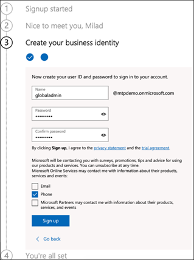

# Einrichten Ihrer Microsoft Threat Protection-TestumgebungSet up your Microsoft Threat Protection trial lab environment 

**Gilt für:****Applies to:**
- Microsoft Threat ProtectionMicrosoft Threat Protection 

Das Erstellen einer Microsoft Threat Protection-Test Umgebungsumgebung und deren Bereitstellung ist ein dreistufiger Prozess:Creating a Microsoft Threat Protection trial lab environment and deploying it is a three-phase process:

 
<table border="0" width="100%" align="center">
  <tr style="text-align:center;">
    <td align="center" style="width:25%; border:0;" >
      <a href= "https://docs.microsoft.com/microsoft-365/security/mtp/prepare-mtpeval?view=o365-worldwide"> 
        
       Phase 1: Vorbereiten</a>Phase 1: Prepare </a> 
    </td>
     <td align="center"bgcolor="#d5f5e3">
      <a href="https://docs.microsoft.com/microsoft-365/security/mtp/setup-mtpeval?view=o365-worldwide">
        
       Phase 2: Setup</a>Phase 2: Setup </a> 
    </td>
    <td align="center">
      <a href="https://docs.microsoft.com/microsoft-365/security/mtp/config-mtpeval?view=o365-worldwide">
        
       Phase 3: Konfigurieren von & Onboard</a>Phase 3: Configure & Onboard </a> 
</td>

  </tr>
</table>

Sie befinden sich derzeit in der Setupphase.You are currently in the set up phase. Führen Sie die ersten Schritte für den Zugriff auf das Microsoft 365 Security Center aus, und installieren Sie dann die Testumgebung.Take the initial steps to access Microsoft 365 Security Center then setup your trial lab environment.

Registrieren Sie sich für ein Office 365 oder Azure Active Directory-Abonnement, um einen *. onmicrosoft.com-* Mandanten zu generieren, mit dem Sie sich für Ihre Microsoft 365 E5-Lizenz anmelden können.Sign up for an Office 365 or Azure Active Directory subscription to generate a *.onmicrosoft.com* tenant that you can use to sign up for your Microsoft 365 E5 license. 

>[!NOTE]
>Wenn Sie bereits über ein vorhandenes Office 365-oder Azure Active Directory-Abonnement verfügen, können Sie die Schritte zum Erstellen von Office 365 E5-Testmandanten überspringen.If you already have an existing Office 365 or Azure Active Directory subscription, you can skip the Office 365 E5 trial tenant creation steps.

In dieser Phase werden Sie zu folgenden Themen geführt:In this phase, you'll be guided to:
- Erstellen eines Office 365 E5-TestmandantenCreate an Office 365 E5 trial tenant
- Microsoft 365-Testabonnement aktivierenEnable Microsoft 365 trial subscription

## Erstellen eines Office 365 E5-TestmandantenCreate an Office 365 E5 trial tenant
>[!NOTE]
>Wenn Sie bereits über ein vorhandenes Office 365-oder Azure Active Directory-Abonnement verfügen, können Sie die Schritte zum Erstellen von Office 365 E5-Testmandanten überspringen.If you already have an existing Office 365 or Azure Active Directory subscription, you can skip the Office 365 E5 trial tenant creation steps.

1. Wechseln Sie zum [Office 365 E5-Produkt Portal](https://www.microsoft.com/microsoft-365/business/office-365-enterprise-e5-business-software?activetab=pivot%3aoverviewtab) , und wählen Sie **Kostenlose Testversion**aus.Go to the [Office 365 E5 product portal](https://www.microsoft.com/microsoft-365/business/office-365-enterprise-e5-business-software?activetab=pivot%3aoverviewtab) and select **Free trial**.
  
  
2. Schließen Sie die Testregistrierung ab, indem Sie Ihre e-Mail-Adresse (persönlich oder Unternehmen) eingeben.Complete the trial registration by entering your email address (personal or corporate). Klicken Sie auf **Konto einrichten**.Click **Set up account**.
   

3. Geben Sie den Vornamen, den Nachnamen, die geschäftliche Telefonnummer, den Firmennamen, die Unternehmensgröße und das Land oder die Region ein.Fill in your first name, last name, business phone number, company name, company size and country or region.  
   
>[!NOTE]
>Das Land oder die Region, die Sie hier festgelegt haben, bestimmt die Rechenzentrums Region, in der Ihr Office 365 gehostet wird.The country or region you set here determines the data center region your Office 365 will be hosted.
  
4. Wählen Sie Ihre Verifizierungs Präferenz: durch eine Textnachricht oder einen Anruf.Choose your verification preference: through a text message or call. Klicken Sie auf **Bestätigungs Code senden**.Click **Send Verification Code**. 
  

5. Legen Sie den benutzerdefinierten Domänennamen für Ihren Mandanten fest, und klicken Sie dann auf **weiter**.Set the custom domain name for your tenant, then click **Next**.
   
 
6. Richten Sie die erste Identität ein, die ein globaler Administrator für den Mandanten sein wird.Set up the first identity which will be a Global Administrator for the tenant. Geben Sie den **Namen** und das **Kennwort ein**.Fill in **Name** and **Password**. Klicken Sie auf **Anmelden**.Click **Sign up**.
  

7. Klicken Sie auf **Gehe zu Setup** , um die Office 365 E5-Testmandanten Provision abzuschließen.Click **Go to Setup** to complete the Office 365 E5 trial tenant provisioning.
   

8. Verbinden Sie Ihre Unternehmensdomäne mit dem Office 365 Mandanten.Connect your corporate domain to the Office 365 tenant. Optional Wählen **Sie Verbinden einer Domäne aus, die Sie bereits besitzen** , und geben Sie Ihren Domänennamen ein.[Optional] Choose **Connect a domain you already own** and type in your domain name. Klicken Sie auf **Weiter**.Click **Next**.
   
 
9. Sie müssen einen txt-oder MX-Eintrag hinzufügen, um den Domänenbesitz zu überprüfen.You will need to add a TXT or MX record to validate the domain ownership. Nachdem Sie den txt-oder MX-Eintrag zu Ihrer Domäne hinzugefügt haben, wählen Sie **überprüfen**aus.Once you’ve added the TXT or MX record to your domain, select **Verify**.
   
 
10. Optional Erstellen Sie weitere Benutzerkonten für Ihren Mandanten.[Optional] Create more user accounts for your tenant. Sie können diesen Schritt überspringen, indem Sie auf **weiter**klicken.You can skip this step by clicking **Next**.
  
 
11. Optional Laden Sie Office-Apps herunter.[Optional] Download Office apps. Klicken Sie auf **weiter** , um diesen Schritt zu überspringen.Click **Next** to skip this step. 
   

12. Optional Migrieren von e-Mail-Nachrichten[Optional] Migrate email messages. Sie können diesen Schritt auch wieder überspringen.Again, you can skip this step.
   
 
13. Wählen Sie Onlinedienste aus.Choose online services. Wählen Sie **Exchange** aus, und klicken Sie auf **weiter**.Select **Exchange** and click **Next**. 
   

14. Fügen Sie Ihrer Domäne MX-, CNAME-und TXT-Einträge hinzu.Add MX, CNAME and TXT records to your domain. Wählen Sie nach Abschluss die Option **überprüfen**aus.When completed, select **Verify**.
   
 
15. Herzlichen Glückwunsch, Sie haben die Überstellung Ihres Office 365 Mandanten abgeschlossen.Congratulations, you have completed the provisioning of your Office 365 tenant.
   

## Microsoft 365-Testabonnement aktivierenEnable Microsoft 365 trial subscription

>[!NOTE]
>Wenn Sie sich für eine Testversion registrieren, erhalten Sie 25 Benutzerlizenzen, die für einen Monat verwendet werden.Signing up for a trial gives you 25 user licenses to use for a month. Weitere Informationen finden Sie unter [Testen oder kaufen eines M365-Abonnements](https://docs.microsoft.com/microsoft-365/commerce/try-or-buy-microsoft-365?view=o365-worldwide#try-or-buy-a-microsoft-365-subscription-1) .See [Try or Buy an M365 subscription](https://docs.microsoft.com/microsoft-365/commerce/try-or-buy-microsoft-365?view=o365-worldwide#try-or-buy-a-microsoft-365-subscription-1) for details.

1. Klicken Sie im [Microsoft 365 Admin Center](https://admin.microsoft.com/)auf **Abrechnung** , und navigieren Sie zu **Dienste kaufen**.From [Microsoft 365 Admin Center](https://admin.microsoft.com/), click **Billing** and then navigate to **Purchase services**.

2. Wählen Sie **Microsoft 365 E5** aus, und klicken Sie auf **Kostenlose Testversion starten**.Select **Microsoft 365 E5** and click **Start free trial**. 
  

3. Wählen Sie Ihre Verifizierungs Präferenz: durch eine Textnachricht oder einen Anruf.Choose your verification preference: through a text message or call. Wenn Sie sich entschieden haben, geben Sie die Telefonnummer ein, wählen Sie **Text mich** oder **rufen Sie mich** je nach Ihrer Auswahl an.Once you have decided, enter the phone number, select **Text me** or **Call me** depending on your selection.
  
 
4. Geben Sie den Verifizierungscode ein, und klicken Sie auf **Kostenlose Testversion starten**.Enter the verification code and click **Start your free trial**. 
   

5. Klicken Sie auf **jetzt testen** , um Ihre Microsoft 365 E5-Testversion zu bestätigen.Click **Try now** to confirm your Microsoft 365 E5 trial.
   
 
6. Wechseln Sie zum **Microsoft 365 Admin Center**  >  **Users**  >  **Active Users**.Go to the **Microsoft 365 Admin Center** > **Users** > **Active users**. Wählen Sie Ihr Benutzerkonto aus, wählen Sie **Produktlizenzen verwalten**aus, und tauschen Sie dann die Lizenz von Office 365 E5 auf **Microsoft 365 E5**aus.Select your user account, select **Manage product licenses**, then swap the license from Office 365 E5 to **Microsoft 365 E5**. Klicken Sie auf **Speichern**.Click **Save**.
  
 
7. Wählen Sie erneut das globale Administratorkonto aus, und klicken Sie dann auf **Benutzername verwalten**.Select the global administrator account again then click **Manage username**.
   

8. Optional Ändern Sie die Domäne von *onmicrosoft.com* in Ihre eigene Domäne – je nachdem, was Sie in den vorherigen Schritten ausgewählt haben.[Optional] Change the domain from *onmicrosoft.com* to your own domain—depending on what you chose on the previous steps. Klicken Sie auf **Änderungen speichern**.Click **Save changes**.
   

## Nächster SchrittNext step
|||
|:-------|:-----|
|  [Phase 3: Konfigurieren von & OnboardPhase 3: Configure & Onboard](config-mtpeval.md) | Konfigurieren Sie die einzelnen Microsoft Threat Protection-Pfeiler für Ihr Microsoft Threat Protection-Evaluierungslabor und ihre Endpunkte an Bord.Configure each Microsoft Threat Protection pillar for your Microsoft Threat Protection evaluation lab and onboard your endpoints.
