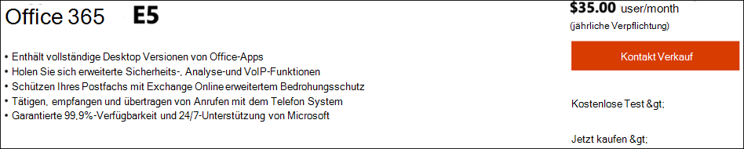
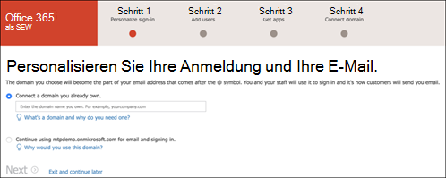
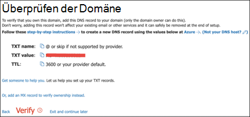
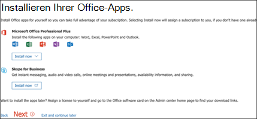
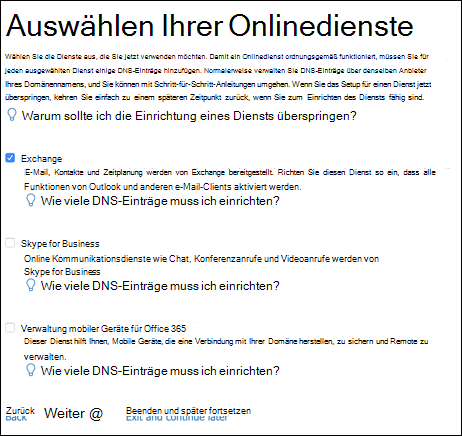
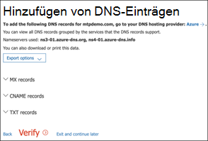
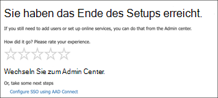
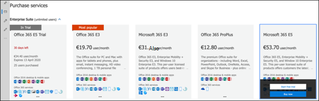

# Einrichten Ihrer Microsoft Threat Protection-Testumgebung 

**Gilt für:**
- Microsoft Threat Protection 

Das Erstellen einer Microsoft Threat Protection-Test Umgebungsumgebung und deren Bereitstellung ist ein dreistufiger Prozess:

 
<table border="0" width="100%" align="center">
  <tr style="text-align:center;">
    <td align="center" style="width:25%; border:0;" >
      <a href= "https://docs.microsoft.com/microsoft-365/security/mtp/prepare-mtpeval?view=o365-worldwide"> 
        
       Phase 1: Vorbereiten</a> 
    </td>
     <td align="center"bgcolor="#d5f5e3">
      <a href="https://docs.microsoft.com/microsoft-365/security/mtp/setup-mtpeval?view=o365-worldwide">
        
       Phase 2: Setup</a> 
    </td>
    <td align="center">
      <a href="https://docs.microsoft.com/microsoft-365/security/mtp/config-mtpeval?view=o365-worldwide">
        
       Phase 3: Konfigurieren von & Onboard</a> 
</td>

  </tr>
</table>

Sie befinden sich derzeit in der Setupphase. Führen Sie die ersten Schritte für den Zugriff auf das Microsoft 365 Security Center aus, und installieren Sie dann die Testumgebung.

Registrieren Sie sich für ein Office 365 oder Azure Active Directory-Abonnement, um einen *. onmicrosoft.com-* Mandanten zu generieren, mit dem Sie sich für Ihre Microsoft 365 E5-Lizenz anmelden können. 

>[!NOTE]
>Wenn Sie bereits über ein vorhandenes Office 365-oder Azure Active Directory-Abonnement verfügen, können Sie die Schritte zum Erstellen von Office 365 E5-Testmandanten überspringen.

In dieser Phase werden Sie zu folgenden Themen geführt:
- Erstellen eines Office 365 E5-Testmandanten
- Microsoft 365-Testabonnement aktivieren

## Erstellen eines Office 365 E5-Testmandanten
>[!NOTE]
>Wenn Sie bereits über ein vorhandenes Office 365-oder Azure Active Directory-Abonnement verfügen, können Sie die Schritte zum Erstellen von Office 365 E5-Testmandanten überspringen.

1. Wechseln Sie zum [Office 365 E5-Produkt Portal](https://www.microsoft.com/microsoft-365/business/office-365-enterprise-e5-business-software?activetab=pivot%3aoverviewtab) , und wählen Sie **Kostenlose Testversion**aus.
  
  
2. Schließen Sie die Testregistrierung ab, indem Sie Ihre e-Mail-Adresse (persönlich oder Unternehmen) eingeben. Klicken Sie auf **Konto einrichten**.
   

3. Geben Sie den Vornamen, den Nachnamen, die geschäftliche Telefonnummer, den Firmennamen, die Unternehmensgröße und das Land oder die Region ein.  
   
>[!NOTE]
>Das Land oder die Region, die Sie hier festgelegt haben, bestimmt die Rechenzentrums Region, in der Ihr Office 365 gehostet wird.
  
4. Wählen Sie Ihre Verifizierungs Präferenz: durch eine Textnachricht oder einen Anruf. Klicken Sie auf **Bestätigungs Code senden**. 
  

5. Legen Sie den benutzerdefinierten Domänennamen für Ihren Mandanten fest, und klicken Sie dann auf **weiter**.
   
 
6. Richten Sie die erste Identität ein, die ein globaler Administrator für den Mandanten sein wird. Geben Sie den **Namen** und das **Kennwort ein**. Klicken Sie auf **Anmelden**.
  

7. Klicken Sie auf **Gehe zu Setup** , um die Office 365 E5-Testmandanten Provision abzuschließen.
   

8. Verbinden Sie Ihre Unternehmensdomäne mit dem Office 365 Mandanten. Optional Wählen **Sie Verbinden einer Domäne aus, die Sie bereits besitzen** , und geben Sie Ihren Domänennamen ein. Klicken Sie auf **Weiter**.
   
 
9. Sie müssen einen txt-oder MX-Eintrag hinzufügen, um den Domänenbesitz zu überprüfen. Nachdem Sie den txt-oder MX-Eintrag zu Ihrer Domäne hinzugefügt haben, wählen Sie **überprüfen**aus.
   
 
10. Optional Erstellen Sie weitere Benutzerkonten für Ihren Mandanten. Sie können diesen Schritt überspringen, indem Sie auf **weiter**klicken.
  
 
11. Optional Laden Sie Office-Apps herunter. Klicken Sie auf **weiter** , um diesen Schritt zu überspringen. 
   

12. Optional Migrieren von e-Mail-Nachrichten Sie können diesen Schritt auch wieder überspringen.
   
 
13. Wählen Sie Onlinedienste aus. Wählen Sie **Exchange** aus, und klicken Sie auf **weiter**. 
   

14. Fügen Sie Ihrer Domäne MX-, CNAME-und TXT-Einträge hinzu. Wählen Sie nach Abschluss die Option **überprüfen**aus.
   
 
15. Herzlichen Glückwunsch, Sie haben die Überstellung Ihres Office 365 Mandanten abgeschlossen.
   

## Microsoft 365-Testabonnement aktivieren

>[!NOTE]
>Wenn Sie sich für eine Testversion registrieren, erhalten Sie 25 Benutzerlizenzen, die für einen Monat verwendet werden. Weitere Informationen finden Sie unter [Testen oder kaufen eines M365-Abonnements](https://docs.microsoft.com/microsoft-365/commerce/try-or-buy-microsoft-365?view=o365-worldwide#try-or-buy-a-microsoft-365-subscription-1) .

1. Klicken Sie im [Microsoft 365 Admin Center](https://admin.microsoft.com/)auf **Abrechnung** , und navigieren Sie zu **Dienste kaufen**.

2. Wählen Sie **Microsoft 365 E5** aus, und klicken Sie auf **Kostenlose Testversion starten**. 
  

3. Wählen Sie Ihre Verifizierungs Präferenz: durch eine Textnachricht oder einen Anruf. Wenn Sie sich entschieden haben, geben Sie die Telefonnummer ein, wählen Sie **Text mich** oder **rufen Sie mich** je nach Ihrer Auswahl an.
  
 
4. Geben Sie den Verifizierungscode ein, und klicken Sie auf **Kostenlose Testversion starten**. 
   

5. Klicken Sie auf **jetzt testen** , um Ihre Microsoft 365 E5-Testversion zu bestätigen.
   
 
6. Wechseln Sie zum **Microsoft 365 Admin Center**  >  **Users**  >  **Active Users**. Wählen Sie Ihr Benutzerkonto aus, wählen Sie **Produktlizenzen verwalten**aus, und tauschen Sie dann die Lizenz von Office 365 E5 auf **Microsoft 365 E5**aus. Klicken Sie auf **Speichern**.
  
 
7. Wählen Sie erneut das globale Administratorkonto aus, und klicken Sie dann auf **Benutzername verwalten**.
   

8. Optional Ändern Sie die Domäne von *onmicrosoft.com* in Ihre eigene Domäne – je nachdem, was Sie in den vorherigen Schritten ausgewählt haben. Klicken Sie auf **Änderungen speichern**.
   

## Nächster Schritt
|||
|:-------|:-----|
|  [Phase 3: Konfigurieren von & Onboard](config-mtpeval.md) | Konfigurieren Sie die einzelnen Microsoft Threat Protection-Pfeiler für Ihr Microsoft Threat Protection-Evaluierungslabor und ihre Endpunkte an Bord.
