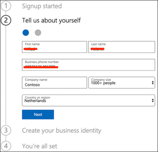

# Einrichten Ihrer Microsoft 365 Defender-TestumgebungSet up your Microsoft 365 Defender trial lab environment 

[!INCLUDE [Microsoft 365 Defender rebranding](../includes/microsoft-defender.md)]

**Gilt für:****Applies to:**
- Microsoft 365 DefenderMicrosoft 365 Defender 

Das Erstellen einer Microsoft 365 Defender-Testumgebung oder Pilotumgebung und deren Bereitstellung ist ein drei phasenweiser Prozess:Creating a Microsoft 365 Defender trial lab or pilot environment and deploying it is a three-phase process:

| [Phase 1: VorbereitenPhase 1: Prepare](prepare-mtpeval.md) | Phase 2: EinrichtenPhase 2: Set up | [Phase 3: OnboardingPhase 3: Onboard](config-mtpeval.md) |  [Zurück zum TestspielbuchBack to pilot playbook](mtp-pilot.md) |
|--|--|--|--|
||*Sie sind hier!**You are here!*  | | |

Sie sind derzeit in der Einrichtungsphase.You're currently in the set up phase. Gehen Sie zunächst auf Microsoft 365 Security Center zu, und richten Sie dann Ihre Testumgebung oder Pilotumgebung ein.Take the initial steps to access Microsoft 365 Security Center then set up your trial lab or pilot environment.

Registrieren Sie sich für ein Office 365- oder Azure Active Directory-Abonnement, um einen *.onmicrosoft.com-Mandanten* zu generieren, mit dem Sie sich für Ihre Microsoft 365 E5-Lizenz registrieren können.Sign up for an Office 365 or Azure Active Directory subscription to generate a *.onmicrosoft.com* tenant that you can use to sign up for your Microsoft 365 E5 license. 

>[!NOTE]
>Wenn Sie bereits über ein vorhandenes Office 365- oder Azure Active Directory-Abonnement verfügen, können Sie die Schritte für die Office 365 E5-Testversion oder die Piloterstellung von Mandanten überspringen.If you already have an existing Office 365 or Azure Active Directory subscription, you can skip the Office 365 E5 trial or pilot tenant creation steps.

In dieser Phase werden Sie geführt zu:In this phase, you'll be guided to:
- Erstellen eines Office 365 E5-Test-MandantenCreate an Office 365 E5 trial tenant
- Aktivieren des Microsoft 365-TestabonnementsEnable Microsoft 365 trial subscription

## Erstellen eines Office 365 E5-Test-MandantenCreate an Office 365 E5 trial tenant
>[!NOTE]
>Wenn Sie bereits über ein vorhandenes Office 365- oder Azure Active Directory-Abonnement verfügen, können Sie die Schritte zum Erstellen von Office 365 E5-Test mandanten überspringen.If you already have an existing Office 365 or Azure Active Directory subscription, you can skip the Office 365 E5 trial tenant creation steps.

1. Wechseln Sie zum [Office 365 E5-Produktportal,](https://www.microsoft.com/microsoft-365/business/office-365-enterprise-e5-business-software?activetab=pivot%3aoverviewtab) und wählen Sie **Kostenlose Testversion aus.**Go to the [Office 365 E5 product portal](https://www.microsoft.com/microsoft-365/business/office-365-enterprise-e5-business-software?activetab=pivot%3aoverviewtab) and select **Free trial**.

   
  
2. Schließen Sie die Testregistrierung ab, indem Sie Ihre E-Mail-Adresse (privat oder unternehmensanmeldend) eingeben.Complete the trial registration by entering your email address (personal or corporate). Klicken **Sie auf Konto einrichten**.Click **Set up account**.

   

3. Geben Sie Ihren Vornamen, Nachnamen, Ihre Geschäftliche Telefonnummer, den Firmennamen, die Unternehmensgröße und das Land oder die Region ein.Fill in your first name, last name, business phone number, company name, company size, and country or region.  

   
   
   > [!NOTE]
   > Das land oder die Region, das Sie hier festgelegt haben, bestimmt die Rechenzentrumsregion, in der Ihr Office 365 gehostet wird.The country or region you set here determines the data center region your Office 365 will be hosted.
  
4. Wählen Sie Ihre Überprüfungseinstellung aus: über eine Textnachricht oder einen Anruf.Choose your verification preference: through a text message or call. Klicken **Sie auf Überprüfungscode senden**.Click **Send Verification Code**. 

   

5. Legen Sie den benutzerdefinierten Domänennamen für Ihren Mandanten ein, und klicken Sie dann auf **Weiter**.Set the custom domain name for your tenant, then click **Next**.

   
 
6. Richten Sie die erste Identität ein, die ein globaler Administrator für den Mandanten ist.Set up the first identity, which will be a Global Administrator for the tenant. Geben Sie **Name und** **Kennwort ein.**Fill in **Name** and **Password**. Klicken Sie auf **Anmelden**.Click **Sign up**.

   

7. Klicken **Sie auf Zu Setup wechseln,** um die Office 365 E5-Test-Mandantenbereitstellung abzuschließen.Click **Go to Setup** to complete the Office 365 E5 trial tenant provisioning.

   

8. Verbinden Sie Ihre Unternehmensdomäne mit dem Office 365-Mandanten.Connect your corporate domain to the Office 365 tenant. [Optional] Wählen **Sie Verbinden einer Domäne aus, die Sie bereits besitzen,** und geben Sie Ihren Domänennamen ein.[Optional] Choose **Connect a domain you already own** and type in your domain name. Klicken Sie auf **Weiter**.Click **Next**.

   
 
9. Fügen Sie einen TXT- oder MX-Eintrag hinzu, um den Domänenbesitz zu überprüfen.Add a TXT or MX record to validate the domain ownership. Nachdem Sie den TXT- oder MX-Eintrag zu Ihrer Domäne hinzugefügt haben, wählen Sie **Überprüfen aus.**Once you’ve added the TXT or MX record to your domain, select **Verify**.

   
 
10. [Optional] Erstellen Sie weitere Benutzerkonten für Ihren Mandanten.[Optional] Create more user accounts for your tenant. Sie können diesen Schritt überspringen, indem Sie auf **Weiter klicken.**You can skip this step by clicking **Next**.

    
 
11. [Optional] Laden Sie Office-Apps herunter.[Optional] Download Office apps. Klicken Sie **auf Weiter,** um diesen Schritt zu überspringen.Click **Next** to skip this step. 

    

12. [Optional] Migrieren von E-Mail-Nachrichten.[Optional] Migrate email messages. Auch hier können Sie diesen Schritt überspringen.Again, you can skip this step.

    
 
13. Wählen Sie Onlinedienste aus.Choose online services. Wählen **Sie Exchange** aus, und klicken Sie auf **Weiter**.Select **Exchange** and click **Next**. 

    

14. Fügen Sie Ihrer Domäne MX-, CNAME- und #A0 hinzu.Add MX, CNAME, and TXT records to your domain. Wenn Sie abgeschlossen sind, wählen Sie **Überprüfen aus.**When completed, select **Verify**.

    
 
15. Herzlichen Glückwunsch, Sie haben die Bereitstellung Ihres Office 365-Mandanten abgeschlossen.Congratulations, you have completed the provisioning of your Office 365 tenant.

    

## Aktivieren des Microsoft 365-TestabonnementsEnable Microsoft 365 trial subscription

>[!NOTE]
>Wenn Sie sich für eine Testversion anmelden, können Sie 25 Benutzerlizenzen für einen Monat verwenden.Signing up for a trial gives you 25 user licenses to use for a month. Weitere [Informationen finden Sie unter Try or Buy an M365 subscription.](../../commerce/try-or-buy-microsoft-365.md#try-or-buy-a-microsoft-365-subscription-1)See [Try or Buy an M365 subscription](../../commerce/try-or-buy-microsoft-365.md#try-or-buy-a-microsoft-365-subscription-1) for details.

1. Klicken [Sie im Microsoft 365 Admin Center](https://admin.microsoft.com/)auf **Abrechnung,** und navigieren Sie dann zu **Dienste kaufen**.From [Microsoft 365 Admin Center](https://admin.microsoft.com/), click **Billing** and then navigate to **Purchase services**.

2. Wählen **Sie Microsoft 365 E5 aus,** und klicken Sie auf **Kostenlose Testversion starten.**Select **Microsoft 365 E5** and click **Start free trial**. 

   

3. Wählen Sie Ihre Überprüfungseinstellung aus: über eine Textnachricht oder einen Anruf.Choose your verification preference: through a text message or call. Nachdem Sie sich entschieden haben, geben Sie die Telefonnummer ein, wählen Sie **Text me** oder Rufen Sie **mich** je nach Auswahl auf.Once you have decided, enter the phone number, select **Text me** or **Call me** depending on your selection.

   
 
4. Geben Sie den Überprüfungscode ein, und klicken **Sie auf Kostenlose Testversion starten.**Enter the verification code and click **Start your free trial**.

   

5. Klicken **Sie auf Jetzt testen,** um Ihre Microsoft 365 E5-Testversion zu bestätigen.Click **Try now** to confirm your Microsoft 365 E5 trial.

   
 
6. Wechseln Sie zum **Microsoft 365 Admin Center** Users  >  **Active**  >  **users**.Go to the **Microsoft 365 Admin Center** > **Users** > **Active users**. Wählen Sie Ihr Benutzerkonto aus, wählen Sie **Produktlizenzen verwalten** und dann die Lizenz von Office 365 E5 in **Microsoft 365 E5 aus.**Select your user account, select **Manage product licenses**, then swap the license from Office 365 E5 to **Microsoft 365 E5**. Klicken Sie auf **Speichern**.Click **Save**.

   
 
7. Wählen Sie das globale Administratorkonto erneut aus, und klicken Sie dann **auf Benutzername verwalten.**Select the global administrator account again then click **Manage username**.

   

8. [Optional] Ändern Sie die Domäne *von onmicrosoft.com* in Ihre eigene Domäne , je nachdem, was Sie bei den vorherigen Schritten ausgewählt haben.[Optional] Change the domain from *onmicrosoft.com* to your own domain—depending on what you chose on the previous steps. Klicken Sie auf **Änderungen speichern**.Click **Save changes**.

   

## Nächster SchrittNext step
|[Phase 3: Konfigurieren & OnboardPhase 3: Configure & Onboard](config-mtpeval.md) | Konfigurieren Sie jede Microsoft 365 Defender-Säule für Ihre Microsoft 365 Defender-Testumgebung oder Pilotumgebung und integrieren Sie Ihre Endpunkte.Configure each Microsoft 365 Defender pillar for your Microsoft 365 Defender trial lab or pilot environment and onboard your endpoints.
|:-------|:-----|