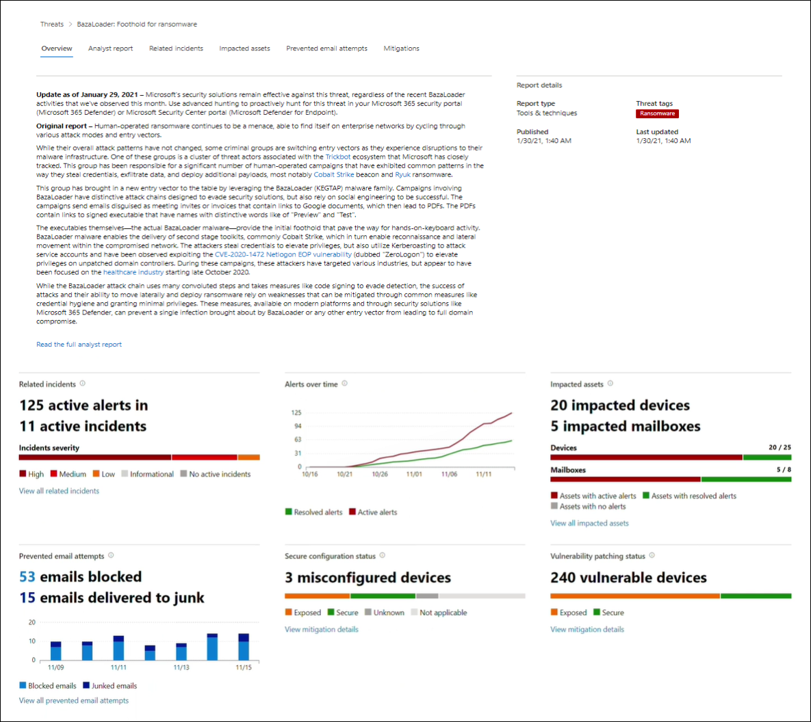

# Nachverfolgen und Reagieren auf neue Bedrohungen mit BedrohungsanalysenTrack and respond to emerging threats with threat analytics 

[!INCLUDE [Microsoft 365 Defender rebranding](../includes/microsoft-defender.md)]

**Gilt für:****Applies to:**
- Microsoft 365 DefenderMicrosoft 365 Defender

> Sie möchten Microsoft 365 Defender ausprobieren?Want to experience Microsoft 365 Defender? Sie können [in einer Laborumgebung auswerten](./mtp-evaluation.md?ocid=cx-docs-MTPtriallab) oder [ein Pilotprojekt in der Produktionsumgebung ausführen](./mtp-pilot.md?ocid=cx-evalpilot).You can [evaluate it in a lab environment](./mtp-evaluation.md?ocid=cx-docs-MTPtriallab) or [run your pilot project in production](./mtp-pilot.md?ocid=cx-evalpilot).
>

[!INCLUDE [Prerelease](../includes/prerelease.md)]

Die Bedrohungsanalyse ist unsere produktin-produktintelligente Lösung von experten Microsoft-Sicherheitsexperten, die Sicherheitsteams dabei unterstützen sollen, so effizient wie möglich zu sein, während sie neuen Bedrohungen ausgesetzt sind, einschließlich:Threat analytics is our in-product threat intelligence solution from expert Microsoft security researchers, designed to assist security teams to be as efficient as possible while facing emerging threats, including:

- Aktive Bedrohungsakteure und ihre KampagnenActive threat actors and their campaigns
- Beliebte und neue AngriffstechnikenPopular and new attack techniques
- Kritische SicherheitsrisikenCritical vulnerabilities
- Allgemeine AngriffsoberflächenCommon attack surfaces
- Verbreitete SchadsoftwarePrevalent malware

Sehen Sie sich dieses kurze Video an, um mehr darüber zu erfahren, wie Sie mithilfe von Bedrohungsanalysen die neuesten Bedrohungen nachverfolgen und beenden können.Watch this short video to learn more about how threat analytics can help you track the latest threats and stop them.

>[!VIDEO https://www.microsoft.com/en-us/videoplayer/embed/RWwJfU]

Sie können auf bedrohungsanalyse entweder von der oberen linken Seite der Navigationsleiste des Microsoft 365-Sicherheitsportals oder von einer dedizierten Dashboardkarte zugreifen, auf der die obersten Bedrohungen in Ihrer Organisation angezeigt werden. Das Erhalten von Einblicken in aktive oder laufende Kampagnen und wissen, was mithilfe von Bedrohungsanalysen zu tun ist, kann Ihr Sicherheitsteam mit fundierten Entscheidungen ausstatten.You can access threat analytics either from the upper left-hand side of Microsoft 365 security portal’s navigation bar, or from a dedicated dashboard card which shows the top threats in your org. Getting visibility on active or ongoing campaigns and knowing what to do through threat analytics can help equip your security operations team with informed decisions. 

_Zugriff auf Bedrohungsanalysen__Where to access threat analytics_

Da anspruchsvollere Gegner und neue Bedrohungen häufig und weit verbreitet entstehen, ist es wichtig, schnell in der Lage zu sein:With more sophisticated adversaries and new threats emerging frequently and prevalently, it's critical to be able to quickly:

- Identifizieren und Reagieren auf neue BedrohungenIdentify and react to emerging threats 
- Erfahren Sie, ob Sie derzeit angegriffen werdenLearn if you are currently under attack
- Bewerten der Auswirkungen der Bedrohung auf Ihre RessourcenAssess the impact of the threat to your assets
- Überprüfen Der Ausfallsicherheit gegenüber oder der Gefährdung der BedrohungenReview your resilience against or exposure to the threats
- Identifizieren der Maßnahmen zur Risikominderung, Wiederherstellung oder Verhinderung, die Sie zum Beenden oder Eindäugen der Bedrohungen ergreifen könnenIdentify the mitigation, recovery, or prevention actions you can take to stop or contain the threats

Jeder Bericht enthält eine Analyse einer nachverfolgten Bedrohung und umfassende Anleitungen zum Schutz vor dieser Bedrohung.Each report provides an analysis of a tracked threat and extensive guidance on how to defend against that threat. Es enthält auch Daten aus Ihrem Netzwerk, die angeben, ob die Bedrohung aktiv ist und ob Sie über entsprechende Schutzmaßnahmen verfügen.It also incorporates data from your network, indicating whether the threat is active and if you have applicable protections in place.

## Anzeigen des Dashboards für die BedrohungsanalyseView the threat analytics dashboard

Das Dashboard für die[Bedrohungsanalyse](https://security.microsoft.com/threatanalytics3)( security.microsoft.com/threatanalytics3 ) hebt die Berichte hervor, die für Ihre Organisation am relevantesten sind.The threat analytics dashboard ([security.microsoft.com/threatanalytics3](https://security.microsoft.com/threatanalytics3)) highlights the reports that are most relevant to your organization. Es fasst die Bedrohungen in den folgenden Abschnitten zusammen:It summarizes the threats in the following sections:

- **Neueste Bedrohungen**– listet die zuletzt veröffentlichten oder aktualisierten Bedrohungsberichte sowie die Anzahl der aktiven und aufgelösten Warnungen auf.**Latest threats**—lists the most recently published or updated threat reports, along with the number of active and resolved alerts.
- **Bedrohungen mit hoher** Auswirkung – listet die Bedrohungen auf, die die größten Auswirkungen auf Ihre Organisation haben.**High-impact threats**—lists the threats that have the highest impact to your organization. In diesem Abschnitt werden zuerst Bedrohungen mit der höchsten Anzahl aktiver und aufgelöster Warnungen aufgeführt.This section lists threats with the highest number of active and resolved alerts first.
- **Bedrohungszusammenfassung**– bietet die Gesamtwirkung aller nachverfolgten Bedrohungen, indem die Anzahl der Bedrohungen mit aktiven und aufgelösten Warnungen angezeigt wird.**Threat summary**—provides the overall impact of all tracked threats by showing the number of threats with active and resolved alerts.

Wählen Sie eine Bedrohung aus dem Dashboard aus, um den Bericht für diese Bedrohung anzuzeigen.Select a threat from the dashboard to view the report for that threat.

_Dashboard für Die Bedrohungsanalyse. Sie können auch auf das Suchsymbol klicken, um in einem Schlüsselwort im Zusammenhang mit dem Bericht zur Bedrohungsanalyse zu klicken, den Sie lesen möchten.__Threat analytics dashboard. You can also click the Search icon to key in a keyword related to the threat analytics report that you'd like to read._ 

## Anzeigen eines Berichts zur BedrohungsanalyseView a threat analytics report

Jeder Bericht zur Bedrohungsanalyse enthält Informationen in mehreren Abschnitten:Each threat analytics report provides information in several sections: 

- [**Übersicht****Overview**](#overview-quickly-understand-the-threat-assess-its-impact-and-review-defenses) 
- [**Analystenbericht****Analyst report**](#analyst-report-get-expert-insight-from-microsoft-security-researchers)
- [**Verwandte Vorfälle****Related incidents**](#related-incidents-view-and-manage-related-incidents)
- [**Auswirkungen auf Ressourcen****Impacted assets**](#impacted-assets-get-list-of-impacted-devices-and-mailboxes)
- [**Verhinderte E-Mail-Versuche****Prevented email attempts**](#prevented-email-attempts-view-blocked-or-junked-threat-emails)
- [**Gegenmaßnahmen****Mitigations**](#mitigations-review-list-of-mitigations-and-the-status-of-your-devices)

### Übersicht: Schnelles Verständnis der Bedrohung, Bewerten der Auswirkungen und Überprüfen der AbwehrOverview: Quickly understand the threat, assess its impact, and review defenses

Der **Abschnitt Übersicht** bietet eine Vorschau des detaillierten Analystenberichts.The **Overview** section provides a preview of the detailed analyst report. Außerdem enthält sie Diagramme, die die Auswirkungen der Bedrohung für Ihre Organisation und Ihre Gefährdung durch falsch konfigurierte und nicht gepatchte Geräte hervorheben.It also provides charts that highlight the impact of the threat to your organization and your exposure through misconfigured and unpatched devices.

_Übersichtsabschnitt eines Berichts zur Bedrohungsanalyse__Overview section of a threat analytics report_

#### Bewerten der Auswirkungen auf Ihre OrganisationAssess impact on your organization
Jeder Bericht enthält Diagramme, die Informationen zu den organisatorischen Auswirkungen einer Bedrohung liefern sollen:Each report includes charts designed to provide information about the organizational impact of a threat:
- **Verwandte Vorfälle –** bietet eine Übersicht über die Auswirkungen der nachverfolgten Bedrohung auf Ihre Organisation mit den folgenden Daten:**Related incidents**—provides an overview of the impact of the tracked threat to your organization with the following data:
  - Anzahl der aktiven Warnungen und anzahl der aktiven Vorfälle, mit der sie verknüpft sindNumber of active alerts and the number of active incidents they are associated with
  - Schweregrad aktiver VorfälleSeverity of active incidents
- **Warnungen im Laufe der** Zeit – zeigt die Anzahl der zugehörigen **aktiven** und **aufgelösten** Warnungen im Laufe der Zeit an.**Alerts over time**—shows the number of related **Active** and **Resolved** alerts over time. Die Anzahl der aufgelösten Warnungen gibt an, wie schnell Ihre Organisation auf Warnungen reagiert, die einer Bedrohung zugeordnet sind.The number of resolved alerts indicates how quickly your organization responds to alerts associated with a threat. Idealerweise sollte das Diagramm Warnungen anzeigen, die innerhalb weniger Tage aufgelöst wurden.Ideally, the chart should be showing alerts resolved within a few days.
- **Betroffene Objekte**– zeigt die Anzahl unterschiedlicher Geräte und E-Mail-Konten (Postfächer), die derzeit mindestens eine aktive Warnung der nachverfolgten Bedrohung zugeordnet sind.**Impacted assets**—shows the number of distinct devices and email accounts (mailboxes) that currently have at least one active alert associated with the tracked threat. Warnungen werden für Postfächer ausgelöst, die Bedrohungs-E-Mails erhalten haben.Alerts are triggered for mailboxes that received threat emails. Überprüfen Sie sowohl Richtlinien auf Organisationsebene als auch auf Benutzerebene auf Außerkraftsetzungen, die die Zustellung von Bedrohungs-E-Mails verursachen.Review both org- and user-level policies for overrides that cause the delivery of threat emails.
- **Verhinderte E-Mail-Versuche**– zeigt die Anzahl der E-Mails aus den letzten sieben Tagen an, die entweder vor der Zustellung blockiert oder an den Junk-E-Mail-Ordner zugestellt wurden.**Prevented email attempts**—shows the number of emails from the past seven days that were either blocked before delivery or delivered to the junk mail folder.

#### Überprüfen der Ausfallsicherheit und -haltungReview security resilience and posture
Jeder Bericht enthält Diagramme, die einen Überblick darüber bieten, wie widerstandsfähig Ihre Organisation gegen eine bestimmte Bedrohung ist:Each report includes charts that provide an overview of how resilient your organization is against a given threat:
- **Sicherer Konfigurationsstatus**– zeigt die Anzahl der Geräte mit falsch konfigurierten Sicherheitseinstellungen an.**Secure configuration status**—shows the number of devices with misconfigured security settings. Wenden Sie die empfohlenen Sicherheitseinstellungen an, um die Bedrohung zu mindern.Apply the recommended security settings to help mitigate the threat. Geräte gelten als **sicher,** wenn sie _alle_ nachverfolgten Einstellungen angewendet haben.Devices are considered **Secure** if they have applied _all_ the tracked settings.
- **Status des Sicherheitsrisikopatchings**– zeigt die Anzahl anfälliger Geräte an.**Vulnerability patching status**—shows the number of vulnerable devices. Wenden Sie Sicherheitsupdates oder Patches an, um von der Bedrohung ausgenutzte Sicherheitsrisiken zu schließen.Apply security updates or patches to address vulnerabilities exploited by the threat.

### Analystenbericht: Experten-Einblick von Microsoft-Sicherheitsforschern erhaltenAnalyst report: Get expert insight from Microsoft security researchers
Lesen Sie **im Abschnitt Analystenbericht** die detaillierten Experten-Schreibzugriffe durch.In the **Analyst report** section, read through the detailed expert write-up. Die meisten Berichte enthalten detaillierte Beschreibungen von Angriffsketten, einschließlich Taktiken und Techniken, die dem MITRE ATT&CK-Framework zugeordnet sind, umfassende Empfehlungen und leistungsstarke Anleitungen zur [Bedrohungssuche.](advanced-hunting-overview.md)Most reports provide detailed descriptions of attack chains, including tactics and techniques mapped to the MITRE ATT&CK framework, exhaustive lists of recommendations, and powerful [threat hunting](advanced-hunting-overview.md) guidance.

[Weitere Informationen zum AnalystenberichtLearn more about the analyst report](threat-analytics-analyst-reports.md)

### Verwandte Vorfälle: Anzeigen und Verwalten verwandter VorfälleRelated incidents: View and manage related incidents
Die **Registerkarte Verwandte Vorfälle** enthält die Liste aller Vorfälle im Zusammenhang mit der nachverfolgten Bedrohung.The **Related incidents** tab provides the list of all incidents related to the tracked threat. Sie können Vorfälle zuweisen oder Warnungen verwalten, die mit jedem Vorfall verknüpft sind.You can assign incidents or manage alerts linked to each incident. 

_Abschnitt "Verwandte Vorfälle" eines Berichts zur Bedrohungsanalyse__Related incidents section of a threat analytics report_

### Auswirkungen auf Ressourcen: Liste betroffener Geräte und Postfächer erhaltenImpacted assets: Get list of impacted devices and mailboxes
Eine Ressource wird als betroffen betrachtet, wenn sie von einer aktiven, nicht aufgelösten Warnung betroffen ist.An asset is considered impacted if it is affected by an active, unresolved alert. Auf **der Registerkarte Auswirkungen auf Ressourcen** werden die folgenden Arten von betroffenen Ressourcen aufgeführt:The **Impacted assets** tab lists the following types of impacted assets:
- **Betroffener Geräte**– Endpunkte, für die Microsoft Defender for Endpoint-Warnungen nicht aufgelöst wurden.**Impacted devices**—endpoints that have unresolved Microsoft Defender for Endpoint alerts. Diese Warnungen werden in der Regel bei Denkanzeigen bekannter Bedrohungsindikatoren und -aktivitäten ausgelöst.These alerts typically fire on sightings of known threat indicators and activities.
- **Auswirkungen auf Postfächer –** Postfächer, die E-Mail-Nachrichten empfangen haben, die Microsoft Defender für Office 365-Warnungen ausgelöst haben.**Impacted mailboxes**—mailboxes that have received email messages that have triggered Microsoft Defender for Office 365 alerts. Während die meisten Nachrichten, die Warnungen auslösen, in der Regel blockiert werden, können Richtlinien auf Benutzer- oder Organisationsebene Filter außer Kraft setzen.While most messages that trigger alerts are typically blocked, user- or org-level policies can override filters.

_Abschnitt "Auswirkungen auf Ressourcen" eines Berichts zur Bedrohungsanalyse__Impacted assets section of a threat analytics report_

### Verhinderte E-Mail-Versuche: Anzeigen blockierter oder junked Threat-E-MailsPrevented email attempts: View blocked or junked threat emails
Microsoft Defender für Office 365 blockiert in der Regel E-Mails mit bekannten Bedrohungsindikatoren, einschließlich schädlicher Links oder Anlagen.Microsoft Defender for Office 365 typically blocks emails with known threat indicators, including malicious links or attachments. In einigen Fällen senden proaktive Filtermechanismen, die auf verdächtige Inhalte überprüfen, stattdessen Bedrohungs-E-Mails an den Junk-E-Mail-Ordner.In some cases, proactive filtering mechanisms that check for suspicious content will instead send threat emails to the junk mail folder. In beiden Fällen ist die Wahrscheinlichkeit reduziert, dass der Code für das Starten von Schadsoftware auf dem Gerät von Bedrohungen gestartet wird.In either case, the chances of the threat launching malware code on the device is reduced.

Auf **der Registerkarte Verhinderte** E-Mail-Versuche werden alle E-Mails aufgeführt, die entweder vor der Zustellung blockiert oder von Microsoft Defender für Office 365 an den Junk-E-Mail-Ordner gesendet wurden.The **Prevented email attempts** tab lists all the emails that have either been blocked before delivery or sent to the junk mail folder by Microsoft Defender for Office 365. 

_Abschnitt "Verhinderte E-Mail-Versuche" eines Berichts zur Bedrohungsanalyse__Prevented email attempts section of a threat analytics report_

### Gegenmaßnahmen: Überprüfen der Liste der Gegenmaßnahmen und des Status Ihrer GeräteMitigations: Review list of mitigations and the status of your devices
Überprüfen Sie **im Abschnitt** Gegenmaßnahmen die Liste der spezifischen Empfehlungen für Aktionen, die Ihnen helfen können, Ihre Ausfallsicherheit gegenüber der Bedrohung zu erhöhen.In the **Mitigations** section, review the list of specific actionable recommendations that can help you increase your organizational resilience against the threat. Die Liste der nachverfolgten Gegenmaßnahmen umfasst:The list of tracked mitigations includes:

- **Sicherheitsupdates**– Bereitstellung von unterstützten Softwaresicherheitsupdates für Sicherheitsrisiken auf integrierten Geräten**Security updates**—deployment of supported software security updates for vulnerabilities found on onboarded devices
- **Unterstützte Sicherheitskonfigurationen****Supported security configurations**
  - In der Cloud zugestellter SchutzCloud-delivered protection  
  - Schutz potenziell unerwünschter Anwendungen (PUA)Potentially unwanted application (PUA) protection
  - EchtzeitschutzReal-time protection
 
Informationen zur Risikominderung in diesem Abschnitt enthalten Daten aus der Bedrohungs- und Sicherheitsrisikoverwaltung, die auch detaillierte Drilldowninformationen aus verschiedenen Links im Bericht enthält.Mitigation information in this section incorporates data from [threat and vulnerability management](/windows/security/threat-protection/microsoft-defender-atp/next-gen-threat-and-vuln-mgt), which also provides detailed drill-down information from various links in the report.

 

_Abschnitt "Risikominderungen" eines Berichts zur Bedrohungsanalyse__Mitigations section of a threat analytics report_

## Zusätzliche Berichtsdetails und EinschränkungenAdditional report details and limitations
>[!NOTE]
>Im Rahmen der einheitlichen Sicherheitserfahrung ist die Bedrohungsanalyse jetzt nicht nur für Microsoft Defender for Endpoint, sondern auch für Microsoft Defender für Office E5-Lizenzinhaber verfügbar.As part of the unified security experience, threat analytics is now available not just for Microsoft Defender for Endpoint, but also for Microsoft Defender for Office E5 license holders.
>Wenn Sie das Microsoft 365-Sicherheitsportal (Microsoft 365 Defender) nicht verwenden, können Sie die Berichtdetails (ohne die Microsoft Defender for Office-Daten) auch im Microsoft Defender Security Center-Portal (Microsoft Defender for Endpoint) anzeigen.If you are not using the Microsoft 365 security portal (Microsoft 365 Defender), you can also see the report details (without the Microsoft Defender for Office data) in the Microsoft Defender Security Center portal (Microsoft Defender for Endpoint). 

Für den Zugriff auf den Bericht zur Bedrohungsanalyse benötigen Sie bestimmte Rollen und Berechtigungen.To access threat analytics report you need certain roles and permissions. Weitere Informationen finden Sie unter Benutzerdefinierte Rollen in der rollenbasierten Zugriffssteuerung für [Microsoft 365 Defender.](custom-roles.md)See [Custom roles in role-based access control for Microsoft 365 Defender](custom-roles.md) for details.
  - Zum Anzeigen von Warnungen, Vorfällen oder Daten betroffener Objekte benötigen Sie Berechtigungen für Microsoft Defender for Office- oder Microsoft Defender for Endpoint-Benachrichtigungsdaten oder beides.To view alerts, incidents, or impacted assets data, you need to have permissions to Microsoft Defender for Office or Microsoft Defender for Endpoint alerts data, or both.
  - Um verhinderte E-Mail-Versuche anzeigen zu können, benötigen Sie Berechtigungen für Microsoft Defender for Office-Nachschlagedaten.To view prevented email attempts, you need to have permissions to Microsoft Defender for Office hunting data. 
  - Zum Anzeigen von Gegenmaßnahmen benötigen Sie Berechtigungen für Daten zur Bedrohungs- und Sicherheitsrisikoverwaltung in Microsoft Defender for Endpoint.To view mitigations, you need to have permissions to threat and vulnerability management data in Microsoft Defender for Endpoint.

Beachten Sie beim Blick auf die Daten zur Bedrohungsanalyse die folgenden Faktoren:When looking at the threat analytics data, remember the following factors:
- Diagramme spiegeln nur nachverfolgte Gegenmaßnahmen wider.Charts reflect only mitigations that are tracked. Überprüfen Sie die Berichtsübersicht auf zusätzliche Gegenmaßnahmen, die nicht in den Diagrammen angezeigt werden.Check the report overview for additional mitigations that are not shown in the charts.
- Gegenmaßnahmen garantieren keine vollständige Ausfallsicherheit.Mitigations don't guarantee complete resilience. Die bereitgestellten Gegenmaßnahmen spiegeln die bestmöglichen Maßnahmen wider, die zur Verbesserung der Ausfallsicherheit erforderlich sind.The provided mitigations reflect the best possible actions needed to improve resiliency.
- Geräte werden als "nicht verfügbar" gezählt, wenn sie keine Daten an den Dienst übermittelt haben.Devices are counted as "unavailable" if they have not transmitted data to the service.
- Antivirusbezogene Statistiken basieren auf Microsoft Defender Antivirus-Einstellungen.Antivirus-related statistics are based on Microsoft Defender Antivirus settings. Geräte mit Antivirenlösungen von Drittanbietern können als "verfügbar" angezeigt werden.Devices with third-party antivirus solutions can appear as "exposed".

## Verwandte ThemenRelated topics
- [Proaktives Aufsuchen von Bedrohungen mit erweiterter SucheProactively find threats with advanced hunting](advanced-hunting-overview.md) 
- [Verstehen des Abschnitts "Analystenbericht"Understand the analyst report section](threat-analytics-analyst-reports.md)
- [Bewerten und Beheben von Sicherheitsschwächen und -risikenAssess and resolve security weaknesses and exposures](/windows/security/threat-protection/microsoft-defender-atp/next-gen-threat-and-vuln-mgt)