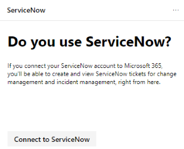

# Erstellen und Nachverfolgen von ServiceNow-Tickets im Microsoft 365 Security Center

Das [Microsoft 365-Sicherheitscenter](overview-security-center.md) wurde erweitert, sodass Tickets in ServiceNow nativ erstellt und nachverfolgt werden können. [Erfahren Sie mehr über ServiceNow](https://www.servicenow.com/)

Im Sicherheitscenter können Sicherheitsadministratoren eine [Microsoft Secure Score](microsoft-secure-score.md) -Verbesserungs Aktion direkt an ServiceNow senden und ein Ticket erstellen. Es können sowohl Incident Management als auch Change Management-Tickets erstellt werden. Sie können dann auf der Startseite des Sicherheitscenters und ServiceNow nachverfolgt werden.

- [**Informationen zu Voraussetzungen, Datenaustausch und Problembehandlung**](tickets.md)
- **Verwalten von ServiceNow-Tickets im Compliance Center** (demnächst verfügbar)

## Verbinden von Microsoft 365 Security Center mit ServiceNow

Navigieren Sie zur Microsoft 365-Sicherheitscenter-Startseite, um die ServiceNow-Verbindungskarte anzuzeigen.

Wählen Sie "mit ServiceNow verbinden" aus, um die ServiceNow-Setup Seite zu öffnen. Befolgen Sie die Anweisungen, um die Microsoft 365-Connector-APP zu autorisieren.

> [!NOTE]
> Bevor Sie die Verbindung zwischen dem Microsoft 365 Security Center und ServiceNow autorisieren, müssen Sie sicherstellen, dass Sie den Benutzernamen und das Kennwort für die Integration verwenden, die Sie in den Installationsschritten erstellt haben. Verwenden Sie Ihre persönlichen Anmeldeinformationen nicht.

Nachdem Sie die Anweisungen befolgt und die Verbindung autorisiert haben, zeigen Sie den Verbindungsstatus sowohl auf der Microsoft 365 Security Center-Verbindungsseite als auch in der APP-Erfahrung von Microsoft 365 Ticketing Connector für den ServiceNow an. Jetzt können Sie mit dem Erstellen von Aufgaben beginnen.

### Problembehandlung

Erfahren Sie häufig auftretende Fehler im Verbindungsprozess und wie Sie sie entschärfen können, im [Abschnitt Problembehandlung](tickets.md#troubleshooting).

## Erstellen einer Aufgabe und freigeben für ServiceNow

Nachdem die Integration eingerichtet wurde, erstellen Sie ServiceNow-Aufgaben basierend auf bestimmten [Microsoft Secure Score](microsoft-secure-score.md) -Verbesserungs Aktionen. Wechseln Sie zu einer Verbesserungs Aktion in Secure Score im Microsoft 365 Security Center-Portal, und wählen Sie **Freigeben**aus. Eine der Dropdownoptionen ist ServiceNow.

Es wird eine Aufgabe generiert, in der Sie die Priorität festlegen und den Namen, die Beschreibung oder das Fälligkeitsdatum bearbeiten können. Wenn alle erforderlichen Felder ausgefüllt sind, senden Sie die Aufgabe an ServiceNow.

Die Aufgabe ist in ServiceNow als Microsoft 365 Sicherheits-und Konfigurations Änderungsanforderung sichtbar.

## Nachverfolgen von Tickets

Nachdem ServiceNow Change Management-und Incident Management-Tickets erstellt wurden, werden diese auf Karten auf der Startseite von Microsoft 365 Security Center angezeigt. Auf diesen Karten können Sie ein Ticket erstellen, alle Tickets anzeigen oder die ServiceNow-Konfiguration verwalten.

  

Um die ServiceNow-Integration in das Microsoft 365 Security Center erneut zu überwachen oder zu verwalten, wählen Sie auf beiden Karten die Option **Manage ServiceNow Configuration** aus. Entfernen Sie von dort die aktuelle ServiceNow-Verbindung, und passen Sie die Ticket Statusnamen an.

Wenn ServiceNow-Tickets im Microsoft 365 Security Center angezeigt werden, werden Ihre Aufgaben an einer Stelle gespeichert, an der Sie neben den anderen Sicherheits Dashboard-Elementen nachverfolgt und bearbeitet werden können.

## Ressourcen

- [Informationen zu Voraussetzungen, Datenaustausch und Problembehandlung](tickets.md)
- [Microsoft-Sicherheitsbewertung](microsoft-secure-score.md)