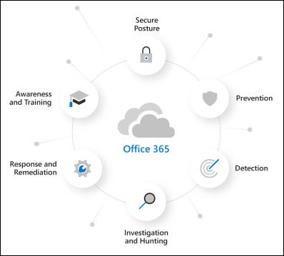

# Informationen zur Testversion von Microsoft Defender für Office 365About the Microsoft Defender for Office 365 trial

Microsoft Defender für Office 365 schützt Ihre Organisation vor böswilligen Bedrohungen durch E-Mail-Nachrichten, Links (URLs) und Tools für die Zusammenarbeit.Microsoft Defender for Office 365 safeguards your organization against malicious threats that are posed by email messages, links (URLs), and collaboration tools. Microsoft Defender für Office 365 umfasst:Defender for Office 365 includes:

- **Threat protection-Richtlinien**: Definieren von Richtlinien für den Bedrohungsschutz, um den geeigneten Schutzgrad für Ihre Organisation festzulegen.**Threat protection policies**: Define threat-protection policies to set the appropriate level of protection for your organization.
- **Berichte:** Anzeigen von Echtzeitberichten zum Überwachen der Leistung von Defender für Office 365 in Ihrer Organisation.**Reports**: View real-time reports to monitor Defender for Office 365 performance in your organization.
- **Bedrohungsuntersuchung- und Antwortfunktionen** Verwenden Sie brandneue Tools, um Bedrohungen zu untersuchen, zu verstehen, zu simulieren und zu verhindern.**Threat investigation and response capabilities**: Use leading-edge tools to investigate, understand, simulate, and prevent threats.
- **Automatisierte Untersuchungs- und Antwortfunktionen** Sparen Sie Zeit und Mühe beim Untersuchen und Beheben von Bedrohungen.**Automated investigation and response capabilities**: Save time and effort investigating and mitigating threats.

Eine Testversion von Microsoft Defender für Office 365 ist die einfachste Möglichkeit, die Funktionen von Defender für Office 365 auszuprobieren, und die Einrichtung dauert nur ein paar Klicks.A Microsoft Defender for Office 365 trial is the easiest way to try the capabilities of Defender for Office 365, and setting it up only takes a couple of clicks. Nach Abschluss der Testeinrichtung sind alle Funktionen von Defender für Office 365 Plan 1 und Plan 2 in der Organisation bis zu 90 Tage lang verfügbar.After the trial setup is complete, all Defender for Office 365 Plan 1 and Plan 2 capabilities are available in the organization for up to 90 days.

> [!NOTE]
> Die in diesem Artikel beschriebene automatisierte Konfiguration befindet sich derzeit in der öffentlichen Vorschau und ist möglicherweise nicht an Ihrem Standort verfügbar.The automated configuration that's described in this article is currently in Public Preview and might not be available in your location.

## GeschäftsbedingungenTerms and conditions

Die Testversion von Defender für Office 365 ist 90 Tage lang verfügbar und kann für alle Benutzer initiiert werden.The Defender for Office 365 trial is available for 90 days and can initiated for all of your users. Weitere Informationen finden Sie in den Nutzungsbedingungen für die Testversion von [Microsoft Defender für Office 365.](terms-of-use-defender-for-office-365-trial.md)For more information, see [Terms of use for the Microsoft Defender for Office 365 trial](terms-of-use-defender-for-office-365-trial.md).

## Einrichten einer Testversion von Defender für Office 365Set up a Defender for Office 365 trial

Mit einer Testversion können Organisationen die Funktionen von Defender für Office 365 problemlos einrichten und konfigurieren.A trial allows organizations to easily set up and configure the Defender for Office 365 capabilities. Während des Setups werden Richtlinien, die ausschließlich für Defender für Office 365 gelten (insbesondere sichere [Anlagen,](atp-safe-attachments.md)sichere Links und Identitätswechselschutz [in Antispamrichtlinien),](set-up-anti-phishing-policies.md#impersonation-settings-in-anti-phishing-policies-in-microsoft-defender-for-office-365)mithilfe der Standardvorlage für voreingestellte Sicherheitsrichtlinien [angewendet.](preset-security-policies.md)During setup, policies that are exclusive to Defender for Office 365 (specifically, [Safe Attachments](atp-safe-attachments.md), [Safe Links](atp-safe-links.md), and [impersonation protection in anti-spam policies](set-up-anti-phishing-policies.md#impersonation-settings-in-anti-phishing-policies-in-microsoft-defender-for-office-365)) are applied using the Standard template for [preset security policies](preset-security-policies.md).

Diese Richtlinien sind standardmäßig auf alle Benutzer in der Organisation begrenzt, Administratoren können die Richtlinien jedoch während oder nach der Einrichtung anpassen, sodass sie nur für bestimmte Benutzer gelten.By default, these policies are scoped to all users in the organization, but admins can customize the policies during or after setup so they apply only to specific users.

Während des Setups wird auch die MDO-Antwortfunktionalität (in MDO P2 oder einer entsprechenden Lösung) für die gesamte Organisation eingerichtet.During setup, MDO response functionality (found in MDO P2 or equivalent) is also setup for the entire organization. Es ist keine Richtliniende scoping erforderlich.No policy scoping is required.

## LizenzierungLicensing

Im Rahmen der Testeinrichtung werden die Defender für Office 365-Lizenzen automatisch auf die Organisation angewendet.As part of the trial setup, the Defender for Office 365 licenses are automatically applied to the organization. Die Lizenzen sind für die ersten 90 Tage kostenlos.The licenses are free of charge for the first 90 days.

## BerechtigungenPermissions

Zum Starten oder Beenden der Testversion müssen Sie Mitglied der Rollen **"Globaler Administrator"** oder **"Sicherheitsadministrator"** in Azure Active Directory sein.To start or end the trial, you need to be a member of the **Global Administrator** or **Security Administrator** roles in Azure Active Directory. Weitere Informationen finden Sie unter ["Informationen zu Administratorrollen".](https://docs.microsoft.com/microsoft-365/admin/add-users/about-admin-roles)For details, see [About admin roles](https://docs.microsoft.com/microsoft-365/admin/add-users/about-admin-roles).

## Weitere InformationenAdditional information

Nachdem Sie sich für die Testversion registriert haben, kann es bis zu zwei Stunden dauern, bis die Änderungen und Updates verfügbar sind.After you enroll in the trial, it might take up to 2 hours for the changes and updates to be available. Administratoren müssen sich abmelden und sich erneut anmelden, um die Änderungen zu sehen.And, admins must log out and log back in to see the changes.

Administratoren können die Testversion jederzeit deaktivieren, indem sie zur <> gehen.Admins can disable the trial at any point by going to the <> card.

## VerfügbarkeitAvailability

Die Testversion von Defender für Office 365 wird schrittweise für bestehende Kunden eingeführt, die bestimmte Kriterien (einschließlich Geografie) erfüllen und nicht über vorhandene Defender für Office 365 Plan 1- oder Plan 2-Lizenzen verfügen (im Abonnement oder als Add-On enthalten).The Defender for Office 365 trial is gradually rolling out to existing customers who meet specific criteria (including geography) and who don't have existing Defender for Office 365 Plan 1 or Plan 2 licenses (included in their subscription or as an add-on).

## Weitere Informationen zu Defender für Office 365Learn more about Defender for Office 365

Defender für Office 365 hilft Organisationen dabei, ihr Unternehmen zu sichern, indem sie eine umfassende Liste von Funktionen bieten.Defender for Office 365 helps organizations secure their enterprise by offering a comprehensive slate of capabilities.

Weitere Informationen zu Defender für Office 365 finden Sie in diesem [interaktiven Leitfaden.](https://techcommunity.microsoft.com/t5/video-hub/protect-your-organization-with-microsoft-365-defender/m-p/1671189)You can also learn more about Defender for Office 365 at this [interactive guide](https://techcommunity.microsoft.com/t5/video-hub/protect-your-organization-with-microsoft-365-defender/m-p/1671189).

### PräventionPrevention

Ein robuster Filterstapel verhindert eine Vielzahl von volumebasierten und gezielten Angriffen, einschließlich Unternehmens-E-Mail-Angriffen, Phishing mit Anmeldeinformationen, Ransomware und erweiterter Schadsoftware.A robust filtering stack prevents a wide variety of volume-based and targeted attacks including business email compromise, credential phishing, ransomware, and advanced malware.

- [Antiphishingrichtlinien: Exklusive Einstellungen in Defender für Office 365Anti-phishing policies: Exclusive settings in Defender for Office 365](set-up-anti-phishing-policies.md#exclusive-settings-in-anti-phishing-policies-in-microsoft-defender-for-office-365)
- [Sichere AnlagenSafe Attachments](atp-safe-attachments.md)
- [Sichere LinksSafe Links](atp-safe-links.md)

### ErkennungDetection

Branchenführende KI erkennt schädliche und verdächtige Inhalte und korreliert Angriffsmuster, um Kampagnen zu identifizieren, die dem Schutz ausweichen.Industry-leading AI detects malicious and suspicious content and correlates attack patterns to identify campaigns designed to evade protection.

- [Kampagnenansichten in Microsoft Defender für Office 365Campaign Views in Microsoft Defender for Office 365](campaigns.md)

### Untersuchung und SucheInvestigation and hunting

Leistungsstarke Erfahrungen helfen bei der Identifizierung, Priorisierung und Untersuchung von Bedrohungen mit erweiterten Funktionen für die Suche, um Angriffe in Office 365 nachverfolgt zu werden.Powerful experiences help identify, prioritize, and investigate threats, with advanced hunting capabilities to track attacks across Office 365.

- [Bedrohungs-Explorer und EchtzeiterkennungenThreat Explorer and Real-time detections](threat-explorer.md)
- [Echtzeitberichte in Defender für Office 365Real-time reports in Defender for Office 365](view-reports-for-atp.md)
- [Aufzeichnungen von Bedrohungen – neu und wichtigThreat Trackers - New and Noteworthy](threat-trackers.md)
- Integration in [Microsoft 365 Defender](https://docs.microsoft.com/microsoft-365/security/mtp/microsoft-threat-protection)Integration with [Microsoft 365 Defender](https://docs.microsoft.com/microsoft-365/security/mtp/microsoft-threat-protection)

### Antwort und ProblembehebungResponse and remediation

Umfangreiche Funktionen zur Reaktion auf Vorfälle und Automatisierung steigern die Effektivität und Effizienz Ihres Sicherheitsteams.Extensive incident response and automation capabilities amplify your security team’s effectiveness and efficiency.

- [Automatisierte Untersuchung und Reaktion (AIR) in Microsoft Defender für Office 365Automated investigation and response (AIR) in Microsoft Defender for Office 365](office-365-air.md)

### Sensibilisierung und SchulungAwareness and training

Umfangreiche Simulations- und Schulungsfunktionen zusammen mit integrierten Erfahrungen in Clientanwendungen fördern das Benutzerbewusstsein.Rich simulation and training capabilities along with integrated experiences within client applications build user awareness.

- [Erste Schritte mit dem AngriffssimulationstrainingGet started using Attack simulation training](attack-simulation-training-get-started.md)

### Sicherer PostureSecure posture

Empfohlene Vorlagen und Konfigurationseinblicke helfen Kunden, sich zu schützen und zu schützen.Recommended templates and configuration insights help customers get and stay secure.

- [Voreingestellte Sicherheitsrichtlinien in EOP und Microsoft Defender für Office 365Preset security policies in EOP and Microsoft Defender for Office 365](preset-security-policies.md)
- [Konfigurationsanalyse für Schutzrichtlinien in EOP und Microsoft Defender für Office 365](configuration-analyzer-for-security-policies.md).[Configuration analyzer for protection policies in EOP and Microsoft Defender for Office 365](configuration-analyzer-for-security-policies.md).

## Feedback gebenGive feedback

Ihr Feedback hilft uns, Ihre Umgebung besser vor erweiterten Angriffen zu schützen.Your feedback helps us get better at protecting your environment from advanced attacks. Teilen Sie Ihre Erfahrungen und Einblicke in Produktfunktionen und Testergebnisse.Share your experience and impressions of product capabilities and trial results.
