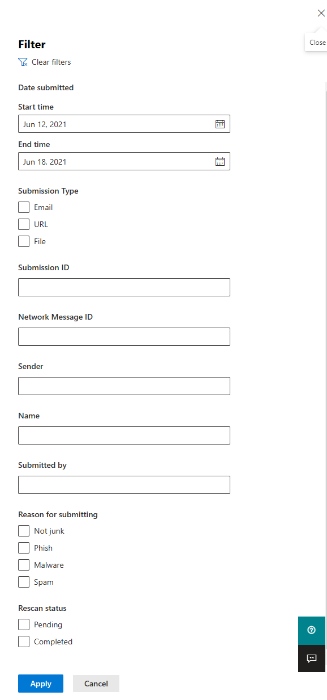

# Verwenden von Administrator-Übermittlung, um verdächtige Spam- oder Phishing-Nachrichten, URLs und Dateien an Microsoft zu übermitteln

[!INCLUDE [Microsoft 365 Defender rebranding](../includes/microsoft-defender-for-office.md)]

**Gilt für**
- [Exchange Online Protection](exchange-online-protection-overview.md)
- [Microsoft Defender für Office 365 Plan 1 und Plan 2](defender-for-office-365.md)

In Microsoft 365 Organisationen mit Exchange Online Postfächern können Administratoren das Übermittlungsportal im Microsoft 365 Defender-Portal verwenden, um E-Mail-Nachrichten, URLs und Anlagen zur Überprüfung an Microsoft zu senden.

Wenn Sie eine E-Mail-Nachricht übermitteln, erhalten Sie Folgendes:

- **E-Mail-Authentifizierungsprüfung:** Details dazu, ob die E-Mail-Authentifizierung bei der Zustellung erfolgreich war oder fehlgeschlagen ist.
- **Richtlinientreffer:** Informationen zu allen Richtlinien, die eingehende E-Mails in Ihrem Mandanten möglicherweise zugelassen oder blockiert haben, und überschreiben unsere Dienstfilterbewertungen.
- **Nutzlastreputation/-detonation:** Untersuchung aller URLs und Anlagen in der Nachricht.
- **Benotungsanalyse:** Überprüfung durch Benotungsprüfer, um zu überprüfen, ob Nachrichten bösartig sind oder nicht.

> [!IMPORTANT]
> Nutzlastreputation/-detonation und Bewertungsanalyse werden nicht in allen Mandanten durchgeführt. Informationen werden daran gehindert, sich außerhalb der Organisation zu befinden, wenn Daten die Mandantengrenze nicht zu Compliancezwecken verlassen sollen.

Weitere Möglichkeiten zum Übermitteln von E-Mail-Nachrichten, URLs und Anlagen an Microsoft finden Sie unter "Melden von [Nachrichten und Dateien an Microsoft".](report-junk-email-messages-to-microsoft.md)

## Was sollten Sie wissen, bevor Sie beginnen?

- Sie öffnen das Microsoft 365 Defender-Portal unter <https://security.microsoft.com/>. Um direkt zur Seite **"Übermittlungen"** zu wechseln, verwenden Sie <https://security.microsoft.com/reportsubmission> .

- Um Nachrichten und Dateien an Microsoft zu übermitteln, müssen Sie Mitglied einer der folgenden Rollengruppen sein:
  - **Organisationsverwaltung** oder **Sicherheitsleseberechtigter** im [Microsoft 365 Defender Portal.](permissions-microsoft-365-security-center.md)
  
    Beachten Sie, dass die Mitgliedschaft in dieser Rollengruppe erforderlich ist, um [Benutzerübermittlungen an das benutzerdefinierte Postfach anzuzeigen,](#view-user-submissions-to-microsoft) wie weiter unten in diesem Artikel beschrieben.

- Weitere Informationen dazu, wie Benutzer Nachrichten und Dateien an Microsoft übermitteln können, finden Sie unter ["Melden von Nachrichten und Dateien an Microsoft".](report-junk-email-messages-to-microsoft.md)

## Melden verdächtiger Inhalte an Microsoft

1. Wechseln Sie im Microsoft 365 Defender Portal zu **E-Mail-&** \> **Übermittlungen für die** Zusammenarbeit.

2. Überprüfen Sie auf der Seite **"Übermittlungen",** ob die Registerkarte **"Für Analyse übermittelt"** ausgewählt ist, und klicken Sie dann auf das  **"An Microsoft zur Analyse übermitteln".**

3. Verwenden Sie das Flyout **"An Microsoft übermitteln" zum Überprüfen** des Flyouts, das die Nachricht, URL oder E-Mail-Anlage wie in den folgenden Abschnitten beschrieben zu übermitteln scheint.

   > [!NOTE]
   > Datei- und URL-Übermittlungen sind in den Clouds nicht verfügbar, die nicht zulassen, dass Daten die Umgebung verlassen. Die Möglichkeit, Datei oder URL auszuwählen, ist abgeblendet.

### Senden einer fragebaren E-Mail an Microsoft

1. Überprüfen Sie im Feld **"Übermittlungstyp auswählen",** ob **"E-Mail"** in der Dropdownliste ausgewählt ist.

2. Verwenden Sie im Abschnitt **"Netzwerknachrichten-ID hinzufügen" oder "E-Mail-Datei hochladen"** eine der folgenden Optionen:
   - **Fügen Sie die E-Mail-Netzwerknachrichten-ID** hinzu: Dies ist ein GUID-Wert, der im **X-MS-Exchange-Organization-Network-Message-Id-Header** in der Nachricht oder im **X-MS-Office365-Filtering-Correlation-Id-Header** in isolierten Nachrichten verfügbar ist.
   - **Hochladen die E-Mail-Datei (MSG oder EML):** Klicken Sie auf **"Dateien durchsuchen".** Suchen Sie im daraufhin geöffneten Dialogfeld die EML- oder MSG-Datei, und wählen Sie sie aus, und klicken Sie dann auf **"Öffnen".**

   > [!NOTE]
   > Die Möglichkeit, Nachrichten ab 30 Tagen zu übermitteln, wurde für Defender für Office 365 Kunden vorübergehend ausgesetzt. Administratoren können nur 7 Tage zurückkehren.

3. Geben Sie im Feld **"Empfänger auswählen, der ein Problem hatte"** den Empfänger an, für den Sie eine Richtlinienüberprüfung ausführen möchten. Die Richtlinienüberprüfung bestimmt, ob die Überprüfung durch die E-Mail aufgrund von Benutzer- oder Organisationsrichtlinien umgangen wurde.

4. Wählen Sie im Abschnitt **"Auswählen eines Grunds für die Übermittlung an Microsoft"** eine der folgenden Optionen aus:
   - **Sollte nicht blockiert worden sein (falsch positiv)**
   - **Sollte blockiert worden sein:** In der **E-Mail sollte als angezeigter Abschnitt kategorisiert worden sein,** wählen Sie einen der folgenden Werte aus (wenn Sie nicht sicher sind, verwenden Sie Ihren besten Willen):
     - **Phishing**
     - **Spam**
     - **Schadsoftware**

5. Wenn Sie fertig sind, klicken Sie auf die Schaltfläche **"Absenden".**

> [!div class="mx-imgBorder"]
> 

### Senden einer verdächtigen URL an Microsoft

1. Wählen Sie im Feld **"Übermittlungstyp auswählen"** die **URL** aus der Dropdownliste aus.

2. Geben Sie in das angezeigte **URL-Feld** die vollständige URL ein (z. B. `https://www.fabrikam.com/marketing.html` ).

3. Wählen Sie im Abschnitt **"Auswählen eines Grunds für die Übermittlung an Microsoft"** eine der folgenden Optionen aus:
   - **Sollte nicht blockiert worden sein (falsch positiv)**
   - **Sollte blockiert worden sein:** In der URL sollte als angezeigter Abschnitt **kategorisiert worden sein,** wählen Sie **Phishing** oder **Schadsoftware** aus.

4. Wenn Sie fertig sind, klicken Sie auf die Schaltfläche **"Absenden".**

> [!div class="mx-imgBorder"]
> 

### Übermitteln einer verdächtigen E-Mail-Anlage an Microsoft

1. Wählen Sie im Feld **"Übermittlungstyp auswählen"** in der Dropdownliste die Option **"Datei"** aus.

2. Klicken Sie im angezeigten Abschnitt **"Datei"** auf **"Dateien durchsuchen".** Suchen Sie im daraufhin geöffneten Dialogfeld die Datei, wählen Sie sie aus, und klicken Sie dann auf **"Öffnen".**

3. Wählen Sie im Abschnitt **"Auswählen eines Grunds für die Übermittlung an Microsoft"** eine der folgenden Optionen aus:
   - **Sollte nicht blockiert worden sein (falsch positiv)**
   - **Sollte blockiert worden sein:** In der URL sollte als angezeigter Abschnitt **kategorisiert worden sein, schadsoftware** ist die einzige Wahl und wird automatisch ausgewählt. 

4. Wenn Sie fertig sind, klicken Sie auf die Schaltfläche **"Absenden".**

> [!div class="mx-imgBorder"]
> 

## Anzeigen von Administratorübermittlungen an Microsoft

1. Wechseln Sie im Microsoft 365 Defender Portal zu **E-Mail-&** \> **Übermittlungen für die** Zusammenarbeit.

2. Überprüfen Sie auf der Seite **"Übermittlungen",** ob die Registerkarte **"Für Analyse übermittelt"** ausgewählt ist.

   - Sie können die Einträge sortieren, indem Sie auf eine verfügbare Spaltenüberschrift klicken. Klicken Sie auf **Spalten anpassen,** um maximal sieben Spalten anzuzeigen. Die Standardwerte sind mit einem Sternchen (\*) gekennzeichnet:
     - **Übermittlungsname**\*
     - **Absender**\*
     - **Übermitteltes Datum**\*
     - **Übermittlungstyp**\*
     - **Grund für die Übermittlung**\*
     - **Status des erneuten Scannens**\*
     - **Erneutes Scanergebnis**\*
     - **Filterbewertung**
     - **Grund für Übermittlung/Blockierung**
     - **Übermittlungs-ID**
     - **Netzwerknachrichten-ID/Objekt-ID**
     - **Direction**
     - **Sender-IP**
     - **Massenkonforme Ebene (Bulk Compliant Level, BCL)**
     - **Ziel**
     - **Richtlinienaktion**
     - **Übermittelt von**

     Wenn Sie fertig sind, klicken Sie auf **"Übernehmen".**

   - Klicken Sie zum Filtern der Einträge auf **"Filtern".** Die verfügbaren Filter sind:
     - **Übermitteltes Datum:** **Startdatum** und **Enddatum.**
     - **Übermittlungstyp:** **E-Mail,** **URL** oder **Datei.**
     - **Übermittlungs-ID:** Ein GUID-Wert, der jeder Übermittlung zugewiesen wird.
     - **Netzwerknachrichten-ID**
     - **Sender**

     Wenn Sie fertig sind, klicken Sie auf **"Übernehmen".**

     > [!div class="mx-imgBorder"]
     > 

   - Klicken Sie zum Gruppieren der Einträge auf **"Gruppieren",** und wählen Sie einen der folgenden Werte aus der Dropdownliste aus:
     - **Keine**
     - **Type**
     - **Grund**
     - **Status**
     - **Erneutes Scanergebnis**

   - Klicken Sie zum Exportieren der Einträge auf **"Exportieren".** Speichern Sie im daraufhin angezeigten Dialogfeld die .csv Datei.

### Details zur erneuten Überprüfung der Administratorübermittlung

Nachrichten, die in Administratorübermittlungen übermittelt werden, werden überprüft, und die Ergebnisse werden im Flyout "Übermittlungsdetails" angezeigt:

- Mögliche Fehler in der E-Mail-Authentifizierung des Absenders zum Zeitpunkt der Auslieferung.
- Informationen zu Richtlinientreffern, welche die Bewertung über einer Nachricht beeinflusst oder überschrieben haben könnten.
- Aktuelle Detonationsergebnisse, um festzustellen, ob die in der Nachricht enthaltenen URLs oder Dateien böswillig waren oder nicht.
- Feedback von Benotungsprüfern.

Wenn eine Überschreibung gefunden wurde, sollte der erneute Scan in einigen Minuten abgeschlossen sein. Wenn es kein Problem bei der E-Mail-Authentifizierung gab oder die Zustellung nicht von einer Außerkraftsetzung betroffen war, kann das Feedback von Bewertern bis zu einem Tag dauern.

## Anzeigen von Benutzerübermittlungen an Microsoft

Wenn Sie das [Add-In "Nachricht melden",](enable-the-report-message-add-in.md)das [Add-In "Phishing melden"](enable-the-report-phish-add-in.md)bereitgestellt haben oder Benutzer die [integrierte Berichterstellung in Outlook im Web](report-junk-email-and-phishing-scams-in-outlook-on-the-web-eop.md)verwenden, können Sie sehen, welche Benutzer auf der Registerkarte **"Benutzer gemeldete Nachrichten"** berichtigen.

1. Wechseln Sie im Microsoft 365 Defender Portal zu **E-Mail-&** \> **Übermittlungen für** die Zusammenarbeit.

2. Wählen Sie auf der Seite **"Übermittlungen"** die Registerkarte **"Vom Benutzer gemeldete Nachrichten"** aus.

   - Sie können die Einträge sortieren, indem Sie auf eine verfügbare Spaltenüberschrift klicken. Klicken Sie auf **Spalten anpassen,** um maximal sieben Spalten anzuzeigen. Die Standardwerte sind mit einem Sternchen (\*) gekennzeichnet:

     - **E-Mail-Betreff**\*
     - **Gemeldet von**\*
     - **Gemeldetes Datum**\*
     - **Absender**\*
     - **Gemeldeter Grund**\*
     - **Erneutes Scanergebnis**\*
     - **Gemeldete ID der Nachricht**
     - **Netzwerknachrichten-ID**
     - **Sender-IP**
     - **Phishing-Simulation**

     Wenn Sie fertig sind, klicken Sie auf **"Übernehmen".**

   - Klicken Sie zum Filtern der Einträge auf **"Filtern".** Die verfügbaren Filter sind:
     - **Gemeldetes Datum**: **Startdatum** und **Enddatum.**
     - **Berichtet von**
     - **E-Mail-Betreff**
     - **Gemeldete ID der Nachricht**
     - **Netzwerknachrichten-ID**
     - **Sender**
     - **Gemeldeter Grund:** **keine Junk-,** **Phishing-** oder **Spam-Nachrichten.**
     - **Phishing-Simulation:** **Ja** oder **Nein**

     Wenn Sie fertig sind, klicken Sie auf **"Übernehmen".**

     > [!div class="mx-imgBorder"]
     > 

   - Klicken Sie zum Gruppieren der Einträge auf **"Gruppieren",** und wählen Sie einen der folgenden Werte aus der Dropdownliste aus:
     - **Keine**
     - **Grund**
     - **Sender**
     - **Berichtet von**
     - **Erneutes Scanergebnis**
     - **Phishing-Simulation**

   - Klicken Sie zum Exportieren der Einträge auf **"Exportieren".** Speichern Sie im daraufhin angezeigten Dialogfeld die .csv Datei.

> [!NOTE]
> Wenn Organisationen so konfiguriert sind, dass von Benutzern gemeldete Nachrichten nur an das benutzerdefinierte Postfach gesendet werden, werden gemeldete Nachrichten nicht zur erneuten Überprüfung gesendet, und die Ergebnisse in **den vom Benutzer gemeldeten Nachrichten** sind immer leer.

### Rückgängigmachen von Benutzerübermittlungen

Sobald ein Benutzer eine verdächtige E-Mail an das benutzerdefinierte Postfach sendet, haben der Benutzer und der Administrator keine Möglichkeit, die Übermittlung rückgängig zu machen. Wenn der Benutzer die E-Mail wiederherstellen möchte, steht sie für die Wiederherstellung in den Ordnern "Gelöschte Elemente" oder "Junk-E-Mail" zur Verfügung.

### Senden von Nachrichten aus dem benutzerdefinierten Postfach an Microsoft

Wenn Sie das benutzerdefinierte Postfach so konfiguriert haben, dass von Benutzern gemeldete Nachrichten abgefangen werden, ohne die Nachrichten an Microsoft zu senden, können Sie bestimmte Nachrichten suchen und zur Analyse an Microsoft senden. Dadurch wird eine Benutzerübermittlung effektiv an eine Administratorübermittlung verschoben.

Wählen Sie auf der Registerkarte **"Vom Benutzer gemeldete Nachrichten"** eine Nachricht in der Liste aus, klicken Sie auf **"Zur Analyse an Microsoft übermitteln",** und wählen Sie dann einen der folgenden Werte aus der Dropdownliste aus:

- **Bericht sauber**
- **Melden von Phishing**
- **Melden von Schadsoftware**
- **Melden von Spam**
- **Untersuchung auslösen**

> [!div class="mx-imgBorder"]
> 
