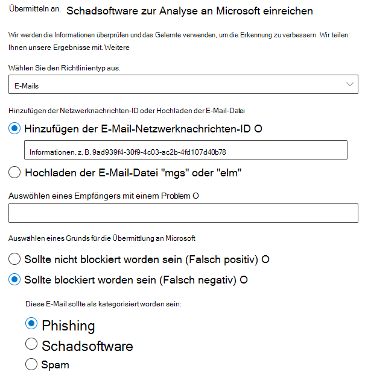
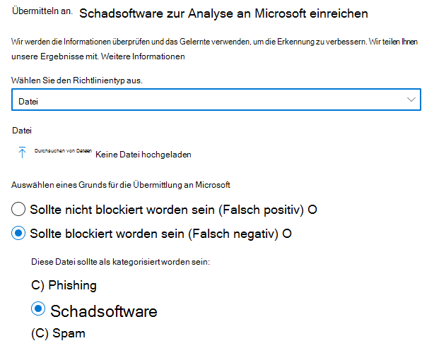
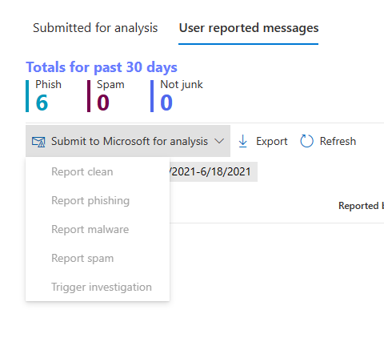

# Verwenden von Administrator-Übermittlung, um verdächtige Spam- oder Phishing-Nachrichten, URLs und Dateien an Microsoft zu übermittelnUse Admin Submission to submit suspected spam, phish, URLs, and files to Microsoft

[!INCLUDE [Microsoft 365 Defender rebranding](../includes/microsoft-defender-for-office.md)]

**Gilt für****Applies to**
- [Exchange Online ProtectionExchange Online Protection](exchange-online-protection-overview.md)
- [Microsoft Defender für Office 365 Plan 1 und Plan 2Microsoft Defender for Office 365 plan 1 and plan 2](defender-for-office-365.md)

In Microsoft 365 Organisationen mit Exchange Online Postfächern können Administratoren das Übermittlungsportal im Microsoft 365 Defender-Portal verwenden, um E-Mail-Nachrichten, URLs und Anlagen zur Überprüfung an Microsoft zu übermitteln.In Microsoft 365 organizations with Exchange Online mailboxes, admins can use the Submissions portal in the Microsoft 365 Defender portal to submit email messages, URLs, and attachments to Microsoft for scanning.

Wenn Sie eine E-Mail-Nachricht übermitteln, erhalten Sie Folgendes:When you submit an email message, you will get:

- **E-Mail-Authentifizierungsprüfung:** Details dazu, ob die E-Mail-Authentifizierung bei der Zustellung erfolgreich war oder fehlgeschlagen ist.**Email authentication check**: Details on whether email authentication passed or failed when it was delivered.
- **Richtlinientreffer:** Informationen zu allen Richtlinien, die eingehende E-Mails in Ihrem Mandanten möglicherweise zugelassen oder blockiert haben, und überschreiben unsere Dienstfilterbewertungen.**Policy hits**: Information about any policies that may have allowed or blocked the incoming email into your tenant, overriding our service filter verdicts.
- **Nutzlastreputation/-detonation:** Untersuchung aller URLs und Anlagen in der Nachricht.**Payload reputation/detonation**: Examination of any URLs and attachments in the message.
- **Benotungsanalyse:** Überprüfung durch Benotungsprüfer, um zu überprüfen, ob Nachrichten bösartig sind oder nicht.**Grader analysis**: Review done by human graders in order to confirm whether or not messages are malicious.

> [!IMPORTANT]
> Nutzlastreputation/-detonation und Bewertungsanalyse werden nicht in allen Mandanten durchgeführt.Payload reputation/detonation and grader analysis are not done in all tenants. Informationen werden daran gehindert, sich außerhalb der Organisation zu befinden, wenn Daten die Mandantengrenze nicht zu Compliancezwecken verlassen sollen.Information is blocked from going outside the organization when data is not supposed to leave the tenant boundary for compliance purposes.

Weitere Möglichkeiten zum Übermitteln von E-Mail-Nachrichten, URLs und Anlagen an Microsoft finden Sie unter "Melden von [Nachrichten und Dateien an Microsoft".](report-junk-email-messages-to-microsoft.md)For other ways to submit email messages, URLs, and attachments to Microsoft, see [Report messages and files to Microsoft](report-junk-email-messages-to-microsoft.md).

## Was sollten Sie wissen, bevor Sie beginnen?What do you need to know before you begin?

- Sie öffnen das Microsoft 365 Defender-Portal unter <https://security.microsoft.com/>.You open the Microsoft 365 Defender portal at <https://security.microsoft.com/>. Um direkt zur Seite **"Übermittlungen"** zu wechseln, verwenden Sie <https://security.microsoft.com/reportsubmission> .To go directly to the **Submissions** page, use <https://security.microsoft.com/reportsubmission>.

- Um Nachrichten und Dateien an Microsoft zu übermitteln, müssen Sie Mitglied einer der folgenden Rollengruppen sein:To submit messages and files to Microsoft, you need to be a member of one of the following role groups:
  - **Organisationsverwaltung** oder **Sicherheitsleseberechtigter** im [Microsoft 365 Defender Portal.](permissions-microsoft-365-security-center.md)**Organization Management** or **Security Reader** in the [Microsoft 365 Defender portal](permissions-microsoft-365-security-center.md).
  - **Organisationsverwaltung** in [Exchange Online](/Exchange/permissions-exo/permissions-exo#role-groups).**Organization Management** in [Exchange Online](/Exchange/permissions-exo/permissions-exo#role-groups).

    Beachten Sie, dass die Mitgliedschaft in dieser Rollengruppe erforderlich ist, um [Benutzerübermittlungen an das benutzerdefinierte Postfach anzuzeigen,](#view-user-submissions-to-microsoft) wie weiter unten in diesem Artikel beschrieben.Note that membership in this role group is required to [View user submissions to the custom mailbox](#view-user-submissions-to-microsoft) as described later in this article.

- Weitere Informationen dazu, wie Benutzer Nachrichten und Dateien an Microsoft übermitteln können, finden Sie unter ["Melden von Nachrichten und Dateien an Microsoft".](report-junk-email-messages-to-microsoft.md)For more information about how users can submit messages and files to Microsoft, see [Report messages and files to Microsoft](report-junk-email-messages-to-microsoft.md).

## Melden verdächtiger Inhalte an MicrosoftReport suspicious content to Microsoft

1. Wechseln Sie im Microsoft 365 Defender Portal zu **E-Mail-&** \> **Übermittlungen für** die Zusammenarbeit.In the Microsoft 365 Defender portal, go to **Email & collaboration** \> **Submissions**.

2. Überprüfen Sie auf der Seite **"Übermittlungen",** ob die Registerkarte **"Für Analyse übermittelt"** ausgewählt ist, und klicken Sie dann auf das  **"An Microsoft zur Analyse übermitteln".**On the **Submissions** page, verify that the **Submitted for analysis** tab is selected, and then click  **Submit to Microsoft for analysis**.

3. Verwenden Sie das Flyout **"An Microsoft übermitteln" zum Überprüfen** des Flyouts, das die Nachricht, URL oder E-Mail-Anlage wie in den folgenden Abschnitten beschrieben zu übermitteln scheint.Use the **Submit to Microsoft for review** flyout that appears to submit the message, URL, or email attachment as described in the following sections.

### Senden einer fragebaren E-Mail an MicrosoftSubmit a questionable email to Microsoft

1. Überprüfen Sie im Feld **"Übermittlungstyp auswählen",** ob **"E-Mail"** in der Dropdownliste ausgewählt ist.In the **Select the submission type** box, verify that **Email** is selected in the drop down list.

2. Verwenden Sie im Abschnitt **"Netzwerknachrichten-ID hinzufügen" oder "E-Mail-Datei hochladen"** eine der folgenden Optionen:In the **Add the network message ID or upload the email file** section, use one of the following options:
   - **Fügen Sie die E-Mail-Netzwerknachrichten-ID** hinzu: Dies ist ein GUID-Wert, der im **X-MS-Exchange-Organization-Network-Message-Id-Header** in der Nachricht oder im **X-MS-Office365-Filtering-Correlation-Id-Header** in isolierten Nachrichten verfügbar ist.**Add the email network message ID**: This is a GUID value that's available in the **X-MS-Exchange-Organization-Network-Message-Id** header in the message or in the **X-MS-Office365-Filtering-Correlation-Id** header in quarantined messages.
   - **Hochladen die E-Mail-Datei (MSG oder EML):** Klicken Sie auf **"Dateien durchsuchen".****Upload the email file (.msg or .eml)**: Click **Browse files**. Suchen Sie im daraufhin geöffneten Dialogfeld die EML- oder MSG-Datei, und wählen Sie sie aus, und klicken Sie dann auf **"Öffnen".**In the dialog that opens, find and select the .eml or .msg file, and then click **Open**.

   > [!NOTE]
   > Die Möglichkeit, Nachrichten ab 30 Tagen zu übermitteln, wurde für Defender für Office 365 Kunden vorübergehend ausgesetzt.The ability to submit messages as old as 30 days has been temporarily suspended for Defender for Office 365 customers. Administratoren können nur 7 Tage zurückkehren.Admins will only be able to go back 7 days.

3. Geben Sie im Feld **"Empfänger auswählen, der ein Problem hatte"** den Empfänger an, für den Sie eine Richtlinienüberprüfung ausführen möchten.In the **Choose a recipient who had an issue** box, specify the recipient that you would like to run a policy check against. Die Richtlinienüberprüfung bestimmt, ob die Überprüfung durch die E-Mail aufgrund von Benutzer- oder Organisationsrichtlinien umgangen wurde.The policy check will determine if the email bypassed scanning due to user or organization policies.

4. Wählen Sie im Abschnitt **"Auswählen eines Grunds für die Übermittlung an Microsoft"** eine der folgenden Optionen aus:In the **Select a reason for submitting to Microsoft** section, select one of the following options:
   - **Sollte nicht blockiert worden sein (falsch positiv)****Should not have been blocked (false positive)**
   - **Sollte blockiert worden sein:** In der **E-Mail sollte als angezeigter Abschnitt kategorisiert worden sein,** wählen Sie einen der folgenden Werte aus (wenn Sie nicht sicher sind, verwenden Sie Ihren besten Willen):**Should have been blocked**: In the **The email should have been categorized as** section that appears, select one of the following values (if you're not sure, use your best judgement):
     - **Phishing****Phish**
     - **Spam****Spam**
     - **Schadsoftware****Malware**

5. Wenn Sie fertig sind, klicken Sie auf die Schaltfläche **"Absenden".**When you're finished, click the **Submit** button.

> [!div class="mx-imgBorder"]
> 

### Senden einer verdächtigen URL an MicrosoftSend a suspect URL to Microsoft

1. Wählen Sie im Feld **"Übermittlungstyp auswählen"** die **URL** aus der Dropdownliste aus.In the **Select the submission type** box, select **URL** from the drop down list.

2. Geben Sie in das angezeigte **URL-Feld** die vollständige URL ein (z. B. `https://www.fabrikam.com/marketing.html` ).In the **URL** box that appears, enter the full URL (for example, `https://www.fabrikam.com/marketing.html`).

3. Wählen Sie im Abschnitt **"Auswählen eines Grunds für die Übermittlung an Microsoft"** eine der folgenden Optionen aus:In the **Select a reason for submitting to Microsoft** section, select one of the following options:
   - **Sollte nicht blockiert worden sein (falsch positiv)****Should not have been blocked (false positive)**
   - **Sollte blockiert worden sein:** In der URL sollte als angezeigter Abschnitt **kategorisiert worden sein,** wählen Sie **Phishing** oder **Schadsoftware** aus.**Should have been blocked**: In the **This URL should have been categorized as** section that appears, select **Phish** or **Malware**.

4. Wenn Sie fertig sind, klicken Sie auf die Schaltfläche **"Absenden".**When you're finished, click the **Submit** button.

> [!div class="mx-imgBorder"]
> 

### Übermitteln einer verdächtigen E-Mail-Anlage an MicrosoftSubmit a suspected email attachment to Microsoft

1. Wählen Sie im Feld **"Übermittlungstyp auswählen"** in der Dropdownliste die Option **"Datei"** aus.In the **Select the submission type** box, select **File** from the drop down list.

2. Klicken Sie im angezeigten Abschnitt **"Datei"** auf **"Dateien durchsuchen".**In the **File** section that appears, click **Browse files**. Suchen Sie im daraufhin geöffneten Dialogfeld die Datei, wählen Sie sie aus, und klicken Sie dann auf **"Öffnen".**In the dialog that opens, find and select the file, and then click **Open**.

3. Wählen Sie im Abschnitt **"Auswählen eines Grunds für die Übermittlung an Microsoft"** eine der folgenden Optionen aus:In the **Select a reason for submitting to Microsoft** section, select one of the following options:
   - **Sollte nicht blockiert worden sein (falsch positiv)****Should not have been blocked (false positive)**
   - **Sollte blockiert worden sein:** In der URL sollte als angezeigter Abschnitt **kategorisiert worden sein, schadsoftware** ist die einzige Wahl und wird automatisch ausgewählt. **Should have been blocked**: In the **This URL should have been categorized as** section that appears, **Malware** is the only choice, and is automatically selected.

4. Wenn Sie fertig sind, klicken Sie auf die Schaltfläche **"Absenden".**When you're finished, click the **Submit** button.

> [!div class="mx-imgBorder"]
> 

## Anzeigen von Administratorübermittlungen an MicrosoftView admin submissions to Microsoft

1. Wechseln Sie im Microsoft 365 Defender Portal zu **E-Mail-&** \> **Übermittlungen für** die Zusammenarbeit.In the Microsoft 365 Defender portal, go to **Email & collaboration** \> **Submissions**.

2. Überprüfen Sie auf der Seite **"Übermittlungen",** ob die Registerkarte **"Für Analyse übermittelt"** ausgewählt ist.On the **Submissions** page, verify that the **Submitted for analysis** tab is selected.

   - Sie können die Einträge sortieren, indem Sie auf eine verfügbare Spaltenüberschrift klicken.You can sort the entries by clicking on an available column header. Klicken Sie auf **Spalten anpassen,** um maximal sieben Spalten anzuzeigen.Click **Customize columns** to show a maximum of seven columns. Die Standardwerte sind mit einem Sternchen (\*) gekennzeichnet:The default values are marked with an asterisk (\*):
     - **Übermittlungsname**\***Submission name**\*
     - **Absender**\***Sender**\*
     - **Übermitteltes Datum**\***Date submitted**\*
     - **Übermittlungstyp**\***Submission type**\*
     - **Grund für die Übermittlung**\***Reason for submitting**\*
     - **Status des erneuten Scannens**\***Rescan status**\*
     - **Erneutes Scanergebnis**\***Rescan result**\*
     - **Filterbewertung****Filter verdict**
     - **Grund für Übermittlung/Blockierung****Delivery/Block reason**
     - **Übermittlungs-ID****Submission ID**
     - **Netzwerknachrichten-ID/Objekt-ID****Network Message ID/Object ID**
     - **Richtung****Direction**
     - **Sender-IP****Sender IP**
     - **Massenkonforme Ebene (Bulk Compliant Level, BCL)****Bulk compliant level (BCL)**
     - **Ziel****Destination**
     - **Richtlinienaktion****Policy action**
     - **Übermittelt von****Submitted by**

     Wenn Sie fertig sind, klicken Sie auf **"Übernehmen".**When you're finished, click **Apply**.

   - Klicken Sie zum Filtern der Einträge auf **"Filtern".**To filter the entries, click **Filter**. Die verfügbaren Filter sind:The available filters are:
     - **Übermitteltes Datum:** **Startdatum** und **Enddatum.****Date submitted**: **Start date** and **End date**.
     - **Übermittlungstyp:** **E-Mail,** **URL** oder **Datei.****Submission type**: **Email**, **URL**, or **File**.
     - **Übermittlungs-ID:** Ein GUID-Wert, der jeder Übermittlung zugewiesen wird.**Submission ID**: A GUID value that's assigned to every submission.
     - **Netzwerknachrichten-ID****Network Message ID**
     - **Sender****Sender**

     Wenn Sie fertig sind, klicken Sie auf **"Übernehmen".**When you're finished, click **Apply**.

     > [!div class="mx-imgBorder"]
     > 

   - Klicken Sie zum Gruppieren der Einträge auf **"Gruppieren",** und wählen Sie einen der folgenden Werte aus der Dropdownliste aus:To group the entries, click **Group** and select one of the following values from the drop down list:
     - **Keine****None**
     - **Typ****Type**
     - **Grund****Reason**
     - **Status****Status**
     - **Erneutes Scanergebnis****Rescan result**

   - Klicken Sie zum Exportieren der Einträge auf **"Exportieren".**To export the entries, click **Export**. Speichern Sie im daraufhin angezeigten Dialogfeld die .csv Datei.In the dialog that appears, save the .csv file.

### Details zur erneuten Überprüfung der AdministratorübermittlungAdmin submission rescan details

Nachrichten, die in Administratorübermittlungen übermittelt werden, werden überprüft, und die Ergebnisse werden im Flyout "Übermittlungsdetails" angezeigt:Messages that are submitted in admin submissions are reviewed and results shown in the submissions detail flyout:

- Mögliche Fehler in der E-Mail-Authentifizierung des Absenders zum Zeitpunkt der Auslieferung.If there was a failure in the sender's email authentication at the time of delivery.
- Informationen zu Richtlinientreffern, welche die Bewertung über einer Nachricht beeinflusst oder überschrieben haben könnten.Information about any policy hits that could have affected or overridden the verdict of a message.
- Aktuelle Detonationsergebnisse, um festzustellen, ob die in der Nachricht enthaltenen URLs oder Dateien böswillig waren oder nicht.Current detonation results to see if the URLs or files contained in the message were malicious or not.
- Feedback von Benotungsprüfern.Feedback from graders.

Wenn eine Überschreibung gefunden wurde, sollte der erneute Scan in einigen Minuten abgeschlossen sein.If an override was found, the rescan should complete in several minutes. Wenn es kein Problem bei der E-Mail-Authentifizierung gab oder die Zustellung nicht von einer Außerkraftsetzung betroffen war, kann das Feedback von Bewertern bis zu einem Tag dauern.If there wasn't a problem in email authentication or delivery wasn't affected by an override, then the feedback from graders could take up to a day.

## Anzeigen von Benutzerübermittlungen an MicrosoftView user submissions to Microsoft

Wenn Sie das [Add-In "Nachricht melden",](enable-the-report-message-add-in.md)das [Add-In "Phishing melden"](enable-the-report-phish-add-in.md)bereitgestellt haben oder Personen die [integrierte Berichterstellung in Outlook im Web](report-junk-email-and-phishing-scams-in-outlook-on-the-web-eop.md)verwenden, können Sie sehen, welche Benutzer auf der Registerkarte **"Benutzer gemeldete Nachrichten"** berichtigen.If you've deployed the [Report Message add-in](enable-the-report-message-add-in.md), the [Report Phishing add-in](enable-the-report-phish-add-in.md), or people use the [built-in reporting in Outlook on the web](report-junk-email-and-phishing-scams-in-outlook-on-the-web-eop.md), you can see what users are reporting on the **User reported message** tab.

1. Wechseln Sie im Microsoft 365 Defender Portal zu **E-Mail-&** \> **Übermittlungen für** die Zusammenarbeit.In the Microsoft 365 Defender portal, go to **Email & collaboration** \> **Submissions**.

2. Wählen Sie auf der Seite **"Übermittlungen"** die Registerkarte **"Vom Benutzer gemeldete Nachrichten"** aus.On the **Submissions** page, select the **User reported messages** tab.

   - Sie können die Einträge sortieren, indem Sie auf eine verfügbare Spaltenüberschrift klicken.You can sort the entries by clicking on an available column header. Klicken Sie auf **Spalten anpassen,** um maximal sieben Spalten anzuzeigen.Click **Customize columns** to show a maximum of seven columns. Die Standardwerte sind mit einem Sternchen (\*) gekennzeichnet:The default values are marked with an asterisk (\*):

     - **E-Mail-Betreff**\***Email subject**\*
     - **Gemeldet von**\***Reported by**\*
     - **Gemeldetes Datum**\***Date reported**\*
     - **Absender**\***Sender**\*
     - **Gemeldeter Grund**\***Reported reason**\*
     - **Erneutes Scanergebnis**\***Rescan result**\*
     - **Gemeldete ID der Nachricht****Message reported ID**
     - **Netzwerknachrichten-ID****Network Message ID**
     - **Sender-IP****Sender IP**
     - **Phishing-Simulation****Phish simulation**

     Wenn Sie fertig sind, klicken Sie auf **"Übernehmen".**When you're finished, click **Apply**.

   - Klicken Sie zum Filtern der Einträge auf **"Filtern".**To filter the entries, click **Filter**. Die verfügbaren Filter sind:The available filters are:
     - **Gemeldetes Datum**: **Startdatum** und **Enddatum.****Date reported**: **Start date** and **End date**.
     - **Berichtet von****Reported by**
     - **E-Mail-Betreff****Email subject**
     - **Gemeldete ID der Nachricht****Message reported ID**
     - **Netzwerknachrichten-ID****Network Message ID**
     - **Sender****Sender**
     - **Gemeldeter Grund:** **keine Junk-,** **Phishing-** oder **Spam-Nachrichten.****Reported reason**: **Not junk**, **Phish**, or **Spam**.
     - **Phishing-Simulation:** **Ja** oder **Nein****Phish simulation**: **Yes** or **No**

     Wenn Sie fertig sind, klicken Sie auf **"Übernehmen".**When you're finished, click **Apply**.

     > [!div class="mx-imgBorder"]
     > 

   - Klicken Sie zum Gruppieren der Einträge auf **"Gruppieren",** und wählen Sie einen der folgenden Werte aus der Dropdownliste aus:To group the entries, click **Group** and select one of the following values from the drop down list:
     - **Keine****None**
     - **Grund****Reason**
     - **Sender****Sender**
     - **Berichtet von****Reported by**
     - **Erneutes Scanergebnis****Rescan result**
     - **Phishing-Simulation****Phish simulation**

   - Klicken Sie zum Exportieren der Einträge auf **"Exportieren".**To export the entries, click **Export**. Speichern Sie im daraufhin angezeigten Dialogfeld die .csv Datei.In the dialog that appears, save the .csv file.

> [!NOTE]
> Wenn Organisationen so konfiguriert sind, dass von Benutzern gemeldete Nachrichten nur an das benutzerdefinierte Postfach gesendet werden, werden gemeldete Nachrichten nicht zur erneuten Überprüfung gesendet, und die Ergebnisse in **den vom Benutzer gemeldeten Nachrichten** sind immer leer.If organizations are configured to send user reported messages to the custom mailbox only, reported messages will not be sent for rescan and the results in **User reported messages** will always be empty.

### Rückgängigmachen von BenutzerübermittlungenUndo user submissions

Sobald ein Benutzer eine verdächtige E-Mail an das benutzerdefinierte Postfach sendet, haben der Benutzer und der Administrator keine Möglichkeit, die Übermittlung rückgängig zu machen.Once a user submits a suspicious email to the custom mailbox, the user and admin don't have an option to undo the submission. Wenn der Benutzer die E-Mail wiederherstellen möchte, steht sie für die Wiederherstellung in den Ordnern "Gelöschte Elemente" oder "Junk-E-Mail" zur Verfügung.If the user would like to recover the email, it will be available for recovery in the Deleted Items or Junk Email folders.

### Senden von Nachrichten aus dem benutzerdefinierten Postfach an MicrosoftSubmit messages to Microsoft from the custom mailbox

Wenn Sie das benutzerdefinierte Postfach so konfiguriert haben, dass von Benutzern gemeldete Nachrichten abgefangen werden, ohne die Nachrichten an Microsoft zu senden, können Sie bestimmte Nachrichten suchen und zur Analyse an Microsoft senden.If you've configured the custom mailbox to intercept user-reported messages without sending the messages to Microsoft, you can find and send specific messages to Microsoft for analysis. Dadurch wird eine Benutzerübermittlung effektiv an eine Administratorübermittlung verschoben.This effectively moves a user submission to an admin submission.

Wählen Sie auf der Registerkarte **"Vom Benutzer gemeldete Nachrichten"** eine Nachricht in der Liste aus, klicken Sie auf **"Zur Analyse an Microsoft übermitteln",** und wählen Sie dann einen der folgenden Werte aus der Dropdownliste aus:On the **User reported messages** tab, select a message in the list, click **Submit to Microsoft for analysis**, and then select one of the following values from the drop down list:

- **Bericht sauber****Report clean**
- **Melden von Phishing****Report phishing**
- **Melden von Schadsoftware****Report malware**
- **Melden von Spam****Report spam**
- **Untersuchung auslösen****Trigger investigation**

> [!div class="mx-imgBorder"]
> 
