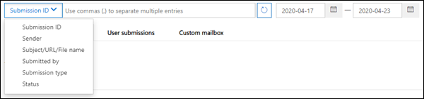

# Verwenden von Administrator-Übermittlung, um verdächtige Spam- oder Phishing-Nachrichten, URLs und Dateien an Microsoft zu übermittelnUse Admin Submission to submit suspected spam, phish, URLs, and files to Microsoft

[!INCLUDE [Microsoft 365 Defender rebranding](../includes/microsoft-defender-for-office.md)]

**Gilt für****Applies to**
- [Exchange Online ProtectionExchange Online Protection](exchange-online-protection-overview.md)
- [Microsoft Defender für Office 365 Plan 1 und Plan 2Microsoft Defender for Office 365 plan 1 and plan 2](defender-for-office-365.md)

In Microsoft 365 Organisationen mit Postfächern in Exchange Online können Administratoren das Übermittlungsportal im Security & Compliance Center verwenden, um E-Mail-Nachrichten, URLs und Anlagen zur Überprüfung an Microsoft zu senden.In Microsoft 365 organizations with mailboxes in Exchange Online, admins can use the Submissions portal in the Security & Compliance Center to submit email messages, URLs, and attachments to Microsoft for scanning.

Wenn Sie eine E-Mail-Nachricht übermitteln, erhalten Sie Folgendes:When you submit an email message, you will get:

1. **E-Mail-Authentifizierungsprüfung:** Details dazu, ob die E-Mail-Authentifizierung bei der Zustellung erfolgreich war oder fehlgeschlagen ist.**Email authentication check**: Details on whether email authentication passed or failed when it was delivered.
2. **Richtlinientreffer:** Informationen zu allen Richtlinien, die eingehende E-Mails in Ihrem Mandanten möglicherweise zugelassen oder blockiert haben, und überschreiben unsere Dienstfilterbewertungen.**Policy hits**: Information about any policies that may have allowed or blocked the incoming email into your tenant, overriding our service filter verdicts.
3. **Nutzlastreputation/-detonation:** Untersuchung aller URLs und Anlagen in der Nachricht.**Payload reputation/detonation**: Examination of any URLs and attachments in the message.
4. **Benotungsanalyse:** Überprüfung durch Benotungsprüfer, um zu überprüfen, ob Nachrichten bösartig sind oder nicht.**Grader analysis**: Review done by human graders in order to confirm whether or not messages are malicious.

> [!IMPORTANT]
> Nutzlastreputation/-detonation und Bewertungsanalyse werden nicht in allen Mandanten durchgeführt.Payload reputation/detonation and grader analysis are not done in all tenants. Informationen werden daran gehindert, sich außerhalb der Organisation zu befinden, wenn Daten die Mandantengrenze nicht zu Compliancezwecken verlassen sollen.Information is blocked from going outside the organization when data is not supposed to leave the tenant boundary for compliance purposes.

Weitere Möglichkeiten zum Übermitteln von E-Mail-Nachrichten, URLs und Anlagen an Microsoft finden Sie unter "Melden von [Nachrichten und Dateien an Microsoft".](report-junk-email-messages-to-microsoft.md)For other ways to submit email messages, URLs, and attachments to Microsoft, see [Report messages and files to Microsoft](report-junk-email-messages-to-microsoft.md).

## Was sollten Sie wissen, bevor Sie beginnen?What do you need to know before you begin?

- Sie öffnen das Microsoft 365 Security Center unter <https://security.microsoft.com/> .You open the Microsoft 365 security center at <https://security.microsoft.com/>. Um direkt zur Seite **"Übermittlungen"** zu wechseln, verwenden Sie <https://security.microsoft.com/reportsubmission> .To go directly to the **Submissions** page, use <https://security.microsoft.com/reportsubmission>.

- Um Nachrichten und Dateien an Microsoft zu übermitteln, müssen Sie Mitglied einer der folgenden Rollengruppen sein:To submit messages and files to Microsoft, you need to be a member of one of the following role groups:

  - **Organisationsverwaltung** oder **Sicherheitsleseberechtigter** im [Microsoft 365 Security Center.](permissions-microsoft-365-security-center.md)**Organization Management** or **Security Reader** in the [Microsoft 365 security center](permissions-microsoft-365-security-center.md).

  - **Organisationsverwaltung** in [Exchange Online](/Exchange/permissions-exo/permissions-exo#role-groups).**Organization Management** in [Exchange Online](/Exchange/permissions-exo/permissions-exo#role-groups).

    Beachten Sie, dass die Mitgliedschaft in dieser Rollengruppe erforderlich ist, um [Benutzerübermittlungen an das benutzerdefinierte Postfach anzuzeigen,](#view-user-submissions-to-the-custom-mailbox) wie weiter unten in diesem Artikel beschrieben.Note that membership in this role group is required to [View user submissions to the custom mailbox](#view-user-submissions-to-the-custom-mailbox) as described later in this article.

- Weitere Informationen dazu, wie Benutzer Nachrichten und Dateien an Microsoft übermitteln können, finden Sie unter ["Melden von Nachrichten und Dateien an Microsoft".](report-junk-email-messages-to-microsoft.md)For more information about how users can submit messages and files to Microsoft, see [Report messages and files to Microsoft](report-junk-email-messages-to-microsoft.md).

## Melden verdächtiger Inhalte an MicrosoftReport suspicious content to Microsoft

1. Wechseln Sie im [Microsoft 365 Security Center](../defender/overview-security-center.md)zu **"Übermittlungen",** und überprüfen Sie, ob Sie sich auf der Registerkarte **"Zur Analyse übermittelt"** befinden, und klicken Sie dann zur Überprüfung auf **"An Microsoft übermitteln".**In the [Microsoft 365 security center](../defender/overview-security-center.md), go to **Submissions** and verify that you're on the **Submitted for analysis** tab, and then click **Submit to Microsoft for review**.

2. Verwenden Sie das Flyout **"An Microsoft übermitteln" zum Überprüfen** des Flyouts, das die Nachricht, URL oder E-Mail-Anlage wie in den folgenden Abschnitten beschrieben zu übermitteln scheint.Use the **Submit to Microsoft for review** flyout that appears to submit the message, URL, or email attachment as described in the following sections.

### Senden einer fragebaren E-Mail an MicrosoftSubmit a questionable email to Microsoft

1. Wählen Sie im Abschnitt **"Übermittlungstyp auswählen" die** Option **"E-Mail**" aus.In the **Select the submission type** section, select **Email**. Verwenden Sie im Abschnitt **"Netzwerknachrichten-ID hinzufügen" oder "E-Mail-Datei hochladen"** eine der folgenden Optionen:In the **Add the network message ID or upload the email file** section, use one of the following options:

   - **Fügen Sie die E-Mail-Netzwerknachrichten-ID** hinzu: Dies ist ein GUID-Wert, der im **X-MS-Exchange-Organization-Network-Message-Id-Header** in der Nachricht oder im **X-MS-Office365-Filtering-Correlation-Id-Header** in isolierten Nachrichten verfügbar ist.**Add the email network message ID**: This is a GUID value that's available in the **X-MS-Exchange-Organization-Network-Message-Id** header in the message or in the **X-MS-Office365-Filtering-Correlation-Id** header in quarantined messages.

   - **Hochladen die E-Mail-Datei:** Klicken Sie auf **"Dateien durchsuchen".****Upload the email file**: Click **Browse files**. Suchen Sie im daraufhin geöffneten Dialogfeld die EML- oder MSG-Datei, und wählen Sie sie aus, und klicken Sie dann auf **"Öffnen".**In the dialog that opens, find and select the .eml or .msg file, and then click **Open**.

   > [!NOTE]
   > Die Möglichkeit, Nachrichten ab 30 Tagen zu übermitteln, wurde für Defender für Office 365 Kunden vorübergehend ausgesetzt.The ability to submit messages as old as 30 days has been temporarily suspended for Defender for Office 365 customers. Administratoren können nur 7 Tage zurückkehren.Admins will only be able to go back 7 days.

2. Geben Sie im Abschnitt **"Empfänger auswählen, der ein Problem hatte"** den Empfänger an, für den Sie eine Richtlinienüberprüfung ausführen möchten.In the **Choose a recipient who had an issue** section, specify the recipient that you would like to run a policy check against. Die Richtlinienüberprüfung bestimmt, ob die Überprüfung durch die E-Mail aufgrund von Benutzer- oder Organisationsrichtlinien umgangen wurde.The policy check will determine if the email bypassed scanning due to user or organization policies.

3. Wählen Sie im Abschnitt **"Auswählen eines Grunds für die Übermittlung an Microsoft"** eine der folgenden Optionen aus:In the **Select a reason for submitting to Microsoft** section, select one of the following options:

   - **Sollte nicht blockiert worden sein****Should not have been blocked**

   - **Sollte blockiert worden sein:** Wählen Sie **Spam,** **Phishing** oder **Schadsoftware** aus.**Should have been blocked**: Select **Spam**, **Phishing**, or **Malware**. Wenn Sie nicht sicher sind, verwenden Sie Ihr bestes Ermessen.If you're not sure, use your best judgment.

4. Wenn Sie fertig sind, klicken Sie auf die Schaltfläche **"Absenden".**When you're finished, click the **Submit** button.

   

### Senden einer verdächtigen URL an MicrosoftSend a suspect URL to Microsoft

1. Wählen Sie im Abschnitt **"Übermittlungstyp auswählen" die** **URL** aus.In the **Select the submission type** section, select **URL**. Geben Sie in das angezeigte Feld die vollständige URL ein (z. B. `https://www.fabrikam.com/marketing.html` ).In the box that appears, enter the full URL (for example, `https://www.fabrikam.com/marketing.html`).

2. Wählen Sie im Abschnitt **"Grund für Übermittlung"** eine der folgenden Optionen aus:In the **Reason for submission** section, select one of the following options:

   - **Sollte nicht blockiert worden sein****Should not have been blocked**

   - Sollte blockiert worden sein: **Phishing** oder **Schadsoftware** auswählen. **Should have been blocked**: Select **Phishing** or **Malware**.

3. Wenn Sie fertig sind, klicken Sie auf die Schaltfläche **"Absenden".**When you're finished, click the **Submit** button.

   

### Übermitteln einer verdächtigen E-Mail-Anlage an MicrosoftSubmit a suspected email attachment to Microsoft

1. Wählen Sie im Abschnitt **"Übermittlungstyp auswählen" die** Option **E-Mail-Anlage** aus.In the **Select the submission type** section, select **Email attachment**.

2. Klicken Sie auf **"Datei auswählen".**Click **Choose File**. Suchen Sie im daraufhin geöffneten Dialogfeld die Datei, wählen Sie sie aus, und klicken Sie dann auf **"Öffnen".**In the dialog that opens, find and select the file, and then click **Open**.

3. Wählen Sie im Abschnitt **"Grund für Übermittlung"** eine der folgenden Optionen aus:In the **Reason for submission** section, select one of the following options:

   - **Sollte nicht blockiert worden sein****Should not have been blocked**

   - **Sollte blockiert worden sein:** **Schadsoftware** ist die einzige Wahl und wird automatisch ausgewählt.**Should have been blocked**: **Malware** is the only choice, and is automatically selected.

4. Wenn Sie fertig sind, klicken Sie auf die Schaltfläche **"Absenden".**When you're finished, click the **Submit** button.

   

## Anzeigen von Elementen, die für die Analyse übermittelt wurdenView items Submitted for analysis

Wechseln Sie im Microsoft 365 Security Center zu **Übermittlungen,** und vergewissern Sie sich, dass Sie sich auf der Registerkarte **"Zur Analyse übermittelt"** befinden.In the Microsoft 365 security center, go to **Submissions**, and verify that you're on the **Submitted for analysis** tab

In der Befehlsleiste in der Mitte der Seite können Sie ein Startdatum, ein Enddatum eingeben und (standardmäßig) sie können nach **Übermittlungs-ID** (einem GUID-Wert, der jeder Übermittlung zugewiesen ist) filtern, indem Sie einen Wert in das Feld eingeben und auf  klicken.In the command bar in the middle of the page, you can enter a start date, an end date, and (by default) you can filter by **Submission ID** (a GUID value that's assigned to every submission) by entering a value in the box and clicking . Mehrere Werte können durch Kommata getrennt eingegeben werden.You can enter multiple values separated by commas.

Um die Filterkriterien zu ändern, klicken Sie auf die Schaltfläche **"Filter",** und wählen Sie einen der folgenden Werte aus:To change the filter criteria, click the **Filter** button and choose one of the following values:

- **Sender****Sender**
- **Betreff/URL/Dateiname****Subject/URL/File name**
- **Übermittelt von****Submitted by**
- **Übermittlungstyp****Submission type**
- **Status****Status**

Um die Ergebnisse zu exportieren, klicken Sie oben auf der Seite auf **"Exportieren",** und wählen Sie **Diagrammdaten** oder **Tabelle** aus.To export the results, click **Export** near the top of the page and select **Chart data** or **Table**. Speichern Sie im daraufhin angezeigten Dialogfeld die .csv Datei.In the dialog that appears, save the .csv file.

Unterhalb des Diagramms befinden sich drei Registerkarten: **E-Mail** (Standard), **URL** und **E-Mail-Anlage.**Below the graph, there are three tabs: **Email** (default), **URL**, and **Email attachment**.

### Anzeigen von Administrator-E-Mail-ÜbermittlungenView admin email submissions

Sie können auf die Schaltfläche **"Spalten anpassen"** am unteren Rand der Seite klicken, um Der Ansicht Spalten hinzuzufügen oder daraus zu entfernen:You can click the **Customize columns** button near the bottom of the page to add or remove columns from the view:

- **Date****Date**
- **Übermittlungs-ID:** Ein GUID-Wert, der jeder Übermittlung zugewiesen wird.**Submission ID**: A GUID value that's assigned to every submission.
- **Übermittelt von**\***Submitted by**\*
- **Betreff**\***Subject**\*
- **Sender****Sender**
- **Sender-IP**\***Sender IP**\*
- **Übermittlungstyp****Submission type**
- **Übermittlungsgrund****Delivery reason**
- **Status**\***Status**\*

  \* Wenn Sie auf diesen Wert klicken, werden detaillierte Informationen in einem Flyout angezeigt.\* If you click this value, detailed information is displayed in a flyout.

#### Details zur erneuten Überprüfung der AdministratorübermittlungAdmin submission rescan details

Nachrichten, die in Administratorübermittlungen übermittelt werden, werden erneut überprüft, und die Ergebnisse werden im Flyout "Übermittlungsdetails" angezeigt:Messages that are submitted in admin submissions are rescanned and results shown in the submissions detail flyout:

- Mögliche Fehler in der E-Mail-Authentifizierung des Absenders zum Zeitpunkt der Auslieferung.If there was a failure in the sender's email authentication at the time of delivery.
- Informationen zu Richtlinientreffern, welche die Bewertung über einer Nachricht beeinflusst oder überschrieben haben könnten.Information about any policy hits that could have affected or overridden the verdict of a message.
- Aktuelle Detonationsergebnisse, um festzustellen, ob die in der Nachricht enthaltenen URLs oder Dateien böswillig waren oder nicht.Current detonation results to see if the URLs or files contained in the message were malicious or not.
- Feedback von Benotungsprüfern.Feedback from graders.

Wenn eine Überschreibung gefunden wurde, sollte der erneute Scan in einigen Minuten abgeschlossen sein.If an override was found, the rescan should complete in several minutes. Wenn es kein Problem bei der E-Mail-Authentifizierung gab oder die Zustellung nicht von einer Außerkraftsetzung betroffen war, kann das Feedback von Bewertern bis zu einem Tag dauern.If there wasn't a problem in email authentication or delivery wasn't affected by an override, then the feedback from graders could take up to a day.

### Anzeigen von Administrator-URL-ÜbermittlungenView admin URL submissions

Klicken Sie auf die **Registerkarte "URL".**Click the **URL** tab.

Sie können auf die Schaltfläche **"Spaltenoptionen"** am unteren Rand der Seite klicken, um Der Ansicht Spalten hinzuzufügen oder daraus zu entfernen:You can click the **Column options** button near the bottom of the page to add or remove columns from the view:

- **Date****Date**
- **Übermittlungs-ID****Submission ID**
- **Übermittelt von**\***Submitted by**\*
- **URL**\***URL**\*
- **Übermittlungstyp****Submission type**
- **Status**\***Status**\*

  \* Wenn Sie auf diesen Wert klicken, werden detaillierte Informationen in einem Flyout angezeigt.\* If you click this value, detailed information is displayed in a flyout.

### Anzeigen von Übermittlungen von E-Mail-AnlagenView email attachment submissions

Klicken Sie auf die Registerkarte **"Anlagen".**Click the **Attachments** tab.

Sie können auf die Schaltfläche **"Spaltenoptionen"** am unteren Rand der Seite klicken, um Der Ansicht Spalten hinzuzufügen oder daraus zu entfernen:You can click the **Column options** button near the bottom of the page to add or remove columns from the view:

- **Date****Date**
- **Übermittlungs-ID****Submission ID**
- **Übermittelt von**\***Submitted by**\*
- **Dateiname**\***File name**\*
- **Übermittlungstyp****Submission type**
- **Status**\***Status**\*

  \* Wenn Sie auf diesen Wert klicken, werden detaillierte Informationen in einem Flyout angezeigt.\* If you click this value, detailed information is displayed in a flyout.

## Anzeigen von Benutzerübermittlungen an MicrosoftView user submissions to Microsoft

Wenn Sie das [Add-In "Nachricht melden",](enable-the-report-message-add-in.md)das [Add-In "Phishing melden"](enable-the-report-phish-add-in.md)bereitgestellt haben oder Personen die [integrierte Berichterstellung in Outlook im Web](report-junk-email-and-phishing-scams-in-outlook-on-the-web-eop.md)verwenden, können Sie sehen, welche Benutzer auf der Registerkarte **"Benutzerübermittlungen"** Berichte erstellen.If you've deployed the [Report Message add-in](enable-the-report-message-add-in.md), the [Report Phishing add-in](enable-the-report-phish-add-in.md), or people use the [built-in reporting in Outlook on the web](report-junk-email-and-phishing-scams-in-outlook-on-the-web-eop.md), you can see what users are reporting on the **User submissions** tab.

1. Wechseln Sie im Security & Compliance  Center zu \> **Übermittlungen zur Bedrohungsverwaltung.**In the Security & Compliance Center, go to **Threat management** \> **Submissions**.

2. Wählen Sie die Registerkarte **"Benutzerübermittlungen" aus,** und klicken Sie dann auf **"Neue Übermittlung".**Select the **User submissions** tab, and then click **New submission**.

Sie können auf die Schaltfläche **"Spaltenoptionen"** am unteren Rand der Seite klicken, um Der Ansicht Spalten hinzuzufügen oder daraus zu entfernen:You can click the **Column options** button near the bottom of the page to add or remove columns from the view:

- **Übermittelt am****Submitted on**
- **Übermittelt von**\***Submitted by**\*
- **Betreff**\***Subject**\*
- **Sender****Sender**
- **Sender-IP**\***Sender IP**\*
- **Übermittlungstyp****Submission type**

\* Wenn Sie auf diesen Wert klicken, werden detaillierte Informationen in einem Flyout angezeigt.\* If you click this value, detailed information is displayed in a flyout.

Im oberen Bereich der Seite können Sie ein Startdatum, ein Enddatum eingeben und (standardmäßig) nach **Absender** filtern, indem Sie einen Wert in das Feld eingeben und auf die  klicken.Near the top of the page, you can enter a start date, an end date, and (by default) you can filter by **Sender** by entering a value in the box and clicking . Mehrere Werte können durch Kommata getrennt eingegeben werden.You can enter multiple values separated by commas.

Klicken Sie zum Ändern der Filterkriterien auf die Schaltfläche **"Absender",** und wählen Sie einen der folgenden Werte aus:To change the filter criteria, click the **Sender** button and choose one of the following values:

- **Absenderdomäne****Sender domain**
- **Betreff****Subject**
- **Übermittelt von****Submitted by**
- **Übermittlungstyp****Submission type**
- **Sender-IP****Sender IP**

Um die Ergebnisse zu exportieren, klicken Sie oben auf der Seite auf **"Exportieren",** und wählen Sie **Diagrammdaten** oder **Tabelle** aus.To export the results, click **Export** near the top of the page and select **Chart data** or **Table**. Speichern Sie im daraufhin angezeigten Dialogfeld die .csv Datei.In the dialog that appears, save the .csv file.

## Anzeigen von Benutzerübermittlungen an das benutzerdefinierte PostfachView user submissions to the custom mailbox

**Wenn** Sie [ein benutzerdefiniertes Postfach für](user-submission.md) den Empfang von vom Benutzer gemeldeten Nachrichten konfiguriert haben, können Sie Nachrichten anzeigen und auch senden, die an das Berichtspostfach übermittelt wurden.**If** you've [configured a custom mailbox](user-submission.md) to receive user reported messages, you can view and also submit messages that were delivered to the reporting mailbox.

1. Wechseln Sie im Security & Compliance  Center zu \> **Übermittlungen zur Bedrohungsverwaltung.**In the Security & Compliance Center, go to **Threat management** \> **Submissions**.

2. Wählen Sie die Registerkarte **"Benutzerdefiniertes Postfach"** aus.Select the **Custom mailbox** tab.

Sie können auf die Schaltfläche **"Spaltenoptionen"** am unteren Rand der Seite klicken, um Der Ansicht Spalten hinzuzufügen oder daraus zu entfernen:You can click the **Column options** button near the bottom of the page to add or remove columns from the view:

- **Übermittelt am****Submitted on**
- **Übermittelt von**\***Submitted by**\*
- **Betreff**\***Subject**\*
- **Sender****Sender**
- **Sender-IP**\***Sender IP**\*
- **Übermittlungstyp****Submission type**

Am oberen Rand der Seite können Sie ein Startdatum, ein Enddatum eingeben und nach **"Übermittelt"** filtern, indem Sie einen Wert in das Feld eingeben und auf die  klicken.Near the top of the page, you can enter a start date, an end date, and you can filter by **Submitted by** by entering a value in the box and clicking . Mehrere Werte können durch Kommata getrennt eingegeben werden.You can enter multiple values separated by commas.

Um die Ergebnisse zu exportieren, klicken Sie oben auf der Seite auf **"Exportieren",** und wählen Sie **Diagrammdaten** oder **Tabelle** aus.To export the results, click **Export** near the top of the page and select **Chart data** or **Table**. Speichern Sie im daraufhin angezeigten Dialogfeld die .csv Datei.In the dialog that appears, save the .csv file.

> [!NOTE]
> Wenn Organisationen so konfiguriert sind, dass sie nur an ein benutzerdefiniertes Postfach senden, werden gemeldete Nachrichten nicht zur erneuten Überprüfung gesendet, und die Ergebnisse im Portal für vom Benutzer gemeldete Nachrichten sind immer leer.If organizations are configured to send to custom mailbox only, reported messages will not be sent for rescan and results in the User reported messages portal will always be empty.

## Rückgängigmachen von BenutzerübermittlungenUndo user submissions

Sobald ein Benutzer eine verdächtige E-Mail an das benutzerdefinierte Postfach sendet, haben der Benutzer und der Administrator keine Möglichkeit, die Übermittlung rückgängig zu machen.Once a user submits a suspicious email to the custom mailbox, the user and admin don't have an option to undo the submission. Wenn der Benutzer die E-Mail wiederherstellen möchte, steht sie für die Wiederherstellung in den Ordnern "Gelöschte Elemente" oder "Junk-E-Mail" zur Verfügung.If the user would like to recover the email, it will be available for recovery in the Deleted Items or Junk Email folders.

### Senden von Nachrichten aus dem benutzerdefinierten Postfach an MicrosoftSubmit messages to Microsoft from the custom mailbox

Wenn Sie das benutzerdefinierte Postfach so konfiguriert haben, dass von Benutzern gemeldete Nachrichten abgefangen werden, ohne die Nachrichten an Microsoft zu senden, können Sie bestimmte Nachrichten suchen und zur Analyse an Microsoft senden.If you've configured the custom mailbox to intercept user-reported messages without sending the messages to Microsoft, you can find and send specific messages to Microsoft for analysis. Dadurch wird eine Benutzerübermittlung effektiv an eine Administratorübermittlung verschoben.This effectively moves a user submission to an admin submission.

Wählen Sie auf der Registerkarte **"Vom Benutzer gemeldete Nachrichten"** eine Nachricht in der Liste aus, klicken Sie auf die Schaltfläche **"Aktion",** und wählen Sie eine der folgenden Optionen aus:On the **User reported messages** tab, select a message in the list, click the **Action** button, and make one of the following selections:

- **Bericht sauber****Report clean**
- **Melden von Phishing****Report phishing**
- **Melden von Schadsoftware****Report malware**
- **Melden von Spam****Report spam**

