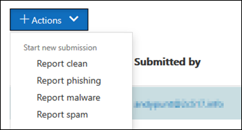

# Verwenden von Administrator-Übermittlung, um verdächtige Spam- oder Phishing-Nachrichten, URLs und Dateien an Microsoft zu übermittelnUse Admin Submission to submit suspected spam, phish, URLs, and files to Microsoft

In Microsoft 365-Organisationen mit Postfächern in Exchange Online können Administratoren das Übermittlungen-Portal im Security & Compliance Center verwenden, um e-Mail-Nachrichten, URLs und Anlagen für die Überprüfung an Microsoft zu übermitteln.In Microsoft 365 organizations with mailboxes in Exchange Online, admins can use the Submissions portal in the Security & Compliance Center to submit email messages, URLs, and attachments to Microsoft for scanning.

Wenn Sie eine e-Mail übermitteln, erhalten Sie Informationen zu allen Richtlinien, die möglicherweise die eingehenden e-Mails in ihren Mandanten zugelassen haben, sowie über die Untersuchung von URLs und Anlagen in der e-Mail.When you submit an email, you will get information about any policies that may have allowed the incoming email into your tenant, as well as examination of any URLs and attachments in the mail. Richtlinien, die möglicherweise eine e-Mail erlaubt haben, enthalten die Liste sicherer Absender eines einzelnen Benutzers sowie Richtlinien auf Mandantenebene wie Exchange-Nachrichtenfluss Regeln (auch bekannt als Transportregeln).Policies that may have allowed a mail include an individual user's safe sender list as well as tenant level policies such as Exchange mail flow rules (also known as transport rules).

Weitere Möglichkeiten zum Übermitteln von e-Mail-Nachrichten, URLs und Anlagen an Microsoft finden Sie unter [Report Messages and files to Microsoft](report-junk-email-messages-to-microsoft.md).For other ways to submit email messages, URLs, and attachments to Microsoft, see [Report messages and files to Microsoft](report-junk-email-messages-to-microsoft.md).

## Was sollten Sie wissen, bevor Sie beginnen?What do you need to know before you begin?

- Sie öffnen das Security & Compliance Center unter <https://protection.office.com/>.You open the Security & Compliance Center at <https://protection.office.com/>. Wenn Sie direkt zur **Übermittlungs** Seite wechseln möchten, verwenden Sie <https://protection.office.com/reportsubmission> .To go directly to the **Submission** page, use <https://protection.office.com/reportsubmission>.

- Um Nachrichten und Dateien an Microsoft zu übermitteln, müssen Sie Mitglied einer der folgenden Rollengruppen sein:To submit messages and files to Microsoft, you need to be a member of one of the following role groups:

  - **Organisationsverwaltung** oder **Sicherheitsadministrator** im [Security & Compliance Center](permissions-in-the-security-and-compliance-center.md).**Organization Management** or **Security Administrator** in the [Security & Compliance Center](permissions-in-the-security-and-compliance-center.md).

  - **Organisationsverwaltung** in [Exchange Online](https://docs.microsoft.com/Exchange/permissions-exo/permissions-exo#role-groups).**Organization Management** in [Exchange Online](https://docs.microsoft.com/Exchange/permissions-exo/permissions-exo#role-groups).

    Beachten Sie, dass die Mitgliedschaft in dieser Rollengruppe erforderlich ist, um [Benutzer Übermittlungen an das benutzerdefinierte Postfach anzuzeigen](#view-user-submissions-to-the-custom-mailbox) , wie weiter unten in diesem Thema beschrieben.Note that membership in this role group is required to [View user submissions to the custom mailbox](#view-user-submissions-to-the-custom-mailbox) as described later in this topic.

- Weitere Informationen darüber, wie Benutzer Nachrichten und Dateien an Microsoft übermitteln können, finden Sie unter [Report Messages and files to Microsoft](report-junk-email-messages-to-microsoft.md).For more information about how users can submit messages and files to Microsoft, see [Report messages and files to Microsoft](report-junk-email-messages-to-microsoft.md).

## Verdächtigen Inhalt an Microsoft meldenReport suspicious content to Microsoft

1. Wechseln Sie im Security & Compliance Center zu **Threat Management** \> -über **mittlungen**, stellen Sie sicher, dass Sie sich auf der Registerkarte Admin-über **mittlungen** befinden, und klicken Sie dann auf **neue Übermittlung**.In the Security & Compliance Center, go to **Threat management** \> **Submissions**, verify that you're on the **Admin submissions** tab, and then click **New submission**.

2. Verwenden Sie das **neue Übermittlungs** Flyout, das angezeigt wird, um die Nachricht, die URL oder Anlage zu übermitteln, wie in den folgenden Abschnitten beschrieben.Use **New submission** flyout that appears to submit the message, URL, or attachment as described in the following sections.

### Senden einer fragwürdigen e-Mail an MicrosoftSubmit a questionable email to Microsoft

1. Wählen Sie im Abschnitt **Objekttyp** die Option **e-Mail**aus.In the **Object type** section, select **Email**. Verwenden Sie im Abschnitt **Übermittlungs Format** eine der folgenden Optionen:In the **Submission format** section, use one of the following options:

   - **Netzwerknachrichten-ID**: Dies ist ein GUID-Wert, der im **X-MS-Exchange-Organization-Network-Message-ID** -Header in der Nachricht zur Verfügung steht.**Network Message ID**: This is a GUID value that's available in the **X-MS-Exchange-Organization-Network-Message-Id** header in the message.

   - **Datei**: Klicken Sie auf **Datei auswählen**.**File**: Click **Choose file**. Suchen Sie in dem Dialogfeld, das geöffnet wird, nach der EML-oder msg-Datei, und wählen Sie Sie aus, und klicken Sie dann auf **Öffnen**.In the dialog that opens, find and select the .eml or .msg file, and then click **Open**.

2. Geben Sie im Abschnitt **Empfänger** einen oder mehrere Empfänger an, für die Sie eine Richtlinienüberprüfung ausführen möchten.In the **Recipients** section, specify one or more recipients that you would like to run a policy check against. Durch die Richtlinienüberprüfung wird ermittelt, ob die e-Mail-Überprüfung aufgrund von Benutzer-oder Organisationsrichtlinien umgangen wurde.The policy check will determine if the email bypassed scanning due to user or organization policies.

3. Wählen Sie im Abschnitt **Grund für die Übermittlung** eine der folgenden Optionen aus:In the **Reason for submission** section, select one of the following options:

   - **Sollte nicht blockiert worden sein****Should not have been blocked**

   - **Sollte blockiert worden sein**: Wählen Sie **Spam**, **Phishing**oder **Schadsoftware**aus.**Should have been blocked**: Select **Spam**, **Phishing**, or **Malware**. Wenn Sie nicht sicher sind, verwenden Sie Ihr Bestes Urteil.If you're not sure, use your best judgment.

4. Wenn der Filter aufgrund von Richtlinien bei der Übermittlung umgangen wurde, werden Informationen zu dieser Richtlinie angezeigt.If the filter was bypassed due to policies upon submission, you'll see information about that policy.

   Wenn der Filter aufgrund einer oder mehrerer Richtlinien nicht umgangen wurde, wird die Überprüfung in einigen Minuten abgeschlossen.If the filter was not bypassed due to one or more policies, the scan will complete in several minutes. Sie erhalten zusätzliche Informationen über die Übermittlung, indem Sie auf den Link Status klicken.You'll see additional information about the submission by clicking on the status link. Dies beinhaltet die Ergebnisse der Richtlinienüberprüfung und das Ergebnis der erneuten Überprüfung.This includes the results of the policy check and the rescan verdict. Hinweis Dadurch wird die e-Mail-Nachricht nicht über den Office 365 ATP-voll Filter Stapel erneut ausgeführt, es wird jedoch ein partieller erneuter Scan auf der Grundlage bestimmter Attribute der e-Mail, der URL oder der Datei ausgeführt.Note this does not run the email through the Office 365 ATP full filtering stack again but runs a partial rescan based on certain attributes of the mail, URL, or file.

5. Wenn Sie fertig sind, klicken Sie auf die Schaltfläche **Absenden** .When you're finished, click the **Submit** button.

### Senden einer verdächtigen URL an MicrosoftSend a suspect URL to Microsoft

1. Wählen Sie im Abschnitt **Objekttyp** die Option **URL**aus.In the **Object type** section, select **URL**. Geben Sie in das Feld, das angezeigt wird, die vollständige URL ein (beispielsweise `https://www.fabrikam.com/marketing.html` ).In the box that appears, enter the full URL (for example, `https://www.fabrikam.com/marketing.html`).

2. Wählen Sie im Abschnitt **Grund für die Übermittlung** eine der folgenden Optionen aus:In the **Reason for submission** section, select one of the following options:

   - **Sollte nicht blockiert worden sein****Should not have been blocked**

   - **Sollte blockiert worden sein**: Wählen Sie **Phishing** oder **Schadsoftware**aus.**Should have been blocked**: Select **Phishing** or **Malware**.

3. Wenn Sie fertig sind, klicken Sie auf die Schaltfläche **Absenden** .When you're finished, click the **Submit** button.

### Übermitteln einer vermuteten Datei an MicrosoftSubmit a suspected file to Microsoft

1. Wählen Sie im Abschnitt **Objekttyp** die Option **Anlage**aus.In the **Object type** section, select **Attachment**.

2. Klicken Sie auf **Datei auswählen**.Click **Choose File**. Suchen und wählen Sie im daraufhin geöffneten Dialogfeld die Datei aus, und klicken Sie dann auf **Öffnen**.In the dialog that opens, find and select the file, and then click **Open**.

3. Wählen Sie im Abschnitt **Grund für die Übermittlung** eine der folgenden Optionen aus:In the **Reason for submission** section, select one of the following options:

   - **Sollte nicht blockiert worden sein****Should not have been blocked**

   - **Sollte blockiert worden sein**: **Schadsoftware** ist die einzige Wahl und wird automatisch ausgewählt..**Should have been blocked**: **Malware** is the only choice, and is automatically selected..

4. Wenn Sie fertig sind, klicken Sie auf die Schaltfläche **Absenden** .When you're finished, click the **Submit** button.

## Anzeigen von Übermittlungen von AdministratorenView admin submissions

Wechseln Sie im Security & Compliance Center zu **Threat Management** \> -über **mittlungen**, stellen Sie sicher, dass Sie sich auf der Registerkarte Admin-über **mittlungen** befinden, und klicken Sie dann auf **neue Übermittlung**.In the Security & Compliance Center, go to **Threat management** \> **Submissions**, verify that you're on the **Admin submissions** tab, and then click **New submission**.

Oben auf der Seite können Sie ein Startdatum, ein Enddatum und (standardmäßig) nach **Übermittlungs-ID** (ein GUID-Wert, der jeder Übermittlung zugewiesen ist) filtern, indem Sie einen Wert in das Feld eingeben und auf Aktualisieren klicken  .Near the top of the page, you can enter a start date, an end date, and (by default) you can filter by **Submission ID** (a GUID value that's assigned to every submission) by entering a value in the box and clicking . UpdateYou can enter multiple values separated by commas.

Klicken Sie zum Ändern der Filterkriterien auf die Schaltfläche **Übermittlungs-ID** , und wählen Sie einen der folgenden Werte aus:To change the filter criteria, click the **Submission ID** button and choose one of the following values:

- **Sender****Sender**
- **Betreff/URL/Dateiname****Subject/URL/File name**
- **Eingereicht von****Submitted by**
- **Übermittlungs****Submission type**
- **Status****Status**

Klicken Sie zum Exportieren der Ergebnisse im oberen Bereich der Seite auf **exportieren** , und wählen Sie **Diagrammdaten** oder **Tabelle**aus.To export the results, click **Export** near the top of the page and select **Chart data** or **Table**. Speichern Sie im angezeigten Dialogfeld die CSV-Datei.In the dialog that appears, save the .csv file.

Unter dem Diagramm befinden sich drei Registerkarten: **e-Mail** (Standard), **URL**und **Anlage**.Below the graph, there are three tabs: **Email** (default), **URL**, and **Attachment**.

### Anzeigen von Administrator-e-Mail-ÜbermittlungenView admin email submissions

Klicken Sie auf die Registerkarte **e-Mail** .Click the **Email** tab.

Sie können auf die Schaltfläche **Spaltenoptionen** am unteren Rand der Seite klicken, um Spalten aus der Ansicht hinzuzufügen oder zu entfernen:You can click the **Column options** button near the bottom of the page to add or remove columns from the view:

- **Date****Date**
- **Übermittlungs-ID**: ein GUID-Wert, der jeder Übermittlung zugewiesen ist.**Submission ID**: A GUID value that's assigned to every submission.
- **Eingereicht von**\***Submitted by**\*
- **Betreff**\***Subject**\*
- **Sender****Sender**
- **Sender-IP**\***Sender IP**\*
- **Übermittlungs****Submission type**
- **Zustellungs Grund****Delivery reason**
- **Status**\***Status**\*
- **Steuerelementtyp****Control type**
- **Steuerelementquelle****Control source**

  \* Wenn Sie auf diesen Wert klicken, werden ausführliche Informationen in einem Flyout angezeigt.\* If you click this value, detailed information is displayed in a flyout.

### Anzeigen von Administratoren-URL-ÜbermittlungenView admin URL submissions

Klicken Sie auf die Registerkarte **URL** .Click the **URL** tab.

Sie können auf die Schaltfläche **Spaltenoptionen** am unteren Rand der Seite klicken, um Spalten aus der Ansicht hinzuzufügen oder zu entfernen:You can click the **Column options** button near the bottom of the page to add or remove columns from the view:

- **Date****Date**
- **Übermittlungs-ID****Submission ID**
- **Eingereicht von**\***Submitted by**\*
- **URL**\***URL**\*
- **Übermittlungs****Submission type**
- **Status**\***Status**\*

  \* Wenn Sie auf diesen Wert klicken, werden ausführliche Informationen in einem Flyout angezeigt.\* If you click this value, detailed information is displayed in a flyout.

### Anzeigen der Übermittlungen von Administrator AnlagenView admin attachment submissions

Klicken Sie auf die Registerkarte **Anlagen** .Click the **Attachments** tab.

Sie können auf die Schaltfläche **Spaltenoptionen** am unteren Rand der Seite klicken, um Spalten aus der Ansicht hinzuzufügen oder zu entfernen:You can click the **Column options** button near the bottom of the page to add or remove columns from the view:

- **Date****Date**
- **Übermittlungs-ID****Submission ID**
- **Eingereicht von**\***Submitted by**\*
- **Dateiname**\***File name**\*
- **Übermittlungs****Submission type**
- **Status**\***Status**\*

  \* Wenn Sie auf diesen Wert klicken, werden ausführliche Informationen in einem Flyout angezeigt.\* If you click this value, detailed information is displayed in a flyout.

## Anzeigen von Benutzern Übermittlungen an MicrosoftView user submissions to Microsoft

Wenn Sie das [Add-in "Berichtsnachricht](enable-the-report-message-add-in.md)" bereitgestellt haben oder die [integrierten Berichte in Outlook im Internet](report-junk-email-and-phishing-scams-in-outlook-on-the-web-eop.md)verwendet werden, können Sie sehen, welche Benutzer auf der Registerkarte " **Benutzereingaben** " berichten.If you've deployed the [Report Message add-in](enable-the-report-message-add-in.md), or people use the [built-in reporting in Outlook on the web](report-junk-email-and-phishing-scams-in-outlook-on-the-web-eop.md), you can see what users are reporting on the **User submissions** tab.

1. Wechseln Sie im Security & Compliance Center zu **Threat Management** -über \> **mittlungen**.In the Security & Compliance Center, go to **Threat management** \> **Submissions**.

2. Wählen Sie die Registerkarte **Benutzer Übermittlungen** aus, und klicken Sie dann auf **neue Übermittlung**.Select the **User submissions** tab, and then click **New submission**.

Sie können auf die Schaltfläche **Spaltenoptionen** am unteren Rand der Seite klicken, um Spalten aus der Ansicht hinzuzufügen oder zu entfernen:You can click the **Column options** button near the bottom of the page to add or remove columns from the view:

- **Übermittelt am****Submitted on**
- **Eingereicht von**\***Submitted by**\*
- **Betreff**\***Subject**\*
- **Sender****Sender**
- **Sender-IP**\***Sender IP**\*
- **Übermittlungs****Submission type**

\* Wenn Sie auf diesen Wert klicken, werden ausführliche Informationen in einem Flyout angezeigt.\* If you click this value, detailed information is displayed in a flyout.

Am oberen Rand der Seite können Sie ein Startdatum, ein Enddatum und (standardmäßig) nach **Absender** filtern, indem Sie einen Wert in das Feld eingeben und auf  .Near the top of the page, you can enter a start date, an end date, and (by default) you can filter by **Sender** by entering a value in the box and clicking . UpdateYou can enter multiple values separated by commas.

Klicken Sie zum Ändern der Filterkriterien auf die Schaltfläche **Absender** , und wählen Sie einen der folgenden Werte aus:To change the filter criteria, click the **Sender** button and choose one of the following values:

- **Absenderdomäne****Sender domain**
- **Betreff****Subject**
- **Eingereicht von****Submitted by**
- **Übermittlungs****Submission type**
- **Sender-IP****Sender IP**

Klicken Sie zum Exportieren der Ergebnisse im oberen Bereich der Seite auf **exportieren** , und wählen Sie **Diagrammdaten** oder **Tabelle**aus.To export the results, click **Export** near the top of the page and select **Chart data** or **Table**. Speichern Sie im angezeigten Dialogfeld die CSV-Datei.In the dialog that appears, save the .csv file.

## Anzeigen von Benutzereingaben zum benutzerdefinierten PostfachView user submissions to the custom mailbox

**Wenn** Sie [ein benutzerdefiniertes Postfach](user-submission.md) für den Empfang von gemeldeten Benutzern konfiguriert haben, können Sie Nachrichten anzeigen und auch senden, die an das Berichts Postfach übermittelt wurden.**If** you've [configured a custom mailbox](user-submission.md) to receive user reported messages, you can view and also submit messages that were delivered to the reporting mailbox.

1. Wechseln Sie im Security & Compliance Center zu **Threat Management** -über \> **mittlungen**.In the Security & Compliance Center, go to **Threat management** \> **Submissions**.

2. Wählen Sie die Registerkarte **benutzerdefiniertes Postfach** aus.Select the **Custom mailbox** tab.

Sie können auf die Schaltfläche **Spaltenoptionen** am unteren Rand der Seite klicken, um Spalten aus der Ansicht hinzuzufügen oder zu entfernen:You can click the **Column options** button near the bottom of the page to add or remove columns from the view:

- **Übermittelt am****Submitted on**
- **Eingereicht von**\***Submitted by**\*
- **Betreff**\***Subject**\*
- **Sender****Sender**
- **Sender-IP**\***Sender IP**\*
- **Übermittlungs****Submission type**

Am oberen Rand der Seite können Sie ein Startdatum, ein Enddatum eingeben und nach **abgesendet** filtern, indem Sie einen Wert in das Feld eingeben und auf  .Near the top of the page, you can enter a start date, an end date, and you can filter by **Submitted by** by entering a value in the box and clicking . UpdateYou can enter multiple values separated by commas.

Klicken Sie zum Exportieren der Ergebnisse im oberen Bereich der Seite auf **exportieren** , und wählen Sie **Diagrammdaten** oder **Tabelle**aus.To export the results, click **Export** near the top of the page and select **Chart data** or **Table**. Speichern Sie im angezeigten Dialogfeld die CSV-Datei.In the dialog that appears, save the .csv file.

### Übermitteln von Nachrichten an Microsoft aus dem benutzerdefinierten PostfachSubmit messages to Microsoft from the custom mailbox

Wenn Sie das benutzerdefinierte Postfach so konfiguriert haben, dass vom Benutzer gemeldete Nachrichten abgefangen werden, ohne dass die Nachrichten an Microsoft gesendet werden, können Sie bestimmte Nachrichten zur Analyse an Microsoft senden.If you've configured the custom mailbox to intercept user-reported messages without sending the messages to Microsoft, you can find and send specific messages to Microsoft for analysis. Dadurch wird eine Benutzer Übermittlung effektiv in eine Administrator Übermittlung verschoben.This effectively moves a user submission to an admin submission.

Wählen Sie auf der Registerkarte **benutzerdefiniertes Postfach** eine Nachricht in der Liste aus, klicken Sie auf die Schaltfläche **Aktion** , und führen Sie eine der folgenden Optionen aus:On the **Custom mailbox** tab, select a message in the list, click the **Action** button, and make one of the following selections:

- **Bericht säubern****Report clean**
- **Phishing melden****Report phishing**
- **Melden von Schadsoftware****Report malware**
- **Spam melden****Report spam**

