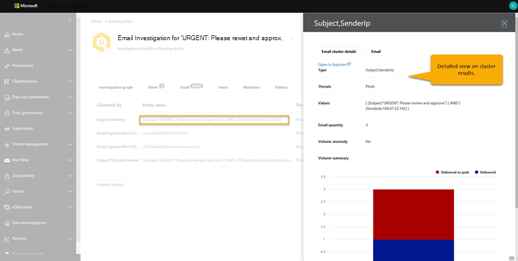
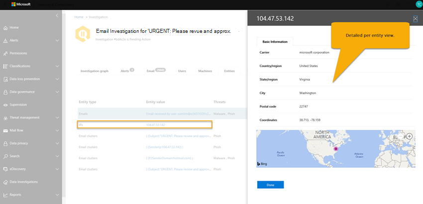

# Details und Ergebnisse einer automatisierten Untersuchung in Office 365

Wenn in [Office 365 Advanced Threat Protection](office-365-atp.md)eine [automatisierte Untersuchung](office-365-air.md) erfolgt, sind Details zu dieser Untersuchung während und nach dem automatisierten Ermittlungsprozess verfügbar. Wenn Sie über die erforderlichen Berechtigungen verfügen, können Sie diese Details in einer unter Anzeige mit Untersuchungsdetails anzeigen. Die Anzeige mit Untersuchungsdetails bieten Ihnen den aktuellen Status sowie die Möglichkeit, ausstehende Aktionen zu genehmigen. 

## Anzeigen von Details einer Untersuchung

1. Gehen Sie zu [https://protection.office.com](https://protection.office.com), und melden Sie sich an. Sie gelangen auf das Sicherheits & Compliance Center.

2. Führen Sie einen der folgenden Schritte aus:

    - Wechseln Sie zu **Threat Management** > **Dashboard**. Dadurch gelangen Sie zum [Sicherheits Dashboard](security-dashboard.md). Die Air-Widgets werden am oberen Rand des [Sicherheits Dashboards](security-dashboard.md)angezeigt. Wählen Sie ein Widget aus, beispielsweise **Zusammenfassung der Untersuchungen**.

    - Wechseln Sie zu **Threat Management** > **Investigations**. 

    Mit beiden Methoden gelangen Sie zu einer Liste von Untersuchungen.

     

3. Wählen Sie in der Liste der Untersuchungen ein Element in der Spalte **ID** aus. Dadurch wird die Seite Ermittlungs Details geöffnet, beginnend mit dem unter Such Diagramm in der Ansicht.

    

   Verwenden Sie die verschiedenen Registerkarten, um mehr über die Untersuchung zu erfahren.

## Anzeigen von Details zu einer Warnung im Zusammenhang mit einer Untersuchung

Bestimmte Arten von Warnungen lösen eine automatische Untersuchung in Office 365 aus. Weitere Informationen finden Sie unter [Alerts](automated-investigation-response-office.md#alerts). Verwenden Sie das folgende Verfahren, um Details zu einer Warnung anzuzeigen, die einer automatisierten Untersuchung zugeordnet ist.

1. Gehen Sie zu [https://protection.office.com](https://protection.office.com), und melden Sie sich an. Sie gelangen auf das Sicherheits & Compliance Center.

2. Wechseln Sie zu **Threat Management** > **Investigations**.

3. Wählen Sie in der Liste der Untersuchungen ein Element in der Spalte **ID** aus. 

4. Wenn Details zu einer Untersuchung geöffnet sind, wählen Sie die Registerkarte **Benachrichtigungen** aus. Alle Warnungen, die die Untersuchung ausgelöst haben, werden hier aufgelistet.

5. W?hlen Sie ein Element in der Liste aus. Ein Flyout mit Details zur Warnung und Links zu zusätzlichen Informationen und Aktionen wird geöffnet.

6. Überprüfen Sie die Informationen im Flyout, und nehmen Sie abhängig von der jeweiligen Warnung eine Aktion vor, beispielsweise zum **Auflösen**, unter **drücken**oder **Benachrichtigen von Benutzern**. 

    - **Resolve** entspricht dem Schließen einer Warnung.
    
    - Unter **drücken** bewirkt, dass eine Richtlinie Warnungen für einen bestimmten Zeitraum nicht auslöst
    
    - **Benutzer benachrichtigen** startet eine e-Mail mit bereits eingegebenen e-Mail-Adressen der Benutzer und ermöglicht es dem Team für Sicherheitsvorgänge, diesen Benutzern eine Nachricht zu geben. (Dies ähnelt dem Senden einer Nachricht an Empfänger mithilfe von [Threat Explorer](threat-explorer.md).)  

## Verwenden der verschiedenen Registerkarten

Die folgenden Abschnitte führen Sie durch die verschiedenen Registerkarten auf der Seite Automatische Untersuchungen und darüber, wie Sie die Informationen verwenden können.

### Seite "automatische Untersuchungen"

Die Seite Automatische Untersuchungen zeigt die Ermittlungen Ihrer Organisation und ihre aktuellen Status.

 
  
Sie können:
- Navigieren Sie direkt zu einer Untersuchung (Wählen Sie eine **Ermittlungs-ID**aus).
- Anwenden von Filtern. Wählen Sie zwischen **Ermittlungstyp**, **Zeitbereich**, **Status**oder einer Kombination aus diesen aus.
- Exportieren Sie die Daten in eine CSV-Datei.

Der unter Suchstatus gibt den Fortschritt der Analyse und der Aktionen an. Während der Untersuchung wird der Status geändert, um anzugeben, ob Bedrohungen gefunden wurden und ob Aktionen genehmigt wurden. 

|Status  |Bedeutung  |
|---------|---------|
|Wird gestartet | Die Untersuchung wurde ausgelöst und wartet darauf, mit der Ausführung zu beginnen. Dies ist der erste Schritt. |
|Wird ausgeführt | Der Ermittlungsprozess wurde gestartet und ist im Gange. Dieser Status tritt auch ein, wenn [Ausstehende Aktionen](https://docs.microsoft.com/microsoft-365/security/office-365-security/air-review-approve-pending-completed-actions#approve-or-reject-pending-actions) genehmigt werden. |
|Keine Bedrohungen gefunden | Die Untersuchung ist abgeschlossen, und es wurden keine Bedrohungen (Benutzerkonto, e-Mail-Nachricht, URL oder Datei) identifiziert.   **Tipp**: Wenn Sie vermuten, dass etwas verpasst wurde (beispielsweise ein falsches negativ), können Sie mit [Threat Explorer](https://docs.microsoft.com/microsoft-365/security/office-365-security/threat-explorer)Aktionen ausführen. |
|Beendet von System | Die Untersuchung wurde angehalten. Dies kann aus einer Reihe von Gründen geschehen. Im folgenden werden die beiden häufigsten Gründe aufgeführt: – Die ausstehenden Aktionen der Untersuchung sind abgelaufen. Timeout für ausstehende Aktionen nach dem warten auf die Genehmigung für eine Woche.  -Es gibt zu viele Aktionen. Wenn beispielsweise zu viele Benutzer auf böswillige URLs klicken, kann die Untersuchung die Möglichkeit überschreiten, alle Analyzer auszuführen, sodass die Untersuchung angehalten wird.   **Tipp**: Wenn eine Untersuchung angehalten wird, bevor Aktionen durchgeführt wurden, versuchen Sie, Bedrohungen mithilfe von [Threat Explorer](https://docs.microsoft.com/microsoft-365/security/office-365-security/threat-explorer) zu finden und zu adressieren.  |
|Ausstehende Aktion | Bei der Untersuchung wurde eine Bedrohung festgestellt, beispielsweise eine böswillige e-Mail, eine bösartige URL oder eine riskante Postfacheinstellung, und eine Aktion zum Beheben dieser Bedrohung wartet auf die [Genehmigung](https://docs.microsoft.com/microsoft-365/security/office-365-security/air-review-approve-pending-completed-actions).  Der Status Ausstehende Aktionen wird ausgelöst, wenn eine Bedrohung mit einer entsprechenden Aktion gefunden wird. Beachten Sie jedoch, dass die Untersuchung möglicherweise noch nicht vollständig abgeschlossen ist.  Überprüfen Sie das [Ermittlungsprotokoll](https://docs.microsoft.com/microsoft-365/security/office-365-security/air-view-investigation-results#playbook-log) , um festzustellen, ob andere Elemente noch ausstehen. |
|Bereinigt | Die Untersuchung wurde abgeschlossen, und alle Aktionen wurden genehmigt (vollständig behoben).  **Hinweis**: genehmigte Korrekturaktionen können Fehler aufweisen, die verhindern, dass die Aktionen ausgeführt werden. Dadurch wird der Untersuchungsstatus nicht geändert. Überprüfen Sie das [Ermittlungsprotokoll](https://docs.microsoft.com/microsoft-365/security/office-365-security/air-view-investigation-results) auf detaillierte Ergebnisse. |
|Teilweise behoben | Die Untersuchung führte zu Korrekturaktionen, einige wurden genehmigt und abgeschlossen. Andere Aktionen sind noch [Ausstehend](https://docs.microsoft.com/microsoft-365/security/office-365-security/air-review-approve-pending-completed-actions). |
|Fehlgeschlagen | Mindestens ein Ermittlungs Analyse-Analyzer hat ein Problem aufgetreten, bei dem es nicht ordnungsgemäß abgeschlossen werden konnte.   **Hinweis**: Wenn eine Untersuchung fehlschlägt, nachdem Korrekturaktionen genehmigt wurden, sind die Korrekturaktionen möglicherweise weiterhin erfolgreich. Überprüfen Sie das [Ermittlungsprotokoll](https://docs.microsoft.com/microsoft-365/security/office-365-security/air-view-investigation-results) auf detaillierte Ergebnisse. |
|Durch Drosselung in der Warteschlange | In einer Warteschlange wird eine Untersuchung durchgeführt. Wenn andere Untersuchungen abgeschlossen sind, beginnen Warteschlangen Untersuchungen. Dies hilft bei der Vermeidung schlechter Dienstleistung.   **Tipp**: Ausstehende Aktionen können einschränken, wie viele neue Untersuchungen ausgeführt werden können. Stellen Sie sicher, dass [Ausstehende Aktionen genehmigt (oder abgelehnt)](https://docs.microsoft.com/microsoft-365/security/office-365-security/air-review-approve-pending-completed-actions#approve-or-reject-pending-actions)werden. |
|Durch Drosselung beendet | Wenn eine Untersuchung zu lange in der Warteschleife stattfindet, wird Sie angehalten.   **Tipp**: Sie können [eine Untersuchung von Threat Explorer starten](https://docs.microsoft.com/microsoft-365/security/office-365-security/automated-investigation-response-office#example-a-security-administrator-triggers-an-investigation-from-threat-explorer). |

### Untersuchungsdiagramm

Wenn Sie eine bestimmte Untersuchung öffnen, wird die Seite "Ermittlungs Diagramm" angezeigt. Auf dieser Seite werden alle unterschiedlichen Entitäten angezeigt: e-Mail-Nachrichten, Benutzer (und deren Aktivitäten) und Geräte, die automatisch als Teil der ausgelösten Warnung untersuchtwurden.

Sie können:
- Erhalten Sie eine visuelle Übersicht über die aktuelle Untersuchung.
- Hier wird eine Zusammenfassung der Untersuchungsdauer angezeigt.
- Wählen Sie einen Knoten in der Visualisierung aus, um Details zu diesem Knoten anzuzeigen.
- Wählen Sie eine Registerkarte oben aus, um Details für diese Registerkarte anzuzeigen.

### Warnungs Ermittlung

Auf der Registerkarte **Benachrichtigungen** für eine Untersuchung können Sie Warnungen anzeigen, die für die Untersuchung relevant sind. Details umfassen die Warnung, die die Untersuchung ausgelöst hat, und andere korrelierte Warnungen, wie etwa riskante Anmeldungen, DLP-Richtlinienverstöße usw., die mit der Untersuchung korreliert sind. Auf dieser Seite kann ein Sicherheitsanalytiker auch weitere Details zu einzelnen Benachrichtigungen anzeigen.

Sie können:
- Erhalten Sie eine visuelle Übersicht über die aktuelle Auslöse Warnung und alle zugeordneten Warnungen.
- Wählen Sie eine Warnung in der Liste aus, um eine Ausklappseite zu öffnen, auf der vollständige Warnungsdetails angezeigt werden.

### E-Mail-Untersuchung

Auf der Registerkarte **e-Mail** für eine Untersuchung können Sie die ursprünglichen e-Mails und die Cluster ähnlicher e-Mails sehen, die im Rahmen der Untersuchung identifiziert wurden. 

Angesichts der schieren Menge an e-Mails, die Benutzer in einer Organisation senden und empfangen, sowie der mehr Benutzer Natur von e-Mail-Kommunikation und Angriffen, wird der Prozess der 
- Gruppieren von e-Mail-Nachrichten basierend auf ähnlichen Attributen aus einer Nachrichtenkopfzeile, einem Textkörper, einer URL und Anlagen; 
- Trennen von böswilligen e-Mails von der guten e-Mail-Nachricht und 
- Ausführen von Aktionen in böswilligen e-Mail-Nachrichten 

kann erhebliche Zeit in Anspruch nehmen. Dieses Verfahren wird von Air jetzt automatisiert, sodass Zeit und Aufwand für das Sicherheitsteam Ihres Unternehmens gespart werden. 

Während des e-Mail-Analyse Schritts können zwei verschiedene Arten von e-Mail-Clustern identifiziert werden: Ähnlichkeits Cluster und Indikator Cluster. 
- Ähnlichkeits Cluster sind e-Mail-Nachrichten, die durch die Suche nach e-Mails mit ähnlichen Absender-und Inhaltsattributen identifiziert werden. Diese Cluster werden basierend auf den ursprünglichen Entdeckungs Ergebnissen auf schädliche Inhalte ausgewertet. E-Mail-Cluster mit ausreichenden bösartigen e-Mail-Erkennungen werden als böswillig betrachtet.
- Indikator Cluster sind e-Mail-Nachrichten, die durch die Suche nach der gleichen Indikator Entität (Datei Hash oder URL) aus der ursprünglichen e-Mail identifiziert werden. Wenn die ursprüngliche Datei/URL-Entität als bösartig identifiziert wird, wendet Air das Indikator Urteil auf den gesamten Cluster von e-Mail-Nachrichten an, die diese Entität enthalten. Eine als Schadsoftware bezeichnete Datei bedeutet, dass der Cluster von e-Mail-Nachrichten mit dieser Datei als Schadsoftware-e-Mail-Nachrichten behandelt wird.

Das Ziel des Clusterings besteht darin, andere verwandte e-Mail-Nachrichten zu suchen und zu finden, die von demselben Absender als Teil eines Angriffs oder einer Kampagne gesendet werden.  In einigen Fällen kann die legitime e-Mail eine Untersuchung auslösen (beispielsweise meldet ein Benutzer eine Marketing-e-Mail).  In diesen Szenarien sollte das e-Mail-Clustering erkennen, dass e-Mail-Cluster nicht bösartig sind – wenn dies entsprechend erfolgt, wird keine Bedrohung angegeben, und es wird **keine** e-Mail-Entfernung empfohlen.

Auf der Registerkarte **e** -Mail werden auch e-Mail-Elemente im Zusammenhang mit der Untersuchung angezeigt, beispielsweise die e-Mail-Details des Benutzers, die gemeldeten e-Mails, die e-Mail-Nachricht (en), die aufgrund von Malware/Phishing zapped wurden

Die auf der Registerkarte e-Mail angegebene e-Mail-Anzahl stellt derzeit die Gesamtsumme aller e-Mail-Nachrichten dar, die auf der Registerkarte **e-Mail** angezeigt werden. Da e-Mail-Nachrichten in mehreren Clustern vorhanden sind, ist die tatsächliche Gesamtanzahl der identifizierten e-Mail-Nachrichten (und von Korrekturaktionen betroffen) die Anzahl der eindeutigen e-Mail-Nachrichten, die in allen Clustern und e-Mail-Nachrichten der ursprünglichen Empfänger vorhanden sind. 

Sowohl Explorer als auch Air count-e-Mails pro Empfänger, da sich die Sicherheits Urteile, Aktionen und Zustellungsorte pro Empfänger unterscheiden. Eine ursprüngliche e-Mail-Nachricht, die an drei Benutzer gesendet wird, zählt also insgesamt drei e-Mail-Nachrichten statt einer e-Mail. Hinweis Es kann Fälle geben, in denen eine e-Mail zwei oder mehr Mal gezählt wird, da die e-Mail möglicherweise mehrere Aktionen enthält und mehrere Kopien der e-Mail vorhanden sein können, sobald alle Aktionen ausgeführt werden. Beispielsweise kann eine Malware-e-Mail, die bei der Zustellung erkannt wird, sowohl eine blockierte (isolierte) e-Mail-Nachricht als auch eine ersetzte e-Mail verursachen (Bedrohungs Datei wurde durch eine Warnungsdatei ersetzt und dann an das Postfach des Benutzers zugestellt). Da es buchstäblich zwei Kopien der e-Mail im System gibt, werden beide möglicherweise in Cluster Zählungen gezählt. 

E-Mail-Anzahlen werden zum Zeitpunkt der Untersuchung berechnet, und einige Zählungen werden neu berechnet, wenn Sie Ermittlungs Flyouts (basierend auf einer zugrunde liegenden Abfrage) öffnen. Die e-Mail-Anzahl, die für die e-Mail-Cluster auf der Registerkarte e-Mail angezeigt wird, und der Wert für die e-Mail-Menge im Cluster Flyout werden zum Zeitpunkt der Untersuchung berechnet und nicht geändert. Die e-Mail-Anzahl, die am unteren Rand der Registerkarte e-Mail-Nachrichten im e-Mail-Cluster-Flyout und der Anzahl der im Explorer angezeigten e-Mail-Nachrichten angezeigt wird So würde ein e-Mail-Cluster, der eine ursprüngliche Menge von 10 e-Mail-Nachrichten anzeigt, eine e-Mail-Listen Summe von 15 anzeigen, wenn fünf weitere e-Mail-Nachrichten zwischen der Ermittlungs Analysephase und dem Zeitpunkt, zu dem der Administrator  Ebenso können alte Untersuchungen mit größerer Anzahl beginnen, als Forscher Abfragen anzeigen, da ATP P2 Daten nach 7 Tagen für Versuche und 30 Tage für bezahlte Lizenzen abläuft.  Das Anzeigen der Anzahl der historischen und aktuellen Zählungen in unterschiedlichen Ansichten wird durchgeführt, um die e-Mail-Auswirkungen zum Zeitpunkt der Untersuchung und die aktuellen Auswirkungen bis zur Ausführung der Wiederherstellung anzugeben.

Als Beispiel wird das folgende Szenario betrachtet. Der erste Cluster von drei e-Mail-Nachrichten wurde als Phishing betrachtet. Ein weiterer Cluster ähnlicher Nachrichten mit derselben IP und demselben Betreff wurde gefunden und als bösartig eingestuft, da einige von Ihnen während der anfänglichen Erkennung als Phishing identifiziert wurden. 

Sie können:
- Erhalten Sie eine visuelle Übersicht über die aktuellen Clustering-Ergebnisse und Bedrohungen, die gefunden wurden.
- Klicken Sie auf eine Cluster Entität oder eine Bedrohungsliste, um eine Ausklappseite zu öffnen, auf der die vollständigen Warnungsdetails angezeigt werden.
- Untersuchen Sie den e-Mail-Cluster weiter, indem Sie oben auf der Registerkarte "e-Mail-Cluster Details" auf den Link "in Explorer öffnen" klicken.

> [!NOTE]
> Im Zusammenhang mit e-Mails wird möglicherweise als Teil der Untersuchung eine Bedrohungs Fläche für Volumen Anomalien angezeigt. Eine Volumen Anomalie gibt eine Spitze in ähnlichen e-Mail-Nachrichten um die Ermittlungsereignis Zeit im Vergleich zu früheren Zeitrahmen an. Diese Spitze im e-Mail-Datenverkehr mit ähnlichen Merkmalen (z. b. Betreff-und Absenderdomäne, Text Ähnlichkeit und Absender-IP) ist typisch für den Start von e-Mail-Kampagnen oder-Angriffen. Massen-, Spam-und legitime e-Mail-Kampagnen teilen diese Merkmale jedoch häufig. Volumen Anomalien stellen eine potenzielle Bedrohung dar und können dementsprechend im Vergleich zu Malware-oder Phishing-Bedrohungen, die mit Antiviren-Engines, Detonation oder böswilliger Reputation identifiziert werden, eine geringere schwere aufweisen.

### Benutzer Ermittlung

Auf der Registerkarte **Benutzer** werden alle Benutzer angezeigt, die als Teil der Untersuchung identifiziert wurden. Benutzerkonten werden in der Untersuchung angezeigt, wenn ein Ereignis oder ein Hinweis darauf besteht, dass diese Benutzerkonten möglicherweise betroffen oder beeinträchtigt werden.

In der folgenden Abbildung zeigt Air beispielsweise Indikatoren für Kompromisse und Anomalien basierend auf einer neuen Posteingangsregel, die erstellt wurde. Weitere Details (Beweise) der Untersuchung stehen über detaillierte Ansichten auf dieser Registerkarte zur Verfügung. Indikatoren für Kompromisse und Anomalien können auch anomale Erkennungen von [Microsoft Cloud App Security](https://docs.microsoft.com/cloud-app-security)umfassen.

Sie können:
- Erhalten Sie eine visuelle Übersicht über identifizierte Benutzer Ergebnisse und gefundene Risiken.
- Wählen Sie einen Benutzer aus, um eine Ausklappseite zu öffnen, auf der die vollständigen Warnungsdetails angezeigt werden.

### Maschinelle Untersuchung

Auf der Registerkarte " **Computer** " werden alle Computer angezeigt, die als Teil der Untersuchung identifiziert wurden. 

Im Rahmen einiger Textbuch-Elemente korreliert Air e-Mail-Bedrohungen mit Geräten (z. b. gezappte Schadsoftware). Beispielsweise übergibt eine Untersuchung einen bösartigen Datei Hash an [Microsoft Defender ATP](https://docs.microsoft.com/windows/security/threat-protection/microsoft-defender-atp/microsoft-defender-advanced-threat-protection
) , um zu untersuchen. Dies ermöglicht eine automatisierte Untersuchung relevanter Computer für Ihre Benutzer, um sicherzustellen, dass Bedrohungen sowohl in der Cloud als auch in ihren Endpunkten behandelt werden. 

Sie können:
- Erhalten Sie eine visuelle Übersicht über die gefundenen aktuellen Computer und Bedrohungen.
- Wählen Sie einen Computer aus, um eine Ansicht zu öffnen, die in den entsprechenden [Microsoft Defender-ATP-Untersuchungen](https://docs.microsoft.com/windows/security/threat-protection/microsoft-defender-atp/automated-investigations) im Sicherheits Center von Microsoft Defender angezeigt wird.

### Untersuchung von Entitäten

Auf der Registerkarte **Entitäten** werden die Entitäten, die im Rahmen der Untersuchung identifiziert und analysiert wurden, angezeigt. 

Hier sehen Sie die untersuchten Entitäten und Details der Entitätstypen wie e-Mail-Nachrichten, Cluster, IP-Adressen, Benutzer und vieles mehr. Sie können auch sehen, wie viele Entitäten analysiert wurden, und die Bedrohungen, die jedem zugeordnet wurden. 

Sie können:
- Erhalten Sie eine visuelle Übersicht über die gefundenen Ermittlungs Entitäten und-Bedrohungen.
- Wählen Sie eine Entität aus, um eine Ausklappseite zu öffnen, auf der die zugehörigen Entitäts Details angezeigt werden.

### Manuskript Protokoll

Auf der Registerkarte **Protokoll** werden alle Schritte im Textbuch angezeigt, die während der Untersuchung aufgetreten sind. Das Protokoll erfasst einen vollständigen bestand aller Analysatoren und Aktionen, die von Office 365 automatischen Ermittlungsfunktionen als Teil von Air abgeschlossen wurden. Es bietet eine klare Sicht auf alle Schritte, einschließlich der Aktion selbst, eine Beschreibung und die Dauer des tatsächlichen von Anfang bis Ende. 

Sie können:
- Erhalten Sie eine visuelle Übersicht über die ausgeführten Schritte im Textbuch.
- Exportieren Sie die Ergebnisse in eine CSV-Datei.
- Filtern Sie die Ansicht.

|Analyzer | Beschreibung |
|-----|-----|
|Untersuchung der DLP-Verstöße |Untersuchen von von [Office 365 Verhinderung von Datenverlust](../../compliance/data-loss-prevention-policies.md) (DLP) festgestellten Verstößen |
|Extraktion von e-Mail-Indikatoren |Extrahieren von Indikatoren aus der Kopfzeile, dem Textkörper und dem Inhalt einer e-Mail-Nachricht zur Untersuchung |
|Datei Hash Zuverlässigkeit |Erkennen von Anomalien basierend auf Datei Hashes für Benutzer und Computer in Ihrer Organisation |
|E-Mail-Cluster Identifikation |E-Mail-Clusteranalyse basierend auf Kopf, Text, Inhalt und URLs |
|Volume-Analyse des e-Mail-Clusters |E-Mail-Clusteranalyse basierend auf ausgehenden Nachrichtenfluss Volumen Mustern |
|Untersuchung der e-Mail-Delegation |Untersuchen des Zugriffs auf Postfächer für Benutzerpostfächer im Zusammenhang mit dieser Untersuchung |
|Untersuchung von Nachrichten Weiterleitungsregeln |Untersuchen aller e-Mail-Weiterleitungsregeln für Benutzerpostfächer in Bezug auf diese Untersuchung |
|Verpasste Schadsoftware erkannt |Erkennen verpasster Schadsoftware, die dem Postfach des Benutzers in Ihrer Organisation zugestellt wurde |
|Detonation bei Bedarf |Auf-Anforderung-Detonation ausgelöst für e-Mail-Nachrichten, Anlagen und URLs |
|Untersuchung der ausgehenden e-Mail-Anomalie |Erkennen von Anomalien basierend auf Verlaufs Nachrichten Übermittlungs Mustern für Benutzer in Ihrer Organisation |
|Untersuchung der ausgehenden Malware-und Spam Anomalien |Erkennen von Intra-org-und ausgehenden Schadsoftware, Phishing oder Spam, die von Benutzern in Ihrer Organisation stammen |
|Untersuchung der Absenderdomäne |On-Demand-Überprüfung der Domänen Reputation aus dem [Microsoft Intelligent Security Graph](https://www.microsoft.com/security/operations/intelligence) und externen Threat Intelligence-Quellen |
|Untersuchung von Absender-IP | On-Demand-Überprüfung der IP-Reputation aus dem [Microsoft Intelligent Security Graph](https://www.microsoft.com/security/operations/intelligence) und externen Threat Intelligence-Quellen |
|Untersuchung von URL-Klicks | Untersuchen von Klicks von Benutzern, die durch [Office 365 sichere ATP-Links](atp-safe-links.md) in Ihrer Organisation geschützt sind |
|Untersuchung der URL-Reputation |On-Demand-Überprüfung der URL-Reputation aus dem [Microsoft Intelligent Security Graph](https://www.microsoft.com/security/operations/intelligence) und externen Threat Intelligence-Quellen |
|Untersuchung von Benutzeraktivitäten |Analysieren von Anomalien von Benutzeraktivitäten in der [Microsoft Cloud-App-Sicherheit](https://docs.microsoft.com/cloud-app-security/what-is-cloud-app-security) |
|Extraktion von von Benutzern gemeldeten e-Mail-Indikatoren |Extrahieren von Indikatoren aus der Kopfzeile, dem Textkörper und dem Inhalt der von [Benutzern gemeldeten e-Mails](enable-the-report-message-add-in.md) zur Untersuchung |

### Empfohlene Aktionen

Auf der Registerkarte **Aktionen** werden alle Textbuch-Aktionen angezeigt, die nach Abschluss der Untersuchung zur Korrektur empfohlen werden. 

Durch Aktionen werden die Schritte erfasst, die Microsoft am Ende einer Untersuchung empfiehlt. Sie können hier Korrekturaktionen durch Auswählen einer oder mehrerer Aktionen durchführen. Durch Klicken auf **genehmigen** kann die Wiederherstellung beginnen. (Entsprechende Berechtigungen sind erforderlich – die Funktion "suchen und löschen" ist erforderlich, um Aktionen aus Explorer und Air auszuführen). Beispielsweise kann ein Sicherheits Leser Aktionen anzeigen, aber nicht genehmigen. Hinweis: Sie müssen nicht jede Aktion genehmigen. Wenn Sie mit der empfohlenen Aktion nicht einverstanden sind oder Ihre Organisation keine bestimmten Arten von Aktionen ausgewählt hat, können Sie die Aktionen **ablehnen** oder einfach ignorieren und keine Aktionen ausführen. Durch das genehmigen und/oder ablehnen aller Aktionen kann die Untersuchung vollständig abgeschlossen werden (der Status wird korrigiert), während einige Aktionen unvollständig sind und der unter Suchstatus in einen teilweise korrigierten Zustand wechselt.

Sie können:
- Erhalten Sie eine visuelle Übersicht über die empfohlenen Aktionen im Textbuch.
- Wählen Sie eine einzelne Aktion oder mehrere Aktionen aus.
- Genehmigen oder ablehnen von empfohlenen Aktionen mit Kommentaren.
- Exportieren Sie die Ergebnisse in eine CSV-Datei.
- Filtern Sie die Ansicht.

## Nächste Schritte

- [Überprüfen und genehmigen ausstehender Aktionen](https://review.docs.microsoft.com/microsoft-365/security/office-365-security/air-review-approve-pending-completed-actions)

- [Informationen zu automatisierten Untersuchungen und Antworten in Microsoft Threat Protection](https://docs.microsoft.com/microsoft-365/security/mtp/mtp-autoir)
