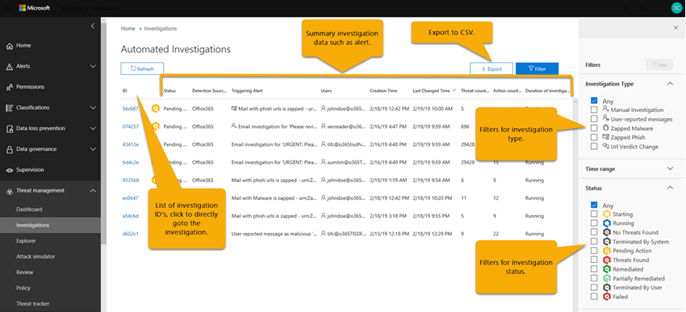
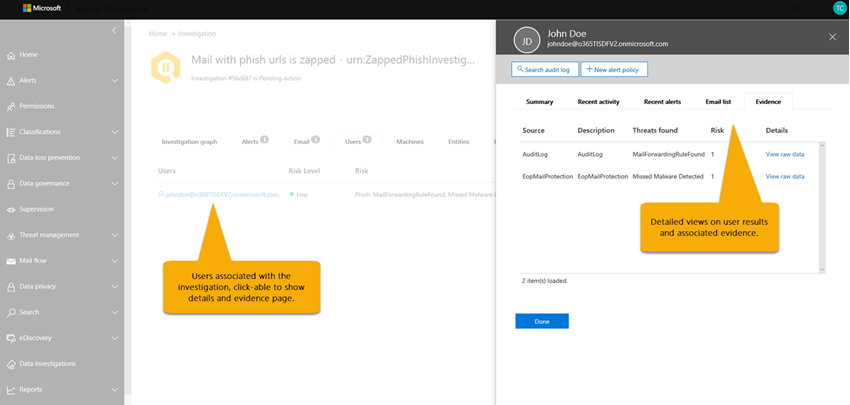

# Details und Ergebnisse einer automatisierten Untersuchung in Microsoft 365Details and results of an automated investigation in Microsoft 365

[!INCLUDE [Microsoft 365 Defender rebranding](../includes/microsoft-defender-for-office.md)]

Wenn in [Microsoft Defender für Office 365](office-365-atp.md)eine [automatisierte Untersuchung](office-365-air.md) erfolgt, stehen Details zu dieser Untersuchung während und nach dem automatisierten Untersuchungsprozess zur Verfügung.When an [automated investigation](office-365-air.md) occurs in [Microsoft Defender for Office 365](office-365-atp.md), details about that investigation are available during and after the automated investigation process. Wenn Sie über die erforderlichen Berechtigungen verfügen, können Sie diese Details in einer unter Anzeige mit Untersuchungsdetails anzeigen.If you have the necessary permissions, you can view those details in an investigation details view. Die Anzeige mit Untersuchungsdetails bieten Ihnen den aktuellen Status sowie die Möglichkeit, ausstehende Aktionen zu genehmigen.The investigation details view provides you with up-to-date status and the ability to approve any pending actions.

## ErmittlungsstatusInvestigation status

Der unter Suchstatus gibt den Fortschritt der Analyse und der Aktionen an.The investigation status indicates the progress of the analysis and actions. Während der Untersuchung wird der Status geändert, um anzugeben, ob Bedrohungen gefunden wurden und ob Aktionen genehmigt wurden.As the investigation runs, status changes to indicate whether threats were found, and whether actions have been approved.

****

|StatusStatus|BedeutungWhat it means|
|---|---|
|Wird gestartetStarting| Die Untersuchung wurde ausgelöst und wartet darauf, mit der Ausführung zu beginnen.The investigation has been triggered and waiting to start running.|
|Wird ausgeführtRunning| Der Ermittlungsprozess wurde gestartet und ist im Gange.The investigation process has started and is underway. Dieser Status tritt auch ein, wenn [Ausstehende Aktionen](https://docs.microsoft.com/microsoft-365/security/office-365-security/air-review-approve-pending-completed-actions#approve-or-reject-pending-actions) genehmigt werden.This state also occurs when [pending actions](https://docs.microsoft.com/microsoft-365/security/office-365-security/air-review-approve-pending-completed-actions#approve-or-reject-pending-actions) are approved.|
|Keine Bedrohungen gefundenNo Threats Found| Die Untersuchung ist abgeschlossen, und es wurden keine Bedrohungen (Benutzerkonto, e-Mail-Nachricht, URL oder Datei) identifiziert.The investigation has finished and no threats (user account, email message, URL, or file) were identified.   **Tipp** : Wenn Sie vermuten, dass etwas verpasst wurde (beispielsweise ein falsches negativ), können Sie mit [Threat Explorer](https://docs.microsoft.com/microsoft-365/security/office-365-security/threat-explorer)Aktionen ausführen.**TIP** : If you suspect something was missed (such as a false negative), you can take action using [Threat Explorer](https://docs.microsoft.com/microsoft-365/security/office-365-security/threat-explorer).|
|Bedrohungen gefundenThreats Found|Die automatische Untersuchung hat Probleme festgestellt, aber es gibt keine spezifischen Korrekturaktionen zur Lösung dieser Probleme.The automated investigation found issues, but there are no specific remediation actions to resolve those issues.   Der Status "Bedrohungen gefunden" kann auftreten, wenn ein bestimmter Typ von Benutzeraktivität identifiziert wurde, aber keine Bereinigungsaktionen verfügbar sind.The Threats Found status can occur when some type of user activity was identified but no cleanup actions are available. Beispiele hierfür sind die folgenden Benutzeraktivitäten:Examples include any of the following user activities:  -DLP-Ereignis ( [Data Loss Prevention, Verhinderung von Datenverlust](https://docs.microsoft.com/Microsoft-365/compliance/data-loss-prevention-policies) )- A [data loss prevention](https://docs.microsoft.com/Microsoft-365/compliance/data-loss-prevention-policies) (DLP) event  -Eine e-Mail-Sende Anomalie- An email sending anomaly  -Gesendete Schadsoftware- Sent malware  -Phishing gesendet- Sent phish Die Untersuchung hat festgestellt, dass keine böswilligen URLs, Dateien oder e-Mail-Nachrichten behoben werden konnten, und keine zu reparierende Post Fach Aktivität wie das Deaktivieren von Weiterleitungsregeln oder Delegierung.The investigation found no malicious URLs, files, or email messages to remediate, and no mailbox activity to fix, such as turning off forwarding rules or delegation.   **Tipp** : Wenn Sie vermuten, dass etwas verpasst wurde (beispielsweise ein falsches negativ), können Sie mit dem [Threat-Explorer](https://docs.microsoft.com/microsoft-365/security/office-365-security/threat-explorer)untersuchen und Aktionen ausführen.**TIP** : If you suspect something was missed (such as a false negative), you can investigate and take action using [Threat Explorer](https://docs.microsoft.com/microsoft-365/security/office-365-security/threat-explorer).|
|Beendet von SystemTerminated By System| Die Untersuchung wurde angehalten.The investigation stopped. Eine Untersuchung kann aus mehreren Gründen beendet werden:An investigation can stop for several reasons: – Die ausstehenden Aktionen der Untersuchung sind abgelaufen.- The investigation's pending actions expired. Timeout für ausstehende Aktionen nach dem warten auf die Genehmigung für eine Woche.Pending actions time out after awaiting approval for one week.  -Es gibt zu viele Aktionen.- There are too many actions. Wenn beispielsweise zu viele Benutzer auf böswillige URLs klicken, kann die Untersuchung die Möglichkeit überschreiten, alle Analyzer auszuführen, sodass die Untersuchung angehalten wird.For example, if there are too many users clicking on malicious URLs, it can exceed the investigation's ability to run all the analyzers, so the investigation halts.   **Tipp** : Wenn eine Untersuchung angehalten wird, bevor Aktionen durchgeführt wurden, versuchen Sie, Bedrohungen mithilfe von [Threat Explorer](https://docs.microsoft.com/microsoft-365/security/office-365-security/threat-explorer) zu finden und zu adressieren.**TIP** : If an investigation halts before actions were taken, try using [Threat Explorer](https://docs.microsoft.com/microsoft-365/security/office-365-security/threat-explorer) to find and address threats.|
|Ausstehende AktionPending Action| Bei der Untersuchung wurde eine Bedrohung festgestellt, beispielsweise eine böswillige e-Mail, eine bösartige URL oder eine riskante Postfacheinstellung, und eine Aktion zum Beheben dieser Bedrohung wartet auf die [Genehmigung](https://docs.microsoft.com/microsoft-365/security/office-365-security/air-review-approve-pending-completed-actions).The investigation has found a threat, such as a malicious email, a malicious URL, or a risky mailbox setting, and an action to remediate that threat is awaiting [approval](https://docs.microsoft.com/microsoft-365/security/office-365-security/air-review-approve-pending-completed-actions).  Der Status ausstehende Aktion wird ausgelöst, wenn eine Bedrohung mit einer entsprechenden Aktion gefunden wird.The Pending Action state is triggered when any threat with a corresponding action is found. Die Liste der ausstehenden Aktionen kann sich jedoch bei einer Untersuchung vergrössern.However, the list of pending actions can increase as an investigation runs. Überprüfen Sie das [Ermittlungsprotokoll](https://docs.microsoft.com/microsoft-365/security/office-365-security/air-view-investigation-results#playbook-log) , um festzustellen, ob andere Elemente noch ausstehen.Check the [investigation log](https://docs.microsoft.com/microsoft-365/security/office-365-security/air-view-investigation-results#playbook-log) to see if other items are still pending completion.|
|BereinigtRemediated| Die Untersuchung wurde abgeschlossen, und alle Aktionen wurden genehmigt (vollständig behoben).The investigation finished and all actions were approved (fully remediated).  **Hinweis** : genehmigte Korrekturaktionen können Fehler aufweisen, die verhindern, dass die Aktionen ausgeführt werden.**NOTE** : Approved remediation actions can have errors that prevent the actions from being taken. Unabhängig davon, ob Korrekturaktionen erfolgreich abgeschlossen wurden, ändert sich der Ermittlungsstatus nicht.Regardless of whether remediation actions are successfully completed, the investigation status does not change. Überprüfen Sie das [Ermittlungsprotokoll](https://docs.microsoft.com/microsoft-365/security/office-365-security/air-view-investigation-results) auf detaillierte Ergebnisse.Check the [investigation log](https://docs.microsoft.com/microsoft-365/security/office-365-security/air-view-investigation-results) for detailed results.|
|Teilweise behobenPartially Remediated| Die Untersuchung führte zu Korrekturaktionen, einige wurden genehmigt und abgeschlossen.The investigation resulted in remediation actions, and some were approved and completed. Andere Aktionen sind noch [Ausstehend](https://docs.microsoft.com/microsoft-365/security/office-365-security/air-review-approve-pending-completed-actions).Other actions are still [pending](https://docs.microsoft.com/microsoft-365/security/office-365-security/air-review-approve-pending-completed-actions).|
|FehlgeschlagenFailed| Mindestens ein Ermittlungs Analyse-Analyzer hat ein Problem aufgetreten, bei dem es nicht ordnungsgemäß abgeschlossen werden konnte.At least one investigation analyzer ran into a problem where it could not complete properly.   **Hinweis** : Wenn eine Untersuchung fehlschlägt, nachdem Korrekturaktionen genehmigt wurden, sind die Korrekturaktionen möglicherweise weiterhin erfolgreich.**NOTE** : If an investigation fails after remediation actions were approved, the remediation actions might still have succeeded. Überprüfen Sie das [Ermittlungsprotokoll](https://docs.microsoft.com/microsoft-365/security/office-365-security/air-view-investigation-results) auf detaillierte Ergebnisse.Check the [investigation log](https://docs.microsoft.com/microsoft-365/security/office-365-security/air-view-investigation-results) for detailed results.|
|Durch Drosselung in der WarteschlangeQueued By Throttling| In einer Warteschlange wird eine Untersuchung durchgeführt.An investigation is being held in a queue. Wenn andere Untersuchungen abgeschlossen sind, beginnen Warteschlangen Untersuchungen.When other investigations complete, queued investigations begin. Die Drosselung hilft bei der Vermeidung schlechter Dienstleistung.Throttling helps avoid poor service performance.   **Tipp** : Ausstehende Aktionen können einschränken, wie viele neue Untersuchungen ausgeführt werden können.**TIP** : Pending actions can limit how many new investigations can run. Stellen Sie sicher, dass [Ausstehende Aktionen genehmigt (oder abgelehnt)](https://docs.microsoft.com/microsoft-365/security/office-365-security/air-review-approve-pending-completed-actions#approve-or-reject-pending-actions)werden.Make sure to [approve (or reject) pending actions](https://docs.microsoft.com/microsoft-365/security/office-365-security/air-review-approve-pending-completed-actions#approve-or-reject-pending-actions).|
|Durch Drosselung beendetTerminated By Throttling| Wenn eine Untersuchung zu lange in der Warteschleife stattfindet, wird Sie angehalten.If an investigation is held in the queue too long, it stops.   **Tipp** : Sie können [eine Untersuchung von Threat Explorer starten](https://docs.microsoft.com/microsoft-365/security/office-365-security/automated-investigation-response-office#example-a-security-administrator-triggers-an-investigation-from-threat-explorer).**TIP** : You can [start an investigation from Threat Explorer](https://docs.microsoft.com/microsoft-365/security/office-365-security/automated-investigation-response-office#example-a-security-administrator-triggers-an-investigation-from-threat-explorer).|
|

## Anzeigen von Details einer UntersuchungView details of an investigation

1. Wechseln Sie zum Security & Compliance Center ( [https://protection.office.com](https://protection.office.com) ), und melden Sie sich an.Go to the Security & Compliance Center ([https://protection.office.com](https://protection.office.com)) and sign in.

2. Führen Sie einen der folgenden Schritte aus:Do one of the following:

    - Wechseln Sie zu **Threat Management**  >  **Dashboard**.Go to **Threat management** > **Dashboard**. Dadurch gelangen Sie zum [Sicherheits Dashboard](security-dashboard.md).This takes you to the [Security Dashboard](security-dashboard.md). Die Air-Widgets werden am oberen Rand des [Sicherheits Dashboards](security-dashboard.md)angezeigt.Your AIR widgets appear across the top of the [Security Dashboard](security-dashboard.md). Wählen Sie ein Widget aus, beispielsweise **Zusammenfassung der Untersuchungen**.Select a widget, such as **Investigations summary**.

    - Wechseln Sie zu **Threat Management**  >  **Investigations**.Go to **Threat management** > **Investigations**.

    Mit beiden Methoden gelangen Sie zu einer Liste von Untersuchungen.Either method takes you to a list of investigations.

    

3. Wählen Sie in der Liste der Untersuchungen ein Element in der Spalte **ID** aus.In the list of investigations, select an item in the **ID** column. Dadurch wird die Seite Ermittlungs Details geöffnet, beginnend mit dem unter Such Diagramm in der Ansicht.This opens investigation details page, starting with the investigation graph in view.

    

   Verwenden Sie die verschiedenen Registerkarten, um mehr über die Untersuchung zu erfahren.Use the various tabs to learn more about the investigation.

## Anzeigen von Details zu einer Warnung im Zusammenhang mit einer UntersuchungView details about an alert related to an investigation

Bestimmte Arten von Warnungen lösen eine automatische Untersuchung in Microsoft 365 aus.Certain kinds of alerts trigger automated investigation in Microsoft 365. Weitere Informationen finden Sie unter [Alerts](automated-investigation-response-office.md#alerts).To learn more, see [Alerts](automated-investigation-response-office.md#alerts). Verwenden Sie das folgende Verfahren, um Details zu einer Warnung anzuzeigen, die einer automatisierten Untersuchung zugeordnet ist.Use the following procedure to view details about an alert that is associated with an automated investigation.

1. Wechseln Sie zum Security & Compliance Center ( [https://protection.office.com](https://protection.office.com) ), und melden Sie sich an.Go to the Security & Compliance Center ([https://protection.office.com](https://protection.office.com)) and sign in.

2. Wechseln Sie zu **Threat Management**  >  **Investigations**.Go to **Threat management** > **Investigations**.

3. Wählen Sie in der Liste der Untersuchungen ein Element in der Spalte **ID** aus.In the list of investigations, select an item in the **ID** column.

4. Wenn Details zu einer Untersuchung geöffnet sind, wählen Sie die Registerkarte **Benachrichtigungen** aus. Alle Warnungen, die die Untersuchung ausgelöst haben, werden hier aufgelistet.With details of an investigation open, select the **Alerts** tab. Any alerts that triggered the investigation are listed here.

5. W?hlen Sie ein Element in der Liste aus.Select an item in the list. Ein Flyout mit Details zur Warnung und Links zu zusätzlichen Informationen und Aktionen wird geöffnet.A flyout opens, with details about the alert and links to additional information and actions.

6. Überprüfen Sie die Informationen im Flyout, und nehmen Sie abhängig von der jeweiligen Warnung eine Aktion vor, beispielsweise zum **Auflösen** , unter **drücken** oder **Benachrichtigen von Benutzern**.Review the information on the flyout, and, depending on the particular alert, take an action, such as **Resolve** , **Suppress** , or **Notify users**.

    - **Resolve** entspricht dem Schließen einer Warnung.**Resolve** is equivalent to closing an alert

    - Unter **drücken** bewirkt, dass eine Richtlinie Warnungen für einen bestimmten Zeitraum nicht auslöst**Suppress** causes a policy to not trigger alerts for a specified period of time

    - **Benutzer benachrichtigen** startet eine e-Mail mit bereits eingegebenen e-Mail-Adressen der Benutzer und ermöglicht es dem Team für Sicherheitsvorgänge, diesen Benutzern eine Nachricht zu geben.**Notify users** starts an email with users' email addresses already entered, and enables your security operations team to type a message to those users. (Dies ähnelt dem Senden einer Nachricht an Empfänger mithilfe von [Threat Explorer](threat-explorer.md).)(This is similar to sending a message to recipients using [Threat Explorer](threat-explorer.md).)

## Verwenden der verschiedenen RegisterkartenHow to use the various tabs

Die folgenden Abschnitte führen Sie durch die verschiedenen Registerkarten auf der Seite Automatische Untersuchungen und darüber, wie Sie die Informationen verwenden können.The following sections walk you through the various tabs on the automated investigations page and how you can use the information.

### Seite "automatische Untersuchungen"Automated investigations page

Die Seite Automatische Untersuchungen zeigt die Ermittlungen Ihrer Organisation und ihre aktuellen Status.The automated investigations page shows your organization's investigations and their current states.

Sie können:You can:

- Navigieren Sie direkt zu einer Untersuchung (Wählen Sie eine **Ermittlungs-ID** aus).Navigate directly to an investigation (select an **Investigation ID** ).
- Anwenden von Filtern.Apply filters. Wählen Sie zwischen **Ermittlungstyp** , **Zeitbereich** , **Status** oder einer Kombination aus diesen aus.Choose from **Investigation Type** , **Time range** , **Status** , or a combination of these.
- Exportieren Sie die Daten in eine CSV-Datei.Export the data to a .csv file.

### UntersuchungsdiagrammInvestigation graph

Wenn Sie eine bestimmte Untersuchung öffnen, wird die Seite "Ermittlungs Diagramm" angezeigt.When you open a specific investigation, you see the investigation graph page. Auf dieser Seite werden alle unterschiedlichen Entitäten angezeigt: e-Mail-Nachrichten, Benutzer (und deren Aktivitäten) und Geräte, die automatisch als Teil der ausgelösten Warnung untersuchtwurden.This page shows all the different entities: email messages, users (and their activities), and devices that were automatically investigated as part of the alert that was triggered.

Sie können:You can:

- Erhalten Sie eine visuelle Übersicht über die aktuelle Untersuchung.Get a visual overview of the current investigation.
- Hier wird eine Zusammenfassung der Untersuchungsdauer angezeigt.View a summary of the investigation duration.
- Wählen Sie einen Knoten in der Visualisierung aus, um Details zu diesem Knoten anzuzeigen.Select a node in the visualization to view details for that node.
- Wählen Sie eine Registerkarte oben aus, um Details für diese Registerkarte anzuzeigen.Select a tab across the top to view details for that tab.

### Warnungs ErmittlungAlert investigation

Auf der Registerkarte **Benachrichtigungen** für eine Untersuchung können Sie Warnungen anzeigen, die für die Untersuchung relevant sind.On the **Alerts** tab for an investigation, you can see alerts relevant to the investigation. Details umfassen die Warnung, die die Untersuchung ausgelöst hat, und andere korrelierte Warnungen, wie etwa riskante Anmeldungen, [DLP-Richtlinien](https://docs.microsoft.com/Microsoft-365/compliance/data-loss-prevention-policies) Verstöße usw., die mit der Untersuchung korreliert sind.Details include the alert that triggered the investigation and other correlated alerts, such as risky sign-in, [DLP policy](https://docs.microsoft.com/Microsoft-365/compliance/data-loss-prevention-policies) violations, etc., that are correlated to the investigation. Auf dieser Seite kann ein Sicherheitsanalytiker auch weitere Details zu einzelnen Benachrichtigungen anzeigen.From this page, a security analyst can also view additional details on individual alerts.

Sie können:You can:

- Erhalten Sie eine visuelle Übersicht über die aktuelle Auslöse Warnung und alle zugeordneten Warnungen.Get a visual overview of the current triggering alert and any associated alerts.
- Wählen Sie eine Warnung in der Liste aus, um eine Ausklappseite zu öffnen, auf der vollständige Warnungsdetails angezeigt werden.Select an alert in the list to open a fly-out page that shows full alert details.

### E-Mail-UntersuchungEmail investigation

Auf der Registerkarte **e-Mail** für eine Untersuchung können Sie die ursprünglichen e-Mails und die Cluster ähnlicher e-Mails sehen, die im Rahmen der Untersuchung identifiziert wurden.On the **Email** tab for an investigation, you can see the original emails and the clusters of similar email identified as part of the investigation.

Angesichts der schieren Menge an e-Mails, die Benutzer in einer Organisation senden und empfangen, sowie der mehr Benutzer Natur von e-Mail-Kommunikation und Angriffen, wird der Prozess derGiven the sheer volume of email that users in an organization send and receive, plus the multi-user nature of email communications and attacks, the process of

- Gruppieren von e-Mail-Nachrichten basierend auf ähnlichen Attributen aus einer Nachrichtenkopfzeile, einem Textkörper, einer URL und Anlagen;clustering email messages based on similar attributes from a message header, body, URL, and attachments;
- Trennen von böswilligen e-Mails von der guten e-Mail-Nachricht undseparating malicious email from the good email; and
- Ausführen von Aktionen in böswilligen e-Mail-Nachrichtentaking action on malicious email messages

kann erhebliche Zeit in Anspruch nehmen.can take significant time. Dieses Verfahren wird von Air jetzt automatisiert, sodass Zeit und Aufwand für das Sicherheitsteam Ihres Unternehmens gespart werden.AIR now automates this process, saving your organization's security team time and effort.

Während des e-Mail-Analyse Schritts können drei verschiedene Arten von e-Mail-Clustern identifiziert werden: Ähnlichkeits Cluster (alle Untersuchungen), Indikator Cluster (alle Untersuchungen) und Postfach-Benutzer Cluster.Three different types of email clusters may be identified during the email analysis step: similarity clusters (all investigations), indicator clusters (all investigations), and mailbox/user clusters.

- Ähnlichkeits Cluster sind e-Mail-Nachrichten, die durch die Suche nach e-Mails mit ähnlichen Absender-und Inhaltsattributen identifiziert werden.Similarity clusters are email messages identified by hunting for emails with similar sender and content attributes. Diese Cluster werden basierend auf den ursprünglichen Entdeckungs Ergebnissen auf schädliche Inhalte ausgewertet.These clusters are evaluated for malicious content based on the original detection findings. E-Mail-Cluster mit ausreichenden bösartigen e-Mail-Erkennungen werden als böswillig betrachtet.Email clusters that contain enough malicious email detections are considered malicious.
- Indikator Cluster sind e-Mail-Nachrichten, die durch die Suche nach der gleichen Indikator Entität (Datei Hash oder URL) aus der ursprünglichen e-Mail identifiziert werden.Indicator clusters are email messages that are identified by hunting for the same indicator entity (file hash or URL) from the original email. Wenn die ouserriginal-Datei/URL-Entität als bösartig identifiziert wird, wendet Air das Indikator Urteil auf den gesamten Cluster von e-Mail-Nachrichten an, die diese Entität enthalten.When the ouserriginal file/URL entity is identified as malicious, AIR applies the indicator verdict to the entire cluster of email messages containing that entity. Eine als Schadsoftware bezeichnete Datei bedeutet, dass der Cluster von e-Mail-Nachrichten mit dieser Datei als Schadsoftware-e-Mail-Nachrichten behandelt wird.A file identified as malware means that the cluster of email messages containing that file are treated as malware email messages.
- Postfachcluster sind e-Mail-Nachrichten im Zusammenhang mit dem Benutzer, der an einer Benutzer Kompromiss Ermittlung beteiligt ist.Mailbox/user clusters are email messages related to the user involved in a user compromise investigation.  Beachten Sie, dass diese e-Mail-Cluster zur weiteren Analyse durch das Sicherheits Betriebsteam verwendet werden und keine e-Mail-Korrekturaktionen generieren.Note that these email clusters are for further analysis by the security operations team and will not generate email remediation actions.  Das Kompromiss Textbuch-Postfach/Benutzer Cluster überprüft die e-Mails, die von dem Benutzer gesendet werden, der analysiert wird, um die potenziellen Auswirkungen der von dem Postfach gesendeten e-Mails zu verstehen:The compromise playbook's mailbox/user clusters reviews the emails being sent by the user being analyzed, in order to understand the potential impact of the emails being sent from the mailbox:
    - Vom Postfach/Benutzer gesendete böswillige e-Mails, die eine mögliche Gefährdung des Postfachs/des Kontos anzeigen, und zeigen, dass andere Benutzer/Postfächer potenziell von böswilligen Abgesandten als Teil eines Kompromisses betroffen sind.Malicious emails sent from the mailbox/user, which indicate potential compromise of the mailbox/account and will show other users/mailboxes potentially impacted by malicious sent as part of a compromise.
    - Vom Postfach/Benutzer gesendete verdächtige e-Mails, die alle vom Postfach gesendeten Spam/Massen-e-Mails anzeigen, die möglicherweise mit potenziellen Kompromissen verbunden sind oder zumindest potenzielle unerwünschte Aktivitäten aus dem e-Mail-Konto angeben.Suspicious emails sent by the mailbox/user, showing any spam/bulk email sent from the mailbox, which may be related to potential compromise or at least indicate potential unwanted activity from the email account.
    - Saubere e-Mails, die vom Postfach/Benutzer gesendet werden und dem Sicherheits Betriebsteam eine Ansicht der gesendeten legitimen Benutzer-e-Mails bereitstellen, aber möglicherweise die Datenfilterung einschließen, wenn das e-Mail-Konto kompromittiert wird.Clean emails sent by the mailbox/user, which will provide the security operations team a view of legitimate user emails sent, but may include exfiltration of data when the email account is compromised.

Das Ziel des Clusterings besteht darin, andere verwandte e-Mail-Nachrichten zu suchen und zu finden, die von demselben Absender als Teil eines Angriffs oder einer Kampagne gesendet werden.The goal of clustering is to hunt and find other related email messages that are sent by the same sender as part of an attack or a campaign.  In einigen Fällen kann die legitime e-Mail eine Untersuchung auslösen (beispielsweise meldet ein Benutzer eine Marketing-e-Mail).In some cases, legitimate email may trigger an investigation (for example, a user reports a marketing email).  In diesen Szenarien sollte das e-Mail-Clustering erkennen, dass e-Mail-Cluster nicht bösartig sind – wenn dies entsprechend erfolgt, wird keine Bedrohung angegeben, und es wird **keine** e-Mail-Entfernung empfohlen.In these scenarios, the email clustering should identify that email clusters are not malicious – when it appropriately does so, it will **not** indicate a threat nor will it recommend email removal.

Auf der Registerkarte **e** -Mail werden auch e-Mail-Elemente im Zusammenhang mit der Untersuchung angezeigt, beispielsweise die e-Mail-Details des Benutzers, die gemeldeten e-Mails, die e-Mail-Nachricht (en), die aufgrund von Malware/Phishing zapped wurdenThe **Email** tab also shows email items related to the investigation, such as the user-reported email details, the original email reported, the email message(s) zapped due to malware/phish, etc.

Die auf der Registerkarte e-Mail angegebene e-Mail-Anzahl stellt derzeit die Gesamtsumme aller e-Mail-Nachrichten dar, die auf der Registerkarte **e-Mail** angezeigt werden. Da e-Mail-Nachrichten in mehreren Clustern vorhanden sind, ist die tatsächliche Gesamtanzahl der identifizierten e-Mail-Nachrichten (und von Korrekturaktionen betroffen) die Anzahl der eindeutigen e-Mail-Nachrichten, die in allen Clustern und e-Mail-Nachrichten der ursprünglichen Empfänger vorhanden sind.The email count identified on the email tab currently represents the sum total of all email messages shown on the **Email** tab. Because email messages are present in multiple clusters, the actual total count of email messages identified (and affected by remediation actions) is the count of unique email messages present across all of the clusters and original recipients' email messages.

Sowohl Explorer als auch Air zählen e-Mail-Nachrichten pro Empfänger, da sich die Sicherheits Urteile, Aktionen und Zustellungsorte auf Empfängerbasis unterscheiden.Both Explorer and AIR count email messages on a per recipient basis, because the security verdicts, actions, and delivery locations vary on a per-recipient basis. Eine ursprüngliche e-Mail-Nachricht, die an drei Benutzer gesendet wird, zählt also insgesamt drei e-Mail-Nachrichten statt einer e-Mail.Thus, an original email sent to three users counts as a total of three email messages instead of one email. Es kann vorkommen, dass eine e-Mail zwei oder mehr Mal gezählt wird, beispielsweise wenn eine e-Mail mehrere Aktionen enthält oder wenn mehrere Kopien der e-Mail vorhanden sind, wenn alle Aktionen ausgeführt werden.There might be cases where an email gets counted two or more times, such as when an email has multiple actions on it, or when there are multiple copies of the email when all the actions occur. Beispielsweise kann eine Malware-e-Mail, die bei der Zustellung erkannt wird, sowohl eine blockierte (isolierte) e-Mail-Nachricht als auch eine ersetzte e-Mail verursachen (Bedrohungs Datei wurde durch eine Warnungsdatei ersetzt und dann an das Postfach des Benutzers gesendet).For example, a malware email that is detected at delivery can result in both a blocked (quarantined) email and a replaced email (threat file replaced with a warning file, then delivered to user's mailbox). Da es buchstäblich zwei Kopien der e-Mail im System gibt, werden beide möglicherweise in Cluster Zählungen gezählt.Because there are literally two copies of the email in the system, both might be counted in cluster counts.

E-Mail-Anzahlen werden zum Zeitpunkt der Untersuchung berechnet, und einige Zählungen werden neu berechnet, wenn Sie Ermittlungs Flyouts (basierend auf einer zugrunde liegenden Abfrage) öffnen.Email counts are calculated at the time of the investigation and some counts are recalculated when you open investigation flyouts (based on an underlying query). Die e-Mail-Anzahl, die für die e-Mail-Cluster auf der Registerkarte e-Mail angezeigt wird, und der Wert für die e-Mail-Menge im Cluster Flyout werden zum Zeitpunkt der Untersuchung berechnet und nicht geändert.The email counts shown for the email clusters on the email tab and the email quantity value shown on cluster flyout are calculated at the time of investigation and do not change. Die e-Mail-Anzahl, die am unteren Rand der Registerkarte e-Mail-Nachrichten im e-Mail-Cluster-Flyout und der Anzahl der im Explorer angezeigten e-Mail-Nachrichten angezeigt wirdThe email count shown at the bottom of the email tab of the email cluster flyout and the count of email messages shown in Explorer reflect email messages received after the investigation's initial analysis. So würde ein e-Mail-Cluster, der eine ursprüngliche Menge von 10 e-Mail-Nachrichten anzeigt, eine e-Mail-Listen Summe von 15 anzeigen, wenn fünf weitere e-Mail-Nachrichten zwischen der Ermittlungs Analysephase und dem Zeitpunkt, zu dem der AdministratorThus an email cluster that shows an original quantity of 10 email messages would show an email list total of 15 when five more email messages arrive between the investigation analysis phase and when the admin reviews the investigation.  Ebenso können alte Untersuchungen mit größerer Zählung beginnen, als Forscher Abfragen anzeigen, da Defender für Office 365 P2 Daten nach 7 Tagen für Versuche und 30 Tage für bezahlte Lizenzen abläuft.Likewise old investigations may start having bigger counts than Explorer queries show, since Defender for Office 365 P2 expires data after 7 days for trials and 30 days for paid licenses.  Das Anzeigen der Anzahl der historischen und aktuellen Zählungen in unterschiedlichen Ansichten wird durchgeführt, um die e-Mail-Auswirkungen zum Zeitpunkt der Untersuchung und die aktuellen Auswirkungen bis zur Ausführung der Wiederherstellung anzugeben.Showing both count historical and current counts in different views is done to indicate the email impact at the time of investigation and the current impact up until the time that remediation is run.

Als Beispiel wird das folgende Szenario betrachtet.As an example, consider the following scenario. Der erste Cluster von drei e-Mail-Nachrichten wurde als Phishing betrachtet.The first cluster of three email messages were deemed to be phish. Ein weiterer Cluster ähnlicher Nachrichten mit derselben IP und demselben Betreff wurde gefunden und als bösartig eingestuft, da einige von Ihnen während der anfänglichen Erkennung als Phishing identifiziert wurden.Another cluster of similar messages with the same IP and subject was found and considered malicious, as some of them were identified as phish during initial detection.

Sie können:You can:
- Erhalten Sie eine visuelle Übersicht über die aktuellen Clustering-Ergebnisse und Bedrohungen, die gefunden wurden.Get a visual overview of the current clustering results and threats found.
- Klicken Sie auf eine Cluster Entität oder eine Bedrohungsliste, um eine Ausklappseite zu öffnen, auf der die vollständigen Warnungsdetails angezeigt werden.Click a cluster entity or a threat list to open a fly-out page that shows the full alert details.
- Untersuchen Sie den e-Mail-Cluster weiter, indem Sie oben auf der Registerkarte "e-Mail-Cluster Details" auf den Link "in Explorer öffnen" klicken.Further investigate the email cluster by clicking the 'Open in Explorer' link at the top of the 'Email cluster details' tab

> [!NOTE]
> Im Zusammenhang mit e-Mails wird möglicherweise als Teil der Untersuchung eine Bedrohungs Fläche für Volumen Anomalien angezeigt.In the context of email, you may see a volume anomaly threat surface as part of the investigation. Eine Volumen Anomalie gibt eine Spitze in ähnlichen e-Mail-Nachrichten um die Ermittlungsereignis Zeit im Vergleich zu früheren Zeitrahmen an.A volume anomaly indicates a spike in similar email messages around the investigation event time compared to earlier timeframes. Diese Spitze im e-Mail-Datenverkehr mit ähnlichen Merkmalen (z. b. Betreff-und Absenderdomäne, Text Ähnlichkeit und Absender-IP) ist typisch für den Start von e-Mail-Kampagnen oder-Angriffen.This spike in email traffic with similar characteristics (e.g. subject and sender domain, body similarity and sender IP) is typical of the start of email campaigns or attacks. Massen-, Spam-und legitime e-Mail-Kampagnen teilen diese Merkmale jedoch häufig.However, bulk, spam, and legitimate email campaigns commonly share these characteristics. Volumen Anomalien stellen eine potenzielle Bedrohung dar und können dementsprechend im Vergleich zu Malware-oder Phishing-Bedrohungen, die mit Antiviren-Engines, Detonation oder böswilliger Reputation identifiziert werden, eine geringere schwere aufweisen.Volume anomalies represent a potential threat, and accordingly could be less severe compared to malware or phish threats that are identified using anti-virus engines, detonation or malicious reputation.

### Benutzer ErmittlungUser investigation

Auf der Registerkarte **Benutzer** werden alle Benutzer angezeigt, die als Teil der Untersuchung identifiziert wurden.On the **Users** tab, you can see all the users identified as part of the investigation. Benutzerkonten werden in der Untersuchung angezeigt, wenn ein Ereignis oder ein Hinweis darauf besteht, dass diese Benutzerkonten möglicherweise betroffen oder beeinträchtigt werden.User accounts appear in the investigation when there is an event or indication that those user accounts might be affected or compromised.

In der folgenden Abbildung zeigt Air beispielsweise Indikatoren für Kompromisse und Anomalien basierend auf einer neuen Posteingangsregel, die erstellt wurde.For example, in the following image, AIR has identified indicators of compromise and anomalies based on a new inbox rule that was created. Weitere Details (Beweise) der Untersuchung stehen über detaillierte Ansichten auf dieser Registerkarte zur Verfügung. Zu den Indikatoren für Kompromisse und Anomalien können auch anomale Erkennungen von [Microsoft Cloud App Security](https://docs.microsoft.com/cloud-app-security)gehören.Additional details (evidence) of the investigation are available through detailed views within this tab. Indicators of compromise and anomalies may also include anomaly detections from [Microsoft Cloud App Security](https://docs.microsoft.com/cloud-app-security).

Sie können:You can:
- Erhalten Sie eine visuelle Übersicht über identifizierte Benutzer Ergebnisse und gefundene Risiken.Get a visual overview of identified user results and risks found.
- Wählen Sie einen Benutzer aus, um eine Ausklappseite zu öffnen, auf der die vollständigen Warnungsdetails angezeigt werden.Select a user to open a fly-out page that shows the full alert details.

### Maschinelle UntersuchungMachine investigation

Auf der Registerkarte " **Computer** " werden alle Computer angezeigt, die als Teil der Untersuchung identifiziert wurden.On the **Machines** tab, you can see all the machines identified as part of the investigation.

Im Rahmen einiger Textbuch-Elemente korreliert Air e-Mail-Bedrohungen mit Geräten (z. b. gezappte Schadsoftware).As part of some playbooks, AIR correlates email threats to devices (e.g. Zapped malware). Beispielsweise übergibt eine Untersuchung einen bösartigen Datei Hash an [Microsoft Defender](https://docs.microsoft.com/windows/security/threat-protection/microsoft-defender-atp/microsoft-defender-advanced-threat-protection
) , um den Endpunkt zu untersuchen.For example, an investigation passes a malicious file hash across to [Microsoft Defender for Endpoint](https://docs.microsoft.com/windows/security/threat-protection/microsoft-defender-atp/microsoft-defender-advanced-threat-protection
) to investigate. Dies ermöglicht eine automatisierte Untersuchung relevanter Computer für Ihre Benutzer, um sicherzustellen, dass Bedrohungen sowohl in der Cloud als auch in ihren Endpunkten behandelt werden.This allows for automated investigation of relevant machines for your users, to help ensure that threats are addressed both in the cloud and across your endpoints.

Sie können:You can:

- Erhalten Sie eine visuelle Übersicht über die gefundenen aktuellen Computer und Bedrohungen.Get a visual overview of the current machines and threats found.
- Wählen Sie einen Computer aus, um eine Ansicht zu öffnen, die im entsprechenden [Microsoft Defender für Endpoint Investigations](https://docs.microsoft.com/windows/security/threat-protection/microsoft-defender-atp/automated-investigations) im Microsoft Defender Security Center angezeigt wird.Select a machine to open a view that into the related [Microsoft Defender for Endpoint investigations](https://docs.microsoft.com/windows/security/threat-protection/microsoft-defender-atp/automated-investigations) in the Microsoft Defender Security Center.

### Untersuchung von EntitätenEntity investigation

Auf der Registerkarte **Entitäten** werden die Entitäten, die im Rahmen der Untersuchung identifiziert und analysiert wurden, angezeigt.On the **Entities** tab, you can see the entities identified and analyzed as part of the investigation.

Hier sehen Sie die untersuchten Entitäten und Details der Entitätstypen wie e-Mail-Nachrichten, Cluster, IP-Adressen, Benutzer und vieles mehr.Here, you can see the investigated entities and details of the types of entities, such as email messages, clusters, IP addresses, users, and more. Sie können auch sehen, wie viele Entitäten analysiert wurden, und die Bedrohungen, die jedem zugeordnet wurden.You can also see how many entities were analyzed, and the threats that were associated with each.

Sie können:You can:
- Erhalten Sie eine visuelle Übersicht über die gefundenen Ermittlungs Entitäten und-Bedrohungen.Get a visual overview of the investigation entities and threats found.
- Wählen Sie eine Entität aus, um eine Ausklappseite zu öffnen, auf der die zugehörigen Entitäts Details angezeigt werden.Select an entity to open a fly-out page that shows the related entity details.

### Manuskript ProtokollPlaybook log

Auf der Registerkarte **Protokoll** werden alle Schritte im Textbuch angezeigt, die während der Untersuchung aufgetreten sind.On the **Log** tab, you can see all the playbook steps that have occurred during the investigation. Das Protokoll erfasst einen vollständigen bestand aller Analysatoren und Aktionen, die von Office 365 automatischen Ermittlungsfunktionen als Teil von Air abgeschlossen wurden.The log captures a complete inventory of all analyzers and actions completed by Office 365 auto-investigation capabilities as part of AIR. Es bietet eine klare Sicht auf alle Schritte, einschließlich der Aktion selbst, eine Beschreibung und die Dauer des tatsächlichen von Anfang bis Ende.It provides a clear view of all the steps taken, including the action itself, a description, and the duration of the actual from start to finish.

Sie können:You can:

- Erhalten Sie eine visuelle Übersicht über die ausgeführten Schritte im Textbuch.Get see a visual overview of the playbook steps taken.
- Exportieren Sie die Ergebnisse in eine CSV-Datei.Export the results to a CSV file.
- Filtern Sie die Ansicht.Filter the view.

****

|AnalyzerAnalyzer| BeschreibungDescription|
|---|---|
|Untersuchung der DLP-VerstößeDLP violations investigation|Untersuchen von Verletzungen, die durch [Datenverlust Verhinderung](../../compliance/data-loss-prevention-policies.md) (DLP) erkannt wurdenInvestigate any violations detected by [Data Loss Prevention](../../compliance/data-loss-prevention-policies.md) (DLP)|
|Extraktion von e-Mail-IndikatorenEmail indicators extraction|Extrahieren von Indikatoren aus der Kopfzeile, dem Textkörper und dem Inhalt einer e-Mail-Nachricht zur UntersuchungExtract indicators from the header, body, and content of an email message for investigation|
|Datei Hash ZuverlässigkeitFile Hash Reputation|Erkennen von Anomalien basierend auf Datei Hashes für Benutzer und Computer in Ihrer OrganisationDetect anomalies based on file hashes for users and machines in your organization|
|E-Mail-Cluster IdentifikationMail cluster identification|E-Mail-Clusteranalyse basierend auf Kopf, Text, Inhalt, Dateien und URLsEmail cluster analysis based on header, body, content, files, and URLs|
|Volume-Analyse des e-Mail-ClustersMail cluster volume analysis|E-Mail-Clusteranalyse basierend auf ausgehenden Nachrichtenfluss Volumen MusternEmail cluster analysis based on outbound mail flow volume patterns|
|Untersuchung der e-Mail-DelegationMail delegation investigation|Untersuchen des Zugriffs auf Postfächer für Benutzerpostfächer im Zusammenhang mit dieser UntersuchungInvestigate mail delegation access for user mailboxes related to this investigation|
|Untersuchung von Nachrichten WeiterleitungsregelnMail forwarding rules investigation|Untersuchen aller e-Mail-Weiterleitungsregeln für Benutzerpostfächer in Bezug auf diese UntersuchungInvestigate any mail forwarding rules for user mailboxes related to this investigation|
|Verpasste Schadsoftware erkanntMissed malware detected|Erkennen verpasster Schadsoftware, die dem Postfach des Benutzers in Ihrer Organisation zugestellt wurdeDetect missed malware delivered to user's mailbox in your organization|
|Detonation bei BedarfOn-demand detonation|Auf-Anforderung-Detonation ausgelöst für e-Mail-Nachrichten, Anlagen und URLsOn-demand detonation triggered for email messages, attachments, and URLs|
|Untersuchung der ausgehenden e-Mail-AnomalieOutbound mail anomaly investigation|Erkennen von Anomalien basierend auf Verlaufs Nachrichten Übermittlungs Mustern für Benutzer in Ihrer OrganisationDetect anomalies based on historical mail flow sending patterns for users in your organization|
|Untersuchung der ausgehenden Malware-und Spam AnomalienOutbound malware and spam anomaly investigation|Erkennen von Intra-org-und ausgehenden Schadsoftware, Phishing oder Spam, die von Benutzern in Ihrer Organisation stammenDetect intra-org and outbound malware, phish, or spam originating from users in your organization|
|Untersuchung der AbsenderdomäneSender domain investigation|On-Demand-Überprüfung der Domänen Reputation aus dem [Microsoft Intelligent Security Graph](https://www.microsoft.com/security/operations/intelligence) und externen Threat Intelligence-QuellenOn-demand check of domain reputation from the [Microsoft Intelligent Security Graph](https://www.microsoft.com/security/operations/intelligence) and external threat intelligence sources|
|Untersuchung von Absender-IPSender IP investigation| On-Demand-Überprüfung der IP-Reputation aus dem [Microsoft Intelligent Security Graph](https://www.microsoft.com/security/operations/intelligence) und externen Threat Intelligence-QuellenOn-demand check of IP reputation from the [Microsoft Intelligent Security Graph](https://www.microsoft.com/security/operations/intelligence) and external threat intelligence sources|
|Untersuchung von URL-KlicksURL clicks investigation| Untersuchen von Klicks von Benutzern, die durch [sichere Links in Microsoft Defender](atp-safe-links.md) geschützt sind, für Office 365 in Ihrer OrganisationInvestigate clicks from users protected by [Safe Links in Microsoft Defender for Office 365](atp-safe-links.md) in your organization|
|Untersuchung der URL-ReputationURL reputation investigation|On-Demand-Überprüfung der URL-Reputation aus dem [Microsoft Intelligent Security Graph](https://www.microsoft.com/security/operations/intelligence) und externen Threat Intelligence-QuellenOn-demand check on URL reputation from the [Microsoft Intelligent Security Graph](https://www.microsoft.com/security/operations/intelligence) and external threat intelligence sources|
|Untersuchung von BenutzeraktivitätenUser activity investigation|Analysieren von Anomalien von Benutzeraktivitäten in der [Microsoft Cloud-App-Sicherheit](https://docs.microsoft.com/cloud-app-security/what-is-cloud-app-security)Analyze user activity anomalies in [Microsoft Cloud App Security](https://docs.microsoft.com/cloud-app-security/what-is-cloud-app-security)|
|Extraktion von von Benutzern gemeldeten e-Mail-IndikatorenUser-reported emails indicators extraction|Extrahieren von Indikatoren aus der Kopfzeile, dem Textkörper und dem Inhalt der von [Benutzern gemeldeten e-Mails](enable-the-report-message-add-in.md) zur UntersuchungExtract indicators from the header, body, and content of [user-reported email](enable-the-report-message-add-in.md) for investigation|
|

### Empfohlene AktionenRecommended actions

Auf der Registerkarte **Aktionen** werden alle Textbuch-Aktionen angezeigt, die nach Abschluss der Untersuchung zur Korrektur empfohlen werden.On the **Actions** tab, you can see all the playbook actions that are recommended for remediation after the investigation has completed.

Durch Aktionen werden die Schritte erfasst, die Microsoft am Ende einer Untersuchung empfiehlt.Actions capture the steps Microsoft recommends you take at the end of an investigation. Sie können hier Korrekturaktionen durch Auswählen einer oder mehrerer Aktionen durchführen.You can take remediation actions here by selecting one or more actions. Durch Klicken auf **genehmigen** kann die Wiederherstellung beginnen.Clicking **Approve** allows remediation to begin. (Entsprechende Berechtigungen sind erforderlich – die Funktion "suchen und löschen" ist erforderlich, um Aktionen aus Explorer und Air auszuführen).(Appropriate permissions are needed - the 'Search And Purge' role is required to run actions from Explorer and AIR). Beispielsweise kann ein Sicherheits Leser Aktionen anzeigen, aber nicht genehmigen.For example, a Security Reader can view actions but not approve them. Hinweis: Sie müssen nicht jede Aktion genehmigen.Note: You do not have to approve every action. Wenn Sie mit der empfohlenen Aktion nicht einverstanden sind oder Ihre Organisation keine bestimmten Arten von Aktionen ausgewählt hat, können Sie die Aktionen **ablehnen** oder einfach ignorieren und keine Aktionen ausführen.If you do not agree with the recommended action or your organization does not choose certain types of actions, then you can choose to **Reject** the actions or simply ignore them and take no action. Durch das genehmigen und/oder ablehnen aller Aktionen kann die Untersuchung vollständig abgeschlossen werden (der Status wird korrigiert), während einige Aktionen unvollständig sind und der unter Suchstatus in einen teilweise korrigierten Zustand wechselt.Approving and/or rejecting all actions lets the investigation fully close (status becomes remediated), while leaving some actions incomplete results in the investigation status changing to a partially remediated state.

Sie können:You can:

- Erhalten Sie eine visuelle Übersicht über die empfohlenen Aktionen im Textbuch.Get a visual overview of the playbook-recommended actions.
- Wählen Sie eine einzelne Aktion oder mehrere Aktionen aus.Select a single action or multiple actions.
- Genehmigen oder ablehnen von empfohlenen Aktionen mit Kommentaren.Approve or reject recommended actions with comments.
- Exportieren Sie die Ergebnisse in eine CSV-Datei.Export the results to a CSV file.
- Filtern Sie die Ansicht.Filter the view.

## Nächste SchritteNext steps

- [Überprüfen und genehmigen ausstehender AktionenReview and approve pending actions](air-review-approve-pending-completed-actions.md#approve-or-reject-pending-actions)

- [Informationen zur automatischen Untersuchung und Antwort in Microsoft 365 DefenderLearn about automated investigation and response in Microsoft 365 Defender](https://docs.microsoft.com/microsoft-365/security/mtp/mtp-autoir)
