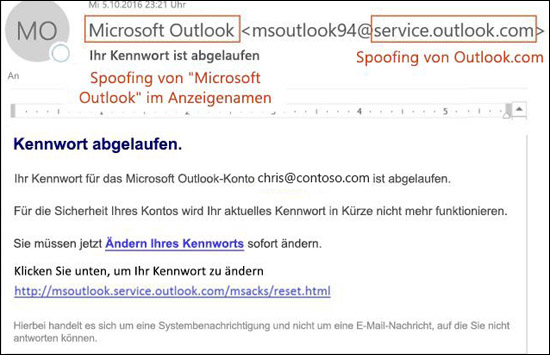
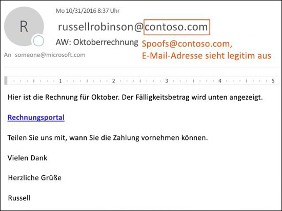
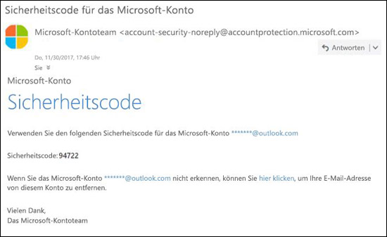

# AntispoofingschutzAnti-spoofing protection

Falls Sie ein Microsoft 365-Kunde mit Postfächern in Exchange Online oder ein Kunde des eigenständigen Exchange Online Protection-Produkts (EOP) ohne Exchange Online-Postfächer sind, beinhaltet EOP Features, die Ihre Organisation vor gefälschten („gespooften“) Absendern schützen können.If you're an Microsoft 365 customer with mailboxes in Exchange Online or a standalone Exchange Online Protection (EOP) customer without Exchange Online mailboxes, EOP includes features to help protect your organization from spoofed (forged) senders.

Wenn es um den Schutz der Benutzer geht, nimmt Microsoft die Bedrohung durch Phishing ernst.When it comes to protecting its users, Microsoft takes the threat of phishing seriously. Spoofing ist eine gängige Technik, die von Angreifern verwendet wird.Spoofing is a common technique that's used by attackers. **Diese gefälschten („Spoofing“-)Nachrichten scheinen von einer anderen Quelle als der tatsächlichen Quelle zu stammen**.**Spoofed messages appear to originate from someone or somewhere other than the actual source**. Diese Methode wird häufig bei Phishingkampagnen verwendet, die darauf abzielen, an Anmeldeinformationen des Benutzers zu gelangen.This technique is often used in phishing campaigns that are designed to obtain user credentials. Die Anti-Spoofing-Technologie in EOP prüft speziell auf Fälschungen des „Von“-Headers im Nachrichtentext (diese Information wird genutzt, um den Absender in E-Mail-Clients anzuzeigen).The anti-spoofing technology in EOP specifically examines forgery of the From header in the message body (used to display the message sender in email clients). Wenn EOP mit hoher Wahrscheinlichkeit zu dem Ergebis kommt, dass der „Von“-Header gefälscht ist, wird die Nachricht als Spoof identifiziert.When EOP has high confidence that the From header is forged, the message is identified as spoofed.

Die folgenden Anti-Spoofing-Technologien stehen in EOP zur Verfügung:The following anti-spoofing technologies are available in EOP:

- **Spoofing Intelligence**: Überprüfen Sie gefälschte Nachrichten von Absendern in internen und externen Domänen und lassen Sie diese Absender zu oder blockieren Sie sie.**Spoof intelligence**: Review spoofed messages from senders in internal and external domains, and allow or block those senders. Weitere Informationen finden Sie unter [Konfigurieren der Spoofintelligenz in Microsoft 365](learn-about-spoof-intelligence.md).For more information, see [Configure spoof intelligence in Microsoft 365](learn-about-spoof-intelligence.md).

- **Anti-Phishing-Richtlinien**: IN EOP können Sie mit der integrierten Anti-Phishing-Richtlinie Spoofintelligenz aktivieren oder deaktivieren, die Identifikation nicht authentifizierter Absender in Outlook aktivieren oder deaktivieren und die Aktion für blockierte Spoof-Absender angeben (in den Ordner „Junk-E-Mail“ oder „Quarantäne“ verschieben).**Anti-phishing policies**: In EOP, the built-in anti-phishing policy allows you to turn spoof intelligence on or off, turn unauthenticated sender identification in Outlook on or off, and specify the action for blocked spoofed senders (move to the Junk Email folder or quarantine). Erweiterte Anti-Phishing-Richtlinien, die in Office 365 Advanced Threat Protection (ATP) verfügbar sind, umfassen außerdem Einstellungen für den Identitätswechsel (geschützte Absender und Domänen), Postfach-Intelligenz-Einstellungen und anpassbare erweiterte Phishing-Schwellen.Advanced anti-phishing policies that are available in Office 365 Advanced Threat Protection (ATP) also contain anti-impersonation settings (protected senders and domains), mailbox intelligence settings, and adjustable advanced phishing thresholds. Weitere Informationen finden Sie unter [Anti-Phishing-Richtlinien in Microsoft 365](set-up-anti-phishing-policies.md).For more information, see [Anti-phishing policies in Microsoft 365](set-up-anti-phishing-policies.md).

- **E-Mail-Authentifizierung**: ein wesentlicher Bestandteil aller Anti-Spoofing-Anstrengungen ist die Verwendung von E-Mail-Authentifizierung (auch als E-Mail-Überprüfung bezeichnet) durch SPF-, DKIM- und DMARC-Einträge in DNS.**Email authentication**: An integral part of any anti-spoofing effort is the use of email authentication (also known as email validation) by SPF, DKIM, and DMARC records in DNS. Sie können diese Einträge für Ihre Domänen so konfigurieren, dass Ziel-E-Mail-Systeme die Gültigkeit von Nachrichten überprüfen können, die von Absendern in Ihren Domänen stammen.You can configure these records for your domains so destination email systems can check the validity of messages that claim to be from senders in your domains. Bei eingehenden Nachrichten erfordert Microsoft 365 eine E-Mail-Authentifizierung für Absenderdomänen.For inbound messages, Microsoft 365 requires email authentication for sender domains. Weitere Informationen finden Sie unter [E-Mail-Authentifizierung in Microsoft 365](email-validation-and-authentication.md).For more information, see [Email authentication in Microsoft 365](email-validation-and-authentication.md).

Die Anti-Spoofing-Technologie von Microsoft wurde ursprünglich nur für Organisationen mit Office 365 Advanced Threat Protection (ATP) bereitgestellt.Microsoft's anti-spoofing technology was originally deployed only to organizations with Office 365 Office 365 Advanced Threat Protection (ATP). Im Oktober 2018 wurde EOP ein Anti-Spoofing-Schutz hinzugefügt.In October  2018, anti-spoofing protection was added to EOP.

EOP analysiert und blockiert Nachrichten, die nicht durch die Kombination von standardmäßigen E-Mail-Authentifizierungsmethoden und Absender-Reputations-Techniken authentifiziert werden können.EOP analyzes and blocks messages that can't be authenticated by the combination of standard email authentication methods and sender reputation techniques.

## Verwenden von Spoofing bei PhishingangriffenHow spoofing is used in phishing attacks

Spoofingnachrichten weisen die folgenden negativen Auswirkungen für Benutzer auf:Spoofing messages have the following negative implications for users:

- **Gefälschte Nachrichten täuschen Benutzer**: Eine gefälschte Nachricht kann den Empfänger dazu bringen, auf einen Link zu klicken und seine Anmeldeinformationen preiszugeben, Malware herunterzuladen oder mit vertraulichen Inhalten auf eine Nachricht zu antworten (letzteres wird als „Business Email Compromise“, kurz „BEC“, bezeichnet).**Spoofed messages deceive users**: A spoofed message might trick the recipient into clicking a link and giving up their credentials, downloading malware, or replying to a message with sensitive content (known as a business email compromise or BEC).

  Die folgende Nachricht ist ein Beispiel für Phishing. Sie nutzt den gefälschten Absender msoutlook94@service.outlook.com:The following message is an example of phishing that uses the spoofed sender msoutlook94@service.outlook.com:

  

  Diese Nachricht kam nicht von service.outlook.com, aber der Angreifer hat das **Von**-Kopfzeilenfeld gefälscht, damit es so wirkt, als ob dies der Fall wäre.This message didn't come from service.outlook.com, but the attacker spoofed the **From** header field to make it look like it did. Dies war ein Versuch, den Empfänger dazu zu bringen, auf den Link **Kennwort ändern** zu klicken, um seine Anmeldeinformationen preiszugeben.This was an attempt to trick the recipient into clicking the **change your password** link and giving up their credentials.

  Die folgende Nachricht ist ein Beispiel für BEC, welche die gefälsche E-Mail-Domäne contoso.com verwendet:The following message is an example of BEC that uses the spoofed email domain contoso.com:

  

  Die Nachricht wirkt legitim, doch der Absender ist gefälscht.The message looks legitimate, but the sender is spoofed.

- **Benutzer können echte Nachrichten nicht von gefälschten unterscheiden**: selbst Benutzer, die sich über Phishing informieren, können Schwierigkeiten haben, die Unterschiede zwischen echten und gefälschten Nachrichten zu erkennen.**Users confuse real messages for fake ones**: Even users who know about phishing might have difficulty seeing the differences between real messages and spoofed messages.

  Die folgende Nachricht ist ein Beispiel einer echten Nachricht zur Kennwortrücksetzung vom Microsoft Security-Konto:The following message is an example of a real password reset message from the Microsoft Security account:

  

  Die Nachricht stammt tatsächlich von Microsoft, jedoch sind Benutzer inzwischen darauf konditioniert, misstrauisch zu sein.The message really did come from Microsoft, but users have been conditioned to be suspicious. Da es schwierig ist, zwischen einer echten Nachricht zur Kennwortzurücksetzung und einer gefälschten zu unterscheiden, könnten Benutzer diese Nachricht ignorieren, sie als Spam melden oder sie unnötigerweise als Phishing-Versuch an Microsoft melden.Because it's difficult to the difference between a real password reset message and a fake one, users might ignore the message, report it as spam, or unnecessarily report the message to Microsoft as phishing.

## Verschiedene Typen von SpoofingDifferent types of spoofing

Microsoft unterscheidet zwei verschiedene Typen von gefälschten Nachrichten:Microsoft differentiates between two different types of spoofed messages:

- **Organisationsinternes Spoofing**: wird auch als _Self-to-Self_-Spoofing bezeichnet.**Intra-org spoofing**: Also known as _self-to-self_ spoofing. Zum Beispiel:For example:

  - Absender und Empfänger befinden sich in derselben Domäne:The sender and recipient are in the same domain:
    > Von: chris@contoso.comFrom: chris@contoso.com   An: michelle@contoso.comTo: michelle@contoso.com

  - Absender und Empfänger befinden sich in Subdomänen derselben Domäne:The sender and the recipient are in subdomains of the same domain:
    > Von: laura@marketing.fabrikam.comFrom: laura@marketing.fabrikam.com   An: julia@engineering.fabrikam.comTo: julia@engineering.fabrikam.com

  - Der Absender und der Empfänger befinden sich in unterschiedlichen Domänen, die derselben Organisation angehören (dies bedeutet, dass beide Domänen als [akzeptierte Domänen](https://docs.microsoft.com/exchange/mail-flow-best-practices/manage-accepted-domains/manage-accepted-domains) in derselben Organisation konfiguriert sind):The sender and recipient are in different domains that belong to the same organization (that is, both domains are configured as [accepted domains](https://docs.microsoft.com/exchange/mail-flow-best-practices/manage-accepted-domains/manage-accepted-domains) in the same organization):
    > Von: absender @ microsoft.comFrom: sender @ microsoft.com   An: empfänger @ bing.comTo: recipient @ bing.com

    In den E-Mail-Adressen werden Leerzeichen verwendet, um die Sammlung durch Spambots zu verhindern.Spaces are used in the email addresses to prevent spambot harvesting.

  Nachrichten, bei denen die [zusammengesetzte Authentifizierung](email-validation-and-authentication.md#composite-authentication) aufgrund von organisationsinternem Spoofing fehlschlägt, enhalten die folgenden Werte im Header:Messages that fail [composite authentication](email-validation-and-authentication.md#composite-authentication) due to intra-org spoofing contain the following header values:

  `Authentication-Results: ... compauth=fail reason=6xx`

  `X-Forefront-Antispam-Report: ...CAT:SPM/HSPM/PHSH;...SFTY:9.11`

  - `reason=6xx` zeigt organisationsinternes Spoofing an.`reason=6xx` indicates intra-org spoofing.

  - CAT ist die Kategorie der Nachricht. Sie wird in der Regel als SPM (Spam) gekennzeichnet, gelegentlich kann dies jedoch HSPM (Nachricht mit hoher Spamwahrscheinlichkeit) oder PHISH (Phishing) sein, je nachdem, welche anderen Typen von Mustern in der Nachricht erkannt wurden.CAT is the category of the message, and it is normally SPM (spam), but occasionally might be HSPM (high confidence spam) or PHISH (phishing) depending upon what other types of patterns were detected in the message.

  - SFTY ist die Sicherheitsstufe der Nachricht.SFTY is the safety level of the message. 9 zeigt Phishing an, 11 steht für organisationsinternes Spoofing.9 indicates phishing, .11 indicates intra-org spoofing.

- **Domänenübergreifendes Spoofing**: die Absender- und Empfängerdomäne sind unterschiedlich und es gibt keine Beziehung zueinander (auch als externe Domänen bezeichnet).**Cross-domain spoofing**: The sender and recipient domains are different, and have no relationship to each other (also known as external domains). Zum Beispiel:For example:
    > Von: chris@contoso.comFrom: chris@contoso.com   An: michelle@tailspintoys.comTo: michelle@tailspintoys.com

  Nachrichten, bei denen die [zusammengesetzte Authentifizierung](email-validation-and-authentication.md#composite-authentication) aufgrund von domänenübergreifendem Spoofing fehlschlägt, enhalten die folgenden Werte im Header:Messages that fail [composite authentication](email-validation-and-authentication.md#composite-authentication) due to cross-domain spoofing contain the following headers values:

  `Authentication-Results: ... compauth=fail reason=000/001`

  `X-Forefront-Antispam-Report: ...CAT:SPOOF;...SFTY:9.22`

  - Der Wert `reason=000` gibt an, dass die explizite E-Mail-Authentifizierung der Nachricht fehlgeschlagen ist.`reason=000` value indicates the message failed explicit email authentication. Der Wert `reason=001` gibt an, dass die implizite E-Mail-Authentifizierung für die Nachricht fehlgeschlagen ist.`reason=001` indicates the message failed implicit email authentication.

  - SFTY ist die Sicherheitsstufe der Nachricht.SFTY is the safety level of the message. 9 zeigt Phishing an, 22 steht für organisationsinternes Spoofing.9 indicates phishing, .22 indicates cross-domain spoofing.

Weitere Informationen zu der Kategorie und den Werten der zusammengesetzten Authentifizierung (compauth), die sich auf Spoofing beziehen, finden Sie unter [Anti-Spam-Nachrichtenheader in Microsoft 365](anti-spam-message-headers.md).For more information about the Category and composite authentication (compauth) values that are related to spoofing, see [Anti-spam message headers in Microsoft 365](anti-spam-message-headers.md).

Weitere Informationen über DMARC finden Sie unter [Verwenden von DMARC zur Überprüfung von E-Mails in Microsoft 365](use-dmarc-to-validate-email.md).For more information about DMARC, see [Use DMARC to validate email in Microsoft 365](use-dmarc-to-validate-email.md).

## Berichte über die Anzahl von Nachrichten, die als gefälscht eingestuft wurdenReports of how many messages were marked as spoofed

EOP-Organisationen können den Bericht **Erkannte Fälschungen** im Berichte-Dashboard im Security & Compliance Center verwenden.EOP organizations can use the **Spoof detections** report in the reports dashboard in the Security & Compliance Center. Weitere Informationen finden Sie unter [Bericht „Erkannte Fälschungen“](view-email-security-reports.md#spoof-detections-report).For more information, see [Spoof Detections report](view-email-security-reports.md#spoof-detections-report).

Office 365 ATP-Organisationen können den Sicherheitsrisiken-Explorer im Security & Compliance Center verwenden, um Informationen zu Phishingversuchen anzuzeigen.Office 365 ATP organization can use Threat Explorer in the Security & Compliance Center to view information about phishing attempts. Weitere Informationen finden Sie unter [Microsoft 365 Untersuchung von und Antwort auf Bedrohungen](office-365-ti.md).For more information, see [Microsoft 365 threat investigation and response](office-365-ti.md).

## Probleme mit dem AntispoofingschutzProblems with anti-spoofing protection

Mailinglisten (auch bekannt als Diskussionslisten) haben bekanntermaßen Probleme mit Anti-Spoofing. Dies wird durch die Art verursacht, auf die sie Nachrichten weiterleiten und modifizieren.Mailing lists (also known as discussion lists) are known to have problems with anti-spoofing due to the way they forward and modify messages.

Beispielsweise interessiert sich Gabriela Laureano (glaureano@contoso.com) für Vogelbeobachtung, schließt sich der Diskussionsliste birdwatchers@fabrikam.com an und schickt folgende Nachricht an die Liste:For example, Gabriela Laureano (glaureano@contoso.com) is interested in bird watching, joins the mailing list birdwatchers@fabrikam.com, and sends the following message to the list:

> **Von:** „Gabriela Laureano“ \<glaureano@contoso.com\>**From:** "Gabriela Laureano" \<glaureano@contoso.com\>   **An:** Diskussionsliste für Vogelbeobachtung \<birdwatchers@fabrikam.com\>**To:** Birdwatcher's Discussion List \<birdwatchers@fabrikam.com\>   \
\**Betreff:\** Großartiger Blick auf Blauhäher auf dem Mount \
\**Subject:\** Great viewing of blue jays at the top of Mt. Rainier diese WocheRainier this week   Jemand Interesse an diesem Ausblick von dieser Woche am MountAnyone want to check out the viewing this week from Mt. Rainier?Rainier?

Der Diskussionslisten-Server empfängt die Nachricht, ändert deren Inhalt und sendet sie an die Mitglieder der Liste.The mailing list server receives the message, modifies its content, and replays it to the members of list. Die an die Mitglieder ausgesendete Nachricht hat zwar die gleiche „Von“-Adresse (glaureano@contoso.com), jedoch wurde der Betreffzeile ein Tag und eine der Nachricht eine Fußzeile hinzugefügt.The replayed message has the same From address (glaureano@contoso.com), but a tag is added to the subject line, and a footer is added to the bottom of the message. Diese Art von Änderung ist in Diskussionslisten üblich und kann zu falsch-positiven Ergebnissen der Spoofing-Prüfung führen.This type of modification is common in mailing lists, and may result in false positives for spoofing.

> **Von:** „Gabriela Laureano“ \<glaureano@contoso.com\>**From:** "Gabriela Laureano" \<glaureano@contoso.com\>   **An:** Diskussionsliste für Vogelbeobachtung \<birdwatchers@fabrikam.com\>**To:** Birdwatcher's Discussion List \<birdwatchers@fabrikam.com\>   **Betreff:** [BIRDWATCHERS] Großartiger Blick auf Eichelhäher am Mount**Subject:** [BIRDWATCHERS] Great viewing of blue jays at the top of Mt. Rainier diese WocheRainier this week    Jemand Interesse an diesem Ausblick von dieser Woche am MountAnyone want to check out the viewing this week from Mt. Rainier?Rainier?    Diese Nachricht wurde an die Diskussionsgruppe Vögelbeobachtung gesendet.This message was sent to the Birdwatchers Discussion List. Sie können sich jederzeit wieder abmelden.You can unsubscribe at any time.

Um Nachrichten aus Diskussionslisten dabei zu helfen, die Anti-Spoofing-Prüfungen zu bestehen, führen Sie die folgenden Schritte aus, je nachdem, ob Sie die Diskussionsliste kontrollieren:To help mailing list messages pass anti-spoofing checks, do following steps based on whether you control the mailing list:

- Ihre Organisation ist Eigentümer der Diskussionsliste:Your organization owns the mailing list:

  - Lesen Sie die häufig gestellten Fragen unter DMARC.org: [I operate a mailing list and I want to interoperate with DMARC, what should I do?](https://dmarc.org/wiki/FAQ#I_operate_a_mailing_list_and_I_want_to_interoperate_with_DMARC.2C_what_should_I_do.3F).Check the FAQ at DMARC.org: [I operate a mailing list and I want to interoperate with DMARC, what should I do?](https://dmarc.org/wiki/FAQ#I_operate_a_mailing_list_and_I_want_to_interoperate_with_DMARC.2C_what_should_I_do.3F).

  - Lesen Sie die Anweisungen in diesem Blogbeitrag: [A tip for mailing list operators to interoperate with DMARC to avoid failures](https://blogs.msdn.microsoft.com/tzink/2017/03/22/a-tip-for-mailing-list-operators-to-interoperate-with-dmarc-to-avoid-failures/).Read the instructions at this blog post: [A tip for mailing list operators to interoperate with DMARC to avoid failures](https://blogs.msdn.microsoft.com/tzink/2017/03/22/a-tip-for-mailing-list-operators-to-interoperate-with-dmarc-to-avoid-failures/).

  - Ziehen Sie es in Erwägung, Updates für diesen Mailinglistserver zu installieren, damit ARC unterstützt wird. Informationen dazu finden Sie unter [https://arc-spec.org](https://arc-spec.org/)Consider installing updates on your mailing list server to support ARC, see [https://arc-spec.org](https://arc-spec.org/)

- Ihre Organisation ist nicht Eigentümer der Diskussionsliste:Your organization doesn't own the mailing list:

  - Bitten Sie den Betreuer der Diskussionsliste, die E-Mail-Authentifizierung für die Domäne zu konfigurieren, aus der die Diskussionsliste weitergeleitet wird.Ask the maintainer of the mailing list to configure email authentication for the domain that the mailing list is relaying from.

    Wenn genügend Absender den Domänenbesitzern antworten und darum bitten, E-Mail-Authentifizierungsdatensätze einzurichten, werden diese möglicherweise dazu angespornt, die entsprechenden Maßnahmen zu ergreifen.When enough senders reply back to domain owners that they should set up email authentication records, it spurs them into taking action. Microsoft arbeitet zwar auch mit Domänenbesitzern zusammen, um die erforderlichen Datensätze zu veröffentlichen, es hilft jedoch, wenn einzelne Benutzer sie zusätzlich dazu auffordern.While Microsoft also works with domain owners to publish the required records, it helps even more when individual users request it.

  - Erstellen Sie in Ihrem E-Mail-Client Regeln, um die Nachrichten in den Posteingang zu verschieben.Create inbox rules in your email client to move messages to the Inbox. Sie können auch Ihre Administratoren bitten, Außerkraftsetzungen so zu konfigurieren, wie dies in [Spoof-Intelligenz zur Konfiguration zulässiger Absender unauthentifizierter E-Mails verwenden](email-validation-and-authentication.md#use-spoof-intelligence-to-configure-permitted-senders-of-unauthenticated-email) beschrieben ist.You can also ask your admins to configure overrides as discussed in the [Use spoof intelligence to configure permitted senders of unauthenticated email](email-validation-and-authentication.md#use-spoof-intelligence-to-configure-permitted-senders-of-unauthenticated-email).

  - Erstellen Sie ein Supportticket für Microsoft 365, um eine Außerkraftsetzung für die Diskussionsliste zu erstellen, damit sie als seriöser Empfänger gehandhabt wird.Create a support ticket with Microsoft 365 to create an override for the mailing list to treat it as legitimate. Weitere Informationen finden Sie unter [Kontaktieren des Supports für Business-Produkte – Administratorhilfe](../../admin/contact-support-for-business-products.md).For more information, see [Contact support for business products - Admin Help](../../admin/contact-support-for-business-products.md).

Falls alles andere fehlschlägt, können Sie die Nachricht als falsch-positiv an Microsoft melden.If all else fails, you can report the message as a false positive to Microsoft. Weitere Informationen finden Sie unter [Melden von Nachrichten und Dateien an Microsoft](report-junk-email-messages-to-microsoft.md).For more information, see [Report messages and files to Microsoft](report-junk-email-messages-to-microsoft.md).

Sie können auch Ihren Administrator kontaktieren, der ein Supportticket bei Microsoft öffnen kann.You may also contact your admin who can raise it as a support ticket with Microsoft. Das Microsoft-Entwicklungsteam prüft anschließend, warum die Nachricht als Spoofingnachricht eingestuft wurde.The Microsoft engineering team will investigate why the message was marked as a spoof.

## Überlegungen zum Schutz vor SpoofingConsiderations for anti-spoofing protection

Falls Sie ein Administrator sind, der aktuell Nachrichten an Microsoft 365 sendet, müssen Sie sicherstellen, dass Ihre E-Mails ordnungsgemäß authentifiziert werden.If you're an admin who currently sends messages to Microsoft 365, you need to ensure that your email is properly authenticated. Andernfalls werden sie möglicherweise als Spam oder Phishingversuch gekennzeichnet.Otherwise, it might be marked as spam or phish. Weitere Informationen finden Sie unter [Lösungen für seriöse Absender, die nicht-authentifizierte E-Mails senden](email-validation-and-authentication.md#solutions-for-legitimate-senders-who-are-sending-unauthenticated-email).For more information, see [Solutions for legitimate senders who are sending unauthenticated email](email-validation-and-authentication.md#solutions-for-legitimate-senders-who-are-sending-unauthenticated-email).