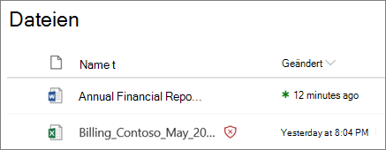
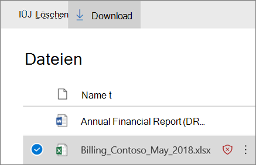

# ATP für SharePoint, OneDrive und Microsoft Teams

[!INCLUDE [Microsoft 365 Defender rebranding](../includes/microsoft-defender-for-office.md)]

## Übersicht über Office 365 ATP für SharePoint, OneDrive und Microsoft Teams

Personen teilen regelmäßig Dateien und arbeiten mit SharePoint, OneDrive und Microsoft Teams zusammen. Mit [Office 365 Advanced Threat Protection](office-365-atp.md) (ATP) kann Ihre Organisation auf sichere Weise zusammenarbeiten. ATP unterstützt das erkennen und Blockieren von Dateien, die als bösartig identifiziert werden, in Teamwebsites und Dokumentbibliotheken.

## So funktioniert Office 365 ATP

Wenn eine Datei in SharePoint Online, OneDrive für Unternehmen und Microsoft Teams als bösartig identifiziert wurde, wird ATP direkt in die Dateispeicher integriert, um diese Datei zu sperren. In der folgenden Abbildung ist ein Beispiel für eine in einer Bibliothek erkannte schädliche Datei dargestellt.

Obwohl die blockierte Datei immer noch in der Dokumentbibliothek und den Webanwendungen, mobilen Anwendungen oder Desktopanwendungen aufgeführt ist, kann die blockierte Datei nicht geöffnet, kopiert, verschoben oder freigegeben werden. Personen können jedoch eine blockierte Datei löschen. Hier ist ein Beispiel dafür, wie das auf dem mobilen Gerät eines Benutzers aussieht:

Je nachdem, wie Microsoft 365 konfiguriert ist, haben die Benutzer möglicherweise die Möglichkeit, eine blockierte Datei herunterzuladen. Hier sehen Sie, wie das Herunterladen einer gesperrten Datei auf dem mobilen Gerät eines Benutzers aussieht:

Weitere Informationen finden Sie unter [Office 365 ATP für SharePoint, OneDrive, und Microsoft Teams aktivieren](turn-on-atp-for-spo-odb-and-teams.md).

## Beachten Sie diese Punkte

- ATP wird nicht jede einzelne Datei in SharePoint Online, OneDrive für Unternehmen oder Microsoft Teams überprüfen. Es handelt sich hierbei um ein beabsichtigtes Verhalten. Dateien werden asynchron durch einen Prozess überprüft, der Freigabe-und Gast Aktivitätsereignisse zusammen mit intelligenten Heuristiken und Bedrohungs Signalen verwendet, um bösartige Dateien zu identifizieren.

- Stellen Sie sicher, dass Ihre SharePoint-Websites so konfiguriert sind, dass Sie die [moderne Benutzeroberfläche](https://docs.microsoft.com/sharepoint/guide-to-sharepoint-modern-experience)verwenden. Wenn eine Datei als bösartig und blockiert identifiziert wird, können die Benutzer sehen, dass dies in der modernen Benutzeroberfläche aufgetreten ist, jedoch nicht in der klassischen Ansicht. ATP-Schutz wendet an, ob die moderne Erfahrung oder die klassische Ansicht verwendet wird; visuelle Indikatoren, die eine Datei blockiert, sind jedoch nur in der modernen Benutzeroberfläche vorhanden.

- Dateien, die in SharePoint Online, OneDrive für Unternehmen oder Microsoft Teams als bösartig identifiziert werden, werden in [Berichten für Office 365 Advanced Threat Protection](view-reports-for-atp.md) und in [Explorer (und Echtzeiterkennung)](threat-explorer.md)angezeigt.

- ATP ist Teil der allgemeinen Bedrohungsschutz Strategie Ihrer Organisation, die den Schutz vor Spam und Schadsoftware sowie sichere Links und sichere Anlagen umfasst. Weitere Informationen finden Sie unter [Protect Against Threats in Office 365](protect-against-threats.md).

- Ein SharePoint Online Administrator kann bestimmen, ob Personen das Herunterladen von Dateien aktivieren können, die als bösartig erkannt werden. Dies erfolgt durch Ausführen des PowerShell-Cmdlets "SPOTenant" mithilfe eines DisallowInfectedFileDownload-Parameters (siehe [aktivieren Office 365 ATP für SharePoint, OneDrive und Microsoft Teams](turn-on-atp-for-spo-odb-and-teams.md)).

## Quarantäne in ATP für SharePoint Online, OneDrive für Unternehmen und Microsoft Teams

 Ab Ende Mai 2018 werden die [Quarantäne](quarantine-email-messages.md) Funktionen im Security &amp; Compliance Center auf ATP für SharePoint Online, OneDrive für Unternehmen und Microsoft Teams erweitert.

Wenn eine Datei in SharePoint Online, OneDrive für Unternehmen oder Microsoft Teams als bösartig erkannt wird, wird die Datei zusätzlich zu ATP blockiert, wenn die Datei geöffnet oder freigegeben wird, und diese Datei wird in eine Liste mit isolierten Elementen eingeschlossen. (Im Security &amp; Compliance Center finden Sie unter **Threat Management** \> **Review** \> **Quarantine** und Filter for **Files**.)

Wenn Sie Teil des Microsoft 365 for Business-Sicherheitsteams in Ihrer Organisation sind und über die erforderlichen Berechtigungen verfügen, die [im Security &amp; Compliance Center zugewiesen](permissions-in-the-security-and-compliance-center.md)sind, können Sie Dateien herunterladen, freigeben, melden und löschen, die von ATP als schädlich erkannt werden, aus der Quarantäne heraus.

- Durch das **Freigeben und melden** einer Datei wird der ATP-Block für die Datei in der jeweiligen Teamwebsite oder Dokumentbibliothek für SharePoint, OneDrive oder Microsoft Teams entfernt. Benutzer können die Datei dann öffnen, freigeben und herunterladen. Wenn die Option **Bericht an Microsoft senden** ausgewählt ist, wird die Datei als falsch positiv für Microsoft gemeldet.

- Durch das **Löschen einer Datei** wird die Datei aus der Quarantäne entfernt. die Datei wird jedoch weiterhin blockiert geöffnet oder freigegeben. Die Datei muss auch in der entsprechenden Dokumentbibliothek oder Teamwebsite (SharePoint Online, OneDrive für Unternehmen oder Microsoft Teams) gelöscht werden.

- Durch das **Herunterladen einer Datei** können Sie die Datei für alle falsch positiven Ergebnisse herunterladen und analysieren.

## Nächste Schritte

 - [Aktivieren von Office 365 ATP für SharePoint, OneDrive und Microsoft Teams](turn-on-atp-for-spo-odb-and-teams.md)

 - [Anzeigen von Informationen zu bösartigen Dateien, die in SharePoint, OneDrive oder Microsoft Teams erkannt wurden](malicious-files-detected-in-spo-odb-or-teams.md)

