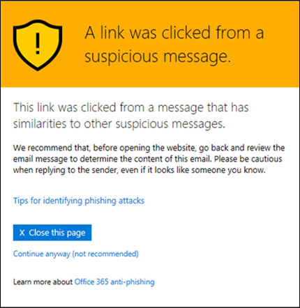

# Warnungsseiten für ATP-sichere Links

> [!IMPORTANT]
> Dieser Artikel richtet sich an Geschäftskunden, die über [Office 365 Advanced Threat Protection](office-365-atp.md) verfügen. Wenn Sie Outlook.com, Microsoft 365-Familie oder Microsoft 365 Personal verwenden und nach Informationen zu sicheren Links in Outlook suchen, lesen Sie [Erweiterte Outlook.com-Sicherheit](https://support.microsoft.com/office/882d2243-eab9-4545-a58a-b36fee4a46e2).

[Office 365 Advanced Threat Protection](office-365-atp.md) (ATP) schützt Ihre Organisation vor Phishing-versuchen und Schadsoftware durch Features wie ATP- [sichere Links](atp-safe-links.md), [ATP-sichere Anlagen](atp-safe-attachments.md)und [Schutz vor Phishing](anti-phishing-protection.md). Wenn der Schutz aktiviert ist, werden Links (URLs) in e-Mail-Nachrichten und Office-Dokumenten überprüft. Wenn eine URL als verdächtig oder böswillig erkannt wird, können Sie möglicherweise daran gehindert werden, die URL zu öffnen, wenn Sie darauf klicken. Anstatt direkt zur Website zu wechseln, wird möglicherweise stattdessen eine Warn Seite angezeigt.

Lesen Sie diesen Artikel, um Beispiele für Warn Seiten anzuzeigen, die möglicherweise zusammen mit den neuesten Updates für Warn Seiten angezeigt werden.

## Beispiele für Warn Seiten

### ATP scannt den Link

Eine URL wird von ATP-Sicherheits Links überprüft. Möglicherweise müssen Sie ein paar Minuten warten, um den Link erneut zu versuchen.

### Eine URL ist in einer verdächtigen e-Mail-Nachricht

Die URL befindet sich in einer e-Mail-Nachricht, die anderen e-Mail-Nachrichten ähnlich scheint, die als verdächtig eingestuft werden. Es wird empfohlen, die e-Mail-Nachricht zu überprüfen, bevor Sie mit der Website fortfahren.

### Eine URL befindet sich in einer Nachricht, die als Phishing-Versuch identifiziert wurde.

Die URL befindet sich in einer e-Mail-Nachricht, die als Phishing-Angriff identifiziert wurde. Daher werden alle URLs in der e-Mail-Nachricht blockiert. Es wird empfohlen, dass Sie nicht mit der Website fortfahren.

### Eine Website wurde als bösartig identifiziert

Die URL verweist auf eine Website, die als bösartig identifiziert wurde.    Es wird empfohlen, dass Sie nicht mit der Website fortfahren.

### Eine Website ist blockiert

Die URL wird für Ihre Organisation blockiert. Es gibt mehrere Gründe, warum eine URL blockiert werden kann. Es wird empfohlen, dass Sie sich an den Microsoft 365 for Business-Administrator Ihrer Organisation wenden.

### An error has occurred

Es ist eine Art von Fehler aufgetreten, und die URL kann nicht geöffnet werden.

## Zuletzt verwendete Updates für Warn Seiten

Einige Warn Seiten wurden kürzlich für Office 365 ATP aktualisiert. Wenn die aktualisierten Seiten noch nicht angezeigt werden, werden Sie in Kürze darauf warten. Die Updates umfassen ein neues Farbschema, weitere Details und die Möglichkeit, trotz der vorgegebenen Warnungen und Empfehlungen zu einer Website zu gelangen.

### URL-Scan wird ausgeführt

Ursprüngliche Warnungsseite:

Aktualisierte Warn Seite:

### Warnung vor Schadsoftware

Ursprüngliche Warnungsseite:

Aktualisierte Warn Seite:

### Warnung zu blockierten URLs

Ursprüngliche Warnungsseite:

Aktualisierte Warn Seite:

### Warnungsseite "Fehler aufgetreten"

Ursprüngliche Warnungsseite:

Aktualisierte Warn Seite:

