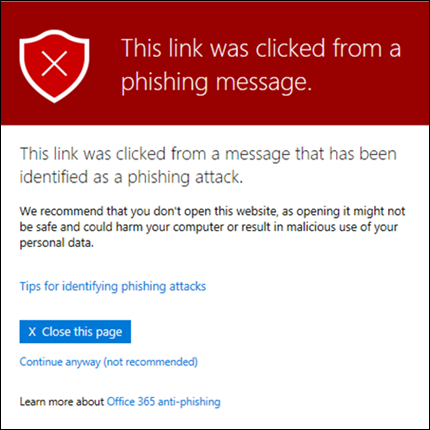

# Sichere Links in Microsoft Defender für Office 365

[!INCLUDE [Microsoft 365 Defender rebranding](../includes/microsoft-defender-for-office.md)]

> [!IMPORTANT]
> Dieser Artikel richtet sich an Geschäftskunden, die [Microsoft Defender für Office 365](office-365-atp.md)haben. Wenn Sie Outlook.com, Microsoft 365-Familie oder Microsoft 365 Personal verwenden und nach Informationen zu Safelinks in Outlook suchen, lesen Sie [Erweiterte Outlook.com-Sicherheit](https://support.microsoft.com/office/882d2243-eab9-4545-a58a-b36fee4a46e2).

Sichere Links sind ein Feature in [Defender für Office 365](office-365-atp.md) , das URL-Scans und das Umschreiben von eingehenden e-Mail-Nachrichten in der Nachrichtenübermittlung sowie die Zeit-für-Klick-Überprüfung von URLs und Links in e-Mail-Nachrichten und anderen Speicherorten bereitstellt. Die Überprüfung von sicheren Links erfolgt zusätzlich zum regulären [Antispam-und Antischadsoftware-Schutz](anti-spam-and-anti-malware-protection.md) in eingehenden e-Mail-Nachrichten in Exchange Online Protection (EoP). Durch das Scannen sicherer Links können Sie Ihre Organisation vor bösartigen linksschützen, die in Phishing-und anderen Angriffen verwendet werden.

Der Schutz für sichere Links ist an den folgenden Speicherorten verfügbar:

- **E-Mail-Nachrichten** : sicherer Links Schutz für Links in e-Mail-Nachrichten wird durch Richtlinien für sichere Links gesteuert. Es gibt keine Standardrichtlinie für sichere Links, **um den Schutz von sicheren Links in e-Mail-Nachrichten zu erhalten, müssen Sie eine oder mehrere Richtlinien für sichere Links erstellen**. Anweisungen finden Sie unter [Einrichten von Richtlinien zu sicheren Links in Microsoft Defender für Office 365](set-up-atp-safe-links-policies.md).

  Weitere Informationen zum Schutz für sichere Links für e-Mail-Nachrichten finden Sie im Abschnitt [sichere Links Einstellungen für e-Mail-Nachrichten](#safe-links-settings-for-email-messages) weiter unten in diesem Artikel.

- **Microsoft Teams** (derzeit in der TAP-Vorschau): Safe Links Protection für Links in Teams-Unterhaltungen, Gruppenchats oder von Kanälen wird auch durch Richtlinien für sichere Links gesteuert. Es gibt keine Standardrichtlinie für sichere Links, **um den Schutz von sicheren Links in Microsoft Teams zu erhalten, müssen Sie eine oder mehrere Richtlinien für sichere Links erstellen**.

  Weitere Informationen zum Schutz für sichere Links in Microsoft Teams finden Sie im Abschnitt " [Einstellungen für sichere Links für Microsoft Teams](#safe-links-settings-for-microsoft-teams) " weiter unten in diesem Thema.

- **Office 365 apps** : Schutz für sichere Links für Office 365-Apps ist in unterstützten Desktop-, Mobil-und webaps verfügbar. Sie **Konfigurieren** den Schutz für sichere Links für Office 365 apps in der globalen Einstellung **außerhalb** der Richtlinien für sichere Links. Anweisungen finden Sie unter [Configure Global Settings for Safe Links Settings in Microsoft Defender for Office 365](configure-global-settings-for-safe-links.md).

  Der Schutz für sichere Links für Office 365-apps wird jedoch nur für Benutzer **angewendet** , die in Active Safe Links-Richtlinien enthalten sind. Wenn ein Benutzer nicht in eine aktive Richtlinie für sichere Links eingeschlossen ist, erhält der Benutzer keinen Schutz für sichere Links in unterstützten Office 365-apps.

  Weitere Informationen zum Schutz von sicheren Links in Office 365-apps finden Sie im Abschnitt [Einstellungen für sichere Links für Office 365 apps](#safe-links-settings-for-office-365-apps) weiter unten in diesem Artikel.

Dieser Artikel enthält ausführliche Beschreibungen der folgenden Typen von Einstellungen für sichere Links:

- **Einstellungen in Richtlinien für sichere Links** : Diese Einstellungen gelten nur für die Benutzer, die in den jeweiligen Richtlinien enthalten sind, und die Einstellungen können sich zwischen Richtlinien unterscheiden. Diese Einstellungen umfassen Folgendes:

  - [Einstellungen für sichere Links für e-Mail-Nachrichten](#safe-links-settings-for-email-messages)
  - [Einstellungen für sichere Links für Microsoft Teams](#safe-links-settings-for-microsoft-teams)
  - [Listen "folgende URLs nicht umschreiben" in Richtlinien zu sicheren Links](#do-not-rewrite-the-following-urls-lists-in-safe-links-policies)

- **Globale Einstellungen für sichere Links** : Diese Einstellungen werden global und nicht in Richtlinien für sichere Links konfiguriert. Die Einstellungen gelten jedoch nur für Benutzer, die in Active Safe Links-Richtlinien enthalten sind. Diese Einstellungen umfassen Folgendes:

  - [Einstellungen für sichere Links für Office 365-apps](#safe-links-settings-for-office-365-apps)
  - [Liste "Blockieren der folgenden URLs" für sichere Links](#block-the-following-urls-list-for-safe-links)

In der folgenden Tabelle werden Szenarien für sichere Links in Microsoft 365 und Office 365 Organisationen beschrieben, die Defender für Office 365 einbeziehen (das heißt, das Fehlen von Lizenzen ist in den Beispielen nie ein Problem).

****

|Szenario|Ergebnis|
|---|---|
|Jean ist Mitglied der Marketingabteilung. Schutz für sichere Links für Office 365 Apps ist in den globalen Einstellungen für sichere Links aktiviert, und eine Richtlinie zu sicheren Links, die für Mitglieder der Marketingabteilung gilt, ist vorhanden. Jean öffnet eine PowerPoint-Präsentation in einer e-Mail-Nachricht und klickt dann in der Präsentation auf eine URL.|Jean ist durch sichere Links geschützt.    Jean ist in einer Richtlinie zu sicheren Links enthalten, und der Schutz für sichere Links ist für Office 365 apps aktiviert.    Weitere Informationen zu den Anforderungen für den Schutz von sicheren Links in Office 365-apps finden Sie im Abschnitt [Einstellungen für sichere Links für Office 365 apps](#safe-links-settings-for-office-365-apps) weiter unten in diesem Artikel.|
|Die Microsoft 365 E5-Organisation von Chris hat keine Richtlinien für sichere Links konfiguriert. Chris erhält eine e-Mail von einem externen Absender, der eine URL zu einer bösartigen Website enthält, auf die er schließlich klickt.|Chris ist nicht durch sichere Links geschützt.    Ein Administrator muss mindestens eine Richtlinie für sichere Links für alle Benutzer erstellen, um in eingehenden e-Mail-Nachrichten einen Schutz für sichere Links zu erhalten. Chris muss in den Bedingungen der Richtlinie enthalten sein, um den Schutz von sicheren Links zu erhalten.|
|In der Organisation von Pat haben keine Administratoren keine Richtlinien für sichere Links erstellt, aber der Schutz für sichere Links ist für Office 365 apps aktiviert. Pat öffnet ein Word-Dokument und klickt auf eine URL in der Datei.|Pat ist nicht durch sichere Links geschützt.    Obwohl der Schutz für sichere Links für Office 365-apps global aktiviert ist, ist Pat in keinen aktiven Richtlinien für sichere Links enthalten, sodass der Schutz nicht angewendet werden kann.|
|In der Organisation von Lee `https://tailspintoys.com` wird in der Liste **folgende URLs blockieren** in den globalen Einstellungen für sichere Links konfiguriert. Eine Richtlinie zu sicheren Links, die Lee enthält, ist bereits vorhanden. Lee erhält eine e-Mail-Nachricht, die die URL enthält `https://tailspintoys.com/aboutus/trythispage` . Lee klickt auf die URL.|Die URL wird möglicherweise für Lee automatisch blockiert; Dies hängt vom URL-Eintrag in der Liste und dem verwendeten e-Mail-Client Lee ab. Weitere Informationen finden Sie im Abschnitt ["Blockieren der folgenden URLs" für sichere Links](#block-the-following-urls-list-for-safe-links) weiter unten in diesem Thema.|
|Jamie und Julia arbeiten beide für contoso.com. Vor langer Zeit haben Administratoren Richtlinien für sichere Links konfiguriert, die sowohl für Jamie als auch für Julia gelten. Jamie sendet eine e-Mail an Julia, ohne zu wissen, dass die e-Mail eine bösartige URL enthält.|Julia ist durch sichere Links geschützt, **Wenn** die Richtlinie für sichere Links, die für Sie gilt, so konfiguriert ist, dass Sie auf Nachrichten zwischen internen Empfängern angewendet wird. Weitere Informationen finden Sie im Abschnitt [Einstellungen für sichere Links für e-Mail-Nachrichten](#safe-links-settings-for-email-messages) weiter unten in diesem Thema.|

## Einstellungen für sichere Links für e-Mail-Nachrichten

Sichere Links scannt eingehende e-Mails auf bekannte bösartige Hyperlinks. Gescannte URLs werden mithilfe des Microsoft-Standard-URL-Präfixes umgeschrieben: `https://nam01.safelinks.protection.outlook.com` . Nachdem der Link neu geschrieben wurde, wird er auf potenziell schädliche Inhalte untersucht.

Nach dem Umschreiben einer URL durch sichere Links wird die URL auch dann neu geschrieben, wenn die Nachricht weitergeleitet oder beantwortet wird. Zusätzliche Links, die der weitergeleiteten oder beantworteten Nachricht hinzugefügt werden, werden nicht umgeschrieben.

Die Einstellungen in Richtlinien für sichere Links, die für e-Mail-Nachrichten gelten, werden in der folgenden Liste beschrieben:

- **Wählen Sie die Aktion für unbekannte potenziell bösartige URLs in Nachrichten** aus: aktiviert oder deaktiviert die Überprüfung sicherer Links in e-Mail-Nachrichten. Der empfohlene Wert ist **on**. Wenn Sie diese Einstellung aktivieren, werden die folgenden Aktionen ausgeführt.

  - Das Scannen von sicheren Links wird in Outlook (C2R) unter Windows aktiviert.
  - URLs werden umgeschrieben, und Benutzer werden über sichere Links geschützt, wenn Sie auf URLs in Nachrichten klicken.
  - Wenn Sie auf geklickt haben, werden URLs anhand einer Liste bekannter böswilliger URLs und der [Liste "folgende URLs blockieren"](#block-the-following-urls-list-for-safe-links)überprüft.
  - URLs, die nicht über eine gültige Reputation verfügen, werden asynchron im Hintergrund gezündet.

- Über **nehmen der Echtzeitüberprüfung von URLs auf verdächtige Links und Links, die auf Dateien verweisen** : ermöglicht Echtzeitscans von Links, einschließlich Links in e-Mail-Nachrichten, die auf herunterladbare Inhalte verweisen. Der empfohlene Wert ist aktiviert.

  - **Warten Sie, bis die URL-Überprüfung abgeschlossen ist, bevor Sie die Nachricht senden** :

    - Aktiviert: Nachrichten, die URLs enthalten, werden gespeichert, bis der Scan abgeschlossen ist. Nachrichten werden erst zugestellt, nachdem die URLs bestätigt wurden, um sicher zu sein. Dies ist der empfohlene Wert.
    - Deaktiviert: Wenn die URL-Überprüfung nicht abgeschlossen werden kann, senden Sie die Nachricht trotzdem.

- **Anwenden von sicheren Links auf e-Mail-Nachrichten, die innerhalb der Organisation gesendet werden** : aktiviert oder deaktiviert das Scannen sicherer Hyperlinks für Nachrichten, die zwischen internen Absendern und internen Empfängern innerhalb derselben Exchange Online Organisation gesendet werden. Der empfohlene Wert ist aktiviert.

- **Benutzerklicks nicht nachverfolgen** : aktiviert oder deaktiviert das Speichern von sicheren Links. Klicken Sie auf Daten für URLs, auf die in e-Mail-Nachrichten geklickt wird. Der empfohlene Wert besteht darin, diese Einstellung nicht ausgewählt zu lassen (um Benutzerklicks nachzuverfolgen).

  URL-klickverfolgung für Links in e-Mail-Nachrichten, die zwischen internen Absendern und internen Empfängern gesendet werden, werden derzeit nicht unterstützt.

- **Benutzer dürfen nicht auf die ursprüngliche URL klicken** : ermöglicht oder blockiert Benutzern das durch Klicken auf die [Warnungsseite](#warning-pages-from-safe-links) zur ursprünglichen URL. Der empfohlene Wert ist aktiviert.

- **Schreiben Sie die folgenden URLs nicht neu** : Leaves URLs so wie Sie sind. Verwaltet eine benutzerdefinierte Liste sicherer URLs, die nicht gescannt werden müssen. Die Liste ist für jede Richtlinie für sichere Links eindeutig. Weitere Informationen zur Liste " **folgende URLs nicht umschreiben** " finden Sie im Abschnitt ["folgende URLs nicht umschreiben" in "Richtlinien für sichere Links"](#do-not-rewrite-the-following-urls-lists-in-safe-links-policies) weiter unten in diesem Artikel.

Weitere Informationen zu den empfohlenen Werten für Standard mäßige und strenge Richtlinieneinstellungen für Richtlinien für sichere Links finden Sie unter [Richtlinieneinstellungen für sichere Links](recommended-settings-for-eop-and-office365-atp.md#safe-links-policy-settings).

- **Empfängerfilter** : Sie müssen die Empfängerbedingungen und Ausnahmen angeben, die bestimmen, für wen die Richtlinie gilt. Sie können die folgenden Eigenschaften für Bedingungen und Ausnahmen verwenden:

  - **Der Empfänger ist**
  - **Die Empfängerdomäne ist**
  - **Der Empfänger ist Mitglied von**

  Sie können eine Bedingung oder Ausnahme nur einmal verwenden, die Bedingung oder Ausnahme kann aber mehrere Werte enthalten. Bei mehreren Werten derselben Bedingung oder Ausnahme wird ODER-Logik verwendet (z. B. _\<recipient1\>_ oder _\<recipient2\>_ ). Bei unterschiedlichen Bedingungen oder Ausnahmen wird UND-Logik verwendet (z. B. _\<recipient1\>_ und _\<member of group 1\>_ ).

- **Priorität** : Wenn Sie mehrere Richtlinien erstellen, können Sie die Reihenfolge angeben, in der Sie angewendet werden. Keine zwei Richtlinien können die gleiche Priorität aufweisen, und die Richtlinienverarbeitung endet, nachdem die erste Richtlinie angewendet wurde.

  Weitere Informationen über die Prioritätsreihenfolge und darüber, wie mehrere Richtlinien ausgewertet und angewendet werden, finden Sie unter [Reihenfolge und Priorität beim E-Mail-Schutz](how-policies-and-protections-are-combined.md).

### Funktionsweise von sicheren Links in e-Mail-Nachrichten

Auf einer hohen Ebene wird hier beschrieben, wie der Schutz von sicheren Links in e-Mail-Nachrichten in URLs funktioniert:

1. Alle e-Mail-Nachrichten werden durch EoP, wobei IP-und Umschlag Filter, signaturbasierter Malware Schutz, Antispam-und Antischadsoftware-Filter vor der Zustellung der Nachricht an das Postfach des Empfängers gesendet werden.

2. Der Benutzer öffnet die Nachricht in seinem Postfach und klickt auf eine URL in der Nachricht.

3. Sichere Links überprüft die URL vor dem Öffnen der Website sofort:

   - Wenn die URL in der Liste **folgende URLs blockieren** enthalten ist, wird eine [Warnung für blockierte URLs](#blocked-url-warning) geöffnet.

   - Wenn die URL auf eine Website verweist, die als bösartig eingestuft wurde, wird eine Warn Seite für [böswillige Websites](#malicious-website-warning) (oder eine andere Warnseite) geöffnet.

   - Wenn die URL auf eine herunterladbare Datei verweist und die Einstellung **Echt Zeit-URL-Überprüfung für verdächtige Links und Links, die auf Dateien verweisen** , in der für den Benutzer geltenden Richtlinie aktiviert ist, wird die herunterladbare Datei überprüft.

   - Wenn die URL als sicher eingestuft wird, wird die Website geöffnet.

## Einstellungen für sichere Links für Microsoft Teams

> [!IMPORTANT]
> Ab März 2020 ist dieses Feature in der Vorschau und steht nur Mitgliedern des Microsoft Teams Technology Adoption-Programms (Tap) zur Verfügung. Weitere Informationen zum Veröffentlichungszeitplan finden Sie in der [Microsoft 365-Roadmap](https://www.microsoft.com/microsoft-365/roadmap?rtc=1&filters=&searchterms=Safe%2CLinks%2CProtection%2Cfor%2CMicrosoft%2CTeams).

Sie aktivieren oder deaktivieren den Schutz für sichere Links für Microsoft Teams in Richtlinien für sichere Links. Insbesondere verwenden Sie die Einstellung **Aktion für unbekannte oder potenziell bösartige URLs in Microsoft Teams auswählen** . Der empfohlene Wert ist **on**.

Die folgenden Einstellungen in Richtlinien für sichere Links, die für Links in e-Mail-Nachrichten gelten, gelten auch für Links in Microsoft Teams:

- **Übernehmen der Echt Zeit-URL-Überprüfung auf verdächtige Links und Links, die auf Dateien verweisen**
- **Benutzerklicks nicht nachverfolgen**
- **Benutzer dürfen nicht auf die ursprüngliche URL klicken.**

Diese Einstellungen werden im Abschnitt frühere [Einstellungen für sichere Links für e-Mail-Nachrichten](#safe-links-settings-for-email-messages) erläutert.

Nachdem Sie den Schutz für sichere Links für Microsoft Teams aktiviert haben, werden URLs in Teams anhand einer Liste bekannter böswilliger Links überprüft, wenn der geschützte Benutzer auf den Link klickt (Zeit-zu-Klick-Schutz). URLs werden nicht umgeschrieben. Wenn ein Link als bösartig eingefunden wird, haben Benutzer die folgenden Erfahrungen:

- Wenn auf den Link in einer Microsoft Teams-Unterhaltung, einem Gruppenchat oder einem Kanal geklickt wurde, wird die Warnseite wie im folgenden Screenshot dargestellt im Standardwebbrowser angezeigt.
- Wenn auf der Registerkarte fixiert auf den Link geklickt wurde, wird die Seite Warnung auf der Benutzeroberfläche von Teams auf dieser Registerkarte angezeigt. Die Option zum Öffnen des Links in einem Webbrowser ist aus Sicherheitsgründen deaktiviert.
- Je nachdem, wie die Einstellung **Benutzer zum durch Klicken auf die ursprüngliche URL** in der Richtlinie nicht zulassen konfiguriert ist, kann der Benutzer nicht auf die ursprüngliche URL klicken ( **trotzdem fortfahren (nicht empfohlen)** im Screenshot). Es wird empfohlen, dass Sie die Einstellung nicht zulassen, dass Benutzer auf die **ursprüngliche URL klicken** können, aktivieren, damit Benutzer nicht auf die ursprüngliche URL klicken können.

Wenn der Benutzer, der den Link gesendet hat, nicht in einer Richtlinie für sichere Links enthalten ist, in der der Microsoft Teams-Schutz aktiviert ist, kann der Benutzer die ursprüngliche URL auf seinem Computer oder Gerät durch klicken.

Wenn Sie auf der Seite Warnung auf die Schaltfläche **zurück** kehren klicken, wird der Benutzer an seinen ursprünglichen Kontext oder an seine URL-Adresse zurückgegeben. Wenn Sie jedoch erneut auf den ursprünglichen Link klicken, führt dies dazu, dass die URL durch sichere Links erneut überprüft wird, damit die Warnseite erneut angezeigt wird.

### Funktionsweise von sicheren Links in Microsoft Teams

Auf einer hohen Ebene finden Sie hier, wie Safe Links Protection für URLs in Microsoft Teams funktioniert:

1. Ein Benutzer startet die Teams-app.

2. Microsoft 365 überprüft, ob die Organisation des Benutzers Microsoft Defender für Office 365 enthält und dass der Benutzer in eine aktive Richtlinie für sichere Links eingeschlossen ist, in der der Schutz für Microsoft Teams aktiviert ist.

3. URLs werden zum Zeitpunkt des Klickens für den Benutzer in Chats, Gruppenchats, Kanälen und Registerkarten überprüft.

## Einstellungen für sichere Links für Office 365-apps

Schutz für sichere Links für Office 365 Apps überprüft Links in Office-Dokumenten, keine Links in e-Mail-Nachrichten (es kann aber Links in angefügten Office-Dokumenten in e-Mail-Nachrichten nach dem Öffnen des Dokuments überprüfen).

Der Schutz für sichere Links für Office 365-Apps verfügt über die folgenden Clientanforderungen:

- Microsoft 365-Apps oder Microsoft 365 Business Premium.
  - Aktuelle Versionen von Word, Excel und PowerPoint unter Windows, Mac oder in einem Webbrowser.
  - Office-Apps auf IOS-oder Android-Geräten.
  - Visio unter Windows.
  - OneNote in einem Webbrowser.

- Office 365-apps sind für die Verwendung der modernen Authentifizierung konfiguriert. Weitere Informationen finden Sie unter [So funktioniert die moderne Authentifizierung für Office 2013-, Office 2016-und Office 2019-Client-apps](https://docs.microsoft.com/microsoft-365/enterprise/modern-auth-for-office-2013-and-2016).

- Benutzer sind mit ihren Arbeits-oder Schul Konten angemeldet. Weitere Informationen finden Sie unter [Anmelden bei Office](https://support.microsoft.com/office/b9582171-fd1f-4284-9846-bdd72bb28426).

Sie konfigurieren den Schutz für sichere Links für Office 365-apps in den globalen Einstellungen für sichere Links und nicht in Richtlinien für sichere Links. Damit jedoch der Schutz von sicheren Links für Office 365 apps angewendet wird, muss der Benutzer, der das Office-Dokument öffnet und auf den Link klickt, in eine aktive Richtlinie für sichere Links eingeschlossen werden.

Die folgenden Einstellungen für sichere links stehen für Office 365-Apps zur Verfügung:

- **Office 365 Anwendungen** : aktiviert oder deaktiviert die Überprüfung sicherer Links in unterstützten Office 365-apps. Der Standard-und der empfohlene Wert ist " **on** ".

- **Nicht nachverfolgen, wenn Benutzer auf sichere Links klicken** : aktiviert oder deaktiviert das Speichern von sicheren Links klicken Sie auf Daten für URLs, auf die in den Desktop Versionen Word, Excel, PowerPoint und Visio geklickt wurde. Der empfohlene Wert ist **Off** , was bedeutet, dass Benutzerklicks nachverfolgt werden.

- **Benutzer dürfen keine sicheren Links zu Original-URL durch Klicken** : ermöglicht oder blockiert Benutzern das Klicken auf die [Warnseite](#warning-pages-from-safe-links) , um die ursprüngliche URL in den Desktop Versionen Word, Excel, PowerPoint und Visio anzuzeigen. Der Standard-und der empfohlene Wert ist " **on** ".

Informationen zum Konfigurieren der Einstellungen für sichere Links für Office 365-apps finden Sie unter [configure Safe Links Protection for Office 365 apps](configure-global-settings-for-safe-links.md#configure-safe-links-protection-for-office-365-apps-in-the-security--compliance-center).

Weitere Informationen zu den empfohlenen Werten für Standard mäßige und strenge Richtlinieneinstellungen finden Sie unter [globale Einstellungen für sichere Links](recommended-settings-for-eop-and-office365-atp.md#global-settings-for-safe-links).

### Funktionsweise von sicheren Links in Office 365-apps

Auf einer hohen Ebene finden Sie hier, wie Safe Links Protection für URLs in Office 365 apps funktioniert. Die unterstützten Office 365-apps werden im vorherigen Abschnitt beschrieben.

1. Ein Benutzer meldet sich mit seinem Geschäfts-oder Schulkonto in einer Organisation an, die Microsoft 365-Apps oder Microsoft 365 Business Premium enthält.

2. Der Benutzer öffnet ein Office-Dokument in einer unterstützten Office-App und klickt auf einen Link.

3. Sichere Links überprüft sofort die URL vor dem Öffnen der Zielwebsite:

   - Wenn die URL in der Liste enthalten ist, die das Scannen sicherer Hyperlinks überspringt (die Liste **folgende URLs blockieren** ), wird eine [Warnung Seite blockierter URL](#blocked-url-warning) geöffnet.

   - Wenn die URL auf eine Website verweist, die als bösartig eingestuft wurde, wird eine Warn Seite für [böswillige Websites](#malicious-website-warning) (oder eine andere Warnseite) geöffnet.

   - Wenn die URL auf eine herunterladbare Datei verweist und die Richtlinie für sichere Links, die für den Benutzer gilt, für die Überprüfung von Links zu herunterladbaren Inhalten konfiguriert ist ( **Echt Zeit-URL-Scans für verdächtige Links und Links, die auf Dateien verweisen** ), wird die herunterladbare Datei überprüft.

   - Wenn die URL als sicher eingestuft wird, wird der Benutzer zur Website geleitet.

   - Wenn das Scannen von sicheren Links nicht abgeschlossen werden kann, wird kein Schutz für sichere Links ausgelöst. In Office-Desktop Clients wird der Benutzer gewarnt, bevor er mit der Zielwebsite fortgefahren wird.

> [!NOTE]
> Es kann einige Sekunden zu Beginn jeder Sitzung dauern, um zu überprüfen, ob der Benutzer sichere Links für Office Enabled besitzt.

## Liste "Blockieren der folgenden URLs" für sichere Links

In der Liste **folgende URLs blockieren** werden die Links definiert, die immer durch Scannen sicherer Hyperlinks in den folgenden Speicherorten blockiert werden:

- E-Mail-Nachrichten.
- Dokumente in Office 365-apps in Windows und Mac.
- Dokumente in Office für IOS und Android.

Wenn ein Benutzer in einer aktiven Richtlinie für sichere Links auf einen blockierten Link in einer unterstützten App klickt, werden diese auf die Seite [Blockierte URL-Warnung](#blocked-url-warning) geleitet.

Sie konfigurieren die Liste der URLs in den globalen Einstellungen für sichere Links. Anweisungen finden Sie unter [Konfigurieren der Liste "Blockieren der folgenden URLs"](configure-global-settings-for-safe-links.md#configure-the-block-the-following-urls-list-in-the-security--compliance-center).

**Hinweise** :

- Eine wirklich universelle Liste von URLs, die überall blockiert werden, finden Sie unter [Verwalten von URLs in der Liste Mandanten-Allow/Block](tenant-allow-block-list.md).

- Grenzwerte
  - Die maximale Anzahl von Einträgen ist 500.
  - Die maximale Länge eines Eintrags beträgt 128 Zeichen.
  - Alle Einträge dürfen 10.000 Zeichen nicht überschreiten.

- Fügen Sie am Ende der URL keinen Schrägstrich ( `/` ) ein. Verwenden Sie beispielsweise `https://www.contoso.com` nicht `https://www.contoso.com/` .

- Eine Domain-only-URL (zum Beispiel `contoso.com` oder `tailspintoys.com` ) blockiert jede URL, die die Domäne enthält.

- Sie können eine Unterdomäne blockieren, ohne die vollständige Domäne zu blockieren. Beispielsweise wird `toys.contoso.com*` jede URL blockiert, die die Unterdomäne enthält, es werden jedoch keine URLs blockiert, die die vollständige Domäne enthalten `contoso.com` .

- Sie können bis zu drei Platzhalterzeichen ( `*` ) pro URL-Eintrag einfügen.

### Eingabesyntax für die Liste "folgende URLs blockieren"

Beispiele für die Werte, die Sie eingeben können, und ihre Ergebnisse werden in der folgenden Tabelle beschrieben:

****

|Wert|Ergebnis|
|---|---|
|`contoso.com`   oder   `*contoso.com*`|Blockiert die Domäne, Unterdomänen und Pfade. Beispielsweise, `https://www.contoso.com` , `https://sub.contoso.com` und `https://contoso.com/abc` werden blockiert.|
|`https://contoso.com/a`|Blöcke `https://contoso.com/a` , aber keine weiteren subpaths wie `https://contoso.com/a/b` .|
|`https://contoso.com/a*`|Blöcke `https://contoso.com/a` und zusätzliche subpaths wie `https://contoso.com/a/b` .|
|`https://toys.contoso.com*`|Blockiert eine Unterdomäne ( `toys` in diesem Beispiel), aber ermöglicht Klicks auf andere Domänen-URLs (wie `https://contoso.com` oder `https://home.contoso.com` ).|
|

## Listen "folgende URLs nicht umschreiben" in Richtlinien zu sicheren Links

> [!NOTE]
> Wenn in Ihrer Organisation Richtlinien für sichere Links verwendet werden, sind die Listen die **folgenden URLs nicht neu schreiben** die einzige unterstützte Methode für Phishing-Tests von Drittanbietern.

Jede Richtlinie zu sicheren Links enthält **die Liste folgende URLs nicht umschreiben** , die Sie verwenden können, um URLs anzugeben, die nicht durch Scannen sicherer Hyperlinks neu geschrieben werden. Mit anderen Worten: in der Liste können Benutzer, die in der Richtlinie enthalten sind, auf die angegebenen URLs zugreifen, die andernfalls durch sichere Links blockiert würden. Sie können verschiedene Listen in verschiedenen Richtlinien für sichere Links konfigurieren. Die Richtlinienverarbeitung wird angehalten, nachdem die erste Richtlinie (wahrscheinlich die höchste Priorität) auf den Benutzer angewendet wurde. Daher wird nur eine **die folgende Liste der URLs nicht umschreiben** auf einen Benutzer angewendet, der in mehreren aktiven Richtlinien für sichere Links enthalten ist.

Informationen zum Hinzufügen von Einträgen zur Liste in neuen oder vorhandenen Richtlinien für sichere Links finden Sie unter [Create Safe](set-up-atp-safe-links-policies.md#use-the-security--compliance-center-to-create-safe-links-policies) Links Policies oder [Modify Safe](set-up-atp-safe-links-policies.md#use-the-security--compliance-center-to-modify-safe-links-policies)Links Policies.

**Hinweise** :

- Die folgenden Clients erkennen die Listen " **folgende URLs nicht umschreiben"** in Richtlinien für sichere Links. Benutzer, die in den Richtlinien enthalten sind, können aufgrund der Ergebnisse der Überprüfung sicherer Hyperlinks in diesen Clients für den Zugriff auf die URLs gesperrt werden:

  - Microsoft Teams
  - Office-Webanwendungen

  Eine wirklich universelle Liste von URLs, die überall zulässig sind, finden Sie unter [Verwalten von URLs in der Liste Mandanten-Allow/Block](tenant-allow-block-list.md).

- Sie sollten häufig verwendete interne URLs zur Liste hinzufügen, um die Benutzerfreundlichkeit zu verbessern. Wenn Sie beispielsweise lokale Dienste wie Skype for Business oder SharePoint haben, können Sie diese URLs hinzufügen, um Sie von der Überprüfung auszuschließen.

- Wenn Sie die folgenden URLs-Einträge in ihren Richtlinien zu sicheren Links bereits **nicht umschreiben** , müssen Sie unbedingt die Listen lesen und Platzhalter hinzufügen, falls erforderlich. Beispielsweise hat ihre Liste einen Eintrag wie `https://contoso.com/a` und Sie später entscheiden, Unterpfade wie zu integrieren `https://contoso.com/a/b` . Anstatt einen neuen Eintrag hinzuzufügen, fügen Sie dem vorhandenen Eintrag ein Platzhalterzeichen hinzu, damit es wird `https://contoso.com/a/*` .

- Sie können bis zu drei Platzhalterzeichen ( `*` ) pro URL-Eintrag einfügen. Platzhalter enthalten explizit Präfixe oder Unterdomänen. Beispielsweise ist der Eintrag `contoso.com` nicht identisch `*.contoso.com/*` mit, da `*.contoso.com/*` es Benutzern ermöglicht, Unterdomänen und Pfade in der angegebenen Domäne zu besuchen.

### Eingabesyntax für die Liste "folgende URLs nicht umschreiben"

Beispiele für die Werte, die Sie eingeben können, und ihre Ergebnisse werden in der folgenden Tabelle beschrieben:

****

|Wert|Ergebnis|
|---|---|
|`contoso.com`|Ermöglicht den Zugriff auf `https://contoso.com` aber nicht Unterdomänen oder Pfade.|
|`*.contoso.com/*`|Ermöglicht den Zugriff auf eine Domäne, Unterdomänen und Pfade (beispielsweise,, `https://www.contoso.com` , `https://www.contoso.com` `https://maps.contoso.com` , oder `https://www.contoso.com/a` ).    Dieser Eintrag ist grundsätzlich besser als `*contoso.com*` , da er potenziell betrügerische Websites wie oder nicht zulässt `https://www.falsecontoso.com` . `https://www.false.contoso.completelyfalse.com`|
|`https://contoso.com/a`|Ermöglicht den Zugriff auf `https://contoso.com/a` , jedoch nicht untergeordnete Pfade wie `https://contoso.com/a/b`|
|`https://contoso.com/a/*`|Ermöglicht den Zugriff auf `https://contoso.com/a` und Unterpfade wie `https://contoso.com/a/b`|
|

## Warn Seiten von sicheren Links

Dieser Abschnitt enthält Beispiele für die verschiedenen Warn Seiten, die beim Klicken auf eine URL durch einen Schutz für sichere Links ausgelöst werden.

Beachten Sie, dass mehrere Warn Seiten aktualisiert wurden. Wenn die aktualisierten Seiten noch nicht angezeigt werden, werden Sie in Kürze darauf warten. Die aktualisierten Seiten umfassen ein neues Farbschema, mehr Details und die Möglichkeit, trotz der angegebenen Warnungen und Empfehlungen zu einer Website zu gelangen.

### Benachrichtigung überprüfen in Progress

Die URL, auf die geklickt wurde, wird von sicheren Links überprüft. Möglicherweise müssen Sie einige Augenblicke warten, bevor Sie den Link erneut versuchen.

Die ursprüngliche Benachrichtigungsseite sah wie folgt aus:

### Warnung bei verdächtigen Nachrichten

Die URL, auf die geklickt wurde, befand sich in einer e-Mail-Nachricht, die anderen verdächtigen Nachrichten ähnelt. Es wird empfohlen, die e-Mail-Nachricht zu überprüfen, bevor Sie mit der Website fortfahren.

### Warnung zum Phishing-Versuch

Die URL, auf die geklickt wurde, befand sich in einer e-Mail-Nachricht, die als Phishing-Angriff identifiziert wurde. Daher werden alle URLs in der e-Mail-Nachricht blockiert. Es wird empfohlen, dass Sie nicht mit der Website fortfahren.

### Warnung bei böswilligen Websites

Die URL, auf die geklickt wurde, verweist auf eine Website, die als bösartig identifiziert wurde. Es wird empfohlen, dass Sie nicht mit der Website fortfahren.

Die ursprüngliche Warnungsseite sieht wie folgt aus:

### Warnung zu blockierten URLs

Die URL, auf die geklickt wurde, wurde von einem Administrator in Ihrer Organisation manuell blockiert (die Liste **folgende URLs blockieren** in den globalen Einstellungen für sichere Links). Der Link wurde nicht von sicheren Links überprüft, da er manuell blockiert wurde.

Es gibt mehrere Gründe, warum ein Administrator bestimmte URLs manuell blockieren würde. Wenn Sie der Meinung sind, dass die Website nicht blockiert werden sollte, wenden Sie sich an Ihren Administrator.

Die ursprüngliche Warnungsseite sieht wie folgt aus:

### Fehler Warnung

Es ist eine Art von Fehler aufgetreten, und die URL kann nicht geöffnet werden.

Die ursprüngliche Warnungsseite sieht wie folgt aus:

