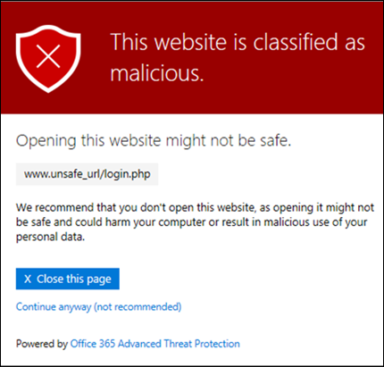

# Sichere Links in Microsoft Defender für Office 365

[!INCLUDE [Microsoft 365 Defender rebranding](../includes/microsoft-defender-for-office.md)]

**Gilt für**
- [Microsoft Defender für Office 365 Plan 1 und Plan 2](https://go.microsoft.com/fwlink/?linkid=2148715)
- [Microsoft 365 Defender](https://go.microsoft.com/fwlink/?linkid=2118804)

> [!IMPORTANT]
> Dieser Artikel richtet sich an Geschäftskunden, die über [Microsoft Defender für Office 365](office-365-atp.md) verfügen. If you're using Outlook.com, Microsoft 365 Family, or Microsoft 365 Personal, and you're looking for information about Safelinks in Outlook, see [Advanced Outlook.com security](https://support.microsoft.com/office/882d2243-eab9-4545-a58a-b36fee4a46e2).

Sichere Links sind ein Feature in [Defender für Office 365,](office-365-atp.md) das die ÜBERPRÜFUNG und Umschreibung eingehender E-Mails im Nachrichtenfluss sowie die Überprüfung von URLs und Links in E-Mail-Nachrichten und anderen Speicherorten per Mausklick ermöglicht. Die Überprüfung auf sichere Links erfolgt zusätzlich zum regulären Antispam- und Ansoftwareschutz in eingehenden [E-Mail-Nachrichten](anti-spam-and-anti-malware-protection.md) in Exchange Online Protection (EOP). Die Überprüfung auf sichere Links kann Ihre Organisation vor bösartigen Links schützen, die bei Phishing und anderen Angriffen verwendet werden.

Der Schutz vor sicheren Links ist an den folgenden Stellen verfügbar:

- **E-Mail-Nachrichten:** Der Schutz sicherer Links für Links in E-Mail-Nachrichten wird durch Richtlinien für sichere Links gesteuert. Es gibt keine Standardmäßige Richtlinie für sichere Links. Um den Schutz von sicheren Links in E-Mail-Nachrichten zu erhalten, müssen Sie eine oder mehrere Richtlinien für sichere **Links erstellen.** Anweisungen finden Sie unter [Einrichten von Richtlinien für sichere Links in Microsoft Defender für Office 365.](set-up-atp-safe-links-policies.md)

  Weitere Informationen zum Schutz sicherer Links für  E-Mail-Nachrichten finden Sie im Abschnitt "Einstellungen für sichere Links für E-Mail-Nachrichten" weiter unten in diesem Artikel.

- **Microsoft Teams** (derzeit in der TAP-Vorschau): Schutz sicherer Links für Links in Teams-Unterhaltungen, Gruppenchats oder von Kanälen wird auch durch Richtlinien für sichere Links gesteuert. Es gibt keine Standardmäßige Richtlinie für sichere Links. Um den Schutz sicherer Links in Teams zu erhalten, müssen Sie eine oder mehrere Richtlinien für sichere **Links erstellen.**

  Weitere Informationen zum Schutz vor sicheren Links in Teams finden Sie im Abschnitt "Einstellungen für sichere Links für [Microsoft Teams"](#safe-links-settings-for-microsoft-teams) weiter unten in diesem Artikel.

- **Office 365-Apps:** Schutz vor sicheren Links für Office 365-Apps ist in unterstützten Desktop-, Mobil- und Web-Aps verfügbar. Sie **konfigurieren** den Schutz sicherer Links für Office 365-Apps in der globalen Einstellung, die sich außerhalb der Richtlinien für sichere Links befinden.  Anweisungen finden Sie unter "Konfigurieren globaler Einstellungen für Einstellungen für [sichere Links in Microsoft Defender für Office 365".](configure-global-settings-for-safe-links.md)

  Der Schutz sicherer Links für Office 365-Apps wird jedoch nur auf Benutzer angewendet, die in aktiven Richtlinien für sichere Links enthalten sind.  Wenn ein Benutzer nicht in einer aktiven Richtlinie für sichere Links enthalten ist, wird der Benutzer in unterstützten Office 365-Apps nicht auf sichere Links geschützt.

  Weitere Informationen zum Schutz sicherer Links in Office 365-Apps finden Sie im Abschnitt "Einstellungen für sichere Links für [Office 365-Apps"](#safe-links-settings-for-office-365-apps) weiter unten in diesem Artikel.

Dieser Artikel enthält ausführliche Beschreibungen der folgenden Typen von Einstellungen für sichere Links:

- **Einstellungen in Richtlinien für sichere** Links: Diese Einstellungen gelten nur für die Benutzer, die in den spezifischen Richtlinien enthalten sind, und die Einstellungen können zwischen den Richtlinien unterschiedlich sein. Zu diesen Einstellungen gehören:

  - [Einstellungen für sichere Links für E-Mail-Nachrichten](#safe-links-settings-for-email-messages)
  - [Einstellungen für sichere Links für Microsoft Teams](#safe-links-settings-for-microsoft-teams)
  - [Listen "Folgende URLs nicht neu schreiben" in Richtlinien für sichere Links](#do-not-rewrite-the-following-urls-lists-in-safe-links-policies)

- **Globale Einstellungen für sichere** Links: Diese Einstellungen werden global konfiguriert, nicht in Richtlinien für sichere Links. Die Einstellungen gelten jedoch nur für Benutzer, die in aktiven Richtlinien für sichere Links enthalten sind. Zu diesen Einstellungen gehören:

  - [Einstellungen für sichere Links für Office 365-Apps](#safe-links-settings-for-office-365-apps)
  - [Liste "Folgende URLs blockieren" für sichere Links](#block-the-following-urls-list-for-safe-links)

In der folgenden Tabelle werden Szenarien für sichere Links in Microsoft 365- und Office 365-Organisationen beschrieben, die Defender für Office 365 enthalten (mit anderen Worten: Fehlende Lizenzierung ist in den Beispielen nie ein Problem).

****

|Szenario|Ergebnis|
|---|---|
|Er ist Mitglied der Marketingabteilung. Der Schutz sicherer Links für Office 365-Apps ist in den globalen Einstellungen für sichere Links aktiviert, und es gibt eine Richtlinie für sichere Links, die für Mitglieder der Marketingabteilung gilt. Anschließend öffnet Er eine PowerPoint-Präsentation in einer E-Mail-Nachricht und klickt dann auf eine URL in der Präsentation.|Dieser wird durch sichere Links geschützt. 
 Dieser ist in einer Richtlinie für sichere Links enthalten, und der Schutz sicherer Links für Office 365-Apps ist aktiviert. 
 Weitere Informationen zu den Anforderungen für den Schutz sicherer Links in Office 365-Apps finden Sie im Abschnitt "Einstellungen für sichere Links für [Office 365-Apps"](#safe-links-settings-for-office-365-apps) weiter unten in diesem Artikel.|
|Chris' Microsoft 365 E5-Organisation hat keine Richtlinien für sichere Links konfiguriert. Chris empfängt eine E-Mail von einem externen Absender, die eine URL zu einer schädlichen Website enthält, auf die er schließlich klickt.|Chris ist nicht durch sichere Links geschützt. 
 Ein Administrator muss mindestens eine Richtlinie für sichere Links erstellen, damit jeder sichere Links in eingehenden E-Mail-Nachrichten schützen kann. Chris muss in die Bedingungen der Richtlinie einbezogen werden, um schutz vor sicheren Links zu erhalten.|
|In Pats Organisation haben keine Administratoren Richtlinien für sichere Links erstellt, aber der Schutz sicherer Links für Office 365-Apps ist aktiviert. Pat öffnet ein Word-Dokument und klickt auf eine URL in der Datei.|Pat ist nicht durch sichere Links geschützt. 
 Obwohl der Schutz sicherer Links für Office 365-Apps global aktiviert ist, ist Pat nicht in aktiven Richtlinien für sichere Links enthalten, sodass der Schutz nicht angewendet werden kann.|
|In Lees Organisation wird in der Liste "Folgende URLs blockieren" in den globalen Einstellungen für sichere `https://tailspintoys.com` Links konfiguriert.  Eine Richtlinie für sichere Links, die Lee enthält, ist bereits vorhanden. Lee empfängt eine E-Mail-Nachricht, die die URL `https://tailspintoys.com/aboutus/trythispage` enthält. Lee klickt auf die URL.|Die URL wird möglicherweise automatisch für Lee blockiert. dies hängt vom verwendeten URL-Eintrag in der Liste und dem verwendeten E-Mail-Client "Lee" ab. Weitere Informationen finden Sie weiter unten in diesem Artikel in der Liste "Blockieren der folgenden [URLs"](#block-the-following-urls-list-for-safe-links) für sichere Links.|
|Sowohl Julia als auch Julia arbeiten für contoso.com. Vor langer Zeit haben Administratoren Richtlinien für sichere Links konfiguriert, die sowohl für Sie als auch für Julia gelten. Julia sendet eine E-Mail an Julia, ohne zu wissen, dass die E-Mail eine schädliche URL enthält.|Julia wird durch sichere **Links** geschützt, wenn die richtlinie für sichere Links, die für sie gilt, so konfiguriert ist, dass sie auf Nachrichten zwischen internen Empfängern angewendet wird. Weitere Informationen finden Sie im Abschnitt "Einstellungen für [sichere Links für E-Mail-Nachrichten"](#safe-links-settings-for-email-messages) weiter unten in diesem Artikel.|

## Einstellungen für sichere Links für E-Mail-Nachrichten

Sichere Links scannen eingehende E-Mails auf bekannte schädliche Hyperlinks. Gescannte URLs werden mit dem Standard-URL-Präfix von Microsoft umgeschrieben: `https://nam01.safelinks.protection.outlook.com` . Nachdem der Link umgeschrieben wurde, wird er auf potenziell schädliche Inhalte analysiert.

Nachdem sichere Links eine URL umgeschrieben haben, bleibt die URL neu geschrieben, auch wenn die Nachricht weitergeleitet oder beantwortet wird. Zusätzliche Links, die der weitergeleiteten oder beantworteten Nachricht hinzugefügt werden, werden nicht umgeschrieben.

Die Einstellungen in Richtlinien für sichere Links, die für E-Mail-Nachrichten gelten, werden in der folgenden Liste beschrieben:

- **Wählen Sie die Aktion für unbekannte potenziell schädliche URLs in** Nachrichten aus: Aktiviert oder deaktiviert die Überprüfung auf sichere Links in E-Mail-Nachrichten. Der empfohlene Wert ist **"On".** Wenn Sie diese Einstellung aktivieren, werden die folgenden Aktionen angezeigt.

  - Die Überprüfung auf sichere Links ist in Outlook (C2R) unter Windows aktiviert.
  - URLs werden umgeschrieben, und Benutzer werden durch den Schutz sicherer Links geroutet, wenn sie in Nachrichten auf URLs klicken.
  - Wenn sie darauf klicken, werden URLs mit einer Liste bekannter schädlicher URLs und der Liste ["Folgende URLs blockieren" überprüft.](#block-the-following-urls-list-for-safe-links)
  - URLs, die nicht über eine gültige Reputation verfügen, werden asynchron im Hintergrund detoniert.

- **Anwenden der Echtzeit-URL-Überprüfung** auf verdächtige Links und Links, die auf Dateien verweisen: Ermöglicht das Scannen von Links in Echtzeit, einschließlich Links in E-Mail-Nachrichten, die auf herunterladbare Inhalte verweisen. Der empfohlene Wert ist aktiviert.

  - **Warten Sie, bis die URL-Überprüfung abgeschlossen ist, bevor Sie die Nachricht zu senden:**

    - Aktiviert: Nachrichten, die URLs enthalten, werden bis zum Abschluss der Überprüfung gehalten. Nachrichten werden erst zugestellt, nachdem die URLs als sicher bestätigt wurden. Dies ist der empfohlene Wert.
    - Deaktiviert: Wenn die URL-Überprüfung nicht abgeschlossen werden kann, stellen Sie die Nachricht trotzdem zu.

- **Anwenden sicherer Links** auf E-Mail-Nachrichten, die innerhalb der Organisation gesendet werden: Aktiviert oder deaktiviert die Überprüfung auf sichere Links für Nachrichten, die zwischen internen Absendern und internen Empfängern innerhalb derselben Exchange Online-Organisation gesendet werden. Der empfohlene Wert ist aktiviert.

- **Benutzerklicks nicht** nachverfolgen: Aktiviert oder deaktiviert das Speichern von Klickdaten für sichere Links für URLs, auf die in E-Mail-Nachrichten geklickt wird. Der Empfehlungswert besteht in der Unauswahl dieser Einstellung (um Benutzerklicks nachverfolgt zu werden).

  Die URL-Klickverfolgung für Links in E-Mail-Nachrichten, die zwischen internen Absendern und internen Empfängern gesendet werden, wird derzeit nicht unterstützt.

- **Benutzer dürfen nicht zur** ursprünglichen URL klicken: Ermöglicht oder  blockiert, dass Benutzer auf die Warnseite zur ursprünglichen URL klicken. Der Empfehlungswert ist aktiviert.

- **Schreiben Sie die folgenden URLs nicht** neu: Lassen Sie DIE URLs so, wie sie sind. Behält eine benutzerdefinierte Liste sicherer URLs bei, die nicht gescannt werden müssen. Die Liste ist für jede Richtlinie für sichere Links eindeutig. Weitere Informationen zur Liste **"UrLs** nicht neu schreiben" finden Sie in den Listen "Die folgenden URLs nicht umschreiben" im Abschnitt "Richtlinien für sichere [Links"](#do-not-rewrite-the-following-urls-lists-in-safe-links-policies) weiter unten in diesem Artikel.

Weitere Informationen zu den empfohlenen Werten für Standard- und Strikte Richtlinieneinstellungen für Richtlinien für sichere Links finden Sie unter Richtlinieneinstellungen für [sichere Links.](recommended-settings-for-eop-and-office365-atp.md#safe-links-policy-settings)

- **Empfängerfilter:** Sie müssen die Empfängerbedingungen und Ausnahmen angeben, die bestimmen, für wen die Richtlinie gilt. Sie können die folgenden Eigenschaften für Bedingungen und Ausnahmen verwenden:

  - **Der Empfänger ist**
  - **Die Empfängerdomäne ist**
  - **Der Empfänger ist Mitglied von**

  Sie können eine Bedingung oder Ausnahme nur einmal verwenden, die Bedingung oder Ausnahme kann aber mehrere Werte enthalten. Bei mehreren Werten derselben Bedingung oder Ausnahme wird ODER-Logik verwendet (z. B. _\<recipient1\>_ oder _\<recipient2\>_). Bei unterschiedlichen Bedingungen oder Ausnahmen wird UND-Logik verwendet (z. B. _\<recipient1\>_ und _\<member of group 1\>_).

- **Priorität:** Wenn Sie mehrere Richtlinien erstellen, können Sie die Reihenfolge angeben, in der sie angewendet werden. Keine zwei Richtlinien können die gleiche Priorität aufweisen, und die Richtlinienverarbeitung endet, nachdem die erste Richtlinie angewendet wurde.

  Weitere Informationen über die Prioritätsreihenfolge und darüber, wie mehrere Richtlinien ausgewertet und angewendet werden, finden Sie unter [Reihenfolge und Priorität beim E-Mail-Schutz](how-policies-and-protections-are-combined.md).

### Funktionsweise von sicheren Links in E-Mail-Nachrichten

Im Folgenden wird die Funktionsweise des Schutzes sicherer Links auf URLs in E-Mail-Nachrichten gezeigt:

1. Alle E-Mails werden über EOP gesendet, wobei IP- und Umschlagfilter, signaturbasierter Schadsoftwareschutz, Antispam- und An malware-Filter vor der Zugestellten Nachricht an das Postfach des Empfängers verwendet werden.

2. Der Benutzer öffnet die Nachricht in ihrem Postfach und klickt auf eine URL in der Nachricht.

3. Sichere Links überprüfen sofort die URL, bevor sie die Website öffnen:

   - Wenn die URL in der Liste "Folgende **URLs** blockieren" enthalten ist, wird eine Warnung zu [blockierten URLs](#blocked-url-warning) geöffnet.

   - Wenn die URL auf eine Website verweist, die  als schädlich ermittelt wurde, wird eine Warnungsseite für schädliche Websites (oder eine andere Warnseite) geöffnet.

   - Wenn die URL auf eine herunterladbare Datei verweist und die **Echtzeit-URL-Überprüfung** auf verdächtige Links und Links, die auf die Dateieinstellung verweisen, in der Richtlinie aktiviert ist, die für den Benutzer gilt, wird die herunterladbare Datei überprüft.

   - Wenn die URL als sicher eingestuft wird, wird die Website geöffnet.

## Einstellungen für sichere Links für Microsoft Teams

> [!IMPORTANT]
> Seit März 2020 befindet sich dieses Feature in der Vorschau und ist nur für Mitglieder des Microsoft Teams Technology Adoption Program (TAP) verfügbar. Informationen zum Veröffentlichungszeitplan finden Sie in der [Microsoft 365-Roadmap.](https://www.microsoft.com/microsoft-365/roadmap?rtc=1&filters=&searchterms=Safe%2CLinks%2CProtection%2Cfor%2CMicrosoft%2CTeams)

Sie aktivieren oder deaktivieren den Schutz sicherer Links für Microsoft Teams in Richtlinien für sichere Links. Insbesondere verwenden Sie die Aktion "Aktion auswählen" für unbekannte oder potenziell schädliche **URLs innerhalb der Microsoft Teams-Einstellung.** Der empfohlene Wert ist **"On".**

Die folgenden Einstellungen in Richtlinien für sichere Links, die für Links in E-Mail-Nachrichten gelten, gelten auch für Links in Teams:

- **Anwenden der Echtzeit-URL-Überprüfung auf verdächtige Links und Links, die auf Dateien verweisen**
- **Benutzerklicks nicht nachverfolgen**
- **Benutzer dürfen nicht zur ursprünglichen URL klicken**

Diese Einstellungen werden im abschnitt "Sichere [Links" für E-Mail-Nachrichten](#safe-links-settings-for-email-messages) erläutert.

Nachdem Sie den Schutz sicherer Links für Microsoft Teams aktiviert haben, werden URLs in Teams mit einer Liste bekannter bösartiger Links abgewensen, wenn der geschützte Benutzer auf den Link klickt (Zeit-nach-Klick-Schutz). URLs werden nicht umgeschrieben. Wenn ein Link als bösartig gefunden wird, haben Benutzer die folgenden Erfahrungen:

- Wenn in einer Teams-Unterhaltung, einem Gruppenchat oder kanälen auf den Link geklickt wurde, wird die Warnseite wie im folgenden Screenshot dargestellt im Standardwebbrowser angezeigt.
- Wenn auf den Link von einer angeheftierten Registerkarte geklickt wurde, wird die Warnseite auf der Benutzeroberfläche von Teams auf dieser Registerkarte angezeigt. Die Option zum Öffnen des Links in einem Webbrowser ist aus Sicherheitsgründen deaktiviert.
- Je nachdem, wie die Einstellung "Benutzer nicht zur ursprünglichen **URL** durchklicken" in der Richtlinie konfiguriert ist, kann der Benutzer auf die ursprüngliche URL klicken ( Trotzdem fortfahren **(nicht empfohlen)** im Screenshot). Es wird empfohlen, die Einstellung "Benutzer nicht zur ursprünglichen **URL** durchklicken" zu aktivieren, damit Benutzer nicht auf die ursprüngliche URL klicken können.

Wenn der Benutzer, der den Link gesendet hat, nicht in einer Richtlinie für sichere Links enthalten ist, in der der Schutz von Teams aktiviert ist, kann der Benutzer auf dem Computer oder Gerät auf die ursprüngliche URL klicken.

Wenn Sie auf **der Warnseite** auf die Schaltfläche "Zurück" klicken, wird der Benutzer an seinen ursprünglichen Kontext- oder URL-Speicherort zurückversennt. Wenn Sie jedoch erneut auf den ursprünglichen Link klicken, werden sichere Links die URL erneut scannen, sodass die Warnseite erneut angezeigt wird.

### Funktionsweise von sicheren Links in Teams

Im Folgenden erfahren Sie, wie der Schutz sicherer Links für URLs in Microsoft Teams funktioniert:

1. Ein Benutzer startet die Teams-App.

2. Microsoft 365 überprüft, ob die Organisation des Benutzers Microsoft Defender für Office 365 enthält und ob der Benutzer in eine aktive Richtlinie für sichere Links aufgenommen wurde, in der der Schutz für Microsoft Teams aktiviert ist.

3. URLs werden zum Zeitpunkt des Klickens für den Benutzer in Chats, Gruppenchats, Kanälen und Registerkarten überprüft.

## Einstellungen für sichere Links für Office 365-Apps

Der Schutz sicherer Links für Office 365-Apps überprüft Links in Office-Dokumenten, keine Links in E-Mail-Nachrichten (er kann jedoch Links in angefügten Office-Dokumenten in E-Mail-Nachrichten überprüfen, nachdem das Dokument geöffnet wurde).

Der Schutz sicherer Links für Office 365-Apps hat die folgenden Clientanforderungen:

- Microsoft 365 Apps oder Microsoft 365 Business Premium.
  - Aktuelle Versionen von Word, Excel und PowerPoint unter Windows, Mac oder in einem Webbrowser.
  - Office-Apps auf iOS- oder Android-Geräten.
  - Visio unter Windows.
  - OneNote in einem Webbrowser.

- Office 365-Apps sind für die Verwendung der modernen Authentifizierung konfiguriert. Weitere Informationen finden Sie unter Funktionsweise der modernen Authentifizierung für [Office 2013-, Office 2016- und Office 2019-Client-Apps.](https://docs.microsoft.com/microsoft-365/enterprise/modern-auth-for-office-2013-and-2016)

- Benutzer sind mit ihren Arbeits- oder Schulkonten angemeldet. Weitere Informationen finden Sie unter ["Anmelden bei Office".](https://support.microsoft.com/office/b9582171-fd1f-4284-9846-bdd72bb28426)

Sie konfigurieren den Schutz sicherer Links für Office 365-Apps in den globalen Einstellungen für sichere Links, nicht in richtlinien für sichere Links. Damit der Schutz sicherer Links für Office 365-Apps angewendet werden kann, muss der Benutzer, der das Office-Dokument öffnet und auf den Link klickt, jedoch in eine aktive Richtlinie für sichere Links aufgenommen werden.

Die folgenden Einstellungen für sichere Links sind für Office 365-Apps verfügbar:

- **Office 365-Anwendungen:** Aktiviert oder deaktiviert die Überprüfung auf sichere Links in unterstützten Office 365-Apps. Der Standardwert und der empfohlene Wert sind **Ein**.

- **Nicht nachverfolgen, wenn** Benutzer auf "Sichere Links" klicken: Aktiviert oder deaktiviert das Speichern von Klickdaten auf sichere Links für URLs, auf die in den Desktopversionen Word, Excel, PowerPoint und Visio geklickt wurde. Der empfohlene Wert ist **"Aus",** was bedeutet, dass Benutzerklicks nachverfolgt werden.

- Benutzer dürfen keine sicheren Links zur ursprünglichen **URL** durchklicken:  Ermöglicht oder verhindert, dass Benutzer auf die Warnseite zur ursprünglichen URL in den Desktopversionen Word, Excel, PowerPoint und Visio klicken. Der Standardwert und der empfohlene Wert sind **Ein**.

Informationen zum Konfigurieren der Einstellungen für sichere Links für Office 365-Apps finden Sie unter "Konfigurieren des Schutzes sicherer Links für [Office 365-Apps".](configure-global-settings-for-safe-links.md#configure-safe-links-protection-for-office-365-apps-in-the-security--compliance-center)

Weitere Informationen zu den empfohlenen Werten für Standard- und Strikte Richtlinieneinstellungen finden Sie unter ["Globale Einstellungen für sichere Links".](recommended-settings-for-eop-and-office365-atp.md#global-settings-for-safe-links)

### Funktionsweise von sicheren Links in Office 365-Apps

Im Folgenden erfahren Sie, wie der Schutz sicherer Links für URLs in Office 365-Apps funktioniert. Die unterstützten Office 365-Apps werden im vorherigen Abschnitt beschrieben.

1. Ein Benutzer meldet sich mit dem Geschäfts- oder Schulkonto in einer Organisation an, die Microsoft 365 Apps oder Microsoft 365 Business Premium umfasst.

2. Der Benutzer öffnet ein Office-Dokument und klickt auf einen Link in einer unterstützten Office-App.

3. Sichere Links überprüfen die URL sofort, bevor sie die Zielwebsite öffnen:

   - Wenn die URL in der Liste enthalten ist, die die Überprüfung auf sichere Links überspringt (die Liste der **folgenden URLs** blockieren), wird eine Warnungsseite für blockierte [URLs](#blocked-url-warning) geöffnet.

   - Wenn die URL auf eine Website verweist, die  als schädlich ermittelt wurde, wird eine Warnungsseite für schädliche Websites (oder eine andere Warnseite) geöffnet.

   - Wenn die URL auf eine herunterladbare Datei verweist und die Richtlinie für sichere Links, die für den Benutzer gilt, so konfiguriert ist, dass Links zu herunterladbaren Inhalten überprüft werden ( Anwenden der **Echtzeit-URL-Überprüfung** auf verdächtige Links und Links, die auf Dateien verweisen), wird die herunterladbare Datei überprüft.

   - Wenn die URL als sicher betrachtet wird, wird der Benutzer zur Website umgenommen.

   - Wenn die Überprüfung auf sichere Links nicht abgeschlossen werden kann, wird der Schutz sicherer Links nicht ausgelöst. In Office-Desktopclients wird der Benutzer gewarnt, bevor er mit der Zielwebsite fortzufahren.

> [!NOTE]
> Es kann mehrere Sekunden dauern, bis zu Beginn jeder Sitzung überprüft wird, ob für den Benutzer sichere Links für Office aktiviert sind.

## Liste "Folgende URLs blockieren" für sichere Links

In **der Liste "Folgende URLs** blockieren" werden die Links definiert, die von der Überprüfung auf sichere Links an den folgenden Speicherorten immer blockiert werden:

- E-Mail-Nachrichten.
- Dokumente in Office 365-Apps in Windows und Mac.
- Dokumente in Office für iOS und Android.

Wenn ein Benutzer in einer aktiven Richtlinie für sichere Links auf einen blockierten Link in einer unterstützten App klickt, wird er zur Warnseite für blockierte [URLs](#blocked-url-warning) weitergeleitet.

Sie konfigurieren die Liste der URLs in den globalen Einstellungen für sichere Links. Anweisungen finden Sie unter ["Konfigurieren der Liste "Blockieren der folgenden URLs".](configure-global-settings-for-safe-links.md#configure-the-block-the-following-urls-list-in-the-security--compliance-center)

**Hinweise**:

- Eine wirklich universelle Liste von URLs, die überall blockiert werden, finden Sie unter "Verwalten der Liste [zulässiger/blockierter Mandanten".](tenant-allow-block-list.md)

- Grenzwerte:
  - Die maximale Anzahl von Einträgen beträgt 500.
  - Die maximale Länge eines Eintrags beträgt 128 Zeichen.
  - Alle Einträge dürfen 10.000 Zeichen nicht überschreiten.

- Schließen Sie am Ende der URL keinen Schrägstrich ( `/` ) ein. Verwenden Sie z. B. `https://www.contoso.com` nicht `https://www.contoso.com/` .

- Eine Nur-Domänen-URL (z. B. oder ) blockiert alle `contoso.com` `tailspintoys.com` URLs, die die Domäne enthalten.

- Sie können eine Unterdomäne blockieren, ohne die vollständige Domäne zu blockieren. Blockiert beispielsweise alle URLs, die die Unterdomäne enthalten, aber keine `toys.contoso.com*` URLs, die die vollständige Domäne `contoso.com` enthalten.

- Sie können bis zu drei Platzhalter ( `*` ) pro URL-Eintrag angeben.

### Eintragssyntax für die Liste "Folgende URLs blockieren"

Beispiele für die Werte, die Sie eingeben können, und deren Ergebnisse werden in der folgenden Tabelle beschrieben:

****

|Wert|Ergebnis|
|---|---|
|`contoso.com` 
 oder 
 `*contoso.com*`|Blockiert die Domäne, Unterdomänen und Pfade. Beispielsweise , `https://www.contoso.com` `https://sub.contoso.com` und `https://contoso.com/abc` werden blockiert.|
|`https://contoso.com/a`|Blockiert, `https://contoso.com/a` aber keine zusätzlichen Unterpfade wie `https://contoso.com/a/b` .|
|`https://contoso.com/a*`|Blöcke `https://contoso.com/a` und zusätzliche Unterpfade wie `https://contoso.com/a/b` .|
|`https://toys.contoso.com*`|Blockiert eine Unterdomäne (in diesem Beispiel), lässt jedoch Klicks auf andere `toys` Domänen-URLs zu (z. B. `https://contoso.com` oder `https://home.contoso.com` ).|
|

## Listen "Folgende URLs nicht neu schreiben" in Richtlinien für sichere Links

> [!NOTE]
> Wenn Ihre Organisation Richtlinien für sichere Links verwendet, sind die folgenden **URLs** nicht neu zu schreiben die einzige unterstützte Methode für Phishingtests von Drittanbietern.

Jede Richtlinie für sichere Links enthält die folgende **URLs-Liste,** die Sie verwenden können, um URLs anzugeben, die nicht von der Überprüfung sicherer Links umgeschrieben werden. Mit anderen Worten, die Liste ermöglicht Benutzern, die in der Richtlinie enthalten sind, den Zugriff auf die angegebenen URLs, die andernfalls durch sichere Links blockiert würden. Sie können verschiedene Listen in verschiedenen Richtlinien für sichere Links konfigurieren. Die Richtlinienverarbeitung wird beendet, nachdem die erste Richtlinie (wahrscheinlich die höchste Priorität) auf den Benutzer angewendet wurde. Daher wird nur eine **Liste der folgenden URLs** auf einen Benutzer angewendet, der in mehreren aktiven Richtlinien für sichere Links enthalten ist.

Informationen zum Hinzufügen von Einträgen zur Liste in neuen oder vorhandenen Richtlinien für sichere Links finden Sie unter ["Richtlinien](set-up-atp-safe-links-policies.md#use-the-security--compliance-center-to-create-safe-links-policies) für sichere Links erstellen" oder "Richtlinien für sichere [Links ändern".](set-up-atp-safe-links-policies.md#use-the-security--compliance-center-to-modify-safe-links-policies)

**Hinweise**:

- Die folgenden Clients erkennen die folgenden **URLs-Listen** in Richtlinien für sichere Links nicht umschreiben. Benutzer, die in die Polizei aufgenommen wurden, können basierend auf den Ergebnissen der Überprüfung auf sichere Links in den folgenden Clients am Zugriff auf die URLs blockiert werden:

  - Microsoft Teams
  - Office Web Apps

  Eine wirklich universelle Liste von URLs, die überall zulässig sind, finden Sie unter "Verwalten der Liste [zugelassener/blockierter Mandanten".](tenant-allow-block-list.md)

- Erwägen Sie das Hinzufügen häufig verwendeter interner URLs zur Liste, um die Benutzerfreundlichkeit zu verbessern. Wenn Sie beispielsweise über lokale Dienste wie Skype for Business oder SharePoint verfügen, können Sie diese URLs hinzufügen, um sie von der Überprüfung auszuschließen.

- Wenn Sie die folgenden **URLs-Einträge** in Ihren Richtlinien für sichere Links bereits nicht umgeschrieben haben, überprüfen Sie die Listen, und fügen Sie nach Bedarf Platzhalter hinzu. Beispielsweise verfügt Ihre Liste über einen Eintrag wie, und Sie entscheiden sich später dafür, `https://contoso.com/a` Unterpfade wie `https://contoso.com/a/b` hinzuzufügen. Anstatt einen neuen Eintrag hinzuzufügen, fügen Sie dem vorhandenen Eintrag einen Platzhalter hinzu, damit er zu `https://contoso.com/a/*` wird.

- Sie können bis zu drei Platzhalter ( `*` ) pro URL-Eintrag angeben. Platzhalter enthalten explizit Präfixe oder Unterdomänen. Beispielsweise ist der Eintrag nicht identisch mit , da Personen Unterdomänen und Pfade in der angegebenen `contoso.com` `*.contoso.com/*` Domäne besuchen `*.contoso.com/*` können.

### Eintragssyntax für die Liste "Folgende URLs nicht umschreiben"

Beispiele für die Werte, die Sie eingeben können, und deren Ergebnisse werden in der folgenden Tabelle beschrieben:

****

|Wert|Ergebnis|
|---|---|
|`contoso.com`|Ermöglicht den Zugriff `https://contoso.com` auf, aber nicht auf Unterdomänen oder Pfade.|
|`*.contoso.com/*`|Ermöglicht den Zugriff auf eine Domäne, Unterdomänen und Pfade (z. B. `https://www.contoso.com` `https://www.contoso.com` , oder `https://maps.contoso.com` `https://www.contoso.com/a` ). 
 Dieser Eintrag ist grundsätzlich besser als , da er potenziell betrügerische Websites `*contoso.com*` wie oder `https://www.falsecontoso.com``https://www.false.contoso.completelyfalse.com`|
|`https://contoso.com/a`|Ermöglicht den Zugriff `https://contoso.com/a` auf , aber keine Unterpfade wie `https://contoso.com/a/b`|
|`https://contoso.com/a/*`|Ermöglicht den Zugriff `https://contoso.com/a` auf und Unterpfade wie `https://contoso.com/a/b`|
|

## Warnungsseiten von sicheren Links

Dieser Abschnitt enthält Beispiele für die verschiedenen Warnseiten, die durch den Schutz sicherer Links ausgelöst werden, wenn Sie auf eine URL klicken.

Beachten Sie, dass mehrere Warnseiten aktualisiert wurden. Wenn die aktualisierten Seiten noch nicht angezeigt werden, werden Sie in Kürze folgen. Die aktualisierten Seiten enthalten ein neues Farbschema, weitere Details und die Möglichkeit, trotz der angegebenen Warnung und Empfehlungen mit einer Website fortzufahren.

### Benachrichtigung zur Überprüfung in Bearbeitung

Die angeklickte URL wird von sicheren Links überprüft. Möglicherweise müssen Sie ein paar Minuten warten, bevor Sie den Link erneut versuchen.

Die ursprüngliche Benachrichtigungsseite sieht wie hier aus:

### Warnung zu verdächtigen Nachrichten

Die angeklickte URL war in einer E-Mail-Nachricht, die anderen verdächtigen Nachrichten ähnelt. Es wird empfohlen, die E-Mail-Nachricht zu überprüfen, bevor Sie mit der Website fortfahren.

### Warnung bei Phishingversuchen

Die angeklickte URL war in einer E-Mail-Nachricht enthalten, die als Phishingangriff identifiziert wurde. Aus diesem Grund werden alle URLs in der E-Mail-Nachricht blockiert. Es wird empfohlen, nicht mit der Website fortzufahren.

### Warnung zu bösartigen Websites

Die angeklickte URL verweist auf eine Website, die als bösartig identifiziert wurde. Es wird empfohlen, nicht mit der Website fortzufahren.

Die ursprüngliche Warnseite sieht wie hier aus:

### Warnung zu blockierten URLs

Die angeklickte URL wurde manuell von einem Administrator in Ihrer Organisation blockiert (die Liste "Folgende **URLs** blockieren" in den globalen Einstellungen für sichere Links). Der Link wurde nicht von sicheren Links überprüft, da er manuell blockiert wurde.

Es gibt mehrere Gründe, warum ein Administrator bestimmte URLs manuell blockieren würde. Wenn Sie der Meinung sind, dass die Website nicht blockiert werden sollte, wenden Sie sich an Ihren Administrator.

Die ursprüngliche Warnseite sieht wie hier aus:

### Fehlerwarnung

Es ist ein Fehler aufgetreten, und die URL kann nicht geöffnet werden.

Die ursprüngliche Warnseite sieht wie hier aus:

